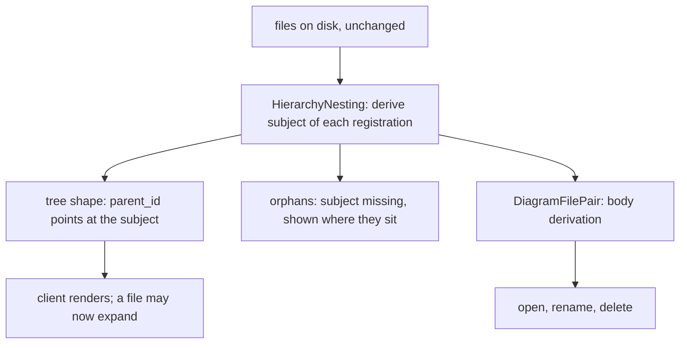

# Design Document

## Overview

An `.adp` registration stops being a sibling of the document it registers and becomes a child of it. The subject — a file, or a folder — becomes the primary entry; the registrations hang beneath it; activating the subject opens its diagram.

Nothing on disk moves. This is a **presentation of a relationship the filesystem already encodes**, and Requirement 11.2 makes that a hard constraint rather than a nicety: adopting this spec renames, moves and rewrites nothing. What changes is which entry the hierarchy reports as a child of which, plus the naming convention that lets one subject carry several registrations.

Three things drive the design:

1. **Derivation currently runs the wrong way for a qualified name.** `DiagramFilePair.SiblingPathFor` is `StripExtension(fileName) + extension`, so `test.first.adp` derives `test.first.dsl` — a file that does not exist. Every caller of `SiblingOf` and `BodyOf` inherits it, which is why rename, delete and open break together.
2. **A file has never been allowed children.** `hierarchy.proto` states it in as many words, and the client hard-codes it in nine places.
3. **The relationship becomes many-to-one.** `IsOwned` exists so that one of several registrations cannot carry a shared body off during rename or delete. With several registrations derived from one subject, "owned" needs restating rather than reinterpreting.

## Steering Document Alignment

### Technical Standards (tech.md)

* **Commands.** Rename and delete stay `ICommand`s with inverses. The inversion of rename direction (Requirement 5) changes what the inverse restores, not whether there is one.
* **Context.** Requirement 7 declines single-click activation because the context service, the property grid and the context menu all read selection. That is a steering rule deciding a UX question, and it is recorded rather than re-litigated.
* **Backend layout.** New POCOs under `_Model/`, one entity per file, `_logger` per class.

### Project Structure (structure.md)

* **Dependency direction.** The hierarchy is core. It learns that a file may have children; it learns nothing about diagram types beyond what `IDiagramDefinitionCatalog` already tells it.

## Code Reuse Analysis

### Existing Components to Leverage

* **`DiagramFilePair`** — already the single place that knows a registration may have a body, already consulted by rename, delete and open. It stays that place; its derivation gains a case.
* **`DiagramFileName`** — already sanitises base names. Qualifiers go through the same `Sanitise` (Requirement 1.4) rather than a second validator.
* **`DiagramFileRouter`** — already decides claimants from `IDiagramDefinitionCatalog` plus what is on disk, and already distinguishes a shared extension. The nesting decision is the same *kind* of decision and is made on the same side.
* **`ResolveWithin`'s path-escape guard** — preserved unchanged (Requirement 2.5). A `body:` header is user-editable text; following it outside the project root would turn an `.adp` into an arbitrary-file read.
* **`EntryCreated` / `EntryRemoved` / `EntryRenamed` / `EntryUpdated`** — the existing watch messages carry most of Requirement 10.

### Example sets

`ExampleRegistrationTests` walks every tracked `.adp` under `src/diagrams/*/examples/**` and is written **before** the rename, so it is a regression test rather than a description of what the rename produced. It then gains the nesting assertions. 26 of the 39 registrations have no test opening them today, so this closes a gap wider than the rename itself.

### Verification of the findings this design builds on

Requirement 4.3 asks for a .NET behaviour to be **confirmed by test rather than by assertion**. It was, and the assertion in the requirements is wrong — in both halves, inverted:

| | Requirements 4.3 states | Measured on .NET 10 |
|---|---|---|
| `Path.GetExtension(".adp")` | `""` | **`.adp`** |
| `Path.GetFileNameWithoutExtension(".adp")` | `".adp"` | **`""`** |

This matters because it moves the risk. Extension-based reasoning about a bare `.adp` is **safe** — `GetExtension` identifies it correctly — while *name*-based reasoning is the hazard, because the base name is empty. That is the same hazard Requirement 4.4 already identifies in `DiagramFileName.StripExtension(".adp")`, and it is the only one. The audit 4.3 asks for is therefore narrower than feared and points at a different set of call sites than the requirement expected. A test pinning both behaviours ships with this work, so the correction cannot decay back into folklore.

The other findings were checked and hold: `SiblingPathFor` derives `test.first.dsl`; `Entry.has_children` is documented "always false for a file"; `EntryKind` has only `FILE` and `FOLDER`; `RenameEntryCommandHandler` drives from the registration via `SiblingOf(sourcePath)`.

**The client audit is larger than reported.** Requirement 9 names six folder-gated sites. There are **nine** in `ExplorerTreePanel.tsx`, and 9.1 asks for exhaustive rather than symptom-driven:

| Line | Site | Consequence if missed |
|---|---|---|
| 63–64 | sort comparator, folders before files | Requirement 9.5's stated order |
| 219 | child loading | a file's children never load |
| 325 | icon selection | Requirement 9.4's distinguishable icon |
| 593 | activation also toggles expansion | activating a subject would not reveal its registrations |
| 716 | keyboard: collapse / move to parent | Requirement 9.3 |
| 735 | keyboard: expand / move to first child | Requirement 9.3 |
| 886–887 | `isExpandable = isFolder && hasChildren` | the gate everything else follows |
| 893 | `aria-expanded` | Requirement 7.6 |
| 954 | children render | children never drawn |

Three of these — the sort, the icon and the activation-toggle — are exactly the sites a manual pass would find last, because each fails as "looks slightly wrong" rather than as "does not work".

## Architecture



`HierarchyNesting` is a pure function from a folder listing plus the definition catalog to a parent assignment. It is the only new concept, it holds no state, and it is testable without a filesystem watcher or a connection.

### Answer to open question 2: no new `EntryKind`

**A registration is reported as `FILE`. The enum is not widened.** Three reasons:

1. **A registration *is* a file.** `EntryKind` answers "what is this thing", and adding `REGISTRATION` would make it answer "what is this thing, and how should it be presented" — two questions in one field, which is how an enum starts needing a second enum.
2. **The nesting decision is already derivable where routing is made.** `DiagramFileRouter` decides claimants from the catalog plus what is on disk and carries nothing on the entry to do it. The parent assignment is the same kind of decision from the same inputs, so nothing has to travel to make it.
3. **The client needs no new value to tell them apart.** A registration is precisely *an entry whose parent is a file*. The client already has `parent_id` and already has the parent's kind, because it drew the parent. Icons (9.4) and activation (7.3) key off that.

The cost of the alternative is a contract change every client must tolerate; the cost of this choice is that "is this a registration" is a derived question rather than a stated one. That is the right way round here, because the derivation is one comparison and the contract is forever.

### Answer to open question 1: derivation, and the `my.config.dsl` ambiguity

The ambiguity is real: subject `my.config.dsl` with registration `my.config.adp` is shape-identical to subject `my.dsl` with qualifier `config`. Existence-first resolves it but makes resolution depend on disk state, so a file created later can silently re-point an existing registration.

**The rule, in order:**

1. **A `body:` header wins.** Unchanged, and Requirement 2.3 already says so.
2. **An unqualified `<base>.adp` derives `<base><extension>`.** Exactly today's behaviour, so every existing project resolves exactly as it did (Requirement 11.1).
3. **A qualified `<base>.<qualifier>.adp` derives `<base><extension>`**, per Requirement 2.1.
4. **Where both `<base>.<qualifier><extension>` and `<base><extension>` exist**, the longer match wins — existence-first — **and the ambiguity is reported as a diagnostic** naming both candidates.

The silent re-point is designed out rather than accepted: **when ADP creates a qualified registration it writes an explicit `body:` header.** Derivation then never decides for a file ADP made, and rule 4 applies only to hand-authored files — where the diagnostic tells the user the name is ambiguous and the header is how to say which they meant. Requirement 2.3 already made the header the escape hatch; this makes ADP use its own escape hatch rather than leaving it for the user to discover after a surprise.

### Answer to open question 3: the first registration is not renamed

**`test.adp` stays `test.adp` when `test.second.adp` is added.** Requirement 11.2 says no file is renamed as a consequence of adopting this spec, and renaming a file the user did not touch — as a side effect of creating a *different* file — is exactly the surprise that rule exists to prevent. It also gives Requirement 3.4 its stable order for free: **the unqualified registration sorts first and is the default** (Requirement 7.2); qualified ones follow, ordered by qualifier with `StringComparer.Ordinal`, which does not vary by locale.

### Answer to open question 4: one registration per folder

**A folder carries at most one.** Requirement 1.3 fixes the name as exactly `.adp`, which leaves no room for a qualifier, and every name that could be invented — `.first.adp` — is a hidden file whose base name is `.first`, ambiguous with a file subject of that name. A second is refused with a clear error (Requirement 4.5) rather than left as an accident of naming, and the error names the escape: a folder wanting several diagrams registers them against files inside it.

### Answer to open question 5: deleting a subject cascades

**Deleting a subject deletes its registrations, and the action says how many before it runs.** A registration whose subject is gone describes nothing, and Requirement 8's orphan state exists for subjects that vanish *outside* ADP — not as a resting place ADP deliberately creates. Requirement 6.2 is unaffected and preserved: deleting one registration deletes neither the subject nor a body another registration still references, which is exactly what `IsOwned` guarantees today.

### Ownership, restated for many-to-one (Requirement 2.4)

`IsOwned` today means "this registration derived the body from its own name, so it may carry it". With several registrations deriving from one subject that is no longer sufficient, so ownership splits into two questions:

* **Which operations act on the subject?** Rename (5.1) and delete (6.1). They act on the subject and cascade to the set.
* **Which act on a single registration?** Rename of a qualifier (5.2), delete of one registration (6.2), and open (7.3). None of them touches the subject or the body.

The rule that falls out: **a body is only ever carried by an operation on the subject**, never by an operation on a registration. That is the same protection `IsOwned` provides, expressed for a set rather than a pair, and it means `SiblingOf`'s ownership test keeps its meaning where it is still asked.

## Components and Interfaces

### `DiagramRegistrationName` (core, new, `_Model`)

The naming convention in one place: parse `<base>.<qualifier>.adp`, `<base>.adp` and `.adp` into a subject base, an optional qualifier and a folder-scoped flag; compose one back. Qualifier validation delegates to `DiagramFileName.Sanitise` (Requirement 1.4). Folder-scoped names are explicitly excluded from sibling derivation, which is Requirement 4.4's guard expressed as a type rather than as a check every caller remembers.

### `DiagramFilePair` (core, edited)

`SiblingPathFor` gains the qualified case and the ordered rule above. `BodyOf` reports the ambiguity of rule 4 alongside the resolved path, so the diagnostic has something to carry. `IsRegistrationFile` is unchanged — it uses `EndsWith` and is correct for `.adp`.

### `HierarchyNesting` (core, new, static)

The pure function: given a folder's entries and the catalog, which entries are registrations, which subject does each name, which are orphans. No I/O. This is where Requirement 3.5 is enforced — a registration appears under its subject and nowhere else.

### `HierarchyModel` (core, edited)

Applies the parent assignment when listing and when a watch event arrives. Maintains `has_children` for files, and emits `EntryUpdated` when a subject gains its first or loses its last registration (Requirements 10.1, 10.2).

### `RenameEntryCommandHandler` (core, edited)

Direction inverts. Renaming a **subject** collects every registration nested under it, computes each new name preserving its qualifier, and refuses the whole operation if any target exists (5.4) — the atomicity of 5.3 is achieved by **checking every target before moving anything**, so the failure mode is a refusal rather than a half-renamed set. Renaming a **registration** changes only its qualifier and refuses a change to the subject portion with an explanation (5.2). Renaming a folder that carries `.adp` moves nothing, since the registration has no base name (5.5).

### `DeleteEntryCommandHandler` (core, edited)

Cascade per open question 5, with the count reported before the action runs.

### `ExplorerTreePanel.tsx` (client, edited)

All nine sites in the table above, changed together. `isExpandable` becomes `node.hasChildren` without the folder test; the sort places folders first, then files, with a file's registrations nested beneath it rather than sorted among its siblings; icons distinguish a registration by its parent being a file.

## The example sets

The repository ships 39 tracked `.adp` files across five example sets, and every one of them is written in the pre-nesting shape this spec replaces. They are the project's own demonstration material, so leaving them in the old shape would mean the feature's best illustration is also its counter-example.

| Example set | `.adp` files | What it demonstrates |
|---|---|---|
| `c4/examples/reference/architecture` | 7 | **The multi-registration case, in the wild** |
| `c4/examples/industrial-plant/architecture` | 6 | The same shape, second instance |
| `azure-pipeline/examples/example 1` | 8 + 3 nested | A registration whose base name equals a sibling **directory** |
| `wardley-map/examples/example 2` | 13 | The single-registration form at volume |
| `wardley-map/examples/example 1` | 1 | The simplest pair |
| `ansible-structure/examples/example 1/infrastructure` | 1 | **The folder-scoped case, in the wild** |

### Why Requirement 11.2 does not forbid this

Requirement 11.2 says no file on disk is renamed, moved or rewritten as a consequence of adopting this spec, and a reader could take that to forbid touching the examples. It does not, and the distinction is worth stating rather than leaving to be noticed:

**11.2 protects users' projects from an automatic migration.** Its subject is a project ADP opens — adopting this spec must not rewrite a user's files behind their back, and Requirement 11.3 reinforces that even a rename the design chooses must be an explicit consequence of an explicit user action.

**The example sets are this repository's own authored content.** Renaming them is a deliberate editorial act by this spec, performed once, in a commit, by a person or an agent — the same category as editing a fixture or a readme. It is not a migration, nothing runs on open, and no user project is touched. Nothing in this design gives ADP a code path that renames a user's registrations except through the rename command a user invokes.

### `c4/examples/reference/architecture` is the feature's own best demonstration

Seven registrations sit as flat siblings, six of them relating to one body:

| File | Body today | Nests under |
|---|---|---|
| `courier.adp` | owns `courier.dsl` | `courier.dsl` |
| `landscape.adp` | `body:` → `architecture/courier.dsl` | `courier.dsl` |
| `containers.adp` | `body:` → `architecture/courier.dsl` | `courier.dsl` |
| `api-components.adp` | `body:` → `architecture/courier.dsl` | `courier.dsl` |
| `parcel-scanned.adp` | `body:` → `architecture/courier.dsl` | `courier.dsl` |
| `production.adp` | `body:` → `architecture/courier.dsl` | `courier.dsl` |
| `code-level.adp` | type `c4/code` — a **known** type with no `Extension` | stays where it sits |

This is exactly the shape Requirement 1 exists for, already on disk, and it shows the problem plainly: nothing in that listing says the six belong to `courier.dsl` rather than to each other.

**The rename**: `courier.adp` keeps its name — it is the unqualified form and therefore the default (open question 3, and Requirement 7.2's stable order). The five header-pointed ones become `courier.landscape.adp`, `courier.containers.adp`, `courier.api-components.adp`, `courier.parcel-scanned.adp` and `courier.production.adp`. Their `body:` headers **stay**, because they remain correct and because Requirement 2.3 makes the header authoritative over derivation — this is precisely the case where the header is doing real work, and removing it in favour of a derivation would be replacing a fact with an inference.

**`code-level.adp` is left exactly as it is**, and understanding *why* it has no body matters more than the fact that it has none.

An earlier draft of this design called it an unknown type and cited Requirement 8.4. That was wrong. `c4/code` **is** in the catalog — declared in the implemented c4 module's own `Definitions` array, as a three-argument definition with no `Extension` and no `Build`. So `DefinitionOf` finds it; `HasDocumentSibling` is `Extension.Length > 0` and therefore false; and `BodyOf` returns null at *that* guard rather than at the unknown-type one. Same end state, different branch.

The distinction decides which test proves what. A test written from `code-level.adp` exercises the `HasDocumentSibling` branch while appearing to cover the unknown-MIME branch — so Requirement 8.4 would end up with no coverage at all while looking covered, which is worse than having none. **And no example provides a genuine 8.4 case:** all 39 tracked registrations name a MIME that is in the catalog, checked across every file rather than sampled. Requirement 8.4 therefore needs a *fixture* with a deliberately unknown first line, not an example.

**A case the requirements do not name.** A known type that keeps no body is real, shipped and sitting in the reference example, and Requirement 8 covers only orphans and unknown types. It deserves its own criterion — `c4/code` is a C4 level that exists as a catalog entry without an editor, and a registration naming one is neither broken nor unknown. Raised here rather than assumed, since adding a requirement is the reviewer's call. `industrial-plant` is the same shape and takes the same treatment.

### `azure-pipeline/examples/example 1` — a name collision worth testing

The set contains `templates.adp`, `templates.yml` **and** a directory named `templates/` holding three further registrations. So a registration's derived body (`templates.yml`) and a sibling directory share a base name.

Nothing in the design breaks here — `templates.adp` nests under `templates.yml` because that is the file its name derives, and the directory is a separate entry that happens to be similarly named. But it is the case where a nesting implementation that reasons about names rather than about resolved entries would put the registration under the *directory*, so it earns a test rather than a note. The three registrations inside `templates/` nest under their own siblings there, unaffected.

### `ansible-structure` — the folder case, and why the example does not adopt it

`examples/example 1/infrastructure/structure.adp` declares `ansible/structure`, a type that reads a project tree rather than a document and therefore has no body. It is the natural candidate for Requirement 4's bare `.adp`.

**The example keeps `structure.adp` and does not become `.adp`.** Two reasons, and the second is the load-bearing one:

1. Requirement 4.1 makes a bare `.adp` register *the folder it sits in*. `structure.adp` sits in `infrastructure/`, so renaming it to `.adp` would say the diagram is about `infrastructure/` — which is true, and would be a real improvement to the example.
2. But it would also make this repository's only demonstration of a folder-scoped diagram a **hidden file** on every Unix-like system and in most file dialogs. An example that a reader cannot see when they list the directory is a poor example, whatever its correctness.

So the folder form is specified, tested against a fixture, and *not* adopted by the example set — with a line in the example's readme saying the bare form exists and why this example does not use it. Requirement 4.5's one-per-folder limit is tested against a fixture for the same reason. If the reviewer would rather the example demonstrate the folder form, that is a one-file change and the reasoning above is what it argues against.

### Updated **and tested** — what exists today

"Updated + tested" is two requirements, and the second is the one that goes missing. The coverage today is uneven, and the gap is larger than the rename:

| Example set | Covered by |
|---|---|
| `c4` (both sets, 13 files) | `Examples.Tests.cs` — enumerates `*.adp`, resolves each registration, asserts the model is clean and the project validates |
| `azure-pipeline` (11 files) | **nothing** |
| `wardley-map` (14 files) | **nothing** |
| `ansible-structure` (1 file) | **nothing** |

**26 of the 39 registrations are opened by no test at all.** So the rename has a safety net for exactly the third of the material that c4 covers, and none for the rest — which means renaming them on the strength of a careful eye is precisely the move this repository has already learned not to make.

The design's answer, in order:

1. **Add the safety net first, against the current names.** A shared `ExampleRegistrationTests` fixture — one theory over every tracked `.adp` in `src/diagrams/*/examples/**` — asserting that each resolves to a definition in the catalog, that a registration with a body resolves to a file that exists, and that a known type with no `Extension` resolves to no body without erroring. Requirement 8.4's unknown-type case is covered by a **fixture** rather than by an example, because no example provides one. Run it before any rename, so it is a regression test rather than a description of whatever the rename produced.
2. **Then rename**, and watch the same test.
3. **Then extend it** with the nesting assertions: each registration nests under the subject it names, the unqualified form is the default, `code-level.adp` remains an unnested entry with no body, and the `templates.adp` / `templates/` pair assigns to the file rather than to the directory.

That ordering is the whole point. A test written after the rename asserts that the rename did what it did; a test written before it asserts that the rename did not change what these files mean.

Because the fixture walks `src/diagrams/*/examples/**` rather than a hard-coded list, an example set added by a later spec is covered on arrival — which is the same seam-shaped answer Requirement 12.4 asks for elsewhere in this spec.

## Data Models

Two proto changes, both **additive** — no field is removed, no enum value added, no existing number reused, so an older client keeps working (Requirement 11.4):

```proto
// Corrected: a file's has_children is true when it carries at least one nested registration.
bool has_children = 6;

message EntryUpdated {
  ShortGuid entry_id = 1;
  bool has_children = 2;
  ShortGuid parent_id = 3;  // new: re-parenting, for Requirement 10.3
}
```

`EntryUpdated.parent_id` answers Requirement 10.3 directly. Re-parenting an orphan when its subject appears could be expressed as remove-then-create, but that discards the entry's identity — and a client holding a selection on that entry would lose it. Carrying the new parent on an update preserves identity, which is what makes 10.4's ordering guarantee hold.

## Error Handling

1. **Ambiguous derivation** — resolved by the ordered rule, reported as a diagnostic naming both candidate bodies, with the `body:` header named as the fix.
2. **Orphaned registration** (Requirement 8) — listed where it sits on disk, distinguishable, and re-parented by `EntryUpdated.parent_id` when the subject appears.
3. **Rename collision** (5.4) — refused, naming the conflict; nothing is moved, because every target is checked first.
4. **Rename changing the subject portion** (5.2) — refused with an explanation, never a silent re-point.
5. **Second folder registration** (4.5) — refused, naming the one-per-folder rule and the alternative.
6. **Unknown diagram type** (8.4) — unchanged: no definition, therefore no body, and not an error. Distinct from a **known type with no `Extension`**, which resolves a definition and fails the `HasDocumentSibling` guard instead — the same end state down a different branch, and the two need separate tests.

## Testing Strategy

### Unit Testing

* `DiagramRegistrationName`: every form, including `.adp`, and rejection of a qualifier containing a separator.
* `DiagramFilePair`: `test.first.adp` → `test.dsl`; `test.adp` → `test.dsl` unchanged; **the `my.config.dsl` ambiguity in both directions**, per Requirement 2.2 — with `my.config.dsl` present and absent.
* **The .NET path behaviours above**, pinned as a test so the corrected facts cannot decay.
* `HierarchyNesting`: nesting, orphans, and 3.5's no-duplicate rule.
* `RenameEntryCommandHandler`: both directions, the refusal of 5.2, and 5.3's atomicity — asserted by making one target exist and checking that **nothing** moved.

### Integration Testing

* An existing single-registration project opening, renaming and deleting exactly as before (Requirement 11.1), which is the regression that matters most.
* Watch-driven nesting: create a registration, see it arrive nested and the subject's `has_children` pushed; remove the last, see it pushed false; create a missing subject, see the orphan re-parent.

### Client Testing

`ExplorerTreePanel.test.tsx` covers expansion, collapse, child loading, keyboard expand/collapse/first-child/parent, and `aria-expanded` for an expandable file (Requirement 12.5).

### Verification

`dotnet test --solution EtAlii.Adp.slnx` checked **by exit code**, since a zero-test run exits 5 while printing no failures (Requirement 12.1), and `dotnet format style --verify-no-changes --severity info` exiting zero (12.2).

## Deviations and notes

* **Corrected after peer review.** An earlier draft cited `code-level.adp` as Requirement 8.4's unknown-type case in the wild. It is not: `c4/code` is a known catalog entry with no `Extension`. The conclusion — leave the file alone — was right, the reasoning was wrong, and the reasoning is what decides which branch a test exercises.
* **Revised after review.** The reviewer asked that all examples and samples be updated *and tested*. The examples section above is the answer; the finding that prompted the most change is that 26 of the 39 tracked registrations are currently opened by no test, so the rename had no safety net until one is added first.

* **Requirement 4.3's stated .NET behaviour is wrong**, in both halves and inverted. Recorded above with the measurement rather than corrected silently, because the requirement asked for a test and the test disagrees with the requirement. The consequence is smaller than feared and points elsewhere, so the audit it asks for should follow the corrected fact.
* **Requirement 9 undercounts the client sites**: nine, not six. The three additions — sort, icon, activation-toggle — are the ones that fail quietly.
* **Move (6.3)** is checked against the nesting model and any gap recorded; this spec adds no move.
