# Design Document

## Overview

Three refinements bring the ansible-structure canvas level with its siblings: drag-to-reposition with positions stored in the `.adp` registration's `layout:` block, adoption of the shared canvas appearance with honestly themed colours, and the shared scrollbar overlay. Every mechanism this design needs already exists and is proven: the layout block has four consumers (databricks built it, helm shipped it with a reposition test proving the full cycle including byte-identical body files, rdf uses it), the shared stylesheet has three, the scrollbars four. This module becomes one more consumer of each, and the only edits outside `src/diagrams/ansible-structure/` are one central token definition and the two client stylesheets' shared import bookkeeping described below.

One requirement criterion is already satisfied by work outside this spec: Requirement 5.2 asked for a central `--color-warning` token, and the rdf-diagram work added exactly that (both themes, `src/client/src/index.css`) in commit 3e130bba, needing a caution colour for its truncation banner. Two modules reaching the same conclusion independently is the best evidence the token belonged in the theme. This spec does not add it again; a later reader should see a satisfied requirement here, not a missing task.

## Steering Document Alignment

### Technical Standards (tech.md)

- **Layout-in-.adp rule**: positions are metadata enriching a subject whose own files carry no layout; they go to the `.adp` through core's `RegistrationLayout`, never into Ansible's files.
- **Commands rule**: the module's single new edit - a reposition - dispatches the core `SetRegistrationLayoutCommand` and is one undo away. No module-owned commands are introduced.
- **Core never learns the module**: everything resolves through existing seams; core code is untouched except for completing the half-built `--color-surface-raised` token in the central theme file, which is client styling, not diagram knowledge.

### Project Structure (structure.md)

- All module changes stay under `src/diagrams/ansible-structure/` (`backend/`, `client/`), following the established file layout; `_Model/` types stay in the module namespace.
- The module's `example 1` and its combined replica under `src/examples/diagrams/ansible-structure/` stay in sync per the replication rule; the other thirteen showcase folders are untouched (Requirement 7).

## Code Reuse Analysis

### Existing Components to Leverage

- **`RegistrationLayout` (core, `EtAlii.Adp.Backend.Hierarchy`)**: `Read` for stored positions, `Apply` for the computed-overlaid-by-authored merge, byte-preservation of everything above the `layout:` block. Unchanged.
- **`SetRegistrationLayoutCommand` + handler (core)**: the undoable write, inverse restoring the prior entry or its absence. Unchanged.
- **`AnsibleWatchedFolder` / `AnsibleProjectStore` (module)**: the registration lives inside the registered folder, so a layout write returns through the same settle-and-re-read watcher path as any other change - helm's finding, which transfers here directly because ansible's watcher takes every path under the folder with content filters on. No second watcher, no new event plumbing: dragged and computed positions share one render path.
- **`DatabricksSession.MoveElementToAsync` (pattern)**: read-only-without-history refusal, no-registration refusal, `edge:` id-prefix refusal, then dispatch. Replicated module-locally, not shared - modules do not depend on modules.
- **`@client/canvas/canvas.css`**: the shared chrome/element/connection appearance; the module composes `canvas-*` classes and deletes its duplicating rules.
- **`CanvasScrollbars` + `scrollGeometry` (`@client/canvas/scroll`)**: the shared overlay, wired as the timeline and databricks canvases wire it.
- **helm-charts design, "no core changes - verified, not assumed"**: the folder-subject-meets-layout-block intersection (one-line registration tolerated by the layout reader, router handing the same file as document and registration, default-refused overridable move member) was verified in code there and is not re-verified here; contradicting evidence found during implementation is a finding to report.

### Integration Points

- **History**: `AnsibleSessionFactory` resolves the project's `IHistoryStack` from `IHistoryStackStore.Get(rootPath)` - the same join every arranged module uses - and passes it to the session; a null stack keeps the diagram read-only with the house sentence.
- **gRPC**: the existing `MoveElement` call with a `Position` reaches the session's `MoveElementToAsync` through core's `DiagramService`; no contract change.
- **Theme**: `--color-surface-raised` gets its two definitions in `src/client/src/index.css`; `--color-warning` is already there (rdf, 3e130bba).

## Architecture

The reposition round trip, end to end - note that the write re-enters the diagram through the watcher, not through a local echo:

```mermaid
flowchart LR
    DRAG[Canvas drag ends] -->|MoveElement + position| SESS[AnsibleSession.MoveElementToAsync]
    SESS -->|SetRegistrationLayoutCommand| HIST[Project history - one undo]
    HIST -->|writes layout: block| ADP[.adp inside the registered folder]
    ADP -->|folder watcher settles| STORE[AnsibleProjectStore re-read]
    STORE -->|Changed| RENDER[Mapper: computed layout + RegistrationLayout.Apply overlay]
    RENDER -->|deltas| ALL[Every open session of the folder]
```



### Modular Design Principles

- **Single File Responsibility**: the session gains dispatch, the mapper gains the overlay, the factory gains the wiring - each in its own file; the client splits drag state handling into the canvas component exactly as `DatabricksCanvas` does.
- **Component Isolation**: `AnsibleLayout.Compute` stays pure and untouched; authored positions are applied after it, so computed layout remains testable on its own.
- **Utility Modularity**: no new shared utilities; the rule of three says a fourth copy of the session-side dispatch guard block is still cheaper than a premature abstraction, and that judgement is recorded here deliberately.

## Components and Interfaces

### AnsibleSession (modified)

- **Purpose:** gains the reposition path while staying the folder's live read otherwise.
- **Interfaces:** overrides `MoveElementToAsync(elementId, x, y)`: refuse when no history stack (read-only sentence); refuse `edge:`-prefixed ids ("an edge follows its endpoints"); otherwise dispatch `SetRegistrationLayoutCommand(adpPath, elementId, x, y)` and return the result's error or empty. `MoveElementAsync` (reparent) keeps today's refusal wording.
- **Dependencies:** constructor gains the `.adp` path and an optional `IHistoryStack`. The remark saying the missing history parameter is a design statement is rewritten - the statement it made is no longer true.
- **Reuses:** `DatabricksSession`'s dispatch shape; core command.

### AnsibleElementMapper (modified)

- **Purpose:** overlays authored positions onto the computed layout before viewport filtering and diffing.
- **Interfaces:** `Visible(project, graph, viewport)` gains a stored-positions parameter (`IReadOnlyDictionary<string, RegistrationPosition>`); box centers move to authored positions via `RegistrationLayout.Apply(computedCenters, stored)`; edges keep following their endpoints' final positions.
- **Dependencies:** unchanged; `AnsibleLayout.Compute` untouched.
- **Reuses:** core `RegistrationLayout.Apply` - stale ids are dropped by Apply on read exactly as everywhere else.

### AnsibleSessionFactory (modified)

- **Purpose:** wires the two new session inputs.
- **Interfaces:** unchanged (`IDiagramSessionFactory.Open`); internally resolves the `.adp` path it already derives the folder from, and the history stack from `IHistoryStackStore.Get(rootPath)`.
- **Dependencies:** gains `IHistoryStackStore` (registered in `ServiceCollection.AddAnsibleStructure`).
- **Reuses:** `HelmSessionFactory`'s identical wiring.

### AnsibleCanvas.tsx (modified)

- **Purpose:** gains drag-to-reposition, the shared scrollbars, and the shared chrome classes; keeps pan, selection, context menus.
- **Interfaces:** drag state (`dragRef` + preview) mirroring `DatabricksCanvas` - a 3px threshold separates click from drag, edges are not draggable, drop calls `moveElementTo`; `CanvasScrollbars` rendered from `scrollExtentOf(content bounds, view)`; the component's remark that "there is no drag" is removed with the limitation.
- **Dependencies:** `useAnsibleStream` gains `moveElementTo` issuing the existing `MoveElement` call with a position, mirroring `useDatabricksStream`.
- **Reuses:** `DatabricksCanvas` drag shape, `CanvasScrollbars`, `scrollGeometry`.

### register.ts + ansible-structure.css (modified)

- **Purpose:** the shared appearance, honestly themed.
- **Interfaces:** `register.ts` imports `@client/canvas/canvas.css` before the module stylesheet, as timeline/dependency-graph/databricks do. `ansible-structure.css` deletes every rule the shared stylesheet already states, composes `canvas-*` classes in the component, and keeps only what is genuinely ansible's: per-play tinting, kind accents, dashed dynamic edges.
- **Colour discipline:** the six per-play hues become module-owned custom properties declared once (a `.ansible-canvas` scope block), applied via `color-mix` against `--color-surface-raised`; a `prefers-color-scheme: dark` block retunes individual hues where the dark surface needs it (the index.css pattern). No colour literal appears outside these custom-property definitions; `--color-warning` usages lose their literal fallbacks now the token exists. Tinting wraps beyond six plays, preserving today's modulo behaviour.
- **Reuses:** the databricks derivation shape (accent mixed against themed surface).

### index.css (central, one token)

- **Purpose:** completes the half-built `--color-surface-raised` token - referenced eleven times across three files (once by index.css itself, twice by wardley, eight by ansible), defined nowhere.
- **Interfaces:** two definitions: dark adopts the fallback index.css already uses (`rgb(255 255 255 / 0.06)` - a faint lift on a dark surface); light gets the mirror-image faint dark tint (implementation picks the exact value against both themes, starting from ansible's own light fallback `rgb(0 0 0 / 6%)`).
- **Consequence:** wardley's two usages start resolving too - an appearance fix those rules already asked for, noted here so nobody hunts for why wardley shifted a shade.

## Data Models

### The layout block (existing core format, no changes)

```
application/vnd.etalii.adp.diagram; type=ansible/structure
layout:
  playbook:site.yml: 120 80
  role:common: 340 200
```

- Keys are the module's existing stable element ids: `playbook:<relative-path>`, `play:<relative-path>#<index>`, `role:<name>`, `taskfile:<relative-path>`, `inventory:<relative-path>`, `vars:<relative-path>`. Edges (`edge:...`) never appear - repositioning them is refused.
- Everything above the block is preserved byte for byte (core contract).

### The positional play id, answered at design level

A play's id is `play:<relative-path>#<index>` because a play's identity in Ansible genuinely is positional: plays run in file order, may be unnamed, and may share names - a name-keyed id would break on the ordinary case, which is the worse failure.

**What a user sees when plays are reordered:** stored positions stay bound to the index slot, so after an external reorder the play nodes keep their authored places while their contents swap - play two now sits where play one was authored. Nothing overlaps, nothing is lost, the diagram stays consistent, and one drag per affected play re-authors it.

**Whether anything warns:** nothing does, deliberately. Detecting a semantic reorder would mean diffing successive reads of another ecosystem's files, which this module deliberately never interprets beyond structure - and the same silent position-forfeit already applies to every renamed file here and in helm. The behaviour is documented user-facingly by a `tests.md` manual check exercising exactly this scenario, so the consequence is pinned and expected rather than discovered.

## Error Handling

### Error Scenarios

1. **Reposition with no registration path** (opened without one): refused with "there is nowhere to store a position" - the databricks sentence; nothing is written.
2. **Reposition of an edge**: refused with a reason; edges follow their endpoints.
3. **Read-only session (no history stack)**: refused with the house read-only sentence.
4. **A hand-mangled layout line**: core ignores malformed entries; the diagram opens; the entry is dropped on the next write.
5. **A stored id the folder no longer produces** (play removed, file renamed): ignored on read, dropped on the next layout write - core behaviour, already tested there.
6. **The layout write races a folder change**: core writes the `.adp` atomically; the folder watcher coalesces the burst; the settled re-read renders the final state.
7. **The registered folder is deleted while open**: unchanged existing behaviour; the layout path adds nothing to lose.

## Testing Strategy

### Unit Testing

- `AnsibleSession`: dispatches `SetRegistrationLayoutCommand` with the `.adp` path and element id; refuses edges, refuses without history, refuses without a registration; reparent refusal wording unchanged.
- `AnsibleElementMapper`: an authored position overrides the computed center; unauthored elements keep computed positions; a stale stored id changes nothing; edges track moved endpoints.
- `AnsibleSessionFactory`: passes the `.adp` path and the root's history stack.
- Client: drag past the threshold calls `moveElementTo` with canvas-unit coordinates and a click does not (databricks test shape); scrollbars appear when content exceeds the viewport and track panning (timeline test shape); chrome composes `canvas-*` classes while ansible class names stay (the class-composition assertion, so existing selectors and tests keep holding).

### Integration Testing

- The helm reposition-cycle shape, for ansible: open a diagram over a fixture folder, move a node through the session, assert the `.adp` gained the layout entry, assert every file inside the folder is byte-identical, reopen and assert the overlay, undo and assert the prior bytes are back.
- The watcher return path: a layout write lands and the open session re-renders with the authored position, through the ordinary settle-and-re-read route.

### End-to-End Testing

- `tests.md` entries (the established manual-check format, each naming this spec): the drag-reposition-reopen cycle through the real client; scrollbar behaviour on a large example; both themes inspected for the ansible canvas with no accidental-fallback colours; and the play-reorder scenario above, pinning what the user sees.

### Documentation

- `docs/diagrams.md`: the `ansible/structure` row stays ⚗️ Prototype, but its "read-only" parenthetical is amended at implementation time to say positions are authored in the `.adp` while the Ansible files stay untouched - the catalog must not contradict the shipped behaviour.
