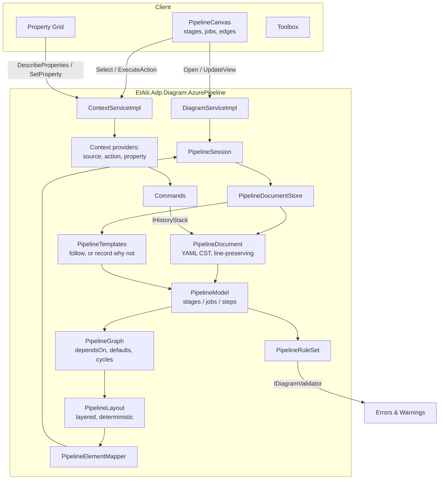
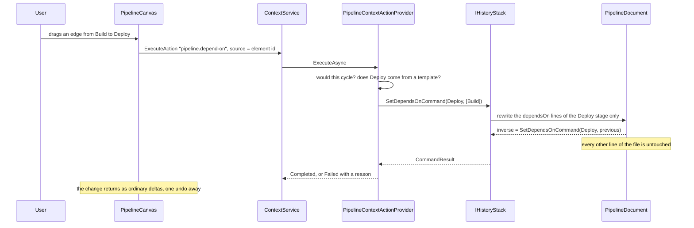

# Design Document

## Overview

The module lives at `diagrams/azure-pipeline/`, registers through the seams the three shipped types already use, and adds nothing to core beyond the two Requirement 2 names. Its shape is closest to C4 — a text document it did not invent, a computed layout, a validator with a lot to say — and differs from C4 in one way that drives most of this design: **the document is executable configuration the repository already owns**, so the writer is the riskiest component here, not the parser.

Six pieces do the work:

1. **`PipelineDocument`** — a YAML concrete syntax tree. Holds every line as read, and rewrites lines rather than re-serialising (Requirement 3.1–3.3).
2. **`PipelineModel`** — stages, jobs, steps and the dependency graph derived from `dependsOn`, in Azure's own vocabulary (Requirements 4, 6).
3. **`PipelineTemplates`** — resolves `template:` and `extends:` within the workspace, and records honestly what it could not follow (Requirement 5).
4. **`PipelineLayout`** — a layered left-to-right arrangement of the stage graph, pure and deterministic (Requirement 7).
5. **`PipelineElementMapper`** — model to core `Element`/`Delta` (Requirement 11).
6. **`PipelineRuleSet`** — a pure function from model to `DiagramProblem`s (Requirement 10).

Around them sit the registrations: a document factory, a session factory, a context source resolver, an action provider, a toolbox provider, a property provider, a validator, and the command handlers — each one line in `AddAzurePipeline`.

## Steering Document Alignment

### Technical Standards (tech.md)

* **Specifying a diagram type** — the four aspects it mandates are here: file format (`PipelineDocument`, `PipelineFileKind`), visualization (`PipelineLayout`, the canvas), toolbox (`PipelineToolboxProvider`), context actions and commands (`PipelineContextActionProvider`, `Commands/`).
* **Commands** — every document change is an `ICommand` with an inverse, dispatched through `IHistoryStack`. Nothing writes YAML outside a command handler.
* **Context** — element selectability is one `IContextSourceResolver`; what can be done to one is one `IContextActionProvider`; what it shows is one `IContextPropertyProvider`. No bespoke RPC.
* **gRPC call shapes** — the module adds no service. It rides `DiagramService.Open` + `UpdateView` and `ContextService`'s unary calls.
* **Implementation order** — the task breakdown follows model → persistence → wire → UI → logic.
* **No nested types**; `_Model` for POCOs; one entity per file; Serilog through a `private static readonly ILogger` per class.

### Project Structure (structure.md)

```
src/diagrams/azure-pipeline/
├── api/                  azure-pipeline.proto  (the element payload)
├── backend/
│   ├── EtAlii.Adp.Diagram.AzurePipeline/
│   │   ├── Commands/     one file per command + handler pair
│   │   ├── _Model/       PipelineStage, PipelineJob, PipelineStep, PipelineEdge, ...
│   │   └── *.cs          document, templates, layout, mapper, rules, session, providers
│   └── EtAlii.Adp.Diagram.AzurePipeline.Tests/
│       └── Fixtures/     real pipelines, for the round-trip corpus
└── client/               the canvas renderer
```

Core stays ignorant: everything resolves by `DiagramOrigin` or `ContextScope`.

## Code Reuse Analysis

### Existing Components to Leverage

* **`IDiagramSessionFactory` / `IDiagramSession`** — the open/baseline/viewport/delta lifecycle, exactly as `C4Session` implements it.
* **`IDiagramDocumentFactory`** — writes the empty document for Add-on-a-folder (Requirement 1.3).
* **`IContextSourceResolver`, `IContextActionProvider`, `IDiagramToolboxProvider`, `IDiagramValidator`** — four seams, each already carrying a second and third implementation, so this is the fourth of each rather than a new pattern.
* **`IContextPropertyProvider` + `ContextPropertyDefinition`** — merged with the property grid. `ReadOnlyReason` is what Requirement 13.6–13.7 needs, and `ContextPropertyResolver` refuses a write to a read-only property backend-side, so the module's markings are enforced rather than advisory.
* **`ICommandHandler` / `IHistoryStack` / `CommandResult.Inverse`** — undo comes free.
* **`DiagramProblem` / `DiagramProblemLineLocation`** — the line-located problem Requirement 10.8 wants already exists.
* **`C4Parser` / `C4Document`** — not reused as code (the formats differ), but reused as *shape*: a line-preserving document with surgical rewrites is a solved problem in this repository, and the same discipline applies.

### Integration Points

* **`DiagramDefinition`** gains `SharedExtension` (Requirement 2.1–2.2).
* **`DiagramFileRouter.RouteBody`** gains one guard (Requirement 2.2).
* **`AddDiagramContextActionProvider`** gains the file target and the filtered option tree (Requirement 2.3).
* **`Program.cs`** gains `builder.Services.AddAzurePipeline(builder.Configuration);`.
* **`docs/diagrams.md`** row moves through its states.

## Architecture



The one loop worth reading twice: a command edits `PipelineDocument` (lines), the model and graph are re-derived, the layout recomputed, and the mapper emits deltas. **The document is the single writer**; nothing else touches the file.

### Flow: dragging a dependency edge



### Why the document is a CST and not a model

A YAML round trip through a model-and-serialise loop is lossy in ways that matter here: key order, comment placement, quoting style, anchors, indentation width, and blank lines are all preserved by the file and all discarded by a typical serialiser. For a diagram file that is untidy; for a pipeline it is a diff that reviewers must read and a chance to break a build.

`PipelineDocument` therefore holds `IReadOnlyList<PipelineLine>` — the file as read — plus an index from model elements to the line ranges that declare them. An edit is a splice of one range. Anything the module does not model is simply never spliced, which is how Requirement 3.3 is satisfied by construction rather than by effort.

This is the same decision `wardley-map` made and `C4Document` implements; the third instance is deliberate rather than accidental.

### Why the model does not resolve expressions

`${{ }}` is evaluated at compile time and `$[ ]` at run time, both with information ADP does not have. A stage whose `condition` is an expression may or may not run; a `dependsOn` built from a parameter may name anything. The model therefore carries expressions as **opaque text** and marks the elements that depend on them indeterminate, which the canvas and the grid both surface (Requirements 3.4, 8.4, 13.9). Nothing guesses.

### Modular Design Principles

* **Single file responsibility**: parsing, template resolution, graph derivation, layout, mapping and validation are six components, each testable from a string.
* **No diagram-type knowledge in core**: the two core changes are a boolean on a record and a guard in a router.
* **Dependency direction**: the module references `EtAlii.Adp.Diagram` and `EtAlii.Adp.Backend`; neither references it.

## Components and Interfaces

### `PipelineDocument` (module, new)

* **Purpose**: the file as lines, plus the splice operations the commands need.
* **Interface**: `Parse(string text)`; `Text`; `Lines`; `Replace(range, lines)`; `Insert(at, lines)`; `Remove(range)`.
* **Guarantees**: an unedited document returns its input byte-for-byte, line endings included; a splice touches only its range.

### `PipelineFileKind` (module, new, static)

* **Purpose**: the one question Requirement 2 asks — is this file a pipeline? — answered from the `.adp` registration, never from content.
* **Note**: deliberately *not* a content sniffer. Requirement 2.3 settles recognition by asking the user once.

### `PipelineTemplates` (module, new)

* **Purpose**: resolve `template:` and `extends:` to files inside the workspace.
* **Behaviour**: a path escaping the workspace, or one depending on a parameter, is not followed and is recorded as `PipelineTemplateUnresolved` with the reason (Requirements 5.3, and the Security rule).
* **Reuse**: one resolved template is cached per store, so two diagrams including it read it once.

### `PipelineModel`, `PipelineGraph` (module, `_Model` and new)

* **Purpose**: Azure's own vocabulary, and the dependency graph Requirement 6 defines.
* **The defaults are the subtle part**, and they are opposite for the two levels: a stage with no `dependsOn` depends on the stage declared before it; a **job** with no `dependsOn` depends on nothing. `PipelineGraph` applies both, and the resolved dependency is what the property grid shows (Requirement 13.2), so the implicit is visible.

### `PipelineLayout` (module, new)

* **Purpose**: positions for the stage graph, and for jobs within an expanded stage.
* **Algorithm**: longest-path layering, then ordering within a layer by declaration order to keep it stable, then a fixed pitch. Deterministic, and independent of anything but the graph — so renaming a step moves nothing (Requirement 7.2).
* **Testability**: `IReadOnlyDictionary<string, Point>` from a graph. No I/O.

### `PipelineElementMapper` (module, new)

* Elements: `azure-devops/pipeline+stage`, `+job`, `+step`, `+edge`, `+template`. Ids are document paths — `stage:Build`, `stage:Build/job:Test`, `stage:Build/job:Test/step:2` — so an id survives an edit elsewhere (Requirement 11.3).
* Collapsed stages ride `Group`/`Ungroup`; edits ride `Add` (Requirements 8.6, 11.5).

### `PipelineContextPropertyProvider` (module, new)

* `Scope => ContextScope.DiagramElement`.
* `DescribeAsync` returns the rows of Requirements 13.2–13.5, grouped: **Identity**, **Ordering**, **Execution**.
* `ReadOnlyReason` is empty only for `displayName`, `dependsOn` and `enabled`; every other row carries a sentence, and a template-sourced element carries the template's path in every row.
* `SetAsync` dispatches the same command the canvas uses.
* `dependsOn` is a `Line` today; **this module's implementation adds `CONTEXT_PROPERTY_EDITOR_CHOICE` with candidates**, per Requirement 13.14 — a backward-compatible proto enum value, candidates on `ContextProperty`, and a select in the panel.

### Core changes

#### `DiagramDefinition` (edited)

```csharp
public sealed record DiagramDefinition(
    DiagramOrigin Origin,
    string Title,
    string Description = "",
    string Extension = "",
    bool SharedExtension = false);
```

`SharedExtension` says the extension is too common to claim on sight. Defaulted false, so all fifty-seven existing definitions compile and behave unchanged.

#### `DiagramFileRouter.RouteBody` (edited)

One guard before the claimant search: a body whose extension is declared shared by every claimant routes to `NotADiagram` unless an `.adp` sits beside it. `.mm`, `.owm` and `.dsl` are untouched.

#### `AddDiagramContextActionProvider` (edited)

* Offered on a **file** as well as a folder and the root, when at least one definition declares that file's extension and no `.adp` registration exists beside it (Requirements 2.3, 2.7, 2.8).
* On a file, `DiagramOptionTree.Build` is given only the matching definitions, and the action's label says *register* rather than *add*.
* `CommitAsync` on a file writes the `.adp` only — no body, no name prompt, since the name is the file's own.

## Data Models

### `azure-pipeline.proto` (module)

```proto
message PipelineElementPayload {
  string name = 1;              // stage/job name, or a step's identifying value
  string display_name = 2;
  PipelineElementKind kind = 3; // STAGE | JOB | DEPLOYMENT_JOB | STEP | EDGE | TEMPLATE
  string condition = 4;         // empty when absent; an expression is carried verbatim
  bool indeterminate = 5;       // its presence or ordering depends on an expression
  bool from_template = 6;
  string template_path = 7;     // set when from_template
  bool enabled = 8;
  int32 multiplicity = 9;       // 1, or what a matrix/parallel strategy produces
  string source_id = 10;        // EDGE only
  string target_id = 11;        // EDGE only
  PipelineEdgeCondition edge_condition = 12; // ALWAYS | ON_SUCCESS | ON_FAILURE | CUSTOM
}
```

### Backend records (`_Model`)

`PipelineLine`, `PipelineStage`, `PipelineJob`, `PipelineStep`, `PipelineEdge`, `PipelineTemplateReference`, `PipelineTemplateUnresolved`, `PipelinePool`, `PipelineStrategy`, `PipelineMetrics`.

## Error Handling

1. **Unparseable YAML** — the diagram opens as unavailable, naming file and line; every edit action is withheld, since nothing may be rewritten (Requirement 3.6).
2. **A template that cannot be followed** — the element is shown unexpanded with the reason; reported as information, not an error (Requirements 5.3, 10.7).
3. **A template path escaping the workspace** — refused and reported; never read.
4. **A `dependsOn` naming nothing** — the edge renders broken and the validator reports it; the file is not touched.
5. **A cycle** — reported, the rest of the graph still renders, and any edit that would create one is refused (Requirements 6.6, 9.4).
6. **An edit to a template-sourced element** — refused by the provider, and the action was not offered; the property row was read-only and `ContextPropertyResolver` would refuse the write regardless.
7. **The file changes on disk** — reloaded, pushed as deltas, not undoable (Requirement 11.7).

## Testing Strategy

### Unit Testing

* **`PipelineDocument.Tests`** — the headline property: a corpus of real pipelines parsed and written back **byte-identically**, including files using constructs the model ignores. Then splices: one edit changes one range and nothing else.
* **`PipelineGraph.Tests`** — the stage default (sequential), the job default (parallel), `dependsOn: []`, fan-out/fan-in, dangling names, cycles.
* **`PipelineLayout.Tests`** — determinism, stability under a non-graph edit, no overlap at the schema's 256-job limit.
* **`PipelineRuleSet.Tests`** — one test per rule of Requirement 10, each from a YAML string.
* **`PipelineTemplates.Tests`** — followed, unfollowable, and escaping-the-workspace.
* **`PipelineContextPropertyProvider.Tests`** — the editable three are editable, everything else carries a reason, a template-sourced element is read-only throughout, and an absent property is absent rather than empty.
* **Commands** — each handler's inverse restores the document byte-for-byte.

### Integration Testing

* **`AzurePipelineFlow.Tests`** — register a `.yml` through Add-on-a-file, open it, receive the baseline, execute a dependency edit, see the deltas and the rewritten file.
* **`SharedExtensionRouting.Tests`** — a bare `.yml` routes nowhere; the same file with an `.adp` beside it opens; a `.mm` still routes bare.
* **`AddOnAFileFlow.Tests`** — Add is offered on a `.yml` and lists only matching types; not offered on a `.txt`; not offered on a file that already has an `.adp`.

### End-to-End Testing

A manual pass recorded in `tests.md`: open a real pipeline, collapse and expand a stage, drag an edge, undo it, and confirm `git diff` shows only the `dependsOn` lines.

## Deviations and notes

**Deviation 1 — the `Choice` editor does not exist yet, and this module adds it.** Requirement 13.14 specifies `dependsOn` as a picker over the other stage names. `ContextPropertyEditor` is `Line | Text | Toggle`; the property-grid work declined to add a fourth with no consumer, correctly. This module is that consumer, so the enum value, the candidates field and the panel's select land here. Until they do, `dependsOn` is a `Line` — safe, because `SetAsync` refuses an invalid value, but poorer.

**Note — `Definitions` is plural now.** `Diagram.Definitions` is an array; this module declares one entry.

**Note — run status stays out.** Requirement 8.8 excludes it; nothing in this design reaches toward a network call, and the module makes none.

**Out of scope, deliberately**: task inputs, variables, resources and triggers as editable properties (Requirement 9.1); multi-select for `dependsOn` (Requirement 13.14 leaves the encoding undecided); and Classic (non-YAML) pipelines, which have no file to read.
