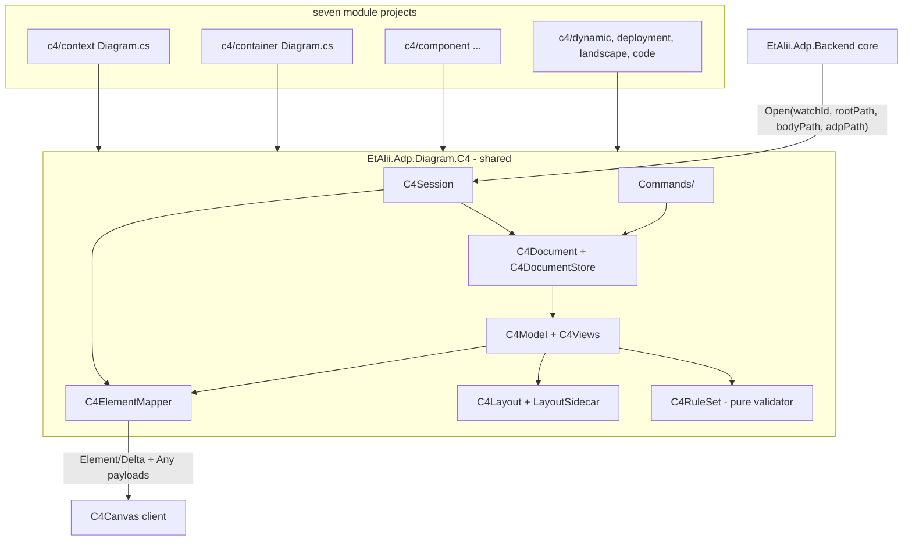

# Design Document

## Overview

Seven `.adp` types, one engine. The seven scaffolded module projects (`EtAlii.Adp.Diagram.C4Context` … `C4SystemLandscape`) stay as thin as they are today — each keeps its `Diagram.Definition` and registers the shared factories under its own origin — and everything real lives in one shared library, `EtAlii.Adp.C4`, plus one client canvas. That is the design expression of Requirement 1's "one model, seven views": the modules differ only in which **view kind** they bind, and the view kind is data, not code.

The model is a Structurizr DSL document (`.dsl`), parsed into a `C4Document` that — like `MindmapDocument` before it — remembers the exact bytes it was given and edits lines rather than regenerating text (Requirement 3). Views resolve against that model; layout is computed in the backend with authored positions layered on top from a sidecar (Requirement 8); the C4 rules are a pure validator reporting through core's `IDiagramValidator` (Requirement 10); and every element, relationship and boundary reaches the canvas through the existing `Element`/`Delta` vocabulary with `Any` payloads, exactly as the mindmap does.

One core change carries all of this, and it is the one the requirements name (Requirement 2.4): an `.adp` registration file learns to **name** its body document and its view, instead of core deriving the body from the `.adp`'s own base name.

## Prerequisites and blockers

### 1. The `.adp` header extension and routing change (in scope, core, small)

Today `DiagramFilePair.SiblingOf` derives the body path (`SiblingPathFor`: same folder, same base name, the type's extension), and `IDiagramSessionFactory.Open(watchId, rootPath, bodyPath)` never sees the `.adp` file at all. Two views over one model cannot exist under that shape. The change, in full:

* The `.adp` format ADP owns grows optional header lines after the MIME line: `body: <project-relative path>` and `view: <view key>`. No header — today's files — means today's behaviour, byte for byte.
* `DiagramFilePair` resolves `body:` when present (refusing a path that escapes the project root, Requirement 2.4), falling back to `SiblingPathFor`.
* `IDiagramSessionFactory.Open` gains the registration path: `Open(watchId, rootPath, bodyPath, adpPath)`. Core hands both paths over and interprets neither; the C4 module reads `view:` from the `.adp` itself. The mindmap and every other factory ignores the new argument.

This is the only core edit, and `DiagramServiceImpl`'s session registry needs no change: it already keys sessions by `(watchId, bodyPath)`, so two tabs over one model share document change events for free (Requirement 1.5).

### 2. `c4/code` is blocked on a class-notation type (declared, not worked around)

Requirement 11.4 delegates the Code level's notation to `uml/class`, `mermaid/class` or `erd/entity-relationship`, none of which is implemented. The `C4Code` module therefore ships as: definition, document factory refusal, and an open-state message naming the dependency (Requirement 11.7). Its tasks in tasks.md are limited to exactly that; the day a class notation lands, binding it is a follow-up task in *that* type's spec.

### 3. The Toolbox host is still a placeholder

As with the mindmap, the module registers its `IDiagramToolboxProvider` data (Requirement 12) even though the panel that renders it arrives separately. Nothing here waits on it: every toolbox item is backed by a context action that also works from the menu and keyboard.

### 4. `!include` splits a model across files

The DSL allows a workspace to pull in other files. ADP reads them to build a complete model, but writes only the primary document: an edit that would have to land inside an included file is refused with a message naming that file (see Error Handling). Preserving-verbatim (Requirement 3.3) applies to the primary document's `!include` line itself.

## Steering Document Alignment

### Technical Standards (tech.md)

* **Diagram storage** — an established text format (Structurizr DSL), the backend the sole file owner, ADP's own data in a sidecar (`<name>.layout.json`), never smuggled into the `.dsl`.
* **Specifying a diagram type** — the four aspects map to components below: file format (`C4Document`, `C4DocumentStore`, `C4DocumentFactory`, the router change), visualization (`C4Layout`, `C4ElementMapper`, `C4Canvas`), toolbox (`C4ToolboxProvider`), context actions and commands (`C4ContextActionProvider`, `Commands/`).
* **Commands** — every mutation in Requirement 13.1 is an `ICommand` with an inverse on the project's `IHistoryStack`, dispatched exactly as `MindmapSession` dispatches `MoveNodeCommand`.
* **Context** — `C4ContextSourceResolver` makes elements selectable by `element_id` within the selected file's chain, the shape `MindmapContextSourceResolver` established.
* **Frontend-backend synchronization** — baseline + deltas over `DiagramService.Open`, viewport by `UpdateView`, both unchanged.

### Project Structure (structure.md)

* Shared library at `src/diagrams/c4/backend/EtAlii.Adp.C4/` with `EtAlii.Adp.C4.Tests/` beside it, and the wire payloads at `src/diagrams/c4/api/c4.proto` — the mindmap's folder convention, applied to the family. **Named outside the `EtAlii.Adp.Diagram.*` namespace on purpose**: that prefix is the module naming convention, and a discovery test asserts every such assembly declares a `Diagram.Definition`. A shared engine declares none, so it is named out of the convention rather than weakening the guard.
* The seven existing scaffolds keep their locations and names; each references the shared library. Dependency direction: seven modules → shared library → core. Core references none of them.
* Client code at `src/client/src/shell/panels/c4/` — `C4Canvas.tsx`, `useC4Stream.ts`, `c4Model.ts` — mirroring `panels/mindmap/`.

## Code Reuse Analysis

### Existing components to leverage

* **`DiagramDefinition` / discovery** — already publishes all seven; only `Extension = ".dsl"` is added to each (Requirement 2.2).
* **`IDiagramDocumentFactory` + `CreateDiagramFileCommandHandler`** — the Add flow creates `.adp` + empty `.dsl` with no change to the flow itself (Requirement 1 of the requirements' Add story).
* **`IDiagramSessionFactory` / `IDiagramSession` / `DiagramServiceImpl`** — sessions, baseline, deltas, viewport, all reused; the registry's `(watchId, bodyPath)` keying is what makes multi-view synchronization free.
* **`MindmapElementMapper`'s viewport discipline** — partial-overlap intersection and the one-hop partner rule (deliver what an on-screen element's connectors attach to) are lifted as-is into `C4ElementMapper`; for C4 the "partner" is the other end of a relationship and the enclosing boundary.
* **`IHistoryStack` / `AddCommands`** — the undo machinery, unchanged.
* **`IContextActionProvider`, `IContextSourceResolver`, `IDiagramToolboxProvider`** — the three registration seams every module fills.
* **Client**: `DiagramViewContext` (zoom/fit), `TabbedPane`/`DiagramTabsPanel`, `ContextMenu` + `toMenuGroups`, the `useMindmapStream` pattern for `useC4Stream`.
* **`AddDiagramContextActionProvider`** — extended, not duplicated, for the "Add view" action on `.dsl` files (Requirement 2.7): same dialog, filtered to the `c4` vendor group, creating only the `.adp` and appending a view declaration.

### Integration points

* **`DiagramFileRouter` / `DiagramFilePair`** — the header change of Prerequisite 1; `RouteBody` for a bare `.dsl` resolves to the family through the shared extension and defaults to the document's first declared view (Requirement 2.6).
* **`DiagramPanel.tsx`** — routes `mimeType.startsWith("c4/")` (except `c4/code`) to `C4Canvas`; `c4/code` renders the dependency notice of Prerequisite 2.
* **`RootFolderWatcher`** — external edits to `.dsl` or the sidecar reload the store and push deltas, as `.mm` edits do today.

## Architecture



The load path: router resolves `.adp` → body `.dsl` + view key → `C4SessionFactory.Open` → store parses `C4Document` → view resolved from `C4Views` → `C4Layout` computes positions, sidecar overrides where authored → `C4RuleSet` validates → `C4ElementMapper` emits the baseline. An edit runs a command against the document, the store raises a change, and every session on that body path re-maps and pushes deltas — including sessions opened through a *different* `.adp` (Requirement 1.2).

### Flow: the user renames a container from the Container view

1. Rename action executes → `RenameElementCommand` (inverse: rename back) dispatched to the project history.
2. The handler edits the one `identifier = container "Name" …` line in the `.dsl` through `C4Document`, which touches only that line (Requirement 3.2).
3. `C4DocumentStore.Save` writes and raises `NodeUpdated`-style change events.
4. Every open `C4Session` on that body — the Container view tab *and* the Context view tab — re-maps and pushes an `add` (upsert) for the renamed element, plus a fresh view payload if the title or violations changed.

### Modular design principles

Parsing, layout, mapping and validation are four units with no references among them; `C4Session` composes them. `C4RuleSet` is a pure function `C4Workspace → IReadOnlyList<DiagramProblem>` (requirements' NFR), so every rule test is a data test.

## Components and Interfaces

### `DiagramFilePair` + `DiagramFileRouter` (core, edited) and `IDiagramSessionFactory` (core, edited)

Prerequisite 1, exactly as stated there. Tests: header parsing, escape refusal, no-header fallback, and that mindmap routing is byte-for-byte unaffected.

### `C4Document` (`_Model/`, shared, new)

Parses the DSL subset into lines + model, keeps original bytes, writes by line replacement; `Tail`/newline handling per `MindmapDocument`'s precedent. Subset parsed into the model: `workspace`, `model` (person, softwareSystem, container, component, group, deploymentEnvironment, deploymentNode, infrastructureNode, containerInstance, softwareSystemInstance), relationships (`->`), `views` (systemLandscape, systemContext, container, component, dynamic, deployment, `include`/`exclude`/`autoLayout`/`title`), `styles` (element tag styles, for Requirement 4.8's theme override). Everything else — `!docs`, `!adrs`, `configuration`, properties, unknown lines — is preserved verbatim and round-tripped (Requirement 3.3).

### `IC4DocumentStore` / `C4DocumentStore` (shared, new)

`GetOrLoad(path)`, `Save(path, C4Change)`, change events; one instance per body path; refuses to write while unparseable (Requirement 3.4). Also owns the sidecar read/write.

### `C4Model`, `C4Views` (`_Model/`, shared, new)

Immutable-ish object model with the containment invariants of Requirement 10.6 enforced at construction. A view knows its `ViewKind`, scope element, included/excluded element ids and (dynamic) its ordered interactions.

### `C4RuleSet` (shared, new)

Pure validator returning core's own **`DiagramProblem(Severity, Message, RuleId, Location?)`** for: kind-not-permitted-on-view, missing description, missing technology on container/component, unlabelled relationship, missing protocol between containers, dangling relationship, unknown view scope, empty view, mixed abstraction levels on a dynamic view. Rule ids are prefixed `c4.` per core's convention. Structural refusals (10.1 placement, 10.6 cycles) are *not* problems — they are command-level refusals that never reach the file.

**Amended during implementation.** The design named a private `C4Violation`, written before `errors-and-warnings-panel` landed. That spec added `IDiagramValidator`, `DiagramProblem` and a `DiagramProblemLocation.ElementId` whose documented purpose is that "activating the problem can select the element" — exactly Requirement 10.8. A thin `C4Validator : IDiagramValidator` per origin adapts the pure rule set to it, so C4's warnings reach the errors and warnings panel like every other type's, and no private violation type exists.

### `C4Layout` + `LayoutSidecar` (shared, new)

Layered layout per view (ranks along the view's flow direction, honouring `autoLayout`'s direction and separations, Requirement 8.2), boundary sizing to content with margin (8.6), no element overlap and no relationship routed through a box (8.5) — guarded by the same style of geometry tests the mindmap layout carries. `LayoutSidecar` (`<name>.layout.json`) holds `{ viewKey: { elementId: {x, y} } }`; authored positions win unless the DSL declares `autoLayout` (8.4, with the notice to the user).

### `C4ElementMapper` (shared, new)

Maps the resolved, laid-out, validated view to `DiagramElement`s:

* model elements → `c4/model+person`, `+software-system`, `+container`, `+component`, `+deployment-node`, `+infrastructure-node`, `+container-instance` with `C4ElementPayload`
* relationships → `c4/model+relationship` with `C4RelationshipPayload` (source, destination, description, technology, interaction order for dynamic views)
* boundaries → synthetic `c4/model+boundary` elements sized by layout
* the view itself → one synthetic `c4/model+view` element with `C4ViewPayload`: title (Requirements 5.4, 9.7), the legend derived from the styles actually in use (9.8, 4.9), and the current violations (10.8) each naming its element id so clicking one selects through the existing chain.

Viewport: intersection plus one-hop partners (relationship far ends, enclosing boundary), the rule core's mindmap already proved.

### `C4Session` / `C4SessionFactory` (shared, new; registered seven times)

`Baseline()`, `UpdateView`, document-change handling, command dispatch — the `MindmapSession` shape. The factory reads `view:` from the `.adp` (Prerequisite 1) and falls back to the first declared view of the body for a bare `.dsl` (Requirement 2.6).

### `Commands/` (shared, new)

One command + handler + inverse per Requirement 13.1 mutation: `CreateElement`, `RenameElement`, `EditDescription`, `SetTechnology`, `MarkExternal`, `CreateRelationship`, `RelabelRelationship`, `ReverseRelationship`, `MoveElement` (sidecar write), `ResizeBoundary`, `AddElementToView`, `RemoveElementFromView`, `DeleteElementFromModel` (13.5: reports how many views it touches before running), `RenumberInteraction` (7.6), `AddViewDeclaration` (for Requirement 2.7's Add-view flow).

### `C4ContextActionProvider`, `C4ContextSourceResolver`, `C4ToolboxProvider` (shared, new)

Actions per selection kind (Requirement 13.3), drill-down container→component view (13.4), read-only absence (13.6). The toolbox describes exactly the active view's permitted kinds (12.2) plus the "add existing element to view" group (12.4). The "Add view" action on `.dsl` entries (2.7) is contributed to the hierarchy side, reusing the Add dialog filtered to the `c4` group and creating the `.adp` (headers included) plus a `views` block entry via `AddViewDeclaration`.

### `C4DocumentFactory` (shared, new; one origin each)

Empty document per Requirement 1 of the Add story: `workspace` + empty `model` + one view of the module's kind titled after the base name. For `c4/code` it refuses with the Prerequisite-2 message.

### `C4Canvas` (client, new)

One component for six view kinds: renders boxes per payload (name, `[Type: Technology]` line, description — Requirement 4.1–4.2), shapes (person, cylinder, browser/mobile/pipe — 4.5), external muting (4.4), dashed unidirectional relationships with labels (4.6), dashed named boundaries (4.7), the title block and the legend from `C4ViewPayload` (9.7–9.8), interaction numbers on dynamic views (7.5–7.6), and the violations panel (10.8). Default colours are the Structurizr defaults (4.3) as CSS custom properties, overridden per model when the payload carries style overrides (4.8–4.9). Pan/zoom/fit, selection, drag-to-move, drag-to-relate and the context menu reuse the mindmap canvas's established mechanics.

## Data Models

### `c4.proto` (`src/diagrams/c4/api/`, new)

```proto
enum C4ElementKind { PERSON / SOFTWARE_SYSTEM / CONTAINER / COMPONENT / DEPLOYMENT_NODE / INFRASTRUCTURE_NODE / CONTAINER_INSTANCE / SOFTWARE_SYSTEM_INSTANCE }
message C4Style { string background; string text; string shape; string border; }
message C4ElementPayload { C4ElementKind kind; string name; string description; string technology; bool external; string parent_id; double width; double height; C4Style style; }
message C4RelationshipPayload { string source_id; string destination_id; string description; string technology; string interaction_order; }
message C4BoundaryPayload { string name; string kind; double width; double height; }
message C4LegendEntry { string label; C4Style style; }
message C4ViewPayload { string title; string view_kind; string view_key; repeated C4LegendEntry legend; }
```

Width/height are the backend-measured boxes — the lesson the mindmap's overlap bug taught, applied from day one.

### The files on disk

```
payments.adp            payments-containers.adp        payments.dsl        payments.layout.json
--------------          ----------------------         (Structurizr DSL,   (ADP-owned sidecar:
c4/context              c4/container                    model + views,      per-view authored
body: payments.dsl      body: payments.dsl              round-tripped       positions)
view: context           view: containers                byte-identical)
```

The single-diagram case is still two sibling files with one base name and no headers.

## Error Handling

1. **Unparseable `.dsl`** — unavailable state with the parser's message and line (Requirement 3.4); never rewritten while broken.
2. **`body:` names a missing file** — the `diagram-workspace-tabs` unavailable state naming the path (2.5).
3. **`body:` escapes the project root** — routing refuses; the entry is not a diagram (2.4).
4. **`view:` names no view in the document** — unavailable state listing the views the document does declare.
5. **Edit landing in an `!include`d file** — command refused: "defined in `<file>`, which ADP does not edit" (Prerequisite 4).
6. **Sidecar unreadable** — computed layout, diagram opens, sidecar rewritten on next authored move (3.6).
7. **Structural refusals** — wrong kind for the view (10.1), containment cycle (10.6): refused at the command with the permitted-kinds explanation; never saved, never a violation entry.
8. **`c4/code` opened** — not-available state naming the class-notation dependency (11.7).

## Testing Strategy

### Unit testing

* **Round-trip corpus** (`Fixtures/`): the canonical Big Bank plc workspace, an amazon-web-services deployment example, a dynamic-view example, plus hand-made edge cases (comments, `!docs`, odd indentation, CRLF and LF) — byte-identical after open+save, single-line diffs after single edits (Requirement 3).
* **`C4RuleSet`**: one failing-first test per rule in Requirement 10 — the NFR demands a test that fails when a rule is unenforced.
* **`C4Layout`**: no overlap, no line-through-box, boundary containment, autoLayout direction honoured, sidecar override wins, DSL-wins-over-sidecar with notice (Requirement 8).
* **`C4ElementMapper`**: payload contents incl. measured sizes, legend derivation, external styling, one-hop viewport partners.
* **Router**: header parsing, fallback, escape refusal, mindmap unaffected.

### Integration testing

* Two sessions over one body via different `.adp` files: rename in one, delta observed in the other (Requirement 1.2/1.5).
* Remove-from-view vs delete-from-model across two sessions (1.3/1.4).
* Add flow per type; "Add view" on a `.dsl` producing headered `.adp` + appended view declaration (2.7).
* Undo/redo across every command, including a sidecar move.
* Violation appears in the view payload after a technology is cleared, and disappears after it is set (10.3, 10.7).

### End-to-end

Manual pass per `tests.md` conventions: create context + container views over one model, verify shared rename, drill down container→component, drag with highlight, collapse of the legend/title furniture at zoom, and a Structurizr Lite open of the resulting `.dsl` to prove interoperability.

## Deviations and notes

* **Relationships are elements on the wire.** The mindmap derives its edges from `parent_id`; C4 relationships carry their own identity, labels, technology and actions, so each is a `DiagramElement`. This stays inside the existing vocabulary — nothing in the contract says an element must be a box.
* **Problems do *not* travel on the view payload.** The design originally put them there. Core already pushes a project's problems to every connection (`context.proto`'s `ProjectProblems`), located by element id for this very purpose, so a copy on the view payload would be a second delivery of the same facts — two things to keep in step that would eventually disagree. The view payload carries only the title and the legend; the canvas reads problems from the push it already receives.
* **The layout sidecar is per model document** (`<name>.layout.json`), keyed by view, rather than per `.adp` — positions belong to the view, and the view belongs to the document.
* **Structurizr DSL parsing is a hand-written subset parser**, like `MindmapDocument`'s XML handling wraps `XDocument`: no Java Structurizr dependency, no ANTLR grammar import; the subset is defined by what the model needs and everything else round-trips untouched.
* **Requirement 7.7's "one abstraction level per dynamic view" rule was dropped.** It read C4's "software systems, containers *or* components" as exclusive, and a rule enforced it - until C4's own worked example was added to the fixture corpus and failed it. The canonical sign-in view is scoped to a container and shows that container's components talking to the single-page application and the database, which are containers; a component view shows sibling containers for the same reason. The example is the better authority than our reading of the prose, so the rule went rather than the example being called wrong. `C4RuleSetTests.ADynamicViewMixingLevels_IsNotReported_BecauseTheWorkedExampleMixesThem` records it.

  This removal stands, but not on the argument as stated - the bullet below shows where that argument goes wrong. What it actually stands on is that **Structurizr's inspector has no such rule at all**: mixing levels on a dynamic view is not something the reference implementation considers worth reporting, on the example or anywhere else. That is a fact about the notation rather than about one file.
* **`c4.missing-protocol` was narrowed to container-to-container, and `c4.missing-description` to the static kinds. That was wrong, and both have been widened back** (see the `quality-gates` spec). The reasoning recorded here was: both started broader and both were narrowed by the same worked example, because two components of one container call each other in process and have no protocol to name, and a deployment node is named by what it *is* ("Apache Tomcat", "bigbank-web***") rather than described. The step that does not follow is the last one. Structurizr's own `inspect` reports **26 findings** on that same worked example, including `model.deploymentnode.description` on exactly the nodes cited above and `model.relationship.technology` on exactly the component calls. The example is authoritative about *syntax* - `validate` accepts it, which is what makes it a good round-trip fixture - and it was never a claim about quality.

  The general lesson, which applies to every diagram type ADP adds and not only to C4: **a published example demonstrates what is *permitted*, never what is *sufficient*.** A fixture failing a rule is evidence about one of the two, and which one it is has to be established rather than assumed. Where a rule mirrors another tool's, the other tool's verdict on the same file settles it - which is why `C4StructurizrMirror` now records the correspondence rule by rule, and why the reconciliation compares the two on every fixture.
* **ADP's output is checked against Structurizr's own parser, not only against ADP's.** `C4InteropTests` runs the real Structurizr CLI over the new-document templates, over a document ADP created/edited/undid, and over every fixture. A writer and a parser that agree with each other can still both be wrong about the format; this is the only test in the module where ADP is not the authority. It skips unless `ADP_STRUCTURIZR_CLI` names a CLI installation.
