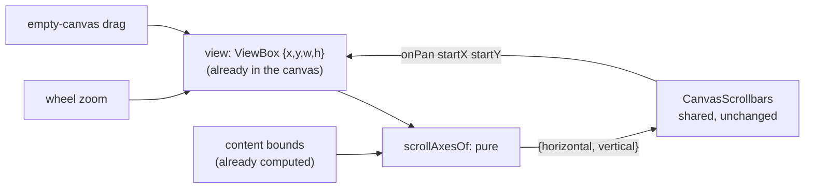

# Design Document

## Overview

Four canvases — **c4**, **wardley-map**, **azure-pipeline** and **helm-charts** — gain scrollbars by calling the component five other canvases already call. There is nothing to build: `CanvasScrollbars` and `scrollGeometry` exist, are unit-agnostic by construction, and the whole of this design is four call sites of roughly fifteen lines each, one behavioural test apiece, and one guard that stops a sixth private implementation appearing later.

**The central finding is that these four are easier to wire than the canvas that already works.** `rdf`, an existing consumer, drives a pixels-per-unit view (`startX`, `startY`, `pixelsPerUnit`), so to report how much content it can see it must measure its own DOM element and divide: `scrollAxesOf(model, view, surfaceRef.current?.getBoundingClientRect() ?? null)`. All four canvases in scope drive an SVG `ViewBox {x, y, w, h}` instead, where the view's span in content units **is** `w` and `h`. They need no DOM measurement, no ref, and no fallback for the frame before layout settles. The `viewBox` model that Agent 3's drag survey correctly identified as helm's awkwardness *for gestures* is, for scrolling, strictly the simpler half of the problem.

That reverses the question the requirements were asked to settle. Not "can the outlier be made to fit" but "is there any reason the majority shape would not" — and there is not: `ScrollAxis` is four plain numbers, and a `ViewBox` supplies all four directly.

**No change to the shared component is expected, and this design commits to that** (Requirement 6.2). It is falsifiable: if wiring the fourth canvas needs a prop that does not exist, the requirement's escape hatch is a single central change serving every consumer, not a local one — and this document would be wrong, which is the point of writing the expectation down.

## Steering Document Alignment

### Technical Standards (tech.md)

- **Centralised chrome, module semantics.** The component draws bars and reports two numbers; each canvas converts its own view model at the call site. Nothing about c4, Wardley space, pipelines or charts enters `canvas/scroll/`.
- **Centralised styling.** Appearance stays in `scrollView.css`; no module stylesheet touches thumb, track or dimensions. Only placement is a module's business, through the existing `className` prop.
- **No new gesture machinery.** Thumb dragging already lives in `scroll/`; this design adds none and reimplements none.

### Project Structure (structure.md)

- Client changes are confined to `src/diagrams/<module>/client/*Canvas.tsx` (+ their tests) and, for the guard, one file under `src/client/src/` tests. The shared library is read, not rewritten.

## Code Reuse Analysis

### Existing Components to Leverage

- **`CanvasScrollbars`** (`src/client/src/canvas/scroll/CanvasScrollbars.tsx`) — takes `horizontal`, `vertical`, `onPan`, optional `className`; draws both bars and owns thumb dragging.
- **`scrollGeometry.ts`** — `ScrollAxis` (`viewStart`, `viewSpan`, `extentStart`, `extentEnd`), `thumbOf` (already floors thumb size and clamps offset, so degenerate extents are handled centrally), and `scrollExtentOf(min, max, { factor, minimum, minimumSpan })`.
- **`scrollView.css`** — the bars' whole appearance.
- **`RdfCanvas.tsx`'s `scrollAxesOf`** — the shape to copy: a small pure function beside the component returning `{ horizontal, vertical }`, called inline at the JSX site. Copy the *shape*, not the pixels-per-unit arithmetic.

### Integration Points

- **Each canvas's existing view state** — all four already hold a `ViewBox` in `useState` and already write it from wheel-zoom and empty-canvas pan. `onPan` writes the same state through the same setter, so the bars are another writer of a value the canvas already owns rather than a new source of truth.
- **Each canvas's existing bounds** — all four already compute content bounds for fit-to-view or initial framing; the extent is derived from those, not from a second traversal.

## Architecture



The loop is deliberately one-directional per frame: view state in, thumb geometry out, `onPan` back into the same setter. Because every other pan path writes the same state, Requirement 2.2 — bars and canvas never disagreeing — holds by construction rather than by synchronisation.

### Modular Design Principles

- One conversion function per canvas, pure, taking view and bounds and returning two axes. No side effects, no refs, testable without rendering.
- The component stays ignorant of every module; the module stays ignorant of thumb geometry.

## Components and Interfaces

### Component 1 — `scrollAxesOf` (one per canvas, new, ~15 lines, pure)

- **Purpose:** convert this canvas's `ViewBox` and content bounds into `{ horizontal: ScrollAxis, vertical: ScrollAxis }`.
- **Shape, identical in all four:**
  - `horizontal: { viewStart: view.x, viewSpan: view.w, ...scrollExtentOf(minX, maxX, options) }`
  - `vertical: { viewStart: view.y, viewSpan: view.h, ...scrollExtentOf(minY, maxY, options) }`
- **Dependencies:** `scrollExtentOf` only.
- **Reuses:** the canvas's existing bounds helper; no DOM access, unlike the pixels-per-unit consumer.

### Component 2 — the call site (one per canvas)

```tsx
<CanvasScrollbars
  {...scrollAxesOf(view, bounds)}
  className="<module>-scrollbars"
  onPan={(x, y) => setView((current) => ({ ...current, x, y }))}
/>
```

`onPan` sets only `x` and `y`: a thumb pans and never zooms, so `w`/`h` are carried through unchanged. This is what keeps Requirement 2.3 honest — zoom changes the span, which changes thumb *size*, and dragging a thumb must not do that.

**Placement.** The bars sit as siblings of the `<svg>` inside a positioned wrapper, as the existing consumers do. Three of the four canvases already render their `<svg>` inside a wrapping element; **helm-charts already has `helm-canvas-frame`** (added for its rejection banner) and can host the bars directly. Any canvas lacking a wrapper gains one, which is a container element and no change to what is drawn.

### Component 3 — per-canvas extent options (the only place the four differ)

| Canvas | Extent derived from | `scrollExtentOf` options | Why |
| --- | --- | --- | --- |
| c4 | drawn element bounds | `{ factor: 0.5, minimumSpan: <box width> }` | a diagram of one box still needs room either side |
| azure-pipeline | drawn stage/job bounds | `{ factor: 0.5, minimumSpan: <stage width> }` | same, and stages spread horizontally |
| helm-charts | drawn node bounds (`boundsOf`) | `{ factor: 0.5, minimumSpan: <node width> }` | bands spread wide; the existing `PADDING` informs the floor |
| wardley-map | **the map's own coordinate space**, not content | `{ factor: 0, minimum: <margin> }` | Requirement 3.3: a Wardley map's plane is the 0..1 space itself, so a map with two components still has the whole space to show. Its `fullView` constant already expresses exactly this extent. |

Wardley is the one genuinely different case and it is different in *input*, not in mechanism — it passes the map space where the others pass content bounds. That is a call-site decision, which is precisely where the component's design says such decisions belong.

## Data Models

No new data models. `ScrollAxis` and `ScrollExtent` already exist; no module type changes; nothing crosses the wire — this is entirely client-side view state.

## Error Handling

### Error Scenarios

1. **Empty canvas / one element / all elements at one point** — `scrollExtentOf` holds the extent to at least one unit and `thumbOf` floors thumb size at 5% of the track, both already implemented and already tested centrally. The four canvases inherit that; no local guarding is written (Requirement 3.4).
2. **View wider than the extent** (zoomed far out) — `thumbOf` clamps size to 1, so the thumb fills its track and dragging cannot move it. Requirement 2.5 satisfied centrally.
3. **View dragged past the margin** — `thumbOf` clamps the offset to the end of the track without forcing the view back, so the bar stops describing further travel rather than yanking the canvas.
4. **Content changes while panning** — the extent is recomputed from bounds on the next render; `onPan` writes only `x`/`y`, so an extent change never fights a pan in progress.

## Testing Strategy

### Unit Testing

**Requirement 2.6 governs this section: a test that asserts `CanvasScrollbars` is imported or rendered does not satisfy it**, because it passes on a canvas whose thumb is inert. Each canvas therefore gets, in its existing `*Canvas.test.tsx`:

1. **Dragging the thumb pans the view** — render, drag the horizontal thumb, assert the `viewBox` attribute's `x` changed in the drag's direction; repeat vertically for `y`. This is the test that fails on an unwired `onPan`.
2. **Panning by other means moves the thumb** — pan via the canvas's existing empty-drag, assert the thumb's offset style changed. This is the test that fails if the bars read a stale or private copy of the view.
3. **Zoom changes thumb size** — wheel-zoom, assert the thumb's size fraction changed, not merely its offset. This is the test that fails if `viewSpan` was hard-coded rather than taken from `w`/`h`.

`scrollAxesOf` is additionally unit-tested per canvas as a pure function: bounds and view in, four numbers out, including the empty-content case.

### Integration Testing

No backend involvement, so no gRPC flow. The existing five consumers' tests serve as the regression suite for the shared component: if this work changes it at all (which it should not), those five must stay green, and Requirement 6.4 makes that explicit.

### The guard (Requirement 6.5)

One test in the client suite that fails when a module client folder gains its own scrollbar implementation: scan `src/diagrams/*/client/**` for the tell-tales of a private bar — a `scrollbar`/`scroll-thumb`/`scroll-track` class or element defined in a module stylesheet or component — and fail naming the file, permitting only imports from `@client/canvas/scroll`. It follows the repository's established convention-guard shape (`DependencyInventoryTests`, `DocumentationLinksTests`, `WorkspaceLockTests`) of walking the tree and reporting a collected list rather than asserting one case. The drag-and-drop survey's evidence — the same pan and drag state hand-rolled ten times — is why a rule nothing enforces is assumed to decay.

## Deviations and notes

1. **Scope is four, not the six the brief began with.** `ansible-structure` belongs to `ansible-refinements` task 3.2, already in flight; `sparql` has no client folder at all, so there is no canvas to wire and Requirement 7 covers what happens instead. Both were verified against the tree, not assumed.
2. **The shared component is expected to need nothing.** If that proves false, Requirement 6.3 permits exactly one central change or a documented inability — never a local bar.
3. **This design does not touch `drag-and-drop-centralization`'s question about helm's `viewBox`.** That spec's Requirement 10.2 asks whether helm's viewport can be reconciled with the shared *drag* derivatives. This one observes only that for *scrolling* no reconciliation is needed, because the scroll contract consumes position and span in content units and a `viewBox` holds exactly those. The two findings are compatible: a model can be the awkward one for pointer-delta gestures and the convenient one for viewport reporting.
