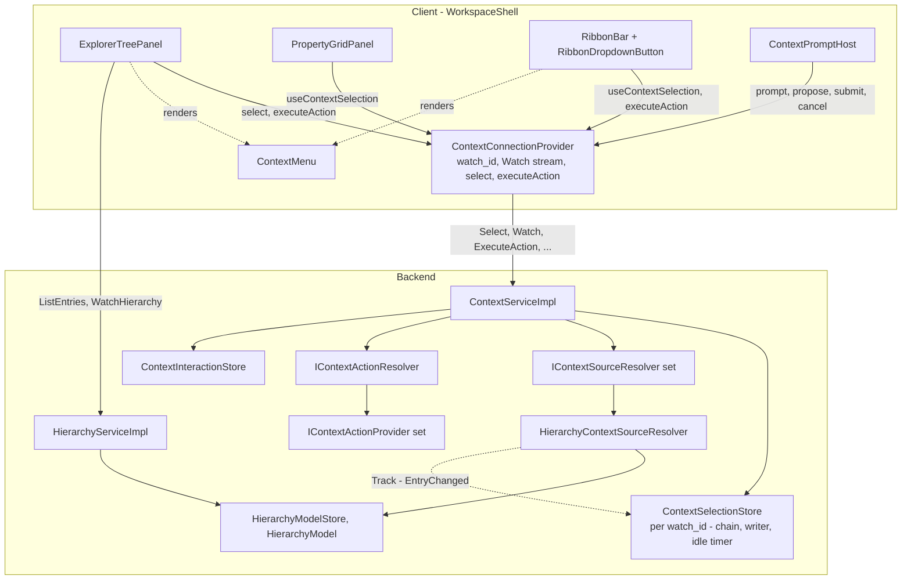
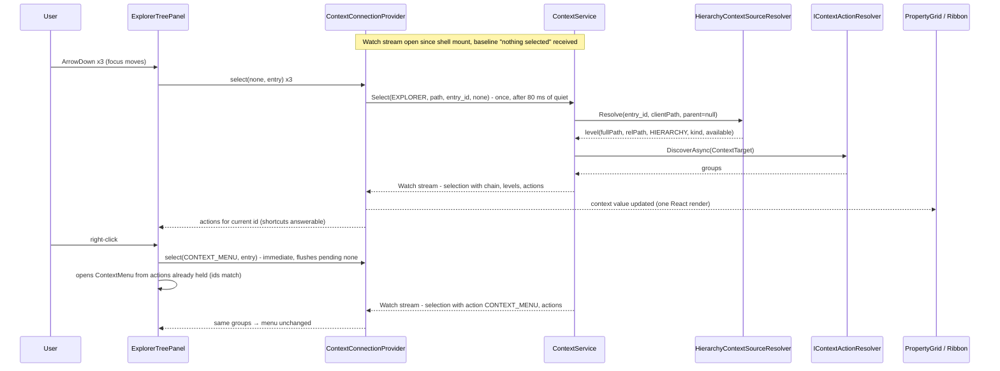

# Design Document

## Overview

This design adds a `ContextService` to the shared gRPC contract and the backend, makes the workspace explorer its first producer, and makes the Property Grid and the ribbon its first consumers. The service keeps, strictly per connection (`watch_id`), a **selection chain** — a recursive `ContextSelection` of `source` / `path` / `id` / `none|action|child` — and pushes it, together with backend-resolved per-level detail and the innermost level's available actions, down one server stream (`Watch`) that also carries the backend-initiated prompts the context-action mechanism already needs. The five context-action RPCs `rename-files-and-folders` parked on `HierarchyService` move to this service; `WatchHierarchy` goes back to carrying hierarchy changes only.

Three seams keep the service scope-agnostic:

1. **`IContextSourceResolver`** (new, backend): one per kind of `ContextSource` member. It turns an id into an absolute location, a project-relative path, a provider scope and per-level detail; declares how things of its kind nest (*contained* / *referenced* / *not nestable*); verifies a proposed child; and tracks a resolved level so a rename or delete on disk updates the recorded selection. The hierarchy registers the only resolver this spec ships.
2. **`IContextActionProvider` / `IContextActionResolver`** (existing): unchanged; they now receive their `ContextTarget` from the resolver above instead of from `HierarchyServiceImpl.TryResolveTarget`.
3. **`ContextConnectionProvider`** (new, client): one React provider at the workspace-shell level that owns the connection's `watch_id`, the single `Watch` stream, the debounced `select()` call and the action/prompt plumbing; the explorer, the Property Grid, the ribbon and the prompt host are all hooks on it.

## Steering Document Alignment

### Technical Standards (tech.md)

* **gRPC only, gRPC-Web-compatible**: `Select` is unary, `Watch` is server-streaming; no client-streaming or bidi (same constraint `rename-files-and-folders` design records under *Why not a bidirectional stream*).
* **Backend owns per-connection client state**: the selection lives in a backend store keyed by `watch_id`, the same way the hierarchy model and the in-flight interactions already do, so providers can read it in-process (Requirement 4.7).
* **No filesystem paths cross the wire**: `ContextSelection.path` is project-relative (outermost) or parent-relative (child); the resolver verifies it against the id and keeps the absolute path in `ContextTarget.ResolvedFullPath` only.
* **One entity per file; POCOs under `_Model`**: every new record/class gets its own file; data-only types go to `Context/_Model/`.
* **Centralised styling**: ribbon and Property Grid additions use `index.css` and its existing custom properties only.

### Project Structure (structure.md)

* Contract: `src/api/context.proto` gains the service, the selection messages and the moved request/response messages; `src/api/hierarchy.proto` loses them. The import direction flips to `context.proto → hierarchy.proto` (for `EntryKind` in the per-level detail); `hierarchy.proto` no longer imports `context.proto`.
* Backend: new files under `EtAlii.Adp.Backend/Context/` (service, selection store, source-resolver abstraction, `_Model` records); the hierarchy's resolver under `Hierarchy/`; `Hierarchy/HierarchyServiceImpl.Context.cs` is deleted. Dependency direction stays `Hierarchy/ → Context/`, never the reverse.
* Client: new `shell/context/ContextConnectionProvider.tsx` and hooks next to the existing `shell/context/ContextMenu.tsx` and `ContextPromptHost.tsx`; ribbon changes in `shell/ribbon/`; panels in `shell/panels/`.
* Tests: `EtAlii.Adp.Backend.Tests/Unit Tests/Context/` and `Integration Tests/`, `<Class>.Tests.cs` naming, AAA.

## Code Reuse Analysis

### Existing Components to Leverage

* **`HierarchyModel.TryResolvePath` + `HierarchyModelStore.GetOrCreate`**: the hierarchy resolver is a thin wrapper over these — containment checking, id→path, folder/file — nothing is re-derived.
* **`HierarchyModel.EntryChanged`**: the hierarchy resolver's `Track` subscribes to it to implement Requirement 3.3 (rename updates the path, delete clears the selection).
* **`HierarchyModelStore`'s idle-timer eviction** (`CreateEntry`/`EvictIfIdle`/`AttachWatcher`): copied as a pattern into `ContextSelectionStore` so a `Select` without a `Watch` cannot leak (Reliability NFR).
* **`ContextInteractionStore`**: kept; only its channel element type changes from `HierarchyMessage` to `ContextMessage`, and it is registered from `ContextService.Watch` instead of `WatchHierarchy`.
* **`IContextActionResolver` / `HierarchyContextActionProvider`**: unchanged; `ContextService` calls `DiscoverAsync` on every recorded selection to build the pushed actions (Requirement 5.1).
* **`HierarchyServiceImpl.Context.cs`**: its five RPC bodies and `ToProto` helpers move verbatim into `Context/ContextServiceImpl.Actions.cs`; only `TryResolveTarget` is replaced by the resolver call.
* **`ContextMenu`** (`shell/context/ContextMenu.tsx`): rendered as-is for the explorer's menu *and* as the ribbon's drop-down (anchored to the button's `DOMRect`, Requirement 10.3); its `groups` prop is fed by the same `toMenuGroups` the explorer already has.
* **`ContextPromptHost`**: unchanged; only its host moves from `ExplorerTreePanel` to `WorkspaceShell`.
* **`useDebouncedValue`**: not reused directly (it debounces a value for rendering); the provider's `select()` uses the same `setTimeout`/`clearTimeout` pattern in a small hook, `useCoalescedSelect`, because it needs an imperative flush for gesture selects (Requirement 3.6).
* **`AuthContext.transport`**: the provider creates its `ContextService` client from the shared transport exactly as the explorer creates its `HierarchyService` client.
* **`RibbonBar`'s `.ribbon-group` / `.ribbon-button` classes**: contextual buttons reuse them; only a disabled state, a chevron and an overflow rule are added.
* **`ExplorerContextActionsFlowTests`** scaffolding (`WebApplicationFactory<Program>`, temp project folder, stream-startup grace): the new integration tests extend the same fixture shape.

### Integration Points

* **`ExplorerTreePanel.tsx`**: loses `watchIdRef`, `actionsByKey`, `actionsFor`, the focus→`DiscoverActions` effect, `runAction`'s client construction, `prompt` state and the `ContextPromptHost` render; gains `useContextConnection()` for `watchId`, `select()`, `executeAction()`, and `useContextSelection()` for the pushed actions it matches shortcuts against. Its tree reducers, focus/keyboard logic and `WatchHierarchy` stream are untouched.
* **`WorkspaceShell.tsx`**: wraps its body in `ContextConnectionProvider` and renders `ContextPromptHost` once.
* **`RibbonBar.tsx`**: renders a contextual region after `RIBBON_GROUPS` from `useContextSelection()`.
* **`PropertyGridPanel.tsx`**: replaces the placeholder with a selection view; keeps the `futureSpec` comment for editing.
* **`Program.cs`**: registers `IContextSelectionStore`, the `IContextSourceResolver` implementation, and `MapGrpcService<ContextServiceImpl>()`.
* **`HierarchyServiceImpl.cs`**: drops the `IContextActionResolver`/`IContextInteractionStore` constructor dependencies and the `Register`/`Remove` calls in `WatchHierarchy`.

## Architecture



### Request flow: explorer selects a file



### Modular Design Principles

* **Single file responsibility**: `ContextServiceImpl.cs` (Select/Watch), `ContextServiceImpl.Actions.cs` (the five moved RPCs), `ContextSelectionStore.cs` (per-connection state), `ContextSelectionResolver.cs` (walks a chain through the resolvers), `HierarchyContextSourceResolver.cs` (hierarchy specifics). On the client: provider, hooks, ribbon drop-down button and Property Grid view are each one file.
* **Scope agnosticism**: nothing in `Context/` names files, folders, entries or diagrams. `ContextSelectionResolver` only knows `IContextSourceResolver.CanResolve(ContextSource)`.
* **One fan-out, many subscribers**: exactly one `Watch` stream per connection; consumers are React hooks over one context value.
* **One trigger path**: menu item, ribbon button, keyboard shortcut all end in `executeAction()` → `ExecuteAction`; the backend decides.

## Components and Interfaces

### `context.proto` (contract, extended)

* **Purpose:** The `ContextService`, the recursive selection message, the watch message, and the request/response messages moved in from `hierarchy.proto`.
* **Reuses:** `shared.proto`'s `ShortGuid`, `connection.proto`'s `Path`, `hierarchy.proto`'s `EntryKind`, `google.protobuf.Empty`.
* See *Data Models*.

### `ContextServiceImpl` (`Context/ContextServiceImpl.cs`, backend)

* **Purpose:** `Select` and `Watch` (Requirements 1–4, 9).
* **Interfaces:** `ContextService.ContextServiceBase` overrides `Select`, `Watch`.
* **Behaviour:**
  * `Select`: authorize (`TryResolveRootPath`, lifted from `HierarchyServiceImpl` into a small shared `ProjectRootResolver` helper in `Projects/` so both services use one copy); if `selection` is absent → `store.Clear(watchId)`; else `ContextSelectionResolver.ResolveChainAsync` → on failure reject with a generic message and leave the store untouched (Requirement 2.6); on success build the `ContextSelectionRecord`, `DiscoverAsync` for the innermost level's target, then `store.Set(watchId, record)` for `none`/`ACTIVATE`/`CONTEXT_MENU` or `store.PushTransient(watchId, record)` for `PREVIEW` (Requirement 9.4). `Set`/`PushTransient` write the `ContextMessage` to the registered writer if any.
  * `Watch`: authorize; create an unbounded `Channel<ContextMessage>`; `store.Register(watchId, writer)` (sends the baseline immediately: current record or an empty `ContextSelectionChanged`); `interactionStore.Register(watchId, writer)`; pump `channel.Reader` to `responseStream`; in `finally`: `interactionStore.Remove`, `store.Remove` (which also disposes every resolver `Track` subscription — Requirement 1.5).
* **Dependencies:** `IProjectStore`/`SessionContext`, `IContextSelectionStore`, `ContextSelectionResolver`, `IContextActionResolver`, `IContextInteractionStore`.

### `ContextServiceImpl.Actions` (`Context/ContextServiceImpl.Actions.cs`, backend, partial)

* **Purpose:** `DiscoverActions`, `ExecuteAction`, `ProposeInput`, `SubmitInteraction`, `CancelInteraction` — moved from `HierarchyServiceImpl.Context.cs` (Requirement 6).
* **Changes vs. today:** the `scope` request field is gone; `TryResolveTarget` becomes: if `request.Source` is set → `ContextSelectionResolver.ResolveLevelAsync(watchId, rootPath, source, path: null, parent: null)` and take its `Target`; if absent → `store.Get(watchId)?.Innermost.Target` (Requirement 6.5). Everything else is byte-for-byte the existing code, including the `ToProto` helpers.

### `IContextSourceResolver` (`Context/IContextSourceResolver.cs`, backend, new)

* **Purpose:** The per-id-kind seam (Requirements 2.3, 2.6, 2.9, 3.3; NFR Dependency direction).
* **Interfaces:**
  ```csharp
  public interface IContextSourceResolver
  {
      /// The ContextSource member this resolver answers for.
      bool CanResolve(ContextSource source);

      /// Resolves one level. clientPath may be empty (fill in) or must match (verify).
      /// parent is the already-resolved enclosing level, or null for the outermost.
      ValueTask<ContextLevelResolution> ResolveAsync(
          ShortGuid watchId, string rootPath, ContextSource source,
          Path? clientPath, ContextResolvedLevel? parent, CancellationToken ct);

      /// How things of this kind nest (Requirement 2.3).
      ContextNesting NestingOf(ContextResolvedLevel level);

      /// Starts observing a resolved level; onChange fires with the new relative path
      /// (rename/move) or null (gone). Dispose stops observing.
      IDisposable Track(ShortGuid watchId, ContextResolvedLevel level, Action<Path?> onChange);
  }
  ```
  `ContextLevelResolution` is a small discriminated result: `Resolved(ContextResolvedLevel)` or `Rejected(string reason)`.
* **Contract for nesting:** `ResolveAsync` receives `parent`; when `parent` is non-null the resolver must check `parent`'s `NestingOf` rule — for `Contained` it verifies containment (hierarchy: child full path starts with parent full path + separator, and the child's relative path is relative to the parent), for `Referenced` it verifies the reference (nothing this spec ships), for `NotNestable` it rejects.

### `HierarchyContextSourceResolver` (`Hierarchy/HierarchyContextSourceResolver.cs`, backend, new)

* **Purpose:** This spec's only resolver: `entry_id`.
* **Behaviour:** `CanResolve` ⇔ `source.SourceCase == EntryId`. `ResolveAsync` → `hierarchyModelStore.GetOrCreate(watchId, rootPath).TryResolvePath(id, …)`; relative path = `Path.GetRelativePath(rootPath, fullPath)` split on the directory separator; verify/fill `clientPath`; `Scope = ContextScope.Hierarchy`; `Detail = new EntryDetail { Kind, Available }`; `Target = new ContextTarget(Scope, fullPath, isFolder, id)`. `NestingOf` → `Contained` for a folder, `NotNestable` for a file (a file's *elements* are a future, different id kind — when a diagram module registers one, its `ResolveAsync` will be asked with a file parent and decides; so `NotNestable` here applies only to `entry_id` children of a file). `Track` subscribes to `HierarchyModel.EntryChanged` and maps `Renamed`/`Removed` for the tracked id (or any ancestor id, for a renamed parent folder) to `onChange`.
* **Dependencies:** `IHierarchyModelStore`.

### `ContextSelectionResolver` (`Context/ContextSelectionResolver.cs`, backend, new)

* **Purpose:** Walks a `ContextSelection` chain outer→inner through the registered resolvers, producing a `ContextSelectionRecord` or a rejection (Requirements 2.6, 2.9).
* **Interfaces:** `ValueTask<ChainResolution> ResolveChainAsync(ShortGuid watchId, string rootPath, ContextSelection selection, CancellationToken ct)`; `ValueTask<ContextLevelResolution> ResolveLevelAsync(...)` (used by `Actions` for an explicit `source`).
* **Dependencies:** `IEnumerable<IContextSourceResolver>`. Unknown member → rejected (Requirement 2.6, second bullet). Enforces "one id per level" and a maximum chain depth (8) as a sanity bound.

### `IContextSelectionStore` / `ContextSelectionStore` (`Context/`, backend, new)

* **Purpose:** Per-`watch_id` selection state, the `Watch` writer, baseline delivery, idle eviction, and the resolver `Track` subscriptions (Requirements 1.4, 1.5, 4.1, 4.2, 4.7, Reliability).
* **Interfaces:**
  ```csharp
  public interface IContextSelectionStore
  {
      void Register(ShortGuid watchId, ChannelWriter<ContextMessage> writer); // cancels idle timer, writes baseline
      void Remove(ShortGuid watchId);                                          // disposes tracks, drops writer
      ContextSelectionRecord? Get(ShortGuid watchId);                          // for providers / ExecuteAction
      void Set(ShortGuid watchId, ContextSelectionRecord record);              // replaces, re-tracks, pushes
      void Clear(ShortGuid watchId);                                           // "nothing selected", pushes
      void PushTransient(ShortGuid watchId, ContextSelectionRecord record);    // PREVIEW: push only
      void UpdateFromTrack(ShortGuid watchId, int levelIndex, Path? newRelativePath); // Requirement 3.3
  }
  ```
* **Behaviour:** `GetOrCreate`-style entry with an idle `Timer` (30 s, like `HierarchyModelStore`) that evicts an entry with no writer; `Register` disposes the timer. `Set` disposes the previous record's `Track` subscriptions and calls `resolver.Track` per level with a callback into `UpdateFromTrack`. `UpdateFromTrack` with a path → rewrites that level's (and, for a renamed folder, the inner levels') relative paths, re-runs action discovery through a callback the service supplies on `Set` (so the store stays free of `IContextActionResolver`), and pushes; with `null` → `Clear`. Writes use `TryWrite` on an unbounded channel; a missing writer is not an error (state is kept for providers).
* **Reuses:** `HierarchyModelStore`'s structure; `ContextInteractionStore`'s concurrency style (`ConcurrentDictionary`, per-entry lock).

### `ContextInteractionStore` (backend, edited)

* `ChannelWriter<HierarchyMessage>` → `ChannelWriter<ContextMessage>`; `TryPush` wraps the prompt in `ContextMessage { Prompt = … }`. Nothing else changes.

### `HierarchyServiceImpl` (backend, edited)

* Remove the `Context` partial, the two context dependencies, and the `Register`/`Remove` lines in `WatchHierarchy`. `HierarchyMessage` keeps its wrapper shape with only `change` (Requirement 6.2) so the stream type does not churn again when something else needs multiplexing.
* Move `TryResolveRootPath` to `Projects/ProjectRootResolver.cs` (static helper taking `IProjectStore`) and call it from both services.

### `ContextConnectionProvider` (`shell/context/ContextConnectionProvider.tsx`, client, new)

* **Purpose:** The one place the client talks to `ContextService` (Requirements 3.4, 3.6, 4.5, 4.6, 6.3, 9.4).
* **Interfaces:**
  ```ts
  interface ContextConnectionValue {
    watchId: Uint8Array;                 // generated here; the explorer uses it for ListEntries/WatchHierarchy too
    select: (selection: ContextSelection | null) => void;   // coalesces `none`, flushes on gestures
    executeAction: (actionId: string, source?: ContextSource) => Promise<{ accepted: boolean; error: string }>;
    executeShortcut: (shortcut: ContextShortcut) => Promise<{ accepted: boolean; error: string }>;
  }
  interface ContextSelectionValue {
    selection: ContextSelection | null;  // current (non-transient) chain
    levels: ContextLevelDetail[];        // outermost first, same length as chain depth
    actions: ContextActionGroup[];       // innermost level's actions
    preview: ContextSelectionChanged | null; // last PREVIEW, cleared on next message
    connected: boolean;                  // stream state, for a future status bar
  }
  export function useContextConnection(): ContextConnectionValue;
  export function useContextSelection(): ContextSelectionValue;
  export function useContextPrompt(): { prompt, onPropose, onSubmit, onCancel }; // for ContextPromptHost
  ```
  Two contexts (connection vs. selection) so a `select()` caller does not re-render on every selection push.
* **Behaviour:**
  * Opens `Watch` on mount with `AbortController`; on error (not aborted) retries with backoff (0.5 s → 5 s cap); each (re)open's first message is the baseline (Requirement 4.6). If the baseline says nothing is selected and the provider has a last-sent selection, it re-sends it (Reliability bullet 3).
  * `select()`: `none` → schedule after 80 ms, replacing any scheduled one; any `action` or `null` → clear the timer and send now (Requirement 3.6). Keeps `lastSentRef` for the reconnect re-send.
  * On `selection` message: set state; if `transient` → set `preview` only; else set `selection`/`levels`/`actions` and clear `preview` (Requirement 9.4). On `prompt` message: set `prompt` (same handling `ExplorerTreePanel` has today).
  * `executeAction`/`executeShortcut`: build `ExecuteActionRequest` without `scope`, with `source` only when given, with a fresh `interactionId`.
* **Dependencies:** `useAuth().transport`, generated `ContextService` client.

### `useCoalescedSelect` (`shell/context/useCoalescedSelect.ts`, client, new)

* **Purpose:** The 80 ms trailing coalescer with imperative flush, isolated for unit testing with fake timers (mirrors the `useDebouncedValue` test approach).
* **Interfaces:** `useCoalescedSelect(send: (s: ContextSelection | null) => void, delayMs): (s: ContextSelection | null, immediate: boolean) => void`.

### `ExplorerTreePanel` (client, edited)

* `watchIdRef` → `useContextConnection().watchId`.
* Focus change (`setFocusedKey` via click/arrows/`onFocus`) → `select(EXPLORER, none, node)`; a helper `selectionFor(node, state, detail)` builds the `ContextSelection` with `path` = the node's name chain from `parentKey` links (already derivable from `nodesByKey`).
* Right-click / `Shift+F10` / `ContextMenu` key → `select(..., action: CONTEXT_MENU)` and open `ContextMenu` at once from `useContextSelection().actions` **if** `selection.id` equals the node's id; otherwise open when the next push for that id arrives (a `pendingMenuRef` with the position; Requirements 3.7, 9.5).
* Double-click / `Enter` → `select(..., action: ACTIVATE)`; for a folder also `toggleExpand` (Requirement 3.8).
* `Escape` with the tree focused and no menu open → `select(null)`; a pushed `EntryRemoved` for the focused key → `select(null)` (Requirement 3.5).
* Shortcut matching: `matchShortcut(actions, event)` unchanged, but `actions` come from `useContextSelection()` and are only consulted when `selection.id` equals the focused node's id (so a stale action list never fires).
* Removed: `actionsByKey`, `actionsFor`, the focus-discovery effect, `runAction`'s client, `prompt` state, `ContextPromptHost`, `hierarchyClient.discoverActions/executeAction/proposeInput/submitInteraction/cancelInteraction`.
* Unchanged: tree state, reducers, `ListEntries`, `WatchHierarchy` (now ignoring nothing — the `prompt` branch is deleted), icons, roving tabindex.

### `WorkspaceShell` (client, edited)

* Wraps the shell body in `<ContextConnectionProvider projectId={projectId}>`; renders `<ContextPromptHost {...useContextPrompt()} />` once, outside the panes, so a prompt from any surface shows (Requirement 6.3). A small `ShellPromptHost` component wraps the hook so `WorkspaceShell` itself stays a layout file.

### `RibbonBar` + `RibbonDropdownButton` (`shell/ribbon/`, client, edited + new)

* **Purpose:** Requirement 10.
* **Behaviour:** `RibbonBar` renders `RIBBON_GROUPS` as today, then `<RibbonContextualGroups />`, which reads `useContextSelection()`:
  * No selection → renders nothing (10.7).
  * Selection changed but `actions` not yet for this `selection.id` → renders the previously shown groups with every button `disabled` (10.8); tracked with a `lastShownRef` keyed by the innermost id.
  * Each `ContextActionGroup` → `<div className="ribbon-group ribbon-group-contextual">`; each `ContextAction` without `items` → `<button className="ribbon-button" disabled={!available} title={tooltip}>`; with `items` → `<RibbonDropdownButton>`.
  * `tooltip` = `label` + (shortcut ? ` (${formatShortcut(shortcut)})` : "") or `unavailable_reason` when disabled (10.4, 10.6). `formatShortcut` is a pure helper (`Ctrl+Shift+X`).
  * Click → `executeAction(action.id)` with no source (10.5).
* `RibbonDropdownButton`: a `.ribbon-button.ribbon-button-dropdown` with a trailing `mdi-chevron-down`; click / `ArrowDown` / `Enter` / `Space` → `setOpen(true)`; renders `<ContextMenu open groups={toMenuGroups(action.items, onSelect)} position={{ x: rect.left, y: rect.bottom }} onClose={…} />` with `rect` from the button's `getBoundingClientRect()` (10.3). Closes on an `actions` change (10.3 last sentence) via an effect keyed on `selection.id`. `toMenuGroups` moves from `ExplorerTreePanel.tsx` to `shell/context/toMenuGroups.ts` so both consumers share it.
* **Styling (`index.css`):** `.ribbon-button:disabled` (muted colour, `cursor: default`, no hover shift — the same tokens `.context-menu-item-disabled` uses), `.ribbon-button-dropdown .ribbon-chevron` (small trailing icon), `.ribbon { overflow-x: auto; flex-wrap: nowrap; }` with `.ribbon-group { flex: 0 0 auto; }` so overflow scrolls rather than wraps (10.10); contextual buttons get no `.ribbon-button-pressed` (10.9).

### `PropertyGridPanel` (client, edited)

* Reads `useContextSelection()`. Nothing selected → a `PanelPlaceholder`-styled "Nothing selected" block (7.2) plus the kept `futureSpec` comment. Otherwise a definition list per level, outermost first: name (last segment), path (segments joined with `/`), kind (`levels[i].entry.kind`), availability, source — using a new `.property-grid` / `.property-grid-row` pair in `index.css` drawing on the existing tokens (7.1).

### `Program.cs` (backend, edited)

```csharp
builder.Services.AddSingleton<IContextSelectionStore, ContextSelectionStore>();
builder.Services.AddSingleton<ContextSelectionResolver>();
builder.Services.AddSingleton<IContextSourceResolver, HierarchyContextSourceResolver>();
// ...
app.MapGrpcService<ContextServiceImpl>();
```

## Data Models

### `context.proto` (additions; the moved messages are unchanged except for the dropped `scope` fields)

```protobuf
import "connection.proto";            // Path
import "hierarchy.proto";             // EntryKind (hierarchy.proto no longer imports context.proto)
import "google/protobuf/empty.proto";

service ContextService {
  rpc Select(SelectRequest) returns (SelectResponse);
  rpc Watch(WatchContextRequest) returns (stream ContextMessage);

  // Moved from HierarchyService; shapes unchanged except `scope` removed.
  rpc DiscoverActions(DiscoverActionsRequest) returns (DiscoverActionsResponse);
  rpc ExecuteAction(ExecuteActionRequest) returns (ExecuteActionResponse);
  rpc ProposeInput(ProposeInputRequest) returns (ProposeInputResponse);
  rpc SubmitInteraction(SubmitInteractionRequest) returns (SubmitInteractionResponse);
  rpc CancelInteraction(CancelInteractionRequest) returns (CancelInteractionResponse);
}

// Which surface produced a selection (Requirement 2.5).
enum ContextSelectionSource {
  CONTEXT_SELECTION_SOURCE_UNSPECIFIED = 0;
  EXPLORER = 1;
  DIAGRAM_CANVAS = 2;
  SEARCH = 3;
  PROBLEMS = 4;
  TOOLBOX = 5;
  RIBBON = 6;
  PROPERTY_GRID = 7;
}

// The gesture behind a selection (Requirement 9.2). 10+ are reserved for later surfaces.
enum ContextSelectionAction {
  CONTEXT_SELECTION_ACTION_UNSPECIFIED = 0;
  ACTIVATE = 1;
  CONTEXT_MENU = 2;
  PREVIEW = 3;
  DRAG_START = 10;
  DROP = 11;
  RENAME_REQUEST = 12;
  FOCUS_ONLY = 13;
}

// One level of a selection chain (Requirement 2.2). `path` is project-relative at the
// outermost level and parent-relative on a child whose parent kind nests by containment;
// it is verified against (or filled in from) `id` by the backend - never trusted alone.
message ContextSelection {
  ContextSelectionSource source = 1;
  Path path = 2;
  ContextSource id = 3;
  oneof detail {
    google.protobuf.Empty none = 4;        // a plain selection
    ContextSelectionAction action = 5;     // what the user did to it
    ContextSelection child = 6;            // what is selected inside it
  }
}

message SelectRequest {
  ShortGuid project_id = 1;
  ShortGuid watch_id = 2;
  ContextSelection selection = 3;          // absent = nothing is selected (Requirement 2.7)
}

message SelectResponse {
  string error = 1;                        // empty when accepted; generic, non-revealing otherwise
}

message WatchContextRequest {
  ShortGuid project_id = 1;
  ShortGuid watch_id = 2;
}

// Backend-resolved detail for one level; one member per id kind (Requirement 4.4).
message ContextLevelDetail {
  oneof detail {
    EntryDetail entry = 1;
  }
}

message EntryDetail {
  EntryKind kind = 1;
  bool available = 2;
}

message ContextSelectionChanged {
  ContextSelection selection = 1;          // absent = nothing selected
  repeated ContextLevelDetail levels = 2;  // outermost first; same depth as `selection`
  repeated ContextActionGroup actions = 3; // innermost level's actions (Requirement 5.1)
  bool transient = 4;                      // true for a PREVIEW (Requirement 9.4)
}

message ContextMessage {
  oneof message {
    ContextSelectionChanged selection = 1;
    ContextPrompt prompt = 2;
  }
}
```

`hierarchy.proto` after the move: `HierarchyMessage { oneof message { HierarchyChange change = 1; } }` (field 2 reserved), and the `DiscoverActions…CancelInteraction` messages and RPCs removed.

### Backend records (`Context/_Model/`, one file each)

```
ContextNesting            : enum { Contained, Referenced, NotNestable }
ContextResolvedLevel      : Source (ContextSelectionSource), Id (ContextSource), RelativePath (IReadOnlyList<string>),
                            Scope (ContextScope), Target (ContextTarget), Detail (ContextLevelDetail), Resolver (IContextSourceResolver)
ContextLevelResolution    : Resolved(ContextResolvedLevel) | Rejected(string Reason)
ContextSelectionRecord    : Chain (ContextSelection, as accepted/filled), Levels (IReadOnlyList<ContextResolvedLevel>),
                            Innermost (=> Levels[^1]), Actions (IReadOnlyList<ContextActionGroupDefinition>),
                            Action (ContextSelectionAction?), Tracks (IReadOnlyList<IDisposable>)
ChainResolution           : Resolved(ContextSelectionRecord) | Rejected(string Reason)
```

`ContextTarget` is unchanged (`Scope, ResolvedFullPath, IsContainer, SourceId`).

## Error Handling

### Error Scenarios

1. **`Select` names an id that is unknown, belongs to another connection/project, or no longer exists (Requirement 2.6)** — `ResolveChainAsync` rejects; `SelectResponse.error = "This item is no longer available."`; the store is untouched. The provider logs nothing to the UI: the explorer keeps its focus ring, the Property Grid keeps showing the previous selection, and the next focus move tries again.
2. **Client path does not match the id's resolved path** — rejected the same way (same message, so nothing about the real layout is revealed). Since the explorer computes the path from the same tree the ids came from, a mismatch only happens during a rename race; the watcher's `EntryRenamed` then reaches the tree, and the next `Select` is consistent.
3. **A `child` under a `NotNestable` parent, or a child not contained in its parent** — rejected; no partial chain is recorded (Requirement 2.9).
4. **Chain deeper than the sanity bound, or an unknown `ContextSource` member** — rejected with the same generic error.
5. **The selected entry is renamed or deleted on disk (Requirement 3.3)** — the hierarchy resolver's `Track` fires; the store rewrites the path (and re-discovers actions) or clears; a `ContextSelectionChanged` is pushed. The explorer already receives the matching `EntryRenamed`/`EntryRemoved` on `WatchHierarchy`; on a removal it also calls `select(null)` (Requirement 3.5), which the backend answers with a no-op clear.
6. **`Watch` drops mid-session** — the provider reconnects with backoff, re-baselines, and re-sends its last selection if the baseline is empty (the backend evicted the stream-less state after its idle timeout). Open prompts die with the connection, exactly as today (`rename-files-and-folders` design, scenario 7).
7. **`Select` before any `Watch`** — recorded; the idle timer evicts it after 30 s unless a `Watch` registers. A `Watch` that registers first sees it as the baseline.
8. **`ExecuteAction` with no `source` and no current selection (Requirement 6.5)** — rejected: "Nothing is selected." The ribbon cannot normally produce this (it renders nothing without a selection), but a stale click during a clear can.
9. **Actions push arrives for an id the explorer is no longer focused on** — ignored for shortcuts (id mismatch rule); the ribbon shows it anyway because the backend's current selection *is* that id.
10. **`DiscoverAsync` throws for a provider during `Select`** — the selection is still recorded and pushed with empty `actions` and the failure is logged; the ribbon shows no contextual group and the menu opens empty (and `ContextMenu` renders nothing for empty groups, its own Reliability NFR).

## Testing Strategy

### Unit Testing

* `ContextSelectionResolver.Tests`: single level resolves through the matching resolver; unknown member rejected; chain passes `parent` inward; `NotNestable` parent rejects a child; `Contained` parent with a non-contained child rejects; depth bound; an empty client path is filled in; a mismatching client path rejects.
* `HierarchyContextSourceResolver.Tests` (against a temp folder + a real `HierarchyModel`): resolves an entry to relative segments and `EntryDetail`; folder → `Contained`, file → `NotNestable`; child containment check; `Track` fires with the new path on rename of the entry and of an ancestor folder, and with `null` on delete; disposing stops callbacks.
* `ContextSelectionStore.Tests`: `Register` writes a baseline (empty, then the current record); `Set` pushes to the registered writer only; two `watch_id`s are isolated; `PushTransient` pushes `transient = true` and does not replace `Get`; `Clear` pushes an empty message; `UpdateFromTrack` rewrites a path / clears; idle eviction removes an entry that never registered; `Register` cancels eviction; `Remove` disposes tracks.
* `ContextServiceImpl.Actions`: existing `HierarchyContextActionProvider`/`ContextActionResolver` tests are untouched; a new test covers `ExecuteAction` without `source` using the store's current selection, and rejection when nothing is selected.
* Client (`vitest`): `useCoalescedSelect` with fake timers — three `none` calls inside 80 ms send once with the last value; a gesture call sends immediately and cancels the pending `none`; `null` sends immediately. `ContextConnectionProvider` with a mocked client — baseline handling, `transient` vs. normal messages, reconnect re-send. `RibbonContextualGroups` — nothing without a selection; buttons render with icon/label/tooltip; disabled state and `unavailable_reason` tooltip; drop-down button opens `ContextMenu` anchored to its rect and forwards the selected child id to `executeAction`; previous groups stay disabled until actions for the new id arrive. `PropertyGridPanel` — empty state and a two-level chain rendering. `ExplorerTreePanel` — focus triggers `select(none)`; right-click triggers `select(CONTEXT_MENU)` and opens the menu from held actions when ids match, or on the next matching push; `Enter` on a folder toggles and sends `ACTIVATE`; shortcuts only match when the selection id equals the focused id; `Escape` sends `null`.

### Integration Testing

* `ContextSelectionFlow.Tests` (new, same fixture style as `ExplorerContextActionsFlowTests`): open `Watch` → baseline empty; `ListEntries` → `Select(none)` a file → a `ContextSelectionChanged` arrives with the chain, the filled path, `EntryDetail`, and the Rename/Delete groups; `Select(PREVIEW)` → `transient` message, current selection unchanged; rename the file on disk → a pushed message with the new path and the same id; delete it → an empty message; `Select` with a foreign id → error, no push; two connections to the same project → each sees only its own selections.
* `ExplorerContextActionsFlow.Tests` (existing, re-pointed): same arcs through `ContextService`; prompts observed on the context `Watch` stream; the per-connection prompt-isolation test unchanged in intent; plus the shortcut overload and `ExecuteAction` with no `source` after a `Select`.
* `ProjectRootFolderExplorerFlow.Tests` (existing): unchanged except `HierarchyMessage` no longer has a `prompt` case.
* Authorization: `Select`/`Watch` for another user's project are rejected.

### End-to-End Testing

* Manual F5 pass: open a project; arrow through the explorer — the Property Grid follows, the ribbon shows **Rename** and **Delete** after View with no flicker; hover shows "Rename (F2)"; click **Rename** in the ribbon → the same dialog as F2; right-click → menu opens instantly with the same items; rename a file in the OS file explorer while it is selected → Property Grid path updates; delete it → Property Grid shows "Nothing selected", the contextual group disappears; `Escape` in the tree clears the selection; narrow the window → the ribbon scrolls horizontally rather than wrapping; light and dark mode.

## Deviations and notes

1. **`none` is an explicit `google.protobuf.Empty` member.** proto3 cannot distinguish "oneof unset" from "none" otherwise; the backend nevertheless treats an unset `detail` as `none` rather than rejecting, so a minimal client still works.
2. **One `Watch` writer per `watch_id`, not many.** Requirement 4.2 says "every open `Watch` stream for that `watch_id`"; since the client opens exactly one (4.5) and a reconnect replaces it, the store keeps a single writer and a second `Register` for the same `watch_id` supersedes the first. Fan-out to multiple streams per connection is a one-line change if ever needed.
3. **`context.proto` now imports `hierarchy.proto`** (for `EntryKind` in `EntryDetail`). The alternative — a `google.protobuf.Any` per-level detail — would push the kind-specific decoding onto every consumer; a `oneof` that grows a member per id kind matches how `ContextSource` already grows and keeps consumers typed. The import direction is consistent: the hierarchy is a *kind of thing the context can talk about*, so the context contract may know the hierarchy's vocabulary, while `hierarchy.proto` no longer knows the context's.
4. **The coalescing delay is 80 ms**, below the 200 ms `ContextPromptHost` uses for validation: selection pushes drive visible UI (ribbon, Property Grid), so the delay must stay under perception while still collapsing a held arrow key (~30 ms per repeat).
5. **`ExecuteAction`/`DiscoverActions` lose their `scope` field** rather than keeping it optional, per the approved Requirement 6.1; the generated TypeScript changes accordingly, and the only call sites are the ones this spec rewrites.
