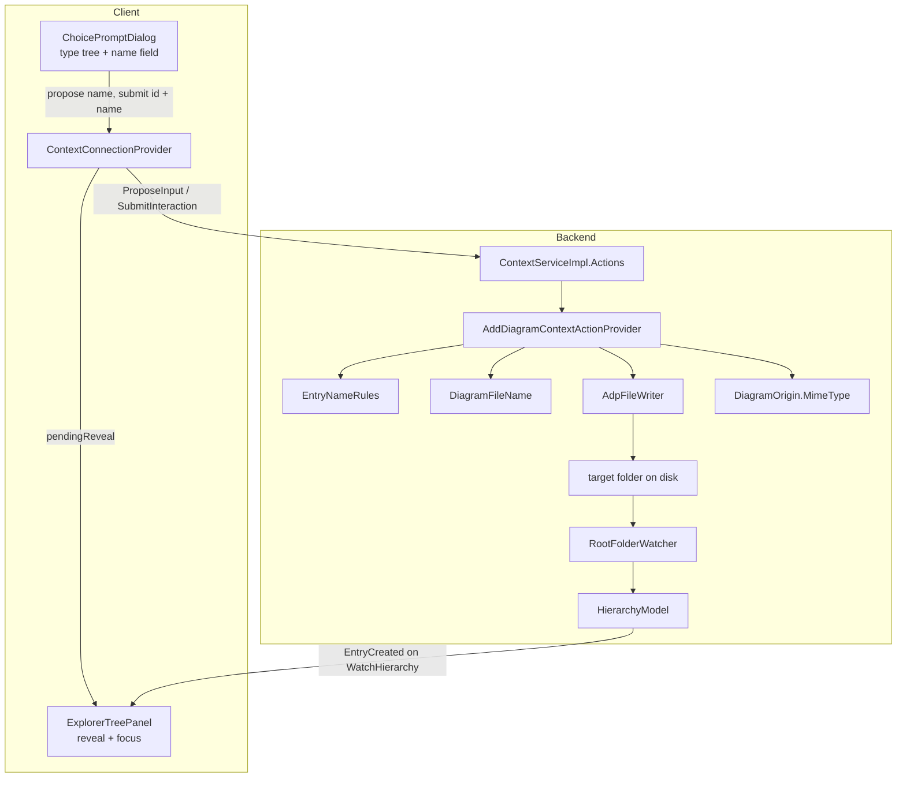
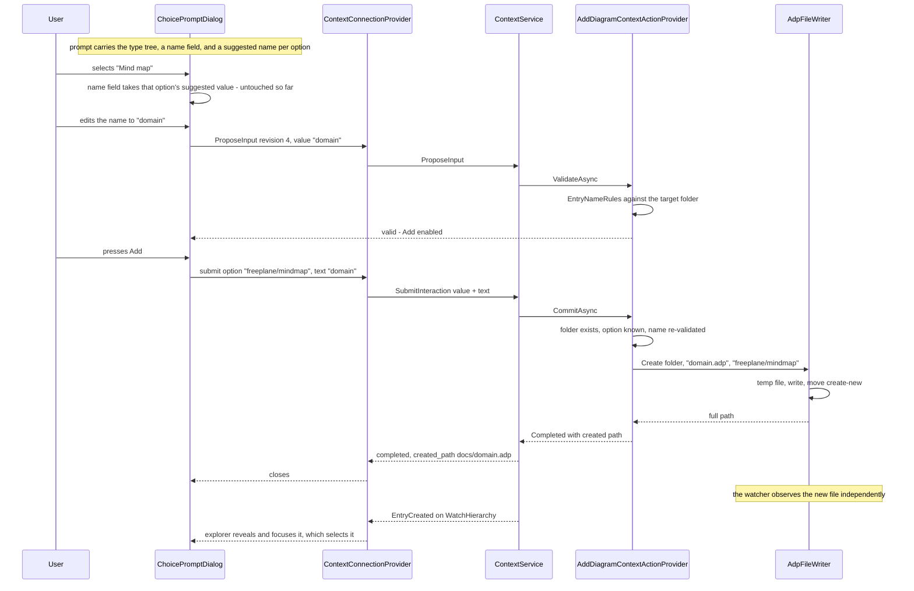

# Design Document

## Overview

This design fills in the one step [`add-diagram-action`](../add-diagram-action/requirements.md) left open. That spec ends at `AddDiagramContextActionProvider.CommitAsync`, which today re-checks the folder and answers "not supported yet". Here, that method **creates the file**: `<name>.adp` in the resolved target folder, containing the chosen diagram type's MIME type on its first line.

Two things arrive with it. First, the Add dialog gains a **name field**: the choice prompt learns to carry one text field, each selectable option carries the collision-free name to suggest for it, and the name is validated live by the backend through the `ProposeInput` path the rename dialog already uses. Second, the completed submission carries the **project-relative path** of what it created, so the client that added the diagram can reveal and select it once the watcher's `EntryCreated` arrives — no client-side insert, no dedicated "created" message.

The work splits into four small, separately testable pieces plus their wiring:

| Piece | Where | Answers |
|---|---|---|
| `DiagramOrigin.MimeType` | `EtAlii.Adp.Diagram` | Requirement 3.2 |
| `EntryNameRules` (extracted from rename) | `EtAlii.Adp.Backend/Hierarchy/` | Requirements 2.4–2.6 |
| `DiagramFileName` (suggest / normalise) | `EtAlii.Adp.Backend/Hierarchy/` | Requirements 2.2–2.3 |
| `AdpFileWriter` (atomic create-new write) | `EtAlii.Adp.Backend/Hierarchy/` | Requirements 3.1, 3.3, 5.1–5.2 |

`AddDiagramContextActionProvider` orchestrates them and stays the only place in the Add flow that changes (Requirement 1.2). Everything else — the action, the option ids, the dialog's tree, the prompt channel — is `add-diagram-action`'s, untouched.

**This design assumes `add-diagram-action` is implemented**, and is written against its design's shipped-code-grounded component names (`AddDiagramContextActionProvider`, `DiagramOptionTree`, `HierarchyTargets`, `ChoiceDialogPrompt`, `ChoicePromptDialog`, `ContextOption`). Where it touches `context-service` code (`ContextServiceImpl.Actions`, `ContextInteraction`, `ContextConnectionProvider`, `ExplorerTreePanel`), that code is merged and was read directly.

## Steering Document Alignment

### Technical Standards (tech.md)

* **Files are the source of truth.** The file is written to disk and reaches every client through `RootFolderWatcher` → `HierarchyModel` → `EntryCreated`. Nothing is inserted client-side, and no "a file was created" message is added to the contract (Requirement 4.1).
* **Text-based, diffable storage.** UTF-8 without BOM, one LF-terminated line. No BOM because a BOM would sit in front of the MIME type and make Requirement 3.4's "first line is authoritative" a lie for byte-level readers.
* **The backend is the sole owner of the filesystem.** The client sends an option id and a bare name; the backend composes every path. The only path that crosses the wire is the project-relative `Path` of the created file (Requirement 4.2), the same shape `context-service` already sends for a selection.
* **One entity per file, POCOs under `_Model`.** Each new helper is its own file; the new records go in `Context/_Model/`.
* **Centralised styling.** The dialog's name field reuses `index.css`'s existing field styling (`.field input`, as `InputPromptDialog` does) rather than new colours or sizes.

### Project Structure (structure.md)

* `DiagramOrigin.MimeType` lives on the record itself in `EtAlii.Adp.Diagram/_Model/` — the shared abstraction both the writer and any later reader agree on, with no dependency on the backend (Requirement NFR *Dependency direction*).
* The name/write helpers live in `EtAlii.Adp.Backend/Hierarchy/`, beside the provider that uses them and the rename code they are extracted from. They are `internal`-by-default statics with no diagram-type knowledge.
* Tests: `EtAlii.Adp.Diagram.Tests` for the MIME type; `EtAlii.Adp.Backend.Tests/Unit Tests/Hierarchy/` for names and the writer; `Integration Tests/` for the arc; client tests beside their components.

## Code Reuse Analysis

### Existing Components to Leverage

* **`HierarchyContextActionProvider.ValidateRename`** (`Hierarchy/HierarchyContextActionProvider.Rename.cs`): its rules — empty, `.`/`..`, path separators and `:`, `GetInvalidFileNameChars`, a destination that must stay in the parent folder, an existing entry with that name — are exactly Requirement 2's rules. They are **extracted verbatim** into `EntryNameRules` and called by both providers, so rename and add cannot drift (NFR *Reuse over reinvention*). Rename keeps its one extra rule (the new name must differ from the current one) by passing its current name in; Add passes none.
* **`ContextValidationResult` / `ContextCommitResult`**: reused. `ContextCommitResult` gains one optional member for the created path.
* **`ProposeInput` → `ContextValidationResult` → verdict path** (`ContextServiceImpl.Actions.ProposeInput`, shipped): reused unchanged for live name validation. `ProposeInputRequest.value` is the typed name; nothing about the request or response changes.
* **`InputPromptDialog`'s debounced-verdict machinery** (`ContextPromptHost.tsx`, shipped): the same `useDebouncedValue` at 200 ms, the same `revision` counter, the same "confirm disabled while a verdict is pending or stale" rule. `ChoicePromptDialog` adopts it rather than inventing a second validation feel.
* **`HierarchyTargets.Exists`** (`add-diagram-action`): the folder-still-there check before creating (Requirement 1.3).
* **`RootFolderWatcher` + `HierarchyModel` + `EntryCreated`** (`project-root-folder-explorer`, shipped): the only way the new file reaches any client.
* **`ContextConnectionProvider`'s `select()`** (`context-service`, shipped): the explorer already reports a focused entry as the current selection, so revealing the new file *is* selecting it — the reveal only has to move focus (Requirement 4.3).
* **`FILE_ICONS_BY_EXTENSION`** (`ExplorerTreePanel.tsx`, shipped): one entry for `adp` (Requirement 6.1).

### Integration Points

* **`context.proto`**: `ContextOption` gains `suggested_value`; `ChoiceDialogPrompt` gains an optional `ContextTextField`; `SubmitInteractionRequest` gains `text`; `SubmitInteractionResponse` gains `created_path`. Four additive fields, no renames, no removals.
* **`ContextInteraction`** (`Context/_Model/`) gains `RootPath`, set where `ExecuteAction` already has the authorized root in scope — so `SubmitInteraction`, which carries no `project_id`, can still turn an absolute created path into a project-relative one.
* **`ContextServiceImpl.Actions`**: `SubmitInteraction` passes the submitted `text` to `CommitAsync` and maps a returned created path to `Path` segments.
* **`ExplorerTreePanel`**: gains a reveal effect and the `.adp` icon; its reducers, streams and keyboard handling are untouched.
* **`ContextConnectionProvider`**: `onSubmit` gains the second value and surfaces `pendingReveal`.

## Architecture



### Request flow: naming and creating



### Why the suggestion travels on the options

Requirement 2.2 wants the name field to follow the selected type until the user edits it, and the suggestion to be collision-free. Recomputing it per selection would mean a round trip on every click in the tree. Instead the backend computes one suggestion **per selectable option** when it builds the prompt — it knows the target folder and every option's origin at that moment — and puts it on the option. Selecting a type then updates the field with no network at all, and the client still knows nothing about naming: it copies a string from the option it selected.

The suggestions are a snapshot of the folder at prompt time, so one can become stale (another client creates `mindmap.adp` while the dialog is open). That is precisely what live validation and the create-new write catch; the design does not pretend the snapshot is authoritative.

### Why the created path comes back on the submit response

The client needs to recognise *which* `EntryCreated` is the file it just made. Three alternatives were considered:

* **Match by name client-side** — the client would have to compose the expected path itself, which is exactly the path composition the client is not allowed to do, and would break the moment the backend adjusted a name.
* **Have the backend select the new file** — the backend cannot: the entry has no `ShortGuid` until that connection's `HierarchyModel` observes the create, which happens asynchronously and possibly after the submit response.
* **Return the created project-relative path on the submit response** (chosen, and what Requirement 4.2 pins): the backend states what it made, in the same relative `Path` form it already uses for selections, and the client matches the `EntryCreated` against it.

### Modular Design Principles

* **Single responsibility**: naming rules, suggestion, MIME derivation and the write are four files; the provider composes them. The provider itself gains no filesystem code beyond calling the writer.
* **No diagram-type knowledge anywhere new**: the writer takes a folder, a file name and a string of content. It never sees a `DiagramDefinition`.
* **One validation implementation**: `EntryNameRules` is the only place a name is judged, called from `ValidateAsync` and again from `CommitAsync`.
* **Contract stays generic**: nothing added to `context.proto` mentions diagrams, names of files, or extensions — a text field beside a choice, a suggested value per option, a second submitted value, and a created path.

## Components and Interfaces

### `DiagramOrigin` (`EtAlii.Adp.Diagram/_Model/DiagramOrigin.cs`, edited)

* **Purpose:** Requirement 3.2 — one place derives a diagram type's MIME type.
* **Interface:** `public string MimeType => Subtype.Length == 0 ? $"{Vendor}/{Type}" : $"{Vendor}/{Type}+{Subtype}";`
* **Design note:** `+` rather than a second `/` because a MIME type has exactly one slash; `+suffix` is the structured-suffix convention (`svg+xml`, `ld+json`). The no-subtype form is byte-identical to the Origin column in `docs/diagrams.md`, so the catalog, the file and any later reader agree without a mapping table.
* **Reuses:** nothing; it is a computed property on an existing record.

### `EntryNameRules` (`EtAlii.Adp.Backend/Hierarchy/EntryNameRules.cs`, new — extracted)

* **Purpose:** Requirements 2.4–2.6. The single judgement of "is this a usable name in this folder".
* **Interface:**
  ```csharp
  internal static ContextValidationResult Validate(
      string name, string parentFolder, string? currentName = null);
  ```
* **Behaviour:** trims; rejects empty ("Enter a name."); rejects `.`/`..`, any directory separator, `:` and `Path.GetInvalidFileNameChars()` with the existing wording; rejects a name equal to `currentName` when one is given ("Enter a name that differs from the current one."); resolves `Path.Combine(parentFolder, name)` inside a `try` and rejects an unusable path ("That name cannot be used on this system."); rejects a destination whose directory is not `parentFolder` ("A rename can only change the name, not move the item." — reworded to "A name cannot contain a path." so it fits both callers); rejects an existing file or folder ("An item named 'x' already exists in this folder."), with the rename caller's case-insensitive same-entry exemption applied only when `currentName` is given.
* **Callers:** `HierarchyContextActionProvider.ValidateRename` becomes a call to it with `currentName`; `AddDiagramContextActionProvider.ValidateAsync` calls it without.
* **Design note:** a rejection *reason* is user-visible text, so extracting the strings verbatim keeps the rename dialog's messages unchanged — a behaviour-preserving refactor, provable by the existing rename tests still passing.

### `DiagramFileName` (`EtAlii.Adp.Backend/Hierarchy/DiagramFileName.cs`, new, static)

* **Purpose:** Requirements 2.2–2.3.
* **Interface:**
  ```csharp
  internal const string Extension = ".adp";
  internal static string Suggest(DiagramOrigin origin, string folder);
  internal static string StripExtension(string typedName);
  internal static string WithExtension(string baseName);
  ```
* **`Suggest`:** base = `origin.Type`, plus `-{origin.Subtype}` when present; every character invalid in a file name (and any separator) replaced with `-`, consecutive `-` collapsed, so an origin segment can never produce a path or an unusable name; then the first free candidate of `base`, `base-2`, `base-3`, … tested with `File.Exists`/`Directory.Exists` on `folder/candidate.adp`, stopping at the first free one (NFR *Performance*). A folder that cannot be enumerated is irrelevant — no enumeration happens.
* **`StripExtension`:** removes one trailing `.adp` (ordinal, case-insensitive) so a user who types `domain.adp` gets `domain.adp`, not `domain.adp.adp` (Requirement 2.3).
* **`WithExtension`:** appends the lower-case extension (Requirement 3.1).
* **Reuses:** `DiagramOrigin` only.

### `AdpFileWriter` (`EtAlii.Adp.Backend/Hierarchy/AdpFileWriter.cs`, new, static)

* **Purpose:** Requirements 3.1, 3.3, 5.1–5.2, and Requirement 2.8's create-new guarantee.
* **Interface:**
  ```csharp
  internal static AdpFileWriteResult Create(string folder, string fileName, string firstLine);
  ```
  with `AdpFileWriteResult` = `Created(string FullPath)` | `NameTaken` | `Failed(string Message)` (its own file in `Hierarchy/_Model/`).
* **Behaviour:**
  1. Compose `destination = Path.Combine(folder, fileName)`.
  2. Write `firstLine + "\n"` as UTF-8 **without BOM** (`new UTF8Encoding(encoderShouldEmitUTF8Identifier: false)`) to a temp file in the **same folder**, named `~adp-{Guid:N}.tmp` (see *Temp files and the watcher*).
  3. `File.Move(temp, destination, overwrite: false)` — the move is the publish, and its non-overwriting form is the create-new semantics: if the name was taken in the meantime the move throws and the result is `NameTaken` (Requirement 2.8).
  4. Any failure deletes the temp file in a `finally`-style cleanup that itself never throws (Requirement 5.2), and returns `Failed` with the exception's message.
* **Design note (atomicity):** a reader either does not see the file or sees it complete, because the content is fully written before the name exists (Requirement 3.3). Writing straight to the destination with `FileMode.CreateNew` would leave a window in which the file exists and is empty.
* **Reuses:** nothing; deliberately has no knowledge of diagrams, so it is testable with any content.

### `AddDiagramContextActionProvider` (`EtAlii.Adp.Backend/Hierarchy/`, edited — the seam)

Only this file's `ExecuteAsync`, `ValidateAsync` and `CommitAsync` change; `DiscoverAsync` is untouched.

* **`ExecuteAsync`** now builds the choice request with a name field and per-option suggestions:
  ```csharp
  new ContextChoiceRequest(
      Title: "Add diagram", Icon: "mdi-plus", ConfirmLabel: "Add",
      Options: DiagramOptionTree.Build(_definitions, origin => DiagramFileName.Suggest(origin, target.ResolvedFullPath)),
      EmptyMessage: "No diagram types are available.",
      NameField: new ContextTextFieldRequest(Label: "Name", InitialValue: ""));
  ```
  `DiagramOptionTree.Build` gains that one delegate parameter and puts the result on each selectable node's `SuggestedValue`; group nodes carry none. The dialog's initial field value is the first selectable option's suggestion, chosen client-side (the tree's own default selection rules stay `add-diagram-action`'s), so the backend does not have to duplicate "which option is selected first".
* **`ValidateAsync`** (was: always `Accepted`): `EntryNameRules.Validate(DiagramFileName.WithExtension(DiagramFileName.StripExtension(value)), target.ResolvedFullPath)`. Validating the name **with** its extension is deliberate: the collision that matters is `domain.adp`, not `domain`.
* **`CommitAsync(target, actionId, value, text)`** — the seam, in this order (Requirement 1.3):
  1. `HierarchyTargets.Exists(target)` false → `Failed("The folder no longer exists.")`.
  2. `value` not a known origin key → `Failed("That diagram type is not available.")`.
  3. `ValidateAsync`-equivalent on `text` → invalid → `Failed(reason)`.
  4. `AdpFileWriter.Create(target.ResolvedFullPath, fileName, definition.Origin.MimeType)`:
     * `Created(fullPath)` → `ContextCommitResult.Succeeded with { CreatedFullPath = fullPath }`.
     * `NameTaken` → `Failed($"An item named '{fileName}' already exists in this folder.")` (Requirement 2.8 — the dialog stays open and the user picks another name; nothing is renamed on their behalf).
     * `Failed(message)` → `Failed($"Could not create the diagram: {message}")` (Requirement 5.1/5.4 — the message names the folder-level problem, never a path outside the project).
* **Signature note:** `IContextActionProvider.CommitAsync` gains the second value (see *Interface change* below).

### `IContextActionProvider` (edited)

`CommitAsync(target, actionId, value, cancellationToken)` becomes `CommitAsync(target, actionId, value, string text, cancellationToken)`. The alternative — smuggling the name inside `value` with a separator — was rejected: it would make an opaque option id parseable, and every provider would have to know the encoding. `HierarchyContextActionProvider` ignores `text`; only the Add provider reads it. `ValidateAsync` keeps its single `value`, because only one field is ever validated.

### `ContextInteraction` (`Context/_Model/`, edited)

Gains `public required string RootPath { get; init; }`, set in `ContextServiceImpl.Actions.ExecuteAction` where `ProjectRootResolver.TryResolve` has already produced it. This is what lets `SubmitInteraction` — whose request carries only an interaction id — turn an absolute created path into project-relative segments without re-authorising or re-resolving anything.

### `ContextCommitResult` (`Context/_Model/`, edited)

Gains `string CreatedFullPath = ""`. Absent for rename and delete; set by Add. It stays an absolute path inside the backend and is converted at the service boundary — the one place that already knows the rule "absolute paths never leave the backend".

### `ContextServiceImpl.Actions` (edited)

* `ExecuteAction`: passes `RootPath` when calling `_contextInteractionStore.Begin(...)`; maps `ContextChoiceRequest.NameField` into the new proto field.
* `SubmitInteraction`: passes `request.Text` to `CommitAsync`; on success, if `commit.CreatedFullPath` is non-empty, fills `SubmitInteractionResponse.CreatedPath` with `Path.GetRelativePath(interaction.RootPath, commit.CreatedFullPath)` split on both separators — the same relative-segment shape `HierarchyContextSourceResolver` already produces for selections.

### `ChoicePromptDialog` (client, edited)

* **Purpose:** Requirements 2.1–2.5, 2.7.
* **Added state:** `name` (string), `touched` (bool), `revision` (number), `verdict` (`ContextPromptVerdict | null`) — the last three mirroring `InputPromptDialog` exactly.
* **Behaviour:**
  * Initial `name` = the first selectable option's `suggestedValue`, or `prompt.nameField.initialValue` when there is none.
  * Selecting an option while `touched === false` sets `name` to that option's `suggestedValue`. Typing sets `touched = true` and bumps `revision`; from then on selection never overwrites the field (Requirement 2.2).
  * `useDebouncedValue({ revision, value: name }, 200)` → `onPropose(revision, name)`; a verdict whose `revision` differs from the current one is stale and ignored (verbatim the input dialog's rule).
  * Confirm enabled only when a **selectable** option is chosen **and** the current verdict is valid and current (Requirements 2.4, 5.5 of `add-diagram-action`). The rejection reason renders under the field, as `InputPromptDialog` renders its own.
  * Confirm → `onSubmit(selectedOptionId, name)`; a failed submit keeps the dialog open with the error and the user's name intact (Requirements 1.4, 2.8).
  * Empty options → the empty message, confirm disabled, and the name field is not rendered at all.
* **Keyboard:** the name field sits after the tree in tab order; `Enter` inside the field confirms when confirm is enabled, so a user who accepts the suggestion never leaves the keyboard.
* **Reuses:** `Dialog`, `useDebouncedValue`, `.field` styles.

### `ContextPromptHost` / `ContextConnectionProvider` (client, edited)

* `onSubmit` becomes `(value: string, text?: string) => Promise<ContextPromptSubmission>`; `ContextPromptSubmission` gains `createdPath?: string[]`.
* The provider's `onSubmit` sends `{ interactionId, value, text }` and, on a completed response carrying `createdPath`, sets `pendingReveal` in the selection context value before returning.
* `ContextSelectionValue` gains `pendingReveal: string[] | null`; `ContextConnectionValue` gains a stable `clearReveal()`. The reveal lives on the *selection* context because it changes with pushed state, and its clearer on the *connection* context because it must not re-render `select()` callers.

### `ExplorerTreePanel` (client, edited)

* **Reveal effect** (Requirements 4.3–4.4): when `pendingReveal` is set, try to resolve it against the current tree — walk the segments from `rootKeys`, matching by `name`; for each matched folder that is not expanded, expand it (which fetches its children through the existing `toggleExpand` path). When the final segment resolves to a node, `focusNode(key)` — which the existing focus effect already reports as the current selection — and `clearReveal()`.
* **Fallback** (Requirement 4.4): the effect starts a 1 s timer when `pendingReveal` is set. If the leaf has not resolved by then (the folder's children were never listed on this connection, so `project-root-folder-explorer` Requirement 4.7 suppressed the `EntryCreated`), expand/refetch the deepest resolved folder and retry the walk once. If it still cannot be found, `clearReveal()` — a stale reveal never wedges the panel.
* **Icon** (Requirement 6.1): `adp: "mdi-graph-outline"` in `FILE_ICONS_BY_EXTENSION`.
* Nothing else changes: reducers, streams, keyboard handling and the context wiring are untouched.

### Temp files and the watcher

`AdpFileWriter`'s temp file is created **inside the watched root**, so the watcher sees it appear and then be renamed. Left alone, a `~adp-….tmp` entry would flicker in every connected explorer.

`HierarchyModel.OnWatcherEvent` therefore ignores paths whose file name matches `~adp-*.tmp`: they are ADP's own scratch files, never project content. The ignore lives in the model (one guard at the top of the create/rename/remove handling), not in the writer, because the model is what decides what counts as an entry. Cross-volume temp folders were rejected: a move across volumes is a copy plus delete, which is exactly the non-atomic behaviour this avoids.

## Data Models

### `context.proto` (additions on top of `add-diagram-action`'s)

```protobuf
// A text field a dialog carries beside its primary answer.
message ContextTextField {
  string label = 1;
  string initial_value = 2;
}

message ContextOption {
  string id = 1;
  string label = 2;
  bool selectable = 3;
  repeated ContextOption children = 4;
  // What a text field alongside this choice should take when this option is picked,
  // as long as the user has not typed their own value. Empty for a group.
  string suggested_value = 5;
}

message ChoiceDialogPrompt {
  string title = 1;
  string icon = 2;
  string confirm_label = 3;
  repeated ContextOption options = 4;
  string empty_message = 5;
  ContextTextField name_field = 6;  // unset: the dialog is a pure choice
}

message SubmitInteractionRequest {
  ShortGuid interaction_id = 1;
  string value = 2;
  // The dialog's text field, when it has one; empty otherwise. Judged by the same
  // ProposeInput verdicts the dialog used, and re-checked before anything is committed.
  string text = 3;
}

message SubmitInteractionResponse {
  bool completed = 1;
  string error = 2;
  // Set when the interaction created something the client may want to reveal.
  // Project-relative, like every other path on this contract.
  Path created_path = 3;
}
```

### Backend records

```
ContextTextFieldRequest : Label, InitialValue                        (Context/_Model/, new)
ContextChoiceRequest    : … + NameField (ContextTextFieldRequest?)   (edited)
ContextOptionNode       : … + SuggestedValue (string)                (edited)
ContextCommitResult     : … + CreatedFullPath (string)               (edited)
ContextInteraction      : … + RootPath (string)                      (edited)
AdpFileWriteResult      : Created(FullPath) | NameTaken | Failed(Message)  (Hierarchy/_Model/, new)
```

### The created file

```
freeplane/mindmap⏎
```

UTF-8, no BOM, single trailing LF, nothing else (Requirement 3.1/3.5). For a subtyped origin: `plantuml/uml+sequence`.

## Error Handling

### Error Scenarios

1. **Target folder gone between the dialog opening and Add being pressed (Requirement 1.3)**
   * **Handling:** `HierarchyTargets.Exists` fails first in `CommitAsync` → `Failed("The folder no longer exists.")`; nothing is written.
   * **User impact:** the dialog stays open with the message; cancelling is the only sensible next step, and the tree already shows the folder gone.
2. **Name invalid at submit although the client enabled Add (Requirement 2.6)**
   * **Handling:** `CommitAsync` re-runs `EntryNameRules` and fails with the same wording the live verdict would have shown.
   * **User impact:** identical message whether it was caught while typing or at submit.
3. **Name taken between the last verdict and the write (Requirements 2.8, 5.1)**
   * **Handling:** the non-overwriting `File.Move` throws → `NameTaken` → `Failed("An item named 'x' already exists in this folder.")`; the temp file is deleted.
   * **User impact:** the dialog stays open with the name still there; the user edits it and presses Add again. Nothing was overwritten and no alternative name was invented.
4. **Folder not writable, disk full, path too long (Requirement 5.1)**
   * **Handling:** the write or the move throws `IOException`/`UnauthorizedAccessException` → temp deleted → `Failed("Could not create the diagram: …")`.
   * **User impact:** the reason is shown in the dialog; the project is untouched.
5. **Failure after the temp file was written (Requirement 5.2)**
   * **Handling:** the writer deletes the temp file on every failure path, swallowing any exception from the delete itself so the original error is what surfaces.
   * **User impact:** no `~adp-….tmp` is left behind — and even if a delete failed, the model ignores that name, so it never appears in the tree.
6. **Chosen diagram type no longer known (Requirement 5.3)**
   * **Handling:** step 2 of `CommitAsync` → `Failed("That diagram type is not available.")`. Unreachable today (`DiagramDefinition.All` is immutable), kept because the check is cheap and the requirement asks for it.
7. **`EntryCreated` never arrives on the creating connection (Requirement 4.4)**
   * **Handling:** the reveal's 1 s fallback expands/refetches the deepest resolved folder and retries once, then gives up and clears.
   * **User impact:** the file is listed and focused; in the worst case it is simply listed, never invisible.
8. **Two clients add a diagram in the same folder at the same moment**
   * **Handling:** both get their own suggestion snapshot; the second `File.Move` fails with `NameTaken` and that user picks another name. Nothing is overwritten and neither client is silently renamed.

## Testing Strategy

### Unit Testing

* **`DiagramOrigin.MimeType`** (`EtAlii.Adp.Diagram.Tests`): `freeplane/mindmap` for no subtype; `vendor/type+subtype` with one; matches the Origin column for a sample of real definitions.
* **`EntryNameRules`** (`Backend.Tests/Unit Tests/Hierarchy/`): empty, whitespace-only, `.`/`..`, separators, `:`, invalid characters, an existing file, an existing folder, a valid name; with `currentName` — same name rejected, casing-only change allowed. The **existing rename tests must pass unchanged**, which is what proves the extraction preserved behaviour.
* **`DiagramFileName`**: suggestion from an origin with and without a subtype; sanitising an origin segment containing a separator; first free candidate when `x.adp` exists, and again when `x-2.adp` also exists; `StripExtension` for `a`, `a.adp`, `a.ADP`, `a.adp.adp`; `WithExtension` idempotent with `StripExtension`.
* **`AdpFileWriter`** (temp folder): creates the file with exactly `mime\n` and no BOM (assert the bytes); leaves no temp file behind on success or on failure; returns `NameTaken` when the destination exists and does **not** modify the existing file's content; returns `Failed` and deletes the temp when the destination folder is removed mid-write.
* **`AddDiagramContextActionProvider`**: `ExecuteAsync` yields a choice request whose selectable options carry suggestions and whose name field is present; `ValidateAsync` rejects an empty/invalid/taken name and accepts a good one; `CommitAsync` order — vanished folder before unknown type before invalid name; a good commit creates the file, returns its full path, and the file contains the chosen type's MIME type.
* **Client** (`vitest`): `ChoicePromptDialog` — the field takes the selected option's suggestion; typing marks it touched and a later selection no longer overwrites it; confirm disabled without a selection, with an invalid verdict, and while a verdict is pending; the rejection reason renders; confirm submits the option id and the name; a failed submit keeps the dialog open with both intact. `ExplorerTreePanel` — a `pendingReveal` matching a listed file focuses it (and therefore selects it); one whose folder is collapsed expands it and then focuses; an unresolvable reveal clears after the fallback without throwing.

### Integration Testing

* **`CreateDiagramFileFlow.Tests.cs`** (new, `WebApplicationFactory<Program>` + real temp project, in the style of `ExplorerContextActionsFlow`):
  * Full arc on a folder: `ExecuteAction(hierarchy.add)` → choice prompt on the context `Watch` stream carrying options **with** suggestions and a name field → `ProposeInput` with an invalid name (rejected, with reason) then a valid one (accepted) → `SubmitInteraction(optionId, name)` → `completed` with `created_path` equal to the project-relative path → **the file exists on disk with exactly the MIME type line** → an `EntryCreated` for it arrives on `WatchHierarchy`.
  * Same arc on the **project root** (nothing selected), proving the root target creates in the root folder.
  * Submitting a name that was created behind the dialog's back → `completed = false`, the existing file's content unchanged, no file with a temp name in the folder.
  * Submitting a name containing a separator → rejected server-side even though no `ProposeInput` preceded it.
  * The temp file never appears as an `EntryCreated` on the stream.
* **Existing suites**: `ExplorerContextActionsFlow` and the rename/delete unit tests must pass unchanged, which is what proves the `CommitAsync` signature change and the `EntryNameRules` extraction are behaviour-preserving for the actions that already shipped.

### End-to-End Testing

Manual F5 pass from the spec's worktree (per CLAUDE.md's port rules):

* Right-click a folder → **Add…** → the dialog lists the types with a name field pre-filled (`mindmap`); pick a different type and watch the suggestion follow; type a name and watch it stop following; type `a/b` and see the reason and a disabled **Add**; press **Add** on a valid name.
* The file appears in the tree, is focused and selected — the Property Grid shows it, the ribbon offers Rename/Delete — with an `.adp` icon distinct from a generic file.
* Open the file outside ADP: one line, the chosen MIME type.
* Add a second diagram of the same type in the same folder: the suggestion is `mindmap-2`.
* Add into a collapsed folder deeper in the tree: the folder expands and the new file is focused.
* Try adding a name that already exists (create it with the OS file explorer while the dialog is open): the error appears and the existing file is untouched.
* Light and dark mode; keyboard-only run through the dialog.
* `dotnet format style --verify-no-changes --severity info`, `npm run typecheck`, both suites green.

## Deviations and notes

1. **`CommitAsync` gains a parameter rather than encoding two values in one string.** It touches every provider signature (two of them today), but it keeps option ids opaque and keeps the contract honest about carrying two answers.
2. **Suggestions ride on the options, not on a round trip.** The cost is that a suggestion can be stale by the time it is used; live validation and the create-new write already cover exactly that case, so nothing is weakened.
3. **The model ignores `~adp-*.tmp`.** This is a small change to shipped hierarchy code, made because the alternative — a temp file outside the watched root — trades atomicity for tidiness. The pattern is ADP-specific and anchored on a prefix no ordinary project file uses.
4. **The name is validated with its `.adp` extension.** Validating the bare base name would let `domain` pass while `domain.adp` already exists.
5. **The dialog picks the initial field value from the first selectable option**, so the backend does not duplicate the tree's default-selection rules. The prompt's `name_field.initial_value` stays empty for Add and exists for a future dialog that wants a fixed starting value.
