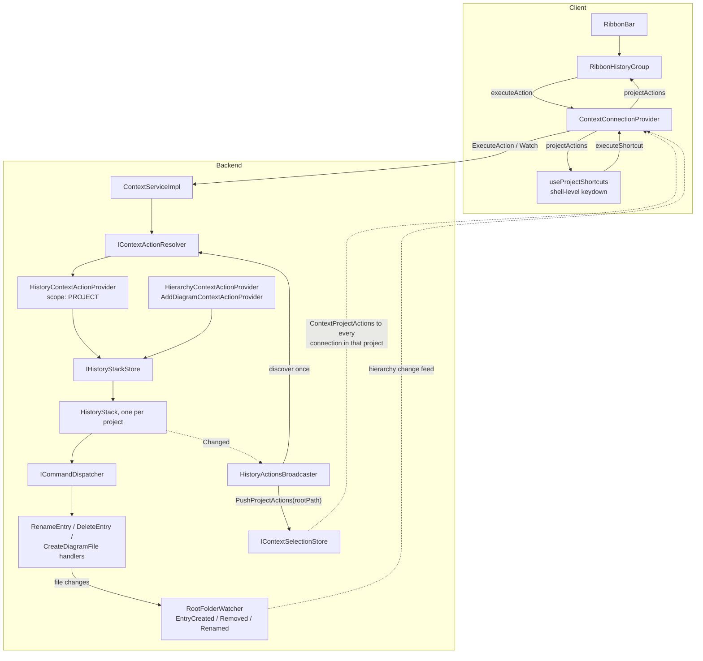
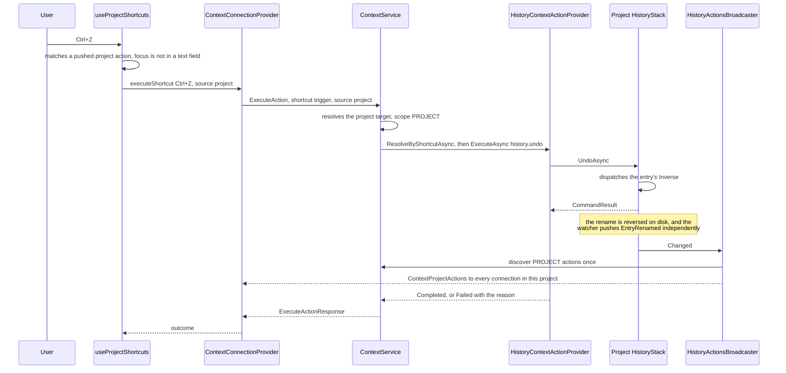

# Design Document

## Overview

Undo and redo already exist on the backend. `HistoryStack` records commands, walks them back and forward, serializes concurrent callers behind one gate, and bounds itself at 100 entries. `RenameEntryCommandHandler`, `DeleteEntryCommandHandler` and `CreateDiagramFileCommandHandler` already report inverses. What is missing is three things:

1. The stack is **one process-wide singleton** (`ServiceCollection.AddCommands.cs`, with a comment saying so and naming this spec as the fix). It must become one per project.
2. Nothing **offers** undo and redo to a user. There is no provider, no action, no shortcut.
3. The ribbon's Undo/Redo buttons are **mockup** — a pressed-state toggle under a `TODO(diagram-ide-mockup)`.

This design adds no history, no RPC and no client-side stack, per the *No second mechanism* rule. It adds one store, one provider, one broadcaster, one proto message and one client hook, and deletes the mock.

The one genuinely new piece is a **project-actions channel** on the existing context stream: actions that belong to the project rather than to the selection, pushed when they change. Requirement 5.5 asks for undo/redo on the "nothing selected" baseline; that baseline is only sent when nothing is selected, so it cannot keep a ribbon button correct while a file is selected. See *Deviation 1*.

## Steering Document Alignment

### Technical Standards (tech.md)

* **Commands.** Nothing here executes a change inline. Undo and redo dispatch `HistoryEntry.Inverse` and `HistoryEntry.Command` through the existing `ICommandDispatcher`, exactly as `HistoryStack` already does. This spec adds **no** new `ICommand` and no new handler — undo is not itself a command, it is the replay of one.
* **Context.** Undo and redo are contributed by an `IContextActionProvider` and reach the ribbon, the menu and the keyboard through the one path every other action uses. Executing them goes through the existing `ExecuteAction`. No dedicated RPC (Requirement 5.1).
* **Logging.** `HistoryStack` already holds `private static readonly ILogger _logger = Log.ForContext<HistoryStack>();`; the new types follow that shape.
* **`_Model` folder.** New POCOs (`HistoryAvailability`) go in `History/_Model/`.
* **One entity per file**, with the `CommandHandler`+`Command` pairing as the standing exception — not needed here, since no command is added.

### Project Structure (structure.md)

* Per-project history lives beside what it scopes: `EtAlii.Adp.Backend/History/`.
* The provider is a context concern acting on history, so it lives in `EtAlii.Adp.Backend/History/` too and is registered in `Program.cs` like every other provider — one line.
* **Core vs diagram-type plugins**: everything here operates on `ICommand`. Nothing names a diagram type, and no diagram module implements undo/redo (Non-Functional: *Modular Design*).
* Client changes stay within `src/client/src/shell/` — the ribbon and the context provider.

## Code Reuse Analysis

### Existing Components to Leverage

* **`HistoryStack`** — kept as-is except for one added event (below). Its gate satisfies Requirement 2.3, its capacity satisfies 4.4, its "leave the entry in place on a failed undo" behaviour satisfies the Reliability rule, and its `"There is nothing to undo."` / `"There is nothing to redo."` messages satisfy 5.6.
* **`ICommandDispatcher` / `CommandResult.Inverse`** — the whole of Requirement 3. "Recorded iff the handler reported an inverse" is already the only test `HistoryStack.ExecuteAsync` applies; Requirements 3.1–3.5 need no code at all, only tests that pin the behaviour.
* **`IContextActionProvider` / `IContextActionResolver`** — the seam Requirement 5.1 names. `ContextActionDefinition` already carries `Available` and `UnavailableReason` (Requirement 5.2) and an optional `ContextShortcutDefinition` (Requirement 5.4).
* **`IContextSelectionStore`** — already owns each connection's `ChannelWriter<ContextMessage>` and already pushes to it. The fan-out for Requirement 5.3 belongs here rather than in a second registry of connections.
* **`ContextMessageMapper.ToProto`** — maps `ContextActionGroupDefinition` to the wire unchanged.
* **`RibbonContextualGroups`** — the worked example of a ribbon group rendered from pushed actions, calling nothing but `executeAction`. The History group is the same shape, reading a different slice.
* **`HierarchyModelStore` / `ContextSelectionStore`** — the eviction pattern Requirement 4.5 points at: a `ConcurrentDictionary` keyed per scope, entries dropped when the last holder goes, with an idle timer.

### Integration Points

* **`ServiceCollection.AddCommands`** — the process-wide `IHistoryStack` registration is replaced by `IHistoryStackStore`. The comment naming this spec goes with it.
* **`HierarchyContextActionProvider` / `AddDiagramContextActionProvider`** — both take `IHistoryStack` in their constructor today. They take `IHistoryStackStore` instead and resolve per call from the target.
* **`ContextTarget`** — gains `RootPath`, so a provider can find the project's history without a second resolution. Two production construction sites (`HierarchyContextSourceResolver`, `ContextServiceImpl.RootTarget`).
* **`ContextServiceImpl.Watch`** — discovers project actions alongside the root actions it already discovers, and registers the connection under its project.
* **`Program.cs`** — one registration for `HistoryContextActionProvider`, one for `HistoryActionsBroadcaster`.
* **`RibbonBar.tsx`** — the `Edit` group is deleted from `RIBBON_GROUPS`; `RibbonHistoryGroup` takes its place.

## Architecture



The loop worth reading twice: a handler changes the disk, `HistoryStack` records it and raises `Changed`, the broadcaster re-discovers the project's actions **once** and hands the same list to every connection in that project. The change itself reaches clients through the streams that already carry it (Requirement 2.1) — the hierarchy feed for entries, later the delta stream for diagram content. The broadcaster carries only *what can now be undone*, never the change.

### Flow: pressing Ctrl+Z with a file selected



Note what is *not* here: no undo RPC, no client-side stack, and no second delivery of the change. The undone rename reaches every client the same way the original rename did.

### Why the history is keyed by project root path

`ProjectRootResolver.TryResolve` already turns a `project_id` plus a user id into an absolute root path, and every per-project call starts there. Keying the store by that resolved root path — not by `project_id` — means two users who opened the same folder as two differently-identified projects share one history, which is the correct answer: they are editing the same files, and two histories over one folder would each hold inverses the other has already invalidated. It also makes Requirement 5's Security rule structural: a caller who cannot resolve the root never reaches the stack.

### Why project actions are their own message

`ContextSelectionChanged.actions` carries **the innermost level's** actions, and `rootActions` are attached only when `selection` is absent. So today a client holding a selected file has no channel on which undo/redo could arrive or change. Three ways out were considered:

| | Approach | Rejected because |
|---|---|---|
| a | Register `HistoryContextActionProvider` for `ContextScope.Hierarchy` | Undo and Redo would appear in the right-click menu of every file and folder, since every hierarchy target would collect them. They are not actions *on a file*. |
| b | Add `project_actions` to `ContextSelectionChanged`, re-pushing the current selection on each history change | A history change would emit a selection message that is not a selection change. Every consumer of the selection — explorer focus, property grid, the diagram tab host — would see a fresh message and re-run its effects for something unrelated to it. |
| c | **A new `ContextMessage` member carrying project actions** | Chosen. |

(c) keeps selection consumers untouched, keeps the push small (one message per history change, per the Performance rule), and leaves the "nothing selected" baseline exactly as it is for the explorer's empty-space menu. It is not a second mechanism: the same stream, the same `IContextActionProvider`, the same `ExecuteAction`, the same `ContextActionGroup` shape.

### Modular Design Principles

* **Single file responsibility**: the store creates and evicts stacks; the provider describes and performs two actions; the broadcaster translates a history event into a push. None of the three knows what the others do internally.
* **No diagram-type knowledge**: everything operates on `ICommand` and `CommandResult`. When the `add`/`remove`/`group`/`ungroup` deltas arrive as commands, they inherit all of this with no change here.
* **Dependency direction**: `History` raises an event; `Context` subscribes. `HistoryStack` gains no reference to anything in `Context`.

## Components and Interfaces

### `IHistoryStackStore` / `HistoryStackStore` (`EtAlii.Adp.Backend/History/`, new)

* **Purpose**: one `IHistoryStack` per project root path, created on demand and released when the project's last connection goes (Requirements 1.5, 4.1, 4.5).
* **Interface**:
  * `IHistoryStack Get(string rootPath)` — creates on first ask; the same instance thereafter.
  * `void Retain(string rootPath)` / `void Release(string rootPath)` — called by `ContextServiceImpl.Watch` on registration and in its `finally`. On the last release the stack is disposed and dropped, behind the same idle-timer grace `ContextSelectionStore` uses so a reconnecting client does not lose its history to a momentary gap (Requirement 4.2).
  * `event EventHandler<HistoryChangedEventArgs>? Changed` — aggregated from every stack it holds, carrying the root path.
* **Reuses**: `ConcurrentDictionary` + idle-timer eviction from `HierarchyModelStore`; the `HistoryStack` constructor unchanged.
* **Note**: `Get` is deliberately not `TryGet`. A project with no history yet has an empty one, which answers "can I undo?" correctly without a null check at every call site.

### `HistoryStack` (`EtAlii.Adp.Backend/History/`, edited)

One addition: `public event EventHandler? Changed;`, raised after `ExecuteAsync` records an entry, after a successful `UndoAsync`, after a successful `RedoAsync`, and in `Clear`. Not raised when a command is rejected, and not raised when a command succeeds without an inverse — neither changes what can be undone.

Raised **outside** the gate's critical section, after the semaphore is released, so a subscriber that re-enters the store cannot deadlock the stack.

### `HistoryAvailability` (`EtAlii.Adp.Backend/History/_Model/`, new)

`public sealed record HistoryAvailability(bool CanUndo, bool CanRedo, int UndoCount, int RedoCount);` — one read of both sides under the stack's lock, so the provider cannot describe Undo from one moment and Redo from the next. Added to `IHistoryStack` as `HistoryAvailability Availability { get; }`; the existing four properties stay for callers that want one of them.

### `HistoryContextActionProvider` (`EtAlii.Adp.Backend/History/`, new)

* **Purpose**: offers and performs undo and redo (Requirement 5).
* **`Scope`**: `ContextScope.Project` (new enum value).
* **`DiscoverAsync`**: one group with two actions.

  | | Undo | Redo |
  |---|---|---|
  | `Id` | `history.undo` | `history.redo` |
  | `Label` | `Undo` | `Redo` |
  | `Icon` | `mdi-undo` | `mdi-redo` |
  | `Shortcut` | `Ctrl+Z` | `Ctrl+Y` |
  | `Available` | `Availability.CanUndo` | `Availability.CanRedo` |
  | `UnavailableReason` | `There is nothing to undo.` | `There is nothing to redo.` |

  Reported unavailable rather than omitted (Requirement 5.2), which also makes the shortcut inert — `ResolveByShortcutAsync` already ignores unavailable actions.
* **`ExecuteAsync`**: `history.undo` → `UndoAsync`, `history.redo` → `RedoAsync`; `ContextExecutionResult.Completed` on success, `Failed(result.Error)` otherwise (Requirement 5.6). Neither action prompts, so `ValidateAsync` and `CommitAsync` are not reachable and throw `NotSupportedException` — a programming error, not a user-facing one.
* **Ctrl+Shift+Z**: `ContextActionDefinition.Shortcut` is a single shortcut, and the redo action's is `Ctrl+Y`. The second accepted binding (Requirement 5.4) is handled where the alternative belongs — see *Deviation 2*.

### `HistoryActionsBroadcaster` (`EtAlii.Adp.Backend/Context/`, new)

* **Purpose**: Requirement 5.3, and nothing else.
* Singleton, started with the host. Subscribes once to `IHistoryStackStore.Changed`. On an event: discovers `ContextScope.Project` actions for that root path **once** through `IContextActionResolver`, then calls `IContextSelectionStore.PushProjectActions(rootPath, actions)`.
* Consecutive events for the same project within a short window collapse into one discovery-and-push, so a burst (a redo of several entries, or a handler that records more than one command) does not become a burst of pushes — the *no re-discovery storm* rule.
* A failing discovery is logged and pushes nothing; the clients keep the availability they last had rather than losing their buttons to a transient fault.

### `IContextSelectionStore` / `ContextSelectionStore` (edited)

* `Register` gains `rootPath` and `projectActions`, so the store knows which project a connection belongs to and can write the first project-actions message as part of the same baseline it already writes.
* New: `void PushProjectActions(string rootPath, IReadOnlyList<ContextActionGroupDefinition> actions)` — writes one `ContextMessage` to every entry whose root path matches, under each entry's existing gate. Connections in other projects are not touched.
* Everything else — `Set`, `Clear`, `PushTransient`, `UpdateFromTrack`, the tracks, the idle timer — is unchanged. Project actions are held per entry only so a re-registration can re-send them; they never mix into a `ContextSelectionChanged`.

### `ContextTarget` (`Context/_Model/`, edited)

Gains `string RootPath` — the project root the target was resolved within. Set by `HierarchyContextSourceResolver` and by `ContextServiceImpl.RootTarget`, both of which already hold it. This is what lets any provider reach its project's history without resolving a second time, and it is the shape the mindmap module's element resolver will need too.

### `ContextServiceImpl` (edited)

* `Watch`: discovers project actions beside the root actions it already discovers, passes both to `Register`, calls `IHistoryStackStore.Retain(rootPath)`, and `Release(rootPath)` in the existing `finally`.
* `TryResolveTargetAsync`: `ExecuteAction` with an explicit project source resolves to the project target (scope `Project`, `ResolvedFullPath` and `RootPath` both the root). With no source it keeps today's behaviour — the current selection, falling back to the hierarchy root target — so the explorer's existing "act on what is selected" path is untouched.
* `ContextSource` gains a `project` member (see *Data Models*), so a client can name the project as an action's target without naming an entry.

### `HierarchyContextActionProvider` / `AddDiagramContextActionProvider` (edited)

Constructor takes `IHistoryStackStore` instead of `IHistoryStack`; each `CommitAsync` resolves `_historyStacks.Get(target.RootPath)` and dispatches through it. No other change: they already build a command and dispatch it, and already never touch the filesystem themselves.

### `ContextConnectionProvider` (client, edited)

* Handles the new message case, holding `projectActions: ContextActionGroup[]` in the same state object as `selection`/`levels`/`actions`, exposed through a `useProjectActions()` hook.
* `executeAction` / `executeShortcut` gain the ability to name the project as the source, so the History group and the global shortcut act on the project rather than on whatever is selected.
* The reconnect path already re-opens `Watch`; registration re-sends the project actions, so a reconnected client is re-baselined without extra work.

### `RibbonHistoryGroup` (client, `shell/ribbon/`, new)

Renders one `ribbon-group` from `useProjectActions()`, in the same shape as `RibbonContextualGroups`: a button per action, `disabled={!action.available}`, `title={tooltipFor(action)}` — which already returns `unavailableReason` when unavailable, satisfying Requirement 6.3 through code that exists. It holds no state (Requirement 6.2) and calls nothing but `executeAction`.

Unlike `RibbonContextualGroups` it does **not** keep a last-shown fallback: project actions are not selection-dependent, so there is no gap to bridge.

### `useProjectShortcuts` (client, `shell/context/`, new)

A shell-level `keydown` listener matching against the pushed project actions — the global counterpart of the per-entry matching `ExplorerTreePanel` already does, and the same rule: no client-side key-to-action table.

Two guards, because Ctrl+Z means something else in a text field:

* If the event target is an `input`, `textarea` or anything `contenteditable`, the shortcut is left alone — the browser's own text undo wins.
* If a modal prompt is open (`ContextPromptHost` has a prompt), the shortcut is left alone.

`Ctrl+Shift+Z` is normalised to the redo action's `Ctrl+Y` before matching (*Deviation 2*).

### `RibbonBar` (client, edited)

The `Edit` group — `{ icon: "mdi-undo", label: "Undo" }` and its Redo twin — is removed from `RIBBON_GROUPS`, and `<RibbonHistoryGroup />` renders in its place. The `pressedIds` state and the `TODO(diagram-ide-mockup): wire real command handler` go with it (Requirement 6.4). `File` and `View` keep their mock buttons: they are other specs' business, and the `toggle` handler stays for them alone.

## Data Models

### `context.proto` (additions)

```proto
enum ContextScope {
  CONTEXT_SCOPE_UNSPECIFIED = 0;
  HIERARCHY = 1;
  PROJECT = 2;  // the project itself: actions that belong to it rather than to a selection
}

message ContextSource {
  oneof source {
    ShortGuid entry_id = 1;
    google.protobuf.Empty project = 2;  // the project this call is already scoped to
  }
}

// Actions that belong to the project rather than to what is selected, so they stay
// correct while the selection changes underneath them. Pushed when the connection
// registers and whenever they change - today, whenever the project's history changes.
message ContextProjectActions {
  repeated ContextActionGroup actions = 1;
}

message ContextMessage {
  oneof message {
    ContextSelectionChanged selection = 1;
    ContextPrompt prompt = 2;
    ContextProjectActions project_actions = 3;
  }
}
```

`project` is `Empty` rather than a project id: the request already carries `project_id` and the backend already resolved it, so a second copy would be a second thing to authorize and to disagree with.

### Backend records

```csharp
// History/_Model/HistoryAvailability.cs
public sealed record HistoryAvailability(bool CanUndo, bool CanRedo, int UndoCount, int RedoCount);

// History/_Model/HistoryChangedEventArgs.cs
public sealed class HistoryChangedEventArgs(string rootPath) : EventArgs
{
    public string RootPath { get; } = rootPath;
}

// Context/_Model/ContextTarget.cs - edited
public sealed record ContextTarget(
    ContextScope Scope,
    string ResolvedFullPath,
    bool IsContainer,
    ShortGuid SourceId,
    string RootPath = "");
```

`RootPath` is defaulted so the existing test construction sites keep compiling; production sites always pass it.

## Error Handling

### Error Scenarios

1. **Undo with an empty stack.** `HistoryStack.UndoAsync` returns `Failure("There is nothing to undo.")`. The provider maps it to `ContextExecutionResult.Failed`, which `ExecuteAction` returns as `accepted: false` with that message. In practice the button is already disabled and the shortcut already inert, so this is the race — two clients undoing the last entry at once — not the common path.
2. **The inverse fails when applied** (the file it would restore has been taken). `HistoryStack` already leaves the entry on the undo stack and returns the handler's message. The user sees why, and can retry once the obstacle is gone (Reliability rule). `Changed` is **not** raised: nothing moved.
3. **A command is recorded while another client is mid-undo.** `HistoryStack`'s single gate serializes them (Requirement 2.3). Whichever runs second sees the state the first left.
4. **The project's root folder disappears.** `ProjectRootResolver.TryResolve` fails before any target is built, so the call never reaches the store. The history stays in memory until its connections close, then is released.
5. **Discovery fails while broadcasting.** Logged; nothing is pushed; clients keep their last availability. The next history change corrects them.
6. **The client misses a project-actions push** (stream interrupted). Reconnecting re-registers, which re-sends them. No polling, no reconciliation.
7. **A handler records more than one command for one user action.** Each is its own undo entry, so the user undoes them one at a time. Whether that is right is the handler's business, not this spec's — the alternative (a composite command) is a handler-side concern that this design neither needs nor blocks.

## Testing Strategy

### Unit Testing

* **`HistoryStackStore.Tests`** — `Get` returns the same instance for one root path and different instances for two; `Release` past the last retain disposes and drops it; a `Retain` inside the grace window keeps it; `Changed` fires with the root path of the stack that changed.
* **`HistoryStack.Tests`** (extended) — `Changed` fires on a recorded execute, on a successful undo and on a successful redo; does **not** fire on a rejected command, on a success without an inverse, or on a failed undo. Pins Requirements 3.1, 3.2 and 3.5, which are behaviour that already exists and has no test naming it as required.
* **`HistoryContextActionProvider.Tests`** — both actions are always offered; `Available` tracks the stack; the unavailable reasons are the stack's own messages; `ExecuteAsync` undoes and redoes; an unknown action id is rejected.
* **`HistoryActionsBroadcaster.Tests`** — one history change produces exactly one discovery and one push; a burst collapses; a failing discovery pushes nothing and does not throw.
* **`ContextSelectionStore.Tests`** (extended) — `PushProjectActions` reaches every connection in one project and no connection in another; registration writes project actions as part of the baseline.
* **Client**: `RibbonHistoryGroup.test.tsx` — renders from pushed actions, disabled with the reason as tooltip, calls `executeAction` and nothing else. `useProjectShortcuts.test.ts` — Ctrl+Z runs the matched action; ignored in an input, a textarea, a contenteditable, and while a prompt is open; Ctrl+Shift+Z reaches redo.

### Integration Testing

* **`UndoRedoFlow.Tests`** — over the real host: rename an entry through the context action, watch the project actions arrive with Undo available, execute `history.undo` through `ExecuteAction`, assert the file is back under its old name and that the `EntryRenamed` reached the hierarchy stream.
* **Per-project isolation** — two projects, a command in each, undo in one; the other's history and files are untouched. This is Requirement 1.5 and the Security rule in one test.
* **Two connections, one project** — a command on connection A makes Undo available on connection B's stream (Requirement 2.2), and B's undo is visible to A.
* **Delete is not undoable** — deleting an entry records nothing, so Undo stays reporting the previous entry rather than offering to bring the file back (Requirement 3.5).

### End-to-End Testing

Covered by the integration tests above plus a manual pass: with a file selected, Ctrl+Z undoes the last project change while the selection stays put; the ribbon's Undo greys out when the history empties; typing Ctrl+Z inside the rename dialog edits the text rather than undoing the project.

## Deviations and notes

**Deviation 1 — project actions travel on their own message, not on the "nothing selected" baseline.** Requirement 5.5 says undo and redo "SHALL be offered on the baseline the context stream already carries for 'nothing selected'". Implemented literally, the ribbon's Undo button would be correct only while nothing is selected, and would have no channel to be corrected on while a file is selected — which contradicts the same sentence's stated purpose, "so they remain available and correct while the selection changes underneath them". This design keeps the purpose and changes the carrier: a `ContextProjectActions` message on the same stream, pushed at registration and on every history change. The "nothing selected" baseline keeps carrying the hierarchy root's actions exactly as it does today. **This needs approval before implementation**, since it reads against the letter of an approved requirement.

**Deviation 2 — `Ctrl+Shift+Z` is normalised on the client.** Requirement 5.4 wants both `Ctrl+Y` and `Ctrl+Shift+Z` to reach redo. `ContextActionDefinition.Shortcut` holds one shortcut, and widening it to a list would touch the proto, the mapper, the resolver's `ResolveByShortcutAsync`, the menu and the explorer's matcher — for one alternative binding on one action. `useProjectShortcuts` instead rewrites a `Ctrl+Shift+Z` event to `Ctrl+Y` before matching. The backend still holds the single authoritative binding, and no key-to-action table appears on the client — only a key-to-key alias. If a second action ever needs an alternative binding, that is the moment to widen the definition rather than now.

**Note — `IHistoryStack` stays.** The interface is unchanged apart from `Availability` and `Changed`; only its *registration* becomes per project. Callers that hold one still hold a real stack, and `TestHistory.Create()` keeps working for tests that want a stack without a project.

**Note — nothing here makes deltas undoable.** When `add`/`remove`/`group`/`ungroup` become commands whose handlers report inverses, they land on their project's history and appear under the same Undo button with no change to this design. That is the point of Requirement 3.1 being the only test.

**Out of scope, deliberately**: the ribbon's `File` (Save/New) and `View` (Zoom) mock buttons, which belong to other specs; composite commands (one undo entry for several recorded commands); and persisting history across a backend restart, which Requirement 4.3 explicitly does not ask for.
