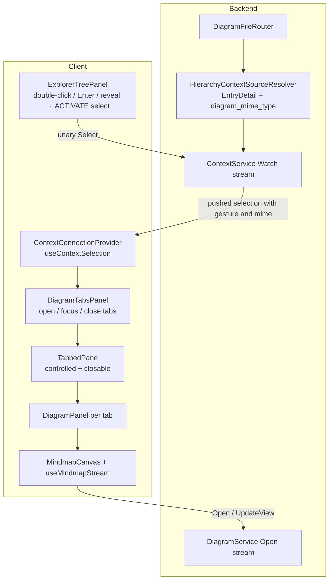

# Design Document

## Overview

The workspace's centre pane becomes a real diagram tab system. The backend tells the client which selected entries are diagrams by putting the diagram's MIME type on the `EntryDetail` it already pushes; a new `DiagramTabsPanel` subscribes to the pushed selection and opens, focuses and closes tabs from it; the explorer's post-create reveal activates the new entry instead of merely focusing it, so a freshly added mindmap opens through exactly the rule a double-click uses. `DiagramPanel`, `MindmapCanvas` and `DiagramService.Open` are already built and are consumed, not changed in shape — the one functional addition below the tab system is a *failed* state on the mindmap stream hook, so a tab whose file vanished degrades to a clear message instead of reconnecting forever.

Everything here is the thin layer the mindmap spec left blocked: its Requirement 1.7 (open and focus a created mindmap) and `adp-diagram-ide` Requirements 1.2/1.3 (open-or-focus, close-stops-sync) are the behaviours being delivered.

## Steering Document Alignment

### Technical Standards (tech.md)

- **Context**: the tab system is a pure subscriber of the pushed selection. It adds no RPC and no stream; the one wire change is a new field on a message the context stream already carries, resolved by the backend — "extend the chain, don't add a parallel message".
- **gRPC call shapes**: untouched. An open tab *is* an open `DiagramService.Open` server stream (owned by `MindmapCanvas`'s hook); closing the tab unmounts the canvas, which aborts the stream — "stop syncing" needs no new contract.
- **Module boundaries**: nothing in the tab system names a diagram type. `freeplane/mindmap` appears only in `DiagramPanel`'s existing canvas routing. A later module's canvas becomes openable by extending that one routing point, never the tab system.
- **Implementation order**: wire protocol first (the `EntryDetail` field and its backend resolution, with tests), then the client UI, then the remaining behaviours (reveal upgrade, failure state) — bottom-up, per the steering order.

### Project Structure (structure.md)

- Backend change lives in `EtAlii.Adp.Backend/Hierarchy/` (the resolver that already builds `EntryDetail`); its tests extend the existing `HierarchyContextSourceResolver.Tests.cs` under `Unit Tests/Hierarchy/`.
- Client additions live where their kind already lives: the panel in `src/client/src/shell/panels/`, the pane extension in `src/client/src/shell/panes/`, tests beside their subjects as `*.test.tsx`.
- The `.proto` change is in the shared `src/api/` folder, commented in the file's own style, and the gitignored client stubs are regenerated with `npm run generate`.

## Code Reuse Analysis

### Existing Components to Leverage

- **`DiagramFileRouter`** (`Hierarchy/DiagramFileRouter.cs`): already answers "is this file a diagram, and of which type" for every case Requirement 1 names — `Routed`, `UnknownType`, `Ambiguous`, `Unreadable`, `NotADiagram`. It is not modified; the resolver maps its answer onto the new field.
- **`HierarchyContextSourceResolver`**: already holds the router (it uses it in `NestingOf`) and already constructs the `ContextLevelDetail`/`EntryDetail` this design extends — the change is a few lines where the detail is built, with no new dependency.
- **`ContextConnectionProvider`**: `useContextSelection()` delivers the pushed chain, its per-level details and the transient flag; the existing `innermostAction(selection)` helper reads the gesture. The tab system consumes these as-is.
- **`ExplorerTreePanel`'s gesture machinery**: `selectNode(key, {case:"action", …})` plus `gestureKeyRef` (which suppresses the duplicate plain focus-select after a gesture) is exactly what the reveal upgrade calls — the double-click path, invoked from one more place.
- **`TabbedPane`**: stays the one tab presentation component, extended with optional controlled/closable behaviour; its three existing call sites keep working unchanged.
- **`DiagramPanel` / `OpenDiagram`**: the value it already accepts (`projectId`, `entryId`, `path`, `mimeType`) is what each tab supplies; its canvas routing gains only a named-type placeholder branch.
- **`useMindmapStream`**: keeps its reconnect-and-rebaseline loop; gains the bounded failure policy of Requirement 5.

### Integration Points

- **Context stream** (`context.proto` → `ContextMessage.selection.levels[].entry`): carries the new `diagram_mime_type`. A client without the field (or a stale stub) sees an empty string and behaves as today — additive on the wire and in behaviour.
- **`WorkspaceShell`**: the two hard-coded "Diagram 1"/"Diagram 2" tabs are replaced by `<DiagramTabsPanel projectId={projectId} />` in the same grid position.
- **`DiagramService.Open`**: unchanged. Its error codes become meaningful to the client: `FailedPrecondition` (cannot be opened — missing, unroutable) and `Unimplemented` (no session factory for the type) are treated as permanent; anything else stays a transient reconnect.

## Architecture

The selection is the only bus. The backend annotates it; the tab system reacts to it; nothing asks anything.



### Modular Design Principles

- **Single File Responsibility**: the tab *model* (which diagrams are open, which is focused, how a push maps to open/focus) lives in one new file; presentation stays in `TabbedPane`; rendering a diagram stays in `DiagramPanel`.
- **Component Isolation**: `DiagramTabsPanel` knows nothing about mindmaps, files or gRPC — it turns pushed selections into a list of `OpenDiagram` values and hands each to `DiagramPanel`.
- **Service Layer Separation**: the backend half is entirely inside the existing resolver; no service, store or handler changes.

## Components and Interfaces

### 1. `EntryDetail.diagram_mime_type` (wire, `src/api/context.proto`)

- **Purpose:** the backend's one-word answer to "is this entry a diagram, and which kind", carried on the detail every hierarchy selection level already has (Requirement 1).
- **Interface:** `string diagram_mime_type = 3;` — empty for anything that is not an openable diagram. Commented in the file's own style: why it is resolved by the backend, and why ambiguous bodies stay empty.
- **Regeneration:** `dotnet build` regenerates the C# types; `npm run generate` must be run because `src/client/src/generated/context_pb.ts` is gitignored and a stale copy fails silently.

### 2. `HierarchyContextSourceResolver` (modify, backend)

- **Purpose:** fill the new field where the `EntryDetail` is built, for files only (a folder is never a diagram).
- **Mapping** (`_router.Route(fullPath)`):
  - `Routed(definition, …)` → `definition.Origin.MimeType`
  - `UnknownType(_, mimeType)` → that `mimeType` — the registration names a type this deployment lacks; the client opens a tab that says so (Requirements 1.4, 4.4)
  - `Ambiguous`, `Unreadable`, `NotADiagram` → `""` — a file the backend refuses to route, cannot read, or that is no diagram is not presented as openable (Requirements 1.2, 1.3)
- **Cost:** one `Route` call per resolved file level — a first-line read for `.adp` files, in code the resolver already exercises for `NestingOf`.

### 3. `TabbedPane` (modify, client)

- **Purpose:** grow the presentation the diagram tabs need without disturbing the three static call sites.
- **Interface (all additions optional):**
  - `activeTabId?: string` + `onSelectTab?: (id) => void` — controlled mode; when absent the existing internal state is used.
  - `onCloseTab?: (id) => void` — renders a close control per tab and closes on middle-click (auxclick); its presence also keeps the tab strip visible for a single tab, since a closable tab must show its close control.
  - `emptyState?: ReactNode` — rendered in the content area when `tabs` is empty (today an empty list renders nothing).
  - `tooltip?: string` on `TabDef` — the project-relative path (Requirement 4.1).
- **Reuses:** current markup, roles and classes; new controls follow the existing `mdi` icon and class conventions with centralized styling.

### 4. `DiagramTabsPanel` (new, `src/client/src/shell/panels/DiagramTabsPanel.tsx`)

- **Purpose:** the centre pane — owns the open-tab list and focus, and is the only consumer of the open/focus rule.
- **State:** `tabs: { key, diagram: OpenDiagram }[]` and `activeKey`, plain `useState` — per-connection, in-memory, dies with the page (Requirement 4.5).
- **The rule (one effect):** on a pushed selection whose `selection` **object reference is new** (a ref remembers the last handled one, so transient/preview pushes and unrelated re-renders never re-trigger it — Requirement 2.3), when the chain's innermost level is an entry id, its pushed `EntryDetail` carries a non-empty `diagram_mime_type`, and `innermostAction(selection) === ACTIVATE`:
  - `key = base64(entryId) + "|" + path.join("/")` — entry **and** path, so re-activating a renamed file opens a fresh tab while the stale one stays independently closable (Requirement 5.2)
  - key already open → focus that tab (Requirement 2.2); otherwise append `{key, diagram}` and focus it (Requirement 2.1)
- **Close:** remove the tab; if it was active, focus the nearest remaining neighbour; unmounting the tab's `DiagramPanel` unmounts the canvas, whose effect cleanup aborts the `Open` stream — closing is what stops the sync (Requirement 4.2).
- **Render:** the extended `TabbedPane`; label = base name without `.adp` (a bare body keeps its own extension: `notes.mm` is its name), icon = the explorer's diagram icon (`mdi-graph-outline`), tooltip = project-relative path, content = `<DiagramPanel diagram={…} />`, `emptyState` = one sentence inviting a double-click in the explorer (Requirements 4.1, 4.3).
- **A deliberate emergent behaviour:** when the context store rewrites a tracked selection after a rename and re-pushes it still carrying its `ACTIVATE` gesture, the new path makes a new key and a tab opens under the new name. This is accepted, not suppressed: it approximates rename-following through the standard rule with zero special code, and the stale tab degrades per Requirement 5.1.

### 5. `ExplorerTreePanel` reveal upgrade (modify, client)

- **Purpose:** Requirement 3 — creation opens through the same rule.
- **Change:** in the existing reveal effect, after `focusNode(leafKey)`, also `selectNode(leafKey, { case: "action", value: ContextSelectionAction.ACTIVATE })`. The existing `gestureKeyRef` suppresses the duplicate plain focus-select, exactly as it does for a double-click. A revealed non-diagram entry is simply activated-and-selected; the tab system ignores it (Requirement 3.4). The reveal's timeout path is untouched (Requirement 3.3).

### 6. `DiagramPanel` (modify, client — one branch)

- **Purpose:** Requirement 4.4 — a named type without a canvas explains itself.
- **Change:** `mimeType === "freeplane/mindmap"` keeps routing to `MindmapCanvas`; any other **non-empty** type renders a placeholder naming it ("No canvas can render `{mimeType}` diagrams yet."). The no-`diagram` fallback remains for safety but is no longer reachable from the tab system, which always supplies one.

### 7. `useMindmapStream` failure state (modify, client)

- **Purpose:** Requirement 5.1 — a dead diagram degrades instead of reconnecting forever.
- **Change:** the hook returns `failed: boolean`. A stream error whose Connect code is **permanent** — `FailedPrecondition` (the backend's "cannot be opened": missing, unroutable), `NotFound`, or `Unimplemented` (no session factory) — stops the retry loop and sets `failed`. Every other error keeps today's back-off-and-reopen behaviour. A file deleted mid-stream ends the stream; the re-open then hits `FailedPrecondition` and the tab settles into the failed state without any backend change.
- **`MindmapCanvas`:** when `failed`, renders the unavailable message naming the project-relative path (Requirement 5.1) instead of the canvas. The tab itself stays, closable as ever.

## Data Models

### `EntryDetail` (proto, extended)

```proto
message EntryDetail {
  EntryKind kind = 1;
  bool available = 2;
  // The diagram type of this entry, resolved by the backend through the same routing that
  // opens it - the .adp first line, or a declared body extension for a bare body. Empty for
  // anything that is not an openable diagram, including a body whose extension more than one
  // type claims (diagram-workspace-tabs Requirement 1).
  string diagram_mime_type = 3;
}
```

### `DiagramTab` (client, local to `DiagramTabsPanel`)

```ts
interface DiagramTab {
  key: string;          // base64(entryId) + "|" + path.join("/") - entry AND location
  diagram: OpenDiagram; // the value DiagramPanel already accepts (projectId, entryId, path, mimeType)
}
```

`OpenDiagram` is unchanged and stays defined in `DiagramPanel.tsx`.

## Error Handling

### Error Scenarios

1. **Activation of a diagram whose type this build has no canvas for** (including an `.adp` naming an unknown type)
   - **Handling:** the tab opens; `DiagramPanel` renders the named-type placeholder. No stream is opened for it.
   - **User Impact:** a tab titled with the file's name saying "No canvas can render `vendor/type` diagrams yet."

2. **The file behind an open tab is deleted, renamed or moved**
   - **Handling:** the `Open` stream ends; the re-open fails `FailedPrecondition`; the hook stops retrying and reports `failed`.
   - **User Impact:** the tab remains, showing "This diagram is no longer available at `docs/architecture.adp`."; it closes like any tab, and re-activating the file under its new name opens a fresh tab.

3. **A bare body with an ambiguous extension is selected**
   - **Handling:** the resolver leaves `diagram_mime_type` empty (the router's `Ambiguous`); activation selects but opens nothing.
   - **User Impact:** none beyond today — the file behaves as a plain file, matching the backend's refusal to guess.

4. **Transient stream failure (backend restarting, network blip)**
   - **Handling:** unchanged — the hook backs off and re-opens; the first message re-baselines.
   - **User Impact:** the canvas catches up by itself; the tab never changes state.

5. **Activation of a non-diagram file** (double-click on `readme.md`, or a future reveal of one)
   - **Handling:** the gesture selects it, as `activate` already does today; the tab system sees an empty `diagram_mime_type` and does nothing.
   - **User Impact:** selection moves; no tab appears.

## Testing Strategy

### Unit Testing

- **`HierarchyContextSourceResolver.Tests` (extend):** a registered `.adp` mindmap resolves detail with `freeplane/mindmap`; a bare `.mm` body resolves the same; an `.adp` naming an unknown type carries that type; an ambiguous bare body and a plain `.txt` carry empty; a folder carries empty.
- **`DiagramTabsPanel.test.tsx` (new):** an `ACTIVATE` push of a diagram entry opens a focused tab; a plain push and a transient preview open nothing; re-activating focuses without a duplicate; the same entry under a changed path opens a second tab; closing the active tab focuses the neighbour and unmounts the content; closing the last shows the empty state; a no-canvas type renders the named placeholder; the same selection object re-observed does not re-trigger.
- **`TabbedPane.test.tsx` (new):** controlled selection, close control and middle-click close, strip visible for one closable tab, `emptyState` rendering, and the existing uncontrolled behaviour untouched.
- **`ExplorerTreePanel` reveal (extend existing test):** the reveal now issues the `ACTIVATE` gesture selection, exactly once, and the timeout path still clears without one.
- **`useMindmapStream` / `MindmapCanvas` (extend):** a `FailedPrecondition` stream error yields `failed` and no further reconnect; a generic error keeps reconnecting; the canvas renders the unavailable message when failed.

### Integration Testing

- **`ContextSelectionFlow.Tests` (extend):** selecting a real registered mindmap in the temp project pushes a level whose `EntryDetail.DiagramMimeType` is `freeplane/mindmap`; selecting a plain file pushes it empty — proving the field over the real host, resolver and router.

### End-to-End Testing

- The manual pass that `mindmap-diagram` task 24 already owes (create a mindmap, see it open in a focused tab, type into it, close it, reopen it) runs after this spec's implementation, from a worktree on alternate ports per CLAUDE.md; anything found lands as a test or a `tests.md` entry.
