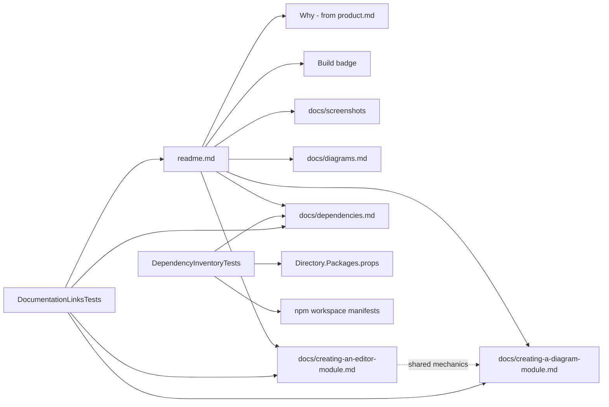

# Design Document

> **Correction, 2026-09-03.** Where this document names `ExampleReplicationTests`, that test no
> longer exists: it byte-compared each module's `examples/` tree against its `src/examples/`
> replica and was deleted when the two trees were deliberately disconnected. The root-locating
> walk this spec borrows from it survives unchanged in `ExampleRegistrationTests.Locate()` and
> in this spec's own `DocumentationLinksTests`, and the references have been repointed there.
> The remaining mentions describe guide content about what the guard enforced; the shipped
> guide does not name it, so nothing in `docs/` is stale as a result.


## Overview

Three deliverables, all documentation, one small guard test:

1. **`readme.md`** at the repository root — why ADP exists, the build badge exactly as the user gave it, how to run it (release and source), what it looks like, and four onward links.
2. **Developer documentation** under `docs/` — two walkthrough documents, one per plugin family, each tracing a real shipped module end to end: `docs/creating-a-diagram-module.md` (traced against the **timeline** module) and `docs/creating-an-editor-module.md` (traced against **markdown**, with **plain** as the fallback contrast). Shared mechanics live in the diagram document and are referenced from the editor one.
3. **`docs/dependencies.md`** — backend and client dependency tables, kept true by a test in the existing backend suite that fails, with a row-naming message, whenever the document and the package manifests disagree.

Plus the supporting cast: `docs/screenshots/` with the images and a capture-procedure readme precise enough that a second person retakes a comparable image, and a link-integrity test so no delivered document can point at a 404.

The design's one organising idea: **every claim these documents make is either verified by a test, traced to a named file, or linked to where the rule already lives.** Documentation in this repository follows the same rule as code — a gate nobody runs is not a gate.

## Steering Document Alignment

### Technical Standards (tech.md)

- **Checking that conventions are followed**: tech.md's stance is that a convention is enforced or it rots. The dependency guard and the link test apply that stance to documentation, using the same test suite and the same CI gates that already run.
- **Don't reinvent, integrate**: the readme's "why" section is derived from `product.md`, not re-invented; the walkthroughs reference tech.md's "Specifying a diagram type" and "Declaring a diagram definition" sections for what they already define instead of duplicating their lists.
- **Testing & quality**: the two new tests are xUnit v3 tests in `EtAlii.Adp.Backend.Tests`, arrange/act/assert, judged by exit code through the existing `Build` workflow — no new build step.

### Project Structure (structure.md)

- The readme is `readme.md`, lower-case, at the root — the naming every other readme in the tree already uses.
- All new documents live under `docs/`, beside `docs/diagrams.md`; screenshots under `docs/screenshots/`.
- The walkthroughs document exactly the module layout structure.md defines (`src/diagrams/<diagram>/` and `src/editors/<editor>/` with `backend/`, `api/`, `client/`, `examples/`) and link to it rather than restating it.
- Naming in prose follows structure.md: organisation "EtAlii", product "ADP", spelled out once as "A Different Perspective".

## Code Reuse Analysis

### Existing Components to Leverage

- **`ExampleRegistrationTests.Locate()`** (`src/backend/EtAlii.Adp.Backend.Tests/Integration Tests/ExampleRegistration.Tests.cs`): the walk-up-from-the-test-binary pattern for finding `src/` — the exact shape the dependency guard and link test need, reused rather than re-derived.
- **`src/package.json` workspaces declaration**: the client-manifest discovery rule. The guard expands the workspace globs from this file rather than hard-coding a folder list, so a module client that gains a `package.json` tomorrow is covered on arrival.
- **`src/Directory.Packages.props`**: the single authoritative backend version manifest (17 `PackageVersion` entries today), already carrying reason-for-usage prose in comments for the non-obvious packages (YamlDotNet's is a worked example of the tone the reason column wants).
- **The steering documents and CLAUDE.md**: the upstream sources every rule links to. The readme derives from `product.md`; the walkthroughs link CLAUDE.md's catalog rule, test command, line-ending policy and code-style sections.
- **`src/diagrams/readme.md`, `src/editors/readme.md`, `src/client/src/canvas/elements/readme.md`, `src/client/src/canvas/connections/readme.md`**: existing deeper references the walkthroughs point into rather than absorb.
- **`src/examples/`**: the combined example project — the screenshot source material and the "point ADP at this first" folder the readme names.
- **The release workflow's own readme text** (`.github/workflows/build.yml`, "Write the release readme" step): the run-a-release instructions the root readme must agree with, quoted as the source of truth for the release path.

### Integration Points

- **The `Build` workflow**: both new tests run inside the existing "Backend tests" gate; the badge in the readme reports this workflow.
- **The spec-workflow dashboard**: this spec's own documents stay dashboard-renderable (no raw HTML, no fences indented inside list items).
- **CLAUDE.md**: gains nothing. Where a walkthrough and CLAUDE.md would state the same rule, the walkthrough links. (Requirement 8.4's refresh rule *is* recorded in CLAUDE.md — see "The refresh rules" below — as one short subsection, which is an addition, not a fork.)

## Architecture

The deliverables form a small directed graph with the readme as the single entry point:



### Modular Design Principles

- One document, one audience: the readme is for a visitor, the walkthroughs for a module author, the inventory for an assessor, the screenshots readme for whoever retakes an image. No document serves two audiences at once.
- Shared content is written once: the mechanics both plugin families share (discovery, definitions, the client glob, examples replication, the test command) live in the diagram walkthrough; the editor walkthrough links to those sections by anchor and covers only what genuinely differs.
- The two tests are separate files with separate concerns: one guards the dependency inventory, one guards link integrity. Neither knows about the other.

## Components and Interfaces

### Component 1 — `readme.md` (repository root)

- **Purpose:** the front door: why, status, how, what it looks like, where next.
- **Structure**, in order (Requirement NFR-Usability: essentials above the fold):
  1. Title (`# ADP — A Different Perspective`), a one-line tagline, and the badge on its own line, using the user's markdown exactly as given: `[](https://github.com/vrenken/EtAlii.Adp/actions/workflows/build.yml)`.
  2. **Why** — three to five paragraphs derived from `product.md`: the crossroad architecture tooling stands at in an AI-accelerated development landscape; ADP's stance (architectural artifacts are repository artifacts: plain, diffable, branched and merged with the code); linkage over illustration; familiar surface; minimal footprint. Prose, not bullets; features named only in service of the why.
  3. **What it looks like** — the workspace overview screenshot, then a gallery of individual diagram shots and one editor shot (see Component 4 for the exact set).
  4. **Getting started** — three subsections:
     - *From a release*: download the ZIP from the Releases page, `dotnet EtAlii.Adp.Backend.Service.dll` (requires the .NET 10 runtime), browse to the logged address, and first set `LocalAuthenticator` username/credential in `appsettings.json` — matching the release readme the pipeline writes, verbatim where it quotes commands.
     - *From source*: SDK pinned by `src/global.json`; `npm install` in `src/`; backend from `src/backend/EtAlii.Adp.Backend.Service/` in the `developer` environment (port 5080, the address the browser uses); Vite dev server from `src/client/` (port 5174, proxied); developer credentials `admin`/`changeme` from `appsettings.developer.json`. One line + link to CLAUDE.md for running the test gates.
     - *First session*: log in, add a project by pointing ADP at a folder, open diagrams from the explorer — with `src/examples/` named as the folder to point at first.
  5. **Going deeper** — the four onward links: `docs/diagrams.md` (the catalog, with its state tracking named), the two walkthroughs, and `docs/dependencies.md`. All links relative.
- **Dependencies:** `product.md` (derived-from), the release workflow (agreement), the screenshots (referenced).
- **Reuses:** the release readme's wording for the release path.

### Component 2 — `docs/creating-a-diagram-module.md`

- **Purpose:** the diagram-module walkthrough — a newcomer builds a module from this document alone, with the **timeline** module (`src/diagrams/timeline/`) as the traced, named worked example throughout. Timeline is chosen deliberately: it is a recently completed, full-shape module — single-definition `Diagram` class with a `Build` delegate, an owned extension (`.tml`), all the seams, its own `.proto`, byte-compared fixtures with their `.gitattributes` line, a client that reuses the shared canvas library (the `span` element, the `interactive-bezier` connection), and examples replicated into `src/examples/`.
- **Structure** (each section names timeline's real file as its worked example, and follows tech.md's bottom-up implementation order):
  1. *What a module is* — the folder layout, linking `structure.md` and `src/diagrams/readme.md`; the dependency direction (module depends on core abstractions, never the reverse).
  2. *Specify first* — one paragraph linking tech.md's "Specifying a diagram type" for what a spec must decide; this document owns the implementation path only (Requirement 6.4).
  3. *The definition* — `Diagram.cs`: `DiagramOrigin` (`vendor/type`, the MIME line of an `.adp`, the catalog's Origin tag), `DocumentExtension`, the named `DiagramDefinition` property, the `Build` delegate, and `Definitions`; startup discovery (`DiagramDefinitionDiscovery` → `AddDiagramDefinitions` → `Build`), which is why adding a module edits no core file. Links tech.md's "Declaring a diagram definition" for the stub-vs-implemented shapes.
  4. *The document path* — store/parser/writer (`TimelineDocumentStore`, `TimelineParser`, `TimelineWriter`): one store owning documents and identities, a parser that never throws, a writer that splices lines rather than re-serialising, and the round-trip guarantee this shape exists to honour.
  5. *The session* — `TimelineSessionFactory`/`TimelineSession`, baseline/deltas, and the layout fork with one shipped example of each side: positions authored in the document (wardley-map, timeline's time axis) versus computed by the module (mindmap).
  6. *Commands* — every edit an `ICommand` with an inverse through the history stack; timeline's `Commands/` folder as the shape.
  7. *The context seams* — source resolver, action provider, property provider, toolbox provider, validator: one sentence each on what the seam is for and which are optional, with `ServiceCollection.AddTimeline.cs` as the single registration surface.
  8. *The wire* — `api/timeline.proto`, payloads packed into the core `Element`'s `Any`, and the buf `generate` step in `src/client/package.json` a module with its own proto must join.
  9. *The client* — `client/register.ts` discovered by the shell's `import.meta.glob` (`src/client/src/shell/panels/diagramCanvases.ts`), the module `package.json` under the npm workspace (`src/package.json`), and the shared canvas library (`src/client/src/canvas/`) with its elements/connections readmes as the deeper reference.
  10. *Tests, fixtures and examples* — the `.Tests` project shape (xUnit v3, `<OutputType>Exe</OutputType>`), CLAUDE.md's test command linked not restated, byte-compared fixtures and the `.gitattributes` extension rule (linking the reasoning comment already written in `.gitattributes` itself), the module `examples/` folder and its replication into `src/examples/` guarded by `ExampleReplicationTests`.
  11. *The catalog* — link CLAUDE.md's diagram-catalog rule; the row moves through its states as the module does.
- **Dependencies:** the timeline module (traced), tech.md/structure.md/CLAUDE.md (linked).
- **Reuses:** every named file exists today; Requirement 8's verification is executed by opening each one during writing, and the trace of Requirement 8.2 uses timeline itself.

### Component 3 — `docs/creating-an-editor-module.md`

- **Purpose:** the editor-family walkthrough, traced against **markdown** (`src/editors/markdown/`) with **plain** as the contrast that makes the fallback rule concrete.
- **Structure:** what is identical to diagrams is one short section of anchor links into Component 2 (layout, discovery, workspace, glob, examples, tests). Family-specific sections: `Editor.cs` and `EditorDefinition` (claims by extension list and by exact file name, case-insensitive); the `plain` editor claiming nothing and catching everything, last-resort by construction; two editors claiming one extension being a startup error, not a race; the `IEditorSessionFactory` seam; the client panel registered through the same glob under the `editor/<id>` mime convention.
- **Honesty rule (Requirement 7.3):** while tracing, any piece of the markdown module that turns out to be a placeholder is documented as such. Known instance to check at writing time: `src/editors/markdown/client/readme.md` still calls the client a placeholder while `MarkdownEditorPanel.tsx` and `register.ts` exist beside it — the walkthrough states what is actually there, and that stale readme is corrected in passing (a one-line fix, in scope as documentation).
- **Dependencies:** the markdown and plain modules (traced), Component 2 (referenced), the `modular-text-editors` spec (background link).

### Component 4 — `docs/screenshots/` and its capture procedure

- **Purpose:** the images the readme shows, plus `docs/screenshots/readme.md` recording how each was taken — precisely enough that a second person (or an agent driving the in-app browser) retakes a comparable image after a UI change.
- **The set** (7 images, PNG):
  1. `workspace.png` — the overview: explorer, an open C4 diagram from `src/examples/diagrams/c4/`, and the property grid visible in one shot. Budget ≤ 1 MB.
  2. `mindmap.png`, `wardley-map.png`, `timeline.png`, `azure-pipeline.png`, `dependency-graph.png` — one diagram tab each, from the corresponding `src/examples/diagrams/` document. Budget ≤ 300 KB each. (Five individual types + C4 in the overview = six of the seven exampled types; ansible-structure is the deliberate omission, and the procedure readme says a type can be added by following the same recipe.)
  3. `markdown-editor.png` — `src/examples/editors/markdown/guide.md` open in the markdown editor. Budget ≤ 300 KB.
- **The capture procedure**, one entry per image, each recording: the example document opened (repository path), the app URL and environment (`developer`, backend 5080), the browser viewport in CSS pixels (**1600×900**) at device pixel ratio 1 and 100% zoom, the app theme (the default), which panels are open and their approximate widths, what is selected (or that nothing is), the canvas state (fit-to-view or default), and the crop (full viewport, no browser chrome). Two captures that follow one entry must differ only in rendering noise. The procedure also names the refresh trigger (Requirement 4.6) and the size budgets, and states that every image must be reproducible from `src/examples/` content alone.
- **`.gitattributes`:** no change. The root `text=auto` rule already leaves binary files untouched (the requirements record the reasoning); the design chooses *not* to add the optional commented `*.png -text` line, because a line that changes nothing invites the next reader to wonder what it fixes.

### Component 5 — `docs/dependencies.md`

- **Purpose:** the dependency inventory. Two sections — **Backend** and **Client** — each one standard markdown table with columns **Dependency**, **Version**, **Reason for usage**, **License**.
- **Row rules:**
  - Backend: one row per `PackageVersion` entry in `src/Directory.Packages.props` (17 today), version transcribed exactly.
  - Client: one row per distinct package name across `src/package.json` and the workspace manifests it declares — `src/client/package.json` plus every `src/diagrams/*/client/package.json` (8 today: ansible-structure, azure-pipeline, c4, databricks, dependency-graph, mindmap, timeline, wardley-map) — covering `dependencies` and `devDependencies`. The version cell carries the manifest's specifier verbatim (`^18.3.1`); a package whose manifests disagree on the specifier gets every distinct specifier, sorted and comma-separated, which makes range divergence visible instead of hidden.
  - Reason: one author-written sentence in the reader's terms, from how the repository actually uses the package (the YamlDotNet comment in `Directory.Packages.props` is the tone model). Never blank; an unexplainable dependency is a finding.
  - License: the SPDX expression from the package's own metadata (NuGet license expression; npm `license` field), read at time of writing.
- **Header note in the document itself:** one short paragraph saying the tables are guarded by `DependencyInventoryTests`, what the guard checks (names and versions), and what it deliberately does not (reasons, licenses — with the version-change-forces-the-row-edit rule for re-checking licenses).

### Component 6 — `DependencyInventoryTests` (new, `src/backend/EtAlii.Adp.Backend.Tests/Integration Tests/DependencyInventory.Tests.cs`)

- **Purpose:** Requirement 9.5's guard. Fails when `docs/dependencies.md` and the manifests disagree; passes silently otherwise.
- **Interfaces:** xUnit v3 facts in the existing backend test project, run by the existing gate.
- **Behaviour:**
  1. Locate the repository root by walking up from the test binary (the `ExampleRegistrationTests.Locate()` shape — the folder that contains both `src/diagrams` and `docs`).
  2. Parse `src/Directory.Packages.props` with `XDocument`: every `PackageVersion` `Include`/`Version` pair.
  3. Parse `src/package.json` with `System.Text.Json`, read its `workspaces` globs, expand them against the filesystem (supporting the literal form and the one-level `*` those globs use), and collect `dependencies` + `devDependencies` from the root and every workspace manifest. **The discovery rule is the workspaces declaration, not a folder scan** — the 55 module folders of which only 8 carry a manifest today are exactly why: a folder scan would have to define "counts as a client package" a second time, and the two definitions would drift. If a manifest exists that the workspaces do not name, npm does not install for it either — that is a repository inconsistency this test is not responsible for.
  4. Parse the two tables in `docs/dependencies.md`: under the `## Backend` and `## Client` headings, each `|`-delimited row's first two cells, back-ticks stripped, header and separator rows skipped.
  5. Compare as sets and report **every** discrepancy in one failure, each line naming the row and the fix:
     - missing: `The Client table is missing 'react' (^18.3.1, from src/client/package.json). Add a row - and write its reason and license, they cannot be generated.`
     - spurious: `The Backend table lists 'Foo', which src/Directory.Packages.props no longer references. Remove the row, or restore the package.`
     - mismatched: `The Backend table records 'Grpc.Tools' at '2.82.0' but src/Directory.Packages.props says '2.83.0'. Update the row and re-check its license.`
   A guard that only says "dependencies.md is wrong" trains people to regenerate rather than think; every message names the row, the authoritative source, and the human step the fix includes.
- **Dependencies:** the filesystem only. No network, no package restore, no license lookup — which is exactly why licenses are out of the guard's scope.
- **Reuses:** the `Locate()` walk-up pattern; `IoPath` aliasing convention; the collected-failures reporting style.

### Component 7 — `DocumentationLinksTests` (new, same folder)

- **Purpose:** the NFR-Reliability link check, as a guard rather than a one-off task: every relative link in the delivered documents resolves to an existing file.
- **Behaviour:** for each delivered document (`readme.md`, `docs/dependencies.md`, the two walkthroughs, `docs/screenshots/readme.md`), extract markdown links and image references, ignore absolute URLs and in-page anchors, resolve relative targets against the document's folder (stripping `#fragment` and `:line` suffixes), and assert the target exists. One collected failure listing every dead link with its source document.
- **Scope is the delivered list, not a repository-wide crawl:** `docs/diagrams.md` and the module readmes predate this spec and are not retro-guarded here; widening the net is a later decision, deliberately not smuggled into this one.

### The refresh rules (Requirement 8.4)

CLAUDE.md gains one short subsection beside the existing diagram-catalog rule, stating: (a) when a change moves a touch point named in `docs/creating-a-diagram-module.md` or `docs/creating-an-editor-module.md`, the document is updated in the same change; (b) when the UI changes so a `docs/screenshots/` image no longer shows what a user sees, the image is retaken per the capture procedure. This is the same standing-rule mechanism the catalog already uses, extended to two more artifacts — recorded in CLAUDE.md because that is the file agents working here are bound by. The dependency inventory needs no such rule: its guard is a test.

## Data Models

### Dependency row (as parsed by the guard)

```
DependencyRow
- name: string        (first table cell, backticks stripped)
- version: string     (second cell, verbatim specifier; comma-joined when manifests disagree)
- section: Backend | Client
```

### Manifest entry (as parsed by the guard)

```
ManifestEntry
- name: string
- specifier: string   (Version attribute, or the npm range as written)
- source: string      (repo-relative manifest path, for failure messages)
```

### Screenshot procedure entry (prose schema in docs/screenshots/readme.md)

```
CaptureEntry
- image: file name
- document: repo-relative path under src/examples/
- viewport: 1600x900 CSS px, DPR 1, 100% zoom
- theme: app default
- panels: which are open, approximate widths
- selection: what is selected, or none
- canvas: fit-to-view or default
- budget: <= 300 KB (overview <= 1 MB)
```

## Error Handling

### Error Scenarios

1. **The dependency guard fires on an intentional package change**
   - **Handling:** the failure message names the row, the manifest, and the fix including the human half ("update the row and re-check its license"). The developer edits one documented line as part of the bump.
   - **User Impact:** a red "Backend tests" gate whose message is the todo item itself.

2. **The guard's markdown parser meets a reformatted table**
   - **Handling:** the parser is deliberately minimal (rows under a known heading, split on `|`); if the document is restructured, the guard fails with row-level messages showing everything missing at once — loud and obvious, not subtly wrong. The document's header note names the test so the reader knows what to keep parseable.
   - **User Impact:** one failing test naming the document.

3. **A screenshot goes stale after a UI change**
   - **Handling:** no test can see this; the CLAUDE.md refresh rule plus the capture procedure make retaking cheap and reproducible. The manual-verification culture (`tests.md`) is the model: what cannot be automated is written as an executable procedure.
   - **User Impact:** none until noticed; the rule exists to shorten "until noticed".

4. **The badge shows nothing for an unauthenticated viewer**
   - **Handling:** accepted and documented in the requirements: on a private repository the badge's audience is exactly the readme's audience. Nothing to handle in the readme itself.
   - **User Impact:** none for anyone who can see the readme at all.

5. **A walkthrough names a path that later moves**
   - **Handling:** the link test catches moved *files* the moment the target vanishes; renamed types and seams inside files are covered by the CLAUDE.md refresh rule.
   - **User Impact:** a failing test naming the dead link, or a same-change doc update.

## Testing Strategy

### Unit Testing

- `DependencyInventoryTests`: beyond the live comparison against the real repository, the parsing helpers are exercised through it implicitly; the test is intentionally a comparison of two on-disk artifacts, so a "unit" fixture would only duplicate the repository.
- `DocumentationLinksTests`: runs against the delivered documents in the repository; a dead link in any of them is a red gate.

### Integration Testing

- Both new tests live in `Integration Tests/` beside `ExampleRegistrationTests`, follow its repository-locating pattern, and run in the existing backend gate — integration in the sense that the repository itself is the fixture.

### End-to-End Testing

- **The walkthrough trace (Requirement 8.2):** performed as an implementation task, not a test file — the timeline module is walked file by file against `docs/creating-a-diagram-module.md`, and the markdown+plain modules against the editor walkthrough. Every touch point the documents name must exist in the traced module or be marked optional; anything in the module the document cannot explain is a finding to resolve before the documents ship. The tasks record the trace's outcome in the implementation log.
- **The first-session path:** the readme's from-source and first-session steps are executed once against the real app (backend + client started, login with the developer credentials, `src/examples/` added as a project, a diagram opened) as part of the screenshot-capture task — capturing the screenshots *is* the end-to-end verification of the getting-started instructions, one task doing double duty.
- **Screenshot budgets:** checked at capture time (file sizes are visible in the commit); no test, since a byte-budget test would fire on every legitimate re-capture and teach people to raise the cap rather than recompress.
