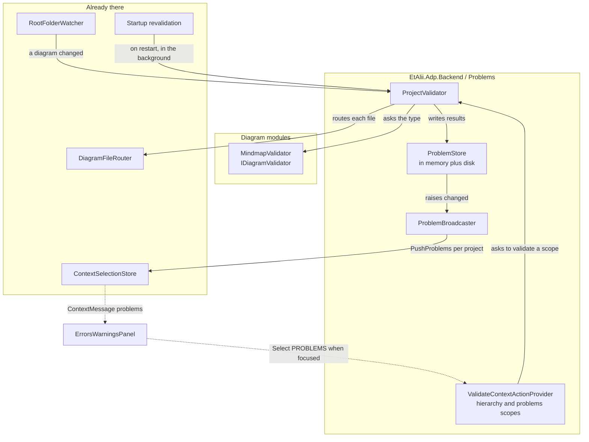
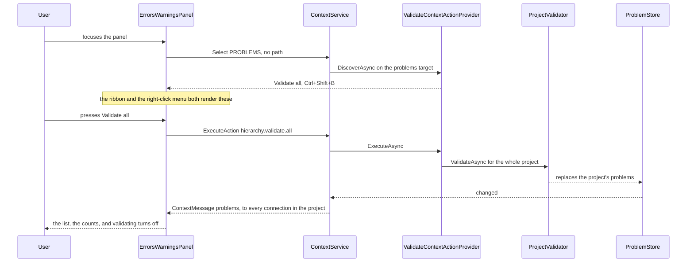

# Design Document

## Overview

The panel is a **subscriber to a project-wide problem set that the backend owns**. Nothing on the client computes, filters out, or remembers a problem; it renders what the connection's `Watch` stream delivers, exactly as the ribbon renders pushed actions today.

Five backend pieces, each with one job:

| Piece | Job |
| --- | --- |
| `IDiagramValidator` | A diagram type says what is wrong with a document of its type. The one seam a module implements. |
| `ProjectValidator` | Walks a scope (one file, a folder, the project), routes each file, calls the validator, returns problems. Knows no diagram type. |
| `IProblemStore` / `ProblemStore` | Holds the current problem set per project, persists it, answers "is this entry stale", and raises a change when it moves. |
| `ProblemBroadcaster` | Subscribes to the store and pushes to every connection in that project, through the selection store's existing per-project fan-out. |
| `ValidateContextActionProvider` (×2) | Offers **Validate** on a hierarchy target and **Validate all** on the panel, as ordinary context actions with their shortcuts as data. |

And on the client: `ErrorsWarningsPanel` becomes real, `ContextConnectionProvider` gains a `problems` slot fed by the new `ContextMessage` member, and the panel reports itself as the selection when focused - which is the whole mechanism behind "Validate all appears in the ribbon".

**Everything this spec adds is additive.** One `ContextMessage` member, one `ContextSource` member, one `ContextScope` value, one seam, one store, two providers. No existing abstraction changes shape.

## Steering Document Alignment

### Technical Standards (tech.md)

* **Backend owns state, client renders it.** The problem set lives on the backend and arrives by push. The client's only state is which severities the user is filtering to (Requirement 1.8) - a view preference, not data.
* **Context service for everything selection-shaped.** Validate reaches the ribbon, the right-click menu and the keyboard through `IContextActionProvider`, with the shortcut as data. No new RPC: `ExecuteAction` already carries it.
* **One entity per file**, `_Model` for POCOs, handlers in a `Commands` subfolder of their area.
* **Serilog structured logging** with named placeholders, as the rest of the backend now uses.

### Project Structure (structure.md)

* **Core vs diagram-type plugins.** `EtAlii.Adp.Diagram` gains `IDiagramValidator` beside `IDiagramDocumentFactory`; core resolves it by `DiagramOrigin` and never names a type. Core compiles and its tests pass with zero validators registered.
* New backend code lives in `EtAlii.Adp.Backend/Problems/`, with `_Model/` for the records - a new area beside `Context/`, `Hierarchy/`, `Diagrams/` and `History/`.

## Code Reuse Analysis

### Existing Components to Leverage

* **`DiagramFileRouter`** - already answers "is this a diagram, of what type, and where is its body", and already names the failure modes `UnknownType`, `Ambiguous`, `Unreadable`. The traversal is a loop over files calling it; Requirement 2.2's core problems are those three outcomes, which today are computed and discarded.
* **`IContextSelectionStore.PushProjectActions(rootPath, …)`** - the existing per-project fan-out, written for undo/redo availability. `PushProblems` is the same shape and the same reason: state that belongs to the project, not to one connection's selection.
* **`IContextActionProvider` + `ContextActionResolver`** - two more providers, aggregated with the rest. `HistoryContextActionProvider` is the worked example of a non-hierarchy scope.
* **`useProjectShortcuts`** - already runs project-scope actions from pushed shortcut data with `preventDefault`; `Ctrl+Shift+B` needs no new listener. The explorer's own matcher covers `F6` on a selection.
* **`RootFolderWatcher` → `HierarchyModel.EntryChanged`** - already reports created/renamed/removed/updated per project. Requirement 5 subscribes; nothing new watches the filesystem.
* **`pendingReveal` / `clearReveal`** (`ContextConnectionProvider`) - already carries "show this path in the hierarchy", used when Add creates a file. Activating a problem sets it (Requirement 7.7) rather than inventing a second reveal.
* **`FileProjectStore`'s application-data location** - the precedent for per-project state stored outside the project folder (Requirement 4.5).
* **`ContextPromptHost` / `Dialog`** - not needed: no Validate action prompts.

### Integration Points

* **`context.proto`**: `ProjectProblems` + `Problem` messages, a fourth `ContextMessage` member, a `problems` member on `ContextSource`, a `PROBLEMS` value on `ContextScope`.
* **`Program.cs`**: register the store, the validator resolver, the broadcaster's hosted service, and the two providers.
* **`EtAlii.Adp.Diagram`**: the `IDiagramValidator` seam; `EtAlii.Adp.Diagram.Mindmap` implements the first one.

## Architecture



### Request flow: Validate all from the panel



For **Validate on a diagram or a folder** the flow is the same from `ExecuteAction`, with a `source` naming the entry and the validator given that scope. The result still reaches every connection: a problem list that differs between two people looking at the same project would be a bug (Requirement 6.4).

### Modular Design Principles

* **Single file responsibility**: traversal, storage, broadcast, and the two action providers are separate files; the store does not validate and the validator does not push.
* **Component isolation**: `ProjectValidator` depends on the router and the validator registry - not on the context service, not on gRPC. `ProblemBroadcaster` is the only piece that knows both the store and the selection store, and it is a subscriber, so a later consumer (a status-bar count, a CI report) attaches to the store without touching either.
* **Service layer separation**: the provider decides *what is offered and what it means*; `ProjectValidator` decides *what is wrong*; the store decides *what is remembered*; the service decides *whom to tell*.

## Components and Interfaces

### `IDiagramValidator` (`EtAlii.Adp.Diagram/IDiagramValidator.cs`, new)

* **Purpose:** Requirement 3 - the one seam a diagram type implements to have rules.
* **Interface:**
  ```csharp
  public interface IDiagramValidator
  {
      /// <summary>The diagram type whose documents this judges.</summary>
      DiagramOrigin Origin { get; }

      /// <summary>
      /// The problems in <paramref name="document"/>, or none. <paramref name="baseName"/> is
      /// the diagram's file base name, for messages that want to name it.
      /// </summary>
      ValueTask<IReadOnlyList<DiagramProblem>> ValidateAsync(
          string document, string baseName, CancellationToken cancellationToken);
  }
  ```
* **`DiagramProblem`** (`_Model/`): `Severity` (`Error` | `Warning`), `Message`, `RuleId`, `Location` (`DiagramProblemLocation?` - an element id or a line number; null means "the file itself").
* **Registration:** `AddSingleton<IDiagramValidator, MindmapValidator>()`, resolved by `Origin` through a `DiagramValidators` registry mirroring `DiagramDocumentFactories`. **No validator registered for a type is not an error** (Requirement 3.3) - unlike `IDiagramDocumentFactory`, whose absence `DiagramDocumentFactories.Verify` reports at startup, because a type must be able to create a document but need not have rules.
* **Versioning:** the registry exposes a `RulesVersion` per origin (the module assembly's informational version), stored on each cache entry so Requirement 4.7 can invalidate what an older validator produced.

### `ProjectValidator` (`Backend/Problems/ProjectValidator.cs`, new)

* **Purpose:** Requirements 2, 3.4-3.5, 6 - walk a scope, produce problems, never trust a module.
* **Interface:**
  ```csharp
  public sealed class ProjectValidator
  {
      ValueTask<ValidationOutcome> ValidateAsync(ValidationScope scope, CancellationToken cancellationToken);
  }

  // File(rootPath, relativePath) | Folder(rootPath, relativePath) | Project(rootPath)
  public abstract record ValidationScope;
  ```
* **Behaviour:** enumerate (one file; a folder recursively; the whole root), skipping anything outside the root and any reparse point that leaves it (Requirement 2.5). Per file: `DiagramFileRouter.Route` →
  * `Routed` → read the body, look up the validator by origin, call it under a **timeout** and a `try` (Requirement 3.4-3.5); a throw or a timeout becomes one problem attributed to that module.
  * `UnknownType` / `Ambiguous` / `Unreadable` → one core problem each, `RuleId` prefixed `core.` (Requirement 2.2).
  * `NotADiagram` → nothing (Requirement 2.3).
  * An `IOException` reading a file or a folder → one core problem, and the walk continues (Requirement 2.6).
* **Never writes a diagram file** (Requirement 6.7): it opens documents read-only.
* **Concurrency (Requirement 6.5):** one running validation per project root, held in a `ConcurrentDictionary<string, Task>`. A second request for the same project **joins the running one** rather than starting a second traversal or refusing - the user asked for a fresh answer and will get one, which refusing would not give them. A request for a *narrower* scope while a project-wide run is in flight also joins it. This is a deliberate reading of "coalesce with the running one **or** refuse, and say which".

### `IProblemStore` / `ProblemStore` (`Backend/Problems/`, new)

* **Purpose:** Requirements 1.2, 4, 5.2-5.3 - what is currently known, and what survives a restart.
* **Interface:**
  ```csharp
  public interface IProblemStore
  {
      ProjectProblemSet Get(string rootPath);
      void Replace(string rootPath, IReadOnlyList<StoredProblem> problems);      // Validate all
      void ReplaceFor(string rootPath, IReadOnlyList<string> relativePaths,
                      IReadOnlyList<StoredProblem> problems);                     // one file or a folder
      void Remove(string rootPath, string relativePath);                          // the file is gone
      void Move(string rootPath, string fromRelativePath, string toRelativePath); // renamed or moved
      event Action<string>? Changed;                                              // rootPath
  }
  ```
* **Per entry** (`StoredProblem`): the problem, plus the file's `LastWriteTimeUtc` and `Length` at the time, plus the `RulesVersion` that produced it. `Get` compares those against the file now and marks an entry **stale** rather than dropping it (Requirement 4.4) - a stale problem shown as stale is more useful than a blank panel.
* **Persistence:** one JSON file per project under the application-data folder `FileProjectStore` already uses, named by a hash of the root path. Written debounced after a change, read on first `Get`. A missing, unreadable or version-mismatched file yields an empty set whose state is `NeverValidated` (Requirements 4.6, 1.7) - it never throws into project opening.
* **`ProjectProblemSet`** carries `State` (`NeverValidated` | `Validating` | `Validated`), the problems, the counts, and `TruncatedAt` if bounded (Requirements 1.4, 1.5, 1.7, 5.6).

### `ProblemBroadcaster` (`Backend/Problems/ProblemBroadcaster.cs`, new)

* **Purpose:** Requirements 1.1, 1.2, 6.4 - the only piece that couples problems to connections.
* **Behaviour:** subscribes to `IProblemStore.Changed` and calls `IContextSelectionStore.PushProblems(rootPath, set)`, which fans out to every connection registered for that root - the same mechanism `PushProjectActions` uses, and the reason two viewers cannot disagree. `ContextSelectionStore.Register` also writes the current set as part of the baseline (Requirement 1.2).

### `StartupRevalidation` (`Backend/Problems/StartupRevalidation.cs`, new)

* **Purpose:** Requirement 4.8 - the cache converges on the truth after a restart without anyone asking.
* **Behaviour:** an `IHostedService` that, after the host is running, walks the known projects and queues a project validation for each, **sequentially and at low priority**, so a user with twenty projects does not meet twenty concurrent traversals at boot. A project opened meanwhile is served from cache immediately (Requirement 4.2) and its revalidation is **moved to the front of the queue**, because that is the one whose freshness the user can see. A project whose root is missing or unreadable is skipped with a warning, not retried in a loop.

### `ValidateContextActionProvider` + `ValidateAllContextActionProvider` (`Backend/Problems/`, new)

* **Purpose:** Requirements 6, 7, 8.
* **Hierarchy provider** (`Scope => ContextScope.Hierarchy`): offers `problems.validate` - "Validate", `mdi-check-circle-outline`, shortcut `F6` - when the target is a folder, or a file the router recognises as a diagram; **offers nothing at all otherwise** (Requirement 6.6), which is why a `.txt` file's menu gains no greyed entry. Labelled "Validate" for a diagram and "Validate folder" for a folder, so the menu says what it will cover (Requirement 7.2).
* **Problems provider** (`Scope => ContextScope.Problems`): offers `problems.validate.all` - "Validate all", `mdi-check-all`, shortcut `Ctrl+Shift+B` - always, even with no validators deployed (Requirement 7.6), since core's own router problems are worth finding. Unavailable with a reason while a validation is already running for that project.
* **Both:** `ExecuteAsync` calls `ProjectValidator` and returns `Completed`; neither prompts, so `ValidateAsync`/`CommitAsync` are unreachable and throw, as `HistoryContextActionProvider`'s already do.
* **Not commands** - see *Deviations* 1.

### `context.proto` (edited)

See *Data Models*.

### `ErrorsWarningsPanel` (`client/src/shell/panels/ErrorsWarningsPanel.tsx`, rewritten)

* **Purpose:** Requirements 1.6-1.8, 7.3-7.4, 7.7.
* **Behaviour:** renders `useContextProblems()` - the new slot on the connection. A header with the counts and three small toggle buttons (errors, warnings) filtering the list (Requirement 1.8); the filter is client-only view state and never changes what the backend sends, so the counts stay honest while the list is filtered. The body is a `role="list"` of problems, each showing severity icon, message, and project-relative path with an optional location. Empty renders "No problems found" when `Validated` and "Not checked yet" when `NeverValidated` (Requirement 1.7); `Validating` shows progress without blocking (Requirement 5.6); a truncated set says so (Requirement 1.5).
* **Focus → selection:** on focus, `select(selectionFor(PROBLEMS, PROBLEMS_SOURCE, …))`; on blur to somewhere outside the panel, nothing - the selection stays until something else claims it, exactly as the explorer's does. **This one line is what puts "Validate all" in the ribbon** (Requirement 7.4): the ribbon is already a pure subscriber to the selection's actions.
* **Right-click** anywhere in the panel opens the `ContextMenu` from those same pushed actions (Requirement 7.3) - the pattern `ExplorerTreePanel`'s empty space already uses.
* **Activating a problem** (click or Enter) calls `setPendingReveal(problem.path.segments)`, which the hierarchy already acts on (Requirement 7.7).
* **Keyboard:** roving `tabIndex` over the list, Up/Down to move, Enter to activate - the same discipline as the explorer and the choice dialog.

### `ContextConnectionProvider` (client, edited)

* One more message case: `problems` updates a `problems` state slot, exposed as `useContextProblems()`. Nothing else changes.

## Data Models

### `context.proto` (additions)

```protobuf
// What a problem is about, inside the file that has it. Absent means the file itself.
message ProblemLocation {
  oneof location {
    ElementId element_id = 1;
    uint32 line = 2;
  }
}

enum ProblemSeverity {
  PROBLEM_SEVERITY_UNSPECIFIED = 0;
  WARNING = 1;
  ERROR = 2;
}

message Problem {
  ProblemSeverity severity = 1;
  string message = 2;              // meant for the user
  Path path = 3;                   // project-relative; never absolute
  ProblemLocation location = 4;    // unset: the file itself
  string rule_id = 5;              // "core.unknown-type", "mindmap.empty-root", ...
  bool stale = 6;                  // the file changed since this was found
}

// Whether the set can be believed, and how far it got.
enum ProblemSetState {
  PROBLEM_SET_STATE_UNSPECIFIED = 0;
  NEVER_VALIDATED = 1;             // nothing has been checked - not the same as "clean"
  VALIDATING = 2;
  VALIDATED = 3;
}

message ProjectProblems {
  ProblemSetState state = 1;
  repeated Problem problems = 2;
  uint32 error_count = 3;          // of the whole set, not of what was sent
  uint32 warning_count = 4;
  uint32 truncated_at = 5;         // 0 when the whole set was sent
}

message ContextMessage {
  oneof message {
    ContextSelectionChanged selection = 1;
    ContextPrompt prompt = 2;
    ContextProjectActions project_actions = 3;
    ProjectProblems problems = 4;   // new
  }
}

// ContextSource gains, alongside entry_id / element_id / project:
//   google.protobuf.Empty problems = 4;   // the panel itself, routed to ContextScope.PROBLEMS
// ContextScope gains:
//   PROBLEMS = 4;
```

### Backend records (`Backend/Problems/_Model/`, one per file)

```
DiagramProblem          : Severity, Message, RuleId, Location (in EtAlii.Adp.Diagram)
DiagramProblemLocation  : ElementId? | Line?          (in EtAlii.Adp.Diagram)
StoredProblem           : Problem (DiagramProblem), RelativePath, LastWriteTimeUtc, Length, RulesVersion
ProjectProblemSet       : State, Problems, ErrorCount, WarningCount, TruncatedAt
ValidationScope         : File | Folder | Project
ValidationOutcome       : Problems, FilesConsidered, Skipped
```

## Error Handling

### Error Scenarios

1. **A validator throws.** Caught per file; one problem naming the module (`RuleId` `core.validator-failed`), the file keeps whatever else was found, the walk continues (Requirement 3.4).
2. **A validator hangs.** Bounded by a timeout; abandoned, recorded the same way, the walk continues (Requirement 3.5).
3. **A file cannot be read.** One core problem for that file; the walk continues (Requirement 2.6).
4. **A folder cannot be enumerated.** One core problem for that folder; its siblings still get walked (Requirement 2.6).
5. **The cache is corrupt or from an incompatible version.** Empty set, state `NeverValidated`; the project opens normally (Requirement 4.6). Logged at warning.
6. **A validation is requested while one runs for that project.** The caller joins the running one (Requirement 6.5); the action shows unavailable with "A validation is already running." for anyone arriving through the menu.
7. **A project root is gone at startup revalidation.** Skipped with a warning; no retry loop (Requirement 4.8).
8. **The problem set exceeds the bound.** Sent truncated with `truncated_at` and full counts; the panel says how many are not shown (Requirements 1.4, 1.5).

## Testing Strategy

### Unit Testing

* **`ProjectValidator`** against a temp folder and test-supplied validators: each router outcome becoming (or not becoming) a problem; a throwing validator; a hanging validator; an unreadable file; containment refusal; **no diagram file is written** (assert the listing is unchanged); a second concurrent request joining the first (one traversal, both callers answered).
* **`ProblemStore`**: replace-all vs replace-for-paths vs remove vs move; staleness by last-write and by length; `RulesVersion` invalidation; round-trip through disk; a corrupt file yielding `NeverValidated`; `Changed` raised once per mutation.
* **`ValidateContextActionProvider`**: offered for a folder and a diagram, **not offered** for a plain file; labels; the `F6` shortcut carried as data. **`ValidateAllContextActionProvider`**: always offered, `Ctrl+Shift+B`, unavailable with a reason while running.
* **`StartupRevalidation`**: queues every known project; an opened project jumps the queue; a missing root is skipped, not retried.
* **Client** `ErrorsWarningsPanel`: renders problems, counts and severity; the filter buttons narrow the list without changing the counts; `NeverValidated` vs `Validated`-and-empty say different things; focus reports a `PROBLEMS` selection; right-click opens the menu from pushed actions; activating a problem sets `pendingReveal`; keyboard navigation with one Tab stop.
* **`ContextConnectionProvider`**: a `problems` message updates the slot and nothing else.

### Integration Testing

* **`ProblemsFlowTests`** against the real host: watch a project → baseline carries a `NEVER_VALIDATED` set; `ExecuteAction` `problems.validate.all` with the panel source → a `problems` message arrives with the expected problems from a seeded broken diagram; a **second connection** to the same project receives the same set (Requirement 6.4); `Validate` on one folder updates only that folder's files; deleting a diagram drops its problems; renaming carries them across.
* **A module with no validator** contributes no problems while core's router problems still appear (Requirements 3.3, 7.6).

### End-to-End Testing

* Manual pass on the real app, recorded in the implementation log: seed a project with a valid mindmap, a `.adp` naming an unknown MIME type, and an unreadable file; Validate all from the panel's menu and from `Ctrl+Shift+B`; `F6` on a folder; the filter buttons; clicking a problem revealing the file; the counts; and the panel after a backend restart (cache served at once, then refreshed).

## Deviations and notes

1. **Validation is not a command, and does not enter the history stack.** tech.md says anything that changes state is an `ICommand` with an inverse. Validation changes no state the user authored - it refreshes derived data about files it never touches - and "undo a validation" has no meaning. Making it a command would put entries on the undo stack that a user pressing Ctrl+Z would be surprised to meet, and would push their real edits further away. The rule's purpose is that *changes to the user's work* are reversible; this is not one.
2. **A second Validate joins the running one rather than being refused.** Requirement 6.5 allows either. Joining is chosen because both callers want the same thing - a fresh answer - and refusing gives them a dialog instead of one. The action still reports unavailable in the menu while a run is in flight, so the refusal path is what a user *sees* and the joining is what a keypress *does*.
3. **The severity filter is client-side.** The backend always sends the whole (possibly truncated) set with true counts; the panel narrows what it draws. A backend-side filter would make the counts and the list disagree the moment a second connection filtered differently, and would put a view preference into a shared, project-wide push.
4. **`PROBLEMS` is a scope as well as an existing selection source.** `ContextSelectionSource.PROBLEMS` already exists - it says *which surface* produced a selection. Routing an action needs a `ContextScope`, which is a different axis, so this spec adds one. The panel with no particular problem selected is expressed as a `ContextSource.problems` of `Empty`, mirroring how `project` is expressed for undo/redo.
5. **Requirements 4.2 and 4.8 are complementary, not in tension.** On restart the cache is served immediately for whatever is opened (4.2) *and* a background pass reconciles it with disk (4.8). The panel therefore shows something at once, marked stale where the files have moved on, and settles.
6. **Per-diagram live problems (Requirement 1's "what is open right now") ride the same push.** An open diagram that changes is a changed file; the watcher path (Requirement 5.1) revalidates it and the same broadcast delivers it. There is no second, editor-local problem channel - which keeps one list rather than two that can disagree.
