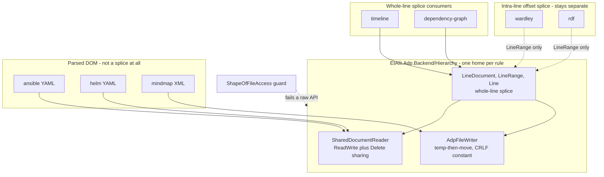

# Design Document

## Overview

This design centralizes ADP's file layer onto seams the repository already has, and it does so by *deleting* duplication rather than adding a home for it. Its scope is deliberately narrow: how bytes are opened, how a save is published, which terminator is written, and how a line-oriented document is spliced. Grammars, serializers and models stay exactly where they are.

Three things shape it, and all three were measured rather than assumed:

1. **The requirements' headline defect is already fixed.** They were written against `764c176b`; this design is written against **`d2464cc3`**, and in between the two flawed header helpers were converted. That does not retire the spec — it changes what the spec is *for*, from "fix these two" to "make the next two impossible".
2. **The strongest centralization candidate is not the one the requirements named.** `LineRange` is declared four times, identically. The requirements discussed the timeline/dependency-graph pair, which Requirement 4.1 would call a coincidence needing an explicit argument; a four-consumer identical value type needs no argument at all.
3. **Two live scans overlap this ground.** `backend-consistency` names three core read sites, and `diagram-module-conformance` names a fixture line-ending divergence that touches Discipline 4. This design states how it composes with both rather than racing them.

## Survey, re-measured at `d2464cc3`

Requirement 1.1 requires the survey refreshed against this document's own commit. Every figure below was re-counted; production code only, excluding `bin/`, `obj/` and `*.Tests`.

| Population | At `764c176b` | At `d2464cc3` | Change |
|---|---|---|---|
| Document stores | 11 | **11** | unchanged |
| Document types | 10 | **10** | unchanged |
| Writer classes | 10 | **10** | same count, **different membership** |
| `File.ReadAllText` (files) | 9 | **10** | +1 |
| `File.WriteAllText` (files) | 18 | **18** | unchanged |
| `File.ReadAllBytes` (files) | 1 | **1** | unchanged |
| `new StreamReader` (files) | 5 | **3** | **-2, the headline fix** |
| `File.Move` (files) | 6 | **6** | unchanged |
| `SharedDocumentReader` (files) | 14 | **15** | +1, adoption still growing |

### Three corrections to the inherited survey

**C1 — `NoWriter` is not a class and never was.** The requirements list it among ten writer classes as "a null-object". No `class NoWriter` exists anywhere in the tree. It is a *concept* — sparql deliberately ships no writer — and it is guarded as a concept by `NoWriterSurfaceTests` and `NoWriterSweep.Tests` in the sparql test project. The design must not plan to convert or retire a class that does not exist.

**C2 — `ShaclWriter` is new since the survey.** `src/diagrams/rdf/backend/EtAlii.Adp.Diagram.Rdf/Shacl/ShaclWriter.cs` is a real writer that postdates `764c176b`. Together with C1 it explains how the count stayed at ten while the membership changed: one phantom removed, one real writer added.

**C3 — a name-matching false positive.** Matching `class|record …Document` now also catches `TrackedDocument`, a private bookkeeping record inside `DiagramDocumentReloadBridge`. It is not a document type. Excluding it keeps the count at ten. This is the same failure mode the requirements themselves documented when a first pass missed two records by matching only `class`; the lesson is that this survey's numbers are only as good as the regex that produced them, so each is stated here with its method.

### The classification Requirement 1.1 asks for

**Centralizable — a duplicate to be replaced:**

- `LineRange(int Start, int End)` — declared **four times**, in databricks, dependency-graph, rdf and timeline, each at line 13 of its own `_Model/LineRange.cs`, and identical once namespace and comments are set aside (verified by diff). Four consumers of one value type.
- The whole-line splice writers `TimelineWriter` and `DependencyGraphWriter` — see the evidence section below.
- `TimelineDocument` and `DependencyGraphDocument` — identical public surface (`Lines`, `DominantEnding`, `Text`, `Replace(LineRange, …)`, `Insert`, `Remove(LineRange)`) at *identical line numbers*, which is what a fork looks like once it stops being edited.
- `TimelineLine(string Text, string Ending)` / `DependencyGraphLine(string Text, string Ending)`, and their `…LineSegment(int Start, IReadOnlyList<string> Lines)` twins.
- Three hand-rolled shared reads that omit `FileShare.Delete` — see F2.

**Module-specific by nature — left alone, with the reason:**

- `FreeplaneXmlWriter` (mindmap) — an XML serializer. It re-serializes a parsed tree; there is no line splice to share.
- `AnsibleYamlDocument`, `HelmYamlDocument` — parsed-DOM records wrapping `YamlNode? Root`. The requirements are right that a line-document abstraction is the wrong home, and this design does not sweep them in to inflate a consumer count.
- Every grammar and parser. Nothing here centralizes what a `.dsl` or a `.tml` means.
- `BundleWriter`, `JobWriter`, `PipelineWriter` (all three databricks) — they emit their own shapes; only their `LineRange` is shared.

**Left un-centralized for too few consumers (Requirement 1.3):**

- Intra-line offset splice. `WardleyWriter` splices within a line by index and length; `RdfWriter` maps a `TerminatorOffset` to a line and column so a splice can touch one item inside a comma-separated list. Two consumers, and — decisively — *different sophistication*. Requirement 3.2 names RDF's fragment offsets as the stress test for this decision, and they are the reason the answer is **no**: a shared abstraction wide enough for RDF would be wider than wardley needs, and one narrow enough for wardley cannot express RDF. They take the shared `LineRange` and nothing else.

## Evidence that timeline and dependency-graph are the same idea (Requirement 1.2)

Requirement 1.2 sets the bar at "the same idea with evidence, not merely similarly named". Measured at this commit:

- `TimelineWriter.cs` is 404 lines; `DependencyGraphWriter.cs` is 421.
- **266 non-blank lines are textually identical** ignoring whitespace — about 65% of each file.
- **Eleven static helpers share a name in both**: `FindKey`, `FindSection`, `InsertElement`, `InsertionPointFor`, `KeyIndentWithin`, `Quote`, `RemoveElement`, `RemoveKey`, `SetKey`, `SetLabel`, `SetRow`.
- Their document types expose the same six public members at the same six line numbers.

That is a fork, not a convergence. The remaining third is the part that must **not** move: the key names each format uses, and the element shapes each module writes.

## Alignment

### Technical standards (tech.md)

- One home per rule. That is Requirement 4.2, and this design adds no second implementation of any discipline it touches.
- The shared primitives live in `src/backend/EtAlii.Adp.Backend/Hierarchy/`, beside `SharedDocumentReader` and `AdpFileWriter`, never in a module — as the non-functional requirement states.
- Byte-stability of hand-authored files is a correctness property, not a nicety; every change below is judged against the existing byte-identical round-trip tests.

### Project structure (structure.md)

- `_Model/` folders keep the module namespace, so a module referencing the core `LineRange` reads naturally.
- No module gains a dependency on another module. Shared types come from core, which is the only direction the dependency rule permits.

## Code reuse analysis

### Existing seams this centralizes onto, never beside

- **`SharedDocumentReader`** (`Hierarchy/SharedDocumentReader.cs`) — opens `FileShare.ReadWrite | FileShare.Delete`, with `OpenText(path, FileOptions)` for the bounded early-stop read and read-all helpers over it. This is the read seam. Nothing new is invented.
- **`AdpFileWriter`** (`Hierarchy/AdpFileWriter.cs`) — `TempPrefix` of `~adp-`, a temp-then-`File.Move` publish, and `NewLine` as the single new-content CRLF constant. This is the write seam.
- **`RegistrationLayout`** — already the one home for the `.adp` layout block, and a consumer of both seams.

### What is genuinely new

Exactly one new type, and it is a *move* rather than an invention: a shared line-oriented document. Everything else is a conversion of an existing call site.

## Architecture



The dotted edges carry the design's central judgement: wardley and rdf take the shared *value type* and nothing else, because their splice is a different operation.

## Components and interfaces

### LineRange, moved to core

- **Purpose:** an inclusive Start-to-End line span.
- **Interface:** `public readonly record struct LineRange(int Start, int End)` — unchanged from the four identical copies.
- **Dependencies:** none; it is a value type.
- **Reuses:** nothing. This is pure deletion of duplication.
- **Migration:** the four module copies are deleted and their namespaces take a `using` of the core type. Four consumers, so Requirement 4.1 is satisfied outright rather than by argument.

### LineDocument, moved to core from the timeline/dependency-graph fork

- **Purpose:** a mutable list of lines that each remember **their own terminator**, plus the splice operations over `LineRange`.
- **Interface:** `Lines`, `DominantEnding`, `Text`, `Replace(LineRange, IReadOnlyList<string>)`, `Insert(int, IReadOnlyList<string>)`, `Remove(LineRange)` — the exact surface both documents already expose.
- **Line type:** `Line(string Text, string Ending)`, from the two identical records.
- **Dependencies:** `SharedDocumentReader` to load, `AdpFileWriter` to publish.
- **Reuses:** both existing seams; it adds no third way to touch a file.

### LineSplice, moved to core from the eleven shared helpers

- **Purpose:** the key-and-section find-and-set vocabulary both writers implement identically.
- **Interface:** the eleven helpers, taking a `LineDocument` rather than a module document.
- **What stays in the module:** the key names, the element shapes, and every decision about *what* to write. Only *how* a line is found and replaced moves.

### TimelineDocument and DependencyGraphDocument, converted

- Each becomes a thin wrapper over `LineDocument`, or is replaced by it outright where no module-specific member survives — which the implementation determines per module rather than the design guessing.
- **Their byte-identical round-trip tests are not touched.** Requirement 3.1 makes those tests the acceptance criterion, and a test edited to accommodate the change would prove nothing.

### ShapeOfFileAccess, a new guard test (Requirement 5)

- **Purpose:** fail when production code reaches for a raw file API where a central one exists.
- **What it flags:** `File.ReadAllText`, `ReadAllLines` or `OpenText` on a user-editable document; a `new FileStream(...)` whose sharing is not `ReadWrite | Delete`; a hand-rolled `~adp-` temp-then-move outside `AdpFileWriter`.
- **Message:** names the offending file and line **and the central call to use instead**, as Requirement 5.1 demands — the shape the dependency and catalog guards already use.
- **Allow-list (Requirement 5.2), by name and with a reason, never by silence:**
  - `TextFileBuffer` — a deliberately strict decode; see the sharing-versus-strictness note below.
  - `AdpFileWriter` — it *is* the temp-then-move implementation.
  - `SharedDocumentReader` — it *is* the sharing implementation.
  - `FileProjectStore` and `ProblemStore` — ADP-owned files rather than user documents. `backend-consistency` rates these optional and lower priority; this design agrees explicitly rather than disagreeing silently.

## How each discipline survives (Requirement 2, and the reliability NFR)

1. **Shared reads, but not everywhere.** `LineDocument` loads through `SharedDocumentReader`. `TextFileBuffer` keeps its strict read and is allow-listed. **Sharing mode and decoding strictness are orthogonal**, and this design says so explicitly because `backend-consistency` asks `TextFileBuffer` to adopt the shared *sharing* while this spec's Requirement 2.4 insists its *strictness* is preserved. Both hold at once: open with `FileShare.ReadWrite | Delete`, decode with `throwOnInvalidBytes`. Read as a conflict, the two specs would deadlock; stated together they are one change.
2. **Atomic writes.** Every publish goes through `AdpFileWriter`'s temp-then-move. The guard flags a hand-rolled one.
3. **Line endings, both rules.** `Line` carries its own `Ending`, so a rewritten existing line keeps its terminator by construction, while new content takes the single CRLF constant. The caller cannot choose wrongly because the two paths are different methods on different things — a splice never consults the constant, and a create never consults a line. That is how Requirement 2.3 is met without a caller decision.
4. **Byte-identical round-tripping.** The fourteen root `-text` entries stand. See F3 for a divergence this design deliberately declines to fix.
5. **Read-modify-write refusal semantics.** A `LineDocument` load returns an explicit unreadable result rather than an empty document, so a refused read refuses the modify. *Unreadable* (I/O refused) stays distinct from *corrupt* (read fine, would not parse), which remains a recoverable state the module's own change event corrects.

## Findings this design reports rather than silently absorbing

**F1 — the requirements' headline bug is fixed, and Requirement 2.1's second clause is already satisfied.** Both helpers now read through the central seam: `RdfRegistrationHeaders.cs:41` and `DatabricksHeaders.cs:28` each call `SharedDocumentReader.OpenText(registrationPath)`. The requirements' narrative — two header helpers, written independently, neither existing when the audit ran, each reproducing the identical flaw — is now history rather than a defect to fix. It remains the best argument in the document for Requirement 5's guard, because it is exactly what an unguarded class does: it comes back. The spec is not stale; its *fix list* is one item shorter and its *guard* is the surviving point.

**F2 — a different sharing defect, named by no current spec.** Three production sites hand-roll a shared read with `FileShare.ReadWrite` but **omit `FileShare.Delete`**:

- `src/diagrams/ansible-structure/backend/EtAlii.Adp.Diagram.AnsibleStructure/AnsibleYaml.cs:43`
- `src/diagrams/helm-charts/backend/EtAlii.Adp.Diagram.HelmCharts/HelmYaml.cs:49`
- `src/diagrams/helm-charts/backend/EtAlii.Adp.Diagram.HelmCharts/HelmChartReader.cs:200`

Each carries a comment showing its author thought about sharing and got it *almost* right. Missing `Delete` is not cosmetic: it is precisely what prevents a temp-then-move publish — ADP's own atomic write — from replacing the file while the read is open, which is the interaction `SharedDocumentReader` exists to permit. `backend-consistency` names three *core* sites and does not name these three *module* sites, so this finding is additive to that scan and belongs to this spec.

**F3 — the fixture line-ending divergence is real, and deliberately not fixed here.** `diagram-module-conformance` reports it and it was verified at this commit: the `ansible-structure` and `helm-charts` fixture folders carry `* -text` — the wildcard the root `.gitattributes` documents as tried and withdrawn — while `wardley-map` carries the conforming `*.owm -text`. This touches Discipline 4, but the fix belongs to `diagram-module-conformance`, which found it and whose scope is module shape. Two specs fixing one file is exactly the two-homes failure Requirement 4.2 forbids. This design defers it and says so, rather than absorbing it to look complete.

**F4 — adjacent and out of scope.** `contracts-and-build-hygiene` covers backslash paths in `.csproj` `Exec` and `Include` attributes. Those are MSBuild build-time paths rather than runtime file I/O; MSBuild normalises them and the release job has built on Linux. Named here so a reader can see it was considered and excluded rather than missed.

## Data models

```
LineRange
- Start: int   inclusive
- End:   int   inclusive

Line
- Text:   string   without terminator
- Ending: string   this line's own terminator, preserved on rewrite

LineDocument
- Lines:          IReadOnlyList<Line>
- DominantEnding: string   what a newly inserted line takes
- Text:           string   recomposed, terminators intact
- Replace(LineRange, IReadOnlyList<string>)
- Insert(int, IReadOnlyList<string>)
- Remove(LineRange)

LoadResult
- Document:   LineDocument   null when unreadable
- Unreadable: string         empty when loaded, the refusal reason otherwise
```

## Error handling

1. **File unreadable — I/O refused, locked, or gone.** The load returns `Unreadable` with the reason and the caller refuses the modify. *User impact:* the edit is refused with a sentence, and nothing is written over data that could not be read.
2. **File readable but unparseable.** Loading succeeds and the module's parser reports the error. *User impact:* the diagram shows its parse error and stays editable — today's behaviour, unchanged.
3. **A write fails mid-publish.** `AdpFileWriter` moves a completed temporary, so a failure leaves the original intact and the edit in memory. *User impact:* a retryable save, never a truncated file.
4. **A concurrent save lands during a read.** The shared sharing permits it; a torn read is tolerated where it is already tolerated and refused where `TextFileBuffer` already refuses.
5. **A stale `LineRange` after an external change.** An out-of-bounds span is refused rather than clamped — clamping would splice the wrong line, which is worse than a refusal.

## Testing strategy

### Unit testing

- `LineDocument`: replace, insert and remove across single-line and multi-line ranges; mixed terminators preserved per line; `DominantEnding` chosen for inserts; out-of-range spans refused.
- `LineSplice`: each of the eleven helpers, exercised on fixtures from **both** consuming modules, so the shared code is proven against both formats rather than one.
- `ShapeOfFileAccess`: it fails on a planted raw read, names the file and the replacement call, and passes with the allow-list applied — a sabotage check, so the guard is proven capable of failing.

### Integration testing

- Both converted modules' **existing byte-identical round-trip tests, unedited**. Requirement 3.1 makes this the acceptance criterion for the whole conversion.
- A save landing during a read of the same file, exercising `FileShare.Delete` at the three F2 sites after conversion.

### End-to-end testing

- The existing gates stay green, as Requirement 5.3 requires: backend tests, `dotnet format style --verify-no-changes --severity info`, client tests and typecheck, each judged by a captured exit code rather than by reading output.
- No new `tests.md` entry is required. Every claim here is expressible as an automated test, and adding a manual check for something a test can hold would weaken `tests.md` rather than strengthen it.

## Sequencing note for the tasks document

The per-consumer conversions are independently landable, which under CLAUDE.md's amended worktree rule means several agents may take one worktree each. There is one ordering constraint: `LineRange` moves first, because the `LineDocument` move depends on it and four modules reference it.
