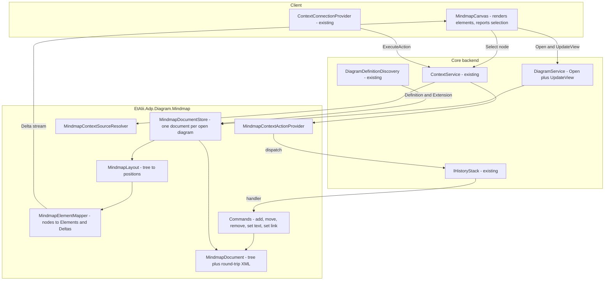
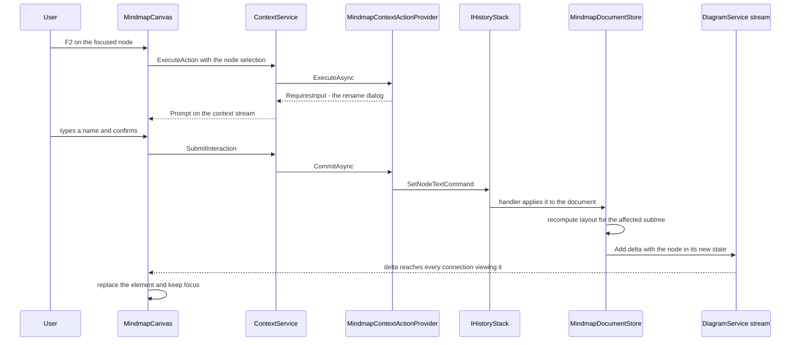

# Design Document

## Overview

This design builds the **Mindmap module** as the first real diagram type: `diagrams/mindmap/` with `backend/`, `api/` and `client/`, plugged into core through the four seams the requirements name and nothing else. A mindmap is exactly two files: an `.adp` registration file and a `.mm` Freeplane body. The backend owns the tree, the layout and every edit; the client renders what it is sent and reports what the user did.

Four things carry the whole design:

1. **`MindmapDocument`** — the parsed `.mm` tree, its round-trip fidelity, and the only place XML is touched.
2. **`MindmapLayout`** — a pure function from tree to positions, computed on the backend so the viewport query has something to answer against.
3. **Commands** — one per edit, each naming its inverse, registered by the module's own `AddMindmapCommands`.
4. **`MindmapContextSourceResolver` + `MindmapContextActionProvider`** — a node becomes selectable and actionable by registration alone.

**This design has prerequisites it cannot satisfy itself.** They are listed in *Prerequisites and blockers* below and are the first thing to read: one of them is a core contract defect that makes Requirement 11 unimplementable as the contract stands today.

## Prerequisites and blockers

### 1. `DiagramService.Connect` cannot be called from a browser (blocking)

`src/api/diagrams.proto` declares:

```proto
service DiagramService {
  rpc Connect(stream ClientMessage) returns (stream Delta);
}
```

That is **bidirectional streaming**. The client uses `createGrpcWebTransport` against `UseGrpcWeb`, and gRPC-Web supports only unary and server-streaming — a browser cannot stream a request body. `rename-files-and-folders`'s design already recorded this constraint and noted the declared `Connect` was "implemented nowhere on either side, so nothing has hit this yet". **This spec is what hits it**: Requirement 11.1 opens a mindmap over `Connect`, and Requirement 11.5 sends `ViewUpdate` up the client→server leg that does not exist.

The fix is the pairing this codebase has already proven twice — `ListEntries` + `WatchHierarchy`, and `Select` + `Watch`: one unary call and one server stream, correlated by a connection id.

```proto
service DiagramService {
  rpc Open(OpenDiagramRequest) returns (stream Delta);   // server-streaming
  rpc UpdateView(UpdateViewRequest) returns (UpdateViewResponse);  // unary
}
```

`OpenDiagramRequest` carries `project_id`, the `watch_id` the connection already has, and the `.adp` file's `Path`. `UpdateViewRequest` carries the same `watch_id` plus the existing `ViewUpdate`. Nothing else about Requirement 11 changes: the deltas, the elements and the viewport semantics are untouched.

This belongs to **`grpc-core-communication`**, not here — it is the contract's defect and every diagram type hits it. It is recorded here because the mindmap module cannot be built until it is resolved, and because a module-local workaround would be exactly the "quietly extending the contract" Requirement 11 exists to prevent.

### 2. `add` must be defined as an upsert (blocking, already declared)

Requirement 11.3 and the requirements' Introduction declare it: `grpc-core-communication-specification` Requirement 3.2 must say `add` replaces an element with the same id. `deltas.proto` needs no change — `Add` already carries `repeated Element` — only the specification's wording and the runtime's behaviour.

### 3. `Group.group_element` must be allowed to be an existing element (blocking, already declared)

Requirement 11.4. `deltas.proto`'s `Group` carries `Element group_element`; folding sends the parent node, which the client already holds. Only the specification's "new grouping element" wording is at issue.

### 4. `grpc-core-communication`'s runtime does not exist

`Program.cs` still reads `// DiagramService (grpc-core-communication) is mapped here once that spec implements it.` The mindmap module supplies a diagram type, not the streaming host. Tasks that depend on the stream are sequenced after it in `tasks.md`.

## Steering Document Alignment

### Technical Standards (tech.md)

* **Context**: a node becomes selectable through one `IContextSourceResolver` and actionable through one `IContextActionProvider`. The context service is not modified.
* **Commands**: every edit is an `ICommand` with a handler naming its inverse, dispatched through `IHistoryStack`. Handlers sit in `Commands/`, registered by the module's own extension method — never core's `AddCommands`, which would invert the dependency (Requirement 6.5).
* **Logging**: `private static readonly ILogger _logger = Log.ForContext<TheClass>();` in every class that logs.
* **One entity per file; `_Model` for POCOs**: the tree records live in `_Model/`; a command and its handler share a file, as the convention allows.
* **ShortGuid for identity**: node ids assigned by ADP are `ShortGuid` (Requirement 3.4).
* **Backend owns the filesystem**: the module reads and writes through the same containment-checked layer; no second access path.
* **Centralised styling**: mindmap canvas styling goes into the client's existing stylesheet with existing tokens.

### Project Structure (structure.md)

* `src/diagrams/mindmap/backend/EtAlii.Adp.Diagram.Mindmap/` — the module; `…​.Mindmap.Tests/` beside it.
* `src/diagrams/mindmap/api/mindmap.proto` — the node payload only. Core protos are not edited by this module.
* `src/diagrams/mindmap/client/` — the renderer.
* Core changes are confined to `EtAlii.Adp.Diagram` (the definition), `src/api/context.proto` (`element_id`, scope) and `src/api/diagrams.proto` (prerequisite 1).

## Code Reuse Analysis

### Existing components to leverage

* **`DiagramDefinitionDiscovery`** — already finds `Diagram.Definition`; the module needs no registration for discovery, only the new `Extension` member.
* **`AdpFileWriter`** — the temp-file-then-move discipline and its scratch-name guard in `HierarchyModel` are reused verbatim for the `.mm` body; the two-file atomicity of Requirement 1.6 extends it rather than replacing it.
* **`DiagramFileName`** — `Suggest`, `StripExtension`, `WithExtension` already produce collision-free names; the sibling name is derived from the same base.
* **`EntryNameRules`** — unchanged; naming a mindmap is naming a file.
* **`CreateDiagramFileCommand` / its handler** — extended to write the body sibling, not duplicated.
* **`IHistoryStack` / `CommandDispatcher` / `CommandResult`** — the whole undo story; the module adds handlers and nothing else.
* **`HierarchyModel.TryResolvePath`** — the containment check a link resolution needs (Requirement 12.11); the module does not re-derive containment.
* **`ContextSelectionResolver` / `IContextSourceResolver`** — the nesting machinery for the file→node chain; the module supplies one resolver.
* **`ContextActionResolver`** — routes by scope; the module supplies providers for the new scope.
* **`RibbonContextualGroups` / `ContextMenu` / `ContextPromptHost`** — the mindmap's actions, menu and prompts render through these unchanged.
* **`LogCapture`, `TestHistory`** — the test-side pipeline helpers already used by the hierarchy providers.

### Integration points

* **`DiagramDefinition`** gains `Extension` (default `""`).
* **`CreateDiagramFileCommandHandler`** gains the body write, driven by `Extension` and an `IDiagramDocumentFactory`.
* **`Program.cs`** calls `AddMindmapCommands()` and registers the module's resolver, providers and factory — one line each.
* **`context.proto`** gains `ContextSource.element_id` and a `ContextScope` value.
* **`docs/diagrams.md`** row moves 📝 → 🛠️ → ✅ (Requirement 13.6).

## Architecture



### Flow: the user renames a node



### Modular design principles

* The `.mm` parser, the layout and the element mapper each stand alone and are unit-testable without gRPC, the filesystem or a browser (Requirement NFR *Dependency Management*).
* Core is compilable and testable with zero diagram modules present; nothing in core names the mindmap.
* The module's only inbound coupling is what discovery and DI hand it.

## Components and Interfaces

### `DiagramDefinition` (`EtAlii.Adp.Diagram/_Model/`, core, edited)

```csharp
public sealed record DiagramDefinition(DiagramOrigin Origin, string Title, string Extension = "")
```

`Extension` is the document sibling's extension including the dot, `""` meaning the `.adp` file is the whole diagram (Requirement 2.2). It is a positional record parameter with a default, so every existing definition — all 57 of them — compiles unchanged.

### `IDiagramDocumentFactory` (`EtAlii.Adp.Diagram/`, core, new)

```csharp
public interface IDiagramDocumentFactory
{
    DiagramOrigin Origin { get; }
    string CreateEmptyDocument(string baseName);
}
```

The one thing core cannot derive: what an empty document of a given type looks like. Registered like `IContextActionProvider`, resolved by `Origin`. This is what keeps Requirement 1.4's "one root node named after the file" inside the module while `CreateDiagramFileCommandHandler` stays type-agnostic. A definition with an `Extension` and no factory is a deployment error, reported at startup rather than at the first Add.

### `CreateDiagramFileCommandHandler` (core, edited)

Gains: resolve the definition by MIME type, and if it declares an `Extension`, write the body sibling from the factory in the same operation. Both files are written to temp names in the destination folder and moved into place; if the second move fails, the first is rolled back, satisfying Requirement 1.6 (*neither observable*). The inverse becomes a `DeleteDiagramFilesCommand` naming both paths, so an undo removes the pair.

### `MindmapDocument` (`_Model/`, module, new)

The parsed tree plus the `XDocument` it came from. `System.Xml.Linq` is chosen because it preserves elements and attributes it was never taught — Requirement 3.2's round-trip rule — as a property of the model rather than as code that must remember every Freeplane feature. Edits mutate both the node records and the backing XML nodes, so serialization is "write the document back", not "regenerate it from our model", which is what makes Requirement 3.3's no-diff rule achievable.

* `MindmapNode` (`_Model/`): `Id`, `Text`, `Notes`, `Folded`, `Children`, `ParentId`.
* Ids: read from the `.mm` `ID` attribute; assigned as `ShortGuid` on load when absent, held in memory, flushed on the next save (Requirement 3.4).

### `MindmapDocumentStore` (module, new)

One `MindmapDocument` per open diagram, keyed by the `.adp` path, with the connections currently viewing it. Owns the load/save lifecycle, the layout cache, and the per-connection fold state (Requirement 9.4 — view state, never written). Modelled on `HierarchyModelStore`, including its idle eviction, so a diagram opened and abandoned does not leak.

### `MindmapLayout` (module, new)

`IReadOnlyDictionary<string, Point2D> Compute(MindmapNode root, MindmapMetrics metrics)`. Pure, deterministic, no I/O (Requirement 5.2, 5.5). The conventional arrangement: root centred, branches alternating left and right, children stacked on the cross axis, depth as distance. `MindmapMetrics` carries the declared font metric of Requirement 5.6 — font family, size, and an average or per-character advance — shipped with the module, because font metrics do not exist on the backend.

### Commands (`Commands/`, module, new)

| Command | Inverse |
|---|---|
| `AddChildNodeCommand` | `RemoveNodeCommand` for the new node |
| `AddSiblingNodeCommand` | `RemoveNodeCommand` for the new node |
| `MoveNodeCommand` | `MoveNodeCommand` back to the previous parent **and** index (Requirement 7.3) |
| `RemoveNodeCommand` | `RestoreSubtreeCommand` carrying the whole subtree, its parent and its index (Requirement 7.4) |
| `SetNodeTextCommand` | the same command with the previous text |
| `SetNodeNotesCommand` | the same command with the previous notes |
| `SetNodeLinkCommand` | the same command with the previous link, including none (Requirement 12.4) |

`RemoveNodeCommand`'s inverse is the one that carries state rather than coordinates: restoring a subtree needs every node's id, text, notes and link, so the handler captures the detached subtree into the inverse. Every handler re-reads the document and validates its own preconditions (Requirement 6.4), because a redo arrives long after the click.

### `MindmapContextSourceResolver` (module, new)

Resolves `ContextSource.element_id` against the document named by the parent level, verifying the node actually belongs to that diagram on that connection (Requirement 10.4). Supplies the per-level detail of Requirement 10.6 — text, has-children, folded, linked — and tracks the node so a removal updates or clears the selection (Requirement 10.7).

### `MindmapContextActionProvider` (module, new)

Offers, for the diagram-element scope: add child, add sibling, rename, delete, fold/unfold, edit notes, link, unlink. Each declares its shortcut as data (Requirement 8.4). Unavailable actions are reported with a reason rather than omitted, so the ribbon greys them (Requirement 8.6, and `context-service` Requirement 10.7). Read-only mode makes every document-changing action unavailable.

### `MindmapElementMapper` (module, new)

Nodes → `Element`s: `id` the node id, `position` from the layout, `type` `freeplane/mindmap+node`, `payload` a `MindmapNodePayload` from the module's own proto packed into `Any`. Computes the deltas for a change: `Add` for upserts, `Remove` for deletions, `Group`/`Ungroup` for folds (Requirement 11.4), filtered by the connection's viewport (Requirement 11.5) and fold state.

### `MindmapCanvas` (client, new)

Renders elements onto the shared canvas, reports selection through the existing provider, and holds no document state — it applies deltas and shows what it was sent. Node boxes are drawn at the size the backend computed; overflow clips or wraps rather than moving the node (Requirement 5.7). Keyboard handling is modal: while an inline editor is open, text keys belong to it and structural shortcuts do not fire (Requirement 8.2).

## Data Models

### `mindmap.proto` (`src/diagrams/mindmap/api/`, new)

```proto
message MindmapNodePayload {
  string text = 1;
  string notes = 2;
  bool has_children = 3;
  bool folded = 4;
  MindmapLink link = 5;      // absent when the node is not linked
}

message MindmapLink {
  Path path = 1;             // project-relative, for display
  ShortGuid entry_id = 2;    // this connection's id for the target
  bool broken = 3;           // the target no longer resolves
}
```

Three forms, deliberately not collapsed into one (Requirement 12.3): the `.mm` file holds a **map-relative** path in the node's own `LINK` attribute, because that is what Freeplane defines `LINK` to be; the wire carries a **project-relative** path, because the client is never given a location outside the project; and it carries the **entry id** too, because that is what a `Select` needs, and an id is stable only within the connection that observed it so it can never be the stored form.

### The two files on disk

| File | Written by | Holds |
|---|---|---|
| `<name>.adp` | creation only, in this spec | one line: `freeplane/mindmap` |
| `<name>.mm` | every document edit | the Freeplane tree, links included |

A link is a node's own `LINK` attribute, which is what Freeplane uses for exactly this (Requirement 12.1) — so it needs no storage of ADP's own, cannot be orphaned, and travels with its node through a delete and an undo for free.

An earlier revision of this design added a third `<name>.adp.json` file for links. It was wrong on its premise: it read Requirement 3.5's *IF ADP-specific data has no place in the standard schema* as settled, when `.mm` has a native home for a file link. It also cost the thing this module exists to prove — a link ADP wrote would have been invisible in Freeplane, and one Freeplane wrote invisible to ADP.

When richer link kinds arrive they go in the `.adp` file after its MIME line (Requirement 12.4), which `create-diagram-file` Requirement 3.4 already shaped for by forbidding anything *before* that line. Requirement 2.4 keeps the `.adp` file unwritten **in this spec**; it does not reserve it forever.

## Error Handling

| Scenario | Handling |
|---|---|
| `.mm` unparseable | The diagram fails to open with a message naming the file; the workspace and every other diagram are unaffected (Requirement 3.7). |
| `.mm` sibling missing | Opens as an empty map with a root named after the file; the body is written on first save (Requirement 2.5). |
| MIME type matches no definition | Reported naming the MIME type read; no empty canvas (Requirement 2.6). |
| Two definitions claim one extension | Extension routing disabled for that extension, ambiguity reported naming both; `.adp`-routed files still open (Requirement 2.8). |
| Command rejected | `CommandResult.Failure` with a user-facing message; nothing recorded on the history (Requirement 6.3). |
| Link target deleted or outside the project | The link is shown broken, keeping what it pointed at; never silently dropped or re-pointed (Requirement 12.11-12.12). |
| The `.mm` file is moved | Every `LINK` in it is rewritten so it still resolves, in the same command that moves the file - a map-relative path means something else from a new location (Requirement 12.14). |
| Save fails midway | Atomic temp-then-move means the previous file survives intact (Requirement 3.6). |

## Testing Strategy

### Unit testing

* **`.mm` round trip** — the requirement most worth proving: parse and re-serialize a corpus of real Freeplane maps and assert byte equality (Requirement 3.3). Then the same with an unknown attribute and an unknown element present, to prove Requirement 3.2.
* **Layout** — determinism (same tree, same positions, twice), no sibling overlap, and stability of unaffected subtrees after an edit. Positions only; no canvas.
* **Commands** — one test per inverse: apply, undo, assert the document equals its prior state including ids and order; then redo. `RemoveNodeCommand`'s subtree restore is the one to test deepest.
* **Resolver** — a node of another diagram, and a node id from another connection, both rejected without leaking that they exist.
* **Provider** — availability in read-only mode, and for the root's sibling and an unlinked node's unlink.

### Integration testing

* Add a mindmap through the real Add flow and assert both files exist with the expected content; assert an undo removes both.
* Open, edit, and assert the delta reaching a second connection.
* Delete the `.adp` and assert the `.mm` goes with it (Requirement 2.11).
* Rename the `.adp` and assert the pair stays a pair, and that undo restores both names (Requirement 2.10).

### End-to-end

Deferred until the `DiagramService` runtime exists (prerequisite 4). `tests.md` gets the manual checks that a unit or integration test cannot express — keyboard modality in particular (Requirement 8.2), which depends on real focus behaviour.

## Deviations and notes

* **The bidi blocker is not worked around here.** It is reported as a core contract defect for `grpc-core-communication` to fix. A module-local transport would be the exact drift Requirement 13.5 says to treat as a sign the abstraction is wrong.
* **`IDiagramDocumentFactory` is a fifth core seam**, beyond the four the requirements name. It is type-agnostic and the next diagram type uses it identically, but it is an addition to what Requirement 13.4 enumerates and should be confirmed when this design is reviewed. The alternative — putting the empty-document template on `DiagramDefinition` as a string — was rejected because a template is behaviour for some types, not data.
* **Fold state is per connection**, so two people viewing one map fold independently. That is Requirement 9.4's stated cost, restated here because it is the design decision most likely to be questioned later.
* **Layout runs on the backend**, which makes text sizing an estimate. Requirement 5.7 accepts an imperfect box over a moved node; if that proves wrong in practice, the fix is a better metric, not moving the layout to the client — the viewport query depends on the backend knowing where things are.
