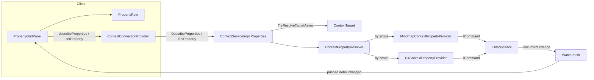

# Design Document

## Overview

The property grid is a fourth application of the pattern the context menu, the toolbox and the problems panel already proved: **the backend describes, the client renders, and per-type knowledge lives behind a per-scope provider seam**. A module implements one interface (`IContextPropertyProvider`), a resolver routes to it by the target's scope, two unary RPCs carry the descriptions and the writes, and the panel draws rows it does not understand — committing a value on Enter or blur as a command on the project's history.

> **Status.** Like the requirements, this design documents an implementation that already exists (merged at `2b70a8e`) rather than proposing one. Its job is threefold: record the decisions and their reasons so they survive the code that embodies them; check the implementation against the approved requirements and mark the mismatches (there are two — see *Gaps*, below); and hand the tasks phase a precise, small backlog instead of a rebuild. Every file path in this document names code on `develop` today unless marked **(gap)**.

### Gaps this design closes in the tasks phase

1. **Provider isolation (Requirement NFR "Isolation", flagged at requirements time).** `ContextPropertyResolver.DescribeAsync` iterates providers with no `try`: one throwing provider today turns the whole `DescribeProperties` call into an RPC error, and the panel shows nothing at all. The design decision (below) is to isolate per provider — answer with what the healthy providers described, log the rest — mirroring `WithActionsAsync`'s "a provider failing leaves the selection itself valid" rule.
2. **Unknown-editor fallback (Requirement 8.2).** `PropertyRow` switches on the three known editors and treats anything else as `Line` — an *editable* line. The requirement says unknown means **read-only text**: a client older than the contract must degrade to showing, not to editing through an editor it misunderstands.

Everything else in the requirements is implemented and tested; the corresponding sections below cite the pinning tests.

## Steering Document Alignment

### Technical Standards (tech.md)

* **Commands**: `SetAsync` in both shipped providers builds the same `ICommand` the canvas uses (`SetNodeTextCommand`, `SetElementDescriptionCommand`, …) and dispatches through `IHistoryStack` — the design adds no second write path, and the grid's rename and the dialog's rename are one implementation.
* **Frontend-backend synchronization**: the grid holds no model. It re-describes on every pushed detail change and never updates optimistically; the backend's push is the only way a value gets into a row that is not being typed in.
* **Serilog** static logger per class; **registration** through the area's `AddContext` extension and each module's own `Add<Module>` extension.

### Project Structure (structure.md)

* Core owns the seam, the resolver, the RPCs and the panel — all type-agnostic. Each module owns its provider beside its other providers. Dependency direction: modules → core, never back.

## Code Reuse Analysis

### Existing Components to Leverage

* **`TryResolveTargetAsync`** (`ContextServiceImpl.Actions.cs`): both property RPCs resolve their target through the same switch the action RPCs use — explicit source, or the connection's current selection; nothing new learned about resolution.
* **`ContextTarget`**: providers receive the already-resolved, containment-checked target; no provider touches path resolution.
* **`IHistoryStackStore`**: `SetAsync` reaches the project's history exactly as action providers do.
* **The `Watch` push**: change notification is the existing selection/detail push; properties add no stream.

### Integration Points

* **`ContextServiceImpl`** gains a partial (`.Properties.cs`) — the service class, not a new service.
* **`ContextConnectionProvider`** exposes `describeProperties(source?)` / `setProperty(id, value, source?)` beside `executeAction`.
* **`PropertyGridPanel`** replaces its former read-only-subscriber body; **`PropertyRow`** is new.

## Architecture



### The edit round trip (why the grid never lies)

1. `PropertyRow` commits (Enter/blur) → `setProperty` → `SetProperty` RPC.
2. The provider validates, builds the same command any surface uses, dispatches it on the history. Refusals come back as `{accepted:false, error}`; the row restores the pushed value and shows the sentence.
3. The command changes the document → the document push updates the selection's detail → the panel's effect sees `pushedDetail` change and **re-describes** → the row shows what the backend now says. `SetPropertyResponse` deliberately echoes no value: there is exactly one channel by which values reach the grid.

### Modular Design Principles

* One file per concern: seam, resolver, records, RPC partial, panel, row, provider-per-module.
* The resolver knows no property id; providers know no RPC; the panel knows no property.

## Components and Interfaces

### `IContextPropertyProvider` (`Backend/Context/IContextPropertyProvider.cs`, exists)

Per-**scope** provider — `Scope`, `DescribeAsync(target, ct)`, `SetAsync(target, propertyId, value, ct)` — mirroring `IContextActionProvider` rather than a per-origin registry, because the target arrives resolved and the provider decides for itself whether the element is one of its own (both shipped providers return `[]` for a target they cannot resolve, Requirement 3.4). Kept separate from actions deliberately: a verb offered versus a value already there; the pipeline type will have many properties and almost no verbs.

### `ContextPropertyResolver` (`Backend/Context/ContextPropertyResolver.cs`, exists; isolation is **(gap 1)**)

* `DescribeAsync`: concatenates every registered provider for the target's scope, registration order — display order, determinism NFR.
* `SetAsync`: **asked before told** — finds the owning provider by describing first, so a write never reaches a provider that would have to guess an id; refuses a read-only property with its own reason **server-side** (Requirement 4.3, pinned by `ContextPropertyResolver.Tests`), and an unknown id by name (4.4).
* **(gap 1)** `DescribeAsync` wraps each provider call in a `try`; a throwing provider contributes nothing, is logged at `Warning` with the provider type, and the others still answer. `SetAsync` keeps propagating for the *owning* provider's own throw — a failed write must not be reported as success — but a throw while *describing* during owner-search skips that provider like `DescribeAsync` does.

### `ContextServiceImpl.Properties` (`Backend/Context/ContextServiceImpl.Properties.cs`, exists)

Both RPCs resolve the target through `TryResolveTargetAsync` (source rule identical to actions; unresolved → empty description / refused write with the same "no longer there" wording, so a caller learns nothing it may not see — Requirement 3.5). `SetProperty` returns `{accepted:true}` with no value echo (see round trip). `ToProto` is a field-for-field copy of `ContextPropertyDefinition`.

### `ContextConnectionProvider` (client, exists)

`describeProperties(source?)` and `setProperty(propertyId, value, source?)` beside `executeAction`, same `ActionOutcome` shape for the write. No slot, no cache: properties are request/response, and the *trigger* to re-request is the pushed detail — which the panel owns (below).

### `PropertyGridPanel` (`client/src/shell/panels/PropertyGridPanel.tsx`, exists)

* Renders the chain outermost-first (`levelsOf`), one section per level; **only the innermost** gets property rows (Requirement 1.3 — two editable "Name" rows is how the wrong one gets changed). Hierarchy levels keep their path/kind rows from the pushed `ContextLevelDetail`.
* Re-describes when the **selection** or the **pushed detail** changes (`pushedDetail` string over the levels) — the second half is what makes an edit, an undo, or another connection's change appear without optimism (Requirements 5.2, 6.5).
* `groupsOf`: ungrouped first, then groups in first-appearance order (Requirement 7); providers' order is display order.
* `commit(propertyId, value)` maps a refusal to a sentence for the row; an empty error from the backend still reads as "That value was not accepted."

### `PropertyRow` (`client/src/shell/panels/PropertyRow.tsx`, exists; fallback is **(gap 2)**)

The commit-cadence rule lives here and only here: **write on Enter or blur, never per keystroke; Escape abandons; an unchanged value writes nothing** (Requirement 6.1–6.3, each pinned by `PropertyGridPanel.test.tsx`). Two per-editor refinements of "Enter", both keeping one path to the backend: a `Text` area commits on **Ctrl+Enter** (plain Enter makes a newline in a multi-line value) or blur, and Enter in a `Line` blurs rather than committing directly, so Enter and clicking away are literally the same code path. A `Toggle` has no "finished typing": the click is the commit. While focused the field holds the draft; not focused, the pushed value wins (6.4) — which is what makes a rejected value visibly snap back. Editors: `Line` → input, `Text` → textarea, `Toggle` → checkbox mapping `"true"`/`"false"`. **(gap 2)** the editor ternary currently falls through to the editable `Line` input for an editor value it does not know; it must instead render the value as read-only text (Requirement 8.2).

### Shipped providers (the seam's proof, and its exemplars)

* **`MindmapContextPropertyProvider`** (`diagrams/mindmap/backend/...`): Text/Notes/Link editable through the module's existing commands (the grid's Text row *is* "Rename…" — one command, one undo entry); **Collapsed** shown read-only with the reason that folding is per-connection view state and lands on no history (Requirement 4.5's canonical case); Identifier read-only. Registered in `AddMindmap`.
* **`C4ContextPropertyProvider`** (`diagrams/c4/backend/...`): Name/Description/Technology editable via C4 commands; Technology only contributed where C4 gives the kind one (Requirement 2.3's absent-vs-empty rule in the flesh — a person has no technology row at all); Tags shown read-only *for now* with a reason naming the interim ("edited in the document until an action exists"); Kind/Identifier/relationship endpoints read-only as structure. Relationship targets get their own property set.
* **Next**: `azure-pipeline-diagram` Requirement 13 (mostly read-only, owes `Choice`) and `ansible-structure-diagram` Requirement 10 (100 % read-only, `SetAsync` refuses unconditionally) — both bind to this contract as approved.

## Data Models

### `context.proto` (exists)

```proto
enum ContextPropertyEditor { LINE = 0; TEXT = 1; TOGGLE = 2; }   // widened by consumers, never speculatively

message ContextProperty {
  string id = 1;                // module-prefixed, stable within its provider
  string label = 2;
  string value = 3;             // always text; Toggle carries "true"/"false"
  ContextPropertyEditor editor = 4;
  string read_only_reason = 5;  // empty = editable; else the sentence shown beside the value
  string group = 6;             // empty = ungrouped, shown first
}

rpc DescribeProperties(DescribePropertiesRequest) returns (DescribePropertiesResponse); // source unset = current selection
rpc SetProperty(SetPropertyRequest) returns (SetPropertyResponse);                      // {accepted, error} — no value echo
```

`ContextPropertyEditor` is used directly on the backend record (one name for wire and domain, nothing to drift — the `ContextScope` precedent). `ContextPropertyDefinition` adds only `IsEditable => ReadOnlyReason.Length == 0`.

### Not modeled, deliberately

No property change notification message: the *document* change is the notification, and the panel re-describes. No per-property validation RPC: validation is the provider's `SetAsync` refusing. No `Choice`/list shapes: owed by `azure-pipeline-diagram` (requirements 8.3).

## Error Handling

### Error Scenarios

1. **Provider throws in `DescribeAsync`** — **(gap 1)**: skipped, logged, others answer. Today: RPC error, empty panel.
2. **Write to a read-only property**: refused server-side with the property's own reason, whatever the client (pinned test).
3. **Write to an unknown id**: refused naming the id (pinned test).
4. **Provider rejects a value**: `ContextPropertyResult.Failure(sentence)` → row restores pushed value, shows the sentence (pinned tests both sides).
5. **Target vanished**: describe answers `[]`; write refused "What was selected is no longer there."
6. **Unknown editor value** — **(gap 2)**: rendered read-only text.

## Testing Strategy

* **Unit (backend)**: `ContextPropertyResolver.Tests` with `StubPropertyProvider` — scope routing, order, read-only enforcement, unknown id; **(gap 1)** adds the throwing-provider isolation cases. Each module's provider tests run against its own document store and assert the absent-vs-empty rule and every reason string.
* **Unit (client)**: `PropertyGridPanel.test.tsx` — chain/innermost rendering, groups, commit cadence (Enter/blur/Escape/unchanged), snap-back with reason, pushed-value-wins, re-describe on pushed detail; **(gap 2)** adds the unknown-editor fallback case.
* **Integration**: the C4 and mindmap provider tests already run the real command path (edit → history → document); no new gRPC flow is owed — the RPC layer is a thin resolve-and-forward over seams the flow tests already cover.
* **Mutation checks** (the house verification): disable the resolver's read-only refusal → a test fails; make the row commit per keystroke → a test fails.

## Deviations and notes

1. **Per-scope, not per-origin.** `DiagramValidators` resolves by origin because a validator judges a *document type*; a property provider answers for a *selected thing*, whose target arrives resolved — the action seam's shape, not the validator's. Recorded because Agent 3's early draft assumed per-origin.
2. **Innermost-only editing** is a panel decision, not a seam limit: `DescribeProperties` with an explicit source can describe any target, which is what a future inspector or the ansible edge-selection case uses.
3. **`ElementDetail` untouched.** Requirement 9.3's stance holds: nothing in this design widens it, and the panel's level headers are its only consumer here.
