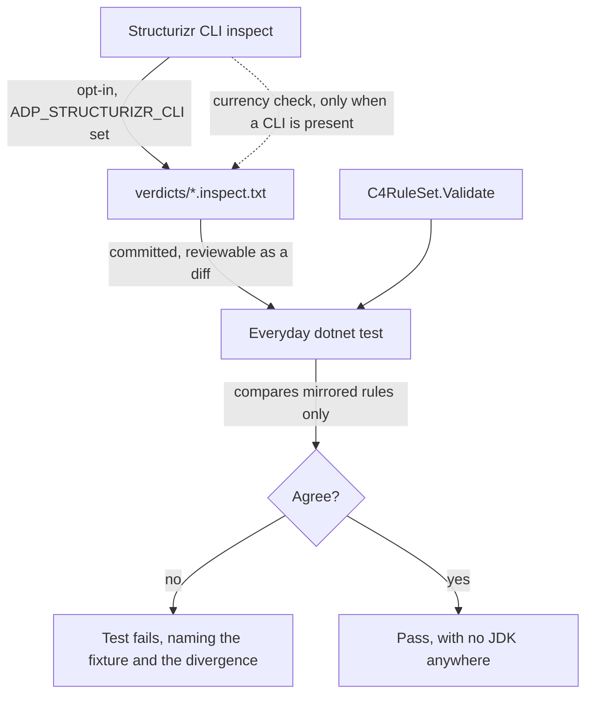

# Design Document

## Overview

Six guards, one shape: each is made to protect what it claims to, or honestly retired. The
design below is mostly a set of **decisions**, because that is what this spec is short of — the
requirements establish that five checks do not guard, and almost every remaining question is
"which way", not "how".

Two decisions carry the rest:

1. **Structurizr's `inspect` is the authority on C4 model quality**, and its verdicts are
   committed as reviewable files so the everyday test run consumes them without a JDK.
2. **Each style diagnostic is settled individually** — fixed or downgraded-with-a-note — rather
   than the gate being lowered wholesale or the codebase churned wholesale.

### The debt grew while the spec sat

The requirements measured the style gate at 109 `IMPORTS` and 84 `IDE0130`. Re-measured for this
design, a day later: **115 `IMPORTS` and 131 `IDE0130`**, and the worktree count went from twelve
to sixteen. Nothing regressed — new, correct work simply landed, and a gate nobody can run does
not stop the pile growing. That is the argument for Requirement 5 restated as evidence rather
than as opinion, and it is why the design prefers decisions that hold without anyone remembering
to run anything.

## Steering Document Alignment

### Technical Standards (tech.md)

* **"Tests should be runnable as part of the same local F5 experience — no separate environment
  or manual setup required."** This is the hard constraint on Requirements 3 and 4 and it drives
  the central design choice: verdicts are **committed data**, not a live tool invocation. A
  developer with no JDK runs `dotnet test` and the interoperability guarantee is checked.
* **"Prefer fast, local unit/integration tests over end-to-end tests that depend on hosted
  infrastructure."** Requirement 4 replaces a manual Structurizr Lite check with a local
  `export`, and then with a committed baseline of that export.
* **Commands rule.** Nothing in this spec writes to a diagram, so no command is involved. The
  one place that could have — a "fix all my usings" action — is deliberately not built; it is a
  one-off `dotnet format` run by a person, not a feature.
* **Logging.** Any new class that logs takes `private static readonly ILogger _logger =
  Log.ForContext<T>();`, per the existing convention.

### Project Structure (structure.md)

* Rule work stays inside `src/diagrams/c4/backend/EtAlii.Adp.Diagram.C4/`. Nothing outside the
  C4 module learns that Structurizr exists.
* Baselines live with the fixtures they describe, under
  `EtAlii.Adp.Diagram.C4.Tests/Fixtures/verdicts/`, so a fixture and its verdict are read and
  reviewed together.
* Requirement 5.6 adds the `_Model/`-and-`Commands/`-in-parent-namespace convention to
  structure.md, where it belongs — it is currently only implicit in 131 files.

## Code Reuse Analysis

### Existing Components to Leverage

* **`C4RuleSet`**: a pure function from workspace to `DiagramProblem`s. Every new rule is added
  inside that shape; none acquires I/O, and in particular none shells out to the CLI.
* **`C4Rules`**: the rule-id constants, extended with the new ids.
* **`C4InteropTests`**: already runs the CLI and already skips without one. It gains the
  baseline-currency checks rather than a new home being invented for them.
* **`Fixtures/` corpus and `C4DocumentTests.Corpus()`**: the fixture list is already enumerated
  in one place; the verdict baselines key off the same list, so a fixture cannot be added
  without its verdict being noticed.
* **`ExamplesTests`**: already validates both example projects end to end; the reconciliation
  test can reuse its model-loading helpers.

### Integration Points

* **`IDiagramValidator` / `DiagramProblem`**: the new rules surface through the existing
  problems pipeline and appear in the errors-and-warnings panel with no panel change. Location
  stays `DiagramProblemElementLocation` so click-to-select keeps working.
* **`src/.editorconfig`**: the single settings file for the whole tree; Requirement 5 edits it
  and nothing else configures style.
* **CLAUDE.md**: Requirements 5.7 and 6.5 add the pre-merge step and the worktree retirement
  rule. These are the two places where the "guard" is a documented human action rather than
  code, and the design says so plainly rather than dressing them up.

## Architecture

### The reconciliation, and why the baseline is data

ADP must not depend on a JDK, and must not silently disagree with Structurizr. Those pull in
opposite directions, and the resolution is to move the authority **once**, into a file:



The everyday run reads a file. The CLI-gated run proves the file still matches what Structurizr
says today. A stale baseline is therefore detectable rather than merely possible, which is the
whole difference between a baseline and a fiction.

### Modular Design Principles

* **Single file responsibility.** New rules go into `C4RuleSet` beside their siblings; the
  baseline reader is its own small type (`C4Verdict`) that does one thing — parse the CLI's
  `LEVEL | rule | message` lines into a comparable set.
* **Component isolation.** `C4Verdict` knows nothing about ADP's rules; the reconciliation test
  knows about both and is the only thing that does.
* **Service layer separation.** No service is involved. This is fixtures, a pure rule set, and
  tests.

## Components and Interfaces

### `C4Rules` (extend)

* **Purpose:** carry the new rule ids alongside the existing ten.
* **Interfaces:** constants only. New: `c4.missing-deployment-description`,
  `c4.missing-deployment-technology`, `c4.missing-infrastructure-description`,
  `c4.missing-infrastructure-technology`, `c4.disconnected-element`, `c4.element-not-on-any-view`.
* **Reuses:** the existing `c4.` prefix convention.

### `C4RuleSet` (extend)

* **Purpose:** the C4 conformance rules as a pure function.
* **Changes:**
  * `c4.missing-description` covers deployment and infrastructure nodes again (Requirement 1.2).
  * `c4.missing-protocol` widens to every relationship (Requirement 1.3).
  * Four new element rules, plus disconnected (1.5) and not-on-any-view (1.6).
* **Dependencies:** `C4Workspace` only.
* **Reuses:** `DiagramProblem`, `DiagramProblemElementLocation`.

### `C4StructurizrMirror` (new, small)

* **Purpose:** the one place that states which ADP rule mirrors which Structurizr rule.
  Requirement 1.7 asks that the correspondence be traceable; a table is how, and it is also what
  Requirement 1.10's test consumes.
* **Interfaces:** `IReadOnlyDictionary<string, string>` from ADP rule id to Structurizr rule id,
  and the inverse. Rules with no counterpart in either direction are listed explicitly with a
  reason, so "not mirrored" is a stated decision rather than an omission.
* **Dependencies:** none.

### `C4Verdict` (new, test-only)

* **Purpose:** parse a committed `inspect` baseline into a set of `(rule, message)` pairs.
* **Interfaces:** `static C4Verdict Read(string path)`, `IReadOnlySet<string> RuleIds`.
* **Dependencies:** none. Test assembly only — nothing in the product reads these files.

### Style configuration (`src/.editorconfig`)

Not a component, but the decisions belong here because they are the substance of Requirement 5.

| Diagnostic | Count | Decision | Why |
|---|---|---|---|
| `IMPORTS` | 115 | **Resolve the contradiction, then fix the code** | The file says `dotnet_separate_import_directive_groups` is commented out and then enables it. Honour the comment: set it `false` (the blank-line-between-groups rule is the opinionated half and the codebase does not follow it), keep `dotnet_sort_system_directives_first = true`, then let `dotnet format` sort the remainder. Sorting is uncontroversial and mechanical; grouping is neither. |
| `IDE0130` | 131 | **Downgrade to `none`, with a note; document the convention** | 95 in `_Model/`, 16 in `Commands/`, 14 in `History/`, 6 in `Support/`. This is not drift, it is a convention the whole tree follows: a type's folder groups it without changing its namespace. Renaming 131 files' namespaces to satisfy a style rule would be the tail wagging the dog. structure.md gains the convention (Requirement 5.6). |
| `IDE0046` | 19 | **Downgrade to `silent`** | "`if` can be a conditional expression" is a readability preference, and in guard-clause-heavy code it is usually the wrong one. Microsoft's own template ships it as a suggestion; ADP already downgrades several such preferences with notes. |
| `IDE0017`, `IDE0032`, `IDE0053`, `IDE0059`, `IDE0066`, `IDE0270`, `IDE0330`, `IDE1006` | 1–2 each | **Fix the code** | Singletons. A one-off is not evidence of a convention, and nine edits are cheaper than nine notes. `IDE1006` is checked first against the Serilog `_logger` convention, which is already downgraded — if that is what it is, the downgrade needs widening rather than the code changing. |

## Data Models

### Verdict baseline (`Fixtures/verdicts/<fixture>.inspect.txt`)

```
# structurizr-cli <version>, recorded <date>
# Regenerate: see C4InteropTests.EveryVerdict_IsStillWhatStructurizrSays
ERROR | model.relationship.technology | The relationship between ... is missing a technology.
ERROR | model.deploymentnode.description | The deployment node ... is missing a description.
```

The CLI's own output, verbatim, with a two-line header. Verbatim because a transformed baseline
is a second implementation to keep correct, and the header because Requirement 3.3 asks which
version produced it and when.

### Mirror table

```
ADP rule id                    -> Structurizr rule id
c4.missing-description         -> model.{person,softwaresystem,container,component}.description
c4.missing-protocol            -> model.relationship.technology
c4.disconnected-element        -> model.element.disconnected
c4.element-not-on-any-view     -> model.element.noview
...
ADP-only (editing-surface rules, no Structurizr counterpart, kept):
  c4.kind-not-permitted-on-view, c4.misplaced-element, c4.include-not-followed,
  c4.unknown-view-scope, c4.dangling-relationship, c4.empty-view,
  c4.unlabelled-relationship
Structurizr-only (not implemented, with the reason):
  workspace.scope                     - ADP writes one workspace per document and has no scope to set
  model.softwaresystem.documentation  - depends on !docs, which ADP round-trips but does not read
  model.softwaresystem.decisions      - depends on !adrs, likewise
```

## Error Handling

1. **A baseline file is missing or unreadable.**
   - **Handling:** the test fails naming the file and the command that regenerates it. It does
     not skip — a missing baseline is the failure mode this whole design exists to prevent.
   - **User impact:** a red test with an actionable message; the product is unaffected, since
     nothing in it reads these files.

2. **A baseline has gone stale (CLI now says something different).**
   - **Handling:** only the CLI-gated test can detect this, and it fails with the diff. The
     everyday run keeps passing against the committed verdict, which is correct — it is checking
     ADP against the recorded answer, and the recorded answer being out of date is a different
     fault with a different owner.
   - **User impact:** visible only to someone who has a JDK, which is who can act on it.

3. **Widening a rule makes an existing fixture report problems.**
   - **Handling:** Requirement 1.4 is explicit — the rule is working; the fixture's expectation
     is updated. The design adds no escape hatch for re-narrowing a rule to keep a test quiet.
   - **User impact:** more warnings on models that were always incomplete, which is the point.

4. **A new warning fires on a diagram the moment it is created.**
   - **Handling:** this is the open question the requirements raised (`model.element.noview`,
     `model.element.disconnected`). The design's answer: **both are suppressed while the model
     has no views at all**, and `noview` additionally does not fire on an element added in the
     last edit. A tool that greets a new file with warnings teaches people to ignore warnings.
   - **User impact:** the panel stays quiet on an empty or brand-new model and speaks up once
     there is something to be inconsistent with.

## Testing Strategy

### Unit Testing

* Each new rule gets the same treatment the existing ten have in `C4RuleSet.Tests`: one model
  that trips it, one that does not.
* `C4StructurizrMirror` is asserted to be total — every id in `C4Rules` appears in the mirror
  table or in the explicit ADP-only list, so a rule cannot be added without a decision about
  its counterpart.

### Integration Testing

* **The reconciliation test (Requirement 1.10).** For every fixture, ADP's reported rule ids
  restricted to the mirrored set must equal Structurizr's reported rule ids restricted to the
  same set. Runs with no JDK, against the committed verdicts.
* **Currency (Requirement 3.4).** With a CLI present, regenerate every verdict and assert it
  matches what is committed.
* **Export (Requirement 4).** With a CLI present, export every fixture and every ADP-authored
  document, assert the export succeeds and that each view's elements appear in it; the everyday
  run compares against committed export baselines.

### End-to-End

* **Requirement 4.3** retires the manual Structurizr Lite entry from `tests.md` once export
  covers it, keeping only what is genuinely visual — styling, theme resolution, layout quality.
* **Requirement 6** is a one-off triage, not a test. Its outcome is recorded in the
  implementation log and CLAUDE.md gains the retirement rule.

## Deviations and notes

* **Requirement 5.7 has no automated answer, and the design will not pretend otherwise.** There
  is no `.github/workflows` in this repository. The gate is kept green by a documented pre-merge
  step in CLAUDE.md, next to the existing instruction to run `dotnet format`. Adding a test that
  shells out to `dotnet format` was considered and rejected: it would be slow, it would fail for
  reasons unrelated to the change under test, and it would put a build tool inside the test
  suite. If CI arrives, this is the first thing to move into it.
* **The style work lands in its own commit**, separate from anything behavioural (Requirement
  5.5), and the `IMPORTS` auto-fix separately again — a 115-file mechanical diff must not be
  where a reader looks for a logic change.
* **`workspace.scope` is not mirrored.** It is a Structurizr workspace-metadata concept; ADP
  writes one workspace per document and has nothing to set it from, so mirroring it would
  produce a warning a user cannot act on. Requirement 1.8 asks for the dependency to be named,
  and this is it.
