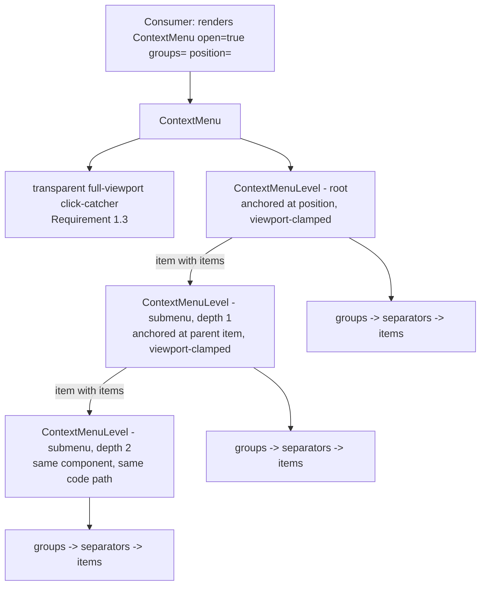

# Design Document

## Overview

This design adds `ContextMenu`, a generic floating menu primitive, to `src/client/src/shell/` alongside `SplitPane`/`TabbedPane`. It renders a list of item groups at a given screen position, supports nested submenus to at least two levels, disabled items, `@mdi/font` icons, and full keyboard navigation, and closes via outside-click/Escape/selection with focus returned to whatever triggered it. The same recursive component renders every nesting level, so a submenu is not a special case. Composability (Requirement 5) falls entirely out of the props shape: `ContextMenu` accepts `ContextMenuGroup[]`, and combining multiple call sites' contributions is just array concatenation before the prop is passed in — no registry is introduced. This spec adds no consumer; nothing today renders `<ContextMenu>`.

## Steering Document Alignment

### Technical Standards (tech.md)

* React + TypeScript, no new dependency — the client's established stack.
* "All styling... should be done in a centralized manner": every new class is added to the existing single `index.css`, using only existing `--color-*`/`--radius`/`--shadow` custom properties (Requirement 2/4's theming, NFR Code Architecture).
* No gRPC/backend dependency: `ContextMenu` is pure client-side UI with no network call of any kind (NFR Security).

### Project Structure (structure.md)

* `ContextMenu.tsx` lives in `src/client/src/shell/`, the same folder as `SplitPane.tsx`/`TabbedPane.tsx`/`RibbonBar.tsx` — a core layout/interaction primitive, not diagram-type-specific, and not inside any `diagrams/<diagram>/client/` folder.
* No `.proto` file, no `src/api/` change, no backend project touched — this spec has no wire contract of any kind.

## Code Reuse Analysis

### Existing Components to Leverage

* **`Dialog.tsx`'s focus-management pattern** (`previouslyFocusedRef` capturing `document.activeElement` on open and restoring it on close, a `document`-level `keydown` listener for `Escape`, and an overlay `div` whose `onMouseDown` only fires `onClose` when the click target is the overlay itself, not a descendant): `ContextMenu` reuses this exact shape for Requirement 1.3 (outside click / Escape) and Requirement 6.5 (focus restore), rather than inventing a second focus-lifecycle pattern in the same client. It differs only in that the overlay is transparent (a context menu must not dim the page the way a modal dialog does) and it additionally implements arrow-key roving navigation, which `Dialog` has no equivalent of (`Dialog` only Tab-traps).
* **`@mdi/font`** (already imported once in `main.tsx`): item icons (Requirement 2) and the submenu chevron indicator (Requirement 3.1) reuse this import; no new icon package.
* **`index.css`'s themed custom properties** (`--color-surface`, `--color-border`, `--color-text`, `--color-text-muted`, `--color-primary`, `--radius`, `--shadow`): every new rule reads these, the same reuse pattern `diagram-ide-mockup` and `Dialog` already established — no component-local palette.
* **`TabbedPane.tsx`'s local-static-data shape**: `ContextMenu`'s props are plain data handed in by the render call site (no context/registry), the same "generic component, consumer owns the data" split `TabbedPane`'s `tabs: TabDef[]` already established.

### Integration Points

* None. This spec's own Requirement 1.5 and Introduction explicitly exclude wiring `ContextMenu` into any surface (explorer tree, canvas, ribbon). `rename-files-and-folders` is the nearest known future consumer but adopting this component is out of scope here.

## Architecture



* **`ContextMenu`** is the public entry point and the only piece aware of "am I open, where do I close to." It owns the click-catcher, the `Escape`/focus-restore lifecycle (reused from `Dialog`'s pattern), and renders one root `ContextMenuLevel`.
* **`ContextMenuLevel`** is the recursive workhorse: given a `groups: ContextMenuGroup[]` and an anchor (a point for the root, an anchoring item's `DOMRect` for a submenu), it renders separators between groups, items within groups, handles arrow-key roving focus and `Enter`/`Space` activation, and — when an item has its own `items` — renders a nested `ContextMenuLevel` for that item's submenu. There is exactly one implementation of "render a menu level"; the root and every submenu depth are the same component instance type, satisfying the Modular Design NFR (submenu rendering and keyboard nav apply uniformly at every nesting level via the same code path).
* **`computeClampedPosition`** is a small pure function `ContextMenuLevel` calls to satisfy Requirement 1.2/3.2: given a candidate top-left corner, the menu's measured size, and the viewport size, it returns a corner that keeps the whole menu on-screen, flipping to the opposite side of the anchor when the preferred side would overflow.

### Modular Design Principles

* **Single responsibility**: `ContextMenu` owns open/close lifecycle and focus; `ContextMenuLevel` owns rendering+navigation for one level; `computeClampedPosition` owns positioning math only — each is independently unit-testable.
* **No consumer knowledge**: neither component imports or references anything about files, diagrams, or ribbon commands (NFR Code Architecture's Single Responsibility) — item `onSelect` callbacks are opaque to both.
* **Uniform nesting**: a submenu is `ContextMenuLevel` rendering another `ContextMenuLevel`, not a parallel, hand-duplicated implementation.

## Components and Interfaces

### Types (`shell/ContextMenu.tsx`, exported alongside the component per the `TabbedPane.tsx`/`TabDef` precedent)

* **Purpose:** The plain-data shape a consumer builds and hands to `ContextMenu` (Requirement 5).
* **Shape:**
  ```ts
  interface ContextMenuItemBase {
    id: string;
    label: string;
    icon?: string;          // Requirement 2: @mdi/font class, e.g. "mdi-pencil-outline"
    disabled?: boolean;     // Requirement 4
    disabledReason?: string; // Requirement 4.4, surfaced as a native title tooltip
  }

  export interface ContextMenuActionItem extends ContextMenuItemBase {
    onSelect: () => void;
    items?: undefined;
  }

  export interface ContextMenuSubmenuItem extends ContextMenuItemBase {
    items: ContextMenuGroup[]; // Requirement 3 + 5.4: a submenu is itself grouped
    onSelect?: undefined;
  }

  export type ContextMenuItem = ContextMenuActionItem | ContextMenuSubmenuItem;
  export type ContextMenuGroup = ContextMenuItem[];
  ```
* A discriminated union (`onSelect` xor `items`) rather than two optional fields on one type, so a consumer cannot accidentally supply both, and `ContextMenuLevel` can branch on `"items" in item` without an extra `kind` tag.

### `ContextMenu` (`shell/ContextMenu.tsx`)

* **Purpose:** Public entry point: open/close lifecycle, outside-click/Escape handling, focus save-and-restore (Requirement 1.1/1.3, Requirement 6.1/6.5).
* **Interfaces:**
  ```ts
  export interface ContextMenuProps {
    open: boolean;
    groups: ContextMenuGroup[];
    position: { x: number; y: number };
    onClose: () => void;
  }
  ```
  Returns `null` when `open` is `false` or when `groups` contains no items across any group (Reliability NFR — see Error Handling).
* **Dependencies:** `ContextMenuLevel`.
* **Reuses:** `Dialog.tsx`'s `previouslyFocusedRef` + `document`-level `keydown`/Escape pattern, adapted to a transparent (non-dimming) click-catcher instead of `Dialog`'s `dialog-overlay`.
* **Design note:** unlike `Dialog`, there is no Tab-focus-trap — `ContextMenu` is navigated with arrow keys (Requirement 6.2/6.3), not Tab, so `Dialog`'s `FOCUSABLE_SELECTOR` Tab-cycling logic is not reused, only its open/close focus bookkeeping.

### `ContextMenuLevel` (`shell/ContextMenu.tsx`, internal, not exported)

* **Purpose:** Render one menu level's groups/separators/items, own that level's roving keyboard focus and open-submenu state, and recurse for a nested submenu (Requirement 3, Requirement 6.2/6.3).
* **Interfaces (internal props):**
  ```ts
  interface ContextMenuLevelProps {
    groups: ContextMenuGroup[];
    anchor: { point: { x: number; y: number } } | { rect: DOMRect };
    onRequestClose: () => void;       // selection or Escape-at-root bubbles here
    onRequestCloseSubmenu?: () => void; // ArrowLeft from within a submenu (Requirement 6.3); undefined at the root
    autoFocusFirst: boolean;
  }
  ```
* **Behavior:**
  * Measures its own rendered size via a `ref` + `useLayoutEffect`, then calls `computeClampedPosition` against `anchor` and `window.innerWidth/innerHeight` to set its final `top`/`left` (Requirement 1.2/3.2) — mirroring the measure-then-position technique already implicit in `SplitPane`'s drag-clamping, applied here to initial placement instead of drag.
  * Tracks `focusedItemId` (roving tabindex: the focused item has `tabIndex={0}`, every other item `tabIndex={-1}`) and `openSubmenuItemId` in local `useState`, scoped to that one level so a sibling level's state never interferes (same isolation `TabbedPane`'s per-instance `activeTabId` already established).
  * `ArrowUp`/`ArrowDown`: moves `focusedItemId` to the previous/next non-disabled item, walking across group boundaries and skipping separators transparently (Requirement 6.2) — computed by flattening `groups` to a single ordered array of enabled item ids once per render.
  * `ArrowRight` / hover / click on an item with `items`: sets `openSubmenuItemId` and renders a child `ContextMenuLevel` anchored to that item's measured `DOMRect`, passing this level's own close handler as the child's `onRequestCloseSubmenu` (Requirement 3.2/6.3).
  * `ArrowLeft` inside a submenu: calls the parent's `onRequestCloseSubmenu` (closes just this level, returns focus to the parent item) rather than the root `onRequestClose` (Requirement 3.3/6.3).
  * Mouse leaving an open submenu without a click: closes it the same way (Requirement 3.3), via `onMouseLeave` on the submenu-hosting item.
  * `Enter`/`Space`/click on a non-disabled action item: calls `item.onSelect()` then the root `onRequestClose` (Requirement 1.4/6.4) — a submenu item's activation never calls `onRequestClose` itself, since opening a submenu is not "selecting."
  * Activation on a disabled item: no-op — no `onSelect` call, no close (Requirement 4.2). If that disabled item has `items`, it still opens its submenu (Requirement 4.3), since opening is independent of the item's own enabled state.
* **Dependencies:** `computeClampedPosition`; recursively, itself.
* **Reuses:** N/A beyond its own recursion — this is the new generic renderer.

### `computeClampedPosition` (`shell/ContextMenu.tsx`, exported for unit testing)

* **Purpose:** Pure viewport-clamping math (Requirement 1.2/3.2).
* **Interfaces:**
  ```ts
  function computeClampedPosition(
    preferred: { x: number; y: number },
    size: { width: number; height: number },
    viewport: { width: number; height: number },
  ): { x: number; y: number };
  ```
  Flips `x`/`y` independently (subtracting `size` from the opposite edge) whenever `preferred + size` would exceed the viewport on that axis, then clamps to `0` as a final floor so an oversized menu never reports a negative origin.
* **Dependencies:** None (no DOM access — takes plain numbers, the caller does the measuring).
* **Reuses:** N/A.

## Data Models

This spec has no backend/proto data model. The only "data" is the `ContextMenuItem`/`ContextMenuGroup` shape defined above, which a consumer constructs entirely client-side and never persists — illustrative composition, not a schema:

```ts
// Illustrative only - not shipped by this spec, since no consumer exists yet.
const coreGroup: ContextMenuGroup = [
  { id: "rename", label: "Rename", icon: "mdi-pencil-outline", onSelect: () => {} },
  { id: "delete", label: "Delete", icon: "mdi-trash-can-outline", onSelect: () => {} },
];

const diagramTypeGroup: ContextMenuGroup = [
  { id: "convert", label: "Convert to...", icon: "mdi-swap-horizontal", items: [
    [{ id: "convert-mindmap", label: "Mindmap", onSelect: () => {} }],
  ] },
];

// A render call site composes contributions by concatenation (Requirement 5.3) - no registry:
<ContextMenu open groups={[coreGroup, diagramTypeGroup]} position={{ x, y }} onClose={() => {}} />
```

## Error Handling

### Error Scenarios

1. **Consumer supplies an empty items list (no groups, or all groups empty) (Reliability NFR)**
   * **Handling:** `ContextMenu` checks `groups.flat().length === 0` before rendering anything and returns `null`; in development (`import.meta.env.DEV`) it also calls `console.warn` naming the likely-buggy call site.
   * **User Impact:** No empty floating shell ever appears; the consumer's own bug surfaces in the console instead of the UI.
2. **The given `position` would place the menu (partially or fully) outside the viewport (Requirement 1.2)**
   * **Handling:** `computeClampedPosition` flips/clamps as described above; this applies identically to a submenu's anchor-derived position (Requirement 3.2).
   * **User Impact:** The menu always renders fully on-screen, regardless of where the triggering click/position originated.
3. **User activates a disabled item (Requirement 4.2)**
   * **Handling:** `ContextMenuLevel`'s activation handler checks `item.disabled` first and returns before calling `onSelect` or either close handler.
   * **User Impact:** Nothing happens; the item stays visibly present and muted, with its `disabledReason` (if any) available as a native `title` tooltip (Requirement 4.4).
4. **A parent re-renders `groups` with the currently-focused or currently-open-submenu item's `id` no longer present (e.g. a consumer's own data changed while the menu was open)**
   * **Handling:** `ContextMenuLevel` derives `focusedItemId`'s fallback (first enabled item) and treats a stale `openSubmenuItemId` not found in the new `groups` as closed, rather than throwing on a lookup miss.
   * **User Impact:** The menu stays usable and simply drops the now-nonexistent state instead of erroring.

No other error scenarios apply: `ContextMenu` has no network call, no filesystem access, and no persisted state (NFR Security/Reliability).

## Testing Strategy

### Unit Testing

* `computeClampedPosition`: preferred position fits as-is; overflow on the right/bottom flips to the opposite edge; a menu larger than the viewport clamps to `0` rather than going negative; horizontal and vertical flips are independent of each other.
* `ContextMenuLevel` item activation: enabled item calls `onSelect` then closes; disabled item calls neither; a disabled item with `items` still opens its submenu (Requirement 4.3).
* Keyboard navigation: `ArrowUp`/`ArrowDown` skip disabled items and cross group boundaries without landing on a separator; `ArrowRight` on a submenu item opens it and moves focus in; `ArrowLeft` inside a submenu closes only that level and returns focus to the parent item, leaving the root open (Requirement 3.3/6.3).
* Empty-groups handling: renders nothing and (in a dev-mode check) warns, per the Reliability NFR.

### Integration Testing

* `ContextMenu` composed from two separately-constructed groups renders a single visual separator between them and no separator elsewhere (Requirement 5.1/5.2).
* Two levels of nested submenus (Requirement 3.4) render and are independently navigable/closable via mouse and keyboard.
* Outside click and `Escape` both close the menu and invoke `onClose` exactly once; selecting a non-disabled item invokes that item's own `onSelect` and then `onClose`, without either handler needing to know about the other (Requirement 1.3/1.4).
* Focus restore: an element is focused, `ContextMenu` opens (focus moves in per Requirement 6.1), then closes — the originally-focused element regains focus (Requirement 6.5).

### End-to-End Testing

* Not applicable to this spec: it delivers no consumer surface (Overview, Requirement 1.5), so there is no real trigger (right-click on a real tree/canvas item) to drive end-to-end. Manual verification during development uses a disposable local test harness (a throwaway route/story rendering `ContextMenu` directly with sample groups) that is not committed as part of this spec's deliverable. End-to-end coverage becomes meaningful once a future spec (e.g. `rename-files-and-folders`) wires `ContextMenu` into a real surface.
