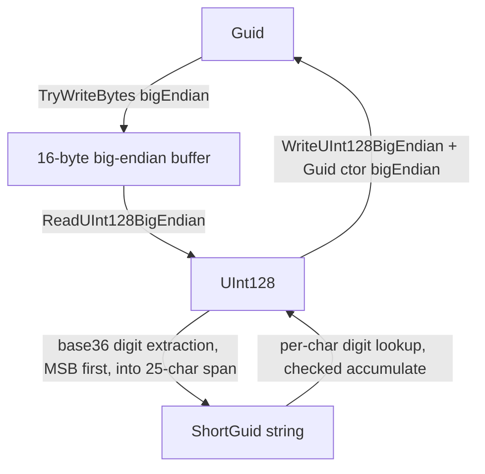

# Design Document

## Overview

`ShortGuid` is a `readonly struct` that wraps a single `Guid` field and represents it as a fixed-length, 25-character base36 string. It lives in a new `EtAlii.Adp` class library project — the reusable-helpers project [structure.md](../../steering/structure.md) already describes but that doesn't exist on disk yet — alongside a new `EtAlii.Adp.Tests` project. No existing project is required to reference `EtAlii.Adp` as part of this spec.

25 characters is the minimum fixed width that can represent every possible 128-bit `Guid` value in base36: `36^24 < 2^128 ≤ 36^25`. Because the width is fixed and zero-padded, comparing two `ShortGuid` string representations lexicographically is equivalent to comparing their numeric values — a property the design relies on for Requirement 2.6 instead of special-casing it.

## Steering Document Alignment

### Technical Standards (tech.md)
- Targets `net8.0`, matching every other project in `EtAlii.Adp.slnx`.
- Tests run as plain local `xunit` unit tests with no external dependencies, consistent with the "F5 experience" and "prefer fast, local unit tests" guidance.

### Project Structure (structure.md)
- Adds the `EtAlii.Adp` (Library) and `EtAlii.Adp.Tests` projects exactly as structure.md's project list already names them, as a flat sibling of `EtAlii.Adp.Backend` under `src/backend/`, registered in `EtAlii.Adp.slnx`.
- No `PackageReference` is needed for `EtAlii.Adp` itself (it only uses BCL types); `EtAlii.Adp.Tests` reuses the same `xunit`/`Microsoft.NET.Test.Sdk` versions already centralized in `Directory.Packages.props`.
- `EtAlii.Adp.Backend`'s existing dependency direction (it may depend on `EtAlii.Adp`, never the reverse) is preserved by construction: `EtAlii.Adp` has zero project references.

## Code Reuse Analysis

There is no existing base36/short-identifier code in the repository to reuse. `EtAlii.Adp.Backend.Tests`'s existing pattern for a small, pure-utility type with a matching `*Tests.cs` file (`PathTruncator` / `PathTruncatorTests.cs`) is followed for test structure and naming, adapted to `xunit` `[Theory]`/`[Fact]` conventions already used there.

### Existing Components to Leverage
- None from `EtAlii.Adp.Backend` — `EtAlii.Adp` must not depend on it (wrong dependency direction).
- BCL only: `System.Guid`'s .NET 8 big-endian byte APIs (`Guid(ReadOnlySpan<byte>, bool bigEndian)`, `TryWriteBytes(Span<byte>, bool bigEndian, out int)`) and `System.UInt128`/`System.Buffers.Binary.BinaryPrimitives` for allocation-free 128-bit integer conversion.

### Integration Points
- None. This spec is additive only: a new library project with no consumers wired up yet, per the "No forced wiring" non-functional requirement.

## Architecture

`ShortGuid` has exactly one field (`Guid`), so it is itself the whole "architecture" — there's no service layer, no dependency graph beyond the BCL. The design is a single struct plus a private encode/decode helper region within it:



### Modular Design Principles
- **Single File Responsibility**: `ShortGuid.cs` contains only the struct and its private encode/decode helpers — nothing else is added to the project by this spec.
- **Component Isolation**: no other type is introduced; the alphabet/length constants are private `const`s on the struct itself, not a separate shared "constants" file.

## Components and Interfaces

### `ShortGuid` (struct, `EtAlii.Adp` namespace)
- **Purpose:** Immutable, allocation-conscious base36 representation of a `Guid`.
- **Interfaces:**
  - `ShortGuid(Guid value)` constructor.
  - `Guid Guid { get; }` — the wrapped value.
  - `static ShortGuid Empty` — equivalent to `default`/`new ShortGuid(Guid.Empty)`.
  - `static ShortGuid NewShortGuid()` — equivalent to `new ShortGuid(Guid.NewGuid())`.
  - `static implicit operator ShortGuid(Guid value)`, `static implicit operator Guid(ShortGuid value)` — both directions are lossless and non-throwing, so both are implicit (Requirement 2.3).
  - `bool Equals(ShortGuid other)`, `override bool Equals(object?)`, `override int GetHashCode()`, `==`/`!=` — all delegate to the wrapped `Guid`'s own equality (byte-for-byte equality is independent of which endianness view is used to compute it).
  - `int CompareTo(ShortGuid other)`, `<`/`<=`/`>`/`>=` — delegate to `UInt128.CompareTo` on each side's `ToUInt128()` value, which by construction matches ordinal ordering of the 25-char strings (Requirement 2.6).
  - `override string ToString()`, `bool TryFormat(Span<char> destination, out int charsWritten, ReadOnlySpan<char> format = default, IFormatProvider? provider = null)` implementing `ISpanFormattable`.
  - `static ShortGuid Parse(string s, IFormatProvider? provider = null)`, `static bool TryParse(string? s, IFormatProvider? provider, out ShortGuid result)` implementing `IParsable<ShortGuid>`.
  - `static ShortGuid Parse(ReadOnlySpan<char> s, IFormatProvider? provider = null)`, `static bool TryParse(ReadOnlySpan<char> s, IFormatProvider? provider, out ShortGuid result)` implementing `ISpanParsable<ShortGuid>`. The `string` overloads delegate to the span overloads (null-check, then forward).
- **Dependencies:** `System`, `System.Buffers.Binary` only.
- **Reuses:** N/A (first type in the project).

## Data Models

### `ShortGuid`
```
readonly struct ShortGuid
- _value: Guid   (the only field; 16 bytes, same size as Guid itself)
```
No other data model is introduced. The base36 string is never stored — it is always computed on demand from `_value`, per Requirement 2.1's "SHALL NOT cache its string representation".

## Error Handling

### Error Scenarios
1. **`Parse`/`TryParse` given the wrong length (≠ 25 characters):**
   - **Handling:** length is checked first, before any character processing; `Parse` throws `FormatException`, `TryParse` returns `false` with `result = default`.
   - **User Impact:** immediate, clear failure — no partial/garbage `Guid` is ever produced.
2. **`Parse`/`TryParse` given a character outside `0-9a-zA-Z`:**
   - **Handling:** the per-character digit lookup returns "invalid" and processing stops immediately; `Parse` throws `FormatException`, `TryParse` returns `false`.
   - **User Impact:** same as above.
3. **`Parse`/`TryParse` given a syntactically valid but out-of-range value (> `UInt128.MaxValue`, e.g. 25 `'z'` characters):**
   - **Handling:** digit accumulation uses `checked(value * 36 + digit)` on a `UInt128` accumulator; the arithmetic overflow throws `OverflowException` internally, which is caught and translated to the same `FormatException`/`false` outcome as the other two scenarios (this doubles as the Requirement 3.4 range check — no separate manual bounds comparison is needed, since `UInt128`'s own range is exactly a `Guid`'s range).
   - **User Impact:** same as above — a single consistent failure mode for all malformed input, no silent wraparound.
4. **`TryFormat` given a destination buffer shorter than 25 characters:**
   - **Handling:** length is checked first; the method returns `false` and writes nothing, per the standard `ISpanFormattable` contract.
   - **User Impact:** caller can retry with a larger buffer; no partial write.

## Testing Strategy

### Unit Testing
- `EtAlii.Adp.Tests` (new project, `xunit`), mirroring `EtAlii.Adp.Backend.Tests`' `PathTruncatorTests.cs` style (`[Fact]`/`[Theory]`, one behavior per test, descriptive `Method_Scenario_Outcome` names).
- Covers, per requirement:
  - **Req 1 (round-trip/fixed length):** `Guid.Empty`, the all-`0xFF` guid, and a spread of random guids all round-trip through `ToString()`/`Parse` back to the original `Guid`; every produced string is exactly 25 characters; `ShortGuid.Empty.ToString()` is 25 `'0'` characters.
  - **Req 2 (interface shape):** conversions (`Guid` → `ShortGuid` → `Guid`), `NewShortGuid()` produces a non-empty, non-repeating value, equality/hash-code consistency, and that `CompareTo` ordering of a shuffled list of `ShortGuid`s matches `StringComparer.Ordinal` ordering of their `.ToString()` values.
  - **Req 3 (strict parsing):** valid mixed-case input parses and normalizes; wrong length, invalid character, and overflow (25 `'z'`s) all throw `FormatException` from `Parse` and return `false` from `TryParse`.
  - **Req 4 (allocation-conscious API):** `TryFormat` into an exact 25-char buffer and into a too-small buffer; `ISpanParsable` `Parse`/`TryParse` overloads taking `ReadOnlySpan<char>` directly (not just `string`) produce the same results as the `string` overloads.

### Integration Testing
- Not applicable — `ShortGuid` has no collaborators or I/O to integrate with.

### End-to-End Testing
- Not applicable — this spec adds a library type with no UI/API surface.
