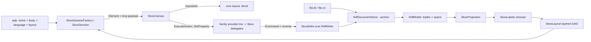

# Design Document

## Overview

No new engine and no new module: the `w3c/skos` reading joins `src/diagrams/rdf/` as a further `DiagramDefinition` over the anchor's `RdfDocumentStore` and `RdfModel` — a projection, a label chooser, a layered layout and a handful of thesaurus-named writers, all consuming triples-with-spans and never text. The design's center of gravity is the pair the requirements called load-bearing: the **label chooser** (one pure, deterministic function deciding every name on the canvas) and the **hierarchy projection** (one edge from either asserted direction, no completion anywhere). Everything else is consumed from finished patterns: the anchor's splice discipline under SKOS gesture names, the core `layout:` block, the C4-style per-origin session factory reading its own `.adp` header module-side, and the central canvas library.

## Steering Document Alignment

### Technical Standards (tech.md)

- **Diagram storage** — the `.ttl`/`.nt` body round-trips byte-identically through the anchor's store; positions and the `language:` header live in the `.adp`; nothing of ADP's ever lands in the SKOS file.
- **Commands** — every gesture is an `ICommand` with a byte-restoring inverse through the anchor's command pattern; writers refuse before any splice.
- **gRPC call shapes** — no new services or streams; elements ride the existing `Element`/`Delta` with `Any` payloads from `skos.proto`.
- **Specifying a diagram type** — the five build steps order the tasks document.

### Project Structure (structure.md)

- Everything lands inside the family module: `src/diagrams/rdf/backend/EtAlii.Adp.Diagram.Rdf/` gains a `Skos/` folder (projection, labels, layout, edits, validator, session), `src/diagrams/rdf/client/` gains the skos canvas, `src/diagrams/rdf/api/` gains `skos.proto`, `src/diagrams/rdf/examples/` gains the vendored vocabularies. No new module folder, per the requirements' non-functional rule.

## Code Reuse Analysis

### Existing Components to Leverage

- **The anchor's engine, whole** — `RdfDocumentStore` (the **triplestore document store**), `RdfModel`/`RdfTriple`/`RdfTerm` with source spans, `RdfParseException` unavailability, the self-write guard and `Changed` lifecycle. This reading adds zero parsing.
- **`RdfWriter`'s named operations** — `AddTriple` carries every connect and create gesture; `RemoveTriple`/`RemoveResource` carry removals with their fragment-aware smallest-diff behavior; `RenameTerm` stays the identity path. One family-level operation is **added** here (not restated — extended, in the family's own writer where the siblings can reuse it): `ReplaceObjectLiteral(document, model, triple, newLexical)`, a fragment splice rewriting exactly one literal token in place, which is what a label or documentation edit is. Its tests live with the family writer tests.
- **The family element-id vocabulary** — `res:{iri}` for concepts, schemes and collections (all IRI-named resources), `edge:{s}|{p}|{o-hash}` for hierarchy/related/mapping edges, unchanged; the core `layout:` block therefore works verbatim (shared machinery item 6), and ids never collide across readings because each registration owns its own block.
- **`C4SessionFactory.ReadViewKey` as the header-reading template** — the `language:` header is parsed the same way: module-side, a bounded line scan through `SharedDocumentReader.OpenText` so the read never contends with a rename's in-place `.adp` rewrite.
- **Central canvas library and appearance** — `BoxElement` for concept nodes, `StraightConnection` for all three edge styles, the shared boundary/region styling the C4 canvas established for scheme regions and collection groups, `CanvasScrollbars`, the shared selection/menu/keyboard plumbing, the truncation banner precedent.
- **The problems pipeline, `ExampleRegistrationTests`** — joined by existing. (`ExampleReplicationTests`, which byte-compared the two example trees, was deleted on 2026-09-03 when they were deliberately disconnected: the showcase copy is still seeded, no longer byte-compared.)

### Integration Points

- **Routing** — the `w3c/skos` definition declares `SharedExtension: true` over `.ttl`/`.nt` (the **routing arrangement**): never claims a bare body, Add-suggested off an asserted `skos:ConceptScheme` marker triple.
- **Context channel** — the family registers one provider trio (the anchor's wiring); this design extends it with per-origin delegation: the trio consults the session's origin and hands `w3c/skos` selections to `SkosActions`/`SkosProperties`/`SkosToolbox`, skos-owned classes in the `Skos/` folder — one registration path, per-reading ownership.
- **History** — gestures dispatch through `IHistoryStackStore`; repositions ride the core layout command.

## Architecture



## Components and Interfaces

### `SkosProjection` — pure, `RdfModel` in, the vocabulary out

- Collects schemes (`skos:ConceptScheme` by assertion), concepts (`skos:Concept` by assertion), memberships (`inScheme`/`topConceptOf`/`hasTopConcept`, any of them), collections and their members (ordered kind preserving `rdf:List` order through the anchor's collapsed-list model), notations, and documentation properties.
- **Hierarchy edges**: one edge per unordered concept pair where `skos:broader` or `skos:narrower` is asserted in either direction, oriented broader-above-narrower; both-directions collapse to one edge whose payload records each contributing triple's span (validation and removal need both lines). Nothing is added to the model; nothing is written back.
- **Related and mappings**: `skos:related` edges; mapping edges only when both ends are in-file concepts, otherwise surfaced as property rows on the in-file end.
- **The budget**: counted over drawn schemes, concepts and collections against the **drawn-element budget**, in the hierarchy-aware deterministic order the requirements fixed (schemes, top concepts, breadth-first by layer, ties by IRI); the truncation fact rides the projection result exactly as the anchor's does.

### `SkosLabels` — the chooser, one function, no state

- `Choose(labels, displayLanguage)` where `labels` is every `prefLabel`/`altLabel`/`hiddenLabel` literal of one concept: returns `(text, languageTag, kind)` with `kind` one of `Preferred`, `Alternate`, `IriFallback`. Selection order per approved Requirement 3: `displayLanguage`, then `en`, then the untagged literal, then the lexicographically smallest remaining tag — within a tag, the lexicographically smallest literal (so S14-violating duplicates still render deterministically while validation reports them).
- The chip rule is data, not styling logic: the payload carries `languageTag` and the canvas shows the chip whenever it differs from the session's display language; `kind` drives the alternate marker and the dimmed-code fallback style.
- SKOS-XL triples are left untouched in the model; the chooser never follows the indirection (approved Requirement 3.6), and the validator reports their presence once.

### `SkosLayout` — pure, deterministic, tree-shaped

- Top-down layering per scheme region: top concepts (asserted, or broader-less within the scheme) on layer 0, every concept one layer below its deepest placed broader concept; polyhierarchical concepts placed once. Unfiled concepts in a final band. Within a layer, orderd by IRI. Scheme regions stacked in IRI order; collections drawn as groups around their members' positions.
- **Cycle handling**: layering runs on a spanning acyclic subset — when a cycle is detected, the edge whose `(subject IRI, object IRI)` pair sorts lowest is excluded from *layering only*; every edge still draws, and the validator names the cycle from the same detection pass, so the picture and the problem report cannot disagree.
- Authored positions override per element through `RegistrationLayout.Apply`, the core mechanism unchanged.

### `SkosSessionFactory` / `SkosSession` — per-origin, header-owning

- The factory reads the registration's `language:` header module-side — the **registration header facility**, anchor shared-machinery item 10, which claims `language:` for this reading: a single lowercase-word `key: value` line placed **after `body:`/`view:` and before `layout:`**, parsed by a bounded scan that stops at `layout:` or the first non-header line. Core never sees it; the placement band matters because core's pairing scan breaks at the first unrecognized line, so the factory neither requires nor tolerates the header above `body:` — a header found outside the band is ignored and reported by validation as misplaced, never guessed at.
- The session composes projection, chooser (seeded with the header's language or the default order) and layout, applies the layout overlay, streams elements, diffs on `Changed`, and refuses repositions per the **blank-node identity boundary** and the unregistered-bare-file rule — all anchor behavior, reused.

### `SkosEdits` — gestures over the anchor's writer

Each named operation validates, then calls `RdfWriter`, wrapped in the family command pattern (parse-check, byte capture, splice, save; inverse = snapshot restore):

- `FileUnder(narrower, broader)` — one `AddTriple(narrower, skos:broader, broader)`, the thesaurus authoring direction; no inverse triple written.
- `Relate(a, b)` — one `AddTriple(a, skos:related, b)`.
- `NewConcept(schemeIri, label, position)` — one command, three triples through `AddTriple`: `rdf:type skos:Concept`, `skos:prefLabel` (dialog-provided, tagged with the display language), `skos:inScheme`; the IRI minted from the label under the file's base/prefix rules, collision-refused first.
- `EditLabel(triple, newText)` / `EditDocumentation(triple, newText)` — the new family `ReplaceObjectLiteral`, language tag preserved by construction (only the lexical token is rewritten).
- `RemoveConcept(iri)` — `RemoveResource`, count-first through the standard confirmation.
- `Disconnect(edge)` — `RemoveTriple` per contributing span (a both-directions hierarchy edge removes both triples as one command, stated in the confirmation).
- Refusals (blank-rooted, refused serialization, truncation, out-of-file mapping) answered before any splice, at provider and writer both.

### `SkosValidator` — Requirement 7 over spans

Implements the seven approved rules — cycle naming (from the layout's own detection), per-language duplicate `prefLabel`, the **direct-case-only** S27 check with the transitive boundary stated in the rule's doc text, missing labels, unfiled concepts, the SKOS-XL once-per-file info, non-concept targets — every finding carrying lines from the triples' source spans. No network, no inference, and the parse-failure finding stays the anchor validator's; this one runs only on a parsed model.

### `SkosCanvas` — client

- Concept nodes are deliberately rectangular: the VOWL circle is the OWL sibling's tradition, and a label-carrying node needs a shape that carries text — the family's circular canvas element (introduced by `owl-diagram`'s design) is consumed by that reading alone, and SKOS's divergence is this sentence, chosen rather than drifted.
- Concept nodes as `BoxElement`s: notation badge, label, language chip (rendered when payload tag differs from the session's display language), alternate/fallback styling by `kind`; scheme regions and collection groups in the shared boundary styling; three edge styles over `StraightConnection` — solid hierarchy (arrowless, layered top-down carries direction), dashed related, dotted mapping.
- Interaction: drag → core layout command; hierarchy and related anchors as two `rel:`-style gestures; `new:` toolbox drop with the label dialog; the shared menu, keyboard, `CanvasScrollbars` and truncation banner. Payload decode type-checked before `fromBinary`, per the family client shape.

## Data Models

Wire payloads in `src/diagrams/rdf/api/skos.proto` (packed as `Any` on the shared `Element`):

```proto
message SkosConceptPayload {
  string iri = 1;
  string label = 2;
  string language_tag = 3;   // empty for untagged; chip shown when != display language
  int32 label_kind = 4;      // 0 preferred, 1 alternate, 2 iri-fallback
  string notation = 5;
  repeated string scheme_iris = 6;
  bool blank = 7;
}
message SkosSchemePayload { string iri = 1; string label = 2; int32 member_count = 3; }
message SkosCollectionPayload { string iri = 1; string label = 2; bool ordered = 3; repeated string member_ids = 4; }
message SkosEdgePayload {
  string from_element_id = 1;
  string to_element_id = 2;
  int32 kind = 3;            // 0 hierarchy, 1 related, 2 mapping
  bool asserted_both_ways = 4;
}
```

The truncation banner reuses the family's `RdfTruncationPayload` — same fact, same banner, no duplicate message.

## Error Handling

### Error Scenarios

1. **File does not parse** — the anchor's unavailable state, verbatim (one store, one behavior).
2. **`language:` header misplaced or malformed** — the header is ignored, the default preference order applies, and validation reports the misplacement with its line; the body pairing is never at risk because the factory only scans the safe band.
3. **Cycle in the asserted hierarchy** — everything draws, layering breaks the cycle deterministically, validation names the members (R4.2/R7.1 through one detection).
4. **Label edit on a SKOS-XL-labeled concept** — refused naming Requirement 3.6's boundary; the grid shows the fallback label read-only with the same sentence.
5. **Blank-rooted, truncated, refused-serialization edits** — the anchor's refusals, unchanged sentences.
6. **Mapping edit whose far end is not in the file** — refused naming the out-of-file end; the row stays read-only in the grid.

## Testing Strategy

### Unit Testing

- **The chooser as a table**: every branch of the preference order, the chip condition, S14 duplicates rendering deterministically, the no-label fallback chain, SKOS-XL untouched — pure-function tests, exhaustive by construction.
- **Projection fixtures**: broader-only, narrower-only, both-directions (one edge, two spans), a cycle, polyhierarchy drawn once, unfiled concepts, collections ordered and not, mappings in- and out-of-file.
- **Layout determinism**: same fixture, same bytes out, cycle-break edge chosen by the documented sort; budget cut in the hierarchy-aware order on a fixture built to exceed it.
- **Header scan**: `language:` read from the safe band; above-`body:` ignored-and-reported; unknown keys left for their owners.
- **Writers**: each gesture's smallest diff and byte-restoring inverse through the real command pipeline, including `ReplaceObjectLiteral` preserving tags and the both-ways disconnect removing two spans as one command.
- **Validator**: each of the seven rules over the projection fixtures, lines asserted against spans.

### Integration Testing

- The gRPC flow: open a registered scheme, stream regions/concepts/edges, reposition into the `.adp` with the body byte-identical, undo byte-for-byte; Add suggesting `w3c/skos` off the marker triple; one file under `w3c/rdf` and `w3c/skos` registrations sharing one store and history.
- Examples joining `ExampleRegistrationTests` by existing; the license/provenance readme walk extended to the skos examples.

### End-to-End Testing

- `tests.md` entries: the language chip visible on the EuroVoc extract in a non-English display language; the truncation banner on the over-budget NALT slice; file-under → undo leaving the vocabulary byte-identical, checked with `git diff` on a vendored example.
