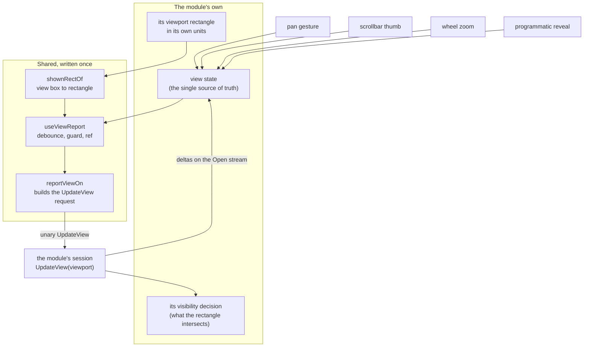

# Design Document

## Overview

Seven modules gain the view-delta loop, and the plumbing that carries it is written once instead of eleven times. The requirements settled the scope; this document settles the shape, and reading the code to settle it moved three things the requirements could only estimate.

**The client duplication is larger than the three pieces counted.** There is a fourth: the `Viewport` interface itself is declared four times, identically, once per stream hook. The requirements counted the code and missed the type, which is the usual way a shape spreads — nobody copies a five-line interface deliberately, they copy the file that contains it.

**The client duplication is also more exactly identical than "identical" usually means.** `reportView`'s four bodies differ in one comment and nothing else. mindmap's and c4's debounced effects match to the character, including the `viewKey` template string, the guard, the ref indirection, the `eslint-disable` line and the dependency array. And the one variant the requirements flagged as genuine — azure-pipeline's one-argument `shownRectOf` — turns out not to be a variant at all: it is character-for-character the branch mindmap and c4 return when there is no laid-out surface. One function with an optional second parameter reproduces all three exactly, which settles Requirement 3.3 on evidence rather than on preference.

**The backend halves are less different than the requirements concluded, in one specific place.** mindmap's and c4's `UpdateView` bodies are identical from `before` to `return deltas` — the same `Except`, the same `Where`, the same two conditional appends. What differs is only how each computes its visible set. That is precisely the common piece Requirement 4.3 anticipated, arriving earlier than expected. It is still **not centralized now**, because Requirement 4.2 asks for three consumers wanting the same behaviour and today there are two; the design names its exact signature and its observed emission order so that the third arrival is a five-minute extraction rather than a fresh argument.

**Two premises in the approved requirements have been overtaken by events, in the same direction.** `sparql` has gained a client canvas since the requirements were written — Requirement 1.5's condition has fired, so sparql implements the loop in this specification rather than in a later catch-up. Its `UpdateView` returns `[]` with no stated reason, which makes it the second such module alongside `rdf`, not the first. Neither premise change alters a single acceptance criterion; both are recorded here so nobody re-derives them.

**One defect was found while comparing the four working copies**, and it is the reason Requirement 5.1 needs an explicit exception rather than a silent one. It is set out under *A defect found in the reference set*.

## Steering Document Alignment

### Technical Standards (tech.md)

- **The paired-leg call shape is settled and untouched.** `Open` streams; `UpdateView` is unary and correlated by `watch_id` and path. `diagrams.proto` does not change (Requirement 5.5), and neither does `IDiagramSession.UpdateView(DiagramViewport)` — every one of the eleven sessions already implements that signature. Adoption fills in a method body; it adds no seam.
- **Centralised plumbing, module semantics.** The shared code speaks only of rectangles, paths and watch ids. What an element is, and whether the viewport intersects it, stays in the module — Requirement 2.4's test applied as the rule for every line moved.
- **Serilog, per-class static logger** for any backend logging added while implementing the seven.

### Project Structure (structure.md)

- The shared client code lands in `src/client/src/diagrams/`, beside `useDiagramStream.ts`, per Requirement 3.1.
- Backend changes stay inside each `src/diagrams/<module>/backend/`.
- **That folder has no readme today** — the three that exist are under `src/client/src/canvas/`. Requirement 7.3 therefore creates one rather than editing one, and it names `useDiagramStream` as well as the new code, since the folder's existing occupant is undocumented for the same reason.

## Code Reuse Analysis

### Existing components to leverage

- **`useDiagramStream`** (`src/client/src/diagrams/useDiagramStream.ts`) — the shared open loop. Its own doc comment already refers to `reportView` as something a module builds; that prose is updated to point at the shared implementation instead.
- **`MindmapSession.UpdateView`** — the reference backend half, and the source of the diff shape recorded below.
- **`MindmapCanvas`'s debounced effect** — the reference client half, copied verbatim into the shared hook rather than rewritten, so the four adopting modules inherit behaviour they already have.
- **`IDiagramSession` / `DiagramViewport` / `DiagramAddDelta` / `DiagramRemoveDelta`** — the whole backend contract already exists and is already implemented eleven times.

### What is being replaced

| Piece | Copies today | After |
| --- | --- | --- |
| `reportView` | 4, bodies identical but for one comment | 1, shared |
| `Viewport` interface | 4, identical | 1, shared — the piece the requirements did not count |
| Debounced re-report effect | 4 (2 identical, 1 one-arg, 1 divergent) | 1, shared hook |
| `shownRectOf` | 3 (2 identical, 1 the null-surface branch of the other 2) | 1, shared, surface optional |
| `VIEW_REPORT_DEBOUNCE_MS` | 4 | 1, shared |

## Architecture



### The ordering, stated once

This is the seam of Requirement 6, and it is stated here in the same terms as the `canvas-scrollbars` design so the two cannot drift:

**The canvas's own view state is the single source of truth. State is the module's; gestures write it; scrollbars write it and read it back to place the thumb; reporting observes it.**

Three consequences, each of which is a design decision and not a restatement:

1. **The report is wired to the state, never to the gesture.** A pan gesture, a thumb drag, a wheel zoom and a programmatic reveal all reach the report by the same path — they change the view, and the effect keyed on the view fires. This is what makes Requirement 6.2 hold for the ways a view can move that nobody has thought of yet, and it is why `drag-and-drop-centralization` centralising the pan gesture (Requirement 6.4) requires no change here.
2. **The scrollbar and the report never observe each other.** Both attach to the same state, which is why Requirement 6.3 is satisfied by one state change rather than by two mechanisms in a loop. The `canvas-scrollbars` design states its half of this as the bars being "another writer of a value the canvas already owns rather than a new source of truth"; this is the reading half of that same sentence.
3. **The report is the last observer, and it observes a settled value.** Debouncing is not an optimisation bolted on; it is what makes "observes it" different from "is driven by it". A report per frame would make the backend a participant in the gesture.

### Modular design principles

- The shared hook takes a view value, a conversion and a report function; it returns nothing. It has no opinion about units, elements or documents.
- The module supplies a rectangle and a visibility decision, and nothing else.
- No shared backend implementation is written on two consumers.

## Components and Interfaces

### Component 1 — `viewReport.ts` (new, shared, pure)

**Location:** `src/client/src/diagrams/viewReport.ts`

- **`Viewport`** — the interface moved out of the four hooks unchanged: `{ minX, minY, maxX, maxY }`. The four module copies are deleted and re-exported from here if a module's public surface needs the name.
- **`shownRectOf(box: ViewBox, surface?: SVGSVGElement | null): Viewport`** — the conversion, with the surface **optional**, settling Requirement 3.3. With a laid-out surface it does what mindmap and c4 do: `preserveAspectRatio="meet"` fits the box inside the element and centres it, so the axis with room to spare shows more of the model than the box asked for, and reporting the bare view box would have the backend cull elements the reader is looking straight at. Without one — no argument passed, or a null ref, or a zero-sized rect — it returns the bare box, which is character-for-character what azure-pipeline's private one-argument version does today. **A caller that has no surface passes no argument**, which is the second half of Requirement 3.3.
- **`viewReportOf(client, projectId, watchId, path)`** — builds and sends the `UpdateView` request: the centre, the bounding box, the correlation fields, and the `.catch` that swallows a failed report because it is advisory and the backend keeps the last window it had. Lifted from the four identical bodies without alteration.

### Component 2 — `useViewReport` (new, shared hook)

**Location:** `src/client/src/diagrams/useViewReport.ts`

```
useViewReport({ view, report, convert, ready })
```

- **`view`** — the canvas's current view box. The hook derives the same `viewKey` string the reference uses, so the effect fires on a value change and not on a new object identity.
- **`report`** — the module's `reportView`, held through a ref exactly as the reference does, so the effect's dependencies are the view and nothing else. This indirection is the reference's and is preserved deliberately: without it, a `reportView` recreated per render re-fires the effect every render, and the debounce protects nothing.
- **`convert`** — `() => Viewport`, called at fire time rather than at render time, so it reads the current refs. This is how the reference reaches `viewRef.current` and `surfaceRef.current` and it is why the hook takes a function rather than a rectangle.
- **`ready`** — false while loading or failed. See the defect below: this parameter exists because one of the four adopting modules gets it wrong today.
- Debounce is `VIEW_REPORT_DEBOUNCE_MS`, 200ms, defined once here.

**Requirement 3.6 is honoured by construction:** this hook takes a `report` function and knows nothing about how the module opened its stream. A module that hand-rolls its open loop adopts the report without adopting `useDiagramStream`.

### Component 3 — the module's half

Each module supplies two things and nothing else:

- **A viewport rectangle in its own units** (Requirement 3.4 — the shared code performs no unit conversion). A `viewBox` canvas passes its box and, if it has a surface, its ref. A pixels-per-unit canvas converts at its own call site, as it already does for scrollbars.
- **A visibility decision** in its session: given a `DiagramViewport`, which of its elements are visible.

### Component 4 — the guard (Requirement 3.5)

One test in the client suite failing, and naming the file, when a module client builds an `UpdateView` request itself: a call to `client.updateView(` outside `src/client/src/diagrams/`, or a module-local re-declaration of `VIEW_REPORT_DEBOUNCE_MS`, `shownRectOf` or `Viewport`.

Three constraints on how it is written, all three learned from `canvas-scrollbars`' guard and stated here so they are not learned again:

1. **It is specified as falsifiable by sabotage, not by review.** The task is not complete until a hand-built `updateView` call has been planted in a module, the guard has failed naming that file, and the sabotage has been reverted. That specific check exists because the scrollbar guard's first draft — "mentions a scrollbar without importing the shared module" — was satisfied by any file importing that module for an unrelated reason, and a hand-rolled thumb sitting beside a legitimate geometry import passed a green run. The same trap is live here: every adopting module will legitimately import from `src/client/src/diagrams/`, so **an import-presence check proves nothing** and the guard must test for the offending construct itself.
2. **A tree-walking guard anchors its root on two independent markers and asserts that its walk found something.** `src/client/src/diagrams` and `src/diagrams` both exist, and a walk that anchors on the folder name alone stops at the wrong one, finds no modules, and reports a clean tree for ever — indistinguishable from good news. The scrollbar guard's canary caught exactly this on its first run. Every tree-walking guard in this repository carries both: a two-part anchor, and an assertion that the file count is plausible.
3. **It reports every offender, not the first**, following `DependencyInventoryTests`, `DocumentationLinksTests` and `WorkspaceLockTests`.

### Component 5 — the backend halves, and the piece that is not written yet

Each of the seven implements `UpdateView` in its own terms. Requirement 4 forbids merging them, and the survey supports that for three of the four existing ones: ansible-structure delegates to its mapper's `Diff`, azure-pipeline diffs over expansion state as well as viewport, mindmap consults its document store before diffing.

But mindmap and c4 share more than the requirements recorded. From `before` to `return deltas` their bodies are identical:

```
var before = <visible set>.Select(e => e.Id).ToHashSet(StringComparer.Ordinal);
_viewport = viewport;
var after = <visible set>;
var removed = before.Except(after.Select(e => e.Id), StringComparer.Ordinal).ToArray();
var appeared = after.Where(e => !before.Contains(e.Id)).ToArray();
// append DiagramAddDelta(appeared) if any, then DiagramRemoveDelta(removed) if any
```

Two facts about it are worth recording precisely, because both are easy to get wrong from memory:

- **The emission order is Add-then-Remove.** Requirement 4.3 anticipated this piece as "Remove-then-Add"; the implementations do the opposite, in both copies. Any future helper preserves the order the code has, not the order the requirement guessed.
- **`_viewport` is assigned between the two reads**, so `before` and `after` are the same function evaluated either side of one mutation. A helper takes two already-computed sets, not a viewport, or it inherits that mutation.

**The helper is not written in this specification.** Two consumers is not three (Requirement 4.2). Its shape is recorded here — `DiffVisible(IReadOnlyCollection<Element> before, IReadOnlyCollection<Element> after)`, Add-then-Remove — so that when a third module wants exactly this behaviour, extracting it is mechanical. Modules whose behaviour differs keep their own (Requirement 4.3), and nothing is merged to raise a count (Requirement 4.4).

## Data Models

No new data models, and no wire change. `Viewport` moves; it does not change. `DiagramViewport`, `DiagramAddDelta` and `DiagramRemoveDelta` are untouched. `diagrams.proto` is untouched (Requirement 5.5).

## A defect found in the reference set

`AnsibleCanvas`'s report effect is declared before the component's `if (failed)` and `if (loading)` early returns, and — unlike mindmap's and c4's — it carries **no `loading || failed` guard**. Hooks run regardless of a later early return, so ansible-structure reports its viewport while the diagram is still loading, and again for a diagram whose backend has already answered that the path is gone. Both reports are wasted unary calls, the second to a connection that has just been told it is unroutable.

It also builds its rectangle inline at the call rather than through a `shownRectOf`, which is why the survey found three copies of that function and not four.

This matters to the design because of Requirement 5.1: a module that already works must see "the same reports at the same moments" after adopting the shared code. For three of the four, that holds exactly. For ansible-structure it does not, and the design chooses deliberately: **the shared hook carries the guard, and ansible-structure's behaviour changes** — it stops sending two reports it should never have sent. The alternative, making the guard optional to preserve a defect, would centralize the bug.

Per the repository's rule that every bug found leaves a guard behind, this is covered by a test asserting no report is sent while loading or failed — written against ansible-structure, where it fails before the change and passes after.

## Error Handling

1. **A failed view report** — swallowed, once, in the shared builder. The backend keeps the last window it had; the reader sees nothing. This is what all four copies already do and the reason is preserved in the comment.
2. **A report while loading or failed** — not sent (see above).
3. **No laid-out surface** — jsdom, or before the first measure. `shownRectOf` returns the bare box, which is the best answer available and is what the reference already does.
4. **A degenerate view box** (zero or negative width or height) — the bare box, same branch, no division.
5. **A module mid-adoption** — delivering everything at baseline and answering `[]` is internally consistent, so a partially migrated tree never shows a broken diagram (Requirement 5, Reliability). This is what makes the seven independently landable.
6. **A viewport arriving before the document is loaded** — the reference stores the viewport and returns `[]`, so the next real change diffs against the right window rather than against nothing.

## Testing Strategy

### Unit testing

**The behavioural test of Requirement 1.3 governs this section: a test that asserts `reportView` was called does not establish adoption**, because it passes on a module whose `UpdateView` returns `[]`. Each of the seven gets both halves:

1. **Client** — a view change produces a report. Change the view, advance the debounce timer, assert one `updateView` call carrying the new rectangle; and assert that several rapid changes produce **one** call, not several, since a debounce that does not debounce passes every test that only counts one change.
2. **Backend** — a viewport change produces deltas. Give the session a viewport that admits some elements, then one that admits a different set, and assert Add for what appeared and Remove for what left. This is the test that fails on a `return []`.

The shared pieces are tested once, directly: `shownRectOf` with and without a surface (including that the no-surface result equals the bare box, which is the case that pins azure-pipeline's behaviour), the builder's request shape and its swallowed rejection, and the hook's debounce, guard and ref indirection.

### Regression

The four working modules' existing tests are the regression suite for the extraction and pass unchanged (Requirement 5.1) — with the single disclosed exception of ansible-structure's two reports while loading or failed, which is a fix and carries the new test named above.

### Verification by sabotage

The guard is not accepted on a green run. Its acceptance is a planted `client.updateView(` call in a module, a failure naming that file, and a revert. Stated as a task step rather than as advice, because the last guard written in this repository passed its first green run while failing to catch the thing it existed to catch.

### Manual

Whether panning a large document actually brings its content in is a browser question, and jsdom's zero-sized rects make it untestable in the suite — `shownRectOf`'s surface branch never runs there. One `tests.md` entry against `rdf`, the module where the cost is already visible: open a document of more than 1,600 resources, pan to a region that was truncated away at open, and confirm the content arrives.

## Deviations and notes

1. **`sparql` is in scope now, not later.** Requirement 1.5 made it conditional on sparql gaining a canvas; it has one. The count of seven is unchanged — sparql was already among the seven — but the sequencing note in the requirements is dated.
2. **`sparql` joins `rdf` as a module declining without a stated reason.** The requirements record rdf as the only one; there are two. Neither has to state a reason retrospectively, since both are adopting.
3. **The `Viewport` interface is a fourth duplicated piece** beyond the three Requirement 3.1 enumerates. It is centralized with them; Requirement 3.2's list of what no module retains is read as covering it.
4. **Requirement 3.3 is settled toward one function with an optional surface**, on the evidence that azure-pipeline's variant is literally the other implementations' null branch rather than a different calculation.
5. **Requirement 4.1's finding is narrowed.** mindmap and c4 do not merely rhyme — their diff bodies are identical. The conclusion Requirement 4 draws still holds, because the requirement's own bar is three consumers wanting the same behaviour, and the extraction is deferred rather than refused.
6. **Requirement 4.3's "Remove-then-Add" is corrected to Add-then-Remove**, against the implementations.
7. **Requirement 5.1 has one disclosed exception**, ansible-structure's unguarded reports, argued above rather than silently preserved.
8. **`src/client/src/diagrams/` has no readme**, so Requirement 7.3 creates one covering `useDiagramStream` as well as the new code.
9. **`docs/creating-a-diagram-module.md` mentions neither `UpdateView` nor `reportView` today**, so Requirement 7.1 is an addition rather than an edit — which is consistent with its own diagnosis, that the next module author writes a truncation because nothing told them the loop was expected.
