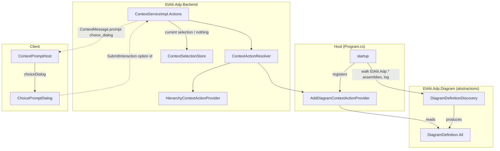

# Design Document

## Overview

This design delivers [requirements.md](requirements.md) in two halves that meet at one record.

The **discovery half** lives in the shared `EtAlii.Adp.Diagram` library and the host: a `DiagramDefinitionDiscovery` component walks the application's `EtAlii.Adp`-prefixed assemblies (the seeded breadth-first walk of Requirement 3), finds every static `Diagram.Definition`, and logs what it found; `DiagramDefinition.All` is the cached result of running it once at startup. Nothing in this half knows what a folder, a selection or a dialog is.

The **action half** lives in `EtAlii.Adp.Backend` and the client: a new `AddDiagramContextActionProvider` contributes an **Add…** action for any folder target - including the project root, which is what "nothing selected" resolves to - through the unchanged `IContextActionProvider` seam. When executed it asks for a new kind of prompt, a **choice** dialog, whose options are `DiagramDefinition.All` grouped by vendor. The client gains one new dialog component, driven purely by that prompt's data, and one new branch in `ContextPromptHost`. Confirming a choice reaches `CommitAsync`, which is the seam of Requirement 6: it re-checks the folder, creates nothing, and answers the submission with a "not supported yet" message naming the chosen type, which the open dialog shows.

The two halves meet at `DiagramDefinition`: discovery produces the list, the provider reads `DiagramDefinition.All` to build the options, and the client never sees a `DiagramDefinition` at all - only option labels and opaque option ids.

`context-service` is implemented and merged (all 23 tasks), so this design is written against its **shipped code** - `ContextServiceImpl.Actions`, `ContextSelectionStore`, `ContextMessageMapper`, the shell-level `ContextPromptHost` - not against a document. Each assumption below about that code was verified by reading it.

## Steering Document Alignment

### Technical Standards (tech.md)

* **Backend-pushed, data-driven dialogs.** The choice dialog follows the pattern `rename-files-and-folders` established and `context-service` carries forward: the backend decides a dialog is needed and pushes it as data on the connection's stream; the client renders whatever prompt arrives. A new *kind* of prompt is a new `oneof` member and a new component, never a new client→backend negotiation.
* **The backend is the sole owner of the filesystem.** The client receives option labels and ids, never a path, never a `DiagramDefinition`. The target folder is resolved server-side from the selection, exactly as for rename and delete.
* **One entity per file, `_Model` for POCOs** (tech.md's backend guidelines): every new record below gets its own file; the command/handler exception does not apply here because nothing in this spec is a command.
* **Logging through `ILogger`**: discovery takes an `ILogger<DiagramDefinitionDiscovery>`; it never writes to the console directly.

### Project Structure (structure.md)

* **Core vs diagram-type plugins, dependency direction.** `DiagramDefinitionDiscovery` and `DiagramDefinition.All` live in `EtAlii.Adp.Diagram` (the abstraction library every module already references) and depend on nothing module-specific. `EtAlii.Adp.Backend` depends on `EtAlii.Adp.Diagram` - a dependency that does not exist today and is added by this spec (*Integration Points*). No diagram module is referenced by name anywhere.
* **Tests beside the code.** Discovery tests go in `EtAlii.Adp.Diagram.Tests`, provider tests in `EtAlii.Adp.Backend.Tests/Unit Tests/Hierarchy/`, integration tests in `EtAlii.Adp.Backend.Tests/Integration Tests/`, client tests beside their components.

## Code Reuse Analysis

### Existing Components to Leverage

* **`DiagramDefinition` / `DiagramOrigin`** (`EtAlii.Adp.Diagram/_Model/`): the record discovery collects and the dialog groups on. `DiagramDefinition` gains the `All` property; `DiagramOrigin` is unchanged.
* **`IContextActionProvider` + `ContextActionResolver`**: Add is one more provider registered as `IContextActionProvider`; the resolver already aggregates every provider for a scope, so the Add group appears alongside Rename/Delete with no resolver change.
* **`HierarchyContextActionProvider`'s helpers** (`Exists`, `ParentFolderOf`): the existence check is reused by extracting it into a small shared `HierarchyTargets` static (see *Components*), since both providers need it and neither should own it.
* **`ContextExecutionResult`, `ContextValidationResult`, `ContextCommitResult`**: reused as-is. `ContextExecutionResult` gains one member, `RequiresChoice`.
* **`ContextInteractionStore`**: already keeps the in-flight interaction per `watch_id` (action id, target). The choice flow is the same `ExecuteAction → SubmitInteraction` arc as delete (no `ProposeInput` step), so the store needs no change.
* **`Dialog`** (`components/Dialog.tsx`): the choice dialog is a `Dialog` with custom children and a `buttons[].disabled` wired to "an option is selected" - the exact composition `Dialog`'s own documentation describes and `ProjectGridPage`'s add dialog already uses.
* **`ContextPromptHost`**: gains one `case`; its existing `onSubmit(value)` carries the chosen option id.
* **`context-service`'s `ContextSelectionStore` / `ContextServiceImpl.Actions`**: supply the "current selection or nothing" that the root case is built on.

### Integration Points

* **`EtAlii.Adp.Backend.csproj`** gains `<ProjectReference Include="..\EtAlii.Adp.Diagram\EtAlii.Adp.Diagram.csproj" />`. Today the backend library does not reference the diagram abstractions; the provider needs `DiagramDefinition`. This is core → abstraction, the permitted direction.
* **`EtAlii.Adp.Backend.Service/Program.cs`** runs discovery once after `builder.Build()` (so the host's logger factory exists) and registers `AddDiagramContextActionProvider` as an `IContextActionProvider`.
* **`context.proto`** gains `ChoiceDialogPrompt` and the `ContextOption` tree it carries, as a third member of `ContextPrompt.prompt`.
* **`ContextServiceImpl.Actions.TryResolveTargetAsync`**: with an absent `source` it already returns `_selectionStore.Get(watchId)?.Innermost.Target`, with the authorized `rootPath` in scope on the lines above; this spec extends the *null* result of that lookup (nothing selected) to resolve to the project root (see *The root case*).
* **`ContextSelectionStore` / `ContextMessageMapper`**: `Register` writes `ToMessage(entry.Record)` as the baseline and `Clear` writes `ToMessage(null)`; today `ToMessage(null)` yields a `ContextSelectionChanged` with no selection **and no actions**. This spec has both carry the root target's actions (see *The root case*).

## Architecture



### Request flow: Add on the project root

```mermaid
sequenceDiagram
    participant U as User
    participant T as ExplorerTreePanel
    participant S as ContextServiceImpl
    participant R as ContextActionResolver
    participant A as AddDiagramContextActionProvider
    participant H as ContextPromptHost

    Note over T,S: Watch stream open; store holds "nothing selected"
    U->>T: right-click empty explorer space
    T->>S: ExecuteAction(watch_id, interaction_id, action_id "hierarchy.add") - no source
    S->>S: TryResolveTarget: store empty -> root target (IsContainer, ResolvedFullPath = project root)
    S->>A: ExecuteAsync(rootTarget, "hierarchy.add")
    A->>A: DiagramDefinition.All -> ContextOptionNode tree by vendor
    A-->>S: RequiresChoice(ContextChoiceRequest)
    S-->>H: [Watch stream] ContextPrompt.choice_dialog
    H-->>U: choice dialog, confirm disabled
    U->>H: expands "c4", selects "System Context"
    H-->>U: confirm enabled
    U->>H: presses Add
    H->>S: SubmitInteraction(interaction_id, value = option id "c4/context")
    S->>A: CommitAsync(rootTarget, "hierarchy.add", "c4/context")
    A->>A: folder still exists? -> yes; look up definition by origin
    A-->>S: Failed("Creating a System Context diagram is not supported yet.")
    S-->>H: SubmitInteractionResponse { completed false, error }
    H-->>U: dialog stays open showing the error
```

For a **folder** target the flow is identical from `ExecuteAction` on, with `source` set and `TryResolveTarget` resolving the entry id as it does for rename. The shortcut path (`Insert`) collapses the menu step.

### The root case

`context-service` makes "nothing selected" an explicit state (`SelectRequest.selection` absent → `store.Clear`), and `ContextServiceImpl.Actions.TryResolveTargetAsync` already falls back to `_selectionStore.Get(watchId)?.Innermost.Target` when a request carries no `source`. Today that lookup yields *no target* when nothing is selected, and `ExecuteAction` rejects with "Nothing is selected."

This spec changes exactly that branch: **when the store reports nothing selected, the target is the project root** - `new ContextTarget(ContextScope.Hierarchy, rootPath, IsContainer: true, SourceId: default)`, where `rootPath` is the already-authorized project root `TryResolveRootPath` produced. No new `ContextSource` member is added; "no source" *means* "the root", which is also what the explorer's empty space visually is.

Two consequences are handled explicitly:

* **Discovery for the root.** `ContextSelectionChanged.actions` already carries a selection's actions, and `Register`/`Clear` already push an explicit "nothing selected" message - but via `ContextMessageMapper.ToMessage(null)`, which carries no actions. This spec has the baseline and every `Clear` carry the **root target's actions** in that same `actions` field, so the ribbon and the explorer's empty-space context menu have Add available without a `DiscoverActions` round trip. `ContextSelectionChanged.selection` stays absent - nothing is *selected*; the root is merely what actions apply to.
* **Rename/Delete on the root.** `HierarchyContextActionProvider.DiscoverAsync` already reports both unavailable when `ParentFolderOf(target)` is null ("This item has no parent folder to act within"), which is exactly the root. So the root's menu shows Rename and Delete greyed with that reason, and Add enabled - with no change to that provider.

### Modular Design Principles

* **Single file responsibility**: discovery (finding), the static cache (holding), the provider (offering/performing), the option-tree builder (shaping), the proto (describing), the dialog (rendering) are six files with one job each.
* **Component isolation**: `DiagramDefinitionDiscovery` has no dependency on the host, DI, or the backend; it is a plain class taking `IEnumerable<Assembly>` and an `ILogger`. `ChoicePromptDialog` knows nothing about diagrams - it renders `ContextOption` nodes.
* **Service layer separation**: the provider decides *what* to offer and *what* to do; `ContextServiceImpl` decides *whom* to ask and *where* to push; the client decides only *how* to draw.

## Components and Interfaces

### `DiagramDefinitionDiscovery` (`EtAlii.Adp.Diagram/DiagramDefinitionDiscovery.cs`, new)

* **Purpose:** Requirements 1.1, 1.4-1.8, 2.1-2.4, 3.2-3.3. The reflection scan, as an instantiable, testable component.
* **Interfaces:**
  ```csharp
  public sealed class DiagramDefinitionDiscovery
  {
      public DiagramDefinitionDiscovery(ILogger<DiagramDefinitionDiscovery> logger);

      /// Scans exactly the given assemblies (Requirement 1.4: a test supplies its own).
      public IReadOnlyList<DiagramDefinition> Discover(IEnumerable<Assembly> assemblies);

      /// Requirement 3.2-3.3: the seeded breadth-first walk over EtAlii.Adp.* assemblies.
      public static IReadOnlyList<Assembly> FindApplicationAssemblies();
  }
  ```
* **`Discover` behaviour:** for each assembly, `GetTypes()` inside a `try` that catches `ReflectionTypeLoadException` (use `.Types` minus nulls) and `Exception` (skip, warn - Requirement 1.5). Candidate = `type.IsClass && type.IsAbstract && type.IsSealed && type.Name == "Diagram"` (that is what `static class` compiles to). Property = `type.GetProperty("Definition", BindingFlags.Public | BindingFlags.Static)`; missing, wrong type, or a getter that throws → warn "malformed", skip (1.6). Collision on `Origin` → keep the one whose `assembly.GetName().Name` is ordinal-smaller, warn naming both (1.7). Result ordered by `(Origin.Vendor, Origin.Type, Origin.Subtype)` ordinal so `All` is stable. Log one info line per definition (`"Discovered diagram type {Origin}: {Title} ({Assembly})"`), one info summary (`"{Count} diagram types discovered across {AssemblyCount} assemblies"`), and a warning if `Count == 0` (2.4).
* **`FindApplicationAssemblies` behaviour** (the walk from Requirement 3.2-3.3, in this order):
  1. `entry = Assembly.GetEntryAssembly()`; if null (unit-test hosts), fall back to `typeof(DiagramDefinitionDiscovery).Assembly` and warn.
  2. Seed the queue with `entry` **and** every `RuntimeLibrary` in `DependencyContext.Default.RuntimeLibraries` whose `Name` starts with `EtAlii.Adp` (ordinal), loaded via `Assembly.Load(new AssemblyName(name))` inside a try (skip + warn on failure). `DependencyContext.Default` is null when there is no `.deps.json` (single-file publish without it); then the seed is the entry assembly alone and a warning says so.
  3. Breadth-first as the article: dequeue, add `FullName` to the visited set, for each `GetReferencedAssemblies()` with `Name` starting `EtAlii.Adp` and not visited, `Assembly.Load` and enqueue (try/skip/warn).
  4. Return visited assemblies in visit order.
* **Dependencies:** `Microsoft.Extensions.Logging.Abstractions`, `Microsoft.Extensions.DependencyModel` - both added to `EtAlii.Adp.Diagram.csproj` via `Directory.Packages.props`.

### `DiagramDefinition.All` (`EtAlii.Adp.Diagram/_Model/DiagramDefinition.cs`, edited)

* **Purpose:** Requirements 1.2-1.3. The once-computed cache.
* **Interfaces:**
  ```csharp
  public sealed record DiagramDefinition(DiagramOrigin Origin, string Title)
  {
      /// Every diagram type discovered at startup, stable order, never null. Empty until
      /// Initialize has run - only the host calls that, once.
      public static IReadOnlyList<DiagramDefinition> All => _all;

      /// Called once by the host after discovery. A second call is a programming error.
      public static void Initialize(IReadOnlyList<DiagramDefinition> definitions);

      private static IReadOnlyList<DiagramDefinition> _all = Array.Empty<DiagramDefinition>();
  }
  ```
* **Why `Initialize` and not a lazy static:** a lazy initializer inside the record could not take the host's `ILogger` (Requirement 2) and could not be given test assemblies (NFR Testability). `Initialize` is `internal` + `InternalsVisibleTo("EtAlii.Adp.Backend.Service")` and `("EtAlii.Adp.Diagram.Tests")`, so only the host and the tests can set it; it throws `InvalidOperationException` on a second call, which satisfies "no public way to replace it" (1.2) while keeping the record a plain record.

### `AddDiagramContextActionProvider` (`EtAlii.Adp.Backend/Hierarchy/AddDiagramContextActionProvider.cs`, new)

* **Purpose:** Requirements 4.1-4.6, 5.1-5.3, 5.6-5.7, 6.1-6.4. Offers and performs Add for hierarchy containers.
* **Interfaces:** implements `IContextActionProvider`; `Scope => ContextScope.Hierarchy`; `public const string AddActionId = "hierarchy.add"`; shortcut `Insert`.
* **`DiscoverAsync`:** target not a container → empty (4.3); target gone → empty (mirrors `HierarchyContextActionProvider`); else one group with one action `("hierarchy.add", "Add…", "mdi-plus", Insert)`. Available unless `DiagramDefinition.All` is empty, in which case `Available: false, UnavailableReason: "No diagram types are available."` (5.7 at the menu level - the dialog's own empty state covers the case where the list empties between menu and dialog, which cannot happen since `All` is immutable, so the dialog's empty state is defensive only).
* **`ExecuteAsync`:** target gone → `Failed("The folder no longer exists.")` (4.5); else `RequiresChoice(new ContextChoiceRequest(Title: "Add diagram", Icon: "mdi-plus", ConfirmLabel: "Add", Options: DiagramOptionTree.Build(DiagramDefinition.All), EmptyMessage: "No diagram types are available."))`.
* **`ValidateAsync`:** always `Accepted` - there is no free text; a choice is either a known option id or it is not, and `CommitAsync` checks that.
* **`CommitAsync` (the seam, Requirement 6):** in this order: folder gone → `Failed("The folder no longer exists.")` (6.4); `value` not a known origin key → `Failed("That diagram type is not available.")`; else → `Failed($"Creating a {definition.Title} diagram is not supported yet.")` (6.2). A later spec replaces only the last line (6.3). A `ContextCommitResult.Failed` is returned on `SubmitInteraction`'s own response as `Completed = false, Error` (that is how `SubmitInteraction` already surfaces a commit failure), and the client's `onSubmit` already shows that error inside the open dialog. So "not supported yet" reaches the user through the existing path with no new plumbing, and they see it in the dialog they were just in, with their choice still visible.
* **Dependencies:** `DiagramDefinition.All`, `HierarchyTargets`.

### `DiagramOptionTree` (`EtAlii.Adp.Backend/Hierarchy/DiagramOptionTree.cs`, new, static)

* **Purpose:** Requirements 5.1-5.3. Shapes `DiagramDefinition.All` into the option tree the prompt carries.
* **Interfaces:** `public static IReadOnlyList<ContextOptionNode> Build(IReadOnlyList<DiagramDefinition> definitions)`.
* **Behaviour:** group by `Origin.Vendor` (ordinal, sorted) → one `ContextOptionNode(Id: vendor, Label: vendor, Selectable: false, Children: …)`. Under a vendor, one node per definition with empty `Subtype`: `(Id: "vendor/type", Label: Title, Selectable: true)`. A definition **with** a `Subtype` becomes a child of the node sharing its `Vendor`/`Type` (`Id: "vendor/type/subtype"`); if no such parent exists, a non-selectable parent labelled `Type` is synthesised so the subtype still has a home (5.3). Children sorted by label. The option id **is the origin key** (`vendor/type[/subtype]`), so `CommitAsync` can map it back with one dictionary lookup and the client carries nothing it could misuse.

### `HierarchyTargets` (`EtAlii.Adp.Backend/Hierarchy/HierarchyTargets.cs`, new, static)

* **Purpose:** The existence check both providers need. `public static bool Exists(ContextTarget target)` - moved out of `HierarchyContextActionProvider` (which calls it instead), so neither provider reaches into the other.

### `ContextExecutionResult.RequiresChoice` + `ContextChoiceRequest` + `ContextOptionNode` (`Context/_Model/`, edited + two new files)

```csharp
public sealed record RequiresChoice(ContextChoiceRequest Request) : ContextExecutionResult;

public sealed record ContextChoiceRequest(
    string Title, string Icon, string ConfirmLabel,
    IReadOnlyList<ContextOptionNode> Options,
    string EmptyMessage);

public sealed record ContextOptionNode(
    string Id, string Label, bool Selectable,
    IReadOnlyList<ContextOptionNode>? Children = null);
```

### `ContextServiceImpl.Actions` (`Context/ContextServiceImpl.Actions.cs`, edited)

* `ExecuteAction`: the `switch` over `ContextExecutionResult` gains a `RequiresChoice r => ToProto(r.Request)` arm producing `ContextPrompt { choice_dialog }`.
* `TryResolveTargetAsync`: the `source is null` branch becomes *"store has a selection → its innermost target; store has none → the root target"* (see *The root case*). The `rootPath` it needs is already in scope from `ProjectRootResolver.TryResolve` a few lines above.
* **`ContextSelectionStore.Register`/`Clear` + `ContextMessageMapper`:** the baseline and the cleared message carry the root's actions. `Register` gains a `rootActions` parameter (`IReadOnlyList<ContextActionGroupDefinition>`, computed once by the service from `resolver.DiscoverAsync(rootTarget)` when the `Watch` opens) which the entry keeps; `ToMessage(null)` becomes `ToMessage(null, rootActions)` and fills `actions` from it. The store still never references `IContextActionResolver`. The root's actions are computed once per `Watch` rather than per `Clear` because they depend only on the root existing and on `DiagramDefinition.All`, both stable for the life of a connection.

### `context.proto` (edited)

See *Data Models*. One new prompt member, one new recursive message.

### `ChoicePromptDialog` (`client/src/shell/context/ChoicePromptDialog.tsx`, new)

* **Purpose:** Requirements 5.1-5.8 and the Usability NFRs. Renders a `ChoiceDialogPrompt`.
* **Props:** `{ prompt: ChoiceDialogPrompt; onSubmit(value: string): Promise<ContextPromptSubmission>; onCancel(): void }`.
* **Behaviour:** a `Dialog` whose body is a `role="tree"` of option nodes. Non-selectable nodes are expandable groups (labelled, chevron, collapsed by default except when there is only one vendor); selectable nodes are `role="treeitem"` leaves. Keyboard: Up/Down move, Right/Left expand/collapse, Enter on a selectable leaf = confirm (Usability). Roving `tabIndex`, same discipline as `ExplorerTreePanel`. Footer: Cancel + confirm (`prompt.confirmLabel`), confirm `disabled` until `selectedId !== null` (5.5). `options.length === 0` → the body is `prompt.emptyMessage` and confirm stays disabled (5.7). Confirm → `onSubmit(selectedId)`; `Escape`/Cancel → `onCancel()` (5.8). No diagram vocabulary anywhere in the file.
* **Reuses:** `Dialog`, the explorer tree's CSS tokens (`.explorer-tree-*` patterns, via new `.choice-tree-*` classes in `index.css` that share the same spacing/colour tokens rather than the same selectors).

### `ContextPromptHost` (client, edited)

* One new `case "choiceDialog":` rendering `ChoicePromptDialog` with `key={keyOf(prompt)}` for the same remount-per-interaction reason the input dialog uses.

### `Program.cs` (host, edited)

```csharp
var app = builder.Build();

// Discovery runs once, after Build so the host's logger exists; before any request can
// reach a provider that reads DiagramDefinition.All.
var discovery = new DiagramDefinitionDiscovery(app.Services.GetRequiredService<ILogger<DiagramDefinitionDiscovery>>());
DiagramDefinition.Initialize(discovery.Discover(DiagramDefinitionDiscovery.FindApplicationAssemblies()));
```
plus `builder.Services.AddSingleton<IContextActionProvider, AddDiagramContextActionProvider>();` beside the existing hierarchy provider registration.

## Data Models

### `context.proto` (additions)

```protobuf
// A node in a choice dialog's option tree. A node with `selectable` false is a group:
// it is shown, labelled and expandable, but cannot be the dialog's answer. A group's
// `id` is informational; a selectable node's `id` is exactly what SubmitInteraction
// sends back as the value.
message ContextOption {
  string id = 1;
  string label = 2;
  bool selectable = 3;
  repeated ContextOption children = 4;
}

message ChoiceDialogPrompt {
  string title = 1;
  string icon = 2;
  string confirm_label = 3;
  repeated ContextOption options = 4;   // top level of the tree
  string empty_message = 5;             // shown instead of the tree when options is empty
}

message ContextPrompt {
  ShortGuid interaction_id = 1;
  oneof prompt {
    InputDialogPrompt input_dialog = 2;
    ConfirmDialogPrompt confirm_dialog = 3;
    ContextInteractionClosed closed = 4;
    ChoiceDialogPrompt choice_dialog = 5;   // new
  }
}
```

Nothing about diagrams appears in the contract: the same prompt can later carry "choose a target folder", "choose a template", or anything else that is a tree of labelled options.

### Option tree for the current scaffolding (illustrative)

```
c4                      (group)
  ├ System Context      id c4/context
  ├ Container           id c4/container
  └ …
archimate               (group)
  ├ Business            id archimate/business
  └ …
mermaid                 (group)
  └ …
```

### Backend records (`Context/_Model/`, one file each)

```
ContextChoiceRequest   : Title, Icon, ConfirmLabel, Options (IReadOnlyList<ContextOptionNode>), EmptyMessage
ContextOptionNode      : Id, Label, Selectable, Children (IReadOnlyList<ContextOptionNode>?)
```

## Error Handling

### Error Scenarios

1. **An `EtAlii.Adp.*` assembly fails to load during the walk** (corrupt file, missing dependency).
   - **Handling:** caught per assembly in `FindApplicationAssemblies`; logged at warning with the assembly name and exception message; walk continues (Requirement 1.5).
   - **User Impact:** none at startup; that module's diagram type is absent from the dialog, and the log says why.

2. **A `Diagram` class has no usable `Definition`** (wrong type, non-static, getter throws).
   - **Handling:** skipped, warning names the type and assembly (Requirement 1.6).
   - **User Impact:** as above.

3. **Two modules declare the same origin.**
   - **Handling:** deterministic keep-first-by-assembly-name, warning names both (Requirement 1.7).
   - **User Impact:** one entry in the dialog, never two identical ones.

4. **`DependencyContext.Default` is null** (no `.deps.json` at runtime).
   - **Handling:** seed is the entry assembly alone; warning explains that modules may be missing and why.
   - **User Impact:** likely an empty dialog; Requirement 2.4's "none discovered" warning fires too, so the log points straight at deployment.

5. **Nothing discovered at all.**
   - **Handling:** warning (2.4); `All` is empty; `DiscoverAsync` reports Add unavailable with a reason (5.7).
   - **User Impact:** Add shows greyed with "No diagram types are available." rather than opening an empty dialog.

6. **Folder vanishes between menu and confirm.**
   - **Handling:** `CommitAsync` re-checks first (6.4) → `Failed("The folder no longer exists.")` → returned as the submit error.
   - **User Impact:** the dialog shows that message; nothing created. Cancel closes it.

7. **Client submits an option id that is not a known origin** (stale client, tampering).
   - **Handling:** `CommitAsync` → `Failed("That diagram type is not available.")`; nothing else happens.
   - **User Impact:** the dialog shows the message.

8. **Add confirmed successfully (in this spec).**
   - **Handling:** `Failed($"Creating a {Title} diagram is not supported yet.")` (6.2), returned as the submit error.
   - **User Impact:** the dialog shows the message, which names the type they chose - confirming the choice reached the backend - and Cancel closes it. Deliberately the same submit-error path as a real failure, so there is no special success plumbing to remove later.

## Testing Strategy

### Unit Testing

* **`DiagramDefinitionDiscovery.Discover`** (`EtAlii.Adp.Diagram.Tests`): drive it with assemblies the test controls - the test project itself containing fixture types: a valid `Diagram` (`Fixtures/Valid/Diagram.cs`), a malformed one (`Definition` of the wrong type, a non-static one, one whose getter throws), and two valid ones with the same origin. Assert: valid found; malformed skipped and logged (capture with a test `ILogger`); collision keeps the ordinal-first assembly and logs both; result order stable; empty input → empty + warning; an assembly whose `GetTypes` throws `ReflectionTypeLoadException` is partially read (`.Types`) not skipped wholesale.
* **`DiagramDefinitionDiscovery.FindApplicationAssemblies`**: assert every returned assembly's name starts with `EtAlii.Adp`; assert the test assembly itself is present (it is the entry point under xunit's host? No - `GetEntryAssembly()` is the test host, so assert the *fallback* path: with the entry assembly's references not including the test assembly, the manifest seed still yields `EtAlii.Adp.Diagram.Tests` and `EtAlii.Adp.Diagram`). This is the one test that proves Requirement 3.3's seeding against a real manifest.
* **`DiagramDefinition.Initialize`**: sets `All`; second call throws; `All` before `Initialize` is empty, not null.
* **`DiagramOptionTree.Build`**: grouping by vendor; titles as labels; ids are origin keys; subtype nests under its type and synthesises a parent when absent; vendors and children sorted; empty in → empty out.
* **`AddDiagramContextActionProvider`** (`Backend.Tests/Unit Tests/Hierarchy/`): `DiscoverAsync` on a file → empty; on a missing folder → empty; on a folder → one Add action, available; with `All` empty (use an `Initialize`-able test seam: the provider takes `IReadOnlyList<DiagramDefinition>` via a constructor overload defaulting to `DiagramDefinition.All`) → unavailable with reason. `ExecuteAsync` → `RequiresChoice` with the expected tree; on a vanished folder → `Failed`. `CommitAsync`: unknown id → `Failed("…not available")`; vanished folder → `Failed("…no longer exists")` **before** the not-supported message; known id → `Failed` naming the title and **no file created** (assert directory contents unchanged).
* **`ContextServiceImpl.Actions.TryResolveTarget`** root branch: no source + empty store → root container target at `rootPath`; no source + a selection → that selection's target (unchanged behaviour).
* **`ChoicePromptDialog`** (client): renders groups and leaves; confirm disabled until a leaf is selected; selecting a group does not enable it; Enter on a leaf submits its id; Escape cancels; empty options shows `emptyMessage` with confirm disabled; keyboard Up/Down/Right/Left move and expand as specified; exactly one tabbable node.
* **`ContextPromptHost`**: a `choiceDialog` prompt renders `ChoicePromptDialog`; a new interaction id remounts it.

### Integration Testing

* **Full Add flow over gRPC** (`Backend.Tests/Integration Tests/`, beside `ProjectRootFolderExplorerFlow.Tests.cs`): open `Watch`; with nothing selected, assert the baseline's `actions` include `hierarchy.add`; `ExecuteAction` with no source → a `choice_dialog` prompt arrives on the stream with a non-empty option tree; `SubmitInteraction` with a leaf id → a `closed` prompt whose message contains "not supported yet" and the chosen title; assert the project folder is byte-for-byte unchanged. Repeat for a folder entry via `source`. Repeat with a file `source` → `DiscoverActions` returns no `hierarchy.add`.
* **Startup discovery in the real host** (`Backend.Tests/Integration Tests/`, using the existing `WebApplicationFactory`-based setup from `LoginProjectSelectionFlow.Tests.cs`): after the host starts, `DiagramDefinition.All.Count > 0` and every scaffolded module that declares a `Definition` is present - this is the test that would have caught the unseeded walk returning zero.

### End-to-End Testing

* Manual (recorded in the implementation log, per the repo's existing practice for explorer features): start backend + client from a worktree on alternate ports; right-click empty explorer space → Add… → dialog with vendor groups → select a type → Add → the dialog shows the "not supported yet" message naming that type; repeat on a folder; `Insert` with a folder focused opens the dialog directly; a file's menu has no Add; the backend log shows one line per discovered type and the summary count.

## Deviations and notes

1. **Built on shipped `context-service` code.** That spec was implemented and merged while this design was being written, so no sequencing caveat applies; every reference to its components names a file that exists on `develop` today.
2. **No new `ContextSource` member for the root.** Requirement 4.2 said the contract "SHALL gain a way to name the root without naming an entry". The design satisfies it differently from how that sentence reads: the *absence* of a source, combined with the context service's explicit "nothing selected" state, already names the root unambiguously, so no new message is needed. Adding an `ENTRY_ROOT`-style member would create two ways to say the same thing.
3. **`Initialize` instead of a self-initialising `All`.** Requirement 1.2 asked for a get-only property; it is one. The `internal` initializer exists only because a static initializer cannot be handed a logger or test assemblies (see the `DiagramDefinition.All` section).
4. **Option ids are origin keys, not `ShortGuid`s.** `DiagramDefinition` has no id, and an origin is already unique per the collision rule; minting ids would add a lookup table for nothing.
5. **`Insert` as the shortcut** follows the F2/Delete precedent (the key the OS convention associates with the action). It is data from the provider, per Requirement 4.6, and can change without client involvement.
