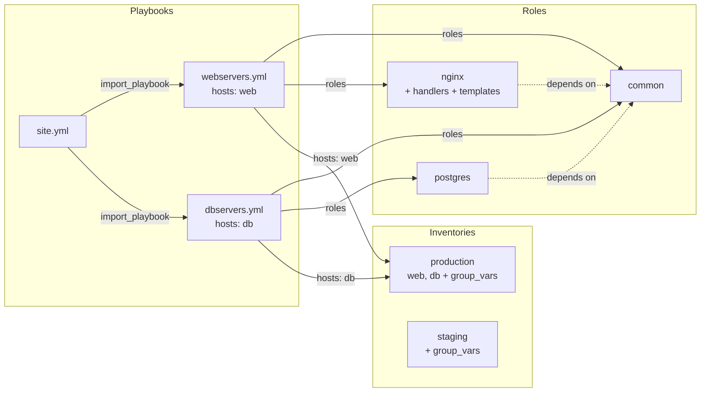

# Requirements Document

## Introduction

This spec covers the **Ansible structure diagram module** — a **read-only** visualization of an Ansible project's folder structure and the relationships written inside it: playbooks, plays, roles, inventories, variable folders, and the include/import/dependency edges that connect them. It answers the question every newcomer to an Ansible repository asks — *"what runs what, and where does this value come from?"* — without opening twenty YAML files to find out.

**Why this type is read-only, by design and not by omission.** The types drawn so far, shipped and specified alike, form a progression of ownership: the mindmap ADP ships and the Wardley map it has specified are ADP's own documents; the pipeline file belongs to the build system and gets a deliberately narrow set of edits; an Ansible project belongs to an *operations workflow* — hand-authored, reviewed, often deployed by machinery that ADP cannot see. Its natural editor is a text editor with `ansible-lint` beside it. What that workflow lacks is not editing but **sight**: the structure is spread across dozens of files whose relationships are implicit in strings (`roles:`, `import_playbook:`, `dependencies:`, `hosts:`). This module draws those relationships and changes **nothing** — it never writes a file, registers no editing command, and its property grid shows every value with a reason saying where it is edited instead (Requirement 10).

|                   | [`azure-pipeline-diagram`](../azure-pipeline-diagram/requirements.md) | This spec                          |
| ----------------- | --------------------------------------------------------------------- | ---------------------------------- |
| Document          | one file (plus templates)                                             | **a folder tree** of many files    |
| Editing           | a narrow, deliberate set                                              | **none**                           |
| If ADP writes it  | the build breaks                                                      | *(it never writes)*                |

That first row is this spec's genuinely new ground: previous types read a *document*; this type's subject is a **directory**, and the module reads the tree the way `ansible` itself resolves it.

### What similar tools draw *(research)*

The visualization is deliberately not invented from scratch. The established tools agree on the shape of the problem, and this module adopts what works:

* **[ansible-playbook-grapher](https://github.com/haidaraM/ansible-playbook-grapher)** — the reference point. Renders playbook → play → role → task hierarchies (Graphviz/Mermaid/JSON) with per-play colours carried onto a play's roles and edges, edge labels for order and `when` conditions, and a deliberate distinction between `import_*` (always drawn — resolved statically) and `include_*` (conditional — resolved at run time). Its SVG output is interactive: hover highlighting, and double-click opens the file. **Adopted:** the node hierarchy, play-colour continuity, the import/include distinction, and open-the-file-from-the-node (Requirement 8).
* **[ansible-viz](https://github.com/aspiers/ansible-viz)** — static analysis of playbook/role/task/**var** relationships, rendered client-side. Proves the value of drawing where variables come from, and how hard var-usage tracking is to get right. **Adopted:** variable *folders* as first-class nodes (`group_vars`, `host_vars`, `defaults`, `vars`); **rejected:** per-variable usage edges, which ansible-viz itself concedes is bug-prone — a wrong edge is worse than none (Requirement 6.8).
* **[ansible-repo-grapher](https://github.com/mtnbikenc/ansible-repo-grapher)** and **[ansigenome](https://github.com/nickjj/ansigenome)** — role-dependency graphs from `meta/main.yml`, at repository granularity. **Adopted:** role → role dependency edges as their own edge kind (Requirement 6.5).
* The **[recommended Ansible directory layout](https://spacelift.io/blog/ansible-best-practices)** ([details](https://charlesreid1.com/wiki/Ansible/Directory_Layout/Details), [role dependencies](https://oneuptime.com/blog/post/2026-01-24-ansible-roles-dependencies/view)) — `inventories/<env>/` with `group_vars`/`host_vars`, playbooks at the root or under `playbooks/`, `roles/<name>/` with its canonical subfolders (`tasks`, `handlers`, `templates`, `files`, `vars`, `defaults`, `meta`, `library`), `ansible.cfg`, `collections/requirements.yml`. **Adopted:** this layout is the *model's vocabulary* — the module recognises these folders by their conventional names and shapes (Requirement 4).

What none of these tools offer is what ADP adds: the diagram **stays true as the files change**, is navigable (element → file), and sits beside the same explorer, problems panel and property grid every other diagram type uses — product.md's "linkage over illustration".

### Worked example

An `infrastructure/` folder a team already has:

```
infrastructure/
├── ansible.cfg
├── site.yml                    # - import_playbook: webservers.yml
├── webservers.yml              #   hosts: web        roles: [common, nginx]
├── dbservers.yml               #   hosts: db         roles: [common, postgres]
├── inventories/
│   ├── production/
│   │   ├── hosts.yml           #   groups: web, db
│   │   └── group_vars/
│   │       ├── all.yml
│   │       └── web.yml
│   └── staging/
│       ├── hosts.yml
│       └── group_vars/all.yml
└── roles/
    ├── common/
    │   ├── tasks/main.yml
    │   └── defaults/main.yml
    ├── nginx/
    │   ├── tasks/main.yml      #   include_tasks: tls.yml
    │   ├── tasks/tls.yml
    │   ├── handlers/main.yml
    │   ├── templates/nginx.conf.j2
    │   └── meta/main.yml       #   dependencies: [common]
    └── postgres/
        ├── tasks/main.yml
        └── meta/main.yml       #   dependencies: [common]
```

The user right-clicks `infrastructure/`, chooses **Add… → Ansible project structure**, and `infrastructure.adp` appears beside it. Opening it renders, roughly:



Selecting the `nginx` role shows, in the Properties panel (all read-only, per Requirement 10): **Identity** — Name `nginx`, Path `roles/nginx`; **Contents** — Task files `2 (main.yml, tls.yml)`, Handlers `yes`, Templates `1`, Defaults `no`, Vars `no`; **Relationships** — Depends on `common`, Used by `webservers.yml`. Each row's read-only reason names the file the value lives in — e.g. *"Defined in roles/nginx/meta/main.yml; edit it in a text editor."*

If `webservers.yml` names a role that has no folder, the errors-and-warnings panel says so (Requirement 9); double-clicking the problem — or activating any node — reveals the underlying file in the explorer (Requirement 8).

**Dependencies.** This spec redefines none of them:

* [`adp-diagram-ide`](../adp-diagram-ide/requirements.md) — the shell, the pannable/zoomable canvas, read-only rendering.
* [`grpc-core-communication-specification`](../grpc-core-communication-specification/requirements.md) — `Element`, `Delta`, `Point2D`, the `Any` payload.
* [`mindmap-diagram`](../mindmap-diagram/requirements.md) / [`wardley-map`](../wardley-map/requirements.md) / [`azure-pipeline-diagram`](../azure-pipeline-diagram/requirements.md) — the pluggable type model, reading documents ADP did not invent, and `Add` on existing content.
* [`add-diagram-action`](../add-diagram-action/requirements.md) and [`create-diagram-file`](../create-diagram-file/requirements.md) — the Add flow that creates the `.adp` registration.
* [`context-service`](../context-service/requirements.md) — targets, scopes, selection.
* [`errors-and-warnings-panel`](../errors-and-warnings-panel/requirements.md) — `IDiagramValidator` (Requirement 9).
* [`property-grid`](../property-grid/requirements.md) — `IContextPropertyProvider`, and specifically its Requirement 4: **read-only is a reason, and the reason is a contract** (Requirement 10 builds on exactly that).

**What this spec changes in core: nothing new.** The one novelty — a diagram whose subject is the `.adp`'s *folder* rather than a body file — fits the existing contract: the type declares **no document extension**, so the `.adp` itself is the registration *and* the document (`DiagramRouting.Routed` with `BodyPath == RegistrationPath` already models this), and the Add flow already offers type creation on a folder. The module resolves "the subject" as *the folder the `.adp` sits in*.

## Alignment with Product Vision

* [product.md](../../steering/product.md)'s **"Don't reinvent, integrate"** — the model is Ansible's own layout and directives, exactly as [documented](https://docs.ansible.com/projects/ansible/latest/galaxy/user_guide.html); ADP invents no format and writes no file.
* product.md's **"Files are the source of truth"** — taken further than any type before: there is no diagram document at all beyond the registration marker. The *tree is the document*.
* product.md's **"Linkage over illustration"** — the diagram exists because it stays true; every node is a door to its file.
* [tech.md](../../steering/tech.md)'s **Commands rule** — honoured by emptiness: a module with no functional state changes registers no commands, and its property grid offers no edit that would bypass them.
* [structure.md](../../steering/structure.md)'s **Core vs diagram-type plugins** — everything Ansible-shaped lives in `diagrams/ansible-structure/`; core learns nothing.

## Requirements

### Requirement 1 — An Ansible project the repository already has

**User Story:** As an architect opening a repository that deploys with Ansible, I want its structure drawn from the folders and files already there, with nothing added to or changed in them beyond one marker file.

#### Acceptance Criteria

1. WHEN a folder containing Ansible content is registered (Requirement 2) THEN the module SHALL read the existing tree as its model and SHALL NOT create, move, rewrite or reformat any file in it — ever. The only file ADP contributes is the `.adp` registration itself.
2. WHEN the module reads a YAML file THEN it SHALL read it tolerantly: a file it cannot parse degrades that file's detail (and is reported per Requirement 9), never the whole diagram.
3. WHEN the folder contains content the model does not recognise THEN that content SHALL be ignored without complaint — an Ansible project may carry a `Makefile`, docs, scripts; they are simply not part of this diagram.

### Requirement 2 — Making a folder a diagram, by saying so

**User Story:** As a user, I want to mark a folder as an Ansible structure diagram the same way I add any diagram — and I want ADP to never guess that a folder is one.

#### Acceptance Criteria

1. WHEN the module declares its `DiagramDefinition` THEN its origin SHALL be `ansible/structure`, it SHALL declare **no document extension** — the diagram's subject is a folder, not a body file — and discovery SHALL find it through the existing `Diagram` reflection scan.
2. WHEN the user chooses **Add… → Ansible project structure** on a folder THEN the existing Add flow SHALL create `<name>.adp` whose first line is `ansible/structure`, and the module SHALL resolve the diagram's subject as **the folder the `.adp` sits in**. No other file is created.
3. WHEN a folder is not registered THEN ADP SHALL NOT infer that it is an Ansible project — no content sniffing, the same explicit-registration stance the pipeline spec settled (its Requirement 2). `site.yml` in a folder means nothing until a `.adp` says so.
4. WHEN the `.adp` is opened THEN the diagram SHALL open through the existing routing (`Routed` with the registration as its own body) and the module's `IDiagramSessionFactory` — one more registration line, nothing new in core.

### Requirement 3 — Reading the tree the way Ansible resolves it

**User Story:** As a reader, I want the diagram to reflect what `ansible-playbook` would actually find, not a guess about my folder names.

#### Acceptance Criteria

1. WHEN the module builds its model THEN it SHALL recognise, by Ansible's own conventions: **playbooks** (root-level and `playbooks/` YAML files whose top level is a list of plays), **roles** (`roles/<name>/` with any canonical subfolder: `tasks`, `handlers`, `defaults`, `vars`, `files`, `templates`, `meta`, `library`), **inventories** (`inventories/<env>/` or a root `inventory`/`hosts` file, with `group_vars/` and `host_vars/`), **`ansible.cfg`**, and **`collections/requirements.yml`** / `requirements.yml`.
2. WHEN a playbook is parsed THEN the module SHALL extract per play: its name, its `hosts` pattern, its `roles:` list, and its `import_playbook`/`include_role`/`import_role`/`include_tasks`/`import_tasks` directives.
3. WHEN a role's `meta/main.yml` declares `dependencies` THEN the module SHALL read them as role → role edges.
4. WHEN a directive's target is an **expression** (`{{ … }}`) THEN the module SHALL show the expression as the target's label and mark the edge unresolvable — its value is not knowable statically, and drawing a guess would be a lie (the pipeline spec's Requirement 13.9 stance, applied to edges).
5. WHEN the tree changes on disk THEN the model SHALL follow it, through the same watcher-driven push every diagram type uses — the diagram a reader leaves open stays true.

### Requirement 4 — The model: nodes

**User Story:** As a reader, I want the diagram's vocabulary to be Ansible's, so what I learn from the diagram transfers to the files.

#### Acceptance Criteria

1. WHEN the model is built THEN its node kinds SHALL be: **playbook**, **play** (within a playbook, when a playbook has more than one), **role**, **task file** (a role's non-`main.yml` task files, drawn when included), **inventory** (per environment), and **variable folder** (`group_vars`/`host_vars` as one node each, per owner). `ansible.cfg` and `requirements.yml` appear as annotations on the project node, not as boxes.
2. WHEN a role node is drawn THEN it SHALL summarise its contents — which canonical subfolders exist and how many files each holds — so a hollow role (a folder with nothing in it) is visibly hollow.
3. WHEN a node's underlying file or folder disappears THEN the node SHALL disappear with it, and edges to it become dangling-target problems (Requirement 9), not silently dropped edges.

### Requirement 5 — The model: edges *(the relationships are the diagram)*

**User Story:** As a reader asking "what runs what", I want each kind of connection drawn as itself, because `roles:`, `import_playbook:` and `dependencies:` mean three different things.

#### Acceptance Criteria

1. WHEN a playbook lists a role — via `roles:`, `include_role` or `import_role` — THEN an edge SHALL run playbook (or play) → role, labelled with the mechanism.
2. WHEN a playbook imports another playbook THEN an edge SHALL run playbook → playbook, labelled `import_playbook`.
3. WHEN a task file is included from a role's tasks THEN an edge SHALL run within the role, labelled `include_tasks`/`import_tasks`.
4. WHEN the mechanism is **static** (`import_*`, `roles:`) versus **dynamic** (`include_*`) THEN the two SHALL be visually distinct — solid versus dashed is the convention ansible-playbook-grapher's users already read — because one is resolved before the run and the other during it.
5. WHEN a role's `meta/main.yml` declares a dependency THEN an edge SHALL run role → role, in a third style, distinct from being listed by a playbook.
6. WHEN a play declares `hosts:` THEN an edge SHALL run play → inventory for each inventory that defines a matching group, labelled with the pattern; a pattern no inventory defines is a problem (Requirement 9), not an edge.
7. WHEN a `when:` condition guards an include THEN the edge SHALL carry the condition as a label, shown as written — never evaluated.
8. WHEN variables are considered THEN variable **folders** are nodes (Requirement 4.1) but per-variable usage edges SHALL NOT be drawn — ansible-viz demonstrates that static var-usage tracking guesses, and a wrong edge teaches a reader something false.

### Requirement 6 — Layout, computed by the module

**User Story:** As a reader, I want the same project to always produce the same picture, laid out so the execution story reads in one direction.

#### Acceptance Criteria

1. WHEN the diagram is laid out THEN positions SHALL be computed by the module — the files carry none — deterministically: the same tree yields the same layout.
2. WHEN node ranks are assigned THEN the flow SHALL read in one direction: entry playbooks, then playbooks/plays, then roles, then task files — with inventories and variable folders placed as a distinct band rather than interleaved.
3. WHEN a play's roles are drawn THEN visual continuity SHALL tie them to their play (the per-play colour convention the grapher established), so two plays' overlapping role sets stay readable.

### Requirement 7 — Rendering, on the shared canvas

**User Story:** As a user, I want this diagram to behave like every other: pan, zoom, select, and the same look and feel.

#### Acceptance Criteria

1. WHEN the diagram renders THEN it SHALL use the shared canvas and the existing element/delta contract; node payloads ride the `Any` extension point as the other types' do.
2. WHEN the module registers its client half THEN it SHALL be one more diagram-type registration; the shell learns nothing about Ansible.
3. WHEN the toolbox is consulted THEN this type SHALL offer **no toolbox entries** — there is nothing to drag onto a read-only diagram — and the toolbox panel says what it already says for a type without entries.

### Requirement 8 — Navigation: every node is a door

**User Story:** As a newcomer, I want to go from the picture to the file — that jump is most of the diagram's value.

#### Acceptance Criteria

1. WHEN a node is activated (double-click, Enter) THEN ADP SHALL reveal the node's underlying file — a playbook's YAML, a role's `tasks/main.yml`, an inventory's hosts file — in the explorer, through the existing reveal mechanism.
2. WHEN a node is selected THEN it SHALL become the connection's context selection (`ContextScope.DIAGRAM_ELEMENT`), so the property grid, the ribbon and the menu answer for it like any other element.
3. WHEN an edge is selected THEN the selection SHALL name the declaring side, and its properties (Requirement 10) SHALL say which file and directive declared it — the answer to "why is this here".

### Requirement 9 — Telling the user what is broken *(read-only does not mean silent)*

**User Story:** As a maintainer, I want the structural mistakes visible in the diagram surfaced as problems, because they are exactly the mistakes that bite at deploy time.

#### Acceptance Criteria

1. WHEN the module registers THEN it SHALL contribute an `IDiagramValidator` for `ansible/structure`, reporting through the errors-and-warnings panel like every type's rules.
2. WHEN validation runs THEN it SHALL report at least: a playbook or `meta/main.yml` naming a **role that has no folder** (error); an `import_playbook`/`include_tasks` target that **does not exist** (error); a play whose `hosts:` pattern **no inventory defines** (warning); a YAML file in the model that **does not parse** (error, from the file's own parser message); an **empty role** — a role folder with no canonical content (warning).
3. WHEN a rule fires THEN its id SHALL be module-prefixed (`ansible.role-missing`, `ansible.dangling-import`, …) and its location SHALL name the declaring file so the problems panel reveals the right place.
4. WHEN nothing is wrong THEN the validator SHALL say nothing — an unregistered convention (a team that keeps playbooks in `plays/`) is not a problem, merely undrawn.

### Requirement 10 — The property grid, correctly: everything shown, nothing editable, every reason true

**User Story:** As a reader who selected a role, I want its facts in the Properties panel — and where a value comes from — while being unable to break my deployment from a side panel.

> Binds to [`property-grid`](../property-grid/requirements.md): `IContextPropertyProvider` registered for `ContextScope.DiagramElement` (its Requirement 3), properties as data (its Requirement 2), and above all its **Requirement 4** — a read-only property carries a *reason*, and the resolver refuses writes to it server-side, so "read-only" here is enforced, not styled.

#### Acceptance Criteria

1. WHEN the module registers THEN it SHALL contribute one `IContextPropertyProvider` for `ContextScope.DiagramElement`, as one registration line; core learns nothing about Ansible.
2. WHEN **any** property of this type is contributed THEN its `ReadOnlyReason` SHALL be non-empty — this module offers no editable property at all — and the reason SHALL name the file the value lives in and how it is edited (e.g. *"Defined in roles/nginx/meta/main.yml; edit it in a text editor."*). This is property-grid Requirement 4 exercised at 100%: the panel shows greyed values with reasons, and a write to any of them is refused by `ContextPropertyResolver` whatever any client claims. `SetAsync` on this provider SHALL therefore refuse unconditionally, with the property's own reason.
3. WHEN a **playbook** (or play) is selected THEN its properties SHALL include: name, path, its plays (count, or name/hosts per play), `hosts` pattern, the roles it lists, and what it imports — grouped as **Identity** / **Runs** / **Targets**.
4. WHEN a **role** is selected THEN its properties SHALL include: name, path, which canonical subfolders exist with their file counts, its `meta` dependencies, and which playbooks use it — grouped as **Identity** / **Contents** / **Relationships**.
5. WHEN an **inventory** is selected THEN its properties SHALL include: environment name, path, the groups it defines with host counts, and whether `group_vars`/`host_vars` exist.
6. WHEN an **edge** is selected THEN its properties SHALL include: the declaring file, the directive (`roles:`, `import_playbook`, `include_tasks`, `dependencies`), the target as written, and any `when:` condition — as written, never evaluated.
7. WHEN a property is absent from the files THEN it SHALL NOT be contributed (property-grid Requirement 2.3): a play with no `when:` has no condition row.
8. WHEN values are grouped THEN the module SHALL use `Group` per Requirements 10.3–10.5 — this type's selections carry more facts than one flat list reads well.

### Requirement 11 — Pluggable registration

**User Story:** As a developer of EtAlii.Adp, I want this module to plug in where the four before it did — and to demonstrate that a fully read-only type needs no new seams.

#### Acceptance Criteria

1. WHEN the module is organised THEN it SHALL be `diagrams/ansible-structure/` with `backend/` (`EtAlii.Adp.Diagram.AnsibleStructure` + `.Tests`) and `client/`, per structure.md.
2. WHEN the module registers THEN one `AddAnsibleStructure` extension SHALL register its session factory, source resolver, validator and property provider — and, tellingly, **no command handlers, no document factory, no toolbox provider**: their absence is this type's statement.
3. WHEN [docs/diagrams.md](../../../docs/diagrams.md) is updated THEN the catalog SHALL carry `ansible/structure` at 📝 Specified, per CLAUDE.md's catalog rule.

## Non-Functional Requirements

* **Zero writes, provable.** The module's test suite SHALL include the byte-for-byte project-unchanged assertion the validator tests established: open, render, select, validate, describe properties — and the tree is untouched.
* **Scale.** A model build walks one registered folder, not the project root; a folder with hundreds of files builds in interactive time, and the watcher-driven refresh re-reads only what changed where the existing seams allow it.
* **Determinism.** Same tree, same model, same layout, same property order — two connections see the same diagram.
* **Tolerance.** No single unparsable file, unreadable folder or unconventional layout may take down the diagram, the session, or the panel; each degrades exactly its own detail and surfaces through Requirement 9.
* **Testing.** The model builder and layout are pure functions over a temp tree (no gRPC needed); the validator runs under the errors-and-warnings harness; the property provider under the property-grid resolver tests' pattern; a genuine, best-practice-layout fixture project (the worked example above) lives in the test fixtures and must render, validate clean, and describe every node kind.
