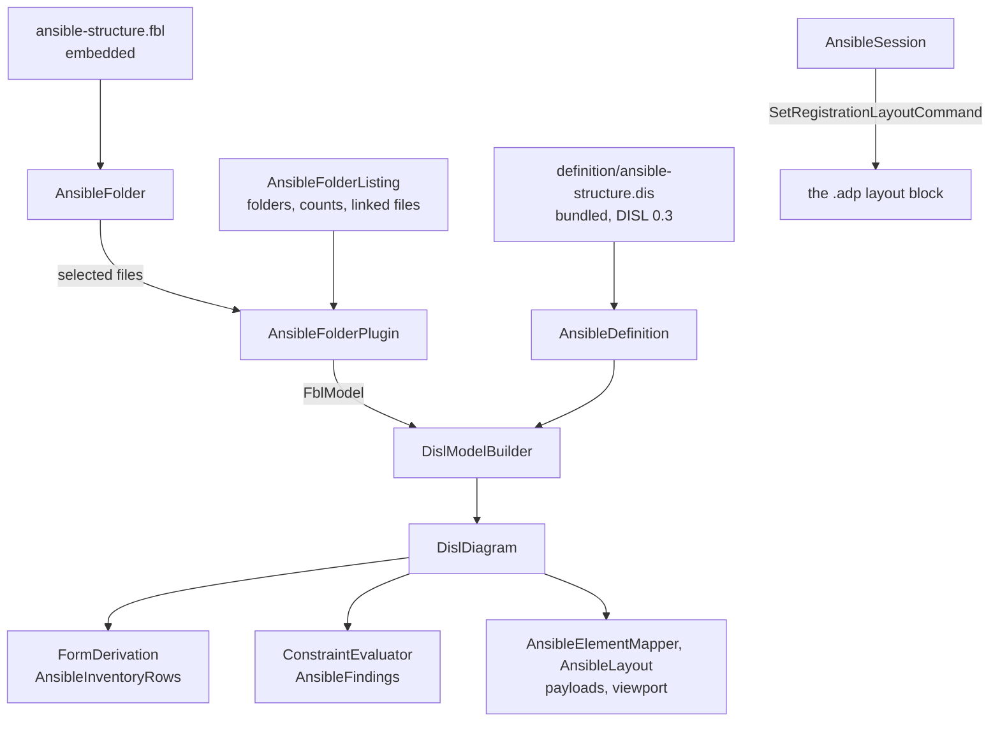

# Design Document

## Overview

The Ansible structure diagram is converted in **eleven steps, each one pull request, each held to one frozen transcript**. The transcript is generated from today's code first (step 1). Every later step replaces one hand-written part by its derived or bound equivalent and must reproduce the transcript byte for byte. Q2, Q3 and Q4 keep today's behaviour by default, so no step is expected to change the transcript at all.

The tool writes nothing but a position, so the conversion has three parts and no fourth: **derivation** (rows, findings, refusals: steps 4 and 5), **reading** (the binding, the plugin and the model: steps 6 and 7) and **the host's work around the reading** (selecting, watching, settling: steps 8 and 9). Derivation and reading never change in one step.

The module ends as four things that carry the conversion:

- `AnsibleDefinition`: the bundled DISL definition loaded once, and what is derived from it (rows, findings, the reparenting refusal), mapped to today's wire ids by its `x-ansible` block.
- `ansible-structure.fbl`: the module's binding, a folder body with a plugin reader.
- `AnsibleFolderPlugin`: `IPersistencePlugin.Read` over the files it is handed, wrapping today's reader, YAML and graph code.
- `AnsibleFolder`: one registered folder opened through the binding, giving the plugin's reading and the DISL model built from it.

Everything else is deleted, moved to the test project as the oracle, or kept with its reason (the table under *What remains*).

**One point of the approved requirements is proposed for a small amendment** before the tasks are written, in *Amendment proposed* below. It concerns Requirements 3.2 and 6.1 and changes no behaviour.

## Steering Document Alignment

### Technical Standards (tech.md)

- *Specifying a diagram type*: the definition lives in etalii-adp/etalii.adp and is bundled, never edited here. The binding is the module's own file, as the mind map's is, and the definition names it by URL.
- Every functional state change is a command: the tool keeps exactly one, core's `SetRegistrationLayoutCommand`, and gains none.
- The four gates, the transcript and "a test seen to fail first" are the checks of every step.

### Project Structure (structure.md)

- A diagram type adds declarations and no core code. What the libraries lack is added to `EtAlii.Adp.Specification.Disl` and `EtAlii.Adp.Specification.Fbl` for every tool (*Library work*), named for what it does.
- The module gains `definition/` (bundled) and one embedded `.fbl`; the test project gains `Parity/`.

## Code Reuse Analysis

### Existing Components to Leverage

- **`BundledDefinition`, `WireIdMap`, `FormDerivation`, `ConstraintEvaluator`, `DislModelBuilder`, `DislDiagram.AddNode` and `AddRelation`** (`EtAlii.Adp.Specification.Disl`). `DotNetDefinition.cs` is the model for `AnsibleDefinition`: a read-only tool whose rows come from `FormDerivation.Derive` with `DislEnv(ReadOnly: true)`, and whose model is first built element for element from the module's own graph. Read: `WireIdMap.Of` takes the keys `tools`, `actions`, `properties` and `types`. The drafted `x-ansible` block names its type map `elements`, which the library does not read; the definition states it as `types` (step 2).
- **`FolderSubject.Files`, `Glob`, `FblDocumentLoader`, `FblBinding.ReadOnly`, `IPersistencePlugin`, `PluginReadRequest`, `PluginFile`, `PluginReadResult`** (`EtAlii.Adp.Specification.Fbl`). `FolderSubject.Files` already selects by file rule and `ignore`, in ordinal order, never through a reparse point, so the plugin can be fed at step 6 before the library has a folder body.
- **`MindmapFreeplanePlugin.Elements(document)`**: the pattern of a plugin whose `Read` is "parse with the module's own reader, then map to `FblElement`", so that the module's reader is not rewritten.
- **The timeline's and the .NET dependency graph's `Parity/` folders** (`DotNetTranscript.cs`, `TranscriptText.cs`): the generator and the comparison are copied in shape. The .NET one is the nearer: a read-only tool with no edit script.
- **`SetRegistrationLayoutCommand` and `RegistrationLayout`** (core): positions are written as today. Nothing in this design calls `RegistrationLayout.Prune` (searched for `.Prune(` across `src/`: `ArrangeAbmCommand.cs` and one test only).
- **`parseDisl`, `compileNotation`, `NotationBindings`** (client library) and **`bundle-disl.sh`**.

### Integration Points

- **etalii-adp/etalii.adp**: `definitions/diagrams/ansible-structure.dis` and `.md` are rewritten there (step 2) through that repository's own pull request and checks. Step 3 cannot bundle before it is merged. The binding is offered to `specifications/fbl/` as an example at step 11, when it is final.
- **`helm-chart-disl-fbl`**: its Requirement 4 asks the library for the same folder body this specification's Requirement 8.1 does, and calls itself the first tool to need it. The item is shared and delivered once, as a pull request that changes the library only (step 8). Whichever specification reaches it first delivers it; the other starts from it. Neither requirements document rules on the order.
- **The validator seam**: `AnsibleValidator` keeps reading `DiagramValidationRequest.SubjectFolder` and rebasing each location from the folder to the project. It reads one-shot, without a watcher, as today.

## Architecture

### The steps

| Step | What changes | Held by | Depends on |
| --- | --- | --- | --- |
| 1 | The transcript, its generator, the fixtures of Requirement 1.2 and the test that today's code reproduces it. No product code changes. | Requirement 1 | Nothing |
| 2 | In etalii.adp: the definition at DISL 0.3 with `x-ansible`, `persistence.format: "fbl"`, the `derived` ids, an `optional` target in place of `UnresolvedTarget`, one refusal sentence; the companion rewritten. | Requirements 2.1 to 2.4, 9.1 | A pull request in etalii.adp |
| 3 | Library items D1 to D4. The definition bundled, embedded and loaded with no error; `BundledDefinition.Tests`. Nothing derives from it yet. | Requirements 2.5, 8.2, 8.3 | Step 2 merged |
| 4 | Rows and the reparenting refusal derived. The model is built from `AnsibleGraph` by a small adapter, as `DotNetDefinition.Build` does. The provider's logic moves to `Parity/HandWrittenAnsible.cs`; `AnsibleInventoryRows` appears. | Requirements 3.1, 3.4, 3.5, 3.6 | Step 3 |
| 5 | Findings derived by `ConstraintEvaluator` over the same adapter model. `AnsibleRuleSet` moves to the oracle; `AnsibleValidator` becomes a call; `AnsibleFindings` appears. | Requirements 3.2, 3.3, 3.5, 6.2 | Step 4 |
| 6 | The binding embedded. `AnsibleFolderPlugin` and `AnsibleFolderListing`. The reader reads handed files in place of the disk. The store selects with `FolderSubject.Files`, and the model is built by `DislModelBuilder` from the plugin's elements; the adapter of step 4 is deleted. The real-file check. The property refusal becomes the binding's `readOnly`. | Requirements 4.1 to 4.7, 5.1 | Step 5 |
| 7 | `AnsibleElementMapper`, `AnsibleLayout` and `AnsibleContextSourceResolver` read the DISL model. `AnsibleProject` and `AnsibleGraph` no longer leave the plugin. | Requirements 3.5, 6.1 | Step 6 |
| 8 | Library items F1 to F4: the folder body. No module changes. | Requirement 8.1, 8.3 | Shared with `helm-chart-disl-fbl` |
| 9 | `AnsibleFolder` over the library's folder body. `AnsibleProjectStore`, `IAnsibleProjectStore` and `AnsibleWatchedFolder` leave the product code; the session streams from `AnsibleFolder`. | Requirements 5, 6.2 | Steps 7 and 8 |
| 10 | Client library items C1 to C4. The client compiles its canvas definition; today's stays in a test as the oracle; the `tests.md` entry. | Requirement 7 | Step 3 |
| 11 | The companion's table of remaining classes, the binding example offered to etalii.adp, documentation, catalog, the delivery report. | Requirements 6.3, 9.3, 10 | Steps 9 and 10 |

Steps 4 and 5 derive against the old reading; steps 6 and 7 change the reading under an unchanged derivation; step 9 changes only who watches. A difference in the transcript therefore names one cause. Step 10 touches no backend file and may land any time after step 3.

### Modular Design Principles

- One concern per file: the definition's derivations, the plugin, the listing seam and each stand-in are separate classes.
- The provider and the validator hold no logic: each finds the folder and calls `AnsibleDefinition`.
- No module name enters a library; no library type is subclassed by the module.

## Components and Interfaces

### AnsibleDefinition

- **Purpose:** the bundled definition and what is derived from it.
- **Interfaces:** `Rows(diagram, elementId)`; `Findings(diagram, readerFindings)`; `MoveRefusal`; `Specification`.
- **Reuses:** the shape of `DotNetDefinition`, with `WireIdMap.Of(Specification, "x-ansible")`.
- **Ids.** The definition's `derived` expressions and the plugin's own ids must agree, and in this runtime the expressions win: `DislModelBuilder.Complete` overwrites the id of every element whose type has a `derived` rule. A test holds that the two are equal for every element of the corpus, so a wrong expression fails there and not in a stored position. The drafted `self.kind` is written `self.type`: read in `DislElement`, `kind` answers `relation` or `node` and `type` answers the type's name, which is `UsesRole`, `ImportsPlaybook`, `IncludesTasks`, `DependsOn` or `Targets`, the names of `AnsibleEdgeKind` that today's ids hold.
- **Refusals.** The reparenting sentence is the message of the definition's one remaining `prevent` rule and is read from it. The property refusal is `FblBinding.ReadOnly` from step 6 (until then the provider's constant stays); the definition does not repeat it (finding A6). The three refusals of `MoveElementToAsync` (no history, no registration, a relation) are the host's and stay in the session.

### AnsibleFolderPlugin and the reader

- **Purpose:** FBL's `read` for an Ansible folder (Q1's default).
- **Interfaces:** `Id` (`net.etalii.adp.ansible.folder`); `Read(PluginReadRequest)`; `Watch(last)`; `Plan` and `Template` throw, since a read-only binding's plugin is never asked.
- **How it reads:** `AnsibleProjectReader` keeps its recognition and its order (the root's playbooks, `playbooks/`, roles, inventories) and takes its input from two places in place of `Directory` and `File`: the handed `PluginFile` set, looked up by relative path, and `AnsibleFolderListing`. `AnsibleYaml` parses bytes with YamlDotNet as today. `AnsibleGraph.Derive` is unchanged. A static `Elements(project, graph)` maps to `FblElement`: nodes in graph order, then relations, each with its line, a relation that is missing or an expression with a null `Target` (finding B7; `FblElement.Target` is nullable).
- **What an element carries:** every fact a payload, a row or a rule reads today, as attributes the definition declares read-only. A playbook carries `plays` as a list of maps (`index`, `name`, `hosts`, `line`), because a single play is not drawn and still has a finding; the `unmatchedHosts` rule is a `forEach` over it and reads `item.name`, which repairs finding A7. An inventory carries `groups` and `variableFolders` as lists.
- **State:** none. The plugin holds the listing seam, which is a function of the folder and not a result.

### AnsibleFolderListing (the seam of Requirement 4.3)

- **Purpose:** what FBL's contract cannot hand a plugin: that a folder exists (gap 1, finding B2), how many files a folder holds without their bytes (gap 2, finding B3), and the bytes of a file that is a link, which `FolderSubject` never selects and the tool reads today (finding B11, Q2's default).
- **Interfaces:** `FolderExists(relative)`; `Folders(relative)`; `FileCount(relative)`; `LinkedFiles()`.
- **Why code:** two language gaps and one behaviour kept on purpose. It opens only linked files, through `SharedDocumentReader`, and never for writing. The plugin's `Watch` returns the folders it listed, which is what FBL 11.2 gives `watch` for, so a file added to `roles/x/templates/` re-reads the folder as today.

### The binding

The embedded binding is the appendix's draft with its four unsettled points closed:

- **The rules marked `x-folder` and `x-content` are not in it.** A host ignores an `x-` key, so `roleContents` and `variables` would select files whose bytes the folder body then reads, against the performance requirement. Those eight rules are recorded in the companion as the evidence of gaps 1 and 2, and the listing seam supplies what they stood for.
- **Each `*.y*ml` rule becomes two**, `*.yml` and `*.yaml`: a file rule has one glob and `Glob` has no alternation, so this is the only exact form, and the real-file check can then hold that every selected file is read.
- **`inventories/*/*` stays a superset**: the reader takes a file with no extension, which a glob cannot say. A fixture with `inventories/prod/notes.txt` holds that a passed-over file changes nothing.
- **`.git/**` stays ignored.** Today a change under `.git` re-reads the folder and yields the same model, so nothing a user sees changes.
- No rule has a `family` (finding B4): the plugin parses, and an INI inventory raises nothing.

### AnsibleFindings (the hand-off of Requirement 3.3)

- **Purpose:** the findings as the host receives them.
- **Interfaces:** `For(findings)` returns `DiagramProblem`s.
- **What it does that DISL cannot:** it puts the findings in today's order (gap 8: unreadable files, then missing targets in relation order across two codes, then unmatched hosts, then empty roles), found by each finding's element id; it composes the sentence of `ansible.unreadable-yaml` from the finding's file and its `reason` (gap 6); and it passes on a `std.unparseable` only when it names a file of the folder, so a folder that is not there opens empty with no finding (finding B5, Q2).

### AnsibleFolder, the session and the client

- **`AnsibleFolder`** (step 9) wraps the library's folder body for one registered folder: `Model` (FBL), `Disl`, `Changed`, and the claim counting the store has today, since two sessions may share one folder.
- **`AnsibleSession`** keeps `Baseline`, `UpdateView` and both moves. It reads stored positions with `RegistrationLayout.Read` per render, as today.
- **The client:** `AnsibleCanvas.tsx` imports the bundled `.dis` with `?raw`, and `compileNotation(parseDisl(text), ANSIBLE_BINDINGS)` replaces the hand-written definition. Revealing a file on double-click, Enter and Space stays a handler in the module, named in the companion as standing in for gap 9.

## Library work (Requirement 8)

Each item is added with a test seen to fail first. The DISL list is a reading of the libraries and is **confirmed by loading the rewritten definition at the start of step 3**: the loader names every construct it refuses, and that output replaces D4.

| # | Library | What | Evidence |
| --- | --- | --- | --- |
| D1 | Disl | A file on `DislFinding`, on `DislReaderFinding` and on `DislElement`, beside the line. | Finding A16. Read: all three have `Line` and no file. |
| D2 | Disl | `ConstraintEvaluator` evaluates a rule's `location`. | Searched for `"location"` in `EtAlii.Adp.Specification.Disl`: `Loading/DislExpressionWalker.cs` only. |
| D3 | Disl | The duplicate found while computing `derived` ids honours the definition's `std.duplicateId` setting. | Read: `DislModelBuilder.DerivedIds` adds the finding unconditionally. Q3's default switches the built-in off, and finding A15's two relations would still be reported through the model. |
| D4 | Disl | Whatever else the load refuses. Already present and not listed: `forEach` on a rule, `constraints.order`, `readOnlyReasons`, a computed `code`, an `optional` target, `distinct` (in `EtAlii.Adp.Specification.Cel`, `CelLists`). | Step 3's load |
| F1 | Fbl | A folder body read by a plugin: selects with `FolderSubject`, reads each file shared and read-only, hands the files over in one `read`, refuses every change with the binding's `readOnly`, and never asks for a plan. | Finding B8. `PluginBody` hands one file with an empty path. |
| F2 | Fbl | Watching and settling: the files read, the folders a glob could add to, the paths `Watch` returns and the registration it was opened with; one read after `settle` milliseconds of quiet. `settle` is loaded from the binding. | Searched for `settle` and for `FileSystemWatcher` in `EtAlii.Adp.Specification.Fbl`: none. `IPersistencePlugin.Watch` has no caller. |
| F3 | Fbl | A file on `FblElement`, as `SourceLocation` has one. | Finding B8 |
| F4 | Fbl | A file the host cannot open is a finding at that file with the reason, and the rest is read. | FBL 10.3. Today's reader reports it with the exception's message. |
| C1 to C4 | Client | In `compileNotation`: an edge end drawn as a stub; a dash per edge type; a colour mixed by index; the empty-canvas message. The backward bezier stays a route in `NotationBindings`, which the library already provides for. | Searched for `stub`, `dash`, `mix` and `"empty"` in `compileNotation.ts` and `disTypes.ts`: none. |

F1 to F4 name no tool and are the same items `helm-chart-disl-fbl` needs. Nothing in the list repairs a language gap: the folder body reads files and bytes exactly as FBL 10.2 says, and what FBL lacks stays in the module's seam.

## Data Models

### What the plugin delivers and the metamodel

| Delivered type | Id | Notes |
| --- | --- | --- |
| `Playbook`, `Play`, `Role`, `TaskFile`, `Inventory`, `VariableFolder` | The prefix and path or name of today (`play:` with the playbook's path, `#` and the index) | The metamodel's own names, so no `typeMap`. A `Play` is delivered only where the graph has one. |
| `UsesRole`, `ImportsPlaybook`, `IncludesTasks`, `DependsOn` | `edge:`, the source id, the type and the target as written, joined by a vertical bar | `resolution` is `resolved`, `missing` or `expression`; `declaredIn` and the line locate it. |
| `Targets` | As above, with the inventory's id added | Always resolved. |

Six of the 34 stored positions hold a `/` in their key; the definition's widened id `pattern` admits them, and the real-file check holds every key against an element.

### The transcript

One JSON file, `Parity/ansible-structure.transcript.json`, shaped as the .NET dependency graph's: `module`, `generator`, `regenerate`, `toolbox` (the empty answer), `refusals` (the five sentences) and `folders`. Per folder: `payloads` in delivery order with an unbounded viewport, `rows` (every node, every relation and an unknown id), `findings` (code, severity, sentence, file, line, in order) and `selection` (text and path of every element). Folders git cannot hold (an empty role, an empty `meta/`, a link) are built in a temporary folder by the generator and recorded under a fixed name, so the file holds no machine path.

## Amendment proposed

Requirement 3.2 says the five findings are derived by `ConstraintEvaluator` "with the tool's codes, severities, sentences, files, lines and order". Finding A8 of the same document records that DISL cannot state the sentence of `ansible.unreadable-yaml`: `std.unparseable` gives its message one detail, `reason`, and the tool's sentence opens with the file's path. Requirement 3.3 allows a stand-in for the order and 3.1 for the inventory rows, but no criterion allows one for this sentence, and Requirement 6.1 lists the stand-ins "of Requirements 3.1, 3.3 and 4.3" only. As written, 3.2 and the usability requirement (every sentence read unchanged) cannot both hold.

The amendment, to be put to the user as a selection before the tasks card:

- **(recommended) 3.2 gains a clause**, "WHERE DISL cannot state the sentence of `ansible.unreadable-yaml` (finding A8) THEN it SHALL be composed by the code that hands the findings to the host, named as standing in for the gap", and 6.1 names the stand-in of 3.2. It costs one sentence in each and keeps every word a user reads. Recommended because it is what 3.3 already does for the order, in the same class.
- **The sentence becomes DISL's**: the reason alone, with the path in the finding's location. No stand-in, and a change every user of a broken file sees, named in the transcript's diff.
- **Other.**

This design is written against the first: `AnsibleFindings` composes the sentence.

## What waits, and on what

| What | Waits on | Until then |
| --- | --- | --- |
| Folders and uncounted files through the binding (gaps 1 and 2) | FBL: a file rule for a folder, and one that yields a path without bytes | `AnsibleFolderListing` |
| The rows of an inventory (gap 7) | DISL: `forEach` on a form item | `AnsibleInventoryRows` |
| Sentence and order of findings (gaps 6 and 8) | DISL: a file in `std.unparseable`'s detail; an order by file | `AnsibleFindings` |
| Revealing a file, and a second shortcut (gap 9) | DISL: an action that opens an element's source | The handler in `AnsibleCanvas.tsx` |
| The ranked layout (gap 10) | DISL D.2, open question 9 | `AnsibleLayout`, declared as the plugin's layout |
| `family` under a plugin, reading order, a relation without a target (gaps 3 and 4) | FBL's text | The binding states no `family`; the plugin's order is kept; the library already allows a null target |
| Stale entries while a file is unreadable (gap 5) | FBL 8.5 | Positions are written by core, which removes nothing |
| A missing folder as a finding, a link not read, repeated ids told apart, the seven quirks | Q2, Q3 and Q4: each a later change of its own, with a test seen to fail first | Today's behaviour, each in the transcript |

## Error Handling

### Error Scenarios

1. **The bundled definition or the binding does not load.**
   - **Handling:** `AnsibleDefinition` throws on first use with the loader's diagnostics; `BundledDefinition.Tests` fails in the gate.
   - **User Impact:** none in a released build.

2. **A file of the folder does not parse.**
   - **Handling:** the plugin reports it once, at YamlDotNet's line, and reads the rest; an inventory that is not YAML is read as INI and reported by nothing.
   - **User Impact:** today's `ansible.unreadable-yaml` and sentence; only that file's detail is missing.

3. **A file cannot be opened** (locked, or removed between the listing and the read).
   - **Handling:** item F4 reports it at that file with the reason; `AnsibleFindings` words it as today.
   - **User Impact:** today's finding, and the folder re-reads when the file settles.

4. **The folder is not there, or holds nothing Ansible.**
   - **Handling:** `recognise` is empty; the model is empty; the folder-level finding is not passed on.
   - **User Impact:** today's empty-canvas sentence, from the definition's `canvas.empty`, and no finding.

5. **A property write or a move.**
   - **Handling:** refused with the binding's `readOnly`, the definition's reparenting sentence, or one of the session's three.
   - **User Impact:** the five sentences shown today.

6. **The transcript differs after a step.**
   - **Handling:** the step is not delivered. No difference is expected under the defaults of Q2 to Q4, so any difference is a regression.
   - **User Impact:** none.

## Testing Strategy

### Unit Testing

- Library: one test class per item D1 to D3 and F1 to F4, each seen to fail before its change. F2 has a burst of saves answered by one read, a file added to a folder `Watch` named, and a registration write.
- `AnsibleFolderPlugin`: the same bytes give the same elements; nothing is opened (a handed file set with no disk behind it); `Plan` is never reached.
- `AnsibleFolderListing`, `AnsibleFindings`, `AnsibleInventoryRows`: each stand-in against the case its gap names.
- `BundledDefinition.Tests`: the embedded bytes equal `definition/`, the recorded sha256 holds, the definition loads with no error, and each derived id equals the plugin's.

### Integration Testing

- **The transcript test** is the main one, seen to fail at step 1 against a deliberately changed sentence.
- **Derived against hand-written**, per kind (rows, findings), comparing `AnsibleDefinition` with `HandWrittenAnsible` over the corpus, so a difference names the folder and the element.
- **One fixture per finding marked Read** (Requirement 1.2): A5 two playbooks with a first play each; A7 a play named `play the fool`; A8 and A12 unreadable files in two folders; A15 a role named twice; B2 an empty role and an empty `meta/`; B3 a role with a large binary under `files/`; B4 an INI `hosts` and a broken `hosts.yml`; B5 a missing folder; B6 `playbooks/` sorting before a root playbook; B7 a missing and an expression target; B9 a position whose playbook is half-saved; B11 a linked file and a linked folder; and each quirk of B12.
- **The real-file check** (Requirement 4.7) reads every registered folder under `src/` through the binding and the plugin and compares ids per type with `AnsibleGraph` derived by today's disk reader, kept in `Parity/` for that purpose, so the plugin is not compared with itself. It holds that all 34 stored positions name an element and that every selected file was read.
- `ZeroWrites.Tests` runs unchanged at every step. The store's tests move to the folder body's at step 9; each is accounted for in the tasks.

### End-to-End Testing

- The `tests.md` entry of Requirement 7.4, in a real browser, in both themes.
- A newly created worktree is built before the gates are trusted, at steps 3, 6 and 10, because each changes what is embedded or imported.

## What remains in the module, and why

| Class | Stays because |
| --- | --- |
| `AnsibleFolderPlugin`, `AnsibleProjectReader`, `AnsibleYaml`, `AnsibleGraph` and their `_Model` records | FBL 11.5: reading an Ansible folder is a plugin (finding B1). |
| `AnsibleFolderListing` | Gaps 1 and 2, and the linked file of Q2. |
| `AnsibleFindings`, `AnsibleInventoryRows` | Gaps 6, 7 and 8. |
| `AnsibleLayout`, `AnsibleMetrics`, `AnsibleBox` | Gap 10; the definition names the layout as the plugin's. |
| `AnsibleElementMapper`, `AnsibleContextSourceResolver` | Payloads, the viewport filter and selection are the host's wire. |
| `AnsibleDefinition`, `AnsibleFolder`, `AnsibleSession`, `AnsibleSessionFactory`, `AnsibleNodeSubscription`, `Diagram` | The definition, the opened subject and the session seam. |
| `AnsibleValidator`, `AnsibleContextPropertyProvider` | Core's seams, each a call into `AnsibleDefinition`. `AnsibleRules` goes with the rule set: the codes are the definition's. |

## Requirement Coverage

| Requirement | Where |
| --- | --- |
| 1 | Step 1; *The transcript*; Testing Strategy (the fixtures) |
| 2 | Steps 2 and 3; *AnsibleDefinition* |
| 3 | Steps 4 and 5; *AnsibleDefinition*, *AnsibleFindings*; *Amendment proposed* |
| 4 | Step 6; *AnsibleFolderPlugin*, *AnsibleFolderListing*, *The binding*; the real-file check |
| 5 | Steps 6 and 9; *AnsibleFolder, the session and the client*; `ZeroWrites.Tests` |
| 6 | Steps 5, 7, 9 and 11; *What remains in the module* |
| 7 | Step 10; items C1 to C4; End-to-End Testing |
| 8 | Steps 3 and 8; *Library work* |
| 9 | Steps 2 and 11; *What waits, and on what*; the companion |
| 10 | Step 11; End-to-End Testing (the fresh worktree) |
| Non-functional | *The binding* (no counted file is read); Error scenarios 2 to 4; the house rules in every step's gates |
