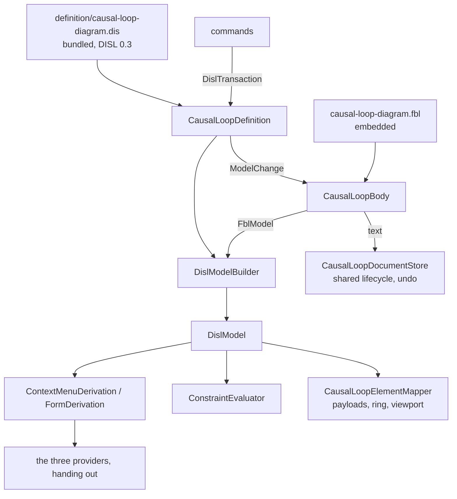

# Design Document

## Overview

The causal loop diagram is converted in **eight steps, each one pull request, each held to one frozen transcript**. Nothing is switched over in one move: the transcript is generated from today's hand-written code first (step 1), and every later step replaces one hand-written part by its derived or bound equivalent and must reproduce the transcript byte for byte, except where the requirements name a change (Q1: the hunks of an edit; nothing else, since Q2, Q3 and Q4 keep today's behaviour by default).

The module ends in the shape the hype cycle graph has today. Two classes carry the conversion:

- `CausalLoopDefinition`: the bundled DISL definition loaded once, and what the providers derive from it (palette, menus, rows), mapped to today's wire ids by its `x-cld` block.
- `CausalLoopBody`: one `.cld` body opened through the module's FBL binding, giving the binding's reading, the DISL model built from it, and `Change(ModelChange)`.

Everything else is either deleted, moved to the test project as the oracle, or kept as host code with its reason (the table under *What remains*).

**One point of the approved requirements is proposed for a small amendment** before the tasks are written, in *Amendment proposed* below. It concerns Requirement 6.2 and changes no behaviour.

## Steering Document Alignment

### Technical Standards (tech.md)

- *Specifying a diagram type*: the definition lives in etalii-adp/etalii.adp and is bundled, never edited here. The binding is the module's own file, as the hype cycle's is, and the definition names it by URL.
- Splices, never reserialization: today's rule for the writer becomes FBL's rule, which is stricter (a value's span, not a line).
- The four gates, the transcript and "a test seen to fail first" are the checks of every step.

### Project Structure (structure.md)

- A diagram type adds declarations and no core code. What the libraries lack is added to `EtAlii.Adp.Specification.Disl` for every tool (Library work), named for what it does.
- The module gains `definition/` (bundled) and one embedded `.fbl`; the test project gains `Parity/`.

## Code Reuse Analysis

### Existing Components to Leverage

- **`BundledDefinition`, `WireIdMap`, `ToolboxDerivation`, `ContextMenuDerivation`, `FormDerivation`, `ConstraintEvaluator`, `GestureConstraintEvaluator`, `OperationInterpreter`, `HookRunner`, `DislModelBuilder`, `DislWrite`** (`EtAlii.Adp.Specification.Disl`): used as the hype cycle uses them. `GhgDefinition.cs` is the model for `CausalLoopDefinition`.
- **`OpenBody`, `FblDocumentLoader`, `ModelChange`, `PlanResult`** (`EtAlii.Adp.Specification.Fbl`): used as `GhgBody.cs` uses them, including its cache of recently read bodies and its batch of changes for one edit.
- **The timeline's `Parity/` folder** (`TimelineTranscript.cs`, `TranscriptText.cs`): the generator and the comparison are copied in shape; the script of edits is this tool's own.
- **`RestoreDocumentCommand`** and the shared document lifecycle: undo stays the host's, restoring text.
- **`SetRegistrationLayoutCommand` and `RegistrationLayout`** (core): positions are written as today.
- **`parseDisl`, `compileNotation`, `NotationBindings`** (client library): the canvas definition is compiled as the six converted modules compile theirs.
- **`bundle-disl.sh`**: bundles the one definition.

### Integration Points

- **etalii-adp/etalii.adp**: `definitions/diagrams/causal-loop-diagram.dis` and `.md` are rewritten there (step 2), through that repository's own pull request and checks. This specification depends on that pull request being merged before step 3 can bundle it.
- **`EtAlii.Adp.Specification.Fbl.Tests`**: the vendored example binding is not edited. The `cld` entries of `RealFiles/divergences.json` are held against that vendored example, so they go only when the example in etalii.adp is brought in line with the module's binding (part of the step 2 pull request there) and vendored again here (step 5). That is how Requirement 6.1's last clause is met; until then the entries stay, because they still occur.

## Architecture

### The steps

| Step | What changes | Held by |
| --- | --- | --- |
| 1 | The transcript, its generator, the new fixtures of Requirement 1.2 and the test that today's code reproduces it. No product code changes. | Requirement 1 |
| 2 | In etalii.adp: the definition at DISL 0.3 with `x-cld`, `typeMap` and `persistence.format: "fbl"`; the companion rewritten. | Requirement 2.1 to 2.3 |
| 3 | Library work L1 to L4. The definition bundled and loaded with no error; `BundledDefinition.Tests`. Nothing derives from it yet. | Requirements 2.4, 2.5, 9 |
| 4 | Toolbox, menus and rows derived; the providers hand out. The hand-written logic moves to `Parity/HandWrittenCausalLoop.cs`. The model is still built from `CausalLoopParser` at this step, through a small adapter, so that derivation is proven before reading changes. | Requirement 3.1, 3.2, 3.4, 3.5 |
| 5 | The binding embedded; `CausalLoopBody`; the model built by `DislModelBuilder` from FBL's reading; the adapter of step 4 deleted. Findings derived by `ConstraintEvaluator`; `CausalLoopValidator` becomes a call to it. | Requirements 3.3, 4 |
| 6 | Every command writes through `CausalLoopBody.Change`. `CausalLoopWriter` and `CausalLoopParser` leave the product code. The transcript's edit hunks are regenerated once (Q1) and the diff reviewed. | Requirements 5, 7.2 |
| 7 | The client compiles its canvas definition; today's stays in a test as the oracle; `tests.md` entry. | Requirement 8 |
| 8 | `CycleFinder` replaced by the library's `diagram.cycles` where the corpus shows equal results; the companion's table of remaining classes; documentation and catalog. | Requirements 7.3, 7.4, 10, 11 |

Steps 4 and 5 are separate on purpose. If derivation and reading changed together, a difference in the transcript could not be attributed to either.

### Modular Design Principles

- One concern per file: the definition's derivations, the body, the stand-in for unreadable lines, the mapper and the layouts are separate classes.
- The providers hold no logic: each is a few lines that find the entry and call `CausalLoopDefinition`.
- No module name enters a library; no library type is subclassed by the module.

## Components and Interfaces

### CausalLoopDefinition

- **Purpose:** the bundled definition and what is derived from it.
- **Interfaces:** `Toolbox`; `Menus(entry, elementId)`; `Rows(entry, elementId)`; `ElementOf(diagram, wireId)`; `Apply(body, transaction)`; `Findings(body)`.
- **Dependencies:** `EtAlii.Adp.Specification.Disl`.
- **Reuses:** the shape of `GhgDefinition`.
- **Wire ids.** An element is found by today's wire id: `variable:` and the name, `link:` and both ends joined by `|`, `loop:` and the identifier. The definition's `persistence.ids` states them (`strategy: "natural"` with a `prefix` per type), so the model's ids are the wire ids and the registration's `layout:` keys, and no id is computed in module code (Requirement 4.5, 6.1).
- **A menu target** is an element, the empty canvas, a placement or a connect gesture, parsed from the gesture id as today.

### CausalLoopBody

- **Purpose:** one `.cld` body, read and written through the binding.
- **Interfaces:** `Parse(text)`; `Text`; `Model` (FBL); `Disl` (the DISL model); `Change(ModelChange)`; `Batch(Action)`.
- **Dependencies:** `EtAlii.Adp.Specification.Fbl`, `CausalLoopDefinition.Specification`.
- **Reuses:** `GhgBody` almost line for line. The cache of recent bodies and the batch are kept: drawing a link that closes loops is several changes in one edit (Requirement 5.5), and the validator, a command and an undo each read the same text.

### CausalLoopUnreadable (the stand-in of Requirement 4.4)

- **Purpose:** the tool's own sentence for a statement the binding does not read (finding B2).
- **Interfaces:** `SentenceFor(string statement)` returns one of today's four sentences.
- **How it is reached:** the binding ends with a rule of binding type `Unreadable` that matches any statement no earlier rule took; `typeMap` maps it `as: "unreadable"`, so DISL reports it by `std.unreadableEntry` under the code `causal-loop.unreadable-line` on its line. The module replaces that finding's message by `SentenceFor` of the statement's text. With that rule present, `unmatched` reports nothing, so no `fbl.unbound-statement` appears.
- **Why code:** FBL cannot say why a statement of a known keyword failed. The class is 30 lines, named in the companion as standing in for gap 1, and is deleted when FBL answers it.

### The providers, the validator and the commands

- **`CausalLoopToolboxProvider`, `CausalLoopContextActionProvider`, `CausalLoopContextPropertyProvider`:** hand out `CausalLoopDefinition.Toolbox`, `.Menus` and `.Rows`. Executing an action runs the definition's operation through `OperationInterpreter` and applies the transaction; the two actions the definition cannot run (Arrange diagram, and adding a variable at a point, which also writes a position) keep their handlers and are named in the companion.
- **`CausalLoopValidator`:** `CausalLoopDefinition.Findings(body)` mapped to `DiagramProblem`.
- **Commands:** each keeps its record and its handler's signature, so history and the wire are untouched. The handler body becomes: open the body, build a `DislTransaction` (or a `ModelChange` directly for a plain set), apply, store the text. `CausalLoopEdits` keeps the one place a command refuses an unreadable document.

### The client

- `CausalLoopCanvas.tsx` imports the bundled `.dis` with `?raw`, and `compileNotation(parseDisl(text), CLD_BINDINGS)` replaces the hand-written definition. `causalLoopArc.ts` stays: it is the geometry the library calls for a `curved` route, registered through `NotationBindings` until the library's own `curved` is shown to draw the same path, and then it goes too (Requirement 8.3).
- The weight ladder is the definition's CEL stroke width; `celPaths` maps it to the payload field the backend already computes.

## Library work (Requirement 9)

Each is added to `EtAlii.Adp.Specification.Disl` with a test seen to fail first. The list is a reading of the definition as drafted and is **confirmed by loading the rewritten definition at the start of step 3**: the loader names every function and construct it refuses, and that output replaces this list where they differ.

| # | What | Why |
| --- | --- | --- |
| L1 | `diagram.cycles(relType, max)` and `diagram.cyclesTruncated(relType, max)`, as DISL 12.4: elementary cycles, each in loop order starting at its first member in model order, ordered by first member and then by member order, a self-loop a cycle of one, never more than `max`. Johnson's algorithm, moved from the module's `CycleFinder` and generalised. | Finding A6. Five of the seven findings and the connect hook need it. |
| L2 | The CEL helpers the definition calls and the library lacks. From the draft: `lists.range`, `sortBy`, `cel.bind`, `upperAscii`, `indexOf`, `join`, optional `first()`/`last()` with `orValue`. Each is checked against `EtAlii.Adp.Specification.Cel` first; only those missing are added, there. | Finding A6 |
| L3 | Whatever `ConstraintEvaluator` lacks for a diagram-scoped rule with `forEach` over a list of lists, a `target` of `item`, and a finding without a line. | Requirement 3.3 |
| L4 | Whatever `ToolboxDerivation` lacks for a tool with `drop.targets` naming a node type and a `refusal` elsewhere. | Requirement 3.1, "Drop a link or a loop onto a variable." |

L1 is compared with `CycleFinder` over the corpus before the module's finder is removed (step 8). If the orders differ on any document, the module's finder stays, declared as the definition's plugin function, and the difference is recorded as a finding for etalii.adp.

## Data Models

### The binding's reading and the metamodel

| Binding type | Becomes | Notes |
| --- | --- | --- |
| `Header` | `header` | Any statement whose first word is `causal-loop`. Read as an entry so that a missing or repeated one raises nothing (Q4). |
| `Variable` | `Variable` | `name`, `label`. |
| `Link` | relation `CausalLink` | `from` and `to` are reference attributes mapped to `source` and `target`, so a link with an end that names nothing is kept, not drawn, and reported (finding B3). |
| `Loop` | `Loop` | `identifier`, `title`, `members` (a list of references). |
| `Unreadable` | `unreadable` | The catch-all above. |

`std.duplicateId` is switched off in the definition (Q4, finding A7): two variables of one name are both read, as today, and the first is the one an edit finds.

### The transcript

One JSON file, `Parity/causal-loop.transcript.json`, shaped as the timeline's: `module`, `generator`, `regenerate`, `toolbox`, `documents`. Per document: `menus` (every element id, the canvas, a placement, a connect gesture, an unknown id), `rows`, `findings`, `payloads`, and `edits` (a script of every command once, with each step's answer and the hunks it made). A read-only variant is recorded for a document that cannot be read. The loop identifiers an edit mints are deterministic, so nothing is masked.

## Amendment proposed

Requirement 6.2 says a move and Arrange diagram write the registration "through the library's registration writer". No module does: a search of `src/diagrams` and the core projects finds no caller of the FBL library's registration classes, and this module writes positions through core's `SetRegistrationLayoutCommand` and `RegistrationLayout` today. Using FBL's registration writer here alone would also bring FBL 8.5's pruning of stale entries, which today nothing does for this tool.

The amendment, to be put to the user as a selection before the tasks card: **6.2 reads "through core's `SetRegistrationLayoutCommand` and `RegistrationLayout`, as today"** (recommended), or the requirement stands and this design adds a step that moves the module to FBL's writer with pruning ruled on separately. This design is written against the first.

## Error Handling

### Error Scenarios

1. **The bundled definition does not load.**
   - **Handling:** `CausalLoopDefinition` throws on first use with the loader's diagnostics; `BundledDefinition.Tests` fails in the gate, so it cannot ship.
   - **User Impact:** none in a released build.

2. **A body that cannot be read at all** (not UTF-8).
   - **Handling:** FBL opens it empty and read-only; every command is refused by `CausalLoopEdits`.
   - **User Impact:** today's sentence, "This causal loop diagram could not be read, so nothing can be edited until it is fixed."

3. **FBL refuses a change** (a name already declared, an unusable name, a duplicate on rename).
   - **Handling:** the definition's attribute rules refuse first with the tool's sentence (a `pattern` with a `message`, a `unique` with a refusal); a refusal that reaches FBL is mapped to the same sentence by its reason, and the transcript pins each.
   - **User Impact:** the sentence shown today; the document unchanged.

4. **A statement the binding does not read.**
   - **Handling:** kept byte for byte, reported once on its line (see `CausalLoopUnreadable`).
   - **User Impact:** today's finding and sentence.

5. **The transcript differs after a step.**
   - **Handling:** the step is not delivered. The difference is a regression unless it is an edit hunk at step 6 (Q1).
   - **User Impact:** none.

## Testing Strategy

### Unit Testing

- Library: one test class per item L1 to L4, each seen to fail before its change. L1 has the cases of DISL 12.4 (a self-loop, two cycles sharing a member, the bound, the order) and a comparison with `CycleFinder` over the corpus.
- `CausalLoopUnreadable`: each of the four sentences from its statement.
- `BundledDefinition.Tests`: the embedded bytes equal `definition/`, the recorded sha256 holds, the definition loads with no error.

### Integration Testing

- **The transcript test** is the main one: every step must reproduce the checked-in file byte for byte. It is seen to fail at step 1 against a deliberately changed sentence.
- **Derived against hand-written**, per kind, as the hype cycle's `Parity/` has: menus, rows, findings, operations, each comparing `CausalLoopDefinition` with `HandWrittenCausalLoop` over the corpus, so a difference names the document and the element.
- **One fixture per finding** of table B and A7 (Requirement 1.2): `lenient-spellings.cld`, `dangling-link.cld`, `duplicate-variable.cld`, `no-header.cld`, `header-twice.cld`, `trailing-comments.cld`, `weight-forms.cld`, `two-notes.cld`, `label-with-quote.cld`, and an edit script over `spellings-kept.cld` for B5 and B6.
- **Round trip:** every document of the corpus read and saved without a change gives no splice and the same bytes; every edit undone restores the bytes.
- The existing store, session and reload tests stay and pass unchanged; the parser's, writer's and validator's own tests move with their subjects to the oracle or are replaced by the transcript, each accounted for in the tasks.

### End-to-End Testing

- The `tests.md` entry of Requirement 8.4, in a real browser, in both themes.
- A newly created worktree is built before the gates are trusted, at steps 3 and 7, because both change what is embedded or imported from `definition/`.

## What remains in the module, and why

| Class | Stays because |
| --- | --- |
| `SelfOrganizingLayout`, `ArrangeCausalLoopCommand` | The definition names the layout as a plugin. |
| `CausalLoopLayout` (the ring) | Language gap: DISL names `circular` and defines neither its order nor its radius (finding A9). |
| `CausalLoopElementMapper`, `CausalLoopMetrics`, `CausalLoopSelection` | Payloads, measured widths and the viewport filter are the host's wire. |
| `CausalLoopSession`, `CausalLoopDocumentStore`, the reloader, the factories | The shared document lifecycle. The document factory returns the binding's template. |
| `CausalLoopUnreadable` | Language gap 1 (finding B2). |
| `AddVariableAtCommand` | Writes a body change and a position as one undo step, which no single DISL operation does. |
| `CycleFinder`, `LoopPolarity` | Only if step 8 shows the library's cycles differ; otherwise deleted. `LoopPolarity` goes with the definition's functions at step 5. |

## Requirement Coverage

| Requirement | Where |
| --- | --- |
| 1 | Step 1; *The transcript*; Testing Strategy |
| 2 | Steps 2 and 3; *CausalLoopDefinition* |
| 3 | Steps 4 and 5; providers and validator |
| 4 | Step 5; *CausalLoopBody*, *CausalLoopUnreadable*, *The binding's reading* |
| 5 | Step 6; commands; Error scenarios 3 |
| 6 | *Wire ids*; *Amendment proposed* |
| 7 | Step 8; *What remains in the module* |
| 8 | Step 7; *The client* |
| 9 | Step 3; *Library work* |
| 10 | Steps 2 and 8; the companion; *Integration Points* |
| 11 | Step 8; Testing Strategy (the fresh worktree) |
