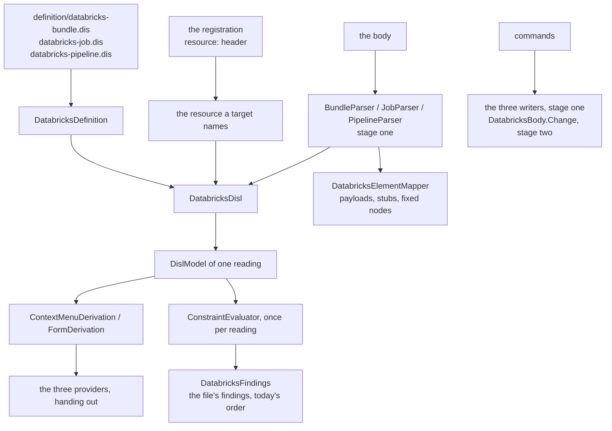

# Design Document

## Overview

The Databricks module is converted in **two stages, as Q2 rules by default**. Stage one is built now, in **eight steps, each one pull request, each held to one frozen transcript**: the three definitions at DISL 0.3, bundled; toolbox, menus, rows and findings derived from them; the three canvases compiled from them. In stage one the DISL model is built from the module's own readers, as the timeline's is, because FBL cannot yet serve three readings of one body (gaps 1 to 3). Stage two replaces the readers and the writers by one binding, and it is designed here only as far as its shape and what it waits on (*What waits, and on what*).

Nothing is switched over in one move. The transcript is generated from today's hand-written code first (step 1), and every later step replaces one hand-written part and must reproduce the transcript byte for byte, except where the requirements name a change (Q5 in step 2; Q1 in stage two; Q3 and Q4 keep today's behaviour by default).

Three classes carry stage one:

- `DatabricksDefinition`: the three bundled definitions, each loaded once, and what the providers derive from the one a target's origin names, mapped to today's wire ids by its `x-databricks` block.
- `DatabricksDisl`: the DISL model of one reading, built from what `BundleParser`, `JobParser` or `PipelineParser` read. It is the adapter stage two deletes.
- `DatabricksFindings`: the findings of the file, joined from the three definitions in today's order. It is the stand-in Q3 names.

**One point of the approved requirements is proposed for a small amendment** (*Amendment proposed*): Requirement 5.5, which changes no behaviour. **One finding is expected to be struck** under Requirement 10.4: A12, which a reading of `WireIdMap` shows does not occur.

## Steering Document Alignment

### Technical Standards (tech.md)

- *Specifying a diagram type*: the three definitions live in etalii-adp/etalii.adp and are bundled, never edited here. The binding of stage two is the module's own file, as the hype cycle's is.
- Splices, never reserialization: stage one keeps today's writers unchanged except for the three repairs of step 2; stage two makes FBL's stricter rule (a value's span, not a line) the module's.
- The four gates, the transcript and "a test seen to fail first" are the checks of every step.

### Project Structure (structure.md)

- A diagram type adds declarations and no core code. What the libraries lack is added to `EtAlii.Adp.Specification.Disl` for every tool, named for what it does. One core record gains one field (L5), named for what it carries and not for this module.
- The module gains `definition/` with three bundled definitions; the test project gains `Parity/`.

## Code Reuse Analysis

### Existing Components to Leverage

Each was opened and its members checked against what this design assumes.

- **`BundledDefinition.Load(assembly, logicalName, plugins)`** (`EtAlii.Adp.Specification.Disl`): reads the provenance as `<name>.provenance.json` beside the `.dis`, so three definitions embed in one assembly without a library change.
- **`WireIdMap`**: `ActionId` replaces a `<name>` in a mapped id by the entry's binding of that name when it is a string, and a `forEach` entry's `args` are among its bindings (`ContextMenuDerivation.Entry`). So `databricks.disconnect:<from>` with `args: { "from": "item.source.key" }` gives today's id with no library change. `PropertyId` maps a form item's `id`, else its attribute, else its label.
- **`ContextMenuDerivation`** (`forEach` with `as`, `visible`, `unavailable`), **`FormDerivation`** (a `computed` item with a literal `value` and `readOnlyReasons`, a `group`), **`ToolboxDerivation`**, **`DeletionPolicy.Confirmation`** (`count`, `when`, returning null when nothing is asked), **`ConstraintEvaluator`** (`forEach`, a computed `code`, `constraints.order`, `DislReaderFinding.NotParsed`), and `positionIn` on an element. `TimelineDefinition.cs` is the model for `DatabricksDefinition`.
- **`DislModelBuilder.From(FblModel, DislSpecification)`** fed with `FblElement` records made in module code: the pattern of `TimelineDisl.cs`, including its host attribute for the written id and its ephemeral model id for a second holder of one id.
- **`DislPluginFunctions`**: how a definition calls a function its host implements, as `TimelineTimes.Plugins()` does. It carries the stand-in for finding A11.
- **The timeline's and the hype cycle's `Parity/` folders** (`TimelineTranscript.cs`, `TranscriptText.cs`, `HandWrittenGhg.cs`, `GhgDerivedMenus.Tests.cs`): copied in shape.
- **`RestoreDocumentCommand`, `DatabricksEdits`, `SetRegistrationLayoutCommand`** (core): undo and positions stay as today.
- **`parseDisl`, `compileNotation`** (`src/client/src/canvas/library/disl/`): used as `TimelineCanvas.tsx` uses them, with a `?raw` import of the bundled file.

### Integration Points

- **etalii-adp/etalii.adp**: the three definitions and their companion pages are rewritten there (step 3), through that repository's own pull request. Step 4 cannot bundle before it is merged. The three drafts have not changed between `da64ff0`, which the requirements measured, and `e3c264f`, today's `develop` there.
- **`EtAlii.Adp.Specification.Fbl.Tests`**: `ModuleCrossCheck.Tests.cs` gains the Databricks comparison (Requirement 1.5). The test project references the timeline, causal loop, C4 and mindmap modules today and gains a reference to this one; the three parsers are `internal`, so the module's project gains an `InternalsVisibleTo` for it. The vendored example bindings are not edited.
- **`EtAlii.Adp.Context`**: `ContextTarget` gains `RegistrationPath` (L5), filled by `DatabricksContextSourceResolver`, which already holds `routed.RegistrationPath` and discards it.

## Architecture

### The steps

| Step | What changes | Held by | Depends on |
| --- | --- | --- | --- |
| 1 | The transcript, its generator, one new fixture per *Read* finding, the test that today's code reproduces it, and the Databricks comparison in `ModuleCrossCheck.Tests`. No product code changes but the `InternalsVisibleTo`. | Requirement 1 | Nothing |
| 2 | The module defects that today's code can repair, each behind a guard seen to fail first: B3 (L5, and the providers and commands read the registration's resource), B9 (a written value is quoted so that it reads back), B10 (a key is found among its entry's own keys only), B12 (an edit into a one-line collection is refused). The transcript is regenerated for these and the diff reviewed (Q5). | Requirements 5.2, 5.3, 6.4 | Step 1; the refusal sentence of B12 as a chat ruling |
| 3 | In etalii.adp: the three definitions at DISL 0.3 with `x-databricks`, the constructs of A2 and the cycle rule of A4; the companion pages rewritten. | Requirements 2.1, 2.2 | Nothing here |
| 4 | Library work L1 to L4. The three definitions bundled, embedded and loaded with no error; `BundledDefinition.Tests`. Nothing derives from them yet. | Requirements 2.3, 2.4, 9.1, 9.3 | Step 3 merged |
| 5 | `DatabricksDefinition` and `DatabricksDisl`. Toolboxes, menus, rows, the removal confirmation and the read-only reasons derived; the providers hand out. Their logic moves to `Parity/HandWrittenDatabricks.cs`. | Requirements 3.1, 3.2, 3.4, 3.5 | Steps 2 and 4 |
| 6 | Findings derived: `DatabricksFindings`; `DatabricksValidator` becomes a call to it; `DatabricksRuleSet` moves to the oracle. | Requirements 3.3, 3.4 | Step 5 |
| 7 | The client compiles three canvas definitions; `DatabricksCanvas.tsx` as it is today stays in a test as the oracle; the `tests.md` entry. | Requirements 8.1, 8.3 | Step 4 |
| 8 | The close of stage one: the companion pages' table of remaining classes, the gap reports, documentation and the catalog rows. | Requirements 7.3, 10, 11 | Steps 6 and 7 |

Steps 5 and 6 change what is derived and never what is read: the model comes from the same parsers before and after. Reading changes in stage two, alone, and writing after it, alone, so a difference in the transcript can always be attributed.

### Modular Design Principles

- One concern per file: the definitions' derivations, the adapter, the findings' join, the free-key function, the mapper and the three layouts are separate classes.
- The providers hold no logic: each finds the entry, asks the target's origin and registration which reading it is, and calls `DatabricksDefinition`.
- No module name enters a library; no library type is subclassed by the module.

## Components and Interfaces

### DatabricksDefinition

- **Purpose:** the three bundled definitions and what is derived from each.
- **Interfaces:** `Of(origin)` returns the reading's definition; on it `Toolbox`, `Menus(reading, elementId)`, `Rows(reading, elementId)`, `RemoveConfirmation(reading, elementId)`, `Findings(reading)`, `Command(reading, entry, target)`.
- **Dependencies:** `EtAlii.Adp.Specification.Disl`.
- **Reuses:** the shape of `TimelineDefinition`: a `Lazy` of `BundledDefinition.Load(assembly, "databricks-job.dis", plugins)` per origin, a `WireIdMap.Of(specification, "x-databricks")` each.
- **A menu target** is an element, a placement (`DatabricksNewPlacement`) or a connect gesture (`DatabricksRelationGesture`), parsed from the id as today.
- **Edits are mapped onto the module's commands**, as the timeline's are: a derived entry's id and arguments choose `RenameDatabricksTaskCommand`, `DisconnectDatabricksTasksCommand` and the rest, whose records and handlers do not change in stage one. The three simulated entries are derived for their label and id only; the provider answers them as a no-op by the `.simulated.` marker, as today.
- **The two rows every selection wears** are `computed` form items with a literal value and one read-only reason, mapped by their label to `databricks.workspace` and `databricks.last-simulated-run`.

### DatabricksDisl (the adapter of stage one)

- **Purpose:** the DISL model of one reading of one parsed file.
- **Interfaces:** `Of(entry, origin, resourceKey)` returns the model, built once per parsed entry and reading; `ElementOf(diagram, wireId)`.
- **Dependencies:** `DatabricksDocumentEntry`, `DislModelBuilder`.
- **Reuses:** `TimelineDisl` in shape.
- **Ids.** Every element is given today's wire id as its model id (`task:` and the key, `cluster:` and the key, `resource:` with kind and key, `target:`, `library:`, `unknown:`, and the fixed `bundle`, `pipeline`, `target`, `compute`, `notifications`), so Requirement 5.4 holds by construction and no registration is rewritten. A second task of one key gets an ephemeral model id and keeps its written key as a host attribute, so `std.duplicateId` stays off and the duplicate rule is the definition's own, by `positionIn`.
- **A dependency on a missing task** is a relation with no source and its written key kept as a host attribute. The built-in `std.references` reports it under `databricks.missing-task`. The drawn stub stays the mapper's (finding A9).
- **The fixed elements** (`bundle` when the file has no `bundle:` key, the pipeline's `target` and `compute`) are emitted whether or not the file has an entry for them, as the parsers' models hold them today. That is finding A10 made visible in one method, `Fixed`, named in the companion.

### DatabricksFindings (the stand-in of Q3)

- **Purpose:** every finding of the file, in today's order, whichever reading asked (findings A7 and A8).
- **Interfaces:** `Of(entry)` returns the problems; `Unparseable(reason, line)`.
- **How:** it evaluates the job definition once per job of the file, the bundle definition once, and the pipeline definition once per pipeline, and joins them in that order. Within a job it orders per task: the missing key, each missing upstream, the missing cluster; then the duplicates; then the circle.
- **Why code:** each definition sees one reading. The library has `constraints.order` (a list of codes, then the line of the element), which was read and does not give today's order: the key finding and the cluster finding stand on the task's line and the missing upstream on a later one, so the cluster would come first. The fixture of step 1 shows it, or A8 is struck.
- **The unreadable file** is `DislReaderFinding.NotParsed` with YamlDotNet's message as its reason, so the sentence keeps today's tail while the parsers stay (finding B7).

### DatabricksFreeKey (the stand-in of finding A11)

- **Purpose:** the first `<type>_<n>` no task of the job uses.
- **Interfaces:** one plugin function, registered through `DislPluginFunctions` and called by the definition's add operations.
- **Why code:** CEL has no range to search and `persistence.ids.suffix` does not make the first id `_1`. Deleted when DISL answers gap 9.

### The providers, the validator and the commands

- **`DatabricksToolboxProvider`, `DatabricksContextActionProvider`, `DatabricksContextPropertyProvider`:** hand out `Toolbox`, `Menus` and `Rows` of the reading the target names. The reading is `target.Origin` and the resource is `DatabricksHeaders.ReadResourceKey(target.RegistrationPath)`, where today five places take `FirstOrDefault()` (step 2).
- **`DatabricksValidator`:** `DatabricksFindings.Of(entry)` mapped to `DiagramProblem`, with a line location as today.
- **Commands:** unchanged in stage one, apart from the repairs of step 2 in the writers they call.

### The client

- `BundleCanvas.tsx`, `JobCanvas.tsx` and `PipelineCanvas.tsx` each import their bundled `.dis` with `?raw` and compile it with `compileNotation(parseDisl(text), bindings)`. What the three share (the stream hook, the simulation's class binding, the stub's look) stays in one module file.
- `useSimulatedRun.ts` stays, named as standing in for runtime gap A6. The definitions already declare the three `simulate` operations, so the swap is a client change only.

## Library work (Requirement 9)

Each item is added with a test seen to fail first. The list is **confirmed by loading the three rewritten definitions at the start of step 4**: the loader names every function and construct it refuses, and that output replaces this list where they differ.

| # | What | Why, and what was searched |
| --- | --- | --- |
| L1 | `inCycle(relType)` and `reachable(relType)` on a node, as DISL 12.2, with `successors` and `predecessors` if a rewritten definition calls them. Declared in `DislCelLibrary`, implemented in `DislElement`. | Finding A5. Searched `EtAlii.Adp.Specification.Disl` for `inCycle`, `reachable`, `successors`, `predecessors`: none; `DislCelLibrary` declares twelve methods. **Shared**: `causal-loop-disl-fbl`, `azure-devops-pipeline-disl-fbl`, `supply-chain-disl-fbl`, `rdf-disl-fbl` and `functional-decomposition-graph-disl-fbl` require graph functions too, and no requirements document says which delivers first. They are delivered once, by whichever specification reaches its library step first; the others then only add what is missing. |
| L2 | `bundle-disl.sh` takes an optional third argument, the definition's name. With it the script copies `definitions/diagrams/<name>.dis` and `.md` into the module's `definition/` and writes `<name>.provenance.json`. Without it nothing changes. | Finding A14. The script writes one `provenance.json` per folder today; `BundledDefinition.Load` already reads `<name>.provenance.json` as a logical name. |
| L3 | Whatever loading shows the derivations lack for A2. Read as present: `forEach` in menus and constraints, `positionIn`, a computed `code`, a confirmation's `count` and `when`, `computed` rows. Not yet shown by reading: an operation whose body is `simulate` loading without an error. | Requirement 9.1. Searched the project for `simulat`: the context name and the walker's frame for `simulations` only. |
| L4 | Nothing for finding A12. | `WireIdMap.Substitute` and `ContextMenuDerivation.Entry`, read. A parity test pins `databricks.disconnect:ingest`. |
| L5 | `ContextTarget.RegistrationPath`, a nullable string defaulting to null, in `EtAlii.Adp.Context`. | Finding B3. Searched `EtAlii.Adp.Context` for `RegistrationPath`: none. `Origin` was added to the record the same way, for the same reason. |

The cycle rule of A4 is `inCycle` on a task or on one it is `reachable` from. Step 4 compares it with `DatabricksRuleSet.CycleMembers` over the corpus, including a fixture with a duplicated key on a circle, which the module's finder never reports.

## Data Models

### What the adapter emits per reading

| Reading | Diagram attributes | Nodes | Relations |
| --- | --- | --- | --- |
| Job | `jobKey`, `name`, `schedule` | `Task` (`key`, `type`, `source`, `runIf`, `clusterKey`), `JobCluster` | `Dependency`, from the upstream task to the dependent one, with `outcome` |
| Bundle | none | `Bundle`, `Resource`, `Target`, `Include`, `Variable`, `Unknown` | `Override`, from a target to a resource |
| Pipeline | none | `Pipeline`, `Library`, `Target`, `Compute`, `Notifications` | `Flow` |

Every value is the text the parser kept (finding B4). The type names are those of the rewritten definitions and are fixed in step 3; the adapter follows them.

### Persistence in the three definitions

In stage one each definition says `persistence.format: "plugin:net.etalii.adp.databricks.files"`, the DISL 0.3 form of what the drafts say and what the tool does, as `dotnet-dependency-graph.dis` names its plugin. Finding A3 (`format: "fbl"`, `binding`, `typeMap`) is repaired with the binding in stage two: DISL 11.2 allows `typeMap` only beside a binding, and naming a binding that does not exist would state what the tool does not do (Requirement 10.2).

### The transcript

One JSON file, `Parity/databricks.transcript.json`, shaped as the timeline's. Per document **and per reading** (and per resource a registration could name): `menus`, `rows`, `findings`, `payloads` and `edits`. A document that does not parse records its read-only variant.

## Amendment proposed

Requirement 5.5 says a move writes the registration "through the library's registration writer". No module does: a search of `src/diagrams` and the core projects for `OpenRegistration` and `RegistrationDocument` finds no caller outside `EtAlii.Adp.Specification.Fbl`, and `DatabricksSession` dispatches core's `SetRegistrationLayoutCommand` today. The same sentence in `causal-loop-disl-fbl` (its 6.2) was amended by the chat ruling of 2026-10-09 to name core's command.

The amendment, to be put to the user as a selection:

- **5.5 reads "through core's `SetRegistrationLayoutCommand`, as today"** (recommended: it is what the tool does, it matches the ruling already made for the causal loop diagram, and FBL's own writer would bring the pruning of stale entries, which Q4 switches off).
- The requirement stands, and stage two adds a step that moves the module to FBL's registration writer, with pruning ruled on separately.
- Other.

This design is written against the first.

## What waits, and on what

| What | Waits on | Then |
| --- | --- | --- |
| The binding `databricks.fbl`, `DatabricksBody`, reading through FBL; the parsers, `DatabricksHeaders`, `DatabricksYaml` and `DatabricksDisl` leave (Requirements 4, 5.1, 5.4, 7.2) | Gaps 1, 2 and 3 answered in etalii-adp/etalii.adp, then implemented in `EtAlii.Adp.Specification.Fbl` with vendored conformance fixtures (Requirement 9.2). The library reads `registration.resource.capture` as one string today (`FblDocumentLoader`). | One step. Finding A3 is repaired in the definitions with it. The appendix draft of the requirements is its starting point. |
| Every command writes through `DatabricksBody.Change`; the three writers and `DatabricksSplices` leave; B11, B13, B15, B16 and the rest of B12; the transcript's edit hunks regenerated once (Requirements 6, Q1) | The step above, and gaps 4 to 7 for the parts that stay module code behind a named stand-in until answered | One step, after reading, never with it. |
| `persistence.ids.prefix` applied when a model is read | Searched `EtAlii.Adp.Specification.Disl` for `prefix`: one comment. Shared with `causal-loop-disl-fbl`, whose design relies on it. | Needed before the binding's natural ids can equal today's wire ids. |
| The removal of the two `registration-resource` entries of `divergences.json` | The example bindings in etalii.adp brought in line and vendored again | With the binding step. |
| The mock run, deploy and update as the definitions' `simulate` (Requirement 8.2) | A player for `simulate` in the client's canvas library. Searched `src/client/src/canvas/library` for `simulat`: a comment and a test. Shared, delivered once. | A client step; `useSimulatedRun.ts` leaves. |

Until the writers leave, B11 and B13 keep today's behaviour and the Reliability sentence "no edit leaves a file Databricks' tooling cannot read" is met by the refusals of step 2.

## Error Handling

### Error Scenarios

1. **A bundled definition does not load.**
   - **Handling:** `DatabricksDefinition` throws on first use with the loader's diagnostics; `BundledDefinition.Tests` fails in the gate for each of the three.
   - **User Impact:** none in a released build.

2. **A body that is not YAML or JSON.**
   - **Handling:** the parsers fail as today; `DatabricksFindings.Unparseable` reports `databricks.unparseable` at the parser's line; `DatabricksEdits` refuses every command.
   - **User Impact:** today's finding, and "This file does not parse, so nothing can be edited until it is fixed."

3. **A registration names a resource the file does not have.**
   - **Handling:** the reading is empty, as the session shows it today; menus and rows are empty; the findings are still the file's.
   - **User Impact:** as today on the canvas. The menus no longer act on the first resource (step 2).

4. **An edit into a collection written on one line** (finding B12).
   - **Handling:** the writer refuses before any splice, with the sentence ruled for step 2.
   - **User Impact:** a sentence in place of a broken file. This is a named change (Q5).

5. **A derived entry maps to no command.**
   - **Handling:** `DatabricksDefinition.Command` returns a refusal naming the operation, as `TimelineDefinition` does; the derived-against-hand-written tests catch it before delivery.
   - **User Impact:** none in a released build.

6. **The transcript differs after a step.**
   - **Handling:** the step is not delivered, unless the difference is one step 2 names.
   - **User Impact:** none.

## Testing Strategy

### Unit Testing

- Library: one test class per item L1 and L3, each seen to fail before its change. L1 has a circle, a task downstream of one, a self-dependency, and a relation type with subtypes.
- `DatabricksFreeKey`: the first free number after a removal (the collision of A11).
- `DatabricksFindings`: a file with two jobs and two pipelines opened under each reading gives the same list.
- `BundledDefinition.Tests`: for each of the three, the embedded bytes equal `definition/`, the recorded sha256 holds, and the definition loads with no error.

### Integration Testing

- **The transcript test** is the main one. It is seen to fail at step 1 against a deliberately changed sentence.
- **Derived against hand-written**, per kind and per reading, as the hype cycle's `Parity/` has: menus, rows, confirmation, findings.
- **One fixture per *Read* finding** (Requirement 1.2), among them `two-jobs-two-pipelines.yml`, `anchors-and-merge.yml`, `variables-in-typed-places.yml`, `settings-one-line.json`, `duplicate-key-on-a-circle.yml`, `for-each-before-key.yml` and `flow-collections.yml`. A finding whose fixture does not show it is struck (Requirement 10.4).
- **The guards of step 2**: each written against today's code and seen to fail there (the second pipeline's rows editing the first; a `run_if` of `[x` leaving the file unparseable; an inner `task_key` renamed; `tasks: []` appended to).
- **Round trip:** every document of the corpus saved without a change gives the same bytes; every edit undone restores them.
- The store, session, reloader and layout tests stay and pass unchanged.

### End-to-End Testing

- The `tests.md` entry of Requirement 8.3, in a real browser, in both themes.
- A newly created worktree is built before the gates are trusted at steps 4 and 7, because both change what is embedded or imported from `definition/`.

## What remains in the module, and why

| Class | Stays because |
| --- | --- |
| `DatabricksJobLayout`, `DatabricksBundleLayout`, `DatabricksPipelineLayout` | The definitions name each layout as a plugin (finding A15). |
| `DatabricksElementMapper`, `DatabricksSelection`, `api/databricks.proto` | Payloads and the viewport filter are the host's wire. The mapper also draws the stub of a missing task (gap 8, finding A9). |
| `DatabricksSession`, `DatabricksDocumentStore`, the reloader, the factories, `DatabricksGestures` | The shared document lifecycle and the stateless gesture ids. |
| `DatabricksFindings` | Gap 9 and finding A7 (Q3). |
| `DatabricksFreeKey` | Gap 9 (finding A11). |
| `DatabricksDisl` with its `Fixed` method | Stage one only (Q2); `Fixed` is gap 8 (finding A10). |
| The three parsers and writers, `DatabricksSplices`, `DatabricksHeaders`, `DatabricksYaml` | Stage one only (Q2, gaps 1 to 3). |
| `useSimulatedRun.ts` | Runtime gap A6. |

## Requirement Coverage

| Requirement | Where |
| --- | --- |
| 1 | Step 1; *The transcript*; Testing Strategy; *Integration Points* (1.5) |
| 2 | Steps 3 and 4; L2; *Persistence in the three definitions* |
| 3 | Steps 5 and 6; *DatabricksDefinition*, *DatabricksFindings*, the providers |
| 4 | *What waits* (the binding step); 4.3 to 4.5 hold in stage one through the parsers and *DatabricksDisl* |
| 5 | Step 2 (5.2, 5.3); *Ids* (5.4); *What waits* (5.1's divergences); *Amendment proposed* (5.5) |
| 6 | Step 2 (6.4, for B9, B10 and B12); *What waits* (the writing step) for the rest |
| 7 | Step 8; *What remains in the module* |
| 8 | Step 7; *The client*; *What waits* (8.2) |
| 9 | Step 4; *Library work*; *What waits* (9.2) |
| 10 | Steps 3 and 8; the stand-ins named above; L4 and *DatabricksFindings* for the strikes of 10.4 |
| 11 | Step 8; Testing Strategy (the fresh worktree) |
