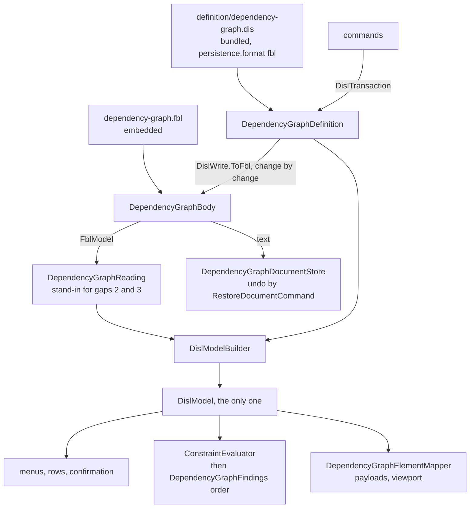

# Design Document

## Overview

The dependency graph is half converted: its toolbox, menus, rows and findings are derived from the bundled DISL definition, and `Parity/dependency-graph.transcript.json` holds them. This design converts the other half, the body, in **nine steps, each one pull request, each held to that transcript**. A step reproduces the transcript byte for byte, except for the changes the requirements name (Q1, Q2, Q4, Q5), each regenerated on purpose and reviewed as a diff.

**The steps fall in two groups, because Q3 stands at its default** ("report the gap and wait"). Steps 1 to 4 need nothing from the languages and are built now: the fixtures, the proof of every finding, two repairs in the shared libraries, and undo through the host's restore command. Steps 5 to 9 wait for one language change in etalii-adp/etalii.adp, a slot that reads a YAML scalar as written (gap 1, finding B1). The section *What waits, and on what* says so in one place.

The module ends in the shape the hype cycle graph has today. Two classes carry it:

- `DependencyGraphDefinition`, which exists and loses its model builder and its shape checks.
- `DependencyGraphBody`, new: one `.dgr` body opened through the module's binding, giving the binding's reading, the one DISL model built from it, and `Change(ModelChange)`.

**Verification found three things the requirements did not record.** `DislWrite.ToFbl` has no case for a `DislChange.Connect`, so a transaction that connects cannot be planned "as it is" today (library item L1). The library's cascade compares the written key and not what the reference resolves to, so it reproduces finding B11 and does not repair it (L2). And Requirement 1.4 and Requirement 4.1 cannot both hold after the parser leaves the product code; that one is in *Amendment proposed* and changes no behaviour.

## Steering Document Alignment

### Technical Standards (tech.md)

- *Specifying a diagram type*: the definition lives in etalii-adp/etalii.adp and is bundled with `bundle-disl.sh`, never edited here. The binding is the module's own file, embedded, and the definition names it by URL, as the hype cycle's does.
- Splices, never reserialization: the writer's rule becomes FBL's, which is stricter (a value's span, not its line).
- The four gates, the transcript and "a test seen to fail first" are the checks of every step.

### Project Structure (structure.md)

- A diagram type adds declarations and no core code. What the libraries lack is added to `EtAlii.Adp.Specification.Disl` or `EtAlii.Adp.Specification.Fbl` once, for every tool, and no module name enters a library (Requirement 5.3).
- The module gains one embedded `.fbl`. `LineSplice` stays in `EtAlii.Adp.Documents`, because four other modules use it.

## Code Reuse Analysis

### Existing Components to Leverage

Each was opened and the member named was found with the shape assumed.

- **`OpenBody`** (`Open`, `Fork`, `Plan`, `Change`, `Model`, `IsReadOnly`), **`FblDocumentLoader.Load`**, **`ModelChange`** (`Add`, `Set`, `Remove`) and **`PlanResult`**: used as `GhgBody.cs` uses them, including its `RecentBodies` cache, which is the non-functional requirement that a text read recently is not read again.
- **`DislModelBuilder.From(FblModel, DislSpecification)`**: builds every node before any relation, resolves an end with `diagram.ElementById`, and carries `HostAttributes`, `Line` and `IdIsStored` to each `DislElement`.
- **`DislWrite.ToFbl`**: maps `Create`, `Set`, `Remove`, `Reparent` and `Retype` through the `typeMap`. It does not map `Connect` (L1).
- **`ConstraintEvaluator.Evaluate`** with **`DislConstraintOptions(Env, ReaderFindings, WrittenId)`** and **`DislReaderFinding.NotParsed`**: used today by `DependencyGraphFindings`; `std.duplicateId` groups by `WrittenId` and orders the holders by `Line`.
- **`BundledDefinition`, `WireIdMap`, `ToolboxDerivation`, `ContextMenuDerivation`, `FormDerivation`, `OperationInterpreter.Run` and `.ConnectToNew`**: used today and unchanged.
- **`RestoreDocumentCommand<TStore>`** and its handler (`EtAlii.Adp.History`): the host's shared restore, registered per store as `ServiceCollection.AddGartnerHypeCycleGraph.cs` registers it.
- **`GhgDefinition.ElementOf`, `.WrittenId` and `.Apply`**: the pattern for lookup by stored id and for applying a transaction change by change.
- **The module's own `Parity/` folder** (`DependencyGraphTranscript.cs`, `TranscriptText.cs`, `DependencyGraphCorpus.cs`): extended, not replaced.

### Integration Points

- **etalii-adp/etalii.adp**: three pull requests there. The language change for gap 1 is that repository's own specification (out of scope here). The definition's `persistence` and companion are changed there (step 6). The binding and a conformance fixture are offered there (step 9).
- **`EtAlii.Adp.Specification.Fbl.Tests`**: `RealFiles/ModuleCrossCheck.Tests.cs` gains this tool, and `RealFiles/divergences.json` gains an entry per disagreement that is a recorded finding. The project references module **product** projects (the timeline's, the mind map's and two more) and calls `TimelineParser` directly, which is what *Amendment proposed* turns on.
- **`timeline-disl-fbl`**: the same blocking gap and the same Q3. The library work for it (L3) is shared and delivered once, by whichever of the two specifications reaches it first; the other consumes it.

## Architecture

### The steps

| Step | What changes | Held by | Depends on |
| --- | --- | --- | --- |
| 1 | One corpus document per finding marked Read (A4, B1, B2, B6, B7, B9 to B11, B14, B16, B17). The transcript is regenerated from unchanged code; the diff shows new documents only. | 1.1, 1.3 | Nothing |
| 2 | The drafted binding and the drafted `persistence` as **test resources**. One test per Read finding, through that binding. The guards of B11 to B14, each seen to fail against today's code. The 13 `.dgr` files in `ModuleCrossCheck.Tests`. No product code changes. | 1.2, 1.4, 6.3 | Step 1 |
| 3 | Library items L1 and L2, and any library defect step 2 showed. | 5.2, 5.3 | Step 2 |
| 4 | Every command's undo becomes `RestoreDocumentCommand`; `RestoreDependencyGraphLinesCommand` and the `RemoveEmptiedRelationsSection` flag go. The transcript's `undoAll` lines are regenerated (Q5): all read "the original text is back". | 3.6, 4.1 (the restore command) | Nothing; lands before the gap is answered |
| 5 | Library item L3: what FBL gains for gap 1, with its conformance fixture vendored. L4 if FBL also answers gaps 2 or 3. | 5.1 | The language change in etalii.adp; shared with `timeline-disl-fbl` |
| 6 | In etalii.adp: `persistence` becomes `format: "fbl"` with `binding` and `typeMap`; the plugin `net.etalii.adp.generic.dgr` goes; `std.unreadableEntry` is switched off. Bundled again here. The module still reads with its parser, so the transcript is byte-identical: this step proves the new definition derives the same. | 2.1 (the definition), 7.2 | Step 5 |
| 7 | **Reading.** The binding embedded; `DependencyGraphBody`; the one model; `DependencyGraphDefinition.Build` and `DependencyGraphFindings.Build` leave. Menus, rows, findings and payloads come from the binding's reading. Writes are still the writer's, over the parser's ranges. Transcript change: the repeated key of Q2 only. | 2.1 to 2.8, 4.1 (the builders) | Steps 3, 5, 6 |
| 8 | **Writing.** Every command writes through `DependencyGraphBody.Change`; a transaction is planned as it is; `DependencyGraphParser` and `DependencyGraphWriter` move to the test project as the oracle; the module no longer uses `LineSplice`. The edit hunks are regenerated once (Q1, and Q5 for B11, B13, B14). | 3.1 to 3.5, 3.7, 3.8, 4.1 | Step 7 |
| 9 | The companion's sections 1 and 9 and its table of remaining classes; the binding and the empty-flow-sequence fixture offered to etalii.adp; the pages of Requirement 7.1; the delivery report. | 4.2, 4.3, 6, 7.1 | Step 8 |

Steps 6, 7 and 8 are separate on purpose: the definition, the reading and the writing never change together, so a difference in the transcript is attributed to one of them. For the one step between reading and writing, a document entry carries both readings; step 8 removes the parser's.

### What waits, and on what

- **Steps 5 to 9 wait for gap 1**, a slot that reads a scalar as written, in etalii-adp/etalii.adp. Nothing is built on a workaround (Q3). Steps 1 to 4 are complete without it and leave the tool working.
- **Gaps 2 and 3 do not block.** Where FBL does not answer them, the module's stand-in `DependencyGraphReading` does, and it is deleted when FBL does.
- **Gaps 4 to 7** change no code here; they are recorded and reported (step 9).

### Modular Design Principles

- One concern per file: the definition's derivations, the body, the stand-in, the order of the findings and the mapper are separate classes.
- The providers and the handlers hold no format knowledge: a handler finds the element, builds a change or a transaction, applies it and stores the text.
- No library type is subclassed by the module.

## Components and Interfaces

### DependencyGraphDefinition (kept, smaller)

- **Purpose:** the bundled definition and what is derived from it.
- **Interfaces:** `Toolbox`; `Menus(entry, elementId)`; `Rows(entry, elementId)`; `ElementOf(diagram, id)`; `WrittenId(element)`; `Apply(body, transaction)`; `NodeHere`, `Grown` and `RelatedHere`, which now return the transaction.
- **What goes:** `Build` and the `ConditionalWeakTable` of built models (finding A4); `Related` and the two "does not add one node with a label, an x and a row" checks (finding A5).
- **Lookup by written id.** `ElementOf` returns the first node whose `storedId` host attribute is the id, else the first dependency, as `GhgDefinition.ElementOf` does. The model's own id is FBL's, which is a place id for a second holder.
- **`Apply`** maps each change with `DislWrite.ToFbl` and applies them in order; the first refusal stops it. A create with its connect is two changes on one body object, which is stored only when both applied, so a refusal leaves the document unchanged.

### DependencyGraphBody (new)

- **Purpose:** one `.dgr` body, read and written through the binding.
- **Interfaces:** `Parse(text)`; `Text`; `Model`; `Disl`; `Change(ModelChange)`; `Find(type, writtenId, line)`.
- **Reuses:** `GhgBody` without its `Batch`: this tool has no edit of many independent changes, and a batch plans every change against the body as it was, which a connect to a node created one change earlier cannot use.
- **`Find`** is the hype cycle's: by `storedId` when one entry has it, else by the line, so a command addresses the right holder of a repeated id.

### DependencyGraphReading (the stand-in for gaps 2 and 3)

- **Purpose:** what the binding's reading needs before `DislModelBuilder` sees it and no binding can state. It returns an adjusted `FblModel` (a public record, which `DependencyGraphFindings.Build` already constructs) and the table back to file lines.
- **Reading order (gap 3, finding B5).** Each node gets its place among the nodes as its `Line`, each dependency a place after every node, so `std.duplicateId` reports the later holder in the module's order. Where a dependency written above the nodes holds an id a node also holds, the node takes the stored id and the dependency the place id, because `DislModelBuilder` resolves an end by `ElementById` and would otherwise resolve it to the dependency. The reported line is looked up afterwards, as today.
- **Numbers (gap 2, finding B2, Q4 "as today").** If FBL gains a way to read a value that does not convert as the slot's default, the binding states it and this half is not written. If it gains only gap 1's construct, `x` and `row` are bound as written with `style: "plain"` (which exists; the hype cycle uses it for months), and this class converts with .NET's invariant rules and 0 for what will not read, both ways. A numeric slot beside a read-only text slot cannot do it, because FBL 7.4 makes the entry unreadable before the text slot is asked.
- **Why code:** two language gaps, each named in the companion beside this class.

### DependencyGraphFindings (kept: the order and `writtenEnd`)

- **Interfaces:** `Plugins()`; `Judge(body)`; `Unparseable(reason, line)`.
- `Judge` hands the evaluator the model, the reader findings and `WrittenId`, then orders as today (finding A3). `WrittenEnd` reads the host attributes `writtenFrom` and `writtenTo`, which the `typeMap` now fills from the binding (finding A2); only the attribute name `writtenId` becomes `storedId`.
- A body that is not YAML is one `DislReaderFinding.NotParsed`, with the library's reason less its lead-in, as `GhgParser.YamlMessage` does. The library decides well-formedness with YamlDotNet, the reader the module uses today.
- `fbl.duplicate-key` (Q2) is the one FBL finding passed to the panel: a warning at its line, under FBL's code and sentence, before the tool's own findings.

### The commands, the validator, the mapper and the store

- **Commands:** each keeps its record and its handler's signature, so history and the wire are untouched. `DependencyGraphEdits` keeps the "does not parse" sentence of each command and gains the one place that saves and returns `RestoreDocumentCommand` (the shape of `GhgEdits`). "A node cannot depend on itself." stays the connect handler's refusal.
- **`DependencyGraphValidator`:** `DependencyGraphBody.Parse`, then `DependencyGraphFindings.Judge`.
- **`DependencyGraphElementMapper`:** reads nodes and dependencies from the DISL model and sends written ids, a dangling end included, from `storedId`, `writtenFrom` and `writtenTo`.
- **`DependencyGraphDocumentEntry`:** holds the body in place of the `LineDocument` and the parser's model. `DependencyGraphDocumentFactory` returns the binding's template, which is byte for byte what it writes today.

## Library work (Requirement 5)

Each is added with a test seen to fail first. The searches are over this worktree at `9a646009`.

| # | What | Evidence | Kind and sharing |
| --- | --- | --- | --- |
| L1 | `DislWrite.ToFbl` maps `DislChange.Connect` to a `ModelChange.Add` of the binding type the `typeMap` names, with the two ends under the binding attributes mapped to `source` and `target`. | Searched `DislWrite.cs` for `Connect`: none; the switch throws "is no change this runtime writes". `DislTypeMap.BindingAttributeOf` gives the attribute. The hype cycle sidesteps it with a hand-built `ModelChange.Add` in `GhgWriter`. | Runtime gap. Shared with every tool whose binding reads a relation as an element; delivered here first. |
| L2 | A cascade takes the entries whose reference **resolves** to the removed entry. | `EditPlanner.References` compares `NewText.Plain(value)` with `element.Key`, so the second holder of a repeated id takes the first holder's dependencies. `BodyReading.ReferencedBy` already gives the first holder. | Runtime gap if FBL 6.2's "elements whose reference names it" means resolution, as 5.7 suggests; else a language gap, reported, and the handler removes the resolved dependencies itself. The fixture of step 2 and the text decide. Shared with the hype cycle's binding. |
| L3 | The construct FBL gains for a scalar read as written: for a slot's value, for an id (`BodyReading.AssignId` builds it with `NewText.Plain` of the typed value) and for a reference's key. | Searched `FblDocumentLoader.cs` and `AttributeBinding` for `"as"`: none. `TreeFamily` hands a slot `value.Typed`. | Language gap first; library work after. Shared with `timeline-disl-fbl`, delivered once. |
| L4 | What FBL gains, if anything, for a value that does not convert (gap 2) and for a reading order (gap 3). | Searched the loader for `"unreadable"`: none. The reading is in document order. | Only if FBL answers; else `DependencyGraphReading`. |
| L5 | The supported minor version. | The loader accepts any `0.x` and warns "newer than 0.1" for `0.2`. The binding declares the version that carries L3's construct. | With L3. |

**Checked and not missing**, so not listed: opening an empty flow sequence (`YamlFamily.Insert`, a `ReplaceValue` then an `InsertEntry`); `insert.create` with `before` and `end-of-document` (`EnsureContainer`; `before` a key the file lacks falls back to the end of the document); `empty: "keep"` and `"remove"`; `hostAttributes` and `as: "unreadable"` in the `typeMap`; `"enabled": false` on a built-in (`BuiltIn.Enabled`), which answers the requirements' open point on `std.unreadableEntry`; the number form of FBL 6.3 (`NewText.Number`; the loader reads only `number.decimals`, and shortest is the default).

## Data Models

### The binding's reading and the metamodel

| Binding type | Becomes | Notes |
| --- | --- | --- |
| `Node` | `Node` | `label`, `x`, `row`; host attribute `storedId`. |
| `Dependency` | relation `DependsOn` | `from` and `to` are reference attributes mapped to `source` and `target`, so a dependency with a dangling end is kept and reported (finding B3). Host attributes `storedId`, `writtenFrom`, `writtenTo`. |
| `Unreadable` | `unreadable` | A sequence entry that is not a mapping: kept, and silent because `std.unreadableEntry` is off (Q2). |

The binding is the appendix's draft, with `"as": "text"` and `"unreadable": "default"` replaced by what FBL gains. Its four open points are closed by fixtures in step 2: one write for two slots on one key; whether `when` passes a flow mapping (finding B16); `remove.container` stays `keep`, as today; and the version (L5).

### The transcript

Unchanged in shape. It changes four times, each named: step 1 (documents added), step 4 (`undoAll`), step 7 (the repeated key), step 8 (edit hunks).

## Amendment proposed

**Requirement 1.4** has the 13 files compared with `DependencyGraphParser` by `ModuleCrossCheck.Tests`. **Requirement 4.1** moves that parser to the module's test project. `ModuleCrossCheck.Tests` is in `EtAlii.Adp.Specification.Fbl.Tests`, which reaches a module's parser through a reference to its **product** project. From step 8 on there is no such parser to reach.

To be put to the user as a selection before the tasks card:

- **The comparison follows the oracle (recommended).** 1.4 is read as: by `ModuleCrossCheck.Tests` while the parser is product code (steps 2 to 7), and from step 8 by the same comparison in the module's test project, against the oracle. It keeps the check for good and adds no reference between test projects. This design is written against it.
- **The library's tests reference the module's test project.** The check stays where 1.4 names it; a test project then depends on another, which no project here does.
- **The check ends at step 8.** The transcript and the round trip hold the reading from then on.
- Other.

## Error Handling

### Error Scenarios

1. **The binding or the bundled definition does not load.**
   - **Handling:** first use throws with the loader's problems; `BundledDefinition.Tests` and a binding load test fail in the gate.
   - **User Impact:** none in a released build.

2. **A body that is not YAML.**
   - **Handling:** the body opens unreadable; the model is empty, every command refuses in `DependencyGraphEdits`.
   - **User Impact:** today's one finding `dependencies.unparseable` and today's sentence per command.

3. **FBL refuses a change** (an entry gone since the command was made, a container that is not a list).
   - **Handling:** the handler's own checks run first and give today's sentences; a refusal that still reaches FBL is returned as the failure, and the transcript pins each.
   - **User Impact:** a sentence; the document unchanged. Adding to a graph with no `elements` key no longer throws (finding B13).

4. **A create applied and its connect refused.**
   - **Handling:** the body object is dropped without being stored.
   - **User Impact:** the refusal; no half edit.

5. **A fixture of step 2 contradicts a finding.**
   - **Handling:** the finding is struck from the requirements with that test as the reason (Requirement 1.2), through a small amendment in chat.
   - **User Impact:** none.

6. **The transcript differs after a step in a way no question names.**
   - **Handling:** a regression; the step is not delivered.
   - **User Impact:** none.

## Testing Strategy

### Unit Testing

- Library: L1 (a connect through a `typeMap` that reads a relation as an element), L2 (two holders of one id, each with a dependency; removing the second), L3 with the conformance fixture from etalii.adp.
- `DependencyGraphReading`: `inline/relations-before-elements` and `inline/unreadable-values`, compared with the oracle.
- The binding loads with no error and no warning; the template equals the factory's bytes.

### Integration Testing

- **The transcript test**, at every step, byte for byte.
- **One test per Read finding** (step 2). Each is first written as an equality with the transcript and seen to fail for the finding's reason, then kept as a pinned difference that the repairing step removes.
- **Guards for B11 to B14**, each seen to fail against today's code: the second holder's removal, undo of a relabel that lost a comment, the first node of a graph with no `elements` key, a key on a dash line with a wide gap.
- **Round trip:** every document of the corpus read and stored without a change gives no splice and the same bytes, the line-ending pair and the one without a final newline included (Requirement 3.7).
- **The cross-check** of Requirement 1.4, as *Amendment proposed* settles it.
- The parser's and the writer's own tests move with them to the oracle; the store, session and reload tests stay and pass unchanged.

### End-to-End Testing

- No `tests.md` entry is added: the client does not change. The existing entries of this tool are run once after step 8.
- A newly created worktree is built before a green gate is trusted at steps 6 and 7, which change what is embedded.

## What remains in the module, and why

| Class | Stays because |
| --- | --- |
| `DependencyGraphDefinition`, `DependencyGraphBody` | The definition's derivations and the body; the shape every converted module has. |
| `DependencyGraphFindings` | The order of the findings (gap of `constraints.order`, finding A3) and `writtenEnd` (gap 6, finding A2). |
| `DependencyGraphReading` | Gaps 2 and 3, until FBL answers them. Holds the X row's written form as well. |
| `DependencyGraphElementMapper`, `DependencyGraphRows`, `DependencyGraphNewPlacement`, `DependencyGraphRelationGesture` | Payloads, the viewport filter, the row height and the gesture ids are the host's wire. |
| `DependencyGraphSession`, `DependencyGraphDocumentStore`, the reloader, the factories, the providers, the validator | The shared document lifecycle and the host's seams. |
| The command records and handlers, `DependencyGraphEdits` | History and the wire; each handler is a lookup and a change. |

Gone from the product code: `DependencyGraphParser`, `DependencyGraphWriter`, `DependencyGraphModel` and its two records, both `Build` methods, `RestoreDependencyGraphLinesCommand` and its handler.

## Requirement Coverage

| Requirement | Where |
| --- | --- |
| 1 | Steps 1 and 2; Testing Strategy; *Amendment proposed* (1.4) |
| 2 | Steps 6 and 7; `DependencyGraphBody`, `DependencyGraphReading`, `DependencyGraphFindings`; *The binding's reading* |
| 3 | Step 4 (3.6) and step 8; `Apply`; L1 and L2; Error scenarios 3 and 4 |
| 4 | Steps 4, 7, 8 and 9; *What remains in the module* |
| 5 | Steps 3 and 5; *Library work* |
| 6 | Step 2 (6.3) and step 9; L2's text question and the five "checked and not missing" items feed the report |
| 7 | Step 9 (7.1); every step (7.2); the tasks document (7.3) |
| Non-functional | `RecentBodies` (performance); round trip and undo (reliability); the transcript (usability) |
