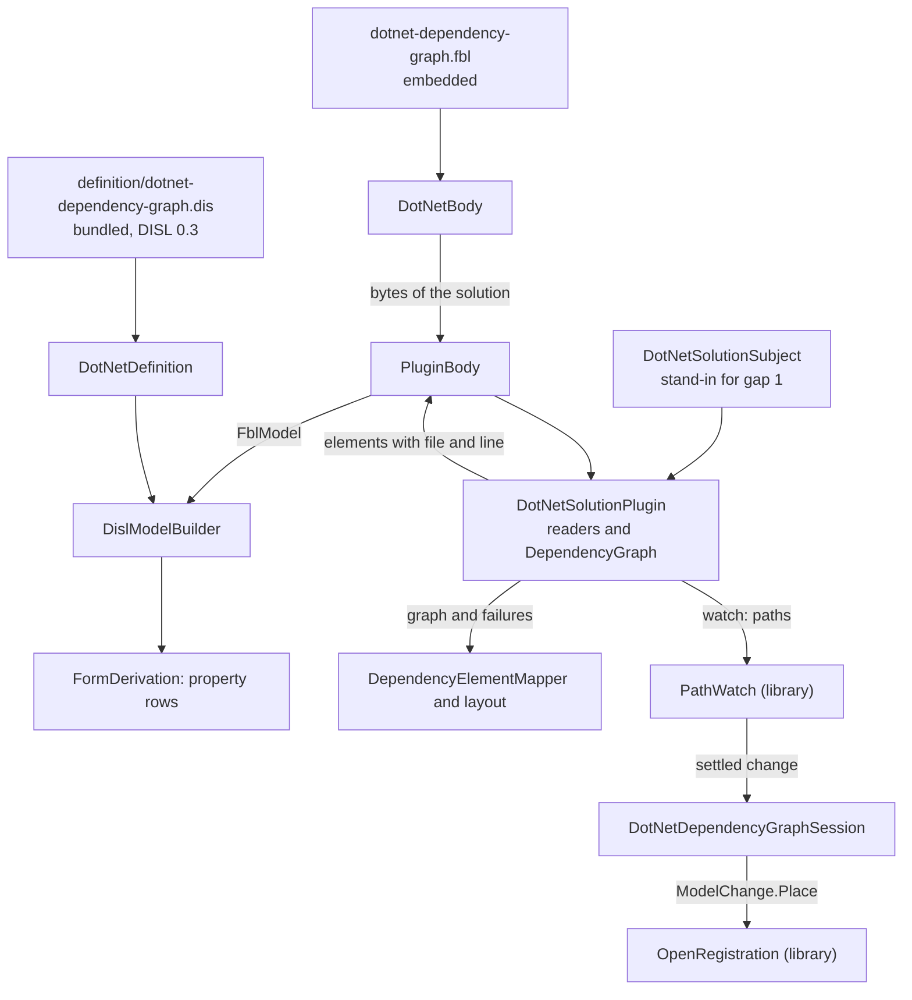

# Design Document

## Overview

The .NET dependency graph is already derived from its bundled DISL definition: rows, refusal and canvas. This design covers the FBL half, in **ten steps, each one pull request, each held to the frozen transcript** `Parity/dotnet.transcript.json`. No step changes the transcript except where the requirements name a change, and under the defaults only Q4 does (the new document), in step 9.

Every open question stands at its default: the plugin opens the files a solution leads to itself (Q1), no new finding is shown (Q2), the NuGet cache and the versions files above the workspace are read without asking (Q3), a new document is a `.slnx` (Q4), a reference in another casing and the stored summaries stay as today (Q5), and an element's source is its entry, its declaration or its first declaration (Q6).

The module ends with three new classes and loses three:

- `DotNetSolutionPlugin`: the `IPersistencePlugin` named `net.etalii.adp.dotnet.solution`. The three readers and `DependencyGraph` are its inside.
- `DotNetSolutionSubject`: the named stand-in for language gap 1 (finding B2). It is the only class that knows where the solution is on disk and that the reading leaves the body.
- `DotNetBody`: one solution opened through the binding, giving the graph, the DISL model built by `DislModelBuilder`, and the paths to watch.
- `DotNetSolutionDocumentFactory`, `SolutionWatcher` and `DotNetDefinition.Build` leave the product code (Requirement 6.2).

**One point of the approved requirements is proposed for amendment** before the tasks are written, in *Amendment proposed* below. It concerns Q4 and the order of `claims.extensions`.

## Steering Document Alignment

### Technical Standards (tech.md)

- *Specifying a diagram type*: the definition lives in etalii-adp/etalii.adp and is bundled with `bundle-disl.sh`, never edited here. The binding is the module's own file, embedded as the hype cycle's is (`EmbeddedResource Include="gartner-hype-cycle-graph.fbl"` in its project file), and the definition names it by URL.
- The four gates, the transcript and "a test seen to fail first" are the checks of every step. A newly created worktree is built before a green gate is trusted, at the steps that change an embedded file.
- No blocking call inside an `async` method: the readers stay synchronous inside the plugin's synchronous `Read`, as `IPersistencePlugin` declares it.

### Project Structure (structure.md)

- A diagram type adds declarations and no core code. What the libraries lack is added to `EtAlii.Adp.Specification.Fbl` for every tool, named for what it does (Library work). No module name enters a library (Requirement 7.3).
- The module gains one embedded `.fbl` beside its project file and a direct reference to `EtAlii.Adp.Specification.Fbl`, as the mind map's project has. `.gitattributes` has no rule for `.fbl` (searched for `fbl` in it: only the conformance corpus), so the hype cycle's binding is ordinary text and this one is too.

## Code Reuse Analysis

### Existing Components to Leverage

- **`IPersistencePlugin`, `PluginBody`, `PluginReadRequest`, `PluginReadResult`, `PluginFile`** (`EtAlii.Adp.Specification.Fbl`): used as `MindmapFreeplanePlugin` and `MindmapDefinition` use them (`PluginBody.Open(bytes, Binding, plugin, fileName)`, then `DislModelBuilder.From(body.Model, Specification)`).
- **`DislModelBuilder.From(FblModel, DislSpecification)`**: read against `DotNetDefinition.Build`. It adds nodes in reading order, then relations, and resolves an end with `diagram.ElementById`, which gives null for an id the model does not hold. That is the relation "with its end unset" of Q5, with no library change. The definition has no `typeMap` (finding A4) and no derived type (searched the bundled `.dis` for `"derived"`: none), so the builder adds no finding of its own.
- **`FblDocumentLoader.Load`**: loads the embedded binding as `MindmapDefinition.LoadBinding` does. It accepts a plugin reader with no rules and a shared claim that is `registrationOnly`, and it ignores properties it does not know, so `settle` on a file body and the `x-` properties of the draft load without a problem.
- **`OpenRegistration`, `ModelChange.Place`, `SplicedFile`**: the library's registration writer. It has no caller in product code today (Requirement 5.1 makes this module the first).
- **`TemplateWriter.Produce`**: gives the bytes of a new body from `template.text`. No caller in product code today.
- **`BundledDefinition`, `WireIdMap`, `FormDerivation`, `DislEnv`**: unchanged. `DotNetDefinition.Rows` keeps its derivation and changes only where its model comes from.
- **`SharedDocumentReader`**: stays the way the solution's bytes are read, so a solution being saved by an IDE still opens.
- **`Parity/DotNetTranscript.cs`, `TranscriptText.cs`**: the generator and comparison exist. Step 1 extends the corpus and nothing else.

### Integration Points

- **etalii-adp/etalii.adp**: `definitions/diagrams/dotnet-dependency-graph.dis` and its companion change there (step 3), through that repository's own pull request. Step 4 depends on that pull request being merged. The example binding of Requirement 8.2 is offered in the same pull request.
- **Other specifications of the series**: library items L1 to L5 are tool-neutral and are delivered once, here, because this is the first tool read by a plugin over several files. The Helm chart, the Ansible structure and the Azure DevOps pipeline reuse them (the requirements say the finding is "owed" to them). L6 and the registration command of step 8 are equally shared: any tool whose requirements ask for the library's registration writer or a template-made document uses them.
- **`EtAlii.Adp.Hierarchy`**: `AddDiagramContextActionProvider` names a new sibling `baseName + definition.Extension`, and `DiagramFilePair.ResolveSibling` derives a header-less registration's body from that one extension. Both matter to Q4 (see *Amendment proposed*).

## Architecture

### The steps

| Step | What changes | Held by | Depends on |
| --- | --- | --- | --- |
| 1 | The fixtures of Requirement 1.1 and the transcript regenerated from unchanged code; one test per finding, seen to fail for the finding's reason, or the finding struck. A test that no corpus file other than a registration changes during the transcript. No product code. | 1.1, 1.2, Reliability | Nothing |
| 2 | Library work L1 to L5, each with a test seen to fail first. No module changes. | 7.1, 7.2, 7.3 | Nothing |
| 3 | In etalii.adp: `persistence` becomes `format: "fbl"` with `binding`, without `files`, with the id `pattern`; the plugin's declaration; the companion loses the two stale sentences and gains the gaps of section C; the example binding is offered. | 2.3, 2.5, 8.1, 8.2 | etalii.adp's own checks |
| 4 | The definition bundled again; the binding embedded and loaded with no problem; the refusal stated once. Nothing reads through the binding yet. | 2.1 to 2.4, 9.2 | Step 3 merged |
| 5 | **Reading.** `DotNetSolutionPlugin`, `DotNetSolutionSubject`, `DotNetBody`; `DependencyGraphStore` holds bodies. The rows are still built by `DotNetDefinition.Build` from the same graph. A parity test compares the builder's model with `Build`'s, element for element, over the corpus. | 3.1 to 3.6, 3.8, 3.9 | Step 2 (L1, L2), step 4 |
| 6 | **Derivation.** `DotNetDefinition.Rows` reads the model `DislModelBuilder` built. `Build` moves to the test project as `Parity/HandBuiltDotNetModel.cs`, the oracle of the step 5 test. | 3.7, 3.9, 6.2 | Step 5 |
| 7 | **Watching.** The session watches the plugin's `Watch` paths through `PathWatch`; `SolutionWatcher` and its tests leave the module (the tests move to the library with their subject). The two tests of 4.4 are seen to fail against today's watcher first. | 4.1 to 4.4, 6.2 | Step 2 (L3, L4), step 5 |
| 8 | **The registration.** A move is written by `OpenRegistration` as one undo step. The fixtures of finding B14 are run first, and a difference is put to the user before the step lands. | 5.1, 5.2, 5.4 | Step 2 (L5); a ruling where 5.2 finds a difference |
| 9 | **The new document.** Created from the binding's `template` as a `.slnx`; `DotNetSolutionDocumentFactory` leaves. The transcript's new-document entry is regenerated on purpose (Q4). | 5.3, 1.3, 6.2 | L6; the ruling of *Amendment proposed* |
| 10 | The companion's table of remaining classes and gaps; the readmes and the two architecture pages where a sentence became false; the delivery report. | 6.1, 6.3, 8.1, 8.3, 8.4, 9.1 | Step 3's companion, updated in etalii.adp |

Steps 5 and 6 are separate on purpose: reading and derivation never change together, so a difference in the transcript is attributable. Steps 7, 8 and 9 are independent of each other and may land in any order after step 6.

### Modular Design Principles

- The plugin is contract-shaped: `Read` receives the body's bytes and delivers elements. Everything the contract cannot express sits in `DotNetSolutionSubject`, so removing the stand-in later touches one class.
- A definition defect is repaired in step 3 or 4, a runtime gap in step 2, and a language gap is recorded in the companion and stays behind `DotNetSolutionSubject`.

## Components and Interfaces

### DotNetSolutionPlugin

- **Purpose:** the reading of one solution under FBL section 11.
- **Interfaces:** `Id`; `Read(PluginReadRequest)`; `Watch(PluginReadResult)`; `Plan` (refuses, and is never asked: `PluginBody.Plan` returns before the plugin for a read-only binding); `Template` (never asked: the binding has `template.text`); `Graph` (the `DependencyGraphModel` of the last read, with its failures).
- **Dependencies:** `SolutionReader`, `ProjectReader`, `PackageDescriptionReader`, `DependencyGraph`, `DotNetSolutionSubject`.
- **Reuses:** the shape of `MindmapFreeplanePlugin`, including a static `Elements(DependencyGraphModel)` projection the parity test calls directly.
- **What `Read` does.** It takes the solution's bytes from the request, decodes them as `SharedDocumentReader.ReadAllText` decodes a file today, and runs the readers and the derivation unchanged. `SolutionReader` gains an overload that takes the text, so the file is read once by the host side. The elements are: a `Project` per `ProjectNode`, a `Package` per `PackageNode`, a `ProjectReference` or `PackageReference` per `DependsOnEdge`, with today's ids, today's attributes and the four summaries (Requirement 3.2). A relation carries its two ids in `Source` and `Target` whether or not the target exists (Q5).
- **Findings.** `Read` delivers none (Q2, Requirement 3.5). The six failure sentences stay on `Graph.Failures`, logged as today. `Unreadable` is false even for a solution that will not parse: the graph is empty and carries its reason, which is today's behaviour and Requirement 3.8.
- **Sources (Q6).** The readers load with `LoadOptions.SetLineInfo` (searched the module for `IXmlLineInfo` and `SetLineInfo`: none today). A project's source is its `Project` entry in the solution, a reference's is its declaration in the project file, a package's is its first declaration in reading order. Each element carries the file (L2) and the line. The span is the entry's start tag where the file is UTF-8, and empty otherwise (finding B16); nothing is planned against it.

### DotNetSolutionSubject (the stand-in of Q1)

- **Purpose:** what FBL has no construct for: a subject that is one file and the files it references.
- **Interfaces:** `SolutionPath`; `Exists(path)`, `ReadProject(path)`, `Enumerate(folder, pattern)`, `PackagesFolder`; `Read` (the list of paths and folders the last reading touched or would have touched).
- **How it is reached:** the module constructs one per body and hands it to the plugin's constructor. The library never learns a path: `PluginReadRequest` stays bytes and `args`. This is how Requirement 7.3 is kept while Q1's default is built.
- **Why code:** language gaps 1 and 2 (findings B2, B4, B6). It is named in the companion beside both, and is replaced by the host when FBL has a `resolve` operation or its equal.

### DotNetBody and DependencyGraphStore

- **`DotNetBody`:** `Open(solutionPath)`; `Graph`; `Disl` (the `DislModel`); `WatchPaths`. It reads the bytes, opens a `PluginBody` with the embedded binding and a new plugin, and builds the model. A solution that does not exist is not handed to `PluginBody`: the graph is empty with "The solution file does not exist.", as today, and no `fbl.missing-body` is raised (Q2).
- **`DependencyGraphStore`:** caches a `DotNetBody` per full path where it caches a graph today. `GetOrLoad` and `Reload` keep their signatures, so the mapper, the layout, the source resolver and `IDependencyGraphStore` are untouched. `WatchedFiles` is deleted in step 7.
- **`DotNetDefinition`:** `Rows(body, elementId)` reads `body.Disl.Diagram`. The `ConditionalWeakTable` and `Build` go in step 6. `Refusal` stays (see below).

### The refusal, stated once (Requirement 2.4)

The sentence stays in the definition's `behavior.messages` `std.readOnly`, because the rows' read-only reasons are derived from the same definition and are out of scope. The binding says `"readOnly": true`, which FBL 3.1 allows ("bool or LocalizedText"), and repeats no sentence. The draft binding of the requirements' appendix changes in that one property. The plugin's declaration in the definition carries `"plans": []`. Whether DISL 13.1 admits an empty list is checked against the schema in step 3, and if it does not, `plans` is omitted and the binding's `readOnly` alone says it (FBL 11.4).

### The session, watching and the registration

- **Watching (step 7).** The plugin's `Watch` returns: every file read; every folder a wildcard `Include` listed; and a `Directory.Packages.props` path in every folder above each project, whether or not the file exists. `PathWatch` (L4) watches them and raises one settled change. The settle is 250 ms: the binding carries `"settle": 250` as drafted, and because FBL gives `settle` to folder bodies only, the module passes the binding's number to `PathWatch` from `DotNetSolutionSubject` (finding B15, recorded under gap 1). A watcher overflow counts as a change, inside `PathWatch`. After each re-read the watch is replaced by the new reading's paths.
- **Refresh.** `Refresh`, `Rediff` and `DiagramDiff.Between` are unchanged, so Requirement 4.3 is met by the code that meets it today and the transcript holds it.
- **A move (step 8).** `MoveElementToAsync` keeps its three refusals and their sentences (Requirement 5.4; the binding's `createOnFirstPlacement` is false). It executes a new command, `PlaceInRegistrationCommand`, which opens the registration's bytes with `OpenRegistration.Open`, applies `ModelChange.Place`, and writes the bytes. Its inverse restores the bytes read before, and refuses with `SplicedFile.DriftUndo` when the file has changed since. `KnownIds` is left unset, so no stale entry is pruned and `fbl.stale-view-data` does not appear (Q2). Reading positions stays `RegistrationLayout.Read`.
- **Where the command lives** is a placement to put to the user as a selection, because it is tool-neutral and several tools of the series will use it: **`EtAlii.Adp.Hierarchy`, beside `SetRegistrationLayoutCommand`** (recommended: one home for both ways of writing a position; it costs that project a reference to `EtAlii.Adp.Specification.Fbl`, which references only `EtAlii.Adp` and the CEL library, so no cycle); `EtAlii.Adp.Diagram` (same reference, one project later); this module (no core change, and a copy per tool); other. This design is written against the first.

## Library work (Requirement 7)

Each is added to `EtAlii.Adp.Specification.Fbl` with a test seen to fail first. None names a tool.

| # | What | Evidence that it is missing |
| --- | --- | --- |
| L1 | `PluginReader.Args` loaded from `reader.args`, and `PluginReadRequest.Args` handed to `read` (FBL 11.2). | `PluginReader` is `(Plugin, Version)`; `PluginReadRequest` is `(Files)`. Searched the loader for `"args"`: none. |
| L2 | `FblElement.File`: the file an element was read from, relative to the subject and `/`-separated, null for the body. `PluginBody` passes it through, and `DislElement` keeps it beside `Line`. | `FblElement` has `OwnSpan` and `Line` only. |
| L3 | `PluginBody` calls `Watch` after every read and exposes the result as `WatchPaths`; a body's files are the body plus those paths ("a plugin body that spans several files"). | `IPersistencePlugin.Watch` carries the comment "no host calls it yet". Searched `src` for `.Watch(last` and `plugin.Watch`: none. |
| L4 | `PathWatch`: watches a list of paths (a file whether or not it exists, a folder for entries added and removed), one watcher per folder, settles for a given time, treats an overflow as a change. `BodySettings.Settle` loaded from `body.settle`, default 400 (FBL 10.3). The module's `SolutionWatcher` is its starting point. | Searched the library for `settle`, `Settle` and `FileSystemWatcher`: none. |
| L5 | A test that a read-only binding's plugin is never asked to plan a `ModelChange.Place`. | The rule exists: `PluginBody.Plan` refuses before the plugin, and `AReadOnlyBindingsPluginIsNeverAskedToPlan` holds it for a set. Only the placement case is added (Requirement 7.2). |
| L6 | An `IDiagramDocumentFactory` that returns a binding's template through `TemplateWriter.Produce`, for every tool whose binding has one. Its home follows the placement ruling above, since `EtAlii.Adp.Documents` cannot reference the FBL library's types without a new reference. | Searched `src` for `TemplateWriter.`: only the library's tests. Every converted module still has a hand-written factory. |

Not library work: an id `pattern` (searched `EtAlii.Adp.Specification.Disl` for `Pattern`: none, so the runtime holds no id to a pattern and the definition's new `pattern` needs no code), and a subject that follows references (a language gap, Requirement 7.3).

## Data Models

### What the plugin delivers

| Element | Id | Attributes | Source (Q6) |
| --- | --- | --- | --- |
| `Project` | `project:` and the path relative to the solution, forward-slashed | `name`, `path`, `targetFrameworks`, `dotNetVersion` when known | Its entry in the solution |
| `Package` | `package:` and the package id | `name`, `versions`, `hasVersionConflict`, `dependentProjectCount`, `isAmbient`, `description` when the cache has one | Its first declaration in reading order |
| `ProjectReference`, `PackageReference` | `depends:` and both ends joined by `->` | None | Its declaration; a wildcard's one entry for each relation it yields |

Values are handed over as the builder types them: a list for `targetFrameworks` and `versions`, a bool, and a number that `DislValues.TryFromRead` reads as `int`. `IdIsStored` is true (the strategy is `natural`).

### The transcript

Unchanged in shape. Step 1 adds documents; step 9 changes the new-document entry. Sources, watch paths and the registration's bytes are not in the transcript and are held by tests of their own.

## Amendment proposed

**The requirement.** Q4's default makes a new document a `.slnx`, and the appendix puts `.slnx` first in `claims.extensions`, "the reverse of the definition's primary and alternate today". The Reliability requirement says "No solution that opens today opens differently."

**The evidence.** Core creates a new sibling as `baseName + definition.Extension` and writes a registration with no `body:` header. `DiagramFilePair.ResolveSibling` derives a header-less registration's body from `definition.Extension` alone; `DiagramDefinition` says of the alternate extension that "it does not derive registration siblings". So today a header-less registration opens `X.sln` and never `X.slnx`. Making `.slnx` the primary reverses that: a header-less registration beside a lone `X.sln` stops opening, and beside `Both.sln` and `Both.slnx` it opens the other file. The fixture of Requirement 1.1 for finding B11 will show both in step 1.

**The options**, to be put to the user as a selection before the tasks card:

- **`.slnx` becomes the primary, and core's sibling derivation falls back to the alternate extension when the primary's file does not exist** (recommended). It is FBL 8.2's rule ("the first that exists, in the order of `claims.extensions`"), it keeps the appendix as drafted, and the only opening that changes is the header-less registration beside both files, which is named as a Q4 change. It costs a change in `EtAlii.Adp.Hierarchy` that the RDF tools' `.nt` alternate also gains.
- **`.sln` stays the primary and the new document alone is `.slnx`.** Nothing that opens today changes. It costs two core changes (a new-document extension on `DiagramDefinition`, and a `body:` header on a created registration) and `claims.extensions` in today's order.
- **`.slnx` becomes the primary with no fallback.** Module-only. Header-less registrations beside a classic solution stop opening, against the Reliability requirement.
- Other.

Step 9 is written against the first.

## Error Handling

### Error Scenarios

1. **The bundled definition or the embedded binding does not load.**
   - **Handling:** `DotNetDefinition` and `DotNetBody` throw on first use with the loader's diagnostics; `BundledDefinition.Tests` and a binding test fail in the gate.
   - **User Impact:** none in a released build.

2. **The solution does not exist, cannot be read, or cannot be parsed.**
   - **Handling:** an empty graph carrying today's sentence; nothing throws (Requirement 3.8).
   - **User Impact:** an empty diagram, as today. The reason is logged and not shown (Q2).

3. **A project file is missing or unreadable.**
   - **Handling:** that project is omitted with its failure sentence; the rest is read. Its path stays in the watch paths, so its return causes a re-read.
   - **User Impact:** the graph without that project, as today.

4. **A package was never restored.**
   - **Handling:** no description; never an error (Requirement 3.3).
   - **User Impact:** the row reads as it does today.

5. **A move without a registration, without a history, or of a reference.**
   - **Handling:** refused in the session with today's three sentences, before any command.
   - **User Impact:** unchanged.

6. **The registration changed on disk between a move and its undo.**
   - **Handling:** the inverse refuses with the library's drift sentence. Today's inverse overwrites the entry. This is a difference of finding B14's kind and is part of what step 8 puts to the user.
   - **User Impact:** an undo that is refused where today it would write over a hand edit.

7. **The transcript differs after a step.**
   - **Handling:** the step is not delivered, unless it is step 9's named change.
   - **User Impact:** none.

## Testing Strategy

### Unit Testing

- Library: one test class per item L1 to L6, each seen to fail before its change. `PathWatch` inherits `SolutionWatcher`'s tests, including the watcher obligations.
- `DotNetSolutionPlugin`: the elements of each fixture; the source of a project, a reference, a wildcard reference and a package declared twice; determinism over two reads of the same files.
- The binding: loads with no problem; its template reads through it with no finding (FBL 13).
- The reader tests stay and pass unchanged; they hold Requirement 3.4.

### Integration Testing

- **The transcript test** after every step, byte for byte.
- **Builder against hand-built** (step 5): `DislModelBuilder.From` over the plugin's elements against `Build` over the same graph, for every solution and every hand-built graph, so a difference names the document and the element.
- **One fixture per finding** (Requirement 1.1): a project outside the solution's folder with a versions file above it (B2); a new document as core creates it (B11); a header-less registration beside both serializations (B11); a registration whose ids order differently in UTF-8 and UTF-16 (B14); a project file in UTF-16 (B16); a project file with a default namespace (B17).
- **Watching** (Requirement 4.4): a project a wildcard begins to match, and a versions file created above a project, each first run against `SolutionWatcher` and seen to fail.
- **The registration** (Requirement 5.2): every registration of the corpus written back with nothing moved gives the same bytes; a move and its undo restore the bytes.
- **Nothing is written**: the corpus is hashed before and after the transcript run, registrations excepted.

### End-to-End Testing

- A `tests.md` entry: open the example, edit a project file in another tool and see the graph follow, drag a box and undo it, create a new diagram and open the `.slnx` with `dotnet sln list`.
- A newly created worktree is built before the gates are trusted at steps 4 and 9.

## What remains in the module, and why

| Class | Stays because |
| --- | --- |
| `DotNetSolutionPlugin`, `SolutionReader`, `ProjectReader`, `PackageDescriptionReader`, `DependencyGraph`, the `_Model` records | FBL 11.5 expects this format to stay a plugin (finding B1). |
| `DotNetSolutionSubject` | Language gaps 1 and 2 (findings B2, B4, B6, B15). |
| `DotNetBody`, `DependencyGraphStore`, `IDependencyGraphStore` | The open body and its cache: the host's side of FBL 11.3. |
| `DotNetDefinition` | The bundled definition and the rows derived from it. |
| `DotNetDependencyGraphLayout` | The definition names the layout as a plugin. |
| `DependencyElementMapper` | Payloads are the host's wire. |
| `DotNetDependencyGraphSession` and its factory | The session, and the four host sentences FBL cannot carry (finding B13, gap 7). |
| `DotNetContextSourceResolver`, `DotNetContextPropertyProvider` | Host seams; the provider hands out the derived rows. |
| `Diagram`, the service registration | The type's identity and wiring. |

## Requirement Coverage

| Requirement | Where |
| --- | --- |
| 1 | Step 1; Testing Strategy (one fixture per finding); steps 5 to 9 for 1.3 |
| 2 | Steps 3 and 4; *The refusal, stated once*; *Amendment proposed* for the order of `claims.extensions` |
| 3 | Steps 5 and 6; *DotNetSolutionPlugin*, *DotNetSolutionSubject*, *DotNetBody*; *What the plugin delivers* |
| 4 | Step 7; *The session, watching and the registration*; L3, L4 |
| 5 | Steps 8 and 9; `PlaceInRegistrationCommand`; L6; *Amendment proposed* |
| 6 | Steps 6, 7, 9 and 10; *What remains in the module* |
| 7 | Step 2; *Library work* |
| 8 | Steps 3 and 10; `DotNetSolutionSubject` as the named stand-in; the companion |
| 9 | Step 10; Testing Strategy (the fresh worktree); the gates of every step |

**What waits, and on what.** Nothing of this design waits for a language change: Q1's default builds the stand-in now. What waits is the stand-in's removal, on FBL gaining a subject that follows references (gap 1) and a declared environment root (gap 2); showing the failures as findings, on the separate change Q2 names; and the casing defect of finding B8, on the change Q5 names.
