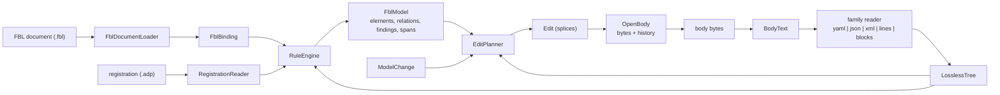

# Design Document

## Overview

`EtAlii.Adp.Specification.Fbl` (new) is a self-contained .NET library that implements FBL 0.1: it loads FBL documents, reads a body through a binding into a model with findings and source spans, plans every model change as splices, keeps an exact history, reads and writes the `.adp` registration, routes files and produces templates. **It takes bytes and returns bytes**: nothing in it knows about gRPC, sessions, the canvas or any module, and nothing in the solution calls it except its own tests.

`EtAlii.Adp.Specification.Fbl.Tests` (new) proves it twice: against the conformance fixtures vendored from `etalii-adp/etalii.adp`, and against the real files already under `src/`, with each real file's reading cross-checked against the module that reads it today where that module's parser is public.

Every name in this document that does not exist yet is a proposal, marked as new where it is introduced.

## Steering Document Alignment

### Technical Standards (tech.md)

- **Decision 7, commands for every state change, and Requirement 6**: the library's history is the FBL history (inverse splices, snapshots, drift refusal), not `ICommand`. A host that wires it in later wraps an FBL edit in one of its commands; the library must not depend on the host's command types to stay portable to the other three hosts' implementations (Requirement 1.3).
- **Decision 11, concurrent saves take turns in `AdpFileWriter.Save`**: the library cannot use `AdpFileWriter` (it references no project of the solution), and, as built, it writes no file at all: `OpenBody.Save` and `PluginBody.Save` refuse an unreadable or read-only body and otherwise hand the bytes to a writer the host passes, which here is `AdpFileWriter.Save`; a new body from a template is created by the host with `AdpFileWriter.Create`, which never overwrites. **The first build had its own temp-then-move save and a `CreateNew` template writer, and `ShapeOfFileAccessTests` refused both** as reimplementations of the central writer; the library's FBL documents are read at the same `FileShare.ReadWrite | FileShare.Delete` the central reader uses. Requirements 5.9 and 8.4 were reworded to match (chat ruling, Peter, 2026-10-03).
- **Testing & quality**: four gates, exit codes captured, and every guard seen to fail (Requirement 11, *Reliability*).
- **Diagram storage**: unchanged. Nothing here changes where any existing diagram keeps anything.

### Project Structure (structure.md)

- Two core projects under `src/backend/`, named for their purpose. `Specification` is a new middle segment: it says the project implements one of ADP's specifications (as `etalii.adp` defines them), and leaves room for one such project per specification (DISL and the others) without a rename. The name is the user's.
- Namespaces follow the project and its folders: `EtAlii.Adp.Specification.Fbl.Yaml`, `.Planning`, and so on. No folder is skipped as a namespace provider, so the project's `.csproj.DotSettings` stays empty of `NamespaceFoldersToSkip` entries.
- `docs/solution-structure.md` gains the two projects in the core lists and its counts move (111 to 113 projects, core 29 to 31, production 79 to 80, test 32 to 33), in the same change that adds them, because `ArchitecturePages.Tests` recomputes them from the solution.

## Code Reuse Analysis

### Existing Components to Leverage

- **YamlDotNet** (already pinned at 18.1.0): it judges whether a YAML body is well-formed, and its representation model reads a `rootKey` marker. The structure and spans come from the library's own parser (see *The yaml reader*).
- **`System.Text.Json.Utf8JsonReader`** (in the framework): it reports `TokenStartIndex` as a UTF-8 byte offset and rejects comments when told to, which is the json family exactly.
- **`System.Text.RegularExpressions.Regex`** with a match timeout, after the library's own check that an expression is inside FBL's common subset.
- **The module parsers, from the tests only**: `TimelineParser.Parse`, `CausalLoopParser.Parse`, `C4Parser.Parse` and `MindmapDocument.Parse` are public and are the cross-check of Requirement 11.6.

### Considered and declined

- **`LineDocument`, `LineSplice`, `AdpFileWriter`, `SharedDocumentReader`** (in `EtAlii.Adp.Documents`) are this host's document primitives, and the modules' splicing is built on them. Using them would make the library a part of this host rather than an implementation of FBL, would pull ASP.NET Core in through `EtAlii.Adp.Documents`, and would let the host's existing line rules decide bytes that FBL §6.3 decides. Requirement 1.3 rules it out; the design records the cost, which is a second splice type in the solution until a module adopts the library.
- **`System.Xml.XmlReader`** normalises line endings (FBL §4.5 forbids it) and reports positions as line and column rather than byte spans. The xml reader is a small lossless tokenizer instead.
- **A CEL package.** None is pinned, and adding one changes `src/Directory.Packages.props`, which Requirement 1.4 does not allow. The library evaluates the subset of CEL the vendored bindings use (*The CEL evaluator*), and reports any other construct as a load problem naming it (Requirement 2.4), so a binding that needs more fails loudly at load rather than quietly at read.

### Integration Points

None. That is Requirement 1. The only edges into the rest of the repository are the test project's references to four module projects and its enumeration of files under `src/`.

## Architecture



**Reading is a pure function of bytes, binding and registration; writing is a pure function of bytes, model and change.** `OpenBody` (new) is the only stateful type: it holds the current bytes, the last reading, and the history, and it applies an edit by applying its splices and reading again. Re-reading after every edit, rather than patching the model, keeps one code path for what a body means; the corpus is small enough that it costs nothing measurable (Performance).

### Folders and their concerns

| Folder (namespace suffix) | Concern | Key types (all new) |
| --- | --- | --- |
| `Documents` | Loading `.fbl` JSON into a typed binding; problems with JSON Pointers; binding references | `FblDocumentLoader`, `FblDocument`, `FblBinding`, `LoadProblem` |
| `Text` | Bytes, BOM, lines and endings, dominant ending, byte/line/column conversion, spans | `BodyText`, `Span`, `LineEnding` |
| `Expressions` | The regex subset check, the regex runner with timeout, the CEL subset | `RegexSubset`, `BoundedRegex`, `CelCompiler`, `CelProgram`, `CelValue` |
| `Yaml`, `Json`, `Xml`, `Lines` | One lossless reader and writer per family; `Lines` serves both `lines` and `blocks` | `YamlFamily`, `YamlParser`, `YamlScalars`, `JsonFamily`, `XmlFamily`, `LinesFamily` |
| `Rules` | The tree every tree family produces, selectors, rule matching, slots, ids, containment, references, views and resources | `FamilyReader`, `TreeFamily`, `TreeEntry`, `TreeValue`, `Selector`, `BodyReading` |
| `Planning` | Model changes to splices; new-text rules shared by the families | `ModelChange`, `EditPlanner`, `Splice`, `SpliceOperation`, `Edit`, `Refusal`, `NewText` |
| `History` | Undo, redo, snapshots, digests, drift, and the save handed to the host's writer | `SplicedFile`, `OpenBody`, `EditHistory`, `UndoResult` |
| `Registration` | The `.adp` line form, layout, identities, legacy sidecars, finding the body | `RegistrationDocument`, `OpenRegistration`, `LegacySidecar`, `BodyLocator` |
| `Routing` | Markers, candidates, readings, templates, folder recognition and globs | `Router`, `MarkerEvaluator`, `TemplateWriter`, `FolderSubject`, `Glob` |
| `Plugins` | The FBL §11.2 contract as an interface and its data, and a body read through it | `IPersistencePlugin`, `PluginReadResult`, `PluginPlanResult`, `PluginBody` |

`FblModel`, `FblElement`, `FblView`, `Finding`, `Span` and `Splice` sit at the root of the namespace, because every folder uses them.

### Public surface

The surface is deliberately small, so that a later module adopting the library meets five types:

```csharp
var problems = FblDocumentLoader.Load(path, out FblDocument document);      // Requirement 2
FblBinding binding = document.Bindings["timeline"];

var body = OpenBody.Open(bytes, binding, new FblOptions { FileName = "roadmap.tml" }); // Requirement 3, 4
FblModel model = body.Model;                                                 // elements, relations, findings

var change = new ModelChange.Set("launch", new Dictionary<string, object?> { ["label"] = "General availability: v1" });
PlanResult plan = body.Plan(change);                                         // Requirement 5
if (plan is PlanResult.Planned planned) body.Apply(planned.Edit);
body.Undo();                                                                 // Requirement 6, refused on drift
```

`PlanResult` is either `Planned(Edit)` or `Refused(string reason)`; a refusal is a value, never an exception, because a refused edit is an expected answer (FBL §6.4). Exceptions are for programming errors only: a null argument, a change naming an element the model does not have.

## Components and Interfaces

### The loader

Parses with `Utf8JsonReader` and a stack of seen-key sets, so a duplicate key anywhere is found with its pointer (Requirement 2.1); maps into immutable records that mirror the schema's `$defs` one for one, keeping every `x-` property out of the typed form; then runs name resolution, the regex check, CEL compilation and the §14.1 step 6 checks over the whole document, collecting every problem (Requirement 2.6). A document with an error-severity problem yields no usable binding.

### `BodyText`

Holds the bytes, a validity flag from a strict UTF-8 decode, the BOM length, and a line table of `(start, contentEnd, endingEnd, ending)` built in one pass. Everything that needs line, column, dominant ending, or the ending at an offset asks it. **Columns count code points**, computed from the line's bytes on demand, never from a `string` index, because a `string` counts UTF-16 units and an emoji would shift every column after it.

### The lossless tree

One node type for entries and one for values, each with `OwnSpan`, an optional `LineSpan`, `Indent`, its leading comment span, a family-specific `Kind`, and children. **The invariant the tests hold every reader to is the one FBL §4.1 states**: concatenating, in order, the bytes of every node's own region and every trivia region reproduces the body exactly. A reader that loses or doubles a byte fails it on every file of its family, which makes it the first test each reader gets.

### The yaml reader

**As built, the reader is the library's own parser, not YamlDotNet's events.** The first attempt corrected YamlDotNet's character marks into FBL's byte spans, and the corrections grew into a second parser hidden inside the first. `YamlParser` now reads block mappings and sequences, plain, quoted and block scalars, flow collections (as one value, through `FlowReader`), anchors and aliases straight from the bytes, so every span is a byte span from the start. YamlDotNet still decides well-formedness before it runs: a `YamlException` makes the body unreadable with its mark as the location, so the two parsers can never disagree about whether a body is YAML.

Only the first document is read. A slot reached through an anchor, alias or merge key is read-only. A key repeated in one mapping is reported as `fbl.duplicate-key` and only its first occurrence is read. The guard against a lost or doubled byte is the byte-coverage invariant, run on every conformance fixture and every real file of the family.

### The json reader

`Utf8JsonReader` with `JsonCommentHandling.Disallow` walks the body once, building members and items with byte spans straight from `TokenStartIndex` and `BytesConsumed`, and recording each separator's offset so that removal and insertion can take or give a comma as FBL §6.2 and §6.3 require. A duplicate member name is a `fbl.duplicate-key` warning on the later one, which is not bound.

### The xml reader

A tokenizer over the bytes that recognises the XML declaration, comments, processing instructions, a doctype (skipped as one unbound region, internal subset included), start, end and self-closed tags, attributes with their quote character, character data and references. It checks well-formedness as far as FBL needs it: names, quotes, tag balance, one root, and the predefined and character references. CR bytes are never normalised. `html-paragraphs` reading strips tags inside a `<p>`, decodes references and collapses whitespace; writing escapes as FBL §4.5 says.

### The lines and blocks readers

One shared reader: the line table, the binding's `comment` expression, and the rules' `line` expressions tried in binding order. The blocks reader adds a brace scan that ignores braces inside double-quoted strings and keeps a stack of open blocks, each tagged with the block rule or element rule that opened it so that `within` can be checked. Unbalanced braces make the body unreadable at the first unmatched brace.

### The CEL evaluator

A recursive-descent parser for the subset the vendored bindings use and FBL §2.4 implies, with an evaluation step budget standing in for DISL's cost limits:

- literals (int, double, string, bool, null, list, map), identifiers, member access, indexing;
- `!`, `-`, `&&`, `||` with CEL's commutative error and absence semantics, `?:`, `==`, `!=`, `<`, `<=`, `>`, `>=`, `+`, `in`;
- `has(x.f)`; the macros `all`, `exists`, `exists_one`, `filter`, `map`;
- `size`, `matches`, `startsWith`, `endsWith`, `contains`, `replace`, `int`, `double`, `string`.

The four Databricks expressions are the heaviest users (`exists`, `filter`, `in` on a map, `[0]`, `replace`) and are the evaluator's first fixtures. Anything else parses to a "construct not supported" problem at load.

### The regex subset

A scanner over the expression that rejects what FBL §2.5 excludes and nothing else, then constructs a .NET `Regex` with `RegexOptions.CultureInvariant` (plus `IgnoreCase` for `caseInsensitive`, ASCII only, by mapping the expression's letters rather than trusting culture rules) and a match timeout, 250 ms by default in `FblOptions`. A `RegexMatchTimeoutException` becomes a finding on the statement.

### The rule engine

Walks the tree in document order. For tree and xml families it evaluates each rule's selector into a set of matched entries with their captures; for lines and blocks it tries each rule's `line` on each statement admitted by `within`. Every entry is offered to the rules in binding order (elements before relations), and the first whose `when` holds takes it. Slots are read through `SlotReader`, which returns the value, its span, and whether it is writable (false for `value`, aliases, merges, `readOnly`, and a `parent` slot whose source is not writable). Containment and references are resolved in a second pass once every element exists, which is also where `fbl.dangling-reference` is found.

### The planner

One method per change kind, each producing splices against the current bytes, then a final pass that orders them, checks that none overlap, and wraps them in an `Edit`. `NewText` owns every rule of FBL §6.3 that is not family-specific (line ending, indentation and step, numbers, times), and each family's writer owns its scalars and separators. The plain-safe test for yaml is one function with its own table of cases from §6.3, because it is the rule two hosts are most likely to disagree on.

### `OpenBody` and the history

`Apply` applies an edit's splices from the highest offset down, records the replaced bytes and the SHA-256 of the result, pushes the edit, clears redo, and re-reads. `Undo` and `Redo` first compare the caller-supplied current bytes (or the body's own, when the caller supplies none) with what the history expects, and refuse with FBL §7.2's sentence on a mismatch. A snapshot edit records the whole body instead of per-splice bytes.

### The registration

`RegistrationDocument` is a line parser of FBL §8.1 (origin, headers in order, the `layout` and `identities` blocks with their spans, and the trailing unbound region); it reports `fbl.unknown-header` and `fbl.stale-view-data`. `OpenRegistration` writes layout and identities changes as splices with the same `Edit` type and the same `SplicedFile` history as a body: `ModelChange.Place` for a position, and `ModelChange.Identify` (added for this) for a stored id, which creates `identities:` after the layout block. `BodyLocator` finds the body and refuses paths outside the workspace root or through a reparse point. `LegacySidecar` reads and writes the old `*.layout.json` and identity files through the json family, with a binding made for the purpose.

A `blocks` body's views and resources are part of the reading: `FblModel.Views` lists every block whose rule has a `view` group, `SelectView` picks one by the `view` header ignoring case (the first when there is none), and `FblModel.Resources` lists the values of `registration.resource.capture` in document order.

### Routing and templates

`MarkerEvaluator` reads only what a marker needs (a root key through the json or yaml reader, the first line, or the first N lines). `Router` returns candidates and never ranks them beyond FBL §9.4's order. `TemplateWriter` replaces exactly the four placeholder forms and writes with `FileMode.CreateNew`, so an existing file is never overwritten. `FolderSubject` evaluates `recognise` and the file rules' globs with a small glob matcher (`*`, `**`, `?`, `[...]`), case-sensitivity taken from the platform, and does not descend into a directory whose attributes include `ReparsePoint`.

## Data Models

```csharp
public sealed record Span(int Start, int End);                       // UTF-8 byte offsets, End exclusive

public enum SpliceOperation { ReplaceValue, InsertKey, RemoveKey, InsertEntry, RemoveEntry,
    EnsureContainer, RemoveContainer, RewriteReference, ReEmitLine, OpenBlock, SelfClose }

public sealed record Splice(SpliceOperation Operation, int Start, int End, string Text);
public sealed record Edit(IReadOnlyList<Splice> Splices, bool Snapshot);

public sealed record Finding(string Code, FindingSeverity Severity, string Message, SourceLocation? Location);
public sealed record SourceLocation(string File, int Line, int Column, int Length);

public sealed record FblElement(string Id, bool IdIsStored, string Type, string Rule,
    IReadOnlyDictionary<string, FblValue> Attributes, string? ParentId, string? Slot, Span OwnSpan);
public sealed record FblRelation(string Id, bool IdIsStored, string Type, string Rule,
    string Source, string Target, IReadOnlyDictionary<string, FblValue> Attributes, Span OwnSpan);
public sealed record FblModel(IReadOnlyList<FblElement> Elements, IReadOnlyList<FblRelation> Relations,
    IReadOnlyList<Finding> Findings, bool Unreadable);

public abstract record ModelChange
{
    public sealed record Add(string Type, string Id, IReadOnlyDictionary<string, object?> Attributes, string? ParentId = null) : ModelChange;
    public sealed record Set(string Id, IReadOnlyDictionary<string, object?> Attributes) : ModelChange;
    public sealed record Remove(string Id) : ModelChange;
    public sealed record Move(string Id, string NewParentId) : ModelChange;
    public sealed record Place(string Id, double X, double Y) : ModelChange;     // registration
    public sealed record Save : ModelChange;
}
```

The `ModelChange` shapes are the fixture schema's `Edit` shapes, so the conformance runner maps a fixture step to a change without translation.

## Error Handling

1. **A problem in an FBL document**: `LoadProblem` with pointer, severity and message; the binding is unusable when any has severity error. The caller decides what to show.
2. **A problem in a body**: a `Finding` on the model. Reading never throws on content (Requirement 4.7); an `OpenBody` over an unreadable body is read-only and refuses every change with the sentence of `std.unparseable`.
3. **A change that cannot be made**: `PlanResult.Refused` with the reason; nothing is applied.
4. **Drift**: `Undo` and `Redo` return a refusal with FBL's sentence; nothing is written.
5. **I/O while saving**: the temporary file is deleted and the exception propagates, because a failed save is the caller's to report and the destination is untouched.
6. **Programming errors** (null arguments, unknown element ids in a change): `ArgumentException`, never a finding.

The library does not log. It returns everything it knows, and the house logging convention (a static Serilog logger per class) applies to whatever host calls it.

## Testing Strategy

### Unit tests, beside each component

Each folder of the library has a test folder of the same name. The ones that carry the most weight:

- **The byte-coverage invariant** for every reader (*The lossless tree*), run on every vendored fixture input and every real file of the family.
- **The yaml mark-to-byte check** (*The yaml reader*).
- **The plain-safe table** and the other §6.3 rules, each written from the sentence of the specification it tests, with the sentence quoted in the test's name or a comment.
- **CEL**: every expression in the vendored bindings, evaluated against hand-built entries with known answers.
- **The regex subset**: one accepted and one rejected expression per construct FBL §2.5 names.

### The conformance runner

One theory over every `fixtures/*/fixture.json` in the vendored folder: load the binding by its relative reference, read the input bytes, assert `read`, then run each step, asserting the splices (operation, start, end, text) and the resulting bytes, or the refusal and unchanged bytes. The fixtures are found by enumeration with a minimum count of eight.

### The real-file suite

`RealFileCorpus` (new, in the test project) finds the repository root by walking up from the test assembly to the folder holding `src/backend/EtAlii.Adp.slnx`, and enumerates `src/` with the exclusions of Requirement 11.1. One theory per property of Requirement 11, each taking `(binding, file)` pairs, so a failure names the file:

| Property | Requirement |
| --- | --- |
| reads without throwing; readable unless listed | 11.2 |
| save without edit: no splice, same bytes | 11.3 |
| set and undo; remove and undo; bytes outside splices unchanged | 11.4 |
| drift refuses undo | 11.5 |
| ids per type equal the module parser's | 11.6 |
| every `.adp` parses, writes back unchanged, resolves and selects | 11.7 |
| chart folders recognised; Turtle files routed; readings suggested | 11.8 |
| C4 `*.layout.json` read as legacy layout | 11.9 |

**Choosing "the first writable attribute" is deterministic and documented in the test**: the first element in document order with a writable string attribute, set to its current value with ` (edited)` appended, so the new value is plain-safe exactly when the old one was and the test exercises `replace-value` rather than a style change.

**The module cross-check maps types by a table in the test project**, for example `TimelineParser`'s periods and moments to `Period` and `Moment`, and `C4Parser`'s elements by kind to `Person`, `SoftwareSystem` and `Container`. Elements the module reads but the binding does not bind (C4 deployment nodes, which `structurizr.fbl` leaves unbound) are compared only for the types the binding declares; that restriction is stated in the table, not discovered in a failure.

### Divergences

`RealFiles/divergences.json` (new) lists each known disagreement as `{ property, binding, file, observed, reason }`. A check consults it before failing; a listed divergence that no longer occurs, or occurs with a different `observed`, fails the run (Requirement 12.2), and so does an entry naming a file the suite does not read. It started empty and holds 42 entries as built, each a finding for the delivery report.

### Seeing the guards fail

Before the real-file suite is trusted, each property is run once against a deliberately broken library and the failure recorded in the implementation log: a planner that writes one extra byte (11.3, 11.4), an undo that skips its drift check (11.5), a reader that drops a node (the byte-coverage invariant), and a rule engine that skips the first element (11.6). Each sabotage is reverted in the same task, and the log records the failing message, not just that it failed.
