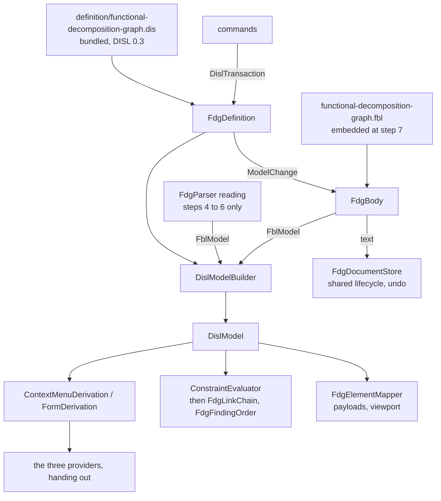

# Design Document

## Overview

The functional decomposition graph is converted in **nine steps, each one pull request, each held to one frozen transcript**. The transcript is generated from today's hand-written code first (step 1). Every later step replaces one hand-written part by its derived or bound equivalent and must reproduce the transcript byte for byte, except where the requirements name a change (Q1: the hunks of an edit; Q3: a body that is not YAML opens read-only; Q6: the four module defects). Q2, Q4 and Q5 keep today's behaviour by default.

**Six steps are built now and two wait.** The default of Q5 is whatever is ruled for Q3 of `timeline-disl-fbl`, and that question's default is to report the gap and wait, with nothing built on a workaround. Reading the body through the binding (step 7) and writing it (step 8) therefore wait for two FBL constructs; everything that derives from the DISL definition (steps 1 to 6) does not, and step 9 closes the work. *What waits, and on what* says so in one place.

The module ends in the shape the hype cycle graph has. Two classes carry the conversion:

- `FdgDefinition`: the bundled DISL definition loaded once, and what the providers derive from it (palette, menus, rows, confirmation, refusals, findings), mapped to today's wire ids by its `x-fdg` block.
- `FdgBody`: one `.fdg` body opened through the module's FBL binding, giving the binding's reading, the DISL model built from it, and `Change(ModelChange)`.

Everything else is deleted, moved to the test project as the oracle, or kept as host code or as a named stand-in with its reason (the table under *What remains*).

**Two points of the approved requirements are proposed for a small amendment** before the tasks are written, in *Amendment proposed* below. Neither changes what the tool does.

## Steering Document Alignment

### Technical Standards (tech.md)

- *Specifying a diagram type*: the definition lives in etalii-adp/etalii.adp and is bundled, never edited here. The binding is the module's own file, as the hype cycle's is, and the definition names it by URL.
- Splices, never reserialization: today's rule for the writer becomes FBL's rule, which is stricter (a value's span, not a line).
- The four gates, the transcript and "a test seen to fail first" are the checks of every step.

### Project Structure (structure.md)

- A diagram type adds declarations and no core code. What the libraries lack is added to `EtAlii.Adp.Specification.Disl` and to the client's `compileNotation` for every tool (Library work), named for what it does.
- The module gains `definition/` (bundled) and, at step 7, one embedded `.fbl`; the test project gains `Parity/`.

## Code Reuse Analysis

### Existing Components to Leverage

Each was opened and its members checked against the use named here.

- **`BundledDefinition.Load`, `WireIdMap.Of`, `ToolboxDerivation.Derive`, `ContextMenuDerivation.Derive` with `DislMenuTarget.Element`, `.Canvas` and `.Connection`, `FormDerivation.Derive`, `ConstraintEvaluator.Evaluate` with `DislConstraintOptions`, `DeletionPolicy.Confirmation` and `.Changes`, `OperationInterpreter.Run` and `.Drop`, `DislIds.Fixed`, `DislWrite.ToFbl`** (`EtAlii.Adp.Specification.Disl`): used as `GhgDefinition.cs` uses them.
- **`DislModelBuilder.From(FblModel, DislSpecification)`**: at steps 4 and 5 it is fed a reading made from today's `FdgModel`, exactly as `TimelineDisl.Build` makes one for the timeline, whose parser also stayed. At step 7 it is fed FBL's reading.
- **`WireIdMap`'s key `Type/kind`**, which its own remark says applies to "that type or its subtypes": the draft's `FdgRelation/editLabel` and `FdgRelation/delete` are therefore valid as written, and one key per relation type is not needed. This closes the open point under the requirements' second appendix.
- **Present already, so no library work**: a built-in's `code` as CEL and `oncePerGroup` (`ConstraintEvaluator`, `CodeOf` and `OncePerGroup`), `constraints.order` (`Ordered`), a confirmation's `count` and `threshold` (`DeletionPolicy`), base-36 ids (`DislIds.Of`, `"base36"`), a relation with an unresolved end kept with `SourceId` and `TargetId` (`DislModelBuilder`). `ToolboxDerivation` does not read a tool's `mode`; the drop action comes from `x-fdg.tools` (searched for `"mode"` in `Derivation/`: none), so `mode: "drop"` needs nothing.
- **`OpenBody.Open`, `.Plan`, `.Change`, `.Fork`, `SplicedFile.Apply`, `FblDocumentLoader.Load`, `ModelChange`, `PlanResult`** (`EtAlii.Adp.Specification.Fbl`): used as `GhgBody.cs` uses them, including its cache of recent bodies and its batch.
- **`DislReaderFinding.Unreadable` and `.NotParsed`**: how the hype cycle hands its reader's own sentences to the evaluator (`GhgParser.ReaderFindings`). The same route carries this tool's.
- **The hype cycle's `Parity/` folder** (`GhgTranscript.cs`, `TranscriptText.cs`, `HandWrittenGhg.cs`, the `GhgDerived*.Tests.cs` per kind): copied in shape.
- **`RestoreDocumentCommand`** and the shared document lifecycle: undo stays the host's, restoring text.
- **`parseDisl`, `compileNotation`, `NotationBindings`** (client library). Present already: the right-button body drag (`connect.pointer`, accepted when every edge states the same one), `superellipse`, `parallelogram` and `trapezoid` in `shapeCatalog.ts` with the parameters the library draws (the trapezoid is `inset: 0.15`, `direction: "down"`, which the definition must state because DISL's defaults differ), and the choice of a relation by the pair of ends (`relationOnto` in `DiagramCanvas.tsx`).
- **`bundle-disl.sh`**: bundles the one definition.

### Integration Points

- **etalii-adp/etalii.adp**: `definitions/diagrams/functional-decomposition-graph.dis` and `.md` are rewritten there, and `specifications/disl/functional-decomposition.dis` is brought in line (step 2), through that repository's own pull request and checks. Step 3 depends on that pull request being merged. Steps 7 and 8 depend on a second change there, to FBL (see *What waits*).
- **`EtAlii.Adp.Specification.Fbl.Tests`**: `ModuleCrossCheck.Tests` gains a case for `.fdg` at step 7 (see *Amendment proposed*, 2).
- **Other specifications of the series**: the graph functions of DISL 12.4 are needed by `causal-loop-disl-fbl` (its L1, `diagram.cycles`) and `azure-devops-pipeline-disl-fbl` (its 8.1, `reachable` and `inCycle`). They are one piece of work in one file and are delivered once, by whichever specification reaches its library step first; the others take them as given.

## Architecture

### The steps

| Step | What changes | Held by | Depends on |
| --- | --- | --- | --- |
| 1 | The transcript, its generator, the new fixtures of Requirement 1.2 and the test that today's code reproduces it, seen to fail against a changed sentence. No product code changes. | Requirement 1 | Nothing |
| 2 | In etalii.adp: the definition at DISL 0.3 with `x-fdg`, `typeMap` and `persistence.format: "fbl"`; the companion rewritten; the example aligned. | Requirement 2.1 to 2.4 | A pull request in etalii.adp |
| 3 | Library work L1 to L4. The definition bundled, embedded and loaded with no error; `BundledDefinition.Tests`; `src/diagrams/readme.md`. Nothing derives from it yet. | Requirements 2.5, 2.6, 8.1, 8.2, 8.4, 10.1 | Step 2 merged |
| 4 | Toolbox, menus, rows and the deletion confirmation derived; the providers hand out. The hand-written providers move to `Parity/HandWrittenFdg.cs`. The model is built from `FdgParser` through the adapter `FdgDisl`. | Requirements 3.1, 3.2, 3.7, 3.8 | Step 3 |
| 5 | Findings and connect refusals derived; `FdgValidator` and `ConnectFdgElementsCommandHandler` call `FdgDefinition`; `FdgRuleSet`, `FdgRelations`, `FdgOwnership` and `FdgConnectVerdict` move to the oracle. The two sentences of finding A15 become culture-free, with their guard. | Requirements 3.2 to 3.7, 6.2 in part | Step 4 |
| 6 | The client compiles its canvas definition; library work L5; today's definition stays in a test as the oracle; the `tests.md` entry; the client readme. | Requirements 7, 10.1 | Step 3 only; independent of 4 and 5 |
| 7 | **Waits.** The binding embedded; `FdgBody`; the model built from FBL's reading; `FdgDisl` deleted; the reader's stand-in; the cross-check. A body that is not YAML opens read-only (Q3). | Requirements 4, 8.3 | L6 and L7; FBL gaining both constructs |
| 8 | **Waits.** Every command writes through `FdgBody.Change`. `FdgWriter` and `FdgParser` leave the product code, and the module's `YamlDotNet` and `LineSplice` use with them. The transcript's edit hunks are regenerated once (Q1) and the diff reviewed; the guards of findings B12 to B14. | Requirements 5, 6.1, 6.2 | Step 7 |
| 9 | The companion's table of remaining classes and of gaps; the delivery report; `docs/tools.md` and the remaining pages. | Requirements 6.3, 9, 10 | Step 8 |

Steps 4, 5 and 7 are separate on purpose: menus, then findings, then reading. If two changed together, a difference in the transcript could not be attributed to one of them.

### Modular Design Principles

- One concern per file: the definition's derivations, the body, and each stand-in are separate classes, and each stand-in names the gap or the ruling that keeps it.
- The providers hold no logic: each finds the entry and calls `FdgDefinition`.
- No module name enters a library; no library type is subclassed by the module.

## Components and Interfaces

### FdgDefinition

- **Purpose:** the bundled definition and what is derived from it.
- **Interfaces:** `Toolbox`; `Menus(entry, elementId)`; `Rows(entry, elementId)`; `Confirmation(entry, elementId)`; `ConnectRefusal(diagram, relation, from, to)`; `Findings(model)`; `ElementOf(diagram, wireId)`; `Apply(body, transaction)`.
- **Reuses:** the shape of `GhgDefinition`.
- **Wire ids.** An element's wire id is the id written in the document, with no prefix. `ElementOf` returns the first holder of it, elements before connections, read from the host attribute `storedId`, so an id written twice is found by its first holder (finding B5).
- **A menu target** is an element or a connection, a placement (the definition's set for `diagram`, five "Add ... here" entries in the order of `FdgElementTypes.All`), or a connect gesture (a set for `connection`, five entries labelled as today, offered whatever the two ends are; `ContextMenuDerivation` takes such a set before it looks for a derived relation's connect edit).
- **A connect is checked on the backend** (Requirement 3.6) by library item L3, in the order DISL 8.4 gives and the tool has: `std.endpoints`, `std.multiplicity`, `std.acyclic`, each worded by its `refusal` in the definition. The two refusals that are not checks ("This notation has no ... relation." and "That link names an element that is no longer in this graph.") are the handler's own and stay in `FdgEdits`.
- **An add** runs the definition's tool through `OperationInterpreter.Drop` with `DislIds.Fixed` of the ShortGuid the handler minted, so a redo keeps the id. The name of a new element, numbered from 2 when taken, is the tool's `initial` calling the definition's `uniqueName`, rewritten without `lists.range` and counting every `name` (finding A14).

### Entries of no known type (finding B3)

The requirements leave to this design what `UnknownElement` and `UnknownConnection` become. **They become two concrete types of the metamodel**, with an attribute `documentType`, no tool, no notation and no `create`, and `typeMap` maps the binding's two catch-all rules to them. Mapped `unreadable`, as drafted, they would leave the model, and then `std.duplicateId` would not count them (it counts `diagram.Elements`), a connection to one would be reported as dangling where today it is `fdg.forbidden-link`, and the whole rule set would have to be restated in module code, which Requirement 6.2 removes. As types, the definition's own constraints report them with today's sentences, and the mapper leaves them undrawn. The tool does keep such entries, so the definition states what the tool does (Requirement 9.2); the companion records the two types as standing in for gap 2. Whether `UnknownElement` extends `FdgElement` (and so has a menu and rows) is read off the transcript of step 1, not decided here.

### The stand-ins

Each is module code that reads what the libraries report and is deleted when its reason goes.

| Class | What it does | Stands in for |
| --- | --- | --- |
| `FdgReaderSentences` | Words the sentences of findings B6, B7, B2 and B8 from the binding's host attributes (`unknownKeys`, `strayName`, the scalars of `x`, `y`, `width`, `height` as written, the header element) and hands them to the evaluator as `DislReaderFinding`s on the key's line, in today's order: elements, connections, header. Until step 7 it reads them from `FdgParser`'s problems. | Gap 6, and `typeMap` keeping host attributes out of CEL |
| `FdgLinkChain` | Keeps, per connection, the first link finding of the chain dangling, self, unknown relation, pair, and drops the later ones `std.endpoints` and `std.references` also raise. Adds the cardinality finding for connections whose shared end names no element, from `TargetId` and `SourceId`. | Q4 held to today's (finding A11); and a gap this design adds, 11: CEL cannot read the id an unresolved end was written with |
| `FdgFindingOrder` | Puts the findings in today's order where `constraints.order` cannot: link findings by connection across three codes, cardinality by relation, duplicates by first appearance. | Gap 8, as amended below |
| `FdgSizeClamp` | Raises a committed width below 80, or a Comment's height below 48, to the minimum before the definition's `set` runs. | Gap 9 |
| `FdgCommentKeeper` | Plans a removal with `OpenBody.Plan`, moves each splice's start past the comment lines directly above the entry, and applies it. Step 8. | Gap 5 (Q2) |

`FdgLinkChain` and `FdgFindingOrder` exist because Q4's default holds the list of findings to today's. Each difference they hide is raised afterwards as a change of its own, and each such change deletes part of them.

### FdgBody (step 7)

- **Purpose:** one `.fdg` body, read and written through the binding.
- **Interfaces:** `Parse(text)`; `Text`; `Model` (FBL); `Disl`; `Change(ModelChange)`; `Batch(Action)`.
- **Reuses:** `GhgBody` almost line for line. The batch is kept: removing an element with its connections is several changes in one edit (Requirement 5.5).
- **No finding of FBL's own reaches the user.** The validator hands the evaluator only what `FdgReaderSentences` makes, as `GhgValidator` does, so `fbl.header-mismatch`, `std.missingId` and the rest are not forwarded (findings B7, B18). A reading that holds `fbl.duplicate-key` is treated as a body that could not be read, which is what it is today (finding B9); its sentence then ends in FBL's message and not YamlDotNet's, which Q3 already names.

### The providers, the validator, the commands and the client

- **The three providers** hand out `FdgDefinition.Toolbox`, `.Menus` and `.Rows`. The Width and Height rows are form items of the definition, shown with two decimals; "'x' is not a size this graph can draw." is the row's `parse` refusal.
- **`FdgValidator`:** `FdgDefinition.Findings` mapped to `DiagramProblem`.
- **Commands:** each of the nine keeps its record and its handler's signature, so history and the wire are untouched. From step 8 the handler body is: open the body, build a `DislTransaction`, apply, store the text.
- **The client:** `FdgCanvas.tsx` imports the bundled `.dis` with `?raw`, and `compileNotation(parseDisl(text), FDG_BINDINGS)` replaces the hand-written definition. The diode is a custom shape in DISL (6.7 says so) and is bound to the library's existing `diode` through `NotationBindings.customShapes`; no drawing is written in the module.

## Library work (Requirement 8)

Each is added with a test seen to fail first. Requirement 8.2 asks for the list from a load of the rewritten definition; that file does not exist yet, so the list below is from reading the libraries, each absence with its search, and **is confirmed by loading the definition at the start of step 3**, whose diagnostics replace it where they differ.

| # | What | Evidence that it is missing | Step |
| --- | --- | --- | --- |
| L1 | `std.multiplicity` from a relation end's `max`, as a finding with `detail` and as a refusal with `violation`, with `code`, `message` and `refusal`. | Searched for `multiplicity` in `EtAlii.Adp.Specification.Disl`: none. | 3 |
| L2 | `std.acyclic` over a relation type and its subtypes, with `detail.cycle`; and the element methods `reachable` and `inCycle` of DISL 12.4. The connect check asks `reachable` from the target and enumerates nothing. Shared with the series (Integration Points). | Searched for `acyclic` (one hit, about supertypes), `reachable`, `inCycle`, `cycles`: none. `DislCelLibrary.Methods` has twelve entries, none of them. | 3 |
| L3 | The built-ins' refusal of a connect gesture: a `Connect` beside `GestureConstraintEvaluator.Change` and `.Placement`, giving the first refusal in the order of DISL 8.4. | The class has those two methods only and says the built-ins "are checked by the host". `DislContexts.BuiltInRefusal` is declared and walked by the loader and evaluated nowhere. | 3 |
| L4 | A `fixed` attribute (DISL 4.3): read as its value, never written, no row unless the form asks. | Searched for `fixed` in the library: only `DislIds.Fixed`. | 3 |
| L5 | `compileNotation`: a relation end's `max` compiled to `maxIntoTarget` and `maxFromSource`; `acyclic` on an abstract relation type compiled to one rule over its subtypes. | `maxIntoTarget` occurs in `diagramDefinition.ts` and `DiagramCanvas.tsx` only; `compile()` makes one `acyclic` rule per relation type that states it. | 6 |
| L6 | FBL: a slot that reads a scalar as written, and a constant an `insert` writes in `keys` order, **as etalii.adp defines them**. | Searched `FblDocumentLoader.cs` for `"as"` and `"constant"`: none. | 7, waits |
| L7 | FBL defects the fixtures of step 1 show: a block scalar whose first line begins with a space (B13), an empty flow list with a trailing comment (B14, the case at "An empty flow sequence" in `YamlFamily.cs`), the indentation of a new entry (B17), a number that rounds to zero (B19). Each is repaired only if its fixture fails. | To be shown by fixture. | 7, 8 |

## Data Models

### The binding's reading and the metamodel

| Binding type | Becomes | Notes |
| --- | --- | --- |
| `Graph` | `header` | Read as an element, no `header` declared, so a missing one raises nothing of FBL's (Q4). |
| `UiElement`, `DataElement`, `Action`, `Function`, `Comment` | The type of that name | `x`, `y`, `width` are attributes the notation's `placement` binds; a named element's `height` is `fixed` at 48. `storedId`, `unknownKeys` and `strayName` are host attributes. |
| `UiChild`, `OwnsAction`, `OwnsData`, `OwnsFunction`, `Shows` | Relations of that name; the first four extend the abstract `Ownership`, which is `acyclic` | `from` and `to` map to `source` and `target`, so an end that names nothing is kept (finding B4). Each end states its `max`. |
| `UnknownElement`, `UnknownConnection` | The types of that name | See *Entries of no known type*. |
| `Unreadable` | `unreadable` | An entry that is not a mapping. |

The numbers are read as written and converted by the rule the tool has (finding B2), by the same construct as finding B1; a fixture decides whether that is a definition matter or gap 10. No `insert` has a `create`, so a missing section is still refused; that the refusal reads as today's sentence is `FdgReaderSentences`'s to word from the planner's reason (gap 6). `end` replaces the draft's `after-last`, because today a new entry goes after the last entry of its list whatever its type.

### The transcript

One JSON file, `Parity/functional-decomposition-graph.transcript.json`, shaped as the hype cycle's: `module`, `generator`, `regenerate`, `toolbox`, `documents`. Per document: `menus` (every element and connection id, a placement, a connect gesture, an unknown id), `rows`, `findings`, `payloads`, and `edits` (a script of every command once, with each step's answer and the hunks it made). A new id in the script is given, not minted, so nothing is masked. The generator sets the invariant culture, and one test runs the two sentences of finding A15 under a comma culture.

## What waits, and on what

| What | Waits on | Meanwhile |
| --- | --- | --- |
| Steps 7 and 8, and so Requirements 4, 5, 6.1, 6.2 for `FdgParser` and `FdgWriter`, and 8.3 | FBL gaining a slot that reads a scalar as written (gap 1) and a constant written by an `insert` (gap 2), in etalii-adp/etalii.adp, and Q3 of `timeline-disl-fbl` not being ruled otherwise | The tool reads with `FdgParser` and writes with `FdgWriter`; menus, rows, findings and refusals are already the definition's. The binding of the requirements' appendix stays a draft. |
| The end of `FdgCommentKeeper`, `FdgFindingOrder`, `FdgSizeClamp` and the unknown types | Gaps 5, 8, 9 and 2 answered | The stand-ins, each named in the companion |
| The end of `FdgLinkChain` | The user ruling on the items of Q4 one by one, after this conversion | Today's findings |

If Q3 of `timeline-disl-fbl` is ruled "work around it", steps 7 and 8 can start at once with the hype cycle's lossy text, and this section shrinks to its last two rows.

## Amendment proposed

**1. Finding A13 and gap 8 understate the order.** A13 says that within `fdg.unreadable-entry` the module's order and `constraints.order` differ. They differ in two more places. `FdgRuleSet.Links` yields one finding per connection in document order, mixing `fdg.dangling-reference`, `fdg.self-link` and `fdg.forbidden-link`; `ConstraintEvaluator.Ordered` sorts by code first, so three connections that fail as forbidden, dangling, forbidden come out in another order. And `Cardinality` lists by relation in the order of `FdgRelations.All`, not by line. Requirement 3.3 can still be met as written. The options: **(recommended) A13 and gap 8 are reworded to name all three places, and the order is held by `FdgFindingOrder`**, with a fixture for each; or the order by code and line is adopted for the link and cardinality codes now, as a named change under Q4; or other. This design is written against the first.

**2. Requirement 4.8 and Requirement 6.2 cannot both hold after step 8.** 4.8 puts the check against today's parser in `ModuleCrossCheck.Tests`, which is in `EtAlii.Adp.Specification.Fbl.Tests` and references module product projects (it calls `TimelineParser`). 6.2 takes `FdgParser` out of the product code. The options: **(recommended) the `.fdg` case is added to `ModuleCrossCheck.Tests` at step 7, while `FdgParser` is product code, and moves with the parser into the module's test project at step 8, still writing its differences to `RealFiles/divergences.json`**; or `FdgParser` stays in the product project, internal and unused, for the check alone; or the library's test project references the module's test project; or other. This design is written against the first.

## Error Handling

### Error Scenarios

1. **The bundled definition does not load.**
   - **Handling:** `FdgDefinition` throws on first use with the loader's diagnostics; `BundledDefinition.Tests` fails in the gate, so it cannot ship.
   - **User Impact:** none in a released build.

2. **A body that is not YAML, or has a key twice in one mapping.**
   - **Handling:** from step 7, FBL opens it empty and read-only; `FdgReaderSentences` reports it through `DislReaderFinding.NotParsed`, which the definition codes `fdg.unreadable-entry`, a warning; every command is refused by `FdgEdits`.
   - **User Impact:** today's finding, with the reader's message at its end; an edit is refused with today's "could not be read, so nothing can be edited" sentence where today it could damage the text (Q3).

3. **A connect the canvas would not offer** (a stale or scripted request).
   - **Handling:** L3 refuses it against the document as it is, first refusal only.
   - **User Impact:** one of the three sentences that begin "Refused by the"; the document unchanged.

4. **FBL refuses a change** (a missing section, an entry that is gone).
   - **Handling:** nothing is written or stored; the reason is mapped to today's sentence and the transcript pins each.
   - **User Impact:** the sentence shown today.

5. **An entry the binding reads but the notation does not know.**
   - **Handling:** kept byte for byte, in the model as an unknown type, not drawn, reported once with today's sentence.
   - **User Impact:** as today.

6. **The transcript differs after a step.**
   - **Handling:** the step is not delivered. The difference is a regression unless Requirement 1.4 names it.
   - **User Impact:** none.

## Testing Strategy

### Unit Testing

- Library: one test class per item L1 to L5, each seen to fail before its change. L2 has a self-loop, two cycles sharing a member, a cycle through a subtype, and a loop that closes only through `Shows`, which gives none.
- Each stand-in: its own cases, and for `FdgFindingOrder` and `FdgLinkChain` the fixtures of the first amendment.
- `BundledDefinition.Tests`: the embedded bytes equal `definition/`, the recorded sha256 holds, the definition loads with no error.

### Integration Testing

- **The transcript test** is the main one: every step must reproduce the checked-in file byte for byte.
- **Derived against hand-written**, per kind, as the hype cycle's `Parity/` has: menus, rows, findings, refusals, each comparing `FdgDefinition` with `HandWrittenFdg` over the corpus, so a difference names the document and the element.
- **One fixture per finding** of Requirement 1.2, and three this design adds: connections failing as forbidden, dangling, forbidden; two connections to an id no element has; two ownership loops sharing a member (finding A12: if DISL's cycles and today's walk differ on it, the difference goes to the user as a selection and is not settled in code).
- **The module defects** (Q6): a name `[draft]`, `{a}` and `*x`, a text beginning with a space, an add into `elements: [] # none yet`, and a width of 12.5 under a comma culture, each seen to fail against today's code.
- **Round trip:** every document of the corpus read and saved without a change gives no splice and the same bytes; every edit undone restores the bytes.
- The existing store, session and reload tests stay; the parser's, writer's and rules' own tests move with their subjects to the oracle, each accounted for in the tasks.

### End-to-End Testing

- The `tests.md` entry of Requirement 7.4, in a real browser, in both themes.
- A newly created worktree is built before the gates are trusted at steps 3, 6 and 7, because each changes what is embedded or imported.

## What remains in the module, and why

| Class | Stays because |
| --- | --- |
| `FdgElementMapper` and the viewport filter | Payloads and what is sent are the host's wire (finding A16). |
| `FdgSession`, `FdgSessionFactory`, `FdgDocumentStore`, `FdgDocumentReloader`, `FdgDocumentFactory`, `FdgContextSourceResolver` | The shared document lifecycle. The document factory returns the binding's template. |
| The nine commands and `FdgEdits` | History and the wire; the two refusals that are not checks. |
| `FdgDefinition`, `FdgBody`, the three providers, `FdgValidator` | The conversion itself; the last four hold no logic. |
| `FdgReaderSentences`, `FdgLinkChain`, `FdgFindingOrder`, `FdgSizeClamp`, `FdgCommentKeeper` | The stand-ins, each with its gap or ruling above. |
| `FdgParser`, `FdgWriter`, `_Model/` | Only until steps 7 and 8. |

## Requirement Coverage

| Requirement | Where |
| --- | --- |
| 1 | Step 1; *The transcript*; Testing Strategy |
| 2 | Steps 2 and 3; *FdgDefinition*; *Entries of no known type* |
| 3 | Steps 4 and 5; *FdgDefinition*; `FdgLinkChain`, `FdgFindingOrder`; L1 to L3; Amendment 1 |
| 4 | Step 7; *FdgBody*; `FdgReaderSentences`; *The binding's reading*; Amendment 2; *What waits* |
| 5 | Step 8; commands; `FdgCommentKeeper`, `FdgSizeClamp`; L7; Error scenarios 2 and 4; *What waits* |
| 6 | Steps 5, 8 and 9; *What remains in the module* |
| 7 | Step 6; *The client*; L5 |
| 8 | Steps 3, 6 and 7; *Library work* |
| 9 | Step 9; *The stand-ins* (gap 11 added); *Entries of no known type*; the fixtures that strike a finding |
| 10 | Steps 3, 6 and 9; Testing Strategy (the fresh worktree) |
