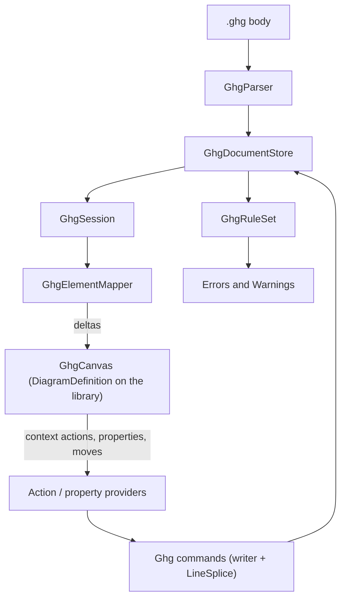

# Design Document

## Overview

The Gartner hype cycle graph is a new diagram module at `src/diagrams/gartner-hypecycle-graph/`, built declaratively on the shared canvas library over a `.ghg` document the backend owns. Like `functional-decomposition-graph`, it is built in two halves:

- **The library half** adds eleven capabilities (L1 to L11), each named for geometry or behaviour and usable by any diagram: a segmented arrow-banner shape with draggable segment boundaries, a label placed before the element, continuous attachment along an edge, one connection per pair, conditional connection visibility, snapping on resize, a rendered ruler, a canvas filter, a slider property editor, invisible anchors, and per-segment tooltips.
- **The module half** is a definition, event handlers and a backend: parser, writer, store, session, rules, providers and commands. It follows `functional-decomposition-graph` (FDG) file for file, because FDG is the newest module and already uses the shared pieces `backend-centralization` has landed (`RestoreDocumentCommand<TStore>`, `useDiagramStream`).

The library half depends on nothing and can be built first. The module half depends on L1 to L11, and each module task names the library task it waits on.

Every name in this document that does not exist yet is a proposal, marked as new where it is introduced. The design was read against `develop` at `6a11d61` on 2026-09-26.

## Steering Document Alignment

### Technical Standards (tech.md)

- **Specifying a diagram type** asks for four aspects. They are *The `.ghg` document* (file format), *Client* and *The time scale* (visualization, positions authored), *Toolbox* and *Commands* below.
- **Commands for every state change**: every edit is a command whose inverse is the shared `RestoreDocumentCommand<IGhgDocumentStore>`, which restores the document as it was before the edit, as FDG does.
- **Diagram storage**: positions are authored and live in the `.ghg` body, which ADP owns. The `.adp` registration carries only the origin line and `body:`.
- **Declaring a diagram definition**: `Diagram.cs` takes the *implemented* shape, a `public static DiagramDefinition HypeCycleGraph` property with a `Build` delegate.

### Project Structure (structure.md)

- A module adds no core code (Requirement 1). Everything under `src/client/src/canvas/library/` is shared library work, named for geometry and behaviour (Requirement 10).
- Backend types take the prefix **`Ghg`** (new), the extension the user chose, as FDG's types take `Fdg`. Namespace `EtAlii.Adp.Diagram.GartnerHypeCycleGraph`, projects `EtAlii.Adp.Diagram.GartnerHypeCycleGraph` and `.Tests`.

## Code Reuse Analysis

### Existing Components to Leverage

- **FDG's module layout**, in full: `Diagram.cs`, parser (YamlDotNet, reading only), writer (`LineSplice`), `_Model/`, store, reloader, session, session factory, document factory, rules, providers, context source resolver, and `ServiceCollection.Add…` registration. The client mirrors FDG's `register.ts`, `…Canvas.tsx`, `…Ids.ts`, `…Model.ts` and `.css`.
- **Shared backend pieces**: `LineDocument`, `LineSplice`, `AdpFileWriter`, `RestoreDocumentCommand<TStore>`, and the `new:x,y` / `rel:a->b` gesture ids.
- **Shape outlines** (`library/shapes/outline.ts`): `outlineOf`, `textRegionOf` and `outlineEdgePoint`, added for FDG. The arrow banner joins `OUTLINED_SHAPES`, so drawing, hit-testing and edge points all read one outline.
- **Width-only resize** (`sizing: "user"`, `resize` omitted), which is exactly Requirement 3.6.
- **Snap** (`SnapDeclaration`) for dragging on both axes.
- **Relation constraints** (`connectVerdict`): element types, `allowSelf`, cardinality and `acyclic` stay as they are. L4 adds one more independent check.
- **`chrome.rulers`** (`definition/chrome.ts`): `RulerDeclaration`, `RulerRung`, `resolveTicks` and `rulerRangeOf` already exist and are tested. L7 renders them rather than designing a ruler.
- **`timeline`'s tick ladder** (`timelineTicks.ts`), as the reference for tick spacing, and its `TimelineRuler.tsx` as the reference for a pinned axis.
- **The property grid** (`ContextPropertyDefinition`, `ContextPropertyEditor` in `api/context-contract.proto`, `PropertyRow.tsx`). CHOICE with candidates is how the ordered stops travel, and L10 adds a SLIDER editor that reuses them.
- **Theme contrast tests** (`theme.contrast.test.ts`, `moduleThemeContrast.test.ts`, `themeContrast.ts`).
- **`ExampleRegistrationTests`**, which already checks that every seeded example opens against the deployed catalog.

## Architecture

- **Client:** `register.ts` mounts `GhgCanvas`, a `DiagramDefinition` plus event handlers on the shared canvas library, fed by `useDiagramStream`. The filter box is library chrome (L8), so the module declares it and owns no UI.
- **Backend reading path:** `GhgSession` asks `GhgDocumentStore` for the document (read by `GhgParser`) and turns the model into library elements and connections through `GhgElementMapper`. `GhgRuleSet` reports breaches.
- **Backend editing path:** `GhgContextActionProvider` and `GhgContextPropertyProvider` produce commands; each command splices the document through `GhgWriter` and saves through the store. `GhgToolboxProvider` describes the Trend as data.
- **Client → backend:** a placement `new:x,y`, a relation gesture `rel:a->b` carrying both attachments (L3), or an element or connection id. Moves go through the stream's `moveElementTo`, resizes and boundary drags through `setProperty`, as FDG's do.
- **Backend → client:** deltas only, folded by the module's own `applyDelta`, as in every module.



## The time scale (Requirements 3, 9)

**The horizontal axis is uniform in months, not in seconds.** A trend's x is `(monthIndex(date) - monthIndex(1900-01)) * UNITS_PER_MONTH`, where `monthIndex(y-m) = y * 12 + (m - 1)`, `UNITS_PER_MONTH = 4` (new, `GhgScale`), and dates before 1900 are simply negative. Two consequences decide this:

- **Month snapping becomes a fixed step.** Every month has the same width, so `snap: { x: { step: 4, origin: 0 } }` lands every edge on the start of a month, which is Requirement 3.2 and 10.6's "calendar step against a declared time scale". The declared time scale *is* month-uniform, so the library needs no calendar arithmetic in its snap.
- **The scale is fixed, never fitted.** `timeline` freezes a fitted scale at the first model, so the same date draws at different x in different documents. A fixed origin and step make x a pure function of the date, so the backend and client convert identically and nothing is persisted but dates.

The cost is that months are drawn at equal width, which at month precision (Requirement 2.2) is invisible. A 150-year graph is 7,200 units wide.

**Vertical placement** is a row: `y = row * ROW_STEP`, with `TREND_HEIGHT = 32` and `ROW_STEP = 56` (new, `GhgScale`), a 24-unit gutter for influences to curve through (Requirement 5.3). `snap.y` is `{ step: 56 }` against the trend's leading edge, which puts its vertical middle on the row.

## Library work (Requirement 10)

Each item lands as its own task with a library test seen to fail before the change (Requirement 10.12), and names no module.

### L1 - The arrow banner and its segments (10.1)

- **New built-in shape `"arrow-banner"`** in `BuiltInShape`, `BUILT_IN_SHAPES` and `OUTLINED_SHAPES`. Outline: `(0,0) (w - p, 0) (w, h/2) (w - p, h) (0, h)`, with point depth `p = min(h/2, w/2)`.
- **New optional `segments` on `ElementTypeDefinition`** (new type `SegmentDeclaration`):
  - `count`: a binding to a number in the payload, how many segments are drawn (1 to `max`).
  - `max`: the number of segments the element can have (4 here).
  - `boundaries`: a binding to an array of fractions of the width, one per inner boundary, as the backend computed them (Requirement 3.3 and 3.4 are computed in the backend, below, so the library draws what it is given).
  - `classNames`: one class per segment index, for its fill.
  - `tooltips`: one string per segment index (L11).
  - `divider`: `"chevron"` or `"line"`. A chevron divider is a right-pointing V of depth `p` whose stroke is the `divider` token of the element's class.
- **The last visible segment ends in the point.** When `count < max`, the outline is computed over the full width and the point belongs to the last drawn segment, so a Peak-only trend is one yellow banner (Requirement 4.3).
- **Each segment exposes its own stretch of the top and bottom edges** as an attachment region for L3.
- **Guards:** a 4-segment banner draws four filled paths and three chevrons; a 2-segment banner draws two and one; each segment's path lies inside the outline (point-in-polygon on its corners). Seen to fail against a planted version that draws `max` segments whatever `count` says.

### L2 - Draggable segment boundaries (10.11)

- `SegmentDeclaration` gains **`draggableBoundaries?: boolean`**. When true, each inner boundary between two drawn segments gets a horizontal drag handle over its chevron, snapped with the element's `snap.x`.
- A drag raises **`segment-boundary-moved`** (new event) `{ elementId, index, x }`, with `x` the snapped canvas position. The library clamps it so no segment becomes narrower than one snap step (Requirement 4.6's one-month minimum).
- **Guards:** dragging boundary 1 raises the event with a snapped x; a drag past the next boundary clamps; a declaration without `draggableBoundaries` renders no handle.

### L3 - Continuous edge attachment (10.3)

- `AnchorPositions` gains **`{ kind: "along", edges: ("top" | "bottom" | "left" | "right")[], regions?: "segments" }`** (new). An element declaring it accepts a connection anywhere along those edges.
- `DiagramModelConnection` gains optional **`sourceAttachment` and `targetAttachment`** (new type `EdgeAttachment { edge, region?, at }`), `at` being a fraction 0 to 1 of the region's length (of the edge when there are no regions). The route's end point is recomputed from the element's current bounds and segment boundaries on every render, so a resize moves it proportionally (Requirement 6.3).
- `connection-drawn` carries both attachments, taken from where the gesture started and ended. The existing named-anchor path is untouched, and a connection with no attachment behaves exactly as today.
- **Guards:** a connection attached at `at: 0.25` of segment 2's top edge ends at that point; after the element doubles in width it ends at 0.25 of the new segment 2. Seen to fail against a planted version that stores an absolute offset.

### L4 - One connection per pair (10.4)

- `Cardinality` gains **`perPair?: "ordered" | "unordered"`** (new). `connectVerdict` gains a fourth independent check: the target is refused if a connection of that relation type already runs from source to target (`ordered`) or between them either way (`unordered`). **Hidden connections count** (Requirement 7.3), because the check reads the model, not what is drawn.
- **Guards:** with A → B present, `ordered` refuses A → B and allows B → A; `unordered` refuses both. Seen to fail against a planted verdict that skips the check.

### L5 - Conditional connection visibility (10.5)

- `RelationTypeDefinition` gains **`hideWhenAttachmentHidden?: boolean`** (new). When true, a connection whose source or target attachment names a segment region that is not drawn (its index ≥ the element's `count`) is not drawn, not hit-tested and not selectable. It stays in the model and the document untouched (Requirement 7.2).
- A general `when` predicate over connections was considered and not taken: the only condition any diagram needs today is this one, and a predicate language on connections would be a second copy of the label `when` for one use.
- **Guards:** lowering a trend's count from 4 to 2 removes the drawn path of a connection attached to segment 3 and keeps it in the model; raising it back draws it again.

### L6 - Snapping while resizing (10.6)

- The resize gesture applies the element's `snap.x` to the moving edge, during the gesture and on release, as dragging already does. The far edge never moves. A resize is clamped to at least one snap step.
- **Guards:** a width drag ending between two steps lands on the nearer step; `timeline`'s own resize suite passes unchanged, because it declares no `snap.x` for periods' edges.

### L7 - A rendered ruler (10.7, Requirement 9)

- `DiagramCanvas` renders every `chrome.rulers` entry whose `edge` is `"bottom"` as a strip pinned to the bottom of the viewport, in screen coordinates, whose ticks follow horizontal pan and zoom through the existing `rulerRangeOf` and `resolveTicks`. The strip does not scroll vertically (Requirement 9.1).
- `RulerRung` gains a **`decade`** rung beside month, quarter and year, so the ladder steps months → quarters → years → decades by zoom (Requirement 9.3).
- **The ruler reads the scale from its declaration**: `{ unit: "month", unitsPerStep: 4, origin: "1900-01" }`. That is the one statement of the time scale on the client, and `GhgScale` states it on the backend. A module test asserts both against one checked-in fixture.
- **`timeline` moves onto it as the last library task, only if its tick output is unchanged.** Its scale is seconds-based and fitted, so its declaration uses a seconds unit. If the move would change what `timeline` draws, the task records why and `timeline` keeps `TimelineRuler.tsx`, as Requirement 10.7 allows.
- **Guards:** the strip's top stays at the viewport's bottom minus its height after a vertical scroll; a tick at 1950-01 stays over the canvas x of 1950-01 after a pan and after a zoom.

### L8 - A canvas filter (10.8, Requirement 8)

- `DiagramDefinition` gains **`filter?: { field: string; label: string }`** (new): the payload field holding an element's tags, and the placeholder text.
- When declared, the canvas chrome shows a **filter box** at its top edge. Its text is parsed by a new pure `parseTagExpression` (`library/filter/tagExpression.ts`, new) with the grammar `expr := term ("or" term)*`, `term := factor ("and" factor)*`, `factor := tag | "(" expr ")"`, where a tag is any run of non-space characters other than the keywords and parentheses. Matching is case-insensitive.
- **A parse error** leaves the last good filter applied and shows the error under the box, naming the position (Requirement 8.4).
- **A filtered element is not drawn, and neither is any connection touching it** (Requirement 8.3). The filter is view state held by the canvas, never sent to the backend, and survives deltas.
- **Guards:** `energy and (transport or industry)` matches `[energy, industry]` and not `[energy]`; an unbalanced parenthesis is an error at its position; a filtered element's connections are not drawn. Parser guards are seen to fail against a planted parser that ignores precedence (`a or b and c`).

### L9 - Invisible anchors (10.10)

- `AnchorEnablement.visible: false` stops anchor dots being drawn, at rest and on hover. Attachment still works, and **while a connection is being drawn the valid-target highlight still shows the edge region under the pointer** (Requirement 6.5), so the gesture is not blind.
- **Guard:** an element declaring `visible: false` renders no anchor dot on hover, and still highlights as a valid target during a drag.

### L10 - A slider property editor (10.9)

- `ContextPropertyEditor` in `api/context-contract.proto` gains **`SLIDER = 4`**. Its ordered stops are the existing `candidates`, and the value is one of them.
- `PropertyRow.tsx` renders it as a range input with one stop per candidate and the current candidate's label beside it. Committing sends the candidate, exactly as CHOICE does. An editor the client does not know is still shown read-only, so older clients degrade safely.
- **Guards:** a SLIDER row with four candidates renders four stops and commits the chosen candidate; an unknown editor number still renders read-only.

### L11 - Per-segment tooltips (Requirement 4.4)

- Part of L1's declaration, listed separately because it is its own test: resting the pointer over a segment shows that segment's tooltip string, and over the point shows the last drawn segment's.

## The `.ghg` document (Requirement 2)

A YAML subset, read by YamlDotNet and edited line by line through `LineSplice`, in the style of `.tml` and `.fdg`:

```yaml
gartner-hypecycle-graph: 1
# Comments and blank lines survive every edit.
trends:
  - id: steam-engine
    name: Steam engine
    start: 1765-01
    stop: 1900-01
    row: 4
    phases: 4
    trough-end: 1800-01
    tags: [energy, industry]
    description: Watt's separate condenser onwards.
  - id: railways
    name: Railways
    start: 1825-09
    stop: 1930-01
    row: 5
    phases: 4
    tags: [transport]
influences:
  - id: steam-railways
    from: steam-engine
    from-phase: plateau
    from-edge: bottom
    from-at: 0.3
    to: railways
    to-phase: peak
    to-edge: top
    to-at: 0.1
    description: Locomotion needed a dependable engine first.
```

- **Header** `gartner-hypecycle-graph: 1`. A missing or different version opens and is reported.
- **Dates** are `YYYY-MM`, each meaning the start of that month. `start` is where the banner begins and `stop` where it ends, so the span is `stop - start`, at least one month (Requirement 3.2).
- **`phases`** is 1 to 4 (Requirement 7.1).
- **Dragged boundaries** are the optional keys `peak-end`, `trough-end` and `slope-end`, each a `YYYY-MM`. A key is written only when that boundary has been dragged, and removed by *Even phases* (Requirement 3.3 to 3.5).
- **`tags`** is a flow sequence, so adding a tag rewrites one line.
- **Influence ends** name the phase (`peak`, `trough`, `slope`, `plateau`), the edge (`top` or `bottom`) and `at`, a fraction of that phase's span with two decimals (Requirement 2.3).
- **Ids** are Base36 short ids for anything ADP creates; hand-authored ids are any non-empty token.
- **What the parser does not understand** is passed over and survives; the parser never throws, and a YAML error yields an empty model with the text kept and the problem reported with its line (Requirement 2.4).
- **Byte-identical round trip:** an unchanged document is never rewritten, and an edit rewrites only the lines of the entry it changes (Requirement 2.5). `.gitattributes` gains `*.ghg -text`, checked with `git ls-files --eol`.
- **The empty document** from `GhgDocumentFactory` is the header plus `trends: []` and `influences: []` (Requirement 2.6).

### Phase boundaries, computed once (Requirement 3.3 to 3.5)

`GhgPhases.BoundariesOf(trend)` (new) returns the drawn boundaries, and is the only place the rule lives:

1. The last visible phase ends at `stop`.
2. Each inner boundary *before* the last visible phase is its dragged date when one is stored, otherwise it is spread evenly between its nearest dragged neighbours or the trend's ends, then snapped to a month.
3. A dragged boundary at or beyond the last visible phase is kept in the document and not drawn.

The mapper sends the result as fractions of the width, so the client never recomputes the rule. **A move** shifts `start`, `stop` and every stored boundary by the same number of months. **A resize** scales each stored boundary's offset from `start` by the new span over the old, rounds to a month, and keeps each phase at least one month long.

## Backend

Each component mirrors its FDG counterpart unless noted:

- **`GhgParser`**, **`GhgWriter`** - text to `GhgModel`, and one pure splice function per edit, each returning the splice or a refusal sentence.
- **`GhgDocumentStore`**, **`GhgDocumentReloader`**, **`GhgSession`**, **`GhgSessionFactory`**, **`GhgDocumentFactory`** - lifecycle and view, as FDG's.
- **`GhgScale`** (new) - `UNITS_PER_MONTH`, the 1900-01 origin, `TREND_HEIGHT`, `ROW_STEP`, and month ↔ x conversion.
- **`GhgPhases`** (new) - phase names, full Gartner names for tooltips, and `BoundariesOf`.
- **`GhgElementMapper`** - model to library elements, sending `GhgTrendPayload { name, phases, boundaries[], tags[], width }` and `GhgInfluencePayload { from_element_id, to_element_id, source_attachment, target_attachment }` (new, `api/gartner-hypecycle-graph.proto`). Descriptions are not sent, so they cannot be drawn (Requirement 12.3).
- **`GhgRuleSet`** - Requirement 2.4's breaches (below).
- **`GhgContextActionProvider`**, **`GhgContextPropertyProvider`**, **`GhgToolboxProvider`**, **`GhgContextSourceResolver`**.
- **`ServiceCollection.AddGartnerHypeCycleGraph.cs`**.

### Rules (Requirement 2.4)

| Rule id | Breach |
| --- | --- |
| `ghg.duplicate-influence` | A second influence from one trend to another in the same direction (Requirement 6.4). |
| `ghg.self-influence` | An influence from a trend to itself. |
| `ghg.stop-before-start` | `stop` not after `start`. |
| `ghg.phase-count` | `phases` outside 1 to 4. |
| `ghg.boundary-order` | Stored boundaries out of order, or outside the span. |
| `ghg.bad-attachment` | An influence end naming an unknown phase or edge, or an `at` outside 0 to 1. |
| `ghg.dangling-reference` | `from` or `to` naming no trend. |
| `ghg.duplicate-id` | Two entries with one id. |
| `ghg.unreadable-entry` | An entry or key the parser passed over, or a malformed date. |

**The connect command refuses on the same checks the canvas makes** - self, and one per direction - so a stale or scripted request cannot write what the canvas would not offer.

## Commands (Requirement 11)

Every edit's inverse is `RestoreDocumentCommand<IGhgDocumentStore>`.

| Action | Route | Command | Notes |
| --- | --- | --- | --- |
| Add trend (toolbox drop) | `new:x,y` | `AddGhgTrendCommand` | One year long from the snapped drop month, all four phases, row from the snapped y, name "New trend" made unique (Requirement 11.1). |
| Delete trend | trend id | `RemoveGhgTrendCommand` | Removes its influences in the same edit, so undo restores both. |
| Move | `moveElementTo` | `SetGhgPlacementCommand` | Shifts `start`, `stop` and stored boundaries; sets `row`. |
| Change span | `setProperty` from `element-resized` | `SetGhgSpanCommand` | Scales stored boundaries (above). |
| Drag a phase boundary | `setProperty` from `segment-boundary-moved` | `SetGhgBoundaryCommand` | Writes that boundary's key. |
| Even phases | trend id | `ClearGhgBoundariesCommand` | Removes the three keys (Requirement 3.5). |
| Set phases | property grid slider | `SetGhgPhasesCommand` | Requirement 7.4. |
| Rename | inline editor or property grid | `RenameGhgTrendCommand` | |
| Set tags | property grid | `SetGhgTagsCommand` | Comma-separated in a LINE editor, written as a flow sequence. |
| Set dates | property grid | `SetGhgSpanCommand` | The same command as a resize. |
| Set description | property grid | `SetGhgDescriptionCommand` | Trends and influences; empty removes the key. |
| Add influence | `rel:a->b` with attachments | `AddGhgInfluenceCommand` | Refused on self or a duplicate in the same direction. |
| Move an influence end | `setProperty` from a reattach | `SetGhgAttachmentCommand` | |
| Delete influence | influence id | `RemoveGhgInfluenceCommand` | |

In read-only mode the action and property providers offer nothing that edits (Requirement 11.4); filtering is client-side and unaffected. A refusal returns the writer's sentence, shown through `action-refused`, and the document is unchanged (Requirement 11.3).

### Properties (Requirement 12)

- **Trend:** Name (LINE), Start and Stop (LINE, `YYYY-MM`, refused with a sentence when malformed), Phases (SLIDER, candidates *Peak*, *Peak and Trough*, *Peak, Trough and Slope*, *All four*), Tags (LINE), Description (TEXT).
- **Influence:** Description (TEXT), and From and To (read-only, "Steam engine · Plateau").

## Client

Files, following FDG's: `register.ts` (mime `gartner/hypecycle-graph`), `GhgCanvas.tsx`, `ghgIds.ts`, `ghgModel.ts` (`applyDelta`), `ghg.css`, `readme.md`, and their tests.

**The definition:**

- **Element type `trend`:** shape `arrow-banner`, `sizing: "user"` (width only), `segments` with `max: 4`, `count` bound to `payload.phases`, `boundaries` bound to `payload.boundaries`, `divider: "chevron"`, `draggableBoundaries: true`, class names `ghg-peak`, `ghg-trough`, `ghg-slope`, `ghg-plateau`, and tooltips the four full Gartner names.
- **Label:** one, bound to `payload.name`, placement **`before`** (new in L1's companion change to `LabelPlacement`, below), editable.
- **Anchors:** `{ kind: "along", edges: ["top", "bottom"], regions: "segments" }` with `visible: false`.
- **Relation type `influence`:** `route: "cubic-bezier"`, `endMarker: "arrow"`, `allowSelf: false`, `cardinality: { perPair: "ordered" }`, `hideWhenAttachmentHidden: true`.
- **Snap:** `x: { step: 4, origin: 0 }`, `y: { step: 56 }`.
- **Chrome:** one bottom ruler declared as in L7.
- **Filter:** `{ field: "tags", label: "Filter by tags, e.g. energy and (transport or industry)" }`.
- **Layout** `manual`; the toolbox derived from the element type.

**`before` placement** (new `LabelPlacement` value, part of L1's task because it is one line of `labels.ts` and one guard): the label's right edge is 8 units left of the element's left edge, vertically centred, end-anchored (Requirement 5.1). This is Requirement 10.2.

**Handlers** answer the library's events through the module's transport and nothing else: `element-moved` → `moveElementTo`; `element-resized` and `segment-boundary-moved` → `setProperty`; `element-dropped`, `connection-drawn`, `element-deleted`, `connection-deleted` and `label-commit-requested` → context actions.

### Colours (Requirement 4.5)

Five tokens in `src/client/src/index.css` beside the FDG ones. The fills are muted variants of the ruled colours; the chevron has its own token so it reads on every fill. Nothing else is drawn on a fill (the name sits outside), so the check that applies is WCAG 2.x's 3:1 for graphical objects, and every pair clears 4.5:1 regardless. Ratios computed from WCAG relative luminance:

| Token | Light | Dark | Chevron vs fill, light (`#475569`) | Chevron vs fill, dark (`#e2e8f0`) |
| --- | --- | --- | --- | --- |
| `--color-diagram-hype-peak` (yellow) | `#f7e7a1` | `#6b5a17` | 6.10:1 | 5.50:1 |
| `--color-diagram-hype-trough` (light gray) | `#dfe3e8` | `#475569` | 5.88:1 | 6.15:1 |
| `--color-diagram-hype-slope` (orange) | `#f6c99a` | `#7c4a1c` | 4.96:1 | 5.97:1 |
| `--color-diagram-hype-plateau` (lime green) | `#cde8a8` | `#3f6212` | 5.67:1 | 5.74:1 |
| `--color-diagram-hype-chevron` | `#475569` | `#e2e8f0` | | |

The pairs are added to `moduleThemeContrast.test.ts`, which fails below 3:1, and the new guard is seen to fail against a planted light chevron of `#cbd5e1`.

## Toolbox (Requirement 11.1)

`GhgToolboxProvider` offers one item, **Trend**, in a group **Hype cycle**, described by the backend as data. Influences are drawn, not dropped.

## Examples (Requirement 14)

`src/diagrams/gartner-hypecycle-graph/examples/technology-trends/`, seeded into `src/examples/` like every module's:

- **`technology-trends.ghg`** - about 200 trends from roughly 1760 to today, grouped by row into clusters: energy (steam, coal, electricity, oil, nuclear, solar, batteries), transport (railways, automobile, aviation, containers, electric vehicles), communication (telegraph, telephone, radio, television, Internet, mobile phones, smartphones, social media), computing (mechanical calculators, mainframes, personal computers, cloud, AI and machine learning, large language models), industry and society (industrial revolution, mass production, globalisation, automation, remote work). Each trend has plausible dates and a phase count that fits where it stands today; influences link clusters (electricity → telegraphy → telephone → mobile phones), attached to the phase in which they acted.
- It exercises every phase count, influences on each phase's top and bottom edges, at least one influence hidden by a lowered phase count, tags that make at least three meaningful filters (`energy`, `communication and computing`, `transport or energy`), dragged boundaries on some trends, and Descriptions on trends and influences (Requirement 14.3).
- **`technology-trends.adp`** - origin `gartner/hypecycle-graph`, `body: technology-trends.ghg`.
- **`readme.md`** - the purpose statement from the requirements' introduction (Requirement 14.5); why it is hand-authored; that dates and influences are illustrative, not a historical claim; and what it does not demonstrate (a document with breaches, Base36 ids, non-technology trends) (Requirement 14.4).
- A test opens the example and asserts `GhgRuleSet` reports nothing.

**Performance** (the requirements' non-functional section): 200 banners and a few hundred influences are within what the library draws today for `rdf` and `dotnet-dependency-graph` examples. The browser pass measures pan, zoom, drag and a filter change on the example, and a task is added only if one visibly lags.

## Error Handling

### Error Scenarios

1. **A document that breaks the rules**, edited outside ADP.
   - **Handling:** it opens; everything readable is drawn; each breach is a rule-set problem naming the entries.
   - **User Impact:** the panel lists what is wrong; nothing is lost or rewritten.
2. **A malformed date or truncated file.**
   - **Handling:** the parser never throws; the entry is passed over and reported with its line.
   - **User Impact:** the rest of the graph draws.
3. **A forbidden influence** reaching the backend (a stale client, a script).
   - **Handling:** the command refuses with the check's sentence.
   - **User Impact:** the refusal is shown; the document is unchanged.
4. **A malformed date typed in the property grid.**
   - **Handling:** `SetGhgSpanCommand` refuses with a sentence naming the expected `YYYY-MM`.
   - **User Impact:** the value reverts and the sentence is shown.
5. **A filter that does not parse.**
   - **Handling:** the last good filter stays applied (L8).
   - **User Impact:** the error shows under the filter box with its position.
6. **A save that fails, or the body changing on disk.**
   - **Handling:** the shared store's save result and reload rules, as FDG.
   - **User Impact:** the refusal is shown, or the canvas follows the file.

## Testing Strategy

**Every guard is seen to fail against the defect it rules out before it is trusted** (CLAUDE.md, *Bugs found during implementation or verification*).

### Unit Testing

- **Library:** the guards under L1 to L11, in the library's own test files, naming no module.
- **Parser and writer:** byte-identical round trip over fixtures with CRLF, LF, a missing final newline, comments and blank lines (after `*.ghg -text`); each edit rewrites only its entry's lines; a malformed document never throws.
- **Phases:** `BoundariesOf` over even, one-dragged, two-dragged and dragged-beyond-last-phase cases; a move keeps boundaries exact; a resize scales and snaps them and keeps each phase at least a month.
- **Rules:** one fixture per rule id with exactly that breach, and the example with none. `ghg.duplicate-influence` is also tested with A → B plus B → A, which must NOT be reported.
- **Commands:** each edit then its undo gives the original bytes; each refusal leaves them unchanged.
- **Scale:** client and backend month ↔ x conversions agree against one checked-in fixture.
- **Colours:** the contrast pairs above.

### Integration Testing

- **Module client:** the definition passes `validateDiagramDefinition`, and the `declarativeModules` guard passes against the module unchanged (Requirement 1.3).
- **Handlers:** each library event produces its one route.
- **Connect:** over the example, A → B allowed, a second A → B not highlighted, B → A highlighted, a self-influence not highlighted, and an influence hidden by a phase still blocking its duplicate.
- **Backend:** the example opens against the deployed catalog (`ExampleRegistrationTests`), and a session over it delivers every trend with its computed boundaries.

### End-to-End Testing

- **A `tests.md` entry run in a real browser**, as Requirement 16.1 lists it: banner and chevrons at each phase count in both themes; phase tooltips; the name before the banner, right-aligned; month snapping on drag and resize and row snapping; phases even until a boundary is dragged, the dragged boundary staying put and scaling with a resize; influences on each phase's top and bottom edge keeping their place on resize; a duplicate refused and the opposite direction accepted; influences hiding and reappearing with the phase count, and present in the saved file while hidden; tag filtering with and, or and parentheses; the axis pinned to the bottom while scrolling and zooming; and pan, zoom and drag on the 200-trend example without visible lag.
- **jsdom is not evidence for any of these** (Requirement 16.2).

## Requirement Coverage

| Requirement | Where |
| --- | --- |
| 1 Declarative module | Client; Code Reuse; Library work |
| 2 The document | The `.ghg` document; Rules |
| 3 Time runs left to right | The time scale; Phase boundaries; L6; Commands |
| 4 The trend's shape | L1, L2, L11; Colours |
| 5 Name and vertical placement | Client (`before` placement); The time scale (rows) |
| 6 Influences | L3, L4, L9; Client (relation type); Commands |
| 7 Phases toggled incrementally | L5, L10; Commands; Properties |
| 8 Tags and filtering | L8; Properties; Commands |
| 9 The time axis | L7; The time scale |
| 10 Library work | L1 to L11 (10.2 with L1) |
| 11 Toolbox and commands | Toolbox; Commands |
| 12 Properties | Properties; Backend (mapper sends no description) |
| 13 Inherited behaviour | Client (no module gesture, selection or label code) |
| 14 The example | Examples |
| 15 Catalog and documentation | Tasks: the catalog row moves to 📝; `creating-a-diagram-module.md` gains L1 to L11 in the definition section |
| 16 Browser confirmation | Testing Strategy, End-to-End |
