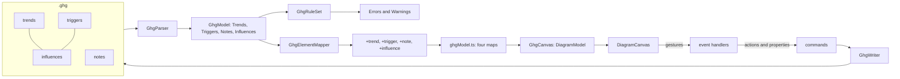

# Design Document

## Overview

Two element types join the Gartner hype cycle graph: the **trigger**, a moment in time drawn as a circle that can only be the source of an influence, and the **note**, a free-text box with no relations. Both are declarations on the shared canvas library, plus the backend's document, commands and rules for them, as every part of the module already is.

Most of what they need exists and was measured (`requirements.md`, *What was measured*, and a second read of `DiagramCanvas.tsx` at `develop` `103be1fd` for this design). Four things do not, and each is added to the library once, named for its geometry:

1. A **filter scope**: a filter that leaves elements of undeclared types alone (Requirement 8.1).
2. **Per-type width and multi-row elements in the row-packed layout** (Requirement 8.2).
3. A **named-anchor source whose drawn end attaches by edge**, so a circle starts an influence from a handle and the line leaves its outline (Requirement 8.3).
4. **Open the editor on the element a toolbox drop created**, declared per type (Requirement 7.1).

**Sequencing.** The second item edits `layout/rowPackedLayout.ts`, which exists only on `features/ghg-compact-mode` (PR #94, not yet merged at `103be1fd`). The tasks put every piece that needs it after that pull request is on `develop`, and nothing in this design is started on that branch.

## Steering Document Alignment

### Technical Standards (tech.md)

- Every behaviour is a declaration; the module holds no rendering, gesture, selection, placement or label code (Requirement 9.1).
- The backend refuses what the canvas refuses, because a request is never trusted to have come from this canvas: an influence into a trigger is refused by `AddGhgInfluenceCommandHandler` and reported by `GhgRuleSet` (Requirement 3.2).
- The parser never throws, and edits splice lines, so an unchanged document is byte-identical (Requirement 1.4, 1.5).

### Project Structure (structure.md)

- Library additions live under `src/client/src/canvas/library/` and are proven by library tests seen to fail first (Requirement 8.4).
- Module changes stay in `src/diagrams/gartner-hypecycle-graph/`: `client/`, `api/`, `backend/` and the fixtures beside its tests.

## Code Reuse Analysis

### Existing Components to Leverage

| Need | Reused as it is | Evidence |
| --- | --- | --- |
| The circle | `shape: "ellipse"`, `sizing: "model"`, width equal to height | `BUILT_IN_SHAPES` |
| Name and date left of the circle, editing only the name | One label, `placement: "before"`, `text` a template `{payload.name} · {payload.when}`, `editable: true`. The inline editor opens with `element.label`, not the drawn text, so it edits the name alone | `DiagramCanvas.tsx`, the `before` branch of the editor placement; `labels.ts` marks a single-line template editable |
| *Trigger* on hover | `ElementTypeDefinition.tooltip`, drawn as the element's `<title>` | `DiagramCanvas.tsx`, element group |
| Wrapped, multi-line, in-place note text | `labels: [{ wrap: true, editable: true }]`, `sizing: "user"`, `resize: "both"`, anchors disabled | FDG's `COMMENT_TYPE` |
| Trigger as source only | `endpoints.source.elementTypes: [trend, trigger]`, `endpoints.target.elementTypes: [trend]` | `relationOnto`, `sourceAdmits` check each end's type |
| One influence per ordered pair | `cardinality: { perPair: "ordered" }` matches on relation type and ids only, so it holds across element types | `connectVerdict` |
| Hide an influence whose target phase is hidden | `hideWhenAttachmentHidden` ORs both ends and treats an end with no region as never hidden | `drawnConnections` |
| Only the target end movable | `movableEnds` draws a handle only on an end with an along-attachment; a trigger's end has none | `DiagramCanvas.tsx`, end handles |
| Snap a circle's centre to the step lines and row middles | `SnapAxis.origin` is a `DeclaredNumber` resolved per element on every drag frame and on release; the leading edge snaps to `origin + k * step`, so an origin offset by half the circle puts its centre on the line | `dragLanding`, `snapLeadingEdge` |
| Filter by tags, and tag suggestions | `FilterDeclaration` with `field: "payload.tags"` | `tagsByElement`, `filteredOut` |
| Toolbox items as data, dropped as their action id | `GhgToolboxProvider`; `ToolboxPanel` drags `item.dropActionId` | `ToolboxPanel.tsx` |
| Line-splice edits and insertion into a top-level list | `LineSplice.InsertionPointFor`, `IndentOf`, the writer's key orders | `GhgWriter.cs` |

### Integration Points

- **The `.ghg` document** gains two top-level lists; the version stays 1 (Requirement 1.6).
- **The wire** gains two payloads and two element types, `gartner/hypecycle-graph+trigger` and `gartner/hypecycle-graph+note`.
- **ghg-compact-mode's row-packed layout** gains a type list and a row step (Requirement 8.2).

## Architecture



### The document

```yaml
gartner-hypecycle-graph: 1
unit: year
trends:
  - id: transistors
    ...
triggers:
  - id: transistor-invented
    name: Transistor invented
    date: 1947-12
    row: 3
    tags: [electronics, invention]
    description: Bardeen, Brattain and Shockley at Bell Labs.
notes:
  - id: note-1
    text: |-
      Dates are illustrative.
      See the readme.
    at: 1950-01
    row: 0
    width: 160
    height: 64
influences:
  - id: i-12
    from: transistor-invented
    to: transistors
    to-phase: peak
    to-edge: top
    to-at: 0.2
```

- `triggers` keys, in write order: `id`, `name`, `date`, `row`, `tags`, `description` (Requirement 1.1).
- `notes` keys, in write order: `id`, `text`, `at`, `row`, `width`, `height`. `text` is written as a YAML literal block (`|-`) whenever it holds a line break and as a plain or quoted scalar otherwise, so an unchanged note is byte-identical. `at` is the month of the left edge and `row` the row of the top edge; `width` and `height` are canvas units, because a note is a box of text and not a span of time: changing the document's `unit` redraws trends at a new scale and leaves notes their size (Requirement 1.2).
- An influence from a trigger writes no `from-phase`, `from-edge` or `from-at` (Requirement 1.3). The parser reads an influence whose `from` names a trigger with an empty `GhgEnd`, and ignores any `from-*` keys it finds there after reporting them.
- Where a list is missing, `AddTrigger` and `AddNote` insert it: `triggers:` after the `trends` list and `notes:` after `triggers` (or after `trends`), and before `influences`. A document without either is written exactly as today (Requirement 1.5).
- Ids are unique across trends, triggers, notes and influences together, as they already are across trends and influences (Requirement 1.4).

### The backend model

| Record | Fields |
| --- | --- |
| `GhgTrigger` | `Id`, `Name`, `Date` (month index, null when unreadable), `Row`, `Tags`, `Description`, `Range` |
| `GhgNote` | `Id`, `Text`, `At` (month index, null when unreadable), `Row`, `Width`, `Height`, `Range` |
| `GhgModel` | gains `Triggers` and `Notes`, both defaulting to empty so every existing construction compiles |
| `GhgInfluence.FromEnd` | unchanged type; empty (`Phase` "", `At` null) for a trigger source |

`GhgElementMapper` sends a trigger at its centre, `(XOf(Date), TopOf(Row) + TrendHeight / 2)`, and a note at its centre, `(XOf(At) + Width / 2, TopOf(Row) + Height / 2)`. Viewport filtering pulls in both ends of each influence, triggers included, as it does trends.

### Rules

`GhgRuleSet` gains three rules and widens two:

| Rule | What it reports | Requirement |
| --- | --- | --- |
| `influence-into-trigger` (new) | An influence whose `to` names a trigger. | 1.4, 3.2 |
| `trigger-date` (new) | A trigger without a readable `date`. | 1.4 |
| `note-position` (new) | A note without a readable `at`, or a `width` or `height` that is not a positive number. | 1.4 |
| `duplicate-id` (widened) | An id shared by any two entries across the four lists. | 1.4 |
| `dangling-reference` (widened) | An influence whose `from` names neither a trend nor a trigger, or whose `to` names no trend. | 1.4 |
| `bad-attachment` (narrowed) | No longer reports a missing `from-*` end when `from` is a trigger. | 1.3 |
| `duplicate-influence` | Unchanged: it groups by ordered id pair, so it already covers a trigger source. | 3.3 |

### Commands

Each is a command with an inverse, offered through `GhgContextActionProvider` or `GhgContextPropertyProvider` (Requirement 7.3):

| Change | Command | Notes |
| --- | --- | --- |
| Add a trigger | `AddGhgTriggerCommand` (action `ghg.add.trigger`) | At the placement's month and the row under it, name `Trigger`, no tags. |
| Add a note | `AddGhgNoteCommand` (action `ghg.add.note`) | At the placement's month and row, empty text, 160 by 64. |
| Delete | `RemoveGhgTrendCommand` becomes `RemoveGhgElementCommand` | A trigger takes its influences with it and undo restores them (Requirement 3.5); a note has none. The action id `ghg.remove` does not change. |
| Move | `SetGhgPlacementCommand` | Widened to triggers (date and row from the centre) and notes (`at` and `row` from the top-left). |
| Rename | `RenameGhgTrendCommand` becomes `RenameGhgElementCommand` | A trend's or trigger's `name`, or a note's `text`. Action `ghg.rename` does not change. |
| Resize a note | `SetGhgNoteSizeCommand` | Property `ghg.size`, `width x height`, and `at` when the left border moved. |
| Date | `SetGhgSpanCommand` gains the trigger's single date | Property `ghg.date`. |
| Tags, Description | `SetGhgTagsCommand`, `SetGhgDescriptionCommand` | Widened to triggers. |
| Add an influence | `AddGhgInfluenceCommand` | `RefusalFor` admits a trend or trigger as `from` and only a trend as `to`, with the sentence *"An influence cannot end at a trigger."* A trigger source keeps an empty `FromEnd` instead of the default phase. |

`GhgContextPropertyProvider` offers a trigger's Name, Date, Tags and Description, and a note's Text, in the groups a trend's use (Requirement 7.2). Every edit command is refused on a read-only diagram, as today (Requirement 7.5).

### The wire

```proto
message GhgTriggerPayload {
  string name = 1;
  repeated string tags = 2;
  string unit = 3;
  string when = 4;       // the date in the diagram's unit: "Dec 1947", or "1947" for year and coarser (Q2)
  string when_long = 5;  // for the tooltip: "December 1947", or "1947"
  double snap_x = 6;     // the snap origin that puts the centre on a step line
  double snap_y = 7;     // the snap origin that puts the centre on a row's middle
}

message GhgNotePayload {
  string text = 1;
  double width = 2;
  double height = 3;
}
```

`GhgTrendPayload` gains `snap_x` and `snap_y`, both 0, so every type binds the same two paths. The backend formats the date, because it owns the unit; the client draws what it is sent.

### The client definition

The trend type is unchanged except for its snap. The two new types:

```ts
{
  id: GhgElementTypes.trigger,
  shape: "ellipse",
  classNames: [{ className: "canvas-element ghg-trigger", on: "element" }],
  labels: [{ text: { template: "{payload.name} · {payload.when}" }, placement: "before", editable: true, className: "canvas-node-label ghg-label" }],
  tooltip: { template: "Trigger: {payload.name}, {payload.whenLong}" },
  anchors: { kind: "compass", positions: ["n", "e", "s"], attachDrawnBy: "edge" },
  sizing: "model",
},
{
  id: GhgElementTypes.note,
  shape: "box",
  classNames: [{ className: "canvas-element ghg-note", on: "element" }],
  labels: [{ text: { path: "payload.text" }, wrap: true, editable: true, className: "ghg-note-text" }],
  anchors: { kind: "edge", enabled: false, visible: false },
  sizing: "user",
  resize: "both",
  editOnDrop: true,
},
```

- The trigger's size is `GhgScale.trendHeight / 2`, 16, both ways (Requirement 2.1, 2.5).
- The influence relation widens its source to `[trend, trigger]`; its target stays `[trend]` (Requirement 3.1, 3.2).
- `snap` binds its origins: `x: { step: unitsPerMonth, origin: { path: "payload.snapX" } }`, `y: { step: rowStep, origin: { path: "payload.snapY" } }`. For a trigger `snapX` is `-8` and `snapY` is `(trendHeight - 16) / 2`, 8, so its centre rests on a step line and on the row's middle (Requirement 2.4). A note binds 0 and 0 and snaps as a trend does (Requirement 4.3).
- `filter.elementTypes: [trend, trigger]` (Requirement 5.2, 5.3).
- `layout.rowPacked.types: [trend]` and `rowStep: GhgScale.rowStep`; `modeOverrides["row-packed"].elementTypes` lists the compact trend, the trigger with `draggable: false`, and the note with `sizing: "model"` and `draggable: false` (Requirement 6.1 to 6.3).
- The toolbox is the backend's three items, Trend, Trigger and Note (Requirement 7.1).
- Colours: `--color-diagram-hype-trigger` for the circle and `--color-diagram-hype-note` and `--color-diagram-hype-note-text` for the note, defined in both themes in `index.css` and added to `theme.contrast.test.ts` (Requirement 4.5).

`ghgModel.ts` gains a `triggers` and a `notes` map and a branch per wire type in `applyDelta`. The handlers change as follows: `onElementDropped` forwards `ghg.add.trigger` and `ghg.add.note` as it forwards `ghg.add.trend`; `onElementMoved` subtracts each element's own half-size to reach the top-left the backend expects; `onElementResized` sends a note's size; `onConnectionDrawn` is unchanged, since `gestureEnd` already sends a bare id for an end with no attachment.

### Library additions

**1. Filter scope** (`FilterDeclaration.elementTypes?: readonly string[]`). `tagsByElement` skips elements of types outside the list, so `filteredOut` never contains them and they stay visible, with their connections. Their tags are not offered as suggestions. Omitted means every type, which is today's behaviour. Test: a filter scoped to one type keeps an untagged element of another visible; seen to fail on today's canvas (Requirement 8.1).

**2. Row-packed per type and across rows** (`RowPackedDeclaration.types?: readonly string[]`, `rowStep?: number`). The declared width applies to elements of the listed types; every other element keeps its own width and height. Every element still takes part in the placement, sorted by its manual left edge. With `rowStep` declared, an element occupies every row line between its top and bottom, `floor(top / rowStep)` to `floor((bottom - 1) / rowStep)`, and its group's x must clear `rowEnd` on each of them; without it, the element's row is keyed by its centre, as on the compact-mode branch. The four properties ghg-compact-mode's tests prove (time order, no overlap, leftmost, determinism) are re-proven with mixed widths and a two-row element, and `inverse` is unchanged, since it reads placed and manual x only (Requirement 6.1, 6.3, 6.4, 8.2).

**3. A named-anchor source drawn by edge** (`AnchorEnablement.attachDrawnBy?: "anchor" | "edge"`). Today an element with `kind: "edge"` anchors has no start handle (`anchorPoints` returns none), so it cannot start a left-drag connect. A circle therefore declares three compass anchors, top, right and bottom (the user, in chat on 2026-09-27: "three influence handles, top, bottom and right"), which give it handles on its outline, and `attachDrawnBy: "edge"` tells the canvas to draw a connection's end on that element by edge intersection towards the other end, whatever anchor started it, and to leave the anchor name out of `connection-drawn`. So the line leaves the circle facing its target, and the document stores nothing for that end. Test: a connection drawn from a compass anchor of such a type ends on the outline facing the target and reports no source anchor (Requirement 3.1, 8.3).

**4. Edit on drop** (`ElementTypeDefinition.editOnDrop?: boolean`). When a toolbox drop of an item is raised, the canvas remembers the drop point and the time. The first model update that brings a new element whose type declares `editOnDrop`, and whose bounds contain the drop point after the active layout's inverse, has that element selected and its editable label's editor opened. The memory is cleared by that match, by any other gesture, or after five seconds, so a slow backend never opens an editor on something the reader did not just drop. Test: a drop followed by a model carrying a new note opens its editor; a model carrying a new element somewhere else does not (Requirement 7.1).

Each is proven by a library test seen to fail before the change, and none names a module (Requirement 8.4). Each is documented in `docs/creating-a-diagram-module.md` where the definition is described (Requirement 11.1).

## Components and Interfaces

### Library (`src/client/src/canvas/library/`)

- **`definition/diagramDefinition.ts`**: `FilterDeclaration.elementTypes`, `AnchorEnablement.attachDrawnBy`, `ElementTypeDefinition.editOnDrop`, `RowPackedDeclaration.types` and `rowStep`.
- **`definition/validateDiagramDefinition.ts`**: rejects an `elementTypes` or `types` entry naming no declared type, and `attachDrawnBy` on `along` anchors.
- **`DiagramCanvas.tsx`**: the filter scope in `tagsByElement`; the edge-drawn end in the connection geometry and in `connection-drawn`; the drop memory and the editor opening.
- **`layout/rowPackedLayout.ts`**: per-type width and row coverage.

### Module (`src/diagrams/gartner-hypecycle-graph/`)

- **`api/gartner-hypecycle-graph.proto`**: `GhgTriggerPayload`, `GhgNotePayload`, and the trend payload's snap origins.
- **Backend**: `_Model/GhgTrigger.cs`, `_Model/GhgNote.cs`, `GhgModel`, `GhgParser`, `GhgWriter`, `GhgRuleSet`, `GhgElementMapper`, `GhgToolboxProvider`, `GhgContextActionProvider`, `GhgContextPropertyProvider`, `GhgContextSourceResolver`, and the commands in the table above.
- **Client**: `ghgIds.ts` (types, actions, properties), `ghgModel.ts`, `GhgCanvas.tsx`, `ghg.css`.

## Data Models

The document shapes are under *The document*, the backend records under *The backend model*, and the wire under *The wire*. Nothing is removed from any of them.

## Error Handling

| Situation | Handling | Requirement |
| --- | --- | --- |
| A trigger or note entry the parser cannot read | Passed over, kept in the document, reported to the panel. | 1.4 |
| An influence into a trigger in the document | Opens and is drawn, since both ends exist; reported by `influence-into-trigger`. | 1.4 |
| An influence into a trigger requested by a gesture or a property | Not offered by the canvas; refused by the backend with its sentence, document unchanged. | 3.2, 7.4 |
| A note resized smaller than its text | The text ends in an ellipsis and the whole text is its tooltip. | 4.1 |
| A drop whose element never arrives | The edit-on-drop memory expires; nothing opens. | 7.1 |

## Testing Strategy

### Unit Testing (library, vitest)

One test per library addition, each written first and seen to fail against the unchanged library, then passing (Requirement 8.4). The row-packed tests extend the compact-mode property tests with a mixed-width, multi-row population.

### Module Testing

- **Backend (xunit)**: fixtures `triggers-and-notes.ghg` and `rule-influence-into-trigger.ghg`, `rule-trigger-date.ghg`, `rule-note-position.ghg`; parser round-trips byte-identical, including a note whose text is a literal block and a document with neither list (Requirement 1.5); writer inserts the missing lists; every command with its inverse; the refusal of an influence into a trigger; removing a trigger restores its influences on undo; property provider groups. `.ghg` is already `-text` in `.gitattributes`, so the new fixtures are byte-compared as they are.
- **Client (vitest)**: the definition (types, relation ends, snap origins, filter scope, compact overrides); `applyDelta` for the two new wire types; the handlers for the three drops, a note's resize and a trigger's move.

### Example testing

The nine example tests (`GhgDigitalExample.Tests.cs`, `GhgErasExample.Tests.cs`, `GhgEnergyAndAgentsExamples.Tests.cs` and those for the rest, with their client counterparts) are updated to the new counts, and each asserts the validator reports nothing and that the example holds at least one trigger with an influence (Requirement 10.1, 10.4).

### End-to-End Testing

A `tests.md` entry covers Requirement 11.3 in a real browser in both themes. jsdom is not taken as evidence of any of it (Requirement 11.4).

## The examples

For each of the nine examples, the implementer:

1. Lists the trends that are a moment rather than a span, such as a single invention, a treaty, a disaster or a launch, and rewrites each as a trigger at its month, keeping its id, name, tags and description. An influence it sent becomes one from the trigger; one it received is dropped and named in the readme (Requirement 10.2).
2. Adds real, dated triggers that set trends off (inventions, political moments, natural disasters), each with at least one influence to a phase that matches when it acted (Requirement 10.1).
3. Re-lays out the file: triggers on the row of, or the row next to, the trend they influence most; rows compacted so none is left empty without reason; labels checked against their neighbours so no trigger's name and date runs into a trend (Requirement 10.3).
4. Opens it in true-time and in compact mode in the browser and adjusts until it reads well; updates its readme to list the trends that became triggers, and its tests to the new counts (Requirement 10.3, 10.4).

At least one example gets a note (Requirement 10.5). The examples live in both `src/examples/diagrams/gartner-hypecycle-graph/` and the module's own `examples/` folder, and each is changed in both places so the two copies stay identical.

## Documentation

- `docs/creating-a-diagram-module.md`: the four library additions (Requirement 11.1).
- `docs/diagrams.md`: the `gartner/hypecycle-graph` row mentions triggers and notes and names this specification (Requirement 11.1).
- The Notion *Gartner HypeCycle Graph* entry's implementation details, examples and purpose, after the implementation merges; the coordinator routes this to the thread that owns the Notion page (Requirement 11.2).
- The module's `readme.md` describes triggers and notes.
