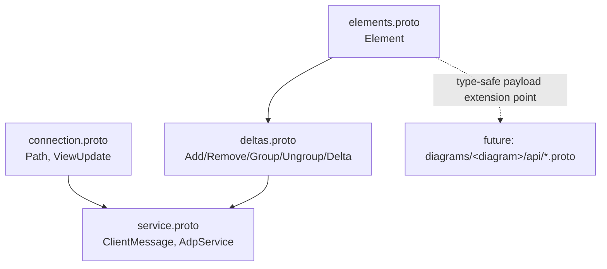

# Design Document

## Overview

This design defines the core gRPC `.proto` contract for EtAlii.Adp: the wire messages and service that let any viewing application (browser or desktop) initialize a connection against a file path, report its view, and receive a stream of typed deltas (`add`/`remove`/`group`/`ungroup`) describing elements to render. The deliverable is the `.proto` file(s) themselves — no server or client implementation code. This is a greenfield contract; the repository currently has no source code, so there is nothing existing to integrate with beyond the conventions already captured in `tech.md` and `structure.md`.

## Steering Document Alignment

### Technical Standards (tech.md)

* Uses gRPC bidirectional streaming per the "Bi-directional gRPC for frontend-backend communication" decision.
* Elements carry deltas (`add`/`remove`/`group`/`ungroup`), consistent with the "Frontend-backend synchronization" section's delta-based model.
* View information (center + bounding box) is sent client → backend, matching the documented virtualization approach where the backend remembers per-connection view state.
* Namespacing follows the `EtAlii.Adp.<Area>` (.NET) / `com.etalii.adp.<area>` convention; here `<Area>` is `Core`.

### Project Structure (structure.md)

* The contract lives in the shared `api/` folder under `src/`, as the common ground both backend and frontend build against — separate from any `diagrams/<diagram>/api/` folder, which is reserved for diagram-specific element messages.
* File names are plain, self-explanatory `snake_case.proto`, since `.proto` files are the primary API documentation per the documentation standards.

## Code Reuse Analysis

The repository has no existing source code (`src/` does not exist yet) — this is the first contract artifact. There is nothing to extend or reuse; this design instead establishes the extension points (Requirement 4's mime-typed element payload) that later diagram-module specs will build on.

### Existing Components to Leverage

* None — greenfield.

### Integration Points

* **`grpc-core-communication` (behavior spec)**: will implement the service defined here (backend-side connection/streaming logic, client-side consumption).
* **Future diagram module specs**: will define their own element payload messages (e.g. `mindmap/node`) packed into `Element.payload`, without modifying these files.

## Architecture

Four `.proto` files under `src/api/`, all in a single `etalii.adp` package (`EtAlii.Adp` for the generated C# namespace), split by concern so each file stays single-purpose per the modularity principle in `structure.md`:

* `connection.proto` — the path-based connect message and the view-update message (geometry types included).
* `elements.proto` — the extensible, mime-typed element message.
* `deltas.proto` — the `add`/`remove`/`group`/`ungroup` delta envelope, built on `elements.proto`.
* `service.proto` — the client message envelope and the `AdpService` bidirectional-streaming RPC, tying the other three together.



### Modular Design Principles

* **Single file responsibility**: connection/view concerns, element concerns, and delta concerns are defined in separate files; `service.proto` only wires them together.
* **No upward or diagram-specific coupling**: none of these files import anything from `diagrams/<diagram>/api/`; the dependency direction only goes the other way (future diagram protos will import `elements.proto` to pack their payload).

## Components and Interfaces

### `connection.proto`

* **Purpose:** Defines how a viewing application addresses a file (Requirement 1) and reports its viewport (Requirement 2).
* **Messages:** `Path`, `Point2D`, `BoundingBox`, `ViewUpdate`.
* **Dependencies:** None beyond proto3 built-ins.
* **Reuses:** N/A (first file).

### `elements.proto`

* **Purpose:** Defines the extensible, mime-typed visual element (Requirement 4).
* **Messages:** `ElementId`, `Element`.
* **Dependencies:** `google/protobuf/any.proto` (for the type-safe extension point).
* **Reuses:** N/A.

### `deltas.proto`

* **Purpose:** Defines the four delta actions and their envelope (Requirement 3).
* **Messages:** `Add`, `Remove`, `Group`, `Ungroup`, `Delta`.
* **Dependencies:** `elements.proto` (for `Element`/`ElementId`).
* **Reuses:** `elements.proto`.

### `service.proto`

* **Purpose:** Defines the single core service and the client-to-backend message envelope (Requirement 5).
* **Messages/Service:** `ClientMessage` (oneof of `Path` / `ViewUpdate`), `AdpService.Connect` (bidirectional stream).
* **Dependencies:** `connection.proto`, `deltas.proto`.
* **Reuses:** `connection.proto`, `deltas.proto`.

## Data Models

### `Path` (connection.proto)

```protobuf
message Path {
  // Ordered path segments. The leading segments resolve to a file within
  // the workspace; any additional segments address a location/sub-scope
  // within that file.
  repeated string segments = 1;
}
```

### `Point2D` / `BoundingBox` / `ViewUpdate` (connection.proto)

```protobuf
message Point2D {
  double x = 1;
  double y = 2;
}

message BoundingBox {
  Point2D min = 1;
  Point2D max = 2;
}

message ViewUpdate {
  Point2D center = 1;
  BoundingBox bounding_box = 2;
}
```

### `ElementId` / `Element` (elements.proto)

```protobuf
message ElementId {
  string value = 1;
}

message Element {
  ElementId id = 1;
  Point2D position = 2;      // imported from connection.proto
  string type = 3;           // mime-style, e.g. "mindmap/node"
  google.protobuf.Any payload = 4; // type-specific message, defined per diagram module
}
```

### `Add` / `Remove` / `Group` / `Ungroup` / `Delta` (deltas.proto)

```protobuf
message Add {
  repeated Element elements = 1;
}

message Remove {
  repeated ElementId element_ids = 1;
}

message Group {
  repeated ElementId source_element_ids = 1;
  Element group_element = 2;
}

message Ungroup {
  ElementId group_element_id = 1;
  repeated Element elements = 2;
}

message Delta {
  oneof action {
    Add add = 1;
    Remove remove = 2;
    Group group = 3;
    Ungroup ungroup = 4;
  }
}
```

### `ClientMessage` / `AdpService` (service.proto)

```protobuf
message ClientMessage {
  oneof payload {
    Path connect = 1;       // expected as the first message on the stream
    ViewUpdate view_update = 2;
  }
}

service AdpService {
  rpc Connect(stream ClientMessage) returns (stream Delta);
}
```

## Error Handling

This spec defines the contract only; runtime error handling (rejecting an unresolved path, enforcing that `connect` is the first message, auth failures) is the responsibility of the `grpc-core-communication` behavior spec and is out of scope here. The one contract-level consideration is representational: gRPC's standard status/error mechanism (`google.rpc.Status` via trailing metadata, or a plain `Status` error on the stream) is sufficient for that later spec's needs and requires no additional message types in this contract.

## Testing Strategy

### Unit Testing

* Not applicable in the traditional sense — there is no executable logic in this spec's deliverable.

### Contract Validation

* Each `.proto` file SHALL parse and compile cleanly. This will be verified during implementation using a throwaway local `protoc`/`Grpc.Tools` codegen pass (not checked into the repository) to confirm valid syntax, correct imports, and successful C# stub generation before the task is marked complete.

### Integration Testing

* Deferred to the `grpc-core-communication` spec, which will exercise the generated stubs against real connection/streaming behavior.