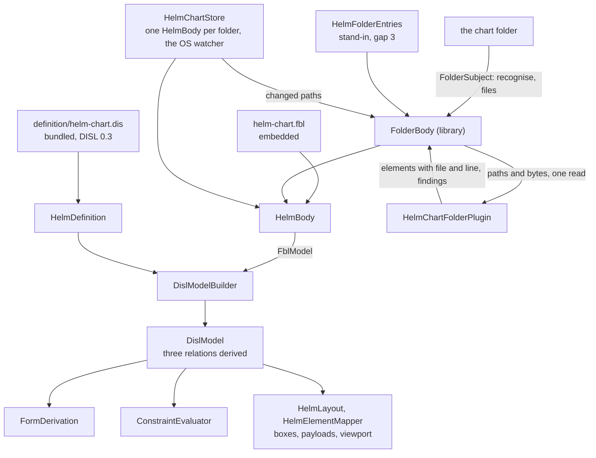

# Design Document

## Overview

The Helm chart diagram is converted in **eight steps, each one pull request, each held to one frozen transcript**. The transcript is generated from today's hand-written code first (step 1). Every later step replaces one hand-written part by its derived or bound equivalent and must reproduce the transcript byte for byte. No step regenerates it: Q3 and Q4 keep today's behaviour by default, so this conversion names no visible change.

The tool never writes its subject, so there is no writer, no command and no edit script. The conversion is **derivation** (step 4) and **reading** (step 6), kept in separate steps, with the library work each needs landed before it (steps 3 and 5).

The module ends as its bundled definition, its binding, one plugin and the host code of Requirement 6.1. Three classes carry the conversion:

- `HelmDefinition`: the bundled DISL definition loaded once, and what is derived from it (rows, findings, the refusal), mapped to today's ids by its `x-helm` block. Its model is `DotNetDefinition`'s shape.
- `HelmBody`: one chart folder opened through the module's FBL binding with the library's new folder body, giving the plugin's reading and the DISL model built from it.
- `HelmChartFolderPlugin`: `IPersistencePlugin` with the id `net.etalii.adp.helm.chartFolder`. It holds today's reading, working from the files it is handed.

Four small classes stand in for language gaps, each named for its gap and deleted when the gap is answered (*Components*). **One point of the approved requirements is proposed for a small amendment**, in *Amendment proposed*. It concerns the wording of Requirement 5.2 and changes no behaviour.

## Steering Document Alignment

### Technical Standards (tech.md)

- *Specifying a diagram type*: the definition lives in etalii-adp/etalii.adp and is bundled by `bundle-disl.sh`, never edited here. The binding is the module's own embedded file and the definition names it by URL.
- A folder subject has no document extension and no document factory. That stays: the registration is all ADP contributes, and a position is written by core's `SetRegistrationLayoutCommand`.
- The four gates, the transcript and "a test seen to fail first" are the checks of every step. `ZeroWrites.Tests.cs` passes unchanged through all eight.

### Project Structure (structure.md)

- A diagram type adds declarations and no core code. What the libraries lack is added to `EtAlii.Adp.Specification.Fbl` and `EtAlii.Adp.Specification.Disl` for every tool, named for what it does, with no module name in the change.
- The module gains `definition/` (bundled) and one embedded `.fbl`. The test project gains `Parity/`.

## Code Reuse Analysis

### Existing Components to Leverage

Each was opened and its members checked for this design.

- **`BundledDefinition.Load`, `WireIdMap.Of` and `PropertyId`, `FormDerivation.Derive`, `ConstraintEvaluator.Evaluate`, `DislModelBuilder.From`, `DislEnv(ReadOnly: true)`** (`EtAlii.Adp.Specification.Disl`). `FormDerivation` already reads a form item's `display`, `visible` and `readOnlyReasons` and falls back to `std.readOnly` on a read-only diagram. `ConstraintEvaluator` already reads `forEach`, a rule's `code`, a built-in's computed `code` and `oncePerGroup`, and `constraints.order`.
- **A relation without a target is already carried.** `DislRelationEnd.Optional` exists, `DislModelBuilder.From` keeps a stored relation whose target id is null, `ConstraintEvaluator.References` is silent for an `optional` target end, and `DislDiagram.AddRelation` takes a null target. Finding A5 is confirmed as written: `DerivedRelations` drops an item whose target is not an element, through its own `Allows`.
- **`DislSpecification.IdRuleOf`** walks a type's linearisation, so a subtype takes its base type's id rule. The design uses that for the partial (*Data Models*).
- **`DotNetDefinition.cs`**: the pattern for a read-only tool on DISL: one loaded definition, `Rows`, `Refusal` read from `behavior.messages`, and a `DislDiagram` built from the module's own reading. Step 4 copies it.
- **`FolderSubject.Recognise` and `FolderSubject.Files`** (`EtAlii.Adp.Specification.Fbl`): recognition, selection by first matching file rule, `ignore`, ordinal order, no reparse point. The folder body is built on them and changes neither.
- **`IPersistencePlugin`, `PluginReadRequest`, `PluginFile`, `PluginReadResult`, `Finding` with `SourceLocation`**: the contract as data. `MindmapFreeplanePlugin` is the pattern for a plugin that reads with the module's own reader and refuses every plan.
- **The hype cycle's and the timeline's `Parity/` folders** (`GhgTranscript.cs`, `TranscriptText.cs`, `HandWrittenGhg.cs`, `GhgDerivedRows.Tests.cs`, `GhgDerivedFindings.Tests.cs`): the generator, the comparison and the derived-against-hand-written tests are copied in shape.
- **`SetRegistrationLayoutCommand` and `RegistrationLayout`** (core): positions are written and read as today. The library's `OpenRegistration` is not used, so `fbl.stale-view-data` cannot appear (Q4).
- **`parseDisl`, `compileNotation`, `NotationBindings.customRoutes`, `forwardBezierPath`** (client): the forward Bézier is already shared in `@client/canvas/connectors` and already bindable as a custom route, so it needs no library work.
- **`DiagramProblemSeverity.Info`** exists. It is not used here (Q3).

### Integration Points

- **etalii-adp/etalii.adp**: `definitions/diagrams/helm-chart.dis` and `.md` are rewritten there, and `specifications/fbl/helm-chart.fbl` is brought in line with the module's binding (step 2), through that repository's pull request and checks. Step 3 cannot bundle before that pull request is merged.
- **`ansible-structure-disl-fbl`** asks for the same library work in its Requirements 8.1, 8.2 and 7.2: the folder body, a finding's file with a rule's `location`, and the `stub` in `compileNotation`. Neither requirements document says which specification delivers first. The items are **shared and delivered once**: whichever of the two reaches its library step first lands them, and the other proves them with its own fixtures and adds only what it still lacks. `c4-disl-fbl` (finding A5) also needs `location()`.
- **`EtAlii.Adp.Specification.Fbl.Tests`**: the vendored example binding is vendored again once etalii.adp has the repaired one. `ModuleCrossCheck.Tests` gains the Helm case at step 6.

## Architecture

### The steps

| Step | What changes | Held by | Depends on |
| --- | --- | --- | --- |
| 1 | The transcript, its generator, the eleven new fixture charts of Requirement 1.2 and the test that today's code reproduces it, seen to fail against a changed sentence. No product code changes. A *read* finding a fixture does not show is struck as a small amendment (8.4). | 1; 8.4 | Nothing |
| 2 | In etalii.adp: the definition at DISL 0.3 with `language.origin`, `persistence.format: "fbl"`, the id strategy, `x-helm`, the constructs of finding A2; the companion rewritten; the example binding repaired. | 2.1 to 2.4; 3.1 | A pull request in etalii.adp |
| 3 | DISL library work D1 to D4. The definition bundled, embedded and loaded with no error; `BundledDefinition.Tests`. Nothing derives from it yet. | 2.5; 5.7 | Step 2 merged |
| 4 | **Derivation.** Rows, findings and the refusal come from `HelmDefinition`. The model is built from today's `HelmChart` and `HelmGraph` by a small adapter, `HelmDisl`, so reading is unchanged. `Declares`, `Overrides` and `Configures` are derived by DISL and leave `HelmGraph`. `HelmRuleSet` and the property provider's logic move to `Parity/HandWrittenHelm.cs`. | 5.1 to 5.6, 5.8; 6.2 | Step 3 |
| 5 | FBL library work F1 to F6: the folder body. No module changes. | 4 | Nothing; may land before step 3. Shared with `ansible-structure-disl-fbl` |
| 6 | **Reading.** The binding embedded; `HelmChartFolderPlugin`; `HelmBody`; the model built by `DislModelBuilder` from the folder body's reading; `HelmDisl` deleted; the store reduced; `HelmWatchedFolder` deleted; the cross-check added. | 3; 4.5 in use; 6.1, 6.2; 8.5 | Steps 4 and 5 |
| 7 | The client compiles its canvas definition; today's stays in a test as the oracle; library work C1; the `tests.md` entry. | 7 | Step 3. C1 shared with `ansible-structure-disl-fbl` |
| 8 | The companion's table of remaining classes and of gaps; the delivery report; documentation and catalog. | 6.3; 8.1 to 8.3; 9 | Steps 6 and 7 |

Steps 4 and 6 are separate on purpose: if derivation and reading changed together, a difference in the transcript could not be attributed to either. Every step runs the four gates by captured exit codes (9.3), and steps 3, 6 and 7 build a newly created worktree first, because each changes what is embedded or imported.

### Modular Design Principles

- One concern per file: the definition's derivations, the body, the plugin, each stand-in, the layout and the mapper are separate classes.
- The property provider and the validator hold no logic: each finds its folder and calls `HelmDefinition`.
- No module name enters a library, and no library type is subclassed by the module.

## Components and Interfaces

### HelmDefinition

- **Purpose:** the bundled definition and what is derived from it.
- **Interfaces:** `Rows(body, elementId)`; `Findings(body)`; `Refusal`; `WireTypeOf(element)`.
- **Reuses:** `DotNetDefinition`'s shape. `Refusal` is the definition's `std.readOnly`, which is today's sentence.
- **Rows.** `FormDerivation.Derive` with `DislEnv(ReadOnly: true)` and `WireIdMap.Of(specification, "x-helm")`. An id the model does not hold, and an empty id, give no rows, as today. The reason on a row is the item's `readOnlyReasons`, which names the element's file.
- **Findings.** `ConstraintEvaluator.Evaluate` with the plugin's unreadable-file findings passed as reader findings (the plugin's sentence is the `reason`, so the built-in needs no `message`), then `HelmFindingOrder` if step 1 shows it is needed, then mapped to `DiagramProblem` with the finding's file and line. The model's own runtime findings (`std.duplicateId` for two dependencies of one name, `std.derivedId`) are not mapped, so no finding appears that the tool does not give today (5.3, Q4).
- **Two same-named dependencies** both get `dep:` and the name from the id expression, as `DerivedIds` assigns it today to every holder, and both are drawn (Q4). `helm.name-collision` is `std.duplicateId` with `oncePerGroup: "second"` and a `code`.

### HelmBody

- **Purpose:** one chart folder, read through the binding.
- **Interfaces:** `Open(folder)` for a store; `Read(folder)` for the validator, a one-shot read that leaves nothing watching; `Disl`; `IsChart`; `Reread`.
- **Dependencies:** `FolderBody` (F1), `HelmChartFolderPlugin`, `HelmFolderEntries`, `HelmDefinition`.

### HelmChartFolderPlugin

- **Purpose:** the reading of Requirement 6.1: chart-owned YAML through YamlDotNet with every scalar as written, the template scan, the condition walk, and the matching of `Resolves` and `Includes`.
- **Interfaces:** `Read` returns elements and findings, never throws on content, and opens no file; `Plan` refuses and is never reached, because the binding is `readOnly`; `Template` throws, because a chart is never created here; `Watch` returns nothing beyond the file rules.
- **Reuses:** `HelmChartReader`, `HelmYaml`, `TemplateScan`, `DependencyResolution` and the `_Model` records, changed only so that every `File` and `Directory` call becomes a lookup in the handed files. The reader's case-insensitive matches (`values.yaml`, `NOTES.txt`, the YAML extensions) stay in the plugin, over the paths it is handed.
- **A size limit never costs the diagram** (finding B5): see F5.

### The four stand-ins

| Class | Stands in for | What it does |
| --- | --- | --- |
| `HelmFolderEntries` | Gap 3 (findings B4, B5; Requirement 3.5) | Lists directory names only under `crds`, `charts` and each subchart's `charts`, never through a reparse point, and hands them to the folder body as supplementary entries (F4): a path ending in `/` and no bytes. The plugin then knows an empty `crds/`, a subchart with no file, and the deeper count with directories included. It reads no file content. |
| `HelmOpenEndRelations` | Gap 7 (finding A5; Q2) | What is left of `HelmGraph` inside the plugin: makes `Resolves` and `Includes` with today's ids, without a target for an open end. |
| `HelmNotAChart` | Gap 8, second half (finding B10; Requirement 5.4) | When the folder fails `recognise`, replaces the unreadable-body finding by the one warning `helm.not-a-chart` at the folder with today's sentence, and the model is empty, so the canvas shows today's empty state. |
| `HelmFindingOrder` | Gap 9 (finding A8; Requirement 5.2) | Orders the derived findings as today where `constraints.order` cannot. Written only if the transcript of step 4 differs in order alone; otherwise the gap is struck. |

Gap 8's first half (the line of one attribute, finding B11) needs no class: the plugin delivers `versionLine` on the chart and a line on each lock entry, and the rules' `location` reads them. The companion names both attributes as standing in for `location(attr)`.

### The store, the session, the provider and the validator

- **`HelmChartStore`** holds one `HelmBody` per folder with its claim count and the operating system's watcher, and passes every changed path to `FolderBody.Notify`. The settle timer and the reading again are the library's (F3). `HelmWatchedFolder` is deleted. `IHelmChartStore` hands out a `HelmBody` where it handed out a `HelmChart`.
- **`HelmSession`** is unchanged in behaviour: baseline, viewport difference, the move through core, and a redraw when the store says the folder or the registration changed (4.5).
- **`HelmContextPropertyProvider`** becomes `HelmDefinition.Rows`, and `SetAsync` refuses with `HelmDefinition.Refusal`. **`HelmValidator`** becomes `HelmDefinition.Findings(HelmBody.Read(folder))` and keeps its rebasing to project-relative paths, which is the host's.
- **`HelmLayout` and `HelmElementMapper`** read the DISL model where they read `HelmChart` and `HelmGraph`. The mapper keeps today's delivery order of relations by a stated key, because DISL appends derived relations after stored ones.

### The client

- `HelmCanvas.tsx` imports the bundled `.dis` with `?raw`, and `compileNotation(parseDisl(text), HELM_BINDINGS)` replaces the hand-written definition. `HELM_BINDINGS` keeps the one custom route, bound to the shared `forwardBezierPath`.
- The client stops making stub elements itself: an edge without a target is drawn by the notation's `stub` (C1). Whether a dashed outline that overrides a kind's outline compiles today is established by the oracle test at step 7; if it does not, it is added to the shared library under 7.2.

## Library work

Each item is proven by a test seen to fail first, over a folder on disk for F1 to F6. The searches behind "missing" are given. The D list is confirmed by loading the rewritten definition at the start of step 3: the loader names every construct it refuses, and that output replaces the list where they differ.

| # | Library | What | Evidence that it is missing |
| --- | --- | --- | --- |
| F1 | Fbl | `FolderBody`: recognises by `FolderSubject.Recognise`, selects by `FolderSubject.Files`, hands the files to the binding's plugin in one `read`, and is unreadable when the folder fails `recognise` or is gone. A missing plugin opens it read-only with `std.pluginMissing`, as `PluginBody` does. | `PluginBody` hands one `PluginFile` with an empty path. Searched `src/` for callers of `FolderSubject.`: tests only. |
| F2 | Fbl | `FblElement.File`, relative to the folder, set by the plugin; the folder body fills a finding's `SourceLocation.File` from it where the plugin left it empty. | `FblModel.cs` read: `FblElement` has `Line` and `OwnSpan` and no file. `Finding.Location` already has `File`. |
| F3 | Fbl | `FolderBody.Dependencies` (the files read, the folders the globs could add to, what `IPersistencePlugin.Watch` adds, the registration), `Notify(path)`, and one read after `settle` milliseconds without a further change, with an injected `TimeProvider`. A burst that touched only the registration raises the change without reading the folder (4.5). | Searched the project for `settle` in any case: none. Searched for `Watch(`: the interface's declaration only. |
| F4 | Fbl | Supplementary entries: an option of the folder body through which a host adds entries the file rules cannot select. It is outside FBL 0.2 and documented as such. | No such option; `PluginReadRequest` holds `Files` only. |
| F5 | Fbl | A selected file over the size limit is handed with its path, no bytes and a flag, and the plugin decides whether that is a finding. `FblOptions.MaxBodyBytes` becomes settable so a test can lower it. | `MaxBodyBytes` is a get-only 32 MiB. |
| F6 | Fbl | A `readOnly` folder body refuses every change with the binding's reason and never calls `Plan`. | Follows `PluginBody.Plan`; there is no folder body to refuse. |
| D1 | Disl | A file on `DislElement`, `DislFinding` and `DislReaderFinding`, carried from F2 by `DislModelBuilder`; a rule's `location` and `subject` evaluated. | Searched the project for `location` and `subject`: one line of `DislExpressionWalker.cs`. `DislFinding` has `Line` only. |
| D2 | Disl | `location()` on an element, as DISL 12.2: a map with the file and line, or none. | `DislCelLibrary.Methods` lists twelve; `location` is not among them. |
| D3 | Disl | `std.unparseable` with a file silences only the findings located in that file. | `ConstraintEvaluator.Evaluate` evaluates nothing once any reader finding is unparseable. |
| D4 | Disl | Whatever the loader refuses in the rewritten definition. Expected from the draft: the id expression of a stored relation reading `self.target == null` in the identity context. | To be read from the loader's output at step 3. |
| C1 | Client | `compileNotation` reads an edge notation's `stub` (length, side, style, label) and draws a relation without a target with it. | Searched `compileNotation.ts` for `stub`: none. |

F4 is the one item that implements nothing a language states. It exists so that Requirement 3.2 (the plugin opens no file) and Requirement 3.5 (today's answer for a directory) both hold; it is removed when FBL answers gap 3.

## Data Models

### What the plugin delivers

| Type | Id | Attributes beside `path`, `file` and `line` |
| --- | --- | --- |
| `Chart` | `chart` | `name`, `version`, `versionLine`, `appVersion`, `apiVersion`, `chartType`, `description`, `deprecated`, `failure`, the three counts |
| `Values` | `values:` and the path | `isDefault`, `keys`, `failure` |
| `Schema` | `schema:` and the path | none |
| `Template`, `Partial` | `tpl:` and the path | `kinds`, `undetermined`, `defines`, `references` |
| `Crds` | `crds` | `files`, `failures` |
| `Dependency` | `dep:` and the effective name | `name`, `alias`, `constraint`, `repository`, `condition`, `conditionState` |
| `Subchart`, `Archive` | `sub:` or `tgz:` and the path | `entryName`, `chartName`, `chartVersion`, `chartType`, `templates`, `deeper`, `failure` |
| `Lock` | `lock:` and the path | `entries` (each a name, a version and a line), `failure` |
| `Resolves`, `Includes` (relations) | today's `edge:` id | `label`; a source; a target or none |

Ids are computed by the definition's `persistence.ids`, not by the plugin; the plugin's own ids are replaced by `DerivedIds`. `legacy`, a template's role, `pinnedVersion`, resolved and declared are derived attributes of the definition. `Declares`, `Overrides` and `Configures` are derived relations with a `derived.id` of the same shape as the stored two.

**The partial is a subtype, not a `typeWhen`.** `WireIdMap` reads `tools`, `actions`, `properties` and `types` and nothing else, so the appendix's `typeWhen` would be new library work with a CEL evaluation. Instead the definition declares `Partial` as a subtype of `Template`, which the plugin delivers for a file whose name begins with an underscore. `x-helm.types` maps it to `partial` as a plain entry, the form and the id rule of `Template` apply to it through the linearisation, and the client's notation has a name for it. This closes finding A12 with no new construct.

### The binding

The appendix's draft without its three invalid keys (`entries`, `read`, `suggest.entries`). `HelmFolderEntries` and F5 cover what the first two stood for; the third is gap 6 and the tool keeps suggesting itself as today.

### The transcript

One JSON file, `Parity/helm-chart.transcript.json`, shaped as the hype cycle's: `module`, `generator`, `regenerate`, `charts`. Per chart folder: `elements` (id, wire type and payload, in delivery order), `boxes`, `rows` (every node, every relation, an unknown id), `findings` (code, severity, sentence, file, line, in order), and `moves` (a node, a relation, an unknown id, with the answer of each). There is no edit sequence over chart files (1.5). YamlDotNet's sentences are in it as they are, which is finding B9 on record.

## What waits, and on what

| What | Waits on |
| --- | --- |
| Declaring the YAML files beside the plugin (Q1), a file as an entry, several entries from one statement, a scalar as written | FBL gaps 1, 2 and 5. The whole folder stays one plugin read. |
| `entries` and `read` on a file rule; removing `HelmFolderEntries`, F4 and F5's flag | FBL gap 3 |
| A folder as a fixture input and a plugin's conformance | FBL gap 4. Until then the transcript and the cross-check pin the plugin. |
| `suggest` for a folder | FBL gap 6 |
| Deriving `Resolves` and `Includes`; removing `HelmOpenEndRelations` | DISL gap 7 |
| `location(attr)`; `helm.not-a-chart` as a built-in with a computed severity; removing `HelmNotAChart` | DISL gap 8 |
| Removing `HelmFindingOrder`, if it was needed | DISL gap 9 |
| Legacy as information, a non-chart as an error, `fbl.stale-view-data`, the second same-named dependency as ephemeral | Each a small change of its own after this conversion (Q3, Q4), raised in the delivery report |

## Amendment proposed

Requirement 5.2 says the findings are derived by `ConstraintEvaluator` "with the tool's eleven codes". Requirement 5.4 and Q3's default keep `helm.not-a-chart` a module finding until gap 8 is answered, because a built-in's severity cannot be computed (finding B10). Both cannot hold as written: ten codes can pass through the evaluator and the eleventh cannot.

The amendment, to be put to the user as a selection before the tasks card:

1. **5.2 reads "with ten of the tool's eleven codes; `helm.not-a-chart` is as 5.4 says"** (recommended: it is what Q3's default already rules, and it changes no behaviour).
2. 5.2 stands, and `helm.not-a-chart` is reported through `std.unparseable` as an error, which is Q3's other option and a change users see.
3. Other.

This design is written against the first.

## Error Handling

### Error Scenarios

1. **The bundled definition does not load.**
   - **Handling:** `HelmDefinition` throws on first use with the loader's diagnostics; `BundledDefinition.Tests` fails in the gate, so it cannot ship.
   - **User Impact:** none in a released build.

2. **The registered folder is not a chart, or is gone.**
   - **Handling:** the folder body is unreadable; `HelmNotAChart` gives the one warning at the folder; the model is empty.
   - **User Impact:** today's sentence and today's empty state.

3. **A chart-owned YAML file does not parse.**
   - **Handling:** the plugin delivers one finding at that file with YamlDotNet's sentence and line, and the node without its detail; D3 silences other findings in that file only.
   - **User Impact:** today's `helm.unreadable-yaml`, once per file; the rest of the chart is drawn.

4. **A file changes or disappears between selection and reading, or cannot be opened.**
   - **Handling:** the folder body hands the path with no bytes; the plugin treats a template as having no facts and a YAML file as today's reader treats a failed open. The next settled change reads again.
   - **User Impact:** none beyond a missing detail until the next read.

5. **A write of any kind.**
   - **Handling:** a row write is refused with `std.readOnly`; a move of a relation and a move under a parent are refused by the session with today's sentences; the folder body refuses any model change and never plans.
   - **User Impact:** today's sentences; no file of the chart is touched.

6. **Two derived relations compute one id** (two same-named dependencies with one constraint).
   - **Handling:** `DislModelBuilder` does not draw the second. Whether today delivers two is shown by the A10 fixture at step 1. If it does, that is a difference no requirement names: it is reported and put to the user as a small amendment before step 4, never designed around.
   - **User Impact:** to be ruled.

7. **The transcript differs after a step.**
   - **Handling:** the step is not delivered. Every difference is a regression, since this conversion names no change.
   - **User Impact:** none.

## Testing Strategy

### Unit Testing

- Library: one test class per item F1 to F6 over folders on disk (a burst of changes becoming one read, a change of only the registration, a reparse point never followed, a read-only refusal), D1 to D3 and C1, each seen to fail before its change.
- `HelmChartFolderPlugin`: `Read` over in-memory files only, with a test that fails if it opens a file; `Plan` refuses.
- Each stand-in alone: `HelmFolderEntries` over the `unconventional` fixture (the deeper count of `deep` is 1), `HelmNotAChart`, `HelmOpenEndRelations`.
- `BundledDefinition.Tests`: the embedded bytes equal `definition/`, the recorded sha256 holds, the definition loads with no error.

### Integration Testing

- **The transcript test** is the main one, reproduced byte for byte by every step.
- **Derived against hand-written**, per kind, as the hype cycle's `Parity/` has: rows and findings, each comparing `HelmDefinition` with `HandWrittenHelm` over the corpus, so a difference names the chart and the element.
- **One fixture chart per finding** of Requirement 1.2: A4, A5, A7, A8, A10, B3, B4, B7, B8, B10 and B11, all under the fixtures' `-text` attribute.
- **The cross-check** in `ModuleCrossCheck.Tests` (8.5): every chart folder of this repository read through the binding and the plugin, ids per type compared with today's reader kept in the oracle; a disagreement is an entry of `RealFiles/divergences.json`.
- `ZeroWrites.Tests.cs`, the store's, the session's, the mapper's and the layout's tests stay and pass. The tests of `HelmRuleSet`, `HelmGraph` and the property provider move with their subjects to the oracle or are replaced by the transcript, each accounted for in the tasks.

### End-to-End Testing

- The `tests.md` entry of Requirement 7.3, in a real browser, in both themes.
- A newly created worktree is built before the gates are trusted at steps 3, 6 and 7.

## What remains in the module, and why

| Class | Stays because |
| --- | --- |
| `HelmChartFolderPlugin`, with `HelmChartReader`, `HelmYaml`, `TemplateScan`, `DependencyResolution` and the `_Model` records | FBL 11.5 expects this format to stay a plugin; FBL gaps 1, 2 and 5 (Q1). |
| `HelmOpenEndRelations` | DISL gap 7. |
| `HelmFolderEntries` | FBL gap 3. |
| `HelmNotAChart` | DISL gap 8. |
| `HelmFindingOrder` | DISL gap 9, only if the transcript needs it. |
| `HelmDefinition`, `HelmBody` | They hold the definition and the binding's reading for the host. |
| `HelmLayout`, `HelmBox` | DISL names a layout as a plugin (finding A15). |
| `HelmElementMapper` and the `.proto` payload | Payloads, the delivery order and the viewport filter are the host's wire. |
| `HelmSession`, `HelmSessionFactory`, `HelmNodeSubscription`, `HelmContextSourceResolver` | The session, selection and reveal on activation are the host's. |
| `HelmChartStore`, `IHelmChartStore` | One reading per folder for its viewers, and the operating system's watcher, which Requirement 4.4 leaves to the host. |
| `HelmContextPropertyProvider`, `HelmValidator`, `Diagram`, the service registration | Core's seams, each a few lines handing out. |

Deleted from the product code: `HelmRuleSet`, `HelmRules`, `HelmGraph`, `HelmNode`, `HelmEdge`, `HelmWatchedFolder`, and the adapter `HelmDisl` of step 4.

## Requirement Coverage

| Requirement | Where |
| --- | --- |
| 1 | Step 1; *The transcript*; Testing Strategy |
| 2 | Steps 2 and 3; *HelmDefinition*; *Data Models* (ids, the partial) |
| 3 | Steps 2 and 6; *HelmChartFolderPlugin*; *The four stand-ins*; *The binding*; Error scenarios 3 and 4 |
| 4 | Step 5; Library work F1 to F6; *The store* |
| 5 | Steps 3 and 4; *HelmDefinition*; Library work D1 to D3; *Amendment proposed*; Error scenarios 2 and 5 |
| 6 | Steps 4, 6 and 8; *What remains in the module* |
| 7 | Step 7; *The client*; Library work C1 |
| 8 | Steps 1, 6 and 8; *What waits*; the cross-check; Error scenario 6 |
| 9 | Step 8; the gates and the fresh worktree under *The steps* |
