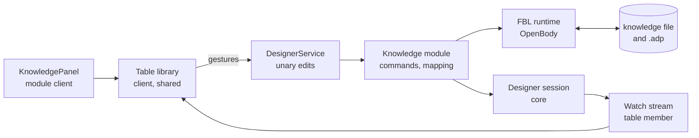

# Design Document

## Overview

The Knowledge designer is ADP's first designer: one table per plain text file (YAML, JSON or XML), with typed properties, relations between files and stored views, working the way Notion's table view does. [The requirements](requirements.md) were approved in the dashboard on 2026-10-08 without comments, so each open question stands at its default:

| # | Ruled by approval |
| --- | --- |
| Q1 | The tool type is specified in DESL, in `knowledge.des`. |
| Q2 | This host's designer is written by hand and checked against `knowledge.des`; storage goes through the FBL bindings. |
| Q3 | A cell has no id of its own: it is its row's id and its property's id. |
| Q4 | A row names its values by property id. |
| Q5 | A two-way relation is stored on one side only. |
| Q6 | Collapsing a group or a parent is stored in the view. |
| Q7 | It is a designer; the terminology gains one sentence saying why. |

The design has three parts, delivered in this order:

1. **The definition**, in etalii.adp: the shape of the knowledge file, three FBL bindings, DESL 0.1 and `knowledge.des`, with fixtures. This is what the other hosts will build from.
2. **What this host gains for the designer family**: the backend seams, a shared table component in the client, a file dialog, and the parts of FBL 0.2 this host's FBL runtime does not do yet.
3. **The module**, `src/designers/knowledge`: declarations against 1 and 2.

**The requirements listed six gaps in FBL (G1 to G6). This design closes four of them by how the file is shaped, without changing FBL**, and puts the two that remain, with three choices about the file's shape, to the user as *Language decisions* L1 to L5 below (Requirement 1.4). Approving this document approves each at its default.

## How this was read

The FBL 0.2 specification was read in full for this design on etalii.adp's `origin/develop` at `f8451b4`. This repository was surveyed on `develop` at `7d3fba20` in three passes (the editor family's backend seams, the FBL runtime and file creation, and the client shell); type and member names below are from those surveys. **Each task that touches a named seam re-reads it first**: a survey is a reading on one day, and names move.

## Steering Document Alignment

### Technical Standards (tech.md)

- The backend is the only reader and writer of files; the client speaks gRPC. Client to backend is unary calls; backend to client rides the connection's one `WorkspaceService.Watch` stream as a new member of `WorkspaceMessage`, never a second stream (Requirement 10.7).
- Every edit is a command on the workspace's history stack with an inverse, as the editor and diagram families' are.
- Logging follows the static `Log.ForContext<T>()` shape; tests are xUnit v3 with `TestContext.Current.CancellationToken`.

### Project Structure (structure.md)

- A tool type is a module on the shared core. What the first designer needs from core is added to core, named for what it does (`EtAlii.Adp.Designer`, a table library in the client, a file dialog prompt), and names no designer type.
- The module lives in `src/designers/knowledge` with `backend`, `api`, `client`, `examples` and `definition` for its copy of the definition files, as modules built from a specification file have.

## Code Reuse Analysis

### Existing Components to Leverage

| What | Where | Used for |
| --- | --- | --- |
| The FBL runtime: `FblDocumentLoader`, `OpenBody` (`Open`, `Model`, `Change`, `Plan`, `Save`, `Fork`), `ModelChange`, the `yaml`, `json` and `xml` families | `src/backend/EtAlii.Adp.Specification.Fbl` | Reading and writing the knowledge file. The module has no parser or writer of its own (Requirement 10.5). |
| The declared-binding consumer pattern: a body class over `OpenBody`, an edits class turning commands into `ModelChange`s, a `WritableDocumentLifecycle` store, `RestoreDocumentCommand` as the inverse | `src/diagrams/gartner-hype-cycle-graph/backend` (`GhgBody`, `GhgEdits`, `GhgDocumentStore`) | The model for the module's backend. |
| `ShortGuid` (25 lowercase base-36 characters) | `src/backend/EtAlii.Adp/ShortGuid.cs` | Every id (Requirement 2.6). In `knowledge.des` it is DESL's id strategy: a version 4 UUID written in base 36. |
| Commands and undo: `ICommandHandler<T>`, `CommandResult.Success(inverse)`, `IHistoryStackStore` | `src/backend/EtAlii.Adp.History` | Every edit, and one undoable step across two files (L5). |
| The editor family's seams, as the shape to follow: `EditorDefinition` with `Build`, `AddEditorDefinitions`, a session and its factory, the file watcher obligations and their tests | `src/backend/EtAlii.Adp.Editor`, `src/editors/markdown/backend` | The designer family's seams (Requirement 10.2). |
| The Add flow: `AddDiagramContextActionProvider` returning a choice with an option tree and a name field; `CreateDiagramFileCommand` creating two files at once with `DeleteEntryCommand` as inverse | `src/backend/EtAlii.Adp.Hierarchy` | Adding a knowledge file with a choice of format (Requirement 10.4). The option tree already nests, so the three formats are three leaves under one entry and no new prompt is needed. |
| Prompts: `InputDialogPrompt`, `ConfirmDialogPrompt`, `ChoiceDialogPrompt` on the Watch stream; `ProposeInput` for live refusal | `src/api/context.proto`, `ContextPromptHost.tsx` | Renaming, confirmations with counts (Requirements 3.6, 5.8), refusal where a name is typed (3.9). |
| Selection and the property grid: `useContextConnection().select`, backend-fed `PropertyGridPanel` | `src/client/src/shell` | A selected row's properties (Requirement 4.6). |
| `ContextMenu`, `Dialog`, `ConfirmDialog`, `InlineLabelEditor`, `TagInput`, the `@mdi/font` icons, the theme tokens in `index.css` and their contrast guards | `src/client/src` | Column and view menus, option tags, type icons, both themes. |
| Tool panel registration: `ToolPanelRegistration`, the glob over `{diagrams,designers,editors}/*/client/register.ts` | `src/client/src/shell/panels` | The module's panel (Requirement 10.1). |
| The vendored FBL conformance corpus and its runner | `src/backend/EtAlii.Adp.Specification.Fbl.Tests/Conformance` | The knowledge fixtures from etalii.adp run here too. |

### What does not exist and is added

| Missing | Added as |
| --- | --- |
| A designer family in the backend: `DesignerDefinition` is an id and a title, `Program.cs` discards what discovery finds, and nothing routes, opens or serves a designer | `EtAlii.Adp.Designer` (*Components*, B1) |
| A table in the client, and under it virtual scrolling, a searchable list, date and time editing | The table library (*Components*, C1) |
| A way to choose a workspace file in a dialog | A file dialog prompt (B4) |
| In this host's FBL runtime, for declared bindings: reordering (`Move` is refused), adding at a position (`Add` with an index is refused), `place: before`, several bindings for one tool type, and templates wired into file creation | FBL runtime work (B3). These are parts of FBL 0.2 this host has not implemented, not gaps in the language. |
| Client tests of a module outside `diagrams/*/client` in vitest's `include`, and the `designers/*/client` workspace | Two configuration lines (C3) |

### Integration Points

- **Routing.** `DiagramFileRouter` matches a registration's first line against the diagram catalog only. The designer family adds its own match, tried after diagrams and before editors, so an `.adp` whose first line is `etalii/knowledge` opens the designer and its body no longer falls to the plain editor.
- **The tree's tool type.** `HierarchyContextSourceResolver` computes the type string the client's panel registry keys on; it gains the designer case, giving the origin.
- **Findings.** `IDiagramValidator` and `ProblemStore` are keyed on a diagram origin. The origin type is the same for a designer, so the validator seam is reused by widening what registers into it, not by a second problem store.

## Architecture

### The knowledge file

One shape, written three ways. Ids are ShortGuids; they are shortened here (`p1`, `o1`, `v1`, `r1`) to keep the example readable.

```yaml
ded: "0.1"
designer: etalii/knowledge
name: Cities
activeView: v1
properties:
  - id: p1
    name: Name
    type: text
    title: true
  - id: p2
    name: Country
    type: selection
    options:
      - id: o1
        name: Netherlands
        colour: blue
  - id: p3
    name: Population
    type: number
  - id: p4
    name: Province
    type: relation
    target: provinces.yaml
    limit: one
    counterpart: p9
views:
  - id: v1
    name: All cities
    columns:
      - property: p3
        width: 120
      - property: p4
        visible: false
    sorts:
      - property: p3
        direction: descending
    filterMatch: all
    filter:
      - property: p3
        operator: greater-than
        number: 100000
    groupBy: p2
    hideEmptyGroups: true
    collapsed:
      - key: o1
rows:
  - id: r1
    cells:
      - property: p1
        text: Amsterdam
      - property: p2
        option: o1
      - property: p3
        number: 931298
      - property: p4
        rows:
          - row: r7
```

```json
{
  "ded": "0.1",
  "designer": "etalii/knowledge",
  "name": "Cities",
  "properties": [
    { "id": "p1", "name": "Name", "type": "text", "title": true }
  ],
  "views": [
    { "id": "v1", "name": "All cities" }
  ],
  "rows": [
    { "id": "r1", "cells": [
      { "property": "p1", "text": "Amsterdam" }
    ] }
  ]
}
```

```xml
<ded version="0.1" designer="etalii/knowledge" name="Cities">
  <properties>
    <property id="p1" name="Name" type="text" title="true"/>
  </properties>
  <views>
    <view id="v1" name="All cities"/>
  </views>
  <rows>
    <row id="r1">
      <cell property="p1" text="Amsterdam"/>
    </row>
  </rows>
</ded>
```

What the shape decides, and why:

- **A cell is an entry of its own**, naming its property by id (Q4) and carrying no id (Q3). This removes gap G2: nothing is keyed by a name the file itself defines. It also makes tolerant reading work per cell: FBL reports an unreadable *entry*, so one bad value costs one cell, not its whole row (Requirement 8.2). L1 is the alternative.
- **A cell's value sits under a key named for its type**: `text`, `number`, `checked`, `date`, `dateTime`, `time`, `option`, `options`, `rows`. Each is a typed slot FBL can read and write, and the file says what each value is without looking up the property (Requirement 2.8). It also gives Requirement 3.4 for free: when a property's type changes, a value that does not convert simply keeps its old key, stays in the file byte for byte, and is reported as a finding on its cell.
- **Several values are several entries** (`options:` and `rows:` hold one entry per value). Each is added, removed and moved by its own splice in all three formats, which removes gap G1 without a list construct. L2 is the alternative.
- **A view stores only what differs from the default.** A property with no `columns` entry is visible, at the default width, in property order after the listed ones. So a new file's first view names no property, which removes gap G6: the template needs each new id once.
- **The title property is marked on the property** (`title: true`), not named from the root, for the same reason.
- **A relation's values are row ids of the target file**, and the property carries the target's path relative to this file, the limit, and for a two-way relation the id of its counterpart property in the target (Q5: only the side that was created holds values; the counterpart carries `computed: true` and no cells).
- **`activeView`, `collapsed`, column `width`, `visible` and `wrap`, group order and hidden groups** are all in the file (Requirements 2.3, 6.9, 6.10). The registration is the origin line and, when the names differ, a `body:` line, and nothing else (Requirement 2.2); the bindings set `createOnFirstPlacement: false` and store no layout.
- **Dates and times** are ISO 8601 (Requirement 4.8). **Colours** are one of ten names: `default`, `gray`, `brown`, `orange`, `yellow`, `green`, `blue`, `purple`, `pink`, `red`.
- **A filter is a list on the view**: `filterMatch` (`all` or `any`) says how its entries combine, and each entry of `filter` is a condition or a group, a group having `match` and `conditions`, to three levels (Requirement 6.5). A condition's comparison value uses the same typed keys as a cell. **A view's group settings are keys of the view too**: `groupBy`, `hideEmptyGroups`, and the lists `groupOrder`, `hiddenGroups` and `collapsed`. (The definition settled this shape in etalii.adp; this document first nested both under mappings of their own.)

### Language decisions

Requirement 1.4 asks that each gap be put to the user before a language changes. The option marked **(default)** is what the tasks are written against.

| # | Decision | Options |
| --- | --- | --- |
| L1 | How a row holds its values | **A list of cell entries, each with a typed key (default):** as shown above. No change to FBL; findings per cell; values survive a type change. Costs size: about three lines per value in YAML, so a table of ten thousand rows and eight properties is roughly a quarter of a million lines. Task 2 measures reading and editing at that size before anything is built on it. · **A map from property id to value:** about one line per value. Needs a new FBL slot that reads and writes a matched member's own value (gap G2) and a way to type a value by something outside its entry; a bad value then costs its whole row unless FBL also gains finer findings. · Other. |
| L2 | How several values are written | **One entry per value (default):** `options:` and `rows:` lists of small entries. No change to FBL, and one splice per value in all three formats. · **A list value:** `options: [o1, o2]`. Compact, and what YAML and JSON readers expect. Needs list slots in FBL for all three families with per-item splices (gap G1); FBL 0.2 writes a YAML flow list only as a whole and has nothing for XML. · Other. |
| L3 | How one tool type gets three formats (gap G5) | **Three bindings, named by the specification (default):** `knowledge.fbl` holds bindings `yaml`, `json` and `xml`; `knowledge.des` names all three under `persistence.bindings`, and the body's extension picks one. Each binding has its own template, so the format chosen when adding decides the bytes. FBL's text changes in two places (sections 1.2 and 8.1: "its binding" becomes "the binding for the body's family"); the list itself is DESL's, which is new anyway. · **Two bindings through `alsoRead`:** JSON and YAML share one binding. Fewer rules to keep equal, but a JSON file is also valid YAML, so the read order has to be got right, and new-file templates are per binding, not per family. · **Three origins,** one tool type per format. No language change, and three rows in the catalogue for one tool. · Other. |
| L4 | What FBL binds to for a designer (gap G4) | **Ruled by the user in chat, 2026-10-09, after this document was approved: the designer pair stands alone.** DESL 0.1 defines its own metamodel, ids, findings and editing transaction, and DED 0.1 defines what a stored designer holds; neither cites, imports or depends on the diagram pair. FBL 0.3 names "the tool type's specification" and "the specification's type", so that it binds to either pair, and no behaviour of FBL changes. The approved default had DESL adopt the diagram language's model contract by reference; that is withdrawn. The other option, specifying the Knowledge designer's model in a diagram specification beside `knowledge.des`, is ruled out by the same ruling. |
| L5 | One undoable step that writes two files (gap G3) | **In the host, not in FBL (default):** FBL keeps one history per body. Creating or deleting a two-way relation, and renaming a target file, are one host command whose inverse restores both files. `knowledge.md` states that every host must make these steps atomic and how. Relation values are plain ids to FBL, resolved by the designer, so FBL reports nothing as dangling across files. · **In FBL:** a cross-body reference and a multi-body edit, as folder subjects already have (section 10.4). Every host then gets it from its FBL runtime, at the cost of the largest change to FBL of any option here. · Other. |

With the defaults, **FBL's behaviour does not change at all**: FBL 0.3 is two wording changes (L3, L4), and gaps G1, G2 and G6 are closed by the file's shape. What remains real work is in this host's FBL runtime (B3).

### The model the bindings produce

| Type | Entry | Parent | Id | Attributes |
| --- | --- | --- | --- | --- |
| `Table` | the root | | none | `name`, `activeView` |
| `Property` | `properties/*` | | stored | `name`, `type`, `title`, `target`, `limit`, `counterpart`, `computed`, `parent` |
| `Option` | `properties/*/options/*` | `Property` | stored | `name`, `colour` |
| `View` | `views/*` | | stored | `name`, `filterMatch`, `groupBy`, `hideEmptyGroups` |
| `Column` | `views/*/columns/*` | `View` | derived | `property`, `visible`, `width`, `wrap` |
| `Sort` | `views/*/sorts/*` | `View` | derived | `property`, `direction` |
| `FilterGroup`, `Condition` | `views/*/filter/*` and, nested, `conditions/*` to three levels | `View` or `FilterGroup` | derived | `match`; `property`, `operator` and a typed value |
| `GroupSetting` | `views/*/groupOrder/*`, `hiddenGroups/*`, `collapsed/*` | `View` | derived | `key` |
| `Row` | `rows/*` | | stored | |
| `Cell` | `rows/*/cells/*` | `Row` | derived from row and property | `property` and one typed value |
| `CellItem` | `rows/*/cells/*/options/*`, `rows/*/cells/*/rows/*` | `Cell` | derived | `option` or `row` |

Document order is the order of properties, options, views, sorts and rows, so reordering is FBL's `move`.

A binding rule, to show the level the bindings are written at (YAML; a sketch, not the binding):

```json
{
  "name": "cell",
  "type": "Cell",
  "at": "/rows/*/cells/*",
  "parent": { "rules": ["row"], "slot": "cells" },
  "attributes": {
    "property": { "key": "property", "empty": "refuse" },
    "text": { "key": "text", "empty": "remove" },
    "number": { "key": "number", "empty": "remove", "number": "shortest" },
    "checked": { "key": "checked", "empty": "remove" },
    "date": { "key": "date", "empty": "remove", "time": "keep-precision" },
    "option": { "key": "option", "empty": "remove" }
  },
  "insert": { "place": "after-last", "container": "cells", "create": { "at": { "after": "id" } }, "keys": ["property", "text", "number", "checked", "date", "dateTime", "time", "option"] },
  "remove": { "container": "remove-when-empty" }
}
```

Each binding claims its extensions as `shared` and `registrationOnly` (a knowledge file always has its registration), carries a `required` header (the root key `ded` in YAML and JSON, the root element `ded` in XML), and has a template of one title property, one view and no rows.

**Two things the binding task settles first, because the reading left them open:** whether an attribute `reference` can name a rule's stored id, so that deleting a property or an option cascades to the cells that name it (if not, the designer issues those removals in the same transaction, and `knowledge.md` says so); and whether a rule at `/` can bind root keys as `Table`'s attributes (no existing binding does it). Either answer keeps the file shape; a "no" on the second is a sixth language decision and goes to the user as one.

### DESL 0.1

DESL gains only what `knowledge.des` needs, each construct named for what it does:

| Section | Content |
| --- | --- |
| `desl`, `language` | The version key, and the designer type's origin, title and kind. |
| `metamodel` | DESL's own (L4): types, their attributes with a value type each, and containment. The types and attributes of the table above. |
| `persistence` | `bindings`, one per family (L3), and `ids`: how a new id is made (here a version 4 UUID written in base 36, which is this host's ShortGuid) and which types store theirs. |
| `constraints` | DESL's own: a rule as a CEL condition over the model with a severity and a message. Here: one title property; unique property names; a parent relation has no cycles; a relation's limit. A broken rule is a finding, as ADP terminology defines one. |
| `surface` | New, and the only part that is a designer's own: `{ "kind": "table", "columns": type, "rows": type, "cells": type, "views": type }` naming which types play which part, and `valueTypes`: per property type its value key, its editor, its comparisons for filters, its sort order and what it converts to. |
| `operations` | DESL's own: each gesture of Requirements 3 to 6 as a named transaction of model changes (add, set, remove, move), so every host makes the same changes for the same gesture. |

`knowledge.md` holds what DESL 0.1 cannot say: the layout and behaviour of Requirement 7, the conversion table for type changes, the atomic two-file steps (L5), the handling of entries without an id (Requirement 8.5), a complete example per format, and the JSON Schema of the file.

### DED 0.1

DED is the designer pair's definition language (ruled by the user in chat, 2026-10-09): it says what a stored designer holds, as DESL says what a designer type is. For the Knowledge designer a stored designer is a knowledge file, and **a knowledge file is a DED definition**: it opens with DED's envelope, `ded: "0.1"` and `designer: etalii/knowledge` (in XML the root element `ded` with `version` and `designer` attributes), and then holds the model `knowledge.des` declares. The three FBL bindings are how that definition is written as YAML, JSON or XML. This is as etalii.adp's DED 0.1 defines it (commit `d0d4034`, in its pull request 102), which this section follows (Requirement 1.7); the envelope replaces the `knowledge: "0.1"` key this document first showed.

### The host



**One generic model crosses the wire.** Core must not know one designer's schema, so what the backend pushes and the table library draws is a **table model** that names no designer: columns (id, name, value kind, options, width, visibility), rows (id, depth, cells), views and the active view's settings, and findings by cell. The Knowledge module maps its file model onto it, as a diagram module maps onto the canvas library's diagram model. A second designer with a table reuses both ends.

**The backend sorts, filters and groups; the client draws a window.** The session keeps, per connection, the active view's row order after filter, sort and grouping. The client asks for the rows in sight and a margin, by index. Ten thousand rows are never sent or drawn at once (Performance), and every host of the definition can share the same view logic because it is specified in `knowledge.des` and `knowledge.md`, not in a client.

**Every edit is a command.** The client sends a gesture (set this cell, add a property of this type after that one, move this view) as one unary call; a handler turns it into one or more `ModelChange`s, applied to the `OpenBody` as one batch and saved through the document store; its inverse is a `RestoreDocumentCommand` with the bytes before. A step that touches two files (L5) is one command whose inverse restores both, and which writes neither when either refuses.

**An edit is shown at once and written behind** (ruled by the user in chat, 2026-10-09, on task 2's measurement). The table shows an edit the moment it is made, without waiting for the file. The backend applies edits to the file in the order they were made, one at a time, and the client marks an edit as unsaved until its write is confirmed. When a write is refused, the edit is taken back on screen with the refusal's reason, and every later edit still waiting on it is taken back with it. Undo, an edit made outside ADP and closing the document wait for the queue to empty first. On a small file the write lands at once and nobody sees the difference; on a very large one it lands a second or two later.

**Relations.** A session that shows a relation opens its target file read-only through the same store to read titles, and watches it; the reverse side of a two-way relation (Q5) is computed by reading the side that holds the values. A missing or unreadable target, or a row id that is not there, is a finding and the value stays (Requirement 5.7).

## Components and Interfaces

### In etalii.adp

| # | Deliverable | Serves |
| --- | --- | --- |
| E1 | `specifications/fbl`: FBL 0.3 wording (L3, L4), with nothing else changed; fixtures `knowledge-yaml`, `knowledge-json`, `knowledge-xml`, each proving read and every kind of edit, and one proving the three give the same model | 1.2, 1.3, 1.4 |
| E2 | `specifications/desl`: DESL 0.1 as above, with `desl.schema.json`; `specifications/ded`: DED 0.1, what a stored designer holds, with `ded.schema.json` | 1.2 |
| E3 | `definitions/designers`: `knowledge.des`, `knowledge.md`, `knowledge.fbl`, `knowledge.schema.json` (the file's JSON Schema, for YAML and JSON) and one example per format | 1.1, 1.8, 8.4 |
| E4 | `docs/terminology.md`: the sentence of Q7, and the Knowledge designer as the example of a designer | 1.5 |

### In this host's core

**B1. `EtAlii.Adp.Designer`** (new project, beside `EtAlii.Adp.Editor`).

- `DesignerDefinition` moves here and widens to `Origin`, `Title`, `Description`, `Icon`, `Formats` (each a label and an extension, for the Add tree) and `Build`.
- `AddDesignerDefinitions`, `IDesignerDefinitionCatalog`, and `Program.cs` registering what `DesignerDefinitionDiscovery` finds instead of discarding it.
- `IDesignerSession` and `IDesignerSessionFactory`: a session is opened per connection for a registration, exposes the table model and its changes, takes the client's window and active view, and meets the same file-watcher obligations as an editor session, under the same tests.
- Routing, the tree's tool type and the Add action as *Integration Points* describes. `AddDesignerContextActionProvider` offers a designer type with its formats as leaves under it and creates both files through the binding's template.

**B2. `designers.proto` and the Watch member.** `DesignerService` with unary calls for opening and closing a table stream, setting the window and the active view, and one `Edit` call carrying a gesture; `WorkspaceMessage` gains a `table` member carrying a baseline and then changes (rows in the window replaced, columns or views changed, findings). Named for the table, not for a designer type.

**B3. FBL runtime, declared bindings.** `Move`, and `Add` at a position, for the `yaml`, `json` and `xml` families (FBL 0.2 section 6.4); `place: before`; choosing a binding by the body's family (L3); `TemplateWriter` used when a file is created. Each is proven against etalii.adp's fixtures, which are vendored into the conformance corpus in the same change.

**B4. A file dialog prompt.** A fourth prompt kind in `context.proto`: a tree of the workspace's files, filtered by a predicate the asking provider supplies, with optional pinned entries (*this file*). The Knowledge module asks for files whose registration is a knowledge file (Requirements 5.1, 10.6).

### In this host's client

**C1. The table library**, `src/client/src/table/library`, laid out as the canvas library is: `TableSurface.tsx` as the entry point, `definition/` for what a module declares, `api/` for the model and events.

- Parts: the view tabs; the bar with filter, sort, group and property-visibility controls and the removable filter and sort items; the header row with type icons, column menus, drag to reorder and drag to resize; windowed rows at a fixed row height (written here, so no new dependency); group headings with counts; nested rows with toggles; the *new* row; cell editors per value kind.
- New shared pieces it brings, usable elsewhere: a searchable list that can create (options, relations), and date, date-and-time and time editing on the browser's own inputs.
- Option colours are twenty new theme tokens (ten names, light and dark) under the existing contrast guard.
- Keyboard: arrow keys between cells, Enter to edit and commit, Escape to cancel, Tab to the next cell, and a key for a new row (Requirement 4.5). Roles are those of a grid.
- A module supplies a definition (which commands a column menu offers, which value kinds exist) and event handlers that call `DesignerService`. It renders nothing itself; a guard walks module clients for that, as `declarativeModules` does for diagrams.

**C2. `useTableStream`**, beside `useDiagramStream`: the one hook that opens a table stream through `useWorkspaceStreams`, with the same only-in-the-hook guard.

**C3. Configuration.** `designers/*/client` joins vitest's `include` and the npm workspaces. (Editor clients are in neither today, so `src/editors/markdown/client/MarkdownEditorPanel.test.tsx` is outside vitest's `include` (read in `src/client/vitest.config.ts`, not established by a run); that is reported to the user and not changed here.)

### The module

`src/designers/knowledge`:

- `definition/`: `knowledge.des`, `knowledge.md`, `knowledge.fbl`, `provenance.json` naming the etalii.adp commit they were copied at.
- `backend/EtAlii.Adp.Designer.Knowledge`: `Designer.cs` (the definition and its three formats), `KnowledgeBody` over `OpenBody` with the binding chosen by extension, `KnowledgeDocumentStore`, `KnowledgeEdits`, one command and handler per gesture, `KnowledgeView` (filter, sort, group, parent nesting), `KnowledgeTableMapper` (file model to table model), `KnowledgeRelations` (targets and computed counterparts), `KnowledgeValidator` (findings), `KnowledgeConversions` (type changes), and `ServiceCollection.AddKnowledge.cs`.
- `backend/EtAlii.Adp.Designer.Knowledge.Tests`.
- `client`: `register.ts`, `KnowledgePanel.tsx` (the definition and handlers), its stylesheet.
- `examples`, seeded into `src/examples/designers/knowledge`.

## Data Models

**Property types and their values.**

| Type | Value key | Filter comparisons (all also have *is empty*, *is not empty*) | Sort |
| --- | --- | --- | --- |
| text | `text` | is, is not, contains, does not contain, starts with, ends with | by text, ignoring case |
| number | `number` | equals, does not equal, greater than, less than, at least, at most | numeric |
| checkbox | `checked` | is checked, is not checked | unchecked first |
| date, date and time, time | `date`, `dateTime`, `time` | is, is before, is after, is on or before, is on or after | chronological |
| selection | `option` | is, is not | the options' order |
| multiple selection | `options` | contains, does not contain | the options' order, by first value |
| relation | `rows` | contains, does not contain | by the first related row's title |

**Type changes** (Requirement 3.4) convert where a value has a meaning: anything to text by its written form; text to number, date or time when it parses; text to a selection by matching or creating an option; selection to multiple selection and back when one value is held; number and checkbox to and from text. Anything else keeps its old key and is a finding. The full table is `knowledge.md`'s, and `KnowledgeConversions` is tested against it row by row.

**Findings.** Codes the designer adds, beside FBL's own: `knowledge.unknown-type`, `knowledge.value-of-another-type`, `knowledge.unknown-property`, `knowledge.unknown-option`, `knowledge.duplicate-property-name`, `knowledge.no-title`, `knowledge.several-titles`, `knowledge.unresolved-target`, `knowledge.unresolved-row`, `knowledge.relation-over-limit`, `knowledge.parent-cycle`, `knowledge.view-names-missing-property`, `knowledge.missing-id` (info), `knowledge.newer-version` (the file opens read-only).

## Error Handling

### Error Scenarios

1. **The file is not well-formed YAML, JSON or XML.** FBL reports the body unreadable; the designer shows the format's error and position, shows no rows, and never writes (Requirement 8.3).
2. **One entry cannot be read** (a cell with an unknown property, a value that does not fit). The entry is a finding at its line, its bytes are kept on every write, and everything else is shown (Requirement 8.2).
3. **A typed value cannot be accepted** (text in a number cell, a duplicate property name). `ProposeInput` refuses it where it is typed, with the reason; nothing is written (Requirements 3.9, 4.4).
4. **An edit cannot be planned** by FBL. The command fails with FBL's reason, shown on the table's refusal surface; nothing is written.
5. **A two-file step fails on the second file.** Neither file is written: both edits are planned before either is saved.
6. **The file changes outside ADP while open.** The session re-reads with the editor family's retry, keeps the last readable content on a failed read, and pushes the new model; the history for that file is cleared, as FBL section 7.3 requires.
7. **A relation's target is missing or not a knowledge file.** The cell shows the value as unresolved, with a finding; the value is kept (Requirement 5.7).
8. **The file's version is newer than the host knows.** It opens read-only with `knowledge.newer-version` (Requirement 2.9).

## Testing Strategy

### Unit Testing

- **etalii.adp:** its validator over `knowledge.fbl`, `knowledge.des` and every fixture; each fixture's splices checked against its expected bytes.
- **Backend:** the conformance runner over the vendored knowledge fixtures; `KnowledgeView` (each comparison, sort and grouping, nesting by parent, a row under several groups); `KnowledgeConversions` against the table in `knowledge.md`; `KnowledgeValidator`, one test per finding code; the equivalence test (the same table read from each format, and after each kind of edit, Requirement 9.4); examples read without errors and written unchanged byte for byte (9.3); the guard that reads `knowledge.des` and fails when the module's property types or view settings differ (10.5).
- **Client:** the table library under vitest for structure, keyboard paths, roles and the events it raises; windowing arithmetic as plain functions. jsdom is not evidence of layout or colour (Requirement 11.3).
- **Every guard is seen to fail against a planted defect, named in its task** (Requirement 11.4).

### Integration Testing

- Open, edit and close a knowledge file over gRPC in each format, asserting the pushed table model and the file's bytes.
- A two-way relation created, edited from both sides and undone, across two files.
- An edit made on disk while a session is open appears on the stream.
- A file of ten thousand rows: time to open, to edit one cell and to change a sort, with the measurements recorded in the task (Requirement 9.6). **This runs in task 2, before the module is built**, because L1's default is the one choice here whose cost is not yet known.
- Module isolation: deleting `src/designers/knowledge` leaves the host building and the designer type gone (Requirement 10.1).

### End-to-End Testing

The `tests.md` browser pass of Requirement 11.1, in both themes, with each part of Requirement 7 compared side by side against Notion's help pages (11.2).

## Documentation

- `docs/creating-a-designer-module.md` becomes a walk through this module (Requirement 10.8); `docs/architecture.md` gains the designer family and the table library; `docs/solution-structure.md` its projects and counts; `docs/guards.md` each new guard; `docs/dependencies.md` is unchanged, since nothing is added.
- `docs/tools.md`: the `etalii/knowledge` row moves from Identified as the work progresses.
- `.gitattributes`: fixtures and examples whose bytes are compared are exempted by path, under the module's and the corpus's fixture folders, not by the `.yaml`, `.json` or `.xml` extension (Requirement 9.5).

## Risks

| Risk | Handling |
| --- | --- |
| **File size and speed under L1's default.** A cell per entry is large, and this host's FBL runtime re-reads the whole body after every change. | **Measured in task 2 and ruled by the user in chat, 2026-10-09: show at once, write behind.** A ten-thousand-row file is 4.0 MB; one cell edit takes about 1.7 s through the runtime (Debug build, YAML only). The options were: show at once and write behind; make the FBL runtime incremental; switch the file to a map per row; other. See *Every edit is a command*. |
| **The two open points in the binding** (cascading by stored id, a rule at the root). | Settled in task 1, in etalii.adp, before anything depends on them. |
| **DESL written for one designer.** Its first constructs may not suit the second. | DESL defines every construct it uses and shares none with the diagram pair (L4), so all of it is new. Each is kept to what `knowledge.des` needs and named for what it does, and DESL stays at 0.1, where any construct may change. |
| **Notion parity is judged by eye.** | Requirement 7 lists what is followed, 7.7 what is not, and the browser pass records each difference found. |
| **The definition and this host drift apart.** | `provenance.json` names the commit; the guard of Requirement 10.5 and the vendored fixtures fail when they differ. |
