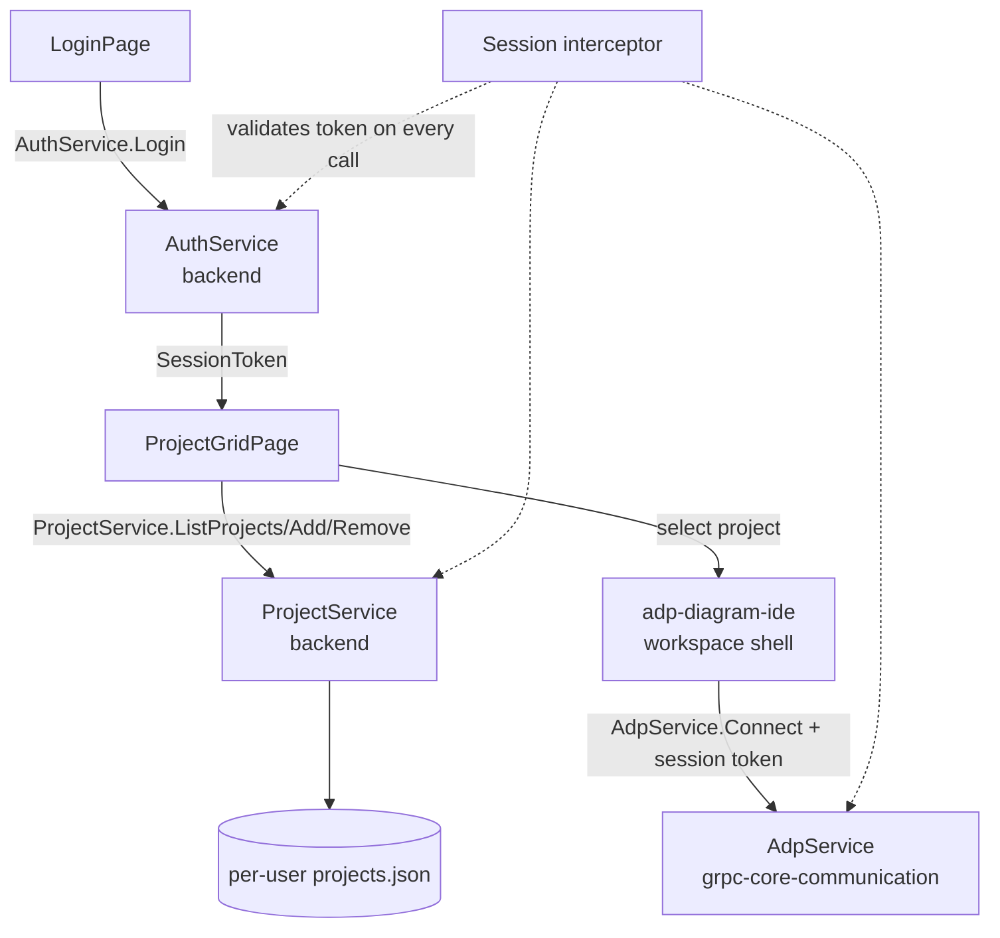

# Design Document

## Overview

This design covers the entry flow into EtAlii.Adp: a login gate, a grid-based project home page, and the persisted, user-managed list of project folders behind it. It introduces two new backend-owned gRPC services — `AuthService` and `ProjectService` — and the client-side login/grid screens that precede `adp-diagram-ide`'s workspace shell. Every other call in the system (including the core `AdpService.Connect` from `grpc-core-communication-specification`) is gated by the session this flow establishes.

## Steering Document Alignment

### Technical Standards (tech.md)
- Authentication/authorization is applied "as decorations on the corresponding gRPC initialization calls" — realized here as a gRPC server interceptor that validates the session token on every call, not just `AuthService.Login` itself.
- The local, standalone "F5" scenario needs no external identity provider — realized as a pluggable `IAuthenticator` with a minimal local-credential default, consistent with local-only persistence/hosting.
- Follows the "File-based storage over a database" decision (tech.md's Decision log #1): the per-user project list is a file, not a database row.
- Client is React + TypeScript per tech.md's Core Technologies; login/grid are just two more screens in that same app, not a separate application.

### Project Structure (structure.md)
- `AuthService` and `ProjectService` are not diagram-specific, so their backend implementation lives in `EtAlii.Adp.Backend` (core backend functionality), hosted by `EtAlii.Adp.Backend.Service` — not in `EtAlii.Adp.Backend.Diagrams`, which is reserved for the diagram-module abstraction layer.
- Their `.proto` contracts live in the shared `src/api/` folder alongside `connection.proto`/`elements.proto`/`deltas.proto`/`service.proto`, since `structure.md` scopes `api/` to "shared contracts... so both backend and frontend build against the same source of truth" generally, not only diagram concerns.
- Client screens (`LoginPage`, `ProjectGridPage`) live in `client/` alongside the workspace shell from `adp-diagram-ide`, as siblings gated in front of it — not inside any `diagrams/<diagram>/client/` folder.

## Code Reuse Analysis

The repository has no existing source code yet; this is designed alongside `grpc-core-communication-specification`'s already-implemented `src/api/*.proto` files and `grpc-core-communication`'s not-yet-implemented behavior spec.

### Existing Components to Leverage
- **`grpc-core-communication` (Requirement 5, auth decoration)**: this spec's session interceptor is the concrete realization of that requirement — one interceptor, applied to `AdpService.Connect` as well as `AuthService`/`ProjectService`.
- **`structure.md`'s `EtAlii.Adp.Backend.Service`**: already documented to host `appsettings.json`/`appsettings.developer.json` — the local-only credential config (Requirement 1.4) is added there rather than inventing a new config mechanism.

### Integration Points
- **`adp-diagram-ide` workspace shell**: reached only after `ProjectService`'s grid returns a selected project path, which becomes that spec's "workspace folder chosen by the user."
- **Core `AdpService.Connect`**: every `Connect` call carries the session token issued here as gRPC metadata; the shared interceptor rejects calls without a valid one.

## Architecture



### Modular Design Principles
- **Single file responsibility**: `auth.proto` and `projects.proto` are separate files, mirroring how `grpc-core-communication-specification` split `connection`/`elements`/`deltas`/`service`.
- **No dependency on diagram internals**: neither service references anything from `elements.proto`/`deltas.proto`; a `Project` is just a name + path, not a diagram.
- **One enforcement point**: session validation lives in a single interceptor reused by all three services, not duplicated per-service.

## Components and Interfaces

### `AuthService` (backend, `EtAlii.Adp.Backend`)
- **Purpose:** Validate credentials and issue/revoke a session token (Requirement 1).
- **Interfaces:** `Login(LoginRequest) returns (LoginResponse)`, `Logout(LogoutRequest) returns (LogoutResponse)` — both unary.
- **Dependencies:** A pluggable `IAuthenticator`; the local/F5 default validates against a single credential from `appsettings.developer.json`.
- **Reuses:** `EtAlii.Adp.Backend.Service`'s existing `appsettings.json`/`appsettings.developer.json` hosting.

### `ProjectService` (backend, `EtAlii.Adp.Backend`)
- **Purpose:** List, add, and remove a user's project folders (Requirements 2, 5).
- **Interfaces:** `ListProjects(ListProjectsRequest) returns (ListProjectsResponse)`, `AddProject(AddProjectRequest) returns (AddProjectResponse)`, `RemoveProject(RemoveProjectRequest) returns (RemoveProjectResponse)` — all unary, all require a valid session.
- **Dependencies:** A file-backed per-user project store (see Data Models).
- **Reuses:** Same session interceptor as `AuthService`/`AdpService`.

### Session interceptor (backend, `EtAlii.Adp.Backend`)
- **Purpose:** Enforce Requirement 1.6 / `grpc-core-communication` Requirement 5.1 in one place.
- **Interfaces:** Standard gRPC server interceptor, applied to `AuthService` (except `Login`), `ProjectService`, and `AdpService`.
- **Dependencies:** Session store shared with `AuthService`.
- **Reuses:** N/A — this *is* the shared piece other services reuse.

### `LoginPage` / `ProjectGridPage` (client, `client/`)
- **Purpose:** The two screens gating the workspace shell.
- **Interfaces:** React components; `ProjectGridPage` renders `ProjectService.ListProjects` results in a grid and exposes the plain-text "add project" entry (Requirement 5.2) and per-item remove action (Requirement 5.4).
- **Dependencies:** A client-side auth context holding the session token and attaching it to all gRPC-web calls.
- **Reuses:** N/A (first client screens); the workspace shell from `adp-diagram-ide` is what reuses the project path this hands off.

## Data Models

### `auth.proto`
```protobuf
syntax = "proto3";

package etalii.adp;

option csharp_namespace = "EtAlii.Adp";

message LoginRequest {
  string username = 1;
  string credential = 2; // opaque; local mode may treat this as a plain password
}

message SessionToken {
  string value = 1;
}

message LoginError {
  string message = 1;
}

message LoginResponse {
  oneof result {
    SessionToken session = 1;
    LoginError error = 2;
  }
}

message LogoutRequest {
  SessionToken session = 1;
}

message LogoutResponse {}

service AuthService {
  rpc Login(LoginRequest) returns (LoginResponse);
  rpc Logout(LogoutRequest) returns (LogoutResponse);
}
```

### `projects.proto`
```protobuf
syntax = "proto3";

package etalii.adp;

import "connection.proto"; // reuses Path for AddProject's folder path

option csharp_namespace = "EtAlii.Adp";

message Project {
  string id = 1;
  string name = 2;
  Path path = 3;
}

message ListProjectsRequest {}

message ListProjectsResponse {
  repeated Project projects = 1;
}

message AddProjectRequest {
  Path path = 1; // plain-text folder path entry, per Requirement 5.2
}

message AddProjectError {
  string message = 1;
}

message AddProjectResponse {
  oneof result {
    Project added = 1;
    AddProjectError error = 2;
  }
}

message RemoveProjectRequest {
  string project_id = 1;
}

message RemoveProjectResponse {}

service ProjectService {
  rpc ListProjects(ListProjectsRequest) returns (ListProjectsResponse);
  rpc AddProject(AddProjectRequest) returns (AddProjectResponse);
  rpc RemoveProject(RemoveProjectRequest) returns (RemoveProjectResponse);
}
```

### Per-user project store (backend file, not a proto)
```
{app-data}/EtAlii.Adp/users/{user-id}/projects.json
[
  { "id": "...", "name": "...", "path": ["...", "..."] }
]
```
Kept in the backend's own application-data location — not inside any project workspace — since it is app state describing *which* workspaces exist, not diagram content belonging to one of them.

## Error Handling

### Error Scenarios
1. **Invalid credentials at login (Requirement 1.3)**
   - **Handling:** `AuthService.Login` returns `LoginResponse.error` (`LoginError`); no session token is issued.
   - **User Impact:** Login screen shows the error message and stays on the login screen.

2. **Session expired/invalid on a later call (Requirement 1.5)**
   - **Handling:** The session interceptor rejects the call with gRPC `UNAUTHENTICATED`; the client's auth context clears and redirects to `LoginPage`.
   - **User Impact:** User is dropped back to login; any unsaved local state is lost per Requirement 4.2 (session end discards client state).

3. **Invalid folder path on add (Requirement 5.3)**
   - **Handling:** `ProjectService.AddProject` returns `AddProjectResponse.error` (`AddProjectError`) without touching the persisted list.
   - **User Impact:** Grid's add form shows the error inline; existing grid items are unaffected.

4. **Backend unreachable at login**
   - **Handling:** The gRPC-web call fails at the transport level before reaching `AuthService`; the client catches this distinctly from `LoginError`.
   - **User Impact:** A connection-specific error is shown (per Reliability NFR), not a generic "invalid credentials" message.

## Testing Strategy

### Unit Testing
- `AuthService`/`IAuthenticator`: valid vs. invalid credentials, local-mode default behavior.
- `ProjectService`: add/list/remove against a fake file-backed store; invalid-path rejection; list unaffected by a rejected add.
- Session interceptor: valid token passes through, missing/invalid/expired token is rejected with `UNAUTHENTICATED`, applied uniformly across `AuthService` (non-`Login` methods), `ProjectService`, and `AdpService`.

### Integration Testing
- Full flow: login → empty grid → add a valid local folder → grid shows it → select it → workspace shell opens with that path → return to grid → remove it → grid is empty again.
- Session persists across `ListProjects`/`AddProject`/`AdpService.Connect` calls without re-authenticating; an expired/invalidated session is rejected consistently across all three.

### End-to-End Testing
- Local, F5-scenario script: fresh backend start with no persisted projects → login with the local-mode default credential → add a real local folder path → confirm `projects.json` was written → restart the backend → confirm the project still appears in the grid.
