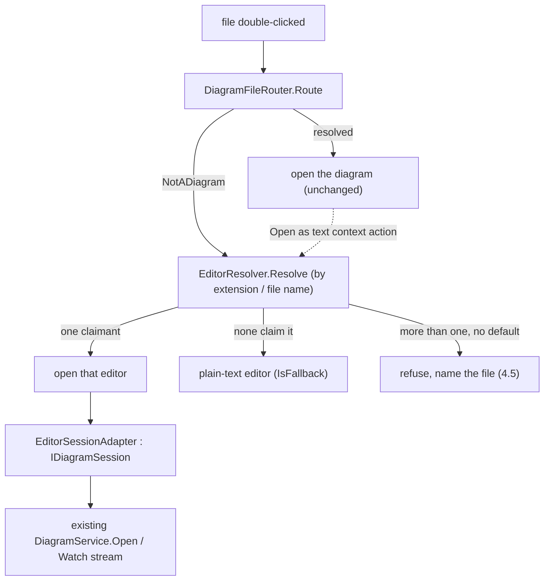

# Design Document

## Overview

Text editors become a second plugin family beside diagram types, living in `src/editors/<editor>/` and selected by file extension rather than by an `.adp` registration's MIME line. Two modules ship: `plain` (the last-resort fallback every project needs) and `markdown` (preview plus heading navigation).

The design leans hard on reuse - a new core project mirroring `EtAlii.Adp.Diagram`'s role, a generalised version of the reflection scan that already discovers diagram types, and the existing `IDiagramSession`/`Watch` streaming machinery underneath a thin adapter - while drawing one explicit line where forcing full reuse would make the new family harder to read than writing a small parallel piece would. That line, and the reasoning for it, is Requirement 7's veto instinct from `technical-debt-cleanup`, carried across as the peer review asked.

## Steering Document Alignment

### Technical Standards (tech.md)

- A save is an `ICommand` on the project's history (*Commands* rule) - Requirement 6.2 is this rule applied, not a new one.
- Editor modules follow the same `ServiceCollection.AddX`/registration-shape convention `technical-debt-cleanup`'s R5 just recorded: single file by default, split only once a real consumer needs commands-only registration. Neither `plain` nor `markdown` has one yet, so both start single-file.
- `_logger` per class, `_Model` for POCOs, one entity per file - unchanged, applied to every new type below.

### Project Structure (structure.md)

- **New top-level layout entry**: `src/editors/<editor>/`, mirroring `src/diagrams/<diagram>/` exactly - `backend/` (`EtAlii.Adp.Editor.<Editor>` + `.Tests`), `api/`, `client/`, `examples/`. Requirement 1.5 asks for structure.md to say so in the same terms it uses for `diagrams/`; the design task list adds that paragraph verbatim-parallel to the existing one.
- **New core-abstractions project**: `EtAlii.Adp.Editor`, mirroring `EtAlii.Adp.Diagram`'s role for the diagram family - abstractions every editor module depends on, no editor implementation in it, core depends on it and never on a specific module. This is a new project, not a new folder inside an existing one, for the same reason `EtAlii.Adp.Diagram` is its own project: a second family needs its own abstraction seam, not a shared one that would make either family's dependency graph describe the other.
- **Dependency direction unchanged**: `EtAlii.Adp.Editor.<Editor>` → `EtAlii.Adp.Editor` → `EtAlii.Adp.Backend`/`EtAlii.Adp.Diagram` (for the session-adapter reuse below) → `EtAlii.Adp`. Core never references a specific editor module, exactly as it never references a specific diagram module.

## Code Reuse Analysis

### Existing Components to Leverage

- **The assembly-walk half of `DiagramDefinitionDiscovery`** (`FindApplicationAssemblies`) is already definition-agnostic - it finds `EtAlii.Adp*` assemblies and knows nothing about `DiagramDefinition`. Only the "scan these assemblies for a static class named X with a public static `Definitions` property of type `IReadOnlyList<T>`" half is diagram-specific, and it generalises cleanly (below).
- **`IContextActionProvider`/`IContextPropertyProvider`** are reused **unchanged** - no new interface, per Requirement 9.1's own wording ("through one `IContextPropertyProvider`"). "Open as text" (Requirement 5.2) is one more provider, hosted in core exactly as `AddDiagramContextActionProvider` is, not a per-module thing.
- **`ContextExecutionRequiresChoice`**, the same mechanism `AddDiagramContextActionProvider.ExecuteAsync` uses to offer a pick-a-diagram-type dialog, is reused for Requirement 4.4's "Open with…" - a second "offer N options, dispatch on the chosen one" UI would be the same feature built twice.
- **`IDiagramSession`/`IDiagramSessionFactory`/`DiagramService.Open`'s wire path**: reused at the transport level (below) rather than duplicated - this is what satisfies the Non-Functional "no new stream" requirement without inventing a second gRPC surface.
- **`DiagramFileRouter`'s outcome-type shape** (`DiagramRouted`/`DiagramAmbiguousExtension`/`NotADiagram`, a discriminated result rather than an exception for a per-file question) is the template for the new `EditorRouting` result - not `DiagramFileRouter` itself, which stays diagram-only and untouched.

### Integration Points

- **`DiagramService`'s open path** gains one more step (below): after `DiagramFileRouter.Route` says a file is not a diagram, it asks the new `EditorResolver` before giving up. This is the one point where core code changes; everything else is new files.
- **The existing per-connection `Watch`/file-watcher plumbing** (`project-root-folder-explorer`) is what tells an open text editor its file changed on disk (Requirement 6.4) - the same signal a diagram session already reacts to, not a second watcher.

## Re-measurements that change the design

Two corrections, found by checking the requirements' own citations against the code rather than trusting them:

1. **Requirement 4.1 and 4.3 cite two precedents that do not actually behave the same way, and the design has to pick one.** 4.1 says the new resolver should have "the shape `DiagramValidators` and `ContextPropertyResolver` already use" - both of which **throw `InvalidOperationException` at construction** for a genuine key collision (verified by reading `DiagramValidators.cs`: two validators for one origin throw immediately, a real deployment error that a process cannot start past). 4.3 separately says the stance should match "`DiagramFileRouter` takes for an ambiguous body extension" - but `DiagramFileRouter.RouteBody` does not throw at all for that case: it logs at `Warning`, returns a `DiagramAmbiguousExtension` **result** for that one file, and the rest of the host keeps running (verified by reading `DiagramFileRouter.cs` and the `Program.cs` startup code that logs its `AmbiguousExtensions()` list as a warning, not a failure). These are genuinely different severities for genuinely different blast radii: two validators disagreeing about one diagram type's rules is contained to that type, while two editors disagreeing about one extension would - if it threw at construction - take the whole host down over a conflict in a family that is supposed to be optional and additive. **Design decision: follow `DiagramFileRouter`'s precedent, not `DiagramValidators`'s** - log loudly (at `Error`, not `Warning`, to make "reported at startup" as unambiguous as Requirement 4.3 wants) and degrade per-file, per Requirement 4.5's own "opening SHALL fail... never silently" - which is a statement about one file failing to open, not about the process failing to start.
2. **`courier.dsl` (Requirement 5's "not hypothetical" example) was verified, not assumed.** It sits in `src/diagrams/c4/examples/reference/architecture/` today and is genuinely the body of **six** registrations: `courier.adp` (unqualified name match) plus five more (`api-components.adp`, `containers.adp`, `landscape.adp`, `parcel-scanned.adp`, `production.adp`) each carrying an explicit `body: architecture/courier.dsl` header. This confirms the scenario is real and current, and it surfaces something the requirements do not name: `.dsl` is a **non-shared** extension (c4's `DiagramDefinition` does not set `SharedExtension`), so `DiagramFileRouter.RouteBody` already routes *any* bare `.dsl` file to C4 by extension alone, registration or not (`RoutesBareBody`). Requirement 5's "file that is also a diagram body" is therefore not only about registered bodies - it is about every extension a document-subject diagram type declares non-shared. The design below resolves diagrams-first for exactly that reason, not only for explicitly registered files.

## Architecture



### Why a thin adapter instead of literal reuse of `IDiagramSessionFactory`

The maximal-reuse option - an editor module implements `IDiagramSessionFactory` directly, keyed by a synthetic `DiagramOrigin` such as `new DiagramOrigin("editor", "markdown")` - was considered and rejected. It works mechanically (the interface is already origin-agnostic in what it carries), but it means every editor module author writes `IDiagramSessionFactory`, `DiagramOrigin`, `IDiagramSession` to build something that is not a diagram, and `DiagramOrigin.MimeType` becomes a value nothing ever reads (editors have no registration file to carry a MIME line). That is exactly the reading tax `technical-debt-cleanup`'s R7.2 veto is written to catch: an abstraction reused past its name is a worse outcome than a small amount of duplication.

**Design decision: a new, properly-named pair, `IEditorSession`/`IEditorSessionFactory`, keyed by the editor's own `Id` string rather than `DiagramOrigin`**, and one adapter in core, `EditorSessionAdapter : IDiagramSession`, that wraps whichever `IEditorSession` the resolver picked so the *existing* `DiagramService.Open`/`Watch` wire path needs no proto change and no second stream. The cost is one small adapter class in core; the benefit is that `EtAlii.Adp.Editor.Markdown` never has to import a type named `Diagram`.

## Components and Interfaces

### `EditorDefinition` (new, `EtAlii.Adp.Editor`, `_Model`)

The direct analogue of `DiagramDefinition`, deliberately not the same type - an editor and a diagram claim files by different rules (extension/name vs. MIME line), and forcing one record to carry both sets of concerns (`SharedExtension`, `Subject`, `MimeType` mean nothing for an editor) would be the same reuse-past-its-name mistake the session layer avoided above.

- **Purpose:** what core needs to route a file to a module, and nothing about how the module renders it (Requirement 2.5).
- **Interfaces:** `Id`, `Title`, `Description`, `Extensions: IReadOnlyList<string>` (lower-cased, dot included), `FileNames: IReadOnlyList<string>` (exact-name matches for `Makefile`/`Dockerfile`/`LICENSE`, Requirement 2.3), `IsFallback: bool` (true for exactly one definition across the whole deployment - `plain`'s), `Build: Action<IHostApplicationBuilder>?` (the same generic hook `AddDiagramDefinitions` already invokes per definition).
- **Reuses:** the `Build`-delegate registration shape from `DiagramDefinition` verbatim - `AddDiagramDefinitions` (renamed conceptually to "add every discovered plugin definition", implementation below) invokes it exactly the same way regardless of which definition type it came from.

### `IEditorDefinitionCatalog` (new, `EtAlii.Adp.Editor`)

Direct analogue of `IDiagramDefinitionCatalog` - `All` exposed as a service so a resolver or a test can be handed a controlled list, per the same reasoning `IDiagramDefinitionCatalog`'s own doc comment gives.

### Generalised discovery (edited: `DiagramDefinitionDiscovery`; new: `EditorDefinitionDiscovery`)

- **Purpose:** satisfy Requirement 1.3 literally - "the same reflection scan... extended... rather than duplicated."
- The assembly-walk (`FindApplicationAssemblies`) is untouched and shared as-is; it already knows nothing about `DiagramDefinition`.
- The per-assembly scan ("find a static class named X with a public static `Definitions` property assignable to `IReadOnlyList<T>`") is extracted into one internal generic method taking the candidate type name and the element type as parameters. `DiagramDefinitionDiscovery.Discover()` calls it with `"Diagram"`/`DiagramDefinition`; the new `EditorDefinitionDiscovery.Discover()` (in `EtAlii.Adp.Editor`) calls it with `"Editor"`/`EditorDefinition`.
- **Where the shared method lives**: a new internal static class in `EtAlii.Adp` (the library both already depend on transitively) rather than in `EtAlii.Adp.Diagram`, so `EtAlii.Adp.Editor` does not have to reference the diagram-abstractions project to reach it - that dependency would itself be a pluggability violation in the wrong direction.
- The host's startup (`Program.cs`) runs both: `DiagramDefinitionDiscovery.Discover()` and `EditorDefinitionDiscovery.Discover()`, feeding each into its own `AddDiagramDefinitions`-shaped call. Requirement 1.4 ("nothing outside the module changes") holds for both discovery passes the same way it holds today.

### `EditorResolver` (new, `EtAlii.Adp.Backend.Hierarchy`, alongside `DiagramFileRouter`)

- **Purpose:** Requirement 4.1's "one resolver, which knows no extension of its own."
- **Interfaces:** `EditorRouting Resolve(string path)`, returning one of `EditorRouted(EditorDefinition)`, `EditorAmbiguous(string extension, IReadOnlyList<EditorDefinition> claimants)`, or the fallback (`IsFallback` definition) when nothing else claims it - built from `IEditorDefinitionCatalog` exactly as `DiagramFileRouter` is built from `IDiagramDefinitionCatalog`.
- **At construction**, groups definitions by extension/file name; a group with more than one claimant and **no declared default** is logged at `Error` once (the corrected precedent above) and every file matching it resolves to `EditorAmbiguous` rather than crashing the host.
- **A declared default** is one boolean on `EditorDefinition` (`IsDefaultForSharedExtension`, false for every definition except the one module that opts in - Requirement 4.4's legitimate case) - when present in a group, double-click opens the default and "Open with…" still lists every claimant.
- **Dependencies:** `IEditorDefinitionCatalog`.
- **Reuses:** the discriminated-result style `DiagramFileRouter`'s own `DiagramRouting` already established, so a reader who knows one resolver's shape already knows the other's.

### `IEditorSession` / `IEditorSessionFactory` (new, `EtAlii.Adp.Editor`)

- **Purpose:** what an editor module implements - reading a file's current text, writing a change, and being told about an external one.
- **Interfaces:** `IEditorSessionFactory { string EditorId { get; } IEditorSession Open(ShortGuid watchId, string rootPath, string filePath); }`; `IEditorSession : IAsyncDisposable { string Content { get; } Task<string> SaveAsync(string newContent, CancellationToken); event EventHandler<EditorContentChangedEventArgs>? Changed; }` - deliberately smaller than `IDiagramSession` (no viewport, no element moves; a text file has no elements to move).
- **Dependencies:** none beyond the file path and root it is given - the same "core resolves, the module never learns the project layout" shape `IDiagramSessionFactory` uses.

### `EditorSessionAdapter` (new, core, `internal`)

- **Purpose:** the one piece of literal interface-bridging discussed above - implements `IDiagramSession` over a wrapped `IEditorSession`, so `DiagramService.Open`/`Watch` needs no change to serve an editor.
- **Shape:** `Baseline()` returns one synthetic element (id `"content"`) carrying the file's full text as its value - sufficient because Requirement 11.3 explicitly excludes diffing, so "replace the whole content" is not a simplification that loses a feature this spec asks for. `MoveElementAsync`/`MoveElementToAsync` both refuse (text has no elements to move, and `IDiagramSession`'s move methods already default to refusing). `Changed` re-raises the wrapped session's content-changed event as a single Update delta on the same synthetic element.
- **This is the one place a design choice trades a small amount of wire-format literalness (a whole-file delta rather than a line-level one) for a large amount of reuse** (zero proto changes, zero new gRPC method, one adapter class) - recorded here as a decision rather than a default, per the same discipline the rest of this document applies.

### `OpenAsTextContextActionProvider` (new, core, `EtAlii.Adp.Backend.Hierarchy`)

- **Purpose:** Requirement 5.2's "Open as text," offered on a selection that `DiagramFileRouter` resolves to a diagram.
- **Shape:** mirrors `AddDiagramContextActionProvider` closely - resolved by `ContextScope`, checks `DiagramFileRouter.Route` for the target, and when it resolves to a diagram, offers one action that calls `EditorResolver.Resolve` on the same path and opens whatever it returns in a new tab. Core names `EditorResolver` here (a core type), never a specific editor module - the same pluggability boundary `AddDiagramContextActionProvider` keeps by resolving through `IDiagramDefinitionCatalog` rather than importing a module.

### `plain` and `markdown` modules

- **`src/editors/plain/backend/EtAlii.Adp.Editor.Plain`**: `Editor.Definitions = [new("plain", "Plain Text", "...", Extensions: [], FileNames: [], IsFallback: true)]` - claims nothing by construction (Requirement 3.2), and is what `EditorResolver` returns when no group matches. Its `IEditorSession` is the one place the encoding/line-ending detection (Requirement 6.1) and the size-limit refusal (Requirement 6.6) live, in a new small type `TextFileBuffer` (below) - deliberately **not** a refactor of `C4Document`'s own line-preserving buffer, even though the two ideas are now near-identical in shape. Consolidating them would touch the C4 module from a spec that has no reason to, blurring this spec's blast radius with a diagram module's the way `technical-debt-cleanup`'s R11 explicitly guards against for unrelated work landing under a feature spec. Recorded here as a deferred, not a missed, decision - a future cleanup spec is where two independently-written line-preserving buffers would be worth comparing, the same way `technical-debt-cleanup` compared four independently-written callback-disposables.
- **`src/editors/markdown/backend/EtAlii.Adp.Editor.Markdown`**: `Editor.Definitions = [new("markdown", "Markdown", "...", Extensions: [".md", ".markdown"], ...)]`, reusing `TextFileBuffer` for everything Requirement 10.2 says it must do "at least" - the module's *own* code is only the preview rendering and heading navigation, both client-side (Requirement 10.2's "what makes it worth being its own module").
- **`TextFileBuffer`** (new, `EtAlii.Adp.Editor`, shared by both modules and available to a future third one): detects a BOM (UTF-8 with/without, scoped deliberately to UTF-8 - see Error Handling) and the dominant line-ending style, preserves each existing line's own terminator on save exactly as `C4Document.SplitLines`/`DetectNewline` do for `.dsl` (independently reimplemented here, not shared, per the deferred-consolidation note above), and refuses a file over the size limit (Requirement 6.6, decided below at **5 MB**) before reading it at all.

## Data Models

### `EditorDefinition`

```
- Id: string
- Title: string
- Description: string
- Extensions: IReadOnlyList<string>   // lower-cased, dot included; empty for a name-only or fallback definition
- FileNames: IReadOnlyList<string>    // exact matches: "Makefile", "Dockerfile", "LICENSE"
- IsFallback: bool                    // true for exactly one definition deployment-wide: plain's
- IsDefaultForSharedExtension: bool   // opt-in tie-breaker for Requirement 4.4's legitimate-conflict case
- Build: Action<IHostApplicationBuilder>?
```

### `EditorRouting` (discriminated result, mirrors `DiagramRouting`)

```
- EditorRouted(EditorDefinition definition)
- EditorAmbiguous(string extension, IReadOnlyList<EditorDefinition> claimants)
```

(No "not resolvable" case - the fallback definition always answers, per Requirement 3.2's "last resort by construction.")

## Error Handling

### Error Scenarios

1. **Two editors claim one extension, neither declared default** (Requirement 4.3). Logged once at `Error` when `EditorResolver` is constructed (corrected precedent, see Re-measurements above); every file with that extension resolves to `EditorAmbiguous`, and opening it fails with a sentence naming the file and both claimants (Requirement 4.5) - the host itself keeps running.
2. **Two editors claim one extension, one declared default** (Requirement 4.4). Not an error: double-click opens the default, "Open with…" (via `ContextExecutionRequiresChoice`) offers both.
3. **A file is binary** (Requirement 7.1). `TextFileBuffer`'s read step checks for a null byte or a majority of non-printable bytes in the first few kilobytes before committing to "this is text" - the same class of heuristic a plain-text editor engine typically uses, refusing rather than rendering replacement characters. Scoped explicitly to that heuristic, not a full charset-detection library - out of scope the same way Requirement 11 scopes out language services.
4. **A file's encoding is not UTF-8** (a gap the requirements do not name explicitly, found while designing `TextFileBuffer`). Detection is scoped to UTF-8 with/without BOM plus a pure-ASCII fast path (which is valid UTF-8 by construction); anything else is refused via the same path as Requirement 7.1's binary refusal, with a sentence naming the file rather than guessing a codepage and risking silent corruption on save. Recorded here as an explicit scope boundary, since Requirement 6.1 names encoding preservation but the requirements do not enumerate which encodings must be supported.
5. **A file exceeds 5 MB** (Requirement 6.6's limit, decided here). Refused before reading, with a sentence naming the file and the limit - the same shape as the binary refusal, not a degraded partial-read.
6. **A file cannot be read at all** (Requirement 7.3). Reported before a tab opens, never a half-initialised one - `TextFileBuffer`'s read step is synchronous-to-the-caller in the sense that nothing about the tab is created until it returns or throws a reported error.

## Testing Strategy

### Unit Testing

- `EditorResolver`: one claimant, no claimant (falls to `plain`), ambiguous with and without a declared default, extension case-insensitivity (Requirement 2.2), file-name-only matching (Requirement 2.3) - over a stub `IEditorDefinitionCatalog`, no gRPC, per the Non-Functional *Testing* requirement.
- `TextFileBuffer`: the byte-for-byte round trip the Non-Functional requirements demand (BOM present/absent, CRLF/LF/mixed, size-limit refusal, binary refusal) - against temp files, per the same NFR.
- `EditorDefinitionDiscovery`: reuses `DiagramDefinitionDiscovery.Tests`'s fixture pattern (a synthetic assembly carrying a malformed/valid `Editor` class) rather than inventing a second fixture shape.

### Integration Testing

- `DiagramService.Open` against a real host: a `.dsl` with registrations opens the diagram (Requirement 5.1, regression-critical per the `courier.dsl` re-measurement above); a `.md` opens Markdown; an unclaimed extension opens `plain`; "Open as text" on the `.dsl` opens a second, independent tab whose save is visible to the diagram as an external change and vice versa (Requirement 5.3).
- `OpenAsTextContextActionProvider`: offered only when `DiagramFileRouter` resolves the target, never otherwise (Requirement 5.4 - a file no diagram type claims opens its editor directly, no action needed to reach it).

### End-to-End / Client Testing

- The workspace tab strip hosting a text editor tab exactly as it hosts a diagram tab (reuses `diagram-workspace-tabs`'s existing test harness).
- Markdown's preview and heading navigation, client-only.

## Deviations and notes

- **Requirement 4.1 and 4.3's cited precedents disagree with each other in the current codebase**; this design follows `DiagramFileRouter`'s (graceful, per-file) rather than `DiagramValidators`'s (hard, at construction), with the severity raised from `Warning` to `Error` to still satisfy 4.3's "reported at startup" intent. See Re-measurements above.
- **`courier.dsl` is confirmed as the body of six registrations today**, not merely a plausible example - Requirement 5's scenario is real and already in the repository.
- **The `IDiagramSessionFactory`-reuse option was considered and rejected** in favour of a small parallel `IEditorSession`/`IEditorSessionFactory` plus one adapter, on `technical-debt-cleanup`'s R7.2 veto grounds: reuse past what a name means is a worse outcome than a small, well-named duplication.
- **`TextFileBuffer`'s line-preservation logic duplicates the shape of `C4Document`'s**, deliberately left unconsolidated - a future cleanup spec's concern, not this one's, per the same "smallest blast radius, no unrelated refactor riding along" discipline `technical-debt-cleanup`'s R11 already established for this codebase.
- **Encoding support is scoped to UTF-8 (with/without BOM) and pure ASCII**; the requirements name encoding preservation but not which encodings, so this is a design-time scope decision, stated rather than left implicit.
- **The 5 MB size limit (Requirement 6.6) is a design decision, not a measured constant** - chosen as a conventional bound for a hand-edited text file; nothing in the requirements or the codebase's own examples suggested a different number.
