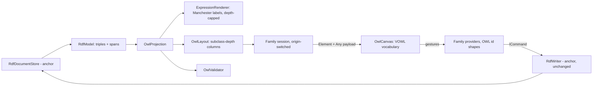

# Design Document

## Overview

No new module: `w3c/owl` is a further `DiagramDefinition` inside `src/diagrams/rdf/`, the C4/databricks multi-definition arrangement the anchor's design built for exactly this moment. Everything file-shaped is consumed from the anchor — the **triplestore document store**, the parser's `RdfModel` with source spans, the writers, the refusal seams — and what this design adds is a reading: `OwlProjection` (OWL's vocabulary over the model), `OwlLayout` (the deterministic subclass-depth arrangement), `OwlValidator`, the OWL cases of the family's provider trio, and the canvas styling that makes VOWL's vocabulary appear. The center of gravity, and the part worked out in most detail below, is the **class-expression machinery**: how a blank-node-rooted restriction becomes a drawn, selectable, Manchester-labeled node without ever pretending to an identity the file does not give it.

## Steering Document Alignment

### Technical Standards (tech.md)

- **Diagram storage** — the body is the anchor store's; this reading adds no serialization code and its authored positions ride the core `layout:` block per the **layout overlay**.
- **Commands** — every gesture dispatches the family's command shape (parse-check, byte capture, one writer call, snapshot inverse); this reading adds gesture names, not command machinery.
- **Specifying a diagram type** — the five build steps order the tasks document, scoped to a definition rather than a module.

### Project Structure (structure.md)

- All code lands in the existing `src/diagrams/rdf/` backend, client, api and examples folders; depends on core only. No new module folder, per the approved requirements.

## Code Reuse Analysis

### Existing Components to Leverage

- **`RdfDocumentStore` / `RdfModel`** — consumed whole; `OwlProjection` is a pure function over `RdfModel`, never a parser (shared machinery item 1). One store entry per file means R8.4's shared-document rule holds by construction.
- **`RdfWriter`** — every OWL gesture is an anchor writer operation under a reading-specific name: subclass edge = `AddTriple(s, rdfs:subClassOf, o)`; create class = `AddTriple(iri, rdf:type, owl:Class)` on a new statement; rename and remove-with-references = `RenameTerm`/`RemoveResource` verbatim; label/comment edits = the same annotation-triple splice the anchor's own property grid uses. This reading adds zero splice code.
- **The family provider trio and `Diagram.cs`** — the anchor registers one resolver/action/property/toolbox provider set switching on element-id shape; this design extends that switch with the OWL id shapes and adds the `w3c/owl` definition to `Definitions`.
- **Central canvas library** — `StraightConnection` for every edge kind (styled per axiom), the shared selection/menu/keyboard plumbing, `CanvasScrollbars`, the truncation banner precedent. Classes draw as circles per the adopted VOWL vocabulary: if the central library has no ellipse element by build time, the ellipse is added **to the central library** as a shared component (the skos sibling's concept nodes will want it too), never as a module-private fork — flagged in tasks as the one potential central touch.
- **`ExampleRegistrationTests` / `ExampleReplicationTests` / the problems pipeline** — joined by existing.

### Integration Points

- **Routing** — bare `.ttl`/`.nt` stays `w3c/rdf`'s; `w3c/owl` is explicit-registration only, Add-suggested off the `owl:Ontology` marker (the **routing arrangement**). The definition declares `SharedExtension: true` over the family extensions.
- **History** — module commands dispatch through `IHistoryStackStore`; one file under several readings shares one history (R8.4).
- **Registration header facility (anchor item 10)** — considered, and **no header name is claimed**: every approved requirement is served by one projection with no reading-specific, non-positional configuration to store. Claiming a word without a consumer would squat the family namespace; if a later need appears (an ABox-visibility toggle is the imaginable candidate), its single lowercase word gets claimed in the anchor's item 10 list first, per the facility's own rule.

## Architecture



The family session factory switches on the registration's origin: `w3c/rdf` binds the anchor's projection/layout/validator, `w3c/owl` binds this design's triple. One store underneath either way.

## Components and Interfaces

### `OwlProjection` — the vocabulary pass

Pure: `RdfModel` → the OWL graph, in three sweeps over the triple list, budget-bounded by the **drawn-element budget** measured after projection.

- **Entity sweep** — classifies IRIs per R1.1: class (declared `owl:Class` or used in class position), object/datatype property, named individual, datatype, the `owl:Ontology` header. Punning (R2.4) falls out naturally: classification is per-role, so one IRI can yield both a class node and an individual card, the grid naming the pun.
- **Axiom sweep** — subclass/equivalence/disjointness edges between named classes, domain/range wiring for property edges, characteristics and `owl:inverseOf` folded into property labels, `owl:Thing` anchors materialized for domain-less/range-less properties (R1.2), deprecation and externality flags (R1.6).
- **Expression sweep** — every blank node in class position (object of `rdfs:subClassOf`/`owl:equivalentClass`/`owl:disjointWith`, filler of a restriction, member of a set-operator list) becomes an **expression node** via the machinery below.

Element ids: named terms reuse the family's `res:{full-iri}` — which is what the **layout overlay** keys by, so a class keeps its authored position even if the same file is also open under `w3c/rdf`. Edges take the family `edge:` shape with an axiom-kind discriminator. Expression nodes take the structural id below, which the overlay refuses.

### The class-expression machinery — the blank-node intersection, worked out

Three questions the requirements posed; three concrete answers.

**Identity.** An expression node's id is structural, not blank-label-based: `expr:{owner-iri}|{axiom-predicate}|{ordinal}` for a root expression (owner = the named class the axiom attaches it to; ordinal = document-order index among that class's same-predicate axioms), extended with `/{child-index}` per nesting level for sub-expressions. This id is **deterministic within one parse** — the same bytes always produce the same ids, satisfying the same-file-opens-the-same-way rule — and deliberately **unstable across edits** (inserting an axiom shifts ordinals), which is precisely why the **blank-node identity boundary** governs it: the id exists for selection and rendering addressability only. Stored positions and element-keyed undoable edits are refused on `expr:` ids at both seams (provider and writer), with the boundary's sentence; the layout overlay never sees an `expr:` key.

**Label.** `ExpressionRenderer.Render(term, model, depth)` — a pure recursive function producing the Manchester-style string: an `owl:Restriction` reads its `owl:onProperty` and exactly one quantifier triple (`owl:someValuesFrom` → `∃ p.C`, `owl:allValuesFrom` → `∀ p.C`, `owl:hasValue` → `∋ p.v`, the cardinality triples → `= n p` / `≥ n p` / `≤ n p`, qualified forms carrying their filler); `owl:unionOf`/`owl:intersectionOf` walk their `rdf:List` cons-pairs joining members with ∪/∩; `owl:complementOf` prefixes ¬. Fillers that are named classes render as display names; fillers that are expressions recurse. Two guards: a **visited set** (a cyclic blank-node structure — malformed but parseable — renders `…` at the revisit and raises the R3.5 finding instead of hanging), and the **depth cap**.

**Elision, and the third level.** On the canvas the label is rendered with `depth = 2`; deeper structure appears as `…` inside the label and the node carries a visible elided marker (R3.4). The full, uncapped rendering is computed **on selection only** (the NFR's per-selected-element rule) and shown in the property grid as read-only text — so the user who wants the third level selects the expression node (or its owning class, whose grid lists its expressions) and reads the complete Manchester form; the Turtle itself remains the final authority one text-editor click away. Nothing is expandable *on the canvas*, deliberately: an expanding node would need a stored expansion state, which is exactly the per-element persistence the identity boundary rules out.

Malformed structures (R3.5) short-circuit the renderer: a restriction missing `owl:onProperty` or with no quantifier renders as the marked problem node labeled with what it has, and the validator carries the error with the span's line.

### `OwlLayout` — the asserted tree as geometry

Pure and deterministic, no physics: named classes fall into **columns by asserted subclass depth** (roots in column 0; a class's column = 1 + max over its asserted superclasses; a subclass cycle collapses its members into one column at the cycle's minimum depth, matching the validator's warning). Within a column, document order. Expression nodes place in a band beside their owner class, in ordinal order; datatype nodes beside the domain class of the property that reaches them; individuals in a band below the TBox; the ontology header top-left; `owl:Thing` anchors where their properties need them. Every authored `res:` position from the overlay wins over the computed place; `expr:` nodes always take the computed place.

### `OwlValidator`

R5's findings as a pure function over model + projection: subclass-cycle warning (DFS over named-class subclass edges, cycle members named), malformed-expression error with line, undeclared-property info, deprecated-reference info, and the R4.2 `owl:imports` info naming each import as present-but-not-fetched (the **no-network, no-inference rule** made visible). File-level findings stay the anchor's; nothing is restated.

### Providers — the OWL cases

The family resolver/action/property/toolbox providers gain the OWL id shapes (`res:` under an owl session, `edge:{axiom}`, `expr:`) and per-R6/R7 behavior: toolbox offers Class, Object property, Datatype property, Individual (no restriction entry, with R7.1's reason); actions cover subclass-edge drawing (`rel:` gesture → one `rdfs:subClassOf` splice, duplicate refused), domain/range statement, rename, remove-with-count; the property grid shows R7.2/7.3's rows with label/comment editable and every unavailable edit carrying its sentence — `expr:` selections showing the full Manchester text read-only with the boundary's sentence as the stated reason.

### Client — `OwlCanvas`

Composed from the central library and shared appearance: circle class nodes (label centered; doubled border for equivalence per R2.2; dashed small circle for `owl:Thing`; dimmed style for deprecated/external), rectangle datatype nodes, dotted subclass edges, labeled property edges with characteristic words, set-operator circles carrying their symbol, compact expression nodes with the elided marker, individual cards in the family card shape, the truncation banner. All kind distinctions ride shape and edge style with theme-aware coloring — VOWL's fixed palette stays rejected. Payload decode is type-checked before `fromBinary`, per the family client shape.

## Data Models

Added to the existing `src/diagrams/rdf/api/rdf.proto` (packed as `Any` on the shared `Element`):

```proto
message OwlNodePayload {
  string kind = 1;         // class | datatype | individual | thing | ontology | operator
  string iri = 2;          // full IRI; empty for materialized owl:Thing anchors and operators
  string display = 3;      // rdfs:label preferred, prefixed name fallback (R1.4)
  repeated string badges = 4;      // types on individuals; imports on the header
  repeated RdfLiteralRow rows = 5; // reused from the anchor: literal assertions, annotations
  bool deprecated = 6;
  bool external = 7;
}
message OwlEdgePayload {
  string kind = 1;         // subclass | equivalent | disjoint | object-property | datatype-property | instance-of | assertion
  string from_element_id = 2;
  string to_element_id = 3;
  string label = 4;        // property display + characteristic words + cardinality annotation
  string property_iri = 5;
}
message OwlExpressionPayload {
  string label = 1;        // Manchester-style, depth-capped at 2
  bool elided = 2;         // deeper structure exists; full text via the property grid
  bool malformed = 3;      // R3.5's problem-node marker
  string owner_element_id = 4;
}
```

`RdfTruncationPayload` is reused as-is; truncation order keeps a class with its expression neighborhood whole (R8.3), implemented as: the budget cut walks classes in layout order and takes each class together with its attached expression and datatype nodes, never splitting mid-structure.

## Error Handling

### Error Scenarios

1. **Expression edit or reposition attempted** — refused at provider and writer with the blank-node identity boundary's sentence; content still draws (R3.2, R6.5).
2. **Nesting beyond two levels** — visible elision on the node, full text in the grid; never silent (R3.4).
3. **Malformed restriction / broken operator list** — problem node + validator error with line; the file still opens (R3.5, R5.2).
4. **Subclass cycle** — warning naming the cycle; layout collapses the cycle into one column rather than recursing forever (R5.1).
5. **`owl:imports` present** — info naming the imports as not fetched (R4.2); nothing else changes.
6. **Duplicate subclass edge, unknown prefix, truncated view, unregistered bare file** — the family refusals, under this reading's names, each with its sentence (R6).

## Testing Strategy

### Unit Testing

- **Projection**: a fixture corpus covering every R1/R2 construct — declarations, punning, deprecation, externality, `owl:Thing` anchoring, the header — asserting the produced nodes, edges and flags; determinism (same bytes, same ids, same graph twice).
- **Expression machinery**: `ExpressionRenderer` fixtures per construct (each restriction form, union/intersection/complement, qualified cardinality, nesting to four levels asserting the depth-2 elision and the uncapped grid form, a cyclic structure asserting the guard, each R3.5 malformation); structural-id determinism within a parse and the documented instability across an inserted axiom (asserted, so the boundary's reason stays true in code).
- **Layout**: column-by-depth on a fixture tree, cycle collapse, expression/datatype banding, overlay wins for `res:` and never for `expr:`.
- **Validator**: each R5 finding on a minimal fixture, and the R4.2 imports info.
- **Providers**: every refusal sentence (expression edit, reposition, duplicate edge, truncation, bare file), toolbox contents, the punning grid row.

### Integration Testing

- Open a registered ontology through the gRPC flow: classes, edges and expression nodes stream; reposition a class into the `.adp` with the body byte-identical; draw a subclass edge and undo byte-for-byte; the same file open under `w3c/rdf` and `w3c/owl` sharing one store and one history (R8.4).
- Examples joining `ExampleRegistrationTests` and `ExampleReplicationTests` by existing; provenance readmes asserted by the anchor's vendored-folder test; the RDF/XML→Turtle conversions recorded per R9.2.

### End-to-End Testing

- `tests.md` entries: the pizza ontology's restriction showcase rendering with correct Manchester labels and a visible elision on its deepest axiom; selecting an elided expression and reading the full form in the grid; the truncation banner on the budget-exceeding extract keeping class neighborhoods whole; the asserted-only check — a class with two asserted parents showing exactly two subclass edges and nothing inferred.
