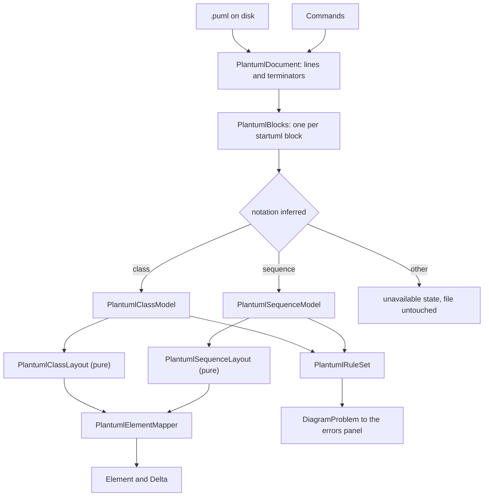
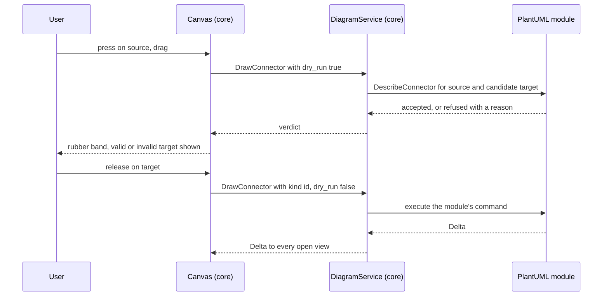

# Design Document

## Overview

The PlantUML module reads a `.puml` file, draws the block it addresses, and lets a user change it through the Toolbox, a connector gesture, the Properties panel and the context menu — writing every change back as a minimal edit to the text a human wrote.

Three facts shape the whole design, and each is a requirement rather than a preference:

1. **The file is shared.** A `.puml` in a repository is rendered by CI, by GitHub and by IDE plugins. ADP is one reader among several, and the image the team believes is usually not ADP's. So the document is held as a **concrete syntax tree over the original lines** — the same discipline `MindmapDocument`, `WardleyDocument` and `C4Document` arrived at — and an edit rewrites only the lines it touches (Requirement 2).
2. **PlantUML cannot express a coordinate.** Layout is *computed*, on the backend, and the document holds no positions. This is the fork `tech.md` requires every diagram type to take, and here it is taken by the format rather than by us. It also means the module declines the position sidecar `tech.md` permits, because a position only ADP honoured would make ADP's canvas disagree with the published image (Requirement 6.6).
3. **The module parses natively.** No `plantuml.jar`, no server, no Graphviz. Requirement 3.7 records the three reasons — the F5 dependency rule, the fact that a rendered image has no selectable element to hang the Properties panel and context menu off, and GPL licensing.

The module contributes one change to core, named in Requirement 8: a **connector gesture**. Core learns that a connection was drawn from one element to another with a backend-described kind id, and nothing else. What `..|>` means stays in the module.

## Steering Document Alignment

### Technical Standards (tech.md)

* **Diagram storage.** An established text format, unchanged. The `.adp` carries the `plantuml/uml` MIME line; the body is a sibling `.puml`; `DiagramDefinition.Extension` is `".puml"`, with `.plantuml`, `.pu`, `.iuml` and `.wsd` also routed (Requirement 1.4).
* **Specifying a diagram type — the four mandatory aspects.** All four are carried concretely below: *file format type* in `PlantumlDocument`/`PlantumlWriter` and the factory; *visualization* in `PlantumlClassLayout`/`PlantumlSequenceLayout` and the mapper, including the computed-versus-authored fork, taken as **computed**; *toolbox* in `PlantumlToolboxProvider`; *context actions and commands* in `PlantumlContextActionProvider` and `Commands/`.
* **Commands.** Every edit is an `ICommand` with an inverse, including the ones made by dragging. There is no path from the Properties panel or the canvas to the file that does not go through the history.
* **F5 experience.** No Java, no Graphviz, no native binary. The module is C# and its tests run in the same `dotnet test` as everything else.
* **Backend layout.** POCOs under `_Model/`, one entity per file, `_logger` per class via `Log.ForContext<T>()`.

### Project Structure (structure.md)

* The module lives at `src/diagrams/plantuml-uml/` with `backend/`, `api/` and `client/`, already scaffolded. Backend projects are `EtAlii.Adp.Diagram.PlantumlUml` and `EtAlii.Adp.Diagram.PlantumlUml.Tests`, which exist.
* **Dependency direction**: the module depends on core; core never depends on the module. The connector gesture is the test of that, and it is designed so core carries two element ids and an opaque kind id.
* `_Model/`, `Commands/` and `History/` stay in the project's own namespace, per the convention recorded in structure.md.

## Code Reuse Analysis

### Existing Components to Leverage

* **`C4Document`'s line model.** The `record struct Line(string Text, string Terminator)` shape, where each line carries the terminator it arrived with, is exactly what Requirement 2.1 needs and is already proven — including for documents that mix CRLF and LF. `PlantumlDocument` takes that shape rather than inventing a third variant of it.
* **`IDiagramDocumentFactory`, `IDiagramSessionFactory`, `IDiagramToolboxProvider`, `IContextActionProvider`, `IContextPropertyProvider`, `IDiagramValidator`.** All five seams exist and are used by three modules. This module is the fourth `IContextPropertyProvider` and introduces no panel change (Requirement 9.1).
* **`DiagramDefinitionCatalog` discovery** via the static `Definitions` array on `Diagram.cs` — already present in the scaffolded module, already publishing `DiagramOrigin("plantuml", "uml")`.
* **`ProblemMaintenance` and the errors panel.** Diagnostics are `DiagramProblem`s with a location; nothing new is invented (Requirement 11.1).
* **`ShortGuid`** for element identity on the wire.

### Integration Points

* **`DiagramService.Open` / `UpdateView`** — reused unchanged, as `mindmap-diagram` established.
* **`Path`'s additional segments.** Requirement 12.1 needs a `.puml` with several `@startuml` blocks to address each one. `Path` already documents additional segments as addressing a location *within* a file, so a block is addressed as a segment rather than by a new message.
* **The delta stream** carries every edit to every other open view; the module produces `Delta`s and never pushes to clients itself.

### Connectors: what fits, and what does not

The Toolbox path fits Requirement 7 exactly: `ToolboxItem.drop_action_id` already means "execute this action against the element dropped on". Requirement 8's gesture has **two** endpoints and no existing message carries two, which is why it is the one core change. `MoveElement` is the nearest existing gesture and is the wrong shape — it carries a `Point2D`, and this notation has no coordinates.

## Architecture



The five concerns the Non-Functional Requirements name are five units: the document (bytes), the blocks and notation inference (structure), the per-notation models (meaning), the layouts (arrangement), the mapper (the wire). A command edits the *document*, and the chain re-runs. Nothing downstream of `PlantumlDocument` ever writes.

### Flow: opening a `.puml`

1. `PlantumlSession` reads the file and builds `PlantumlDocument` — lines with their terminators, nothing parsed.
2. `PlantumlBlockScanner` finds `@startuml`/`@enduml` pairs and their optional names. The addressed block is chosen by `Path` segment, defaulting to the first.
3. `PlantumlNotation.Infer` reads the block's statements until one is decisive. A `participant`/`actor` declaration or a message with a lifeline arrow means sequence; a `class`/`interface`/`enum` declaration or a relationship arrow means class. An empty block is class by default, since that is what the Add dialog creates.
4. The matching model builder walks the block's statements, producing typed elements that each hold **the line numbers they came from**. That back-reference is what makes a minimal edit possible.
5. The layout runs as a pure function over the model.
6. `PlantumlElementMapper` produces `Element`s; `PlantumlRuleSet` produces `DiagramProblem`s.

Every step is skippable in a test: a layout can be exercised with a hand-built model, and the mapper with a hand-built layout.

### Flow: drawing a connector



The `dry_run` flag is what makes Requirement 8.5's live feedback and 8.6's explained refusal the same code path rather than two that can disagree. Core never learns what a kind id means; it renders the label and the reason the module supplied.

### Why the document is a CST and not a model

Requirement 2.1 asks for byte-identical round trips and 2.2 for edits that touch only their own lines. A model-and-regenerate design cannot give either without reimplementing every formatting choice a human made — arrow spelling, indentation width, where the blank lines are. Holding the original lines and editing in place gives both for free, and makes Requirement 3.3's "preserve verbatim" the default rather than a feature: a line nothing parsed is a line nothing rewrites.

### Why there is no sidecar, stated once so it is not re-litigated

`tech.md` permits a sidecar for ADP's own data and `c4-diagrams` uses one for positions. This type declines it (Requirement 6.6). A `.puml` is rendered by other tools from the same bytes; a position only ADP honoured would put ADP's canvas and the published image in disagreement, and the published image is the one a team believes. The module therefore writes **no** file other than the `.puml` itself.

### Why layout is deterministic, and how

Requirement 6.4 requires two openings of the same document to arrange identically. Both layouts are pure functions with no clock, no randomness and no hash-order iteration:

* **Class**: a layered arrangement. Ranks come from the inheritance and realization edges (a subtype below its supertype); within a rank, order is **declaration order in the document**, never a set's enumeration order. Containers are laid out by arranging their contents first and sizing the container around them with a margin (Requirement 6.2). Association and dependency edges do not affect ranking, only routing.
* **Sequence**: not a graph layout at all. The horizontal axis is participant order (Requirement 5.9: declaration order, then order of first appearance); the vertical axis is document order. Activation bars are spans over that axis; frames are boxes around a contiguous run of it. Requirement 6.3 says nothing here is free for the module to choose, and this design has nothing to choose.

### Modular Design Principles

* **Single file responsibility**: the parser does not lay out; the layout does not know about `Element`; the mapper does not parse.
* **Adding a notation** (Requirement 12.4) means a new model builder, a new layout, and toolbox/property/action contributions. It requires no change to `PlantumlDocument`, `PlantumlBlockScanner`, the mapper's element vocabulary, or core. That is the test of whether these seams are in the right place.
* **No core coupling**: core gains a gesture, not a vocabulary.

## Components and Interfaces

### `PlantumlDocument` (module, new, `_Model`)

The file as the lines it was read as, each with its own terminator. `Parse`, `ToText`, `ReplaceLine`, `InsertLine`, `RemoveLines`, plus `Newline` and `EndsWithNewline` for lines this writes. Byte-identical when nothing was edited, including a file that mixes terminators and one that ends without a newline.

### `PlantumlBlockScanner` (module, new, static)

Finds `@startuml`/`@enduml` pairs, their names and their line ranges. Answers "which block does this `Path` address" and "is this file addressable at all". A file with no pair is not a PlantUML document and opens unavailable.

### `PlantumlNotation` (module, new, static)

`Infer(block)` per Requirement 12.2, returning `Class`, `Sequence` or `Unsupported` with the name of what it saw. Requirement 12.3's unavailable state names the notation.

### `PlantumlClassModel`, `PlantumlSequenceModel` (module, new, `_Model`)

The typed models. Every element carries the line range it came from and a stable id derived from its name and block, so ids survive a re-parse and the selection does not jump after an edit. Requirement 4.9's implicitly-declared class is a first-class element with no declaration line — which is also why "delete this element" has to be able to mean "delete the relationships that mention it".

### `PlantumlClassParser`, `PlantumlSequenceParser` (module, new)

Statement-level parsers producing the models. They record, per line, whether it was modelled, preserved-but-not-modelled (Requirement 3.3), or structure-bearing-but-unresolved (Requirement 3.4). That per-line verdict is what `PlantumlRuleSet` reports and what `PlantumlEditGuard` consults.

### `PlantumlEditGuard` (module, new, static)

Answers Requirement 3.5: is it safe to write to this element? An element introduced inside an unevaluated preprocessor branch, or whose name came from a `!define`, is refused with a reason. The guard is consulted by the property provider (Requirement 9.10), the action provider (Requirement 10.8) and every command, so the answer is the same in all three places.

### `PlantumlClassLayout`, `PlantumlSequenceLayout` (module, new, static)

Pure functions from model to positions, per the Clear Interfaces requirement. No canvas, no file, no connection — testable directly, which is how Requirement 6.2's no-overlap and 6.4's determinism are checked.

### `PlantumlElementMapper` (module, new)

Model plus layout to `Element`s. Class types, members, relationships, packages and notes; participants, messages, activations, frames, dividers and notes. Kinds are expressed through the existing element vocabulary — no proto extension.

### `PlantumlDocumentStore` (module, new)

One open document per watched file, shared by every session on it, so two views of one file cannot diverge. The pattern `C4DocumentStore` already uses.

### `PlantumlSession`, `PlantumlSessionFactory` (module, new)

`Open` and `UpdateView`, reused unchanged from the shape the mindmap established.

### `PlantumlToolboxProvider` (module, new)

Requirement 7. Items depend on the **active block's** notation (7.4), so the provider reads the inferred notation rather than the file extension. Drop position is a text position: inside the package dropped on, or at the indicated point in message order (7.5). New elements get a unique placeholder name and are offered for rename in place (7.6).

### `PlantumlConnectorProvider` (module, new)

The module half of the core change. Describes the connector kinds for the active notation — the six class relationships (Requirement 8.3), the three sequence messages (8.4) — and answers `dry_run` probes with accept-or-reason. Refuses everything when the diagram is read-only (8.8).

### `PlantumlContextActionProvider`, `PlantumlContextPropertyProvider`, `PlantumlContextSourceResolver` (module, new)

Requirements 9 and 10. The property provider contributes `Line`, `Toggle` and `Text` editors today and `Choice` when it exists; until then an enumeration is a `Line` validated on commit, rejecting an unknown value with a reason rather than writing it (Requirement 9.8). Read-only reasons are contributed rather than omitted (9.10).

### `PlantumlRuleSet`, `PlantumlValidator` (module, new)

Requirement 11. Unresolved structure-bearing constructs are warnings (11.3); preserved-but-unmodelled kinds are information, **once per kind per document** (11.4) — a document with forty `skinparam` lines states one fact; an unparseable document is an error carrying the same message the unavailable state shows (11.5).

### `Commands/` (module, new)

One command per Requirement 10.1 entry, each with an inverse. Every one is a document edit expressed as a line operation, which is what makes the inverse cheap: the inverse of an insertion is a removal of the same range, and the inverse of a replacement is the text that was there.

### Client (module, new)

Renderers for the two notations under `src/diagrams/plantuml-uml/client/`, discovered by the existing `import.meta.glob` module registration. The client draws what the backend sent and computes no positions.

## Core changes

### The connector gesture (the one change Requirement 8 asks for)

**`src/api/diagrams.proto`:**

```proto
// The relationship kinds the open diagram's type offers for the connector gesture, described
// as data - core renders labels and reasons it does not interpret, exactly as it does for
// toolbox items and context actions.
rpc DescribeConnectors(DescribeConnectorsRequest) returns (DescribeConnectorsResponse);

// Draw one. With dry_run set, nothing is written and the response says only whether it would
// be accepted - which is what the canvas asks while the pointer is moving, so the live
// feedback and the final refusal cannot disagree.
rpc DrawConnector(DrawConnectorRequest) returns (DrawConnectorResponse);

message ConnectorKind {
  string id = 1;           // opaque to core
  string label = 2;
  string icon = 3;
  string description = 4;
}

message DrawConnectorRequest {
  ShortGuid project_id = 1;
  ShortGuid watch_id = 2;
  Path path = 3;
  string source_element_id = 4;
  string target_element_id = 5;
  string kind_id = 6;
  bool dry_run = 7;
}

message DrawConnectorResponse {
  bool accepted = 1;
  string reason = 2;       // why not, when accepted is false
}
```

**`IDiagramConnectorProvider`** (new, `EtAlii.Adp.Diagram`), mirroring `IDiagramToolboxProvider` so the seam is recognisable:

```csharp
public interface IDiagramConnectorProvider
{
    DiagramOrigin Origin { get; }
    ValueTask<IReadOnlyList<ConnectorKindDefinition>> DescribeAsync(ConnectorScope scope, CancellationToken cancellationToken);
    ValueTask<ConnectorResult> DrawAsync(ConnectorRequest request, CancellationToken cancellationToken);
}
```

A type contributing no connectors returns an empty list and the canvas does not offer the gesture — the same shape `DescribeToolbox` already uses for a type with no palette. **This is the only core change.** Anything else that turns out to need changing is a finding to report, not a licence.

## Data Models

No module proto. The two notations map onto the existing `Element` vocabulary, and the connector gesture is core's, above. `plantuml-uml/api/` therefore stays a readme explaining why it is empty — the same honesty `tech.md` asks for about an aspect that does not apply.

Backend records under `_Model/`: `PlantumlBlock`, `PlantumlLine`, `PlantumlType`, `PlantumlMember`, `PlantumlRelationship`, `PlantumlPackage`, `PlantumlNote`, `PlantumlParticipant`, `PlantumlMessage`, `PlantumlActivation`, `PlantumlFrame`, `PlantumlOrderedItem`, and `PlantumlLineVerdict`.

## Error Handling

1. **Unparseable document** (Requirement 2.5) — the diagram opens unavailable with the parser's message and line number, the errors panel shows the same message, and **the file is not written while it is unparseable**, so a broken file is never made worse.
2. **Missing body** (1.6) — the unavailable state names the path it looked for.
3. **Unsupported notation** (12.3) — unavailable, naming the notation; the file stays openable and unmodified.
4. **Unresolved `!include`** (3.4, 11.3) — a warning; the canvas draws what resolves and never presents a partial truth as a whole one.
5. **Unsafe edit** (3.5) — refused with a reason, surfaced on the element through a read-only reason and an unavailable action, so the limitation is visible before the save rather than discovered at it.
6. **Drag to reposition** (6.5) — refused with an explanation of the notation and a pointer at what *is* available: direction hints, `together { }`, hidden links. Requirement 6.8's meaningful drags — into a container, or reordering a participant — are honoured as ordinary commands.

## Testing Strategy

### Unit Testing

* `PlantumlDocument`: byte-identical round trips over CRLF, LF, mixed terminators, no trailing newline, comments in every position.
* `PlantumlBlockScanner` and `PlantumlNotation`: multi-block files, named blocks, inference for both notations and for an unsupported one.
* Parsers: every kind in Requirements 4.1–4.7 and 5.1–5.7, plus the implicitly-declared class of 4.9.
* Layouts as pure functions: no overlaps, containers sized around contents, relationships not routed through boxes (6.2); the same document arranged twice giving identical positions (6.4); sequence order following document order (6.3).
* `PlantumlEditGuard`: an element behind a preprocessor branch is refused, and the same reason appears in the property provider, the action provider and the command.
* Commands: every one round-trips through its inverse, back to byte-identical text.

### Integration Testing

* **A corpus test**, per the Reliability requirement: real-world `.puml` files covering both notations, hand-written indentation styles, CRLF and LF, and documents mixing modelled and unmodelled constructs, each asserted byte-identical after open and save. The fixtures are byte-compared, so `.puml` joins the by-extension `-text` list in `.gitattributes` — the reasoning is already written there.
* Every construct in Requirement 3.3's preserved list surviving a round trip **that edits something else in the same document**, which is the case a naive writer breaks.
* The two worked examples in Requirements 4.8 and 5.8 opening with every element selectable.
* The connector gesture end to end, including a refused target and the `dry_run` verdict matching the real one.

### End-to-End Testing

Deferred to `tests.md` only where a running app is genuinely required — the canvas gesture's rubber band and the rename-in-place affordance. Everything else is reachable without a browser.

## Deviations and notes

* **No sidecar, and no `Choice` editor.** Both are recorded above rather than worked around. The `Choice` gap is owned by `property-grid` Requirement 9; this spec is the second type to want it, and says so rather than inventing a local control.
* **`plantuml/c4` is out of scope** and should reuse this engine when it arrives rather than fork it.
* **A PlantUML-rendered preview** alongside the native canvas is not refused forever — Requirement 3.7 is written so that a later spec proposing one argues against a recorded position rather than an assumed one.
