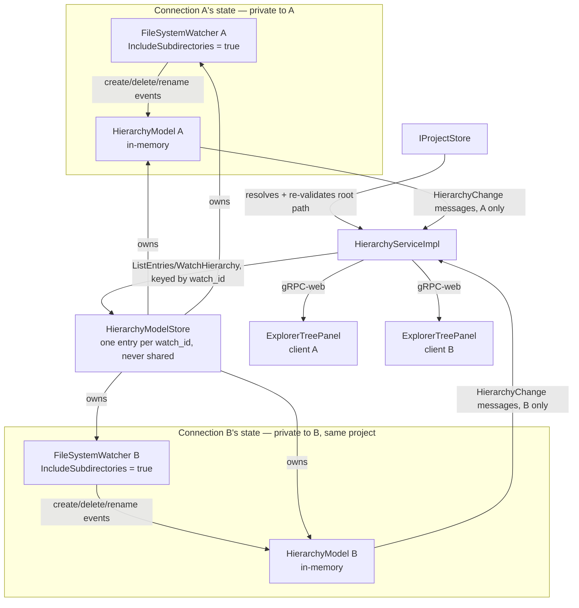

# Design Document

## Overview

This design adds a new backend gRPC service, `HierarchyService`, that resolves a project's root folder (Requirement 1), lists its file/folder hierarchy on demand (Requirement 2), and streams live changes to it (Requirement 4) — backed by a per-*connection*, in-memory hierarchy model, each fed by its own dedicated `FileSystemWatcher` instance (configured with `IncludeSubdirectories = true` so one watcher covers its connection's entire folder hierarchy). Nothing about this state is shared: two connections open to the same project run two fully independent watchers and models, with no cross-connection coordination. On the client, a new explorer tree component (living inside `adp-diagram-ide`'s workspace-shell side panel) consumes both calls to populate and keep the tree current (Requirement 3), rendering Material Design Icons for every node.

## Steering Document Alignment

### Technical Standards (tech.md)

* gRPC is the sole frontend-backend transport, per "the communication between the frontend and backend services will be gRPC based" — `HierarchyService` follows the same unary + server-streaming split already used by `ProjectService` (unary) and `AdpService` (streaming), rather than inventing a third transport.
* "Use the Base36 based ShortId everywhere where an ID or identity is needed" — every hierarchy entry id is `EtAlii.Adp.ShortGuid`, carried on the wire as `shared.proto`'s `ShortGuid` message (the same 16-byte contract `projects.proto` already uses for `Project.id`), not a bespoke string id.
* "File-system access from the backend is scoped to explicitly opened workspace folders, not the whole machine" — `HierarchyService` never resolves a path outside the project's root folder (Requirement 1.4/2.3), enforced the same way for both listing and watching.
* "State changes flow from backend to client as a gRPC stream... so multiple clients... stay in sync without manual refresh" — `WatchHierarchy` is that stream for the file/folder hierarchy, mirroring `AdpService.Connect`'s role for diagram deltas.
* No database: the hierarchy model is derived from disk and held in memory only for the lifetime of an open project session (Requirement 2.6), never persisted, consistent with the "File-based storage over a database" decision log entry.

### Project Structure (structure.md)

* `HierarchyService`'s backend implementation lives in `EtAlii.Adp.Backend` (core, not diagram-specific), in a new `Hierarchy/` folder alongside the existing `Projects/`, `Sessions/`, `Authentication/`, `Client/` folders — mirroring `Projects/`'s `ProjectServiceImpl` + `IProjectStore` split.
* Its `.proto` contract, `hierarchy.proto`, lives in the shared `src/api/` folder alongside `projects.proto`/`connection.proto`/`shared.proto`, importing `shared.proto` for `ShortGuid` exactly as `projects.proto` does.
* The client's explorer tree component lives in `client/` alongside `adp-diagram-ide`'s workspace shell (the side panel it plugs into), not inside any `diagrams/<diagram>/client/` folder — it has no diagram-type-specific knowledge.

## Code Reuse Analysis

### Existing Components to Leverage

* **`SessionContext`** (`EtAlii.Adp.Backend.Sessions`): `HierarchyService`'s calls read the authenticated user id from `ServerCallContext.UserState` the same way `ProjectServiceImpl` does, so authorization (Non-Functional: Security) reuses the existing session interceptor rather than a new mechanism.
* **`IProjectStore`** (`EtAlii.Adp.Backend.Projects`): resolving a `project_id` to its root folder path (and re-validating it resolves to an accessible folder, Requirement 1.2) reuses the existing per-user project store rather than duplicating project lookup.
* **`ShortGuid` / `EtAlii.Adp.Contracts.ShortGuid`** (`EtAlii.Adp` library, `ShortGuid.Cast.cs`): entry ids reuse the exact same type and implicit wire conversion `ProjectRecord.Id` already uses — no new id type.
* **`@mdi/font` client integration** (`main.tsx`, `ProjectGridPage.tsx`): the explorer's node icons (Requirement 3.6–3.9) reuse this existing import rather than adding a package.
* **`adp-diagram-ide` workspace shell side panel**: the explorer tree is a new component rendered inside that existing panel, not a new panel.

### Integration Points

* **`login-project-selection`'s `Project.path`**: `HierarchyService` resolves a project's root folder through `IProjectStore`, the same store `ProjectService` already owns — no second source of truth for "where is this project's folder."
* **`adp-diagram-ide` Requirement 1 (workspace shell) / Requirement 3 (`AdpService` change feed)**: the explorer tree is a new leaf under the existing side panel, and `WatchHierarchy` is a second, independent change-feed stream opened alongside `AdpService.Connect` when the workspace shell opens (Requirement 3.11) — the two streams don't share a connection, since a project's hierarchy and an individual open diagram's elements have different lifecycles (one per project vs. one per open diagram tab).
* **`rename-files-and-folders`** (future spec, blocked on this one being implemented): will add a `RenameEntry` RPC to `hierarchy.proto` and reuse `HierarchyModel`'s id-preserving rename handling (Requirement 4.5) directly — this design's id stability is what makes that spec's "keep the same node identity across a rename" requirement possible.

## Architecture



* `HierarchyModelStore` is a plain dictionary keyed by a client-generated `watch_id`, one entry per connection — never one entry per project. It creates a connection's `HierarchyModel` + `FileSystemWatcher` pair the first time that `watch_id` is seen (from either `ListEntries` or `WatchHierarchy`), and removes and disposes both when that connection's `WatchHierarchy` call ends. Since it's a strict 1:1 mapping, no ref-counting is needed — unlike a shared-per-project design, there's never a "last connection" to wait for.
* `HierarchyModel` is the "in-memory model" of Requirement 4.8: one connection's private dictionary of entries keyed by `ShortGuid`, populated lazily as `ListEntries` lists folders and as that connection's own watcher observes changes, never eagerly walking the whole tree (Performance NFR). Two connections to the same project never touch each other's `HierarchyModel`, so they may assign different ids to the same on-disk entry — that's expected, not a bug (Requirement 2.5).

### Modular Design Principles

* **Single file responsibility**: `HierarchyServiceImpl` (gRPC surface), `HierarchyModel` (tree + id state), `HierarchyModelStore` (per-connection lifecycle), and the watcher wrapper are four separate classes, mirroring how `Projects/` already splits `ProjectServiceImpl` from `IProjectStore`/`FileProjectStore`.
* **No diagram coupling**: `hierarchy.proto` and `Hierarchy/` depend on nothing from `elements.proto`/`deltas.proto` — a hierarchy entry is a name + kind + id, not a diagram element.
* **Testability**: `HierarchyModel`'s id assignment, containment checks, and event-to-message translation are plain, watcher-independent logic, unit-testable without a running `FileSystemWatcher` or gRPC server (tests can feed it synthetic events).
* **No cross-connection sharing**: nothing in `Hierarchy/` keys state by `project_id` alone — every stateful lookup is keyed by the connection's own `watch_id`, so it is structurally impossible for one connection's model to leak into another's.

## Components and Interfaces

### `HierarchyService` (backend, `EtAlii.Adp.Backend`, gRPC contract)

* **Purpose:** List a folder's direct children (Requirement 2) and stream hierarchy changes (Requirement 4) for one connection.
* **Interfaces:** `ListEntries(ListEntriesRequest) returns (ListEntriesResponse)` (unary); `WatchHierarchy(WatchHierarchyRequest) returns (stream HierarchyChange)` (server-streaming). Both requests carry a client-generated `watch_id` (see Data Models) that scopes them to one connection's state.
* **Dependencies:** `IProjectStore` (root path resolution/re-validation), `IHierarchyModelStore`.
* **Reuses:** `SessionContext` for the authenticated user id on every call.

### `IHierarchyModelStore` / `HierarchyModelStore` (backend, `EtAlii.Adp.Backend.Hierarchy`)

* **Purpose:** Own the per-connection lifecycle from Requirement 4.4/4.8 — one dedicated `HierarchyModel` + watcher per `watch_id`, never shared, even across two connections to the same project.
* **Interfaces:** `HierarchyModel GetOrCreate(ShortGuid watchId, string rootPath)`, `void Remove(ShortGuid watchId)` (disposes that connection's model and watcher; called when its `WatchHierarchy` call ends). No ref-counting — the mapping is strictly 1:1, so there is never a "last connection" to wait for the way a shared-per-project store would need.
* **Dependencies:** None beyond what it's handed (root path comes from `IProjectStore` via `HierarchyServiceImpl`).
* **Reuses:** N/A — this is the new per-connection state owner other pieces use.
* **Design note:** if `ListEntries` is called before `WatchHierarchy` (Requirement 3.11's normal order is list-then-watch), the store lazily creates that `watch_id`'s model on that first `ListEntries` call, without yet creating a watcher — a watcher only starts once `WatchHierarchy` actually opens for that same `watch_id` (Requirement 4.4). As a safety net against a client that lists but never opens the stream (e.g., navigates away first), the store evicts a watcher-less model after a short idle timeout rather than holding it forever.

### `HierarchyModel` (backend, `EtAlii.Adp.Backend.Hierarchy`)

* **Purpose:** The in-memory tree for one connection: entries keyed by `ShortGuid` (Requirement 2.5/2.6), containment-checked path resolution (Requirement 1.4/2.3), and watcher-event-to-`HierarchyChange` translation (Requirement 4.5–4.7).
* **Interfaces:** `IReadOnlyList<EntryNode> ListChildren(ShortGuid? folderId)` (null = root; results sorted folders-before-files then alphabetically, per Requirement 3.5, so ordering is decided once here rather than independently by whichever client happens to be on the other end); `void OnWatcherEvent(WatcherChangeTypes, string oldPath, string newPath)`; `void Reconcile()` (full re-scan, used for Requirement 4.6's buffer-overflow recovery); event `EntryChanged` that `HierarchyServiceImpl` subscribes its one `WatchHierarchy` call to. `HierarchyServiceImpl` maps `EntryNode` to the wire `Entry` message itself (a `ToProto()` step), the same way `ProjectServiceImpl.ToProto` maps `ProjectRecord` to `Project` — `HierarchyModel` never constructs proto messages directly.
* **Dependencies:** The connection's resolved root folder path.
* **Reuses:** `ShortGuid.NewShortGuid()` for id assignment (Requirement 2.6).
* **Design note (Requirement 4.7):** `OnWatcherEvent` only updates the model for a path whose *parent* is already a known folder in this model (i.e., a folder this connection has actually listed). An event under a folder this connection has never listed is discarded outright — not queued, not partially recorded — since there is nothing yet to reconcile it against; a later `ListEntries` for that folder does a fresh disk read and assigns ids at that point (Requirement 2.6), same as if the event had never happened.

### `RootFolderWatcher` (backend, `EtAlii.Adp.Backend.Hierarchy`)

* **Purpose:** Thin wrapper around a single .NET `FileSystemWatcher` instance, dedicated to one connection, scoped to that connection's project root folder with `IncludeSubdirectories = true` — one watcher per connection covers that connection's entire folder hierarchy — forwarding create/delete/rename/error events to its owning `HierarchyModel` (Requirement 4.4). Two connections to the same project each get their own instance; nothing is shared or coordinated between them.
* **Interfaces:** Constructor takes the root path and a callback; `Dispose()` stops watching.
* **Dependencies:** `System.IO.FileSystemWatcher`.
* **Reuses:** N/A — first use of `FileSystemWatcher` in the codebase.

### `ExplorerTreePanel` (client, `client/`)

* **Purpose:** Renders the hierarchy inside the workspace shell's side panel (Requirement 3): generates one `watch_id` when the project opens (Requirement 3.11), fetches via `ListEntries` on expand, applies `WatchHierarchy` messages by id (Requirement 3.10), and renders MDI icons per node (Requirement 3.6–3.9).
* **Interfaces:** React component; local state is a `Map<ShortGuid, TreeNode>` mirroring that connection's backend model, so an incoming change message is a direct map lookup, not a tree walk. Generates its `watch_id` client-side (a fresh random id, not obtained from the server) and includes it on every `ListEntries` and the one `WatchHierarchy` call for that project session, so all of its calls land on the same backend-side `HierarchyModel`.
* **Dependencies:** A generated `HierarchyServiceClient` (grpc-web).
* **Reuses:** `@mdi/font` (already imported in `main.tsx`), the workspace shell's existing side-panel slot from `adp-diagram-ide`.

## Data Models

### `hierarchy.proto`

```protobuf
syntax = "proto3";

package etalii.adp;

import "shared.proto"; // ShortGuid

option csharp_namespace = "EtAlii.Adp";

enum EntryKind {
  ENTRY_KIND_UNSPECIFIED = 0;
  FILE = 1;
  FOLDER = 2;
}

message Entry {
  ShortGuid id = 1;
  ShortGuid parent_id = 2; // unset for a root-level entry
  string name = 3;
  EntryKind kind = 4;
  bool available = 5; // false when Requirement 2.4 applies (permissions, deletion)
}

message ListEntriesRequest {
  ShortGuid project_id = 1;
  ShortGuid folder_id = 2; // unset = list the root folder's direct children
  ShortGuid watch_id = 3;  // client-generated; scopes this call to one connection's HierarchyModel (never shared across connections)
}

message ListEntriesError {
  string message = 1;
}

message Entries {
  repeated Entry entries = 1;
}

message ListEntriesResponse {
  oneof result {
    Entries entries = 1;
    ListEntriesError error = 2;
  }
}

message WatchHierarchyRequest {
  ShortGuid project_id = 1;
  ShortGuid watch_id = 2; // same client-generated id used on this connection's ListEntries calls
}

message EntryCreated {
  Entry entry = 1; // parent_id/name/kind resolved from the model, per Requirement 4.5
}

message EntryRemoved {
  ShortGuid entry_id = 1;
}

message EntryRenamed {
  ShortGuid entry_id = 1;
  string new_name = 2;
}

message RootUnavailable {
  string message = 1; // Requirement 4.3
}

message HierarchyChange {
  oneof change {
    EntryCreated created = 1;
    EntryRemoved removed = 2;
    EntryRenamed renamed = 3;
    RootUnavailable root_unavailable = 4;
  }
}

service HierarchyService {
  rpc ListEntries(ListEntriesRequest) returns (ListEntriesResponse);
  rpc WatchHierarchy(WatchHierarchyRequest) returns (stream HierarchyChange);
}
```

### `HierarchyModel` in-memory entry (backend, not a proto)

```
EntryNode:
  Id: ShortGuid
  ParentId: ShortGuid?     // null for a root-level entry
  Name: string
  IsFolder: bool
  Available: bool
```

Held only in memory, one instance per `watch_id`, per `HierarchyModelStore`'s lifecycle (Requirement 2.6) — never written to disk, and never shared with another connection's `EntryNode` dictionary, since the folder tree itself (not this cache) is the source of truth (Alignment with Product Vision).

## Error Handling

### Error Scenarios

1. **Root folder inaccessible at project-open time (Requirement 1.2/1.3)**
   * **Handling:** The first `ListEntries` call for a project (root, `folder_id` unset) re-validates the path via `IProjectStore`; if it no longer resolves, `ListEntriesResponse.error` is returned and `HierarchyModelStore` never creates a model for that connection's `watch_id`.
   * **User Impact:** Workspace-shell entry is aborted with a clear error (per `adp-diagram-ide`'s shell-entry flow); the project stays in the user's list untouched.

2. **A listed folder becomes inaccessible later (Requirement 2.4)**
   * **Handling:** `HierarchyModel` marks that entry `available = false` rather than removing it or failing the containing `ListEntries`/`WatchHierarchy` call.
   * **User Impact:** The folder renders with the distinct unavailable icon/treatment (Requirement 3.9) instead of disappearing or erroring the whole tree.

3. **The root folder itself becomes inaccessible while open (Requirement 4.3)**
   * **Handling:** `RootFolderWatcher` reports the failure to its connection's `HierarchyModel`, which pushes `RootUnavailable` on that connection's own `WatchHierarchy` stream and attempts to restart that connection's watcher once the root is reachable again (Reliability NFR). Every open connection to that project detects and recovers from this independently — there is no shared watcher to coordinate.
   * **User Impact:** The explorer shows a clear, scoped error banner rather than a stale or silently empty tree.

4. **Watcher buffer overflow (Requirement 4.6)**
   * **Handling:** `HierarchyModel.Reconcile()` re-scans everything currently in the model against disk, preserving existing ids and only assigning new ones for genuinely new entries.
   * **User Impact:** Invisible under normal use — the tree simply stays correct through a burst of missed low-level events.

5. **Path escape attempt (`..`, symlink) (Requirement 1.4/2.3)**
   * **Handling:** `HierarchyModel` resolves every path against the project's root using `Path.GetFullPath` + a strict prefix check (and resolves symlink targets before that check), rejecting anything that would resolve outside it; such a request is treated as an invalid/not-found entry, never as a folder to list.
   * **User Impact:** No content from outside the project is ever observable through the explorer, regardless of how the request was shaped.

## Testing Strategy

### Unit Testing

* `HierarchyModel`: id assignment and stability across relist/rename (Requirement 2.5/2.6), root-containment rejection for `..`/symlink paths (Requirement 1.4/2.3), watcher-event → `HierarchyChange` translation (create carries parent id/name/kind; delete/rename carry existing id), `Reconcile()`'s id-preserving behavior on synthetic "buffer overflow" input, deterministic folders-before-files/alphabetical ordering from `ListChildren` (Requirement 3.5), and `OnWatcherEvent` discarding an event whose parent folder was never listed (Requirement 4.7).
* `HierarchyModelStore`: create-on-first-use / dispose-on-`Remove` per `watch_id`, and the idle-timeout eviction path for a model with no `WatchHierarchy` connection yet.
* Client `ExplorerTreePanel` state reducer: applying created/removed/renamed messages by id against a synthetic tree, independent of any real gRPC call.

### Integration Testing

* `HierarchyServiceImpl.ListEntries`/`WatchHierarchy` against a real temporary folder: expand-on-demand returns only direct children.
* **Isolation, not sharing:** two simultaneous `WatchHierarchy` connections (two different `watch_id`s) to the *same* project run independent watchers/models — a change pushed to one connection's stream is never observed on the other's, and the two are free to (and in practice will) assign different ids to the same on-disk entry. This is the property Requirement 4.4/4.5/4.8 and the Code Architecture NFR require, and is the one most worth a regression test given it inverts an earlier draft of this design.
* A real `FileSystemWatcher` against that temp folder: create/delete/rename on disk produce the expected `HierarchyChange` messages on that connection's own stream, including a rename preserving the entry's id (the guarantee `rename-files-and-folders` will depend on).
* Root folder deleted out from under an open connection: `RootUnavailable` is pushed on that connection's stream, and recreating the folder allows that connection's watcher to recover per the Reliability NFR.

### End-to-End Testing

* Local F5 scenario: open a project → explorer shows its real files/folders with correct icons → create/rename/delete a file with the OS file explorer, outside the IDE → the tree updates without a manual refresh, without collapsing an already-expanded sibling folder or losing the current selection.
