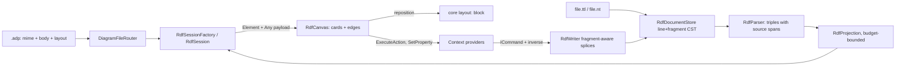

# Design Document

## Overview

One module, `src/diagrams/rdf/`, carrying the `w3c/rdf` type and — by construction — the engine its sibling readings (`owl-diagram`, `skos-diagram`, `shacl-diagram`) will register further definitions into: the C4/databricks multi-definition arrangement, one store and one parser under several MIME types. The design's center of gravity is the **Turtle concrete syntax tree**: unlike every line-oriented format before it, a Turtle statement legitimately spans lines (`;` predicate lists) and packs several triples into one line (`,` object lists), so the established line-CST-and-splice discipline gains one extension here — a splice may rewrite a single line, replacing only the fragment one triple owns — and everything else (the store lifecycle, the command inverses, the layout overlay, the canvas composition) is consumed from the patterns the databricks family finished.

## Steering Document Alignment

### Technical Standards (tech.md)

- **Diagram storage** — `.ttl`/`.nt` belong to the W3C ecosystem and round-trip byte-identically; authored positions go to the `.adp` per the layout rule (shared machinery item 6).
- **Commands** — every edit is an `ICommand` with a byte-restoring inverse; the writers refuse before any splice.
- **gRPC call shapes** — no new services or streams; elements ride the existing `Element`/`Delta` with `Any` payloads.
- **Specifying a diagram type** — the five build steps order the tasks document.

### Project Structure (structure.md)

- `src/diagrams/rdf/backend/EtAlii.Adp.Diagram.Rdf/` (+ `.Tests`), `src/diagrams/rdf/client/`, `src/diagrams/rdf/api/rdf.proto`, `src/diagrams/rdf/examples/` — the layout every sibling module has; depends on core only.

## Code Reuse Analysis

### Existing Components to Leverage

- **`DiagramDefinition`** — `w3c/rdf` with `Extension: ".ttl"` routing bare bodies (plus `.nt` via a second definition alias or the router's extension list — resolved below), icon `mdi-graph-outline`.
- **The databricks module as the structural template** — store lifecycle with self-write guard, per-origin session factory reading `.adp` headers module-side, `DatabricksEdits.Run`-style command discipline with whole-document snapshot inverses, provider trio over a shared selection vocabulary, per-type toolbox.
- **The core `layout:` block** — `RegistrationLayout` and `SetRegistrationLayoutCommand`, consumed unchanged; element ids are `res:{full-iri}` (safe in the block's `<id>: <x> <y>` grammar because IRIs cannot contain spaces).
- **Central canvas library and appearance** — `BoxElement` for resource cards, `StraightConnection` for edges (the any-direction graph case its own remarks name), the shared `canvas.css` classes, `CanvasScrollbars`, selection/menu/keyboard plumbing.
- **The problems pipeline, `ExampleRegistrationTests`, `ExampleReplicationTests`** — joined by existing.

### Integration Points

- **Routing** — `.ttl` and `.nt` route bare to `w3c/rdf`; sibling definitions will join with `SharedExtension: true` over the same extensions so they never compete (the routing arrangement).
- **Context channel** — one resolver, action provider, property provider and toolbox provider for the family, switching on element-id shape; registered like every module's.
- **History** — module commands dispatch through `IHistoryStackStore`; repositions ride the core layout command.

## Architecture



## Components and Interfaces

### Backend: the document and its parser

- **`RdfDocument`** — the line CST: lines with per-line terminators, byte-identical `Text`, `Replace`/`Insert`/`Remove` with the unterminated-end reversibility guard — the `DatabricksDocument` shape verbatim.
- **`RdfTokenizer` / `RdfParser`** — a hand-rolled recursive-descent Turtle parser (and the trivial N-Triples line parser) producing `RdfModel`. Hand-rolled rather than a library, deliberately: the splice discipline needs **source spans** — for every triple, the line range it occupies and, where a line holds several triples, the character fragment within the line that this triple (and any separator it owns) occupies — and no .NET RDF library reports spans at that grain. The parser handles the full Requirement 1.1 construct list; a `YamlException`-style `RdfParseException` carries line and reason for the unavailable state.
- **`RdfModel`** — `IReadOnlyList<RdfTriple>` plus `PrefixMap` (prefix → IRI, with declaration line) and `BaseIri`. `RdfTriple(Subject, Predicate, Object, Span)`; `RdfTerm` is a closed set: `IriTerm(full IRI, as-written form)`, `BlankTerm(label or anonymous ordinal)`, `LiteralTerm(lexical, datatype IRI, language)`. `SourceSpan(StartLine, EndLine, FragmentStart?, FragmentEnd?)` — fragment offsets null when the triple owns whole lines.
- **`RdfDocumentStore`** — one entry per path: document + model + error/line, the load/save/forget/reload lifecycle with the self-write guard, `Changed` event. This is the **triplestore document store** the sibling specs reference; their projections consume `RdfModel`, never the parser.

### Backend: writers — the splice discipline, fragment-aware

- **`RdfWriter`** named operations, each answering empty-or-refusal before any splice:
  - `AddTriple(document, model, s, p, o)` — appended to the subject's existing block (as a new `;` continuation line matching the block's indentation) or as a new statement after the last statement; terms written with declared prefixes, else full IRIs; never inventing declarations.
  - `RemoveTriple` — whole-line removal where the triple owns its lines; **fragment splice** where it shares one (rewriting that single line minus the fragment and its stranded separator); removing a subject's last triple removes the block and its terminating `.`.
  - `RemoveResource` — every triple whose subject or object the term is, bottom-up, fragments before whole lines within the same pass.
  - `RenameTerm` — every occurrence (subject/predicate/object, prefixed or full) rewritten in one operation; collision refused first.
  - `ReplaceObjectLiteral` — the fragment splice rewriting exactly one literal object token in place (lexical form, datatype annotation or language tag), every neighbouring byte untouched — what a label, comment or documentation edit is. Family-level deliberately, adopted from the `skos-diagram` review: its definition speaks only Turtle, and at least three readings want it. The boundary rule it demonstrates: an operation whose definition speaks only Turtle — terms, triples, literals, prefixes — belongs to this writer; an operation whose definition needs a reading's vocabulary belongs to that reading, built on top of these.
  - `AddPrefix` — one declaration line beside the existing `@prefix` run.
- N-Triples goes through the same operations degenerate-simply (every triple owns exactly one line).
- **Commands** wrap operations per the databricks `DatabricksEdits.Run` pattern: parse-check, byte capture, one writer call, save; inverse = whole-document snapshot restore whose redo is the original command. The blank-node and serialization refusals live in the providers and writers both (defense at the seam and at the splice).

### Backend: definition, session, projection, layout

- **`Diagram.cs`** — the `w3c/rdf` definition (siblings append to `Definitions` as their specs land). `.ttl` is the declared extension; `.nt` routes through a second definition entry `w3c/rdf` cannot duplicate — resolved as: the definition declares `.ttl`, and the router's bare-body table gains `.nt` via a small core-consuming registration the design keeps module-side if possible; if the router proves single-extension-per-definition, the fallback is a sibling-shaped alias definition sharing the origin's engine, flagged at implementation as a finding if core needs a touch.
- **`RdfProjection`** — pure: `RdfModel` → drawn nodes and edges up to the **drawn-element budget** (module constant, default 1,000 nodes), in document order of first appearance; literals fold into their subject's payload rows; `rdf:List` plumbing collapses to ordered member edges; the truncation fact (shown N, total M) rides the projection result.
- **`RdfLayout`** — pure, deterministic: nodes grouped into horizontal bands by primary `rdf:type` (bands ordered by type IRI; the untyped band last), grid-placed within a band in projection order; no physics (the research section's rejected tradition).
- **`RdfSession`** — the databricks session shape: render = projection + `RegistrationLayout.Apply` overlay; `MoveElementToAsync` dispatches the core layout command (refused for blank-rooted ids, unregistered bare files, edges); `Changed` re-renders and diffs.
- **`RdfDocumentFactory`** — the minimal new `.ttl`: one `@prefix ex:` and one typed resource, parsing and validating clean.

### Backend: providers and validation

- **`RdfContextSourceResolver` / `RdfContextActionProvider` / `RdfContextPropertyProvider` / `RdfToolboxProvider`** — the databricks provider trio over an `RdfSelection` vocabulary (`res:{iri}`, `edge:{s}|{p}|{o-hash}`, `blank:{ordinal}`); actions per Requirement 6 (rename, remove-with-count, disconnect, add-triple via `rel:` gesture, add-resource via `new:` placement with prefix-validated dialog); property grid rows per Requirement 6.2-6.3 with editable `rdfs:label`/`rdfs:comment`; every refusal carrying its sentence.
- **`RdfValidator`** — Requirement 7's findings (unparseable-once; duplicate prefix redeclaration; relative-IRIs-without-base warned once; malformed language tag; unknown XSD datatype), through the standard pipeline, no network, no inference. Reading-specific rules stay in sibling specs.

### Client

- **`RdfCanvas`** — composed from the central library and shared appearance: `BoxElement` cards sized by literal-row count (rows rendered as tspans within the card), `StraightConnection` edges with the shared arrowhead, type badges, `CanvasScrollbars`, the full interaction set (drag → layout command, `rel:` anchors, `new:` drops, shared menu); truncation banner styled like the simulation banner precedent. Model/stream hooks per the databricks client shape; payload decode type-checked before `fromBinary`.

## Data Models

Wire payloads in `src/diagrams/rdf/api/rdf.proto` (packed as `Any` on the shared `Element`):

```proto
message RdfResourcePayload {
  string iri = 1;                 // full IRI; empty for a blank node
  string display = 2;             // prefixed name, local name, or _:label
  repeated string types = 3;      // prefixed rdf:type names, badge order
  repeated RdfLiteralRow rows = 4;
  bool blank = 5;                 // the identity-boundary marker the canvas styles by
}
message RdfLiteralRow { string predicate = 1; string value = 2; string annotation = 3; } // datatype or @lang
message RdfEdgePayload { string from_element_id = 1; string to_element_id = 2; string predicate = 3; string predicate_iri = 4; }
message RdfTruncationPayload { int32 shown = 1; int32 total = 2; } // rides one banner element when truncated
```

## Error Handling

### Error Scenarios

1. **File does not parse** — unavailable naming file/line/reason; edits and saves withheld with the same sentence (R1.5).
2. **Refused serialization** — registration works, diagram opens unavailable naming the serialization and its reason (R1.6).
3. **Blank-node-rooted position or edit** — refused with the identity-boundary sentence; content still draws (R4.5, R5.6).
4. **Truncated file** — first-N view, banner, info finding; edits withheld naming truncation (R8).
5. **Rename collision / unknown prefix in a dialog** — refused in validation before any splice, on the writer's own terms (R5.4, R5.7).
6. **Unregistered bare file reposition** — refused naming the missing registration; registering lifts it (R4.3).

## Testing Strategy

### Unit Testing

- Parser: a fixture corpus per serialization covering every R1.1 construct, CRLF/LF/no-trailing variants, comments — byte-identity on the untouched round trip; span correctness asserted for multi-line and shared-line triples. Fixture files `-text` in `.gitattributes`: by extension (`*.ttl -text`, `*.nt -text`) since this family owns the extensions — the reasoning recorded there per the standing instruction.
- Writer: smallest-diff per operation including the fragment splices (`,`-list member removal, `;`-list removal, last-triple block removal), rename-with-references, refusals; every inverse restoring bytes through the real command pipeline.
- Projection/layout/budget: document-order determinism, type banding, the budget cut on a fixture built to exceed it.
- Providers and validator per the databricks test shapes.

### Integration Testing

- The gRPC flow: open a registered `.ttl`, stream cards and edges, reposition into the `.adp` with the body byte-identical, undo byte-for-byte; a bare `.ttl` routing on sight; one file under two registrations sharing edits.
- Examples joining `ExampleRegistrationTests` and `ExampleReplicationTests` by existing; the license/provenance readme presence asserted by a module test walking the vendored folders.

### End-to-End Testing

- `tests.md` entries: the truncation banner on the over-budget example; a fragment-splice edit (`,`-list removal) leaving the neighbouring objects' bytes untouched in a visible diff; reposition-reopen-undo on a vendored example.
