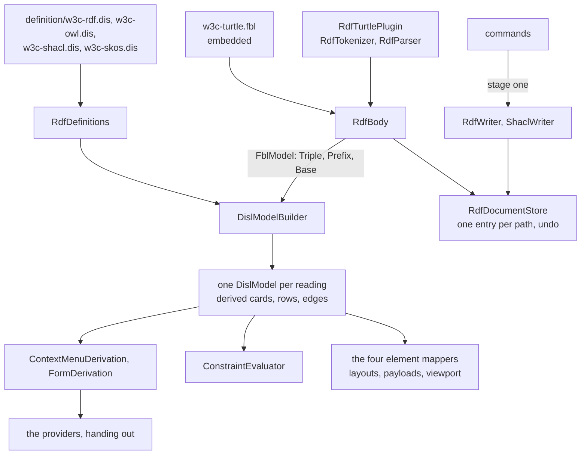

# Design Document

## Overview

The RDF module is four tool types over one body, so it is converted **reading first, then one tool type at a time**, in steps that are each one pull request and each held to four frozen transcripts, one per reading. The transcripts are generated from today's code first (step 1). Every later step replaces one hand-written part and must reproduce all four byte for byte, except where the requirements name a change: Q4 (a sibling reading's entries leave another reading's menus) and finding B7 (an `.nt` body is written as N-Triples).

Against the defaults of the six open questions the work is in **two stages** (Q5). This design builds stage one: the body is read by a persistence plugin, each reading's elements, palette, menus, rows and findings are derived from its bundled definition, and the four canvases are compiled. Commands keep writing through `RdfWriter` and `ShaclWriter`. Stage two, writing through the plugin's `plan`, waits for FBL; *What waits, and on what* says for what.

Three classes carry the conversion:

- `RdfDefinitions`: the four bundled definitions loaded once, each with its `x-` block, and what the providers derive from the one that matches the reading.
- `RdfTurtlePlugin`: the persistence plugin `net.etalii.adp.w3c.turtle`, whose `read` is `RdfTokenizer` and `RdfParser`.
- `RdfBody`: one `.ttl` or `.nt` body opened through the module's binding, giving the plugin's reading and, per reading, the DISL model built from it.

**One point of the approved requirements is proposed for amendment** before the tasks are written, in *Amendment proposed*. It concerns Requirement 6.3 (the default of Q3) and its conflict with Requirement 4.6.

## Steering Document Alignment

### Technical Standards (tech.md)

- *Specifying a diagram type*: the four definitions live in etalii-adp/etalii.adp and are bundled, never edited here. The binding is the module's own file and each definition names it by URL.
- Splices, never reserialization: the writers already splice lines. They stay until `plan` can carry their edits, and nothing in stage one reserializes.
- The four gates, the transcripts and "a test seen to fail first" are the checks of every step.

### Project Structure (structure.md)

- A diagram type adds declarations and no core code. What the libraries lack is added to `EtAlii.Adp.Specification.Disl` and `EtAlii.Adp.Specification.Fbl` for every tool, named for what it does. The module gains `definition/` (four bundled files) and one embedded `.fbl`; the test project gains `Parity/`.

## Code Reuse Analysis

### Existing Components to Leverage

- **`BundledDefinition`, `WireIdMap`, `ToolboxDerivation`, `ContextMenuDerivation`, `FormDerivation`, `ConstraintEvaluator`, `OperationInterpreter`, `DislModelBuilder`, `DislPluginFunctions`** (`EtAlii.Adp.Specification.Disl`): used as `MindmapDefinition.cs` and `GhgDefinition.cs` use them. `BundledDefinition.Load(assembly, name, plugins)` takes the plugin's CEL functions, as the timeline's `TimelineTimes.Plugins()` shows.
- **`IPersistencePlugin`, `PluginBody`, `PluginReadResult`, `FblElement`, `FblDocumentLoader`** (`EtAlii.Adp.Specification.Fbl`): used as `AbmMarkdownPlugin.cs` and `AbmBody.cs` use them. `PluginBody.Open(bytes, binding, plugin, fileName)` takes the plugin instance, which is what lets the module tell its plugin the body's syntax (see `RdfTurtlePlugin`).
- **`TemplateWriter.Produce(binding, origin, fileName, newId)`**: reads `template.byOrigin` before `template.text`. The four document factories call it. No host code calls it today (searched for `TemplateWriter` outside the FBL library and its tests: none), so the factories stay the host's seam, `IDiagramDocumentFactory`.
- **The `Parity/` folders** of the timeline, the mind map and the hype cycle graph (`TimelineTranscript.cs`, `TranscriptText.cs`, `HandWrittenGhg.cs`): the generator, the comparison and the oracle are copied in shape.
- **`RdfDocumentStore` and `WritableDocumentLifecycle`**: one entry per path, shared by the four sessions. That is already the one open body of Requirement 7.2 and it stays.
- **`RdfEdits.Run` and `RestoreDocumentCommand`**: one gesture is one command and one snapshot undo today, and stays so in stage one (Requirement 5.2).
- **`SetRegistrationLayoutCommand` and `RegistrationLayout`** (`EtAlii.Adp.Hierarchy`): positions are read and written as today (see *Amendment proposed*).
- **`parseDisl`, `compileNotation`, `NotationBindings`** (`client/src/canvas/library/disl/`) and **`src/diagrams/tools/bundle-disl.sh`**.

### Integration Points

- **etalii-adp/etalii.adp**: the four `definitions/diagrams/w3c-*.dis` and their companions are rewritten there, `specifications/disl/rdf-graph.dis` and `specifications/fbl/w3c-turtle.fbl` are brought in line (step 2), through that repository's own pull request and checks. Step 4 cannot bundle before it is merged.
- **`causal-loop-disl-fbl`**: its library item L1 is `diagram.cycles`. This specification needs it for `owl.subclass-cycle` and `skos.hierarchy-cycle` and adds `reachable` and `inCycle` beside it. The item is shared and delivered once, by whichever of the two reaches its library step first.
- **`EtAlii.Adp.Specification.Fbl.Tests`**: the vendored example binding is not edited. It is vendored again after step 2 so that `Registrations.Tests` and `Templates.Tests` hold the module's templates and origin order.
- **Core routing**: a bare file is routed and the siblings are offered by `DiagramFileRouter` over `Diagram.cs` (`SuggestsBody`, `SharedExtension`), not by the binding. A module test holds the four `Diagram.cs` markers and their order equal to the binding's `claims.readings` and `claims.origins`.

## Architecture

### The steps

| Step | What changes | Held by | Depends on |
| --- | --- | --- | --- |
| 1 | Four transcripts, their generator, one new fixture per *Read* finding (a file with a byte-order mark among them), and the test that today's code reproduces them. No product code changes. | Requirement 1 | Nothing |
| 2 | In etalii.adp: the four definitions at DISL 0.3 with `persistence.format` `fbl`, the id rules, the plugin declaration and the `x-rdf`, `x-owl`, `x-shacl` and `x-skos` blocks; `rdf-graph.dis` and the example binding brought in line; the companions rewritten. | Requirements 2.1 to 2.4, 7.1 | A pull request in etalii.adp |
| 3 | Library work D1 to D6 and F1 to F3, each with a test seen to fail first. No module changes. | Requirement 9 | D5 shared with `causal-loop-disl-fbl` |
| 4 | The definitions bundled and embedded, `BundledDefinition.Tests`, the binding embedded, `RdfDefinitions` loading all four with no error. The four factories return the binding's templates. Nothing derives yet. | Requirements 2.5, 7.1, 7.4 | Steps 2 and 3 |
| 5 | **Reading.** `RdfTurtlePlugin.Read` and `RdfBody`; the store's entry is built from the body, and `RdfModel` is still what the projections read. A comparison proves the plugin's elements equal the parser's triples, prefixes and base for the whole corpus. | Requirement 3 | Step 4, F1, F3 |
| 6 to 9 | **Derivation, one reading per pull request**, in the order RDF graph, SKOS, SHACL, OWL. For that reading: elements, toolbox, menus, rows and findings come from its definition; its projection, its validator's rules and its provider logic move to `Parity/` as the oracle. The transcript's diff is the list of sibling entries that go (Q4). | Requirements 4, 6.1, 7.2, 7.3, 8.2 | Step 5; the measurement of 4.5 before each switch |
| 10 | `AddTriple` writes a full statement line into an `.nt` body. Its guard is seen to fail against today's writer. | Requirement 5.5 | Nothing; lands any time after step 1 |
| 11 to 14 | **The client, one canvas per pull request**, the RDF graph first: the canvas definition compiled from the bundled definition, the hand-written one kept in a test as the oracle, the `tests.md` entry. | Requirement 11 | The reading's step of 6 to 9 |
| 15 | The companions' tables of remaining classes, the gap reports, the documentation and the catalog rows. | Requirements 8.3, 10, 12 | All |

Step 5 and steps 6 to 9 are separate on purpose. Reading changes alone at step 5, with the projections untouched, so the transcripts must stay identical; derivation then changes one reading at a time over a reading already proven, so a difference names its cause. OWL is last because finding A4 knows least about it.

### Modular Design Principles

- One concern per file: the definitions, the plugin, the body, each stand-in, the mappers and the layouts are separate classes. The providers hold no logic: each finds the entry, picks the reading's definition by origin and calls `RdfDefinitions`.
- No module name enters a library, and a language gap is not repaired in a library.

## Components and Interfaces

### RdfDefinitions

- **Purpose:** the four bundled definitions and what is derived from each.
- **Interfaces:** `Of(origin)`; per definition `Toolbox`, `Menus(body, elementId)`, `Rows(body, elementId)`, `Findings(body)`, `ElementOf(diagram, wireId)`, `EphemeralReason(element)`.
- **Dependencies:** `EtAlii.Adp.Specification.Disl`, the plugin's CEL functions.
- **Reuses:** the shape of `MindmapDefinition`, once per definition.
- **Shared stored types.** `Triple`, `Prefix`, `Base`, their id rules and the plugin declaration are **repeated identically in the four files and held equal by a test** (the second branch of Requirement 2.2). `imports` is not used: an imported type is named `alias.Name` (DISL 3.3), so each definition would need a `typeMap` for the three types the plugin delivers; `persistence` and `plugins` are not among the layers an import carries, so the id rules would repeat anyway; and `DislLoader` refuses a specification that declares imports. Requirement 9.1's `imports` item is therefore not built.
- **Each reading offers its own entries (Q4).** A provider answers from the definition of the origin the registration named, so the leak of finding A7 ends without code.

### RdfTurtlePlugin

- **Purpose:** `read` for the binding `w3c-turtle.fbl#turtle`.
- **Interfaces:** `IPersistencePlugin`. `Read` delivers one `Triple` per triple (`s`, `sKind`, `p`, `o`, `oKind`, `lang`, `datatype`), one `Prefix` per declaration and one `Base`, in document order, with the five `rdf.*` findings; a body that does not parse is delivered as unreadable with the one finding `rdf.unparseable` on the parser's line. `Plan` refuses every change in stage one with a fixed sentence and is never reached, because no command calls it. `Template` returns the `w3c/rdf` starter and is never asked, because the binding has `template.text`.
- **Spans.** The parser's UTF-16 offsets are converted to UTF-8 byte ranges, counting a byte-order mark (finding B5). `OwnSpan` is the statement's range. A value span is delivered only for a token one triple alone owns: an object written once. A subject shared by a `;` list and a predicate shared by a `,` list are delivered with no value span, so no two elements claim one span (Requirement 3.4); that the contract cannot say "shared" is recorded under gap 3.
- **The body's syntax (stand-in for gap 5).** `read` is handed bytes and no name. `RdfBody` constructs the plugin with `RdfSyntax.Turtle` or `RdfSyntax.NTriples` from the path's extension. That constructor argument is the named stand-in for finding B7 and is removed when FBL tells a plugin the body's name.
- **CEL functions:** `rdfDisplayName`, `rdfLocalName` and `rdfResolve`, declared with `uses: ["diagram"]` so they read the `Prefix` and `Base` elements of the model and keep no state (Requirement 3.5; needs D6).

### RdfBody

- **Purpose:** one body, read through the binding, shared by the four readings.
- **Interfaces:** `Open(bytes, path)`; `Bytes`; `Reading` (the `FblModel`); `Disl(origin)` (the DISL model under that reading's definition, cached with the bytes it was built from); `IsReadOnly`.
- **Reuses:** `AbmBody`. `RdfDocumentEntry` holds one `RdfBody`, so a save's reparse gives every session the new body at once.
- **The unreadable sentence** is today's, given to `PluginBody.Open` (F1).

### The stand-ins

- **`SkosLabelLanguage`** (gap 5, finding A8): the SKOS definition derives every `skos:prefLabel` of a concept as a list attribute with its language; this class reads the registration's `language` header, as `SkosRegistrationLanguage` does today, and the SKOS mapper picks the label. `DislModelBuilder` binds `env` to null in derived expressions, and DISL 12.3 has no registration in any context, so the choice cannot be stated.
- **`RdfWriter` and `ShaclWriter`** (gaps 1 and 2): see *What waits*.
- **A reading's projection**, only if the measurement of Requirement 4.5 fails for it (gap 6): it stays in product code under its own name, named in the companion, and that step delivers the menus, rows and findings only.

### The providers, the validators, the sessions and the client

- **Providers and validators** hand out `RdfDefinitions`. `OwlValidator` no longer delegates the file-level rules: the five `rdf.*` findings arrive with the reading under every definition (finding B15).
- **Sessions** read ids, order and attributes from `RdfBody.Disl(origin)` and keep their layout, viewport and stream. A move of a `blank:` or `expr:` element is refused with the definition's `ephemeral` reason (D3), which is today's sentence.
- **Commands** keep their records, handlers and writers. Where a derived operation names one (`removeResource`, `renameResource`), the provider runs today's command, since the definition routes it to a plugin action and no host can yet take splices from one (gap 2).
- **Client:** each canvas imports its bundled `.dis` with `?raw` and compiles it; `rdfViewport.ts` and the four stream hooks stay.

## Library work (Requirement 9)

Each item was searched for before it was listed. The list is confirmed by loading the rewritten definitions at the start of step 3; the loader's refusals replace it where they differ.

| # | What | Evidence that it is missing |
| --- | --- | --- |
| D1 | Derived node types (DISL 4.11.2): `from`, `key`, `id`, `attributes`, `parent`, `sources`, `reason`, `edits`, computed before derived relations, in `metamodel.types` order. Grouping by `key` uses a dictionary, so it is linear. | `DislModelBuilder.Complete` calls `DerivedIds` and `DerivedRelations` only, and `DerivedRelations` walks `Metamodel.Relations`. |
| D2 | `key` on a derived relation. **Not in finding A5.** SKOS needs it to merge `broader` and `narrower` into one edge. | `DerivedRelations` reports `std.derivedFailed` with "groups its items by key, which this runtime does not compute yet". |
| D3 | `ephemeral` (a bool or an expression) and its `reason` on an id rule (11.5.3), readable by a host. | Searched the project for `ephemeral`: `DislExpressionWalker` compiles the expression; nothing evaluates it. |
| D4 | Budgets (3.2.1): `measure`, `max`, `truncate`, `order`, the notice and the withheld edits with their sentence. | Searched for `budget`: the context name in `DislContexts`, and no evaluation. |
| D5 | `diagram.cycles`, `reachable`, `inCycle` (12.4). | Searched `DislCelLibrary` for the three names: none. `diagram.cycles` is L1 of `causal-loop-disl-fbl`. |
| D6 | An implemented plugin function receives what its `uses` names. | `PluginFunctions.Function` passes an implementation its arguments only; only a `fallback` is given `diagram`. |
| F1 | A tool gives the sentence of an unreadable plugin body. | `PluginBody.Plan` returns the fixed "The file could not be read, so it is never written." |
| F2 | The changes of one gesture are one history entry: a group on `SplicedFile` that records one entry for the edits applied inside it. | `SplicedFile.Apply` records one entry per edit; `PluginBody.Change` applies one change. The hype cycle's `Batch` is module code. |
| F3 | A plugin's element carries the spans of its writable values. | `FblElement` has `OwnSpan` only. Searched the library for `ValueSpan`: the registration's entries only. |

Not library work, because each is a language gap (Requirement 9.3): telling `read` the body's name, passing a registration header to a plugin or to CEL, and a `plan` for several changes.

## Data Models

### What each reading derives (Requirement 4.5)

The tables are a reading of the four projections against DISL 0.3, not a run. Each is confirmed at its step by the comparison with the oracle, and the load of the two largest examples is measured against `limits.celCost` before the switch.

| RDF graph | Derived by |
| --- | --- |
| Resource card, `res:` and the IRI; `iri`, `types`, `label`, `comment` | Derived node, `key` the IRI over subjects and IRI objects of non-type triples (the example of 4.11.2) |
| Blank card, `blank:` and the ordinal | Derived node keyed by the blank label; `ephemeral` with today's sentence (D3) |
| Rows of a card | A list attribute over the group's literal-valued triples, drawn as compartment items |
| Statement edge, three parts and the repeat counter | Derived relation with an explicit `id` |
| Names as drawn | Plugin functions `rdfDisplayName`, `rdfLocalName` |
| Truncation at 1,000 cards, its banner and its sentence | A budget (D4) |
| "Remove (with 3 statements)" | An operation label over `self.sources.size()` |
| The five `rdf.*` findings | The plugin's `read`; `rdf.unparseable` through `std.unparseable` |

| SKOS | Derived by |
| --- | --- |
| Concept and scheme cards | Derived nodes over the type triples and the triples that use them |
| Hierarchy edge merged from `broader` and `narrower`; related edge | Derived relations with `key` (D2) |
| The label for the header's language | A list attribute, chosen by `SkosLabelLanguage` |
| `skos.hierarchy-cycle` | A constraint over `inCycle` (D5) |
| `skos.duplicate-preflabel`, `missing-preflabel`, `nonconcept-target`, `related-overlap`, `unfiled-concept`, `xl-labels` | Constraints |
| `skos.misplaced-header` | Module code, about the registration (see *Amendment proposed*) |

| SHACL | Derived by |
| --- | --- |
| Shape card, by declaration or by use; `res:` or an ephemeral `blank:` | Derived node whose `from` joins both |
| Property rows and target chips | List attributes over the shape's blank subtrees, drawn as compartment items |
| The path text | A recursive user function with a depth cap (3.4; `UserFunctions` implements `recursion.maxDepth`) |
| `shacl-edge:` | Derived relation |
| The five `shacl.*` findings | Constraints; the vocabulary of `shacl.unknown-term` is a constant of the definition |

| OWL | Derived by |
| --- | --- |
| Class, datatype, property, ontology header | Derived nodes, one type per classification |
| Individual, `ind:` when the IRI is also a class | A second derived type over the same triples (4.11.2) |
| `thing:` and `dt:` anchors | Derived nodes over the properties that state no domain or range |
| Expression node, `expr:`, ephemeral, with its text | Derived node; the text is a recursive user function in place of `ExpressionRenderer` |
| Subclass, equivalent, disjoint, property and expression edges | Derived relations |
| `owl.subclass-cycle` | A constraint over `diagram.cycles` (D5) |
| `owl.deprecated-reference`, `imports-not-fetched`, `malformed-expression`, `undeclared-property` | Constraints |

### The transcripts

One JSON file per reading in `Parity/`, shaped as the timeline's: per document `menus` (every element, the canvas, a placement, a connect gesture, an unknown id), `rows`, `findings`, `payloads` and `edits` (every command once, with its answer and its hunks). Every document of the corpus is in all four, so an entry that one reading shows under another is recorded before Q4 removes it.

### Templates

`template.text` and `template.byOrigin` hold the four factories' bytes with `{key}` where the appendix of the requirements writes `{local}`. This is the second of the three ways the requirements leave to the design. The first is not possible: `PluginTemplateRequest` carries a name and the placeholders and no origin, so a plugin cannot choose among four starters. A new document therefore differs from today's only for a base name that holds a hyphen or starts with a digit; two fixtures show it, and that `{key}` cannot keep a hyphen is reported.

## What waits, and on what

| What | Waits on | Until then |
| --- | --- | --- |
| Every command through `plan` (Requirement 5.1), with Q1's line ending and F2 and F3 in use | FBL gaps 1 and 2: a `plan` for a transaction, and an edit that is not a change of one element | `RdfWriter` and `ShaclWriter`, unchanged but for step 10, named in the companions |
| Shared tokens and the terminator splice | Gaps 3 and 4 | Recorded with their fixtures |
| The plugin told the body's name; the `language` header read in CEL | Gap 5 | `RdfSyntax` on the plugin; `SkosLabelLanguage` |
| Inverse-splice undo and its drift refusal (finding B13) | The host's history moving to the library's, which is no part of this series' steps | The snapshot restore, as in the hype cycle graph and the behavior model |

## Amendment proposed

**The requirement.** Requirement 6.3, at the default of Q3, says the registration behaviours other than the bare-file refusal "SHALL be FBL's": a stale position pruned, a renamed resource keeping its position, a `language:` header standing anywhere, a missing body reported. Requirement 4.6 says the twenty-three findings keep their codes.

**The evidence.** No registration is read or written through FBL here. Searched for `OpenRegistration`, `RegistrationDocument` and `BodyLocator` outside the FBL library and its tests: none. Positions are read and written by `RegistrationLayout` and `SetRegistrationLayoutCommand` in `EtAlii.Adp.Hierarchy`, for every tool; the pairing that a `language:` line above `body:` severs is that reader's, as the remark in `SkosRegistrationLanguage.cs` says; and `OpenRegistration` has no operation that renames a layout key. The twenty-three findings are 5, 5, 8 and 5, and `skos.misplaced-header` is one of the eight, so Q3's default and Requirement 4.6 cannot both hold.

**The options.**

- **A (recommended): the registration behaves as today in this specification.** The four behaviours move, together, to the one change that moves the host's registration handling to the library for every tool. Requirement 6.3 then reads "the registration behaves as today", and Requirement 4.6 holds as written. It costs the adoptions Q3 chose, deferred. It is the same line the amendment of `causal-loop-disl-fbl` drew for Requirement 6.2 there.
- **B: adopt what the module can do alone.** A move prunes through `OpenRegistration` with its known ids and a rename rewrites the key, by a module-owned registration command with its own undo and a new library operation. The header rule and the missing body stay core's. It costs a second way of writing registrations, in one module.
- **C: the requirement stands.** This specification changes core's registration reader and writer, which changes every tool and removes `skos.misplaced-header`, with Requirement 4.6 amended to twenty-two.
- **Other.**

This design is written against A.

## Error Handling

### Error Scenarios

1. **A bundled definition does not load.**
   - **Handling:** `RdfDefinitions` throws on first use with the loader's diagnostics; `BundledDefinition.Tests` fails in the gate.
   - **User Impact:** none in a released build.

2. **A body that does not parse.**
   - **Handling:** the plugin delivers it unreadable with `rdf.unparseable` on the parser's line; every reading opens empty and read-only; `RdfEdits` refuses every command.
   - **User Impact:** today's sentence, "This file does not parse, so nothing can be edited until it is fixed."

3. **A derived type fails or exceeds the cost limit on a large file.**
   - **Handling:** found by the measurement before the switch, never after it. The reading's projection stays as the named stand-in for gap 6, and the definition is not made to claim what the tool does not do (Requirement 10.2).
   - **User Impact:** none; no `std.derivedFailed` reaches a user, because Requirement 4.6 allows no new finding.

4. **A command the writer refuses** (the blank-node sentences, the five of `ShaclRefusals`).
   - **Handling:** unchanged in stage one; the transcripts pin each sentence and that the body is untouched to the byte.
   - **User Impact:** the sentence shown today.

5. **A move of an ephemeral element, or of anything in a bare file.**
   - **Handling:** the session refuses with the definition's reason, or with today's sentence for a file without a registration.
   - **User Impact:** the sentences shown today.

6. **A transcript differs after a step.**
   - **Handling:** the step is not delivered. The difference is a regression unless it is a sibling entry leaving at steps 6 to 9 (Q4) or the `.nt` hunk at step 10.
   - **User Impact:** none.

## Testing Strategy

### Unit Testing

- Library: one test class per item D1 to D6 and F1 to F3, each seen to fail first; D1 and D2 carry the examples of DISL 4.11.2 and 4.11.3.
- `RdfTurtlePlugin`: spans as UTF-8 for the Cyrillic example and the byte-order-mark fixture; no span claimed twice; determinism (two reads of the same bytes are equal).
- `BundledDefinition.Tests`: the embedded bytes equal `definition/`, the four load with no error, and the repeated stored types are equal across the four.

### Integration Testing

- **The transcript tests**, one per reading, are the main check: every step reproduces the checked-in files. Each is seen to fail at step 1 against a deliberately changed sentence.
- **Plugin against parser** (step 5): for every document, the plugin's elements equal `RdfModel`'s triples, prefixes and base, in order.
- **Derived against hand-written** (steps 6 to 9), per kind and per reading: ids, order, attributes, payloads, menus, rows and findings, so a difference names the document and the element.
- **Positions:** every one of the 48 stored keys names an element of its registration's reading after the conversion (Requirement 6.2).
- **Round trip:** every document read and saved without a change gives the same bytes; every scripted edit undone restores them. **The `.nt` guard** of step 10, and the measurement of Requirement 4.5 as a test with the two largest examples.

### End-to-End Testing

- The `tests.md` entry of Requirement 11.3 per reading, in a real browser, in both themes.
- A newly created worktree is built before the gates are trusted at step 4 and at each of steps 11 to 14, because they change what is embedded or imported from `definition/`.

## What remains in the module, and why

| Class | Stays because |
| --- | --- |
| `RdfTokenizer`, `RdfParser`, `RdfTurtlePlugin`, `RdfBody` | FBL 11.5: the format stays a plugin. |
| `RdfWriter`, `ShaclWriter`, the commands, `RdfEdits` | Gaps 1 to 4, until `plan` can carry their edits. |
| `RdfLayout`, `OwlLayout`, `SkosLayout`, `ShaclLayout` | DISL names a layout for a plugin (finding A11). |
| The four element mappers, `RdfViewport`, the `.proto` payloads | The host's wire and the viewport filter. |
| The sessions, `RdfDocumentStore`, the reloader, the factories | The shared document lifecycle; a factory returns the binding's template. |
| `SkosLabelLanguage`, `SkosValidator`'s header rule | Gap 5, and the registration (see *Amendment proposed*). |
| `RdfVocabulary` and the sibling vocabularies | Only what the writers and the plugin functions still read; the rest goes with the projections. |
| The four projections, the validators' rules, the provider logic | They do not stay: each moves to `Parity/` at its reading's step. |

## Requirement Coverage

| Requirement | Where |
| --- | --- |
| 1 | Step 1; *The transcripts*; Testing Strategy |
| 2 | Steps 2 and 4; *RdfDefinitions* (2.2: repeated and held equal) |
| 3 | Step 5; *RdfTurtlePlugin*; F1, F3 |
| 4 | Steps 6 to 9; *What each reading derives*; Error scenario 3 |
| 5 | 5.2, 5.4, 5.6: unchanged commands, held by the transcripts. 5.5: step 10. 5.1 and 5.3: *What waits* |
| 6 | 6.1: the id rules and D3. 6.2: the positions test. 6.3 and 6.4: *Amendment proposed* |
| 7 | 7.1: steps 2 and 4. 7.2: *RdfBody* and the store. 7.3: *Integration Points*, `SkosLabelLanguage`. 7.4: *Templates* |
| 8 | *What remains in the module*; step 15 |
| 9 | Step 3; *Library work* |
| 10 | Steps 2 and 15; the stand-ins; *What waits* |
| 11 | Steps 11 to 14; *The client* |
| 12 | Step 15; Testing Strategy (the fresh worktree) |
