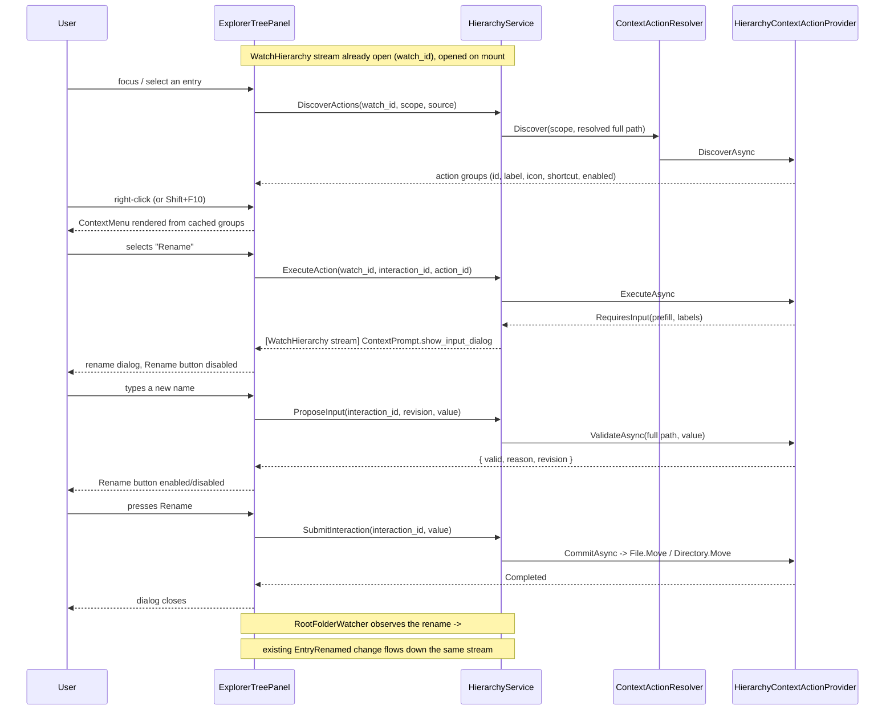

# Design Document

## Overview

This design adds rename and delete to the workspace explorer through a **generic, scope-based context-action mechanism** rather than two hard-wired features. A new `context.proto` defines scope-agnostic messages — discover the actions available for a *source* within a *scope*, execute one, and drive a backend-owned interaction (a dialog) to completion. Those RPCs are added to the **existing `HierarchyService`**, implemented in a separate `partial` file, so they reuse the per-connection stream `WatchHierarchy` already opens when `ExplorerTreePanel` mounts: client→backend messages are unary calls carrying `watch_id`, backend→client prompts ride that already-open stream. Action discovery itself is an **injected component** (`IContextActionProvider`), so this spec contributes exactly one core provider (Rename + Delete for the `hierarchy` scope) and a later diagram-type module can register its own provider — complete with its own keyboard shortcut — without core `Hierarchy` code ever referencing it.

On the client, `ExplorerTreePanel` gains roving-tabindex keyboard navigation with a persistently visible focus indicator, right-click and `Shift+F10` menu triggering via `reusable-context-menu`'s `ContextMenu`, and shortcut matching driven entirely by discovered action data. A new scope-agnostic `ContextPromptHost` renders whichever dialog the backend's current prompt asks for — a validated text-input dialog built on `Dialog` for rename, `ConfirmDialog` for delete — so future actions get their dialogs without new client components.

## Steering Document Alignment

### Technical Standards (tech.md)

* **gRPC is the sole transport**: no new transport, no REST. The context RPCs are unary + the existing server stream, which is what gRPC-Web actually supports from a browser (see Architecture → *Why not a bidirectional stream*).
* **"The backend is the sole owner of reading/writing diagram files; the web client never touches the filesystem directly"**: rename and delete are performed entirely by backend providers; the client never learns an absolute path (see Data Models → `ContextSource`).
* **"File-system access from the backend is scoped to explicitly opened workspace folders"**: every provider resolves its target through `HierarchyModel`'s existing containment-checked resolution — no second filesystem access path (Requirements NFR *Single Responsibility*).
* **"Use the Base36 based ShortId everywhere where an ID or identity is needed"**: entry ids, `watch_id`, and `interaction_id` are all `ShortGuid`, carried as `shared.proto`'s `ShortGuid`.
* **`_Model` subfolder convention** (Backend section): the new context POCOs live in `Context/_Model/`, matching the `Hierarchy\_Model\` folder already declared in `EtAlii.Adp.Backend.csproj`.
* **"All styling... centralized"**: new explorer-focus and rename-dialog styling goes into the existing `index.css` using existing `--color-*` tokens.

### Project Structure (structure.md)

* `context.proto` joins the shared `src/api/` folder alongside `hierarchy.proto`, importing `shared.proto` for `ShortGuid` exactly as its siblings do.
* Scope-agnostic context abstractions live in a new `EtAlii.Adp.Backend/Context/` folder (peer of `Hierarchy/`, `Projects/`), because they are not hierarchy-specific — a future scope (a diagram canvas, a ribbon) uses the same abstractions.
* The one hierarchy-specific provider lives in `Hierarchy/`, depending on `Context/`'s abstractions — never the reverse.
* The new RPC implementations live in `Hierarchy/HierarchyServiceImpl.Context.cs`, a `partial` of the existing `HierarchyServiceImpl`, keeping the existing listing/watching code untouched in its own file.
* **Dependency direction**: `Context/` knows nothing about the hierarchy; `Hierarchy/` knows nothing about any diagram type; a future `EtAlii.Adp.Diagram.<x>` registers an `IContextActionProvider` and core code stays unchanged.

## Code Reuse Analysis

### Existing Components to Leverage

* **`HierarchyService.WatchHierarchy`'s per-connection stream** (`HierarchyServiceImpl.cs`): already opened once per mounted `ExplorerTreePanel`, already keyed by a client-generated `watch_id`, already torn down in a `finally`. This design registers that stream's `ChannelWriter` into a store so unary calls can push prompts back down it — no second stream, no new connection lifecycle.
* **`HierarchyModelStore`'s per-`watch_id` lifecycle pattern** (`HierarchyModelStore.cs`): `IContextInteractionStore` is a direct structural sibling — same `watch_id` key, same create-on-first-use / dispose-on-`Remove` shape, same strict 1:1-per-connection rule.
* **`HierarchyModel`'s containment-checked path resolution**: rename and delete resolve their target through the same model that already enforces `project-root-folder-explorer` Requirement 1.4, rather than re-deriving paths (Requirements NFR *Single Responsibility*).
* **`RootFolderWatcher` + the existing change feed**: neither provider pushes its own "entry renamed"/"entry removed" message. The watcher already observes the filesystem change and emits `EntryRenamed`/`EntryRemoved` through the existing path, satisfying Requirements 5.4 and 9.3 with no new code.
* **`SessionContext` / `IProjectStore`**: the new RPCs authorize exactly as `ListEntries`/`WatchHierarchy` already do, reusing `TryResolveRootPath`.
* **`reusable-context-menu`'s `ContextMenu`** (`shell/ContextMenu.tsx`): rendered as-is. Each provider's contribution maps onto one `ContextMenuGroup`, which is precisely the composability that spec's Requirement 5 was built for — groups concatenated, separators automatic, menu unaware of files or folders.
* **`Dialog` / `ConfirmDialog`** (`components/`): `ConfirmDialog` is used unchanged for delete; the rename dialog is `Dialog` with a text input and a `disabled`-driven confirm button — exactly the "custom dialog whose embedded content enables/disables a footer button via its own callback" pattern `Dialog`'s own doc comment and its `CustomDialogHarness` test already demonstrate.
* **`ContextMenuLevel`'s roving-tabindex approach** (`shell/ContextMenu.tsx`): the explorer tree's keyboard navigation (Requirement 1) follows the same focused-item-`tabIndex=0`/rest-`-1` technique, so the client has one navigation idiom rather than two.

### Integration Points

* **`ExplorerTreePanel.tsx`**: edited in place — gains focus state, key handling, right-click handling, and renders `ContextMenu` + `ContextPromptHost`. Its existing `applyEntries`/`applyHierarchyChange` reducers are untouched.
* **`WatchHierarchy`'s stream message type** widens from `HierarchyChange` to `HierarchyMessage` (see Data Models); `applyHierarchyChange`'s own signature and tests are unaffected.
* **`Program.cs`**: registers `IContextInteractionStore` and the provider set alongside the existing `IHierarchyModelStore` registration.

## Architecture

### Why not a bidirectional stream

The prescribed sequence calls for the backend to push "show the rename dialog" to the client. A literal bidi RPC cannot serve this: the client uses `createGrpcWebTransport` (`auth/AuthContext.tsx`) against `UseGrpcWeb` (`Program.cs`), and gRPC-Web supports only unary and server-streaming — browsers cannot stream a request body, so client-streaming and bidi are unavailable. (`service.proto`'s `AdpService.Connect(stream …) returns (stream …)` is declared but implemented nowhere on either side, so nothing has hit this yet.)

The connection that already exists supplies the missing direction: `WatchHierarchy` is a live, per-connection server stream. Pairing it with unary calls correlated by `watch_id` yields a **logical** bidirectional channel over two physical gRPC-Web calls — the same pairing `ListEntries` + `WatchHierarchy` already use. The backend genuinely initiates prompts; only the client→backend leg is a unary call rather than a stream write.



The **shortcut path** collapses the middle: `ExecuteAction` carries a `ContextShortcut` instead of an `action_id`, and the backend resolves which action that shortcut means for that source and proceeds straight to the prompt — steps 3/4A/4B/4C are skipped. **Delete** follows the identical arc minus `ProposeInput`: `ExecuteAction` → `show_confirm_dialog` prompt → `SubmitInteraction` → recursive delete → existing `EntryRemoved` change.

### Modular Design Principles

* **Single file responsibility**: `HierarchyServiceImpl.Context.cs` (RPC surface only) is separate from `HierarchyServiceImpl.cs` (listing/watching); `ContextActionResolver` (aggregation) is separate from each `IContextActionProvider` (behaviour) and from `ContextInteractionStore` (per-connection state).
* **Scope agnosticism**: nothing in `Context/` mentions files, folders, rename, or delete. Nothing in `ContextMenu`/`ContextPromptHost` does either — both are driven entirely by backend-supplied data.
* **Provider isolation**: adding an action means adding a provider, not editing a switch statement in core code (Requirement 2.6).
* **Testability**: `ContextActionResolver`'s aggregation, `HierarchyContextActionProvider`'s validation rules, and the client's shortcut-matching function are all plain logic, testable without a gRPC server or a browser.

## Components and Interfaces

### `context.proto` (shared contract, `src/api/`)

* **Purpose:** The scope-agnostic wire vocabulary — actions, sources, shortcuts, prompts (Requirement 2.3/2.4).
* **Reuses:** `shared.proto`'s `ShortGuid`, exactly as `hierarchy.proto` does.

### `HierarchyServiceImpl.Context.cs` (backend, `Hierarchy/`, partial)

* **Purpose:** The five new RPCs (Requirements 2, 3.3, 4.1, 5, 9), added to `HierarchyService` per the "part of the hierarchy service, in a different partial" decision.
* **Interfaces:**
  * `DiscoverActions(DiscoverActionsRequest) → DiscoverActionsResponse` — step 3/4A.
  * `ExecuteAction(ExecuteActionRequest) → ExecuteActionResponse` — step 4D, and the shortcut overload via a `oneof trigger { action_id | shortcut }`. Returns an acknowledgement; any dialog arrives as a pushed prompt.
  * `ProposeInput(ProposeInputRequest) → ProposeInputResponse` — step 6a/6b; the verdict is this call's own response (see *Design note*).
  * `SubmitInteraction(SubmitInteractionRequest) → SubmitInteractionResponse` — step 7.
  * `CancelInteraction(CancelInteractionRequest) → CancelInteractionResponse` — dialog dismissed (Requirements 5.5, 9.4).
* **Dependencies:** `IProjectStore` + `SessionContext` (authorization, reusing `TryResolveRootPath`), `IHierarchyModelStore` (entry-id → full path), `IContextActionResolver`, `IContextInteractionStore`.
* **Design note (step 6b):** the validation verdict returns on `ProposeInput`'s **own response** rather than as a pushed prompt. Pushing it would add a second round trip and introduce a stale-verdict race as the user keeps typing; returning it directly cannot race, and the backend remains the sole authority on validity either way. The response still echoes the `revision` it validated so the client can discard an out-of-order reply, and the client debounces keystrokes.
* **Design note (`WatchHierarchy` edit):** the existing method gains two lines — registering its `ChannelWriter` with `IContextInteractionStore` on entry, and `Remove(watchId)` in its existing `finally`. Nothing else in that file changes.

### `IContextActionProvider` / `ContextActionResolver` (backend, `Context/`)

* **Purpose:** The injected discovery/execution component and its aggregator — this spec's extensibility seam (Requirement 2.6).
* **Interfaces:**
  ```csharp
  public interface IContextActionProvider
  {
      ContextScope Scope { get; }
      ValueTask<IReadOnlyList<ContextActionGroup>> DiscoverAsync(ContextTarget target, CancellationToken ct);
      ValueTask<ContextExecutionResult> ExecuteAsync(ContextTarget target, string actionId, CancellationToken ct);
      ValueTask<ContextValidationResult> ValidateAsync(ContextTarget target, string actionId, string value, CancellationToken ct);
      ValueTask<ContextCommitResult> CommitAsync(ContextTarget target, string actionId, string value, CancellationToken ct);
  }
  ```
  `ContextTarget` carries the **resolved absolute path** plus the entry kind — so a provider keys off the full file path exactly as intended, while that path never crosses the wire.
  `ContextActionResolver` fans out to every `IContextActionProvider` whose `Scope` matches and concatenates their groups in registration order; each provider's group becomes one `ContextMenuGroup` client-side.
* **Dependencies:** `IEnumerable<IContextActionProvider>` (DI).
* **Reuses:** N/A — new abstraction; deliberately mirrors `reusable-context-menu`'s group-concatenation model so the two compose without translation.

### `HierarchyContextActionProvider` (backend, `Hierarchy/`)

* **Purpose:** This spec's only provider: Rename (`F2`) and Delete (`Delete`) for `ContextScope.Hierarchy` (Requirement 2.5), and the filesystem work behind both.
* **Behaviour:**
  * `DiscoverAsync` — returns both actions always, each flagged available/unavailable with a reason, never omitted (Requirement 2.5); returns nothing at all if the target no longer exists (Requirement 2.7).
  * `ValidateAsync` (rename) — empty / invalid-character / unchanged / collision checks (Requirements 5.2, 6.1, 6.2), plus containment (6.4). This is the single implementation behind both the live dialog verdict and the pre-commit re-check, so the two cannot drift.
  * `CommitAsync` — rename: `File.Move`/`Directory.Move` (Requirement 7.1's single operation, Performance NFR); delete: `File.Delete` / `Directory.Delete(path, recursive: true)` (Requirement 10.1).
* **Dependencies:** `HierarchyModel` (containment-checked resolution).
* **Reuses:** the existing model's path resolution rather than a parallel one.

### `IContextInteractionStore` / `ContextInteractionStore` (backend, `Context/`)

* **Purpose:** Per-connection prompt delivery and in-flight interaction state.
* **Interfaces:** `Register(ShortGuid watchId, ChannelWriter<HierarchyMessage> writer)`, `Remove(ShortGuid watchId)`, `TryPush(ShortGuid watchId, ContextPrompt prompt)`, `Begin/Get/Complete(ShortGuid interactionId, …)`.
* **Reuses:** `HierarchyModelStore`'s structure and 1:1-per-`watch_id` discipline verbatim.

### `ExplorerTreePanel.tsx` (client, edited in place)

* **Purpose:** Requirements 1, 3, 4 — focus, menu triggering, shortcut matching.
* **Behaviour:**
  * Roving tabindex over the flattened list of currently-rendered nodes; `ArrowUp`/`Down`/`Right`/`Left` per Requirement 1.2–1.4; tree is a single Tab stop (1.5).
  * Discovers an entry's actions when it gains focus and caches them on the node — this cache backs both the menu and shortcut matching, so the client never hard-codes a key→action mapping (Requirement 4.3) and never round-trips on an unrelated keypress.
  * `onContextMenu` focuses the entry and opens `ContextMenu` at the pointer; `Shift+F10`/`ContextMenu` key opens it anchored to the focused row (Requirement 3.1/3.2).
  * A keypress is matched against the focused entry's cached *available* shortcuts; a match calls `ExecuteAction` with the shortcut, and the backend re-decides authoritatively (Requirement 4.1/4.2).
* **Reuses:** `ContextMenu`; its own existing tree state and reducers.

### `ContextPromptHost.tsx` (client, `shell/`, new)

* **Purpose:** Render whichever dialog the current backend prompt asks for — scope-agnostic, so future actions need no new client component.
* **Interfaces:** `{ prompt: ContextPrompt | null; onPropose; onSubmit; onCancel }`.
  * `show_input_dialog` → `Dialog` with a text input; the confirm button's `disabled` is driven by the latest matching-`revision` verdict, starting disabled (Requirement 5.2); a failed submit keeps it open showing the error (Requirement 6.5).
  * `show_confirm_dialog` → `ConfirmDialog` with `confirmColor="danger"`, message supplied by the backend (Requirement 11).
* **Reuses:** `Dialog`, `ConfirmDialog` — no new dialog mechanism (Requirements NFR *Reuse over reinvention*).

## Data Models

### `context.proto` (new)

```protobuf
syntax = "proto3";
package etalii.adp;
import "shared.proto";
option csharp_namespace = "EtAlii.Adp";

enum ContextScope {
  CONTEXT_SCOPE_UNSPECIFIED = 0;
  HIERARCHY = 1;                     // future scopes (canvas, ribbon) extend here
}

// What the action applies to. For HIERARCHY this is an entry id, which the backend
// resolves to an absolute path before handing it to a provider - the client is never
// given, and never supplies, a filesystem path (tech.md: the client never touches the
// filesystem; an absolute path would also leak the user's directory layout).
message ContextSource {
  oneof source { ShortGuid entry_id = 1; }
}

message ContextShortcut {
  string key = 1;                    // DOM KeyboardEvent.key, e.g. "F2", "Delete"
  bool ctrl = 2; bool shift = 3; bool alt = 4; bool meta = 5;
}

message ContextAction {
  string id = 1;
  string label = 2;
  string icon = 3;                   // @mdi/font class, e.g. "mdi-pencil-outline"
  ContextShortcut shortcut = 4;      // unset when the action has none
  bool available = 5;                // false -> rendered disabled, shortcut inert
  string unavailable_reason = 6;     // surfaced as the disabled item's tooltip
  repeated ContextActionGroup items = 7; // non-empty -> a submenu instead of an action
}

message ContextActionGroup { repeated ContextAction actions = 1; }

message InputDialogPrompt {
  string title = 1; string icon = 2; string field_label = 3;
  string initial_value = 4; string confirm_label = 5;
}
message ConfirmDialogPrompt {
  string title = 1; string icon = 2; string message = 3;
  string confirm_label = 4; bool danger = 5;
}

message ContextPrompt {
  ShortGuid interaction_id = 1;
  oneof prompt {
    InputDialogPrompt input_dialog = 2;
    ConfirmDialogPrompt confirm_dialog = 3;
    ContextInteractionClosed closed = 4;  // backend-initiated dismissal
  }
}
message ContextInteractionClosed { string message = 1; }
```

### `hierarchy.proto` (extended)

```protobuf
import "context.proto";

// The stream now carries both hierarchy deltas and backend-initiated prompts.
// HierarchyChange itself is unchanged - only wrapped.
message HierarchyMessage {
  oneof message {
    HierarchyChange change = 1;
    ContextPrompt prompt = 2;
  }
}

message DiscoverActionsRequest {
  ShortGuid project_id = 1; ShortGuid watch_id = 2;
  ContextScope scope = 3; ContextSource source = 4;
}
message DiscoverActionsResponse { repeated ContextActionGroup groups = 1; }

message ExecuteActionRequest {
  ShortGuid project_id = 1; ShortGuid watch_id = 2;
  ContextScope scope = 3; ContextSource source = 4;
  ShortGuid interaction_id = 5;                  // client-generated
  oneof trigger { string action_id = 6; ContextShortcut shortcut = 7; }
}
message ExecuteActionResponse { bool accepted = 1; string error = 2; }

message ProposeInputRequest {
  ShortGuid interaction_id = 1; uint32 revision = 2; string value = 3;
}
message ProposeInputResponse {
  uint32 revision = 1;                           // echoed; client discards stale replies
  bool valid = 2; string reason = 3;
}

message SubmitInteractionRequest { ShortGuid interaction_id = 1; string value = 2; }
message SubmitInteractionResponse { bool completed = 1; string error = 2; }

message CancelInteractionRequest { ShortGuid interaction_id = 1; }
message CancelInteractionResponse {}

service HierarchyService {
  rpc ListEntries(ListEntriesRequest) returns (ListEntriesResponse);
  rpc WatchHierarchy(WatchHierarchyRequest) returns (stream HierarchyMessage); // widened
  rpc DiscoverActions(DiscoverActionsRequest) returns (DiscoverActionsResponse);
  rpc ExecuteAction(ExecuteActionRequest) returns (ExecuteActionResponse);
  rpc ProposeInput(ProposeInputRequest) returns (ProposeInputResponse);
  rpc SubmitInteraction(SubmitInteractionRequest) returns (SubmitInteractionResponse);
  rpc CancelInteraction(CancelInteractionRequest) returns (CancelInteractionResponse);
}
```

### Backend POCOs (`Context/_Model/`, per tech.md's `_Model` convention)

```
ContextTarget:      Scope, ResolvedFullPath, IsFolder, EntryId
ContextActionDefinition: Id, Label, Icon, Shortcut?, Available, UnavailableReason, Children
ContextInteraction: Id, WatchId, Scope, Target, ActionId, ProviderRef, LastRevision
ContextValidationResult / ContextCommitResult / ContextExecutionResult
```

## Error Handling

### Error Scenarios

1. **Entry deleted between listing and right-click (Requirement 2.7)** — `DiscoverActions` returns no groups; `ContextMenu`'s own empty-groups guard renders nothing (its Reliability NFR), so no empty shell appears.
2. **Invalid / colliding / unchanged name (Requirements 5.2, 6.1, 6.2)** — `ProposeInput` returns `valid=false` with a reason; the Rename button stays disabled and the reason is shown. The same `ValidateAsync` runs again inside `SubmitInteraction`, so a client that skipped validation still cannot bypass it.
3. **Rename fails at the filesystem level (Requirement 6.5)** — `SubmitInteraction` returns `completed=false` with the message; the dialog stays open with the user's input intact.
4. **Delete fails, or a recursive delete partially fails (Requirements 9.5, 10.2)** — the error is surfaced verbatim rather than reported as success; whatever *was* deleted arrives as ordinary `EntryRemoved` changes from the watcher, so the tree ends up reflecting real on-disk state either way.
5. **Interaction id unknown or already completed** — the unary call returns an error rather than throwing; a duplicate `SubmitInteraction` (double-click, retry) is idempotent because the interaction is removed from the store on completion.
6. **The entry vanishes while its dialog is open** — the backend pushes `ContextPrompt.closed` down the stream and the host closes the dialog with an explanation, rather than letting the user submit against a missing target.
7. **`WatchHierarchy` stream drops mid-interaction** — `Remove(watchId)` discards that connection's prompt writer and in-flight interactions in the existing `finally`; the client's reconnect starts clean, since no interaction state is meant to outlive its connection.
8. **Authorization / containment (Security NFR)** — every new RPC runs `TryResolveRootPath` first and resolves the source only through that connection's own `HierarchyModel`, so an id from another project or connection resolves to nothing rather than leaking its existence.

## Testing Strategy

### Unit Testing

* `ContextActionResolver`: only matching-scope providers are consulted; groups concatenate in registration order; an empty provider set yields no groups.
* `HierarchyContextActionProvider`: Rename/Delete both always reported with correct `available` + reason; `F2`/`Delete` shortcuts attached; validation rejects empty, invalid-character, unchanged, and colliding names, and accepts a valid change; containment rejects a `..`/symlink escape; commit renames a populated folder without touching its contents (Requirement 7.1).
* `ContextInteractionStore`: per-`watch_id` isolation, `TryPush` reaching only the owning connection, completion removing the interaction (idempotent submit).
* Client: the shortcut-matching function (key + modifiers vs. an action list, ignoring unavailable actions); the tree's flatten-and-move-focus helper against a synthetic expanded/collapsed tree; `ContextPromptHost`'s enable/disable logic including discarding a stale `revision`.

### Integration Testing

* Full rename arc against a real temp folder and in-process host: `DiscoverActions` → `ExecuteAction` → prompt observed on the *same* connection's `WatchHierarchy` stream → `ProposeInput` (invalid then valid) → `SubmitInteraction` → file renamed on disk and an `EntryRenamed` change delivered on that stream.
* Full delete arc, including a populated folder deleted recursively and the resulting `EntryRemoved` change.
* **Isolation:** two connections (two `watch_id`s) to the same project — a prompt raised by one is never observed on the other's stream, matching the guarantee `project-root-folder-explorer`'s own integration tests already establish for hierarchy changes.
* Shortcut overload: `ExecuteAction` carrying `F2` with no prior `DiscoverActions` call produces the same prompt as the action-id path.
* Authorization: a `DiscoverActions`/`ExecuteAction` for another user's project is rejected.

### End-to-End Testing

* Manual F5 pass: open a project, `Tab` into the tree, navigate with arrows and confirm the focused row is always visibly indicated; `F2` renames (button disabled until the name is non-empty, valid, and changed); `Delete` confirms then deletes; right-click and `Shift+F10` both show the same menu; a folder rename keeps its expanded children; a folder delete removes the subtree; renaming to an existing name is refused with a visible reason. Light and dark mode.

## Deviations from the prescribed sequence

Three points where this design differs from the sequence as stated, each deliberate:

1. **Not a literal bidi stream** — impossible over gRPC-Web from a browser. The backend still initiates prompts; it does so over the already-open `WatchHierarchy` stream, with unary calls carrying the client→backend leg (see *Why not a bidirectional stream*).
2. **Step 6b's verdict returns on `ProposeInput`'s own response**, not as a pushed prompt — avoids a second round trip and a stale-verdict race while keeping the backend the sole authority on validity.
3. **`source` is an entry id, not a full file path** — the backend resolves it to the absolute path and hands *that* to providers, so provider logic keys off the full path exactly as intended. Sending paths to the browser would contradict tech.md's "the client never touches the filesystem directly", leak the user's directory layout, and mean accepting client-supplied paths as input.

Additionally, **Requirements 8.1, 8.2, 10.3 and 10.4 (open editor tabs and unsaved changes) cannot be implemented yet** — no editor-tab or document-buffer concept exists (`DiagramPanel` is still a placeholder). The design leaves the seam: the confirm prompt's `message` is backend-composed, so the unsaved-changes warning becomes a provider concern once an open-document registry exists, with no contract change. These acceptance criteria should be tracked as deferred rather than marked done by this spec's tasks.
