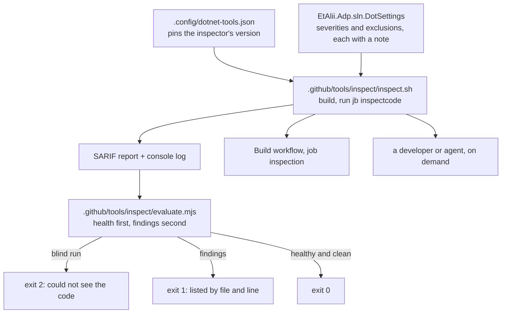

# Design Document

## Overview

The work has two halves that must not be confused. **The instrument** is small and is built first: one committed command that runs JetBrains' inspection, proves the run could see the code, and exits non-zero on any finding. **The cleanup** is large and is done against that instrument: 89 warnings and 799 suggestions, taken one inspection at a time, in an order that puts what cannot change behaviour before what can.

The instrument comes first because every later claim - *this inspection is now at zero*, *this pull request added nothing* - is only as good as the run that produced it, and this tool has already reported a clean result from a blind run in this repository once.

**Nothing is switched off by this design.** Requirement 3 allows an inspection to be switched off where it does not fit; this design names no inspection that qualifies. Each proposal to switch one off is the user's decision and reaches them as a selection, per CLAUDE.md's *Asking the user something*.

## Steering Document Alignment

### Technical Standards (tech.md)

- **JetBrains Rider warnings.** This design is the cleanup that section names. Its three permitted outcomes for a finding - correct the code, mark an implicit use, change the rule with a note - are the only three used below.
- **Never nest a type; one entity per file; `_Model` for data.** A Rider suggestion that points the other way loses. None of the 52 inspections in the inventory asks for a nested type, but `ConvertToPrimaryConstructor` and `MemberCanBePrivate.Global` both rewrite declarations, and neither may move one.
- **Decision log entry 10** found zero orphaned types by a name-based scan and warns against a cleanup that needs deletions to feel complete. The `Unused*.Global` findings below are that warning's subject: the default for a non-private type or member reported unused is *prove it*, not *delete it*.
- **Serilog's `_logger` field** and the two naming rules downgraded for it stay as they are. The five `InconsistentNaming` findings are read against `src/.editorconfig` before anything is renamed.

### Project Structure (structure.md)

- Tooling that serves the repository rather than the product lives under `.github/tools/`, beside `gate/` and `developer-session-guard/`. The instrument goes in `.github/tools/inspect/`.
- No project is added to the solution. The instrument's own tests join `EtAlii.Adp.Backend.Tests/Integration Tests/`, where `GateScript.Tests.cs` already runs the gate script's self-test, so they run inside the existing backend gate.

## Code Reuse Analysis

### Existing Components to Leverage

- **`JetBrains.Annotations`**: already versioned in `src/Directory.Packages.props` (2026.2.0) and used once, as `[UsedImplicitly]` in `Program.cs`. It is the mechanism Requirement 1.3 asks for: an attribute at the member that the inspection honours. Its attributes are conditional and leave no trace in the compiled assemblies.
- **`src/Directory.Build.props`**: the one place a reference reaches every project. It already carries `Nerdbank.GitVersioning` that way.
- **`src/backend/EtAlii.Adp.sln.DotSettings`**: the solution-wide settings file, today holding two dictionary words. **Measured, not assumed: it binds for the `.slnx` solution although its name says `.sln`.** A control run on 2026-10-07 added one severity entry there (`MergeIntoPattern`, do not show) and one file mask, and the report lost exactly those findings and no others: 892 results became 756, the 132 `MergeIntoPattern` and the 4 XML errors gone, all 89 warnings and the other 667 suggestions unchanged. The entries were then removed.**
- **The 34 per-project `.DotSettings` files**: hold namespace-folder exemptions. They are not used for inspection severities, so that every severity decision is in one file.
- **The `- Reason:` convention**: 16 of the 65 existing in-place suppressions already read `// ReSharper disable once <Inspection> - Reason: <why>`. Requirement 3.3 adopts that exact shape.
- **`GateScript.Tests.cs`**: the pattern for running a tool's self-test from xUnit.
- **`.github/workflows/build.yml`**: the `gates` job's setup steps are repeated by the new job; its convention of one named step per check, judged by exit code, is kept.

### Integration Points

- **Build workflow**: one new job, `inspection`, beside `gates`.
- **processes.md, CLAUDE.md, `docs/guards.md`**: each describes `jb inspectcode` as a tool that is installed by hand and is not a gate. All three are brought in line in the last pull request.
- **`docs/creating-a-diagram-module.md` and tech.md's *Declaring a diagram definition***: the stub shape gains one attribute, so both are updated in the pull request that changes it.

## Architecture



### The instrument

**The inspector's version is pinned in the repository.** A local tool manifest, `.config/dotnet-tools.json`, names `jetbrains.resharper.globaltools` at the version measured with, 2026.2.2. `dotnet tool restore` installs it and `dotnet jb inspectcode` runs it, the same on a developer's machine and on the runner. This ends an ambiguity processes.md already records: the tool was installed globally on one machine and described as not installed in the repository, and both were true.

**`inspect.sh` runs it one way.** It resolves the SDK version from `src/global.json` and the toolset path from `dotnet --list-sdks`, builds the solution unless told the build is current, and calls `jb inspectcode` on `src/backend/EtAlii.Adp.slnx` with `--no-build`, `--dotnetcoresdk`, `--toolset-path` and `--severity=SUGGESTION`. It keeps the console log beside the report. It takes one option, `--report`, described under *Order of delivery*.

**`evaluate.mjs` judges the run, health before findings.** Node is used because it is already required by two of the four gates on every machine and on the runner; Python is not. It is a separate file so it can be tested in milliseconds against small recorded reports, without a four-minute inspection. In order:

1. **The report exists and parses as SARIF**, whatever its extension. A missing or empty report is exit 2.
2. **No C# compiler error and no unresolved symbol** is among the results. Any is exit 2: the run was blind (Requirement 4.2).
3. **The run inspected at least as many `.cs` files as the solution tracks.** The inspected count comes from the tool's own console log; the floor comes from `git ls-files` over `src/`, less the `.cs` files under `Fixtures/` folders that are test data and belong to no project. Fewer is exit 2 (Requirement 4.3). At the measured commit the figures were 1978 inspected against 1873 tracked.
4. **Any result at Error, Warning or Suggestion severity** is printed as `path:line  Inspection  message`, grouped by inspection with a count, and is exit 1 (Requirement 4.4).
5. Otherwise exit 0 (Requirement 4.5).

Exit 2 and exit 1 are different on purpose. *Could not see* and *saw a finding* call for different actions, and a single red would teach readers to treat a broken instrument as a dirty tree.

### The one exclusion

`Fixtures/cpm/Broken.csproj` is excluded by a file-mask entry in `EtAlii.Adp.sln.DotSettings`, with a note naming `EtAlii.Adp.Diagram.DotNetDependencyGraph.Tests` as the test it serves (Requirement 3.4). The same control run showed the mask working: the four errors disappeared and nothing else did. The mask is the file's full name, not `*.csproj` and not the `Fixtures` folder: the eleven `.cs` files under `Fixtures/` folders and every real project file stay inspected.

### How each kind of finding is corrected

The inventory's 52 inspections fall into five kinds. The kind decides the treatment and the pull request.

**Kind A - restatements that cannot change behaviour (about 280 findings).** `MergeIntoPattern`, `ArrangeObjectCreationWhenTypeEvident`, `RedundantExplicitParamsArrayCreation`, `RedundantVerbatimStringPrefix`, `ConvertClosureToMethodGroup`, `UseIndexFromEndExpression`, `AppendToCollectionExpression`, `BadControlBracesIndent`, `SimplifyLinqExpressionUseAll`, `UseCollectionCountProperty`, `ArrangeVarKeywordsInDeconstructingDeclaration`, `UseUtf8StringLiteral`, `UseWithExpressionToCopyRecord`, `ConvertToPrimaryConstructor`, `ReplaceWithPrimaryConstructorParameter` and the single-digit remainder of the same nature. Each is corrected as Rider's own quick-fix would correct it. One commit per inspection, so a reviewer reads one transformation at a time and a bad one is reverted alone.

Two of these need care and are named so nobody treats them as mechanical. A primary constructor's parameter is a mutable capture, not a `readonly` field: where the constructor being converted assigned a `readonly` field that is read more than once, the field is kept and initialised from the parameter. And `ConvertClosureToMethodGroup` can change which overload binds; the compiler and the tests are the check.

**Kind B - narrowing (about 250 findings).** `MemberCanBePrivate.Global`, `MemberCanBeProtected.Global`, `AutoPropertyCanBeMadeGetOnly.*`, `PropertyCanBeMadeInitOnly.*`, `ClassNeverInstantiated.*`, `VirtualMemberNeverOverridden.Global`. The compiler checks every use it can see. What it cannot see is the question for each: a member bound by a serializer, a property set by configuration binding, a class constructed by the dependency-injection container or by reflection. A member in one of those positions is not narrowed; it is marked as Kind D marks it. `ClassNeverInstantiated` on a class the container constructs is the expected case, not the exception.

**Kind C - written and never read (about 100 findings, 69 of them warnings).** `NotAccessedPositionalProperty.Global`, `UnusedAutoPropertyAccessor.Global`, `CollectionNeverQueried.Local`, `CollectionNeverUpdated.Local`, `NotAccessedVariable`, `RedundantAssignment`, `UnusedVariable`, `UnusedMethodReturnValue.Global`, `OutParameterValueIsAlwaysDiscarded.Global`. 39 of the warnings are in `EtAlii.Adp.Specification.Fbl`, on records that model a file format.

Each finding gets one of three answers, asked in this order:

1. **Is it read by something that is not C# code in this solution** - a serializer writing it out, a protobuf or JSON mapping, a record compared whole by value in production code? Then it is alive and is marked `[UsedImplicitly]`, with the reader named in a comment on the same line.
2. **Is it populated by a parser or reader from a document, and read by nothing, tests included?** Then it is a parsed field nobody has ever checked. **The correction is a test assertion that reads it**, in the parser's existing test. That clears the finding by making the statement false rather than by annotating it, and it closes a real gap: a field the parser could be filling wrongly today with nothing to notice. If writing that assertion shows no fixture contains the construct, the field has no evidence it works; it and its parsing are removed, under constitution principle V (a construct is justified by a current need).
3. **Otherwise it is dead** and is removed, with whatever only existed to feed it.

**Kind D - reported unused, and reachable only by name or reflection (about 190 findings).** `UnusedType.Global`, `UnusedMember.Global`, `UnusedMemberInSuper.Global`, `UnusedParameter.Global`, `UnusedMember.Local`.

*The 96 findings in 48 `Diagram.cs` files are one decision* (Requirement 2.5). `DiagramDefinitionDiscovery` finds a static class named `Diagram` with a `Definitions` property by scanning assemblies, so no C# code names either. The class is marked `[UsedImplicitly(ImplicitUseTargetFlags.WithMembers)]`. `JetBrains.Annotations` is referenced once, in `src/Directory.Build.props` with `PrivateAssets="all"`, so a module needs nothing in its own project file (the non-functional requirement on package references). The attribute goes on all 66 `Diagram.cs` files and on the two `Editor.cs` files that are discovered the same way, not only the 48 that report today: an implemented module's class is named by its own registration and reports nothing, but the shape a tool engineer copies must be one shape. tech.md's *Declaring a diagram definition* and `docs/creating-a-diagram-module.md` gain the attribute in the same pull request.

*The remaining ones are decided singly*, by the method decision log entry 10 recorded: search the solution for the name as a string as well as a symbol, covering reflection, `nameof`, registration by convention, the `.proto` files and the client. Found: mark `[UsedImplicitly]` and name the user. A public member of a type that is deliberately the module-facing surface, with no caller yet: mark `[PublicAPI]` only where a document already names that surface as an API; otherwise it is unused. Not found: remove.

**Kind E - possible defects (11 warnings).** These are investigated, not restated, and each lands with its own evidence.

- *`InconsistentlySynchronizedField` in `DiagramDocumentReloadBridge` (3).* The class takes `_watcherLock` in three places and reads the same field outside it in three others. The task establishes which reads can race a write. If one can, it is fixed and a test is written that fails before the fix (Requirement 1.5); CLAUDE.md's rule that such a test must be seen to fail applies, and a concurrency test that passes against the defect is deleted rather than kept. If none can, the reason is stated at the field and the reads are suppressed with it.
- *`PossibleLossOfFraction` in `SkosLayout` and its test (2).* One existing suppression elsewhere reads `- Reason: On purpose`, so intended integer division has precedent here. The task decides from what the layout draws: whether a half-unit offset matters is visible on the canvas. Intended: suppressed with the reason. Not intended: fixed, with a test that fails first (Requirement 1.6).
- *`NullCoalescingConditionIsAlwaysNotNullAccordingToAPIContract` (6), in three modules' writers and property handlers.* Either the annotation is right and the `??` is dead code that is removed, or a null does arrive there at run time and the annotation is the defect. Nine existing suppressions of this inspection say this codebase has met the second case before. Each of the six is traced to where its value comes from before either is chosen.

### Existing suppressions

41 files already carry 65 `// ReSharper disable` comments; 49 of them give no reason. Requirement 3.3 is about suppressions in general, so each gains its `- Reason:` in the Kind A pull request, or is removed if the inspection no longer fires without it.

### Order of delivery

Six pull requests, each one kind of change (Requirement 6.1), each with the four gates at zero on its branch (Requirement 6.4).

| # | Contents | Can change behaviour |
|---|---|---|
| 1 | The instrument: tool manifest, `inspect.sh`, `evaluate.mjs` and its tests, the `Broken.csproj` exclusion, the `inspection` job in **report mode**, and the inventory measured again (Requirement 6.3) | No |
| 2 | Kind A, and reasons on existing suppressions | No |
| 3 | The `Diagram.cs` decision: the reference in `Directory.Build.props`, the attribute, the two documents | No |
| 4 | Kind B and the rest of Kind D: narrowing, marking and removal | Yes |
| 5 | Kind C and Kind E: the unread data, and the possible defects | Yes |
| 6 | The check enforced: `--report` dropped from the job; processes.md, CLAUDE.md and `docs/guards.md` aligned; the closing record | No |

**Report mode is what makes pull request 1 safe to merge and pull request 6 safe to trust.** With `--report`, the script still fails on a blind run but exits zero on findings, printing their counts per inspection. So from the first pull request the runner executes the inspection on every change, which answers a question this design cannot answer from a Windows measurement: **whether the Linux runner reports the same findings.** Requirement 5.2 forbids enforcing before the tree is clean; report mode is how the job exists before then without being a red that everyone learns to ignore. It is not `continue-on-error`: a job that is allowed to fail is a job nobody reads.

Pull requests 2 to 5 each state, in their description, the count per inspection before and after from the script's own output, and for 4 and 5 the list Requirement 6.2 asks for: what was removed or narrowed, and what showed each was unused.

### The enforced check

The `inspection` job runs on pull requests into `develop` and on pushes to it, on `ubuntu-latest`, with the `gates` job's checkout, .NET, Node and NuGet-cache steps, then `dotnet tool restore` and `inspect.sh`. It is a job of its own and not a fifth step in `gates`, so that a red run names which of the two failed and the four gates stay four (Requirement 5.3). `release` keeps `needs: gates` alone: a finding cannot reach `develop` except through a pull request the job has already judged, and making a release wait on a second inspection of the same commit buys nothing.

It is not added to the local gates. A developer or agent runs `inspect.sh` on demand, before opening a pull request that touched C#, and the runner is what refuses.

## Components and Interfaces

### `.config/dotnet-tools.json`
- **Purpose:** Pins the inspector's version for every machine.
- **Interfaces:** `dotnet tool restore`.
- **Dependencies:** The .NET SDK `src/global.json` names.

### `.github/tools/inspect/inspect.sh`
- **Purpose:** The one way to run the inspection (Requirement 4.1).
- **Interfaces:** `inspect.sh [--report] [--no-build]`. Exit 0 clean, 1 findings, 2 blind. With `--report`: 0 or 2 only.
- **Dependencies:** `dotnet`, `node`, `git`.
- **Reuses:** The LF rule `.gitattributes` already has for `.sh`.

### `.github/tools/inspect/evaluate.mjs`
- **Purpose:** Judges a report and a console log; contains every rule about health and findings.
- **Interfaces:** `node evaluate.mjs <report> <log> <tracked-count> [--report]`.
- **Dependencies:** Node's standard library only.

### `.github/tools/inspect/fixtures/` and `InspectScript.Tests.cs`
- **Purpose:** Small recorded reports, one per outcome, and the xUnit facts that run the evaluator on each.
- **Reuses:** The shape of `GateScript.Tests.cs`.

### `EtAlii.Adp.sln.DotSettings`
- **Purpose:** Every exclusion and every severity decision, each with a note.
- **Interfaces:** Read by Rider and by `jb inspectcode`.

## Data Models

### The evaluator's verdict

```
Verdict
- health: seen | blind
- blindReason: missing report | unparseable | compiler errors (n) | inspected (n) below tracked (m)
- findings: list of { path, line, inspection, severity, message }
- exitCode: 0 | 1 | 2
```

### A switched-off inspection, as recorded in the closing record (Requirement 3.5)

```
- inspection: its ReSharper id
- change: the severity it had and the one it was given
- where: the file and key
- reason: the sentence in the note
- ruled: the date of the user's answer
```

## Error Handling

### Error Scenarios

1. **The inspection runs before the build is current, and cannot resolve symbols.**
   - **Handling:** The evaluator finds compiler errors among the results and exits 2, naming the count.
   - **User Impact:** The reader is told to build, not that the tree is clean or dirty.

2. **The toolset is not found and the tool inspects nothing.**
   - **Handling:** The inspected-file count is below the tracked count; exit 2.
   - **User Impact:** A message naming both numbers. This is the case that exited 0 with an empty report before.

3. **The Linux runner reports findings Windows does not, or the reverse.**
   - **Handling:** Visible in report mode from pull request 1. A difference is resolved before pull request 6: by correcting the finding if it is real on either platform, or by a noted severity change if it is an artefact of one.
   - **User Impact:** None until resolved; the job is not enforcing yet.

4. **A finding arrives on `develop` between two cleanup pull requests,** because other work merged while the job only reports.
   - **Handling:** Each cleanup pull request states counts from its own run, so a new finding shows as a count that rose. It is corrected in the pull request that notices it.
   - **User Impact:** None.

5. **A correction of Kind B or D breaks something only reachable by reflection.**
   - **Handling:** The four gates on the branch are the net; a break they miss is a bug found during implementation and leaves a guard behind, per CLAUDE.md.
   - **User Impact:** A pull request that does not open until it is green.

6. **A JetBrains release changes what is reported.**
   - **Handling:** The version is pinned. Raising it is its own pull request, whose inspection job shows what the new version adds.
   - **User Impact:** No pull request turns red because a tool updated itself.

## Testing Strategy

### Unit Testing

- **The evaluator against recorded reports**, one fixture per outcome: healthy and clean (0); healthy with one warning (1); healthy with one suggestion (1); compiler errors among the results (2); a valid report from a run that inspected nothing (2); a missing report (2); and the same finding fixture under `--report` (0). Each fixture is cut down from a real report of this repository, so the SARIF shape is the tool's and not an invention.
- **Each of those facts is seen to fail first**, against an evaluator with the rule it tests removed.

### Integration Testing

- **The planted control, once, recorded in the implementation log** (Requirement 4.6): plant one warning and one suggestion in a real file, run `inspect.sh`, see exit 1 naming both; remove them, see exit 0. This is the only test that proves the whole chain, and it is run by hand at pull request 1 and again at pull request 6 because it costs two full inspections.
- **The setting control**: a severity entry added to `EtAlii.Adp.sln.DotSettings` removes exactly that inspection's findings and nothing else. Already run once for this design; see *Code Reuse Analysis*.
- **The four gates** after every correction that narrows or removes (Requirement 2.4).

### End-to-End Testing

- **In Rider.** After pull request 5, the solution is opened with the committed settings and solution-wide analysis on, and the *Problems* list for C# is read. The requirements' usability criterion is a statement about that list, and `jb inspectcode` agreeing with it is what this design assumes rather than proves; this is the one place it is checked by eye. A difference is a finding about settings held outside the repository.
- **On the runner.** Pull request 6 is accompanied by a throwaway pull request that plants one suggestion, to see the enforced job fail on GitHub and name the line. It is closed unmerged.
