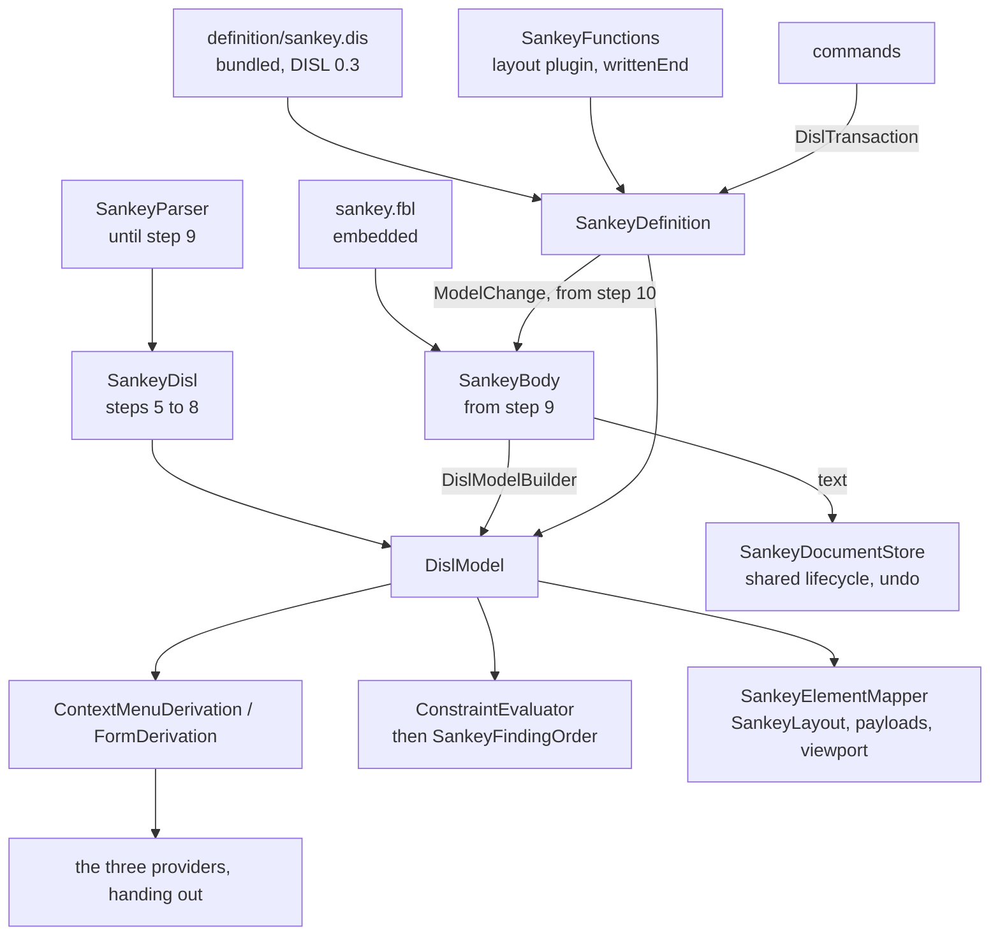

# Design Document

## Overview

The Sankey diagram is converted in **eleven steps, each one pull request, each held to one frozen transcript**. The transcript is generated from today's hand-written code first (step 1). Every later step replaces one hand-written part by its derived or bound equivalent and must reproduce the transcript byte for byte, except where the requirements name a change: the hunks of an edit (Q1), a body that is not YAML becoming read-only (Q3), and the four damaged shapes of finding B16.

**The work falls in two halves, and only the first can be built now.** Steps 1 to 7 put the oracle in place, bundle the definition, and derive the toolbox, the menus, the rows and the findings from it, with the body still read by `SankeyParser` and written by `SankeyWriter`. That is the state the timeline is in today. Steps 8 to 10 read and write the body through the binding, and they wait on a change of FBL in etalii-adp/etalii.adp (Q6, default: report the gap and wait). The section *What waits, and on what* says exactly which criteria that leaves open.

The module ends in the shape the hype cycle graph has, with three classes carrying the conversion:

- `SankeyDefinition`: the bundled DISL definition loaded once, and what the providers derive from it, mapped to today's wire ids by its `x-sankey` block.
- `SankeyBody`: one `.skv` body opened through the module's FBL binding, giving the binding's reading, the DISL model built from it, and `Change(ModelChange)`. It arrives at step 9.
- `SankeyFunctions`: the host's implementations of the definition's plugin functions, over the layout the module keeps.

Everything else is deleted, moved to the test project as the oracle, or kept as host code with its reason (the table under *What remains*). **Two small amendments to the approved requirements are proposed**, in *Amendment proposed* below. Neither changes behaviour.

## Steering Document Alignment

### Technical Standards (tech.md)

- *Specifying a diagram type*: the definition lives in etalii-adp/etalii.adp and is bundled by `bundle-disl.sh`, never edited here. The binding is the module's own file, as the hype cycle's is, and the definition names it by URL.
- Splices, never reserialization: today's rule for the writer becomes FBL's rule, which is stricter (a value's span, not a line).
- The four gates, the transcript and "a test seen to fail first" are the checks of every step.

### Project Structure (structure.md)

- A diagram type adds declarations and no core code. What the libraries lack is added to `EtAlii.Adp.Specification.Cel`, `.Disl`, `.Fbl` and the client's notation compiler for every tool (*Library work*), named for what it does.
- The module gains `definition/` (bundled) and one embedded `sankey.fbl`; the test project gains `Parity/`.

## Code Reuse Analysis

### Existing Components to Leverage

Each was opened and its members checked against the use named here.

- **`BundledDefinition.Load(assembly, name, DislPluginFunctions)`, `WireIdMap.Of(specification, "x-sankey")`, `ToolboxDerivation.Derive`, `ContextMenuDerivation.Derive` with `DislMenuTarget.Element`, `.Canvas` and `.Connection`, `FormDerivation.Derive`, `ConstraintEvaluator.Evaluate` with `DislConstraintOptions(Env, ReaderFindings, WrittenId)`, `OperationInterpreter`, `DislWrite.ToFbl`** (`EtAlii.Adp.Specification.Disl`): used as `GhgDefinition.cs` and `TimelineDefinition.cs` use them.
- **`DislPluginFunctions.Add(name, implementation)`**: an implementation receives the call's arguments as CEL values, an element as the model's `DislElement`. `DislElement.Diagram` is public, so a function finds the layout of the diagram its argument belongs to. `TimelineTimes.Plugins()` is the model, its `writtenEnd` included.
- **`DislModelBuilder`**: derived ids exist (`DerivedIds`, strategy `derived` with an `expression`, evaluated in the identity context). `uuid-v4` with `base36` exists in `IIdSource.cs`.
- **`DislReaderFinding.Unreadable(message, line)` and `.NotParsed`**: how a module reader's sentence reaches `ConstraintEvaluator` under `std.unreadableEntry` and `std.unparseable`, whose `code`, `severity` and `message` the definition's `constraints.builtIn` sets. `GhgParser.ReaderFindings` is the model.
- **`OpenBody` (`Open`, `Fork`, `Plan`, `Change`, `Apply`, `IsReadOnly`), `FblDocumentLoader.Load`, `ModelChange.Add` with `Index`, `.Move`, `.Set`, `.Remove`** (`EtAlii.Adp.Specification.Fbl`): used as `GhgBody.cs` uses them, with its cache of recent bodies and its batch. `Add` with an `Index` and `Move` are what a drop above a node, a move in a column and Arrange need (Requirement 5.4, 5.5).
- **`YamlFamily`'s handling of an empty flow sequence**: present, as finding B13 measured.
- **The timeline's `TimelineDisl.cs`**: a DISL model built from the module's own parser. `SankeyDisl` is that class for steps 5 to 8.
- **The timeline's and the hype cycle's `Parity/` folders** (`TimelineTranscript.cs`, `TranscriptText.cs`, `HandWrittenGhg.cs`, the `GhgDerived*.Tests.cs` files): copied in shape.
- **`RestoreDocumentCommand`**: undo stays the host's, restoring text.
- **`parseDisl`, `compileNotation`, `NotationBindings`** (client): `customRoutes` (a bezier's exact reach), `action` (a second key for one action), anchors of mode `sides` narrowed to left and right, and `connectOnRightDrag` exist and are used.

### Integration Points

- **etalii-adp/etalii.adp**: `definitions/diagrams/sankey.dis` and `.md` are rewritten there (step 3) through that repository's own pull request and checks. Step 4 cannot bundle before it is merged. The module's binding is offered there as `specifications/fbl/sankey.fbl` with a round-trip fixture once step 9 has landed, because until then the binding is not the one the tool runs.
- **The language changes for gaps 1 and 2** are etalii.adp's own specification. Gap 1 is also the first gap of `timeline-disl-fbl`. It is shared and must be delivered once: the requirements name no tool that delivers it first, so whichever of the two specifications reaches its reading step first vendors the conformance fixture and adds the construct to the library, and the other uses it.
- **`EtAlii.Adp.Specification.Fbl.Tests`**: `ModuleCrossCheck.Tests` gains the `.skv` pairs and `RealFiles/divergences.json` its entries (step 2).

## Architecture

### The steps

| Step | What changes | Held by | Depends on |
| --- | --- | --- | --- |
| 1 | The transcript, its generator, one fixture per *read* finding (Requirement 1.2), and the test that today's code reproduces it, seen to fail against a changed sentence. No product code changes. | 1.1 to 1.4, 10.4 | Nothing |
| 2 | `sankey.fbl` as drafted, embedded and read by nothing but tests. `ModuleCrossCheck.Tests` reads every `.skv` under `src/` through it. The four unsettled points of the appendix are closed by fixtures that plan edits through `OpenBody`. | 1.5, 4.1 (the file) | Step 1 |
| 3 | In etalii.adp: the definition at DISL 0.3 with `x-sankey`, `typeMap` and `persistence.format: "fbl"`; the companion rewritten. | 2.1 to 2.3, 10.1 | A pull request in etalii.adp |
| 4 | Library work L1 to L6. The definition bundled, embedded and loaded with no error; `BundledDefinition.Tests`. Nothing derives from it yet. | 2.4, 2.5, 9.1, 9.2, 9.4 | Step 3 merged |
| 5 | Toolbox, menus and rows derived over `SankeyDisl`, a model built from `SankeyParser`. The providers hand out. Their logic moves to `Parity/HandWrittenSankey.cs`. | 3.1, 3.2, 3.6, 3.7 | Step 4 |
| 6 | Findings derived by `ConstraintEvaluator` over the same model; `SankeyFindingOrder`; `SankeyValidator` becomes a call. Entries not drawn today stay out of the payloads. | 3.3 to 3.6 | Step 5 |
| 7 | The client compiles its canvas definition; library work C1; today's definition stays in a test as the oracle; the `tests.md` entry. | 8, 11.1 (client page) | Step 4 |
| 8 | Library work F1 and F2 in `EtAlii.Adp.Specification.Fbl`, each with the conformance fixture vendored from etalii.adp. No module change. | 9.3 | **Gaps 1 and 2 answered in etalii.adp** |
| 9 | `SankeyBody`; the model built by `DislModelBuilder` from the binding's reading; `SankeyDisl` deleted; `SankeyReader` over the binding's elements; a body that is not YAML opens read-only (Q3), the one transcript change of this step. | 4, 3.4 | Step 8 |
| 10 | Every command writes through `SankeyBody.Change`. `SankeyWriter` and `SankeyParser` leave the product code, and with them `LineSplice`. The transcript's edit hunks are regenerated once (Q1, B16) and the diff reviewed. | 5, 6, 7.2 | Step 9 |
| 11 | The companion's table of remaining classes; the delivery report; documentation and catalog. | 7.1, 7.3, 10, 11 | Step 10 in etalii.adp and here |

Steps 5 and 6 derive, step 9 reads, step 10 writes. Derivation and reading never change in one step, so a difference in the transcript is attributed to one of them. Step 7 needs only the bundled file and can land any time after step 4.

### What waits, and on what

- **Steps 8 to 11 wait on FBL gaining a slot that reads a YAML scalar as written** (gap 1) **and a slot whose value will not read without losing its entry** (gap 2). Searched for `"as"`, `Verbatim`, `AsWritten` and `"raw"` in `EtAlii.Adp.Specification.Fbl`: none. `YamlScalars.cs` types every plain scalar by the core schema. The specification text (FBL 0.2, the paragraph on how an entry is presented to CEL) says the same. Until both exist, Requirements 4, 5, 6, 7.2 and 9.3 are open and the module keeps its parser and writer.
- **Nothing in steps 1 to 7 is thrown away by the wait.** The transcript, the bundled definition, the derived providers and findings, the compiled canvas and the cross-check all stay. At step 9 only the source of the model changes.
- **What is reported meanwhile** (Requirement 10): the nine gaps of section C with the fixtures of step 1, and gap 10 below.

### Modular Design Principles

- One concern per file: the definition's derivations, the body, the plugin functions, the reader of what cannot be declared, the order of findings, the mapper and the layout are separate classes.
- The providers hold no logic: each finds the entry and calls `SankeyDefinition`.
- No module name enters a library; no library type is subclassed by the module.

## Components and Interfaces

### SankeyDefinition

- **Purpose:** the bundled definition and what is derived from it.
- **Interfaces:** `Specification`; `Toolbox`; `Menus(entry, elementId)`; `Rows(entry, elementId)`; `Findings(model)`; `ElementOf(diagram, wireId)`; `Apply(body, transaction)` from step 10.
- **Dependencies:** `EtAlii.Adp.Specification.Disl`, `SankeyFunctions`.
- **Reuses:** the shape of `GhgDefinition`; loaded with `BundledDefinition.Load(assembly, "sankey.dis", SankeyFunctions.Plugins())`.
- **Wire ids.** A node is found by the id written in the file and a flow by the id it states or `from->to`, the first holder winning across both, as `SankeyEdits.NodeOf` and `.FlowOf` find them today. The model's ids are these: a node's by `storedId`, a flow's by the definition's `derived` rule (finding A6). No id is computed in module code (Requirement 4.7).
- **A menu target** is an element, the empty canvas, a placement or a connect gesture, parsed from the gesture id as today.

### SankeyFunctions

- **Purpose:** the six functions the definition declares in its plugins and the host supplies.
- **Interfaces:** `Plugins()` returning a `DislPluginFunctions` with `sankeyColumn`, `sankeyColumnCount`, `sankeyScale`, `sankeyTop`, `bandAt` and `writtenEnd`.
- **The five layout functions** read one `SankeyLayout` per diagram, kept in a `ConditionalWeakTable` keyed by the `DislDiagram` of the element passed in, so the layout is computed once per model and never per call (the Performance requirement). `SankeyLayout.Of` is already cached per model instance.
- **`writtenEnd(flow, end)`** answers the text a flow's `from` or `to` was written with, also when it names no node. The definition needs it in three places the appendix left open: the flow's derived id (`a->ghost` today, where `self.target.id` is unset), the self-flow rule (a flow from `ghost` to `ghost` is a self-flow today and nothing else), and the sentences of `sankey.dangling-flow`. It reads the host attributes `SankeyDisl` sets until step 9 and `DislElement.SourceId` and `.TargetId` after. This is **gap 10**, added under Requirement 10.1: DISL hands CEL a dangling end as null with no way to read what was written. The hype cycle and the timeline each carry the same stand-in.

### SankeyDisl (steps 5 to 8 only)

- **Purpose:** the DISL model of what `SankeyParser` read, so that derivation is proven before reading changes.
- **Interfaces:** `Of(model)`, built once per parsed model; `Build(model)` for an operation to change.
- **Reuses:** `TimelineDisl` in shape. A later holder of an id and a node without one get an ephemeral model id and keep their written id as a host attribute, which `DislConstraintOptions.WrittenId` reads.
- **Deleted at step 9**, when `DislModelBuilder` builds the same model from the binding's reading.

### SankeyBody (from step 9)

- **Purpose:** one `.skv` body, read and written through the binding.
- **Interfaces:** `Parse(text)`; `Text`; `Model`; `Disl`; `IsReadOnly`; `Change(ModelChange)`; `Batch(Action)`.
- **Reuses:** `GhgBody` almost line for line. The batch is what makes Arrange diagram one edit and one undo step (Requirement 5.5): its moves are planned against the body as it was and applied together.

### SankeyReader (the stand-in of Requirement 4.4)

- **Purpose:** the sentences under `sankey.unreadable` for an entry that is still read and drawn (findings A10, B3, B4), which neither language can state.
- **Interfaces:** `Findings(body)` returning `DislReaderFinding` values, each with today's sentence and line; `Number(element, attribute)` and `Column(element)` converting the text of a slot as the module converts it today.
- **How it is reached:** handed to `ConstraintEvaluator` as `ReaderFindings`. The definition sets `std.unreadableEntry` to the code `sankey.unreadable`, a warning, with the reader's own message, and `std.unparseable` to the same code and severity with today's sentence (Q3). The header's three sentences are given here too, from the `version` attribute, and the binding declares no `header`, so `fbl.header-mismatch` cannot appear (Requirement 4.5).
- **Until step 9** the same sentences come from `SankeyParser`'s `Problems` through the same door, so the transcript does not move when the source changes.

### SankeyFindingOrder (the stand-in of Requirement 3.5)

- **Purpose:** the findings in the order of their lines, which DISL cannot state (finding A8).
- **How:** the definition declares `constraints.order` as today's order of arising (`sankey.unreadable`, `missing-id`, `duplicate-id`, `self-flow`, `dangling-flow`, `missing-value`, `negative-value`, `unknown-color`, `backward-flow`), which `ConstraintEvaluator.Ordered` honours. The class then sorts that list by line with a stable sort, which is exactly `OrderBy(breach => breach.Line)` over today's list. Ten lines, named in the companion as standing in for gap 8.

### The providers, the validator, the mapper and the commands

- **The three providers** hand out `SankeyDefinition.Toolbox`, `.Menus` and `.Rows`.
- **`SankeyValidator`** maps `SankeyDefinition.Findings` to `DiagramProblem`.
- **`SankeyElementMapper`** keeps what it does: it emits payloads for what `SankeyLayout` draws. An entry the tool does not draw today is absent from the layout and so from the payloads, with `missing: "ephemeral"` and nothing written (Q5, Requirement 3.4). The definition's `value` of a node sums over a user function `drawn(flow)` so that the row and the payload agree (finding A12).
- **Commands** keep their records and their handlers' signatures, so history and the wire are untouched. From step 10 a handler opens the body, runs the definition's operation through `OperationInterpreter` or builds a `ModelChange`, applies it and stores the text. `SankeyEdits` keeps the one place a command is refused for a body that cannot be read, now by `SankeyBody.IsReadOnly`. Arrange diagram, the move in a column and the drop at a point stay handlers: the first two take their order from `SankeyArrangement` and `SankeyLayout`, the third its column and index from the drop point (finding A15), and each plans `ModelChange.Move` or `.Add` with an `Index`.

### The client

- `SankeyCanvas.tsx` imports the bundled `.dis` with `?raw`; `compileNotation(parseDisl(text), SANKEY_BINDINGS)` replaces `SANKEY_DEFINITION`, which moves to `sankeyCompiledDefinition.test.tsx` as the oracle.
- `sankeyBindings.ts` states what stands in for finding A15: the route `sankey-band` through `customRoutes` (the reach of `max(40, half the distance)`), the ribbon through C1, the second keys of `+` and `-` through `action`, and `celPaths` for the payload fields the backend computes.
- The drag that reorders a column stays in the component, where it is today: it is the handling of a gesture, not a declaration.

## Library work (Requirements 8.3 and 9)

Each is added with a test seen to fail first. The list is a reading of the 0.1 definition and the requirements, and is **confirmed by loading the rewritten definition at the start of step 4**: the loader names every function and construct it refuses, and that output replaces this list where they differ (Requirement 9.2).

| # | What | Where | Evidence that it is missing |
| --- | --- | --- | --- |
| L1 | `sum()` on a list of numbers (DISL 12, numeric aggregates). | `.Cel` | Searched for `"sum"` in `.Cel` and `.Disl`: none. `min` and `max` are registered. |
| L2 | `formatNumber(n, pattern)`. The fixture of B15 decides whether its pattern reproduces today's `0.####` under the invariant culture; if not, the difference is a gap and the rows keep a plugin function. | `.Disl` | Searched for `formatNumber`: none. |
| L3 | A form item's `parse`: the entered text of a row turned into the attribute's value or a refusal, so that `auto`, `(default)` and a typed number are read by the definition (finding A14). | `.Disl`, beside `FormDerivation` | Searched for `"parse"` and `LabelParse`: the context is declared and walked, and no class evaluates it. `FormDerivation` reads `display` and `id` and not `parse`. |
| L4 | `std.missingId` for a stored element read without a usable id, with its settings and `persistence.ids.missing`. | `ConstraintEvaluator` | Searched for `missingId` and `"missing"` in `.Disl`: a default severity and the builder's finding for a derived id only. |
| L5 | A derived id held twice is reported once, through `std.duplicateId` on the later holder's line. Today `DislModelBuilder.DerivedIds` also raises its own sentence without a line. | `DislModelBuilder`, `ConstraintEvaluator` | Read in both classes. To confirm with the fixture of A9. |
| L6 | A `layout` action carries its `refusals` to the host. | `HostAction.Layout` | It holds the algorithm only; `GhgDefinition.ArrangeReasonOf` reads the sentence from the JSON by hand. Shared with every tool that has Arrange. |
| C1 | A relation drawn as a filled band of a bound thickness along its route. | client `NotationBindings` | Searched for `adorn` in `compileNotation.ts`: none. The library's relation type has `adorn`, which the hand-written definition uses. |
| F1 | What FBL gains for gap 1. | `.Fbl` | See *What waits*. Shared with the timeline. |
| F2 | What FBL gains for gap 2. | `.Fbl` | The same search. |

Checked and **not** missing: `cel.bind` (see the first amendment), `sortBy`, `lists.range`, `join`, `positionIn`, a deletion confirmation with `count` and `threshold` (`DeletionPolicy`), `unavailable` on a tool and on an operation, a form item's `display`, `constraints.order` and `constraints.builtIn`, and a menu on the empty canvas.

## Data Models

### The binding's reading and the metamodel

| Binding type | Becomes | Notes |
| --- | --- | --- |
| `Document` | `diagram` | `format`, `flowColor` and `thickness` are diagram attributes; `version` and `unknownKeys` are host attributes for `SankeyReader`. |
| `Node` | `Node` | `storedId` and `unknownKeys` are host attributes. |
| `Flow` | relation `Flow` | `from` and `to` are reference attributes mapped to `source` and `target`, so a flow with an end that names nothing is kept, not drawn and reported (finding B6). `statedId` is a model attribute, read by the identity expression. |
| `Unreadable` | `unreadable` | An entry of `nodes` or `flows` that is not a mapping (finding B5). |

The flow's id rule, settled from the appendix: `self.statedId != '' ? self.statedId : writtenEnd(self, 'source') + '->' + writtenEnd(self, 'target')`. It no longer fails on an unset end, so no `std.missingId` appears for a flow and duplicates are compared under `a->ghost` as today.

Until F1 exists the binding is the appendix's without its `"as": "text"` markers, which are not FBL. That is the file step 2 embeds and the cross-check reads. The disagreements it shows on the fixtures of B1 and B2 are entries of `divergences.json` and are the evidence for gap 1.

### The transcript

One JSON file, `Parity/sankey.transcript.json`, shaped as the timeline's: `module`, `generator`, `regenerate`, `toolbox`, `documents`. Per document: `menus` (every element id, the canvas, a placement, a connect gesture, an unknown id), `rows`, `findings`, `payloads`, and `edits` (every command once, with each step's answer and the hunks it made). A new node's id is a ShortGuid, so the generator supplies a fixed id source and nothing is masked.

## Amendment proposed

Both are small amendments in the sense of the house rule (a count, and the reading of a criterion). Each is to be put to the user as a selection before the tasks card.

**1. Finding A11 names `cel.bind` as a function the runtime lacks. It does not lack it.** `EtAlii.Adp.Specification.Cel/Parsing/CelParser.cs` parses `cel.bind` as part of the language and `Evaluation/CelNode.cs` evaluates it; the document's own *Sources* says that a macro implemented without a registration would not show in its list. Options: **strike `cel.bind` from A11 under Requirement 10.4, leaving `sum()` and `formatNumber`** (recommended, because it is what the code shows) · leave A11 as written and have step 4 record that nothing was added for it · other. This design is written against the first.

**2. Q6's default says Requirements 1 to 3 and 9 do not depend on gap 1, and Requirement 9.3 is the library work for gaps 1 and 2.** Options: **read Q6 as "Requirements 1 to 3, 9.1, 9.2 and 9.4 proceed; 9.3 waits with Requirement 4"** (recommended, because 9.3 itself forbids repairing a language gap ahead of the language) · keep the sentence and treat 9.3 as met by an empty change until the language moves · other. This design is written against the first.

## Error Handling

### Error Scenarios

1. **The bundled definition does not load.**
   - **Handling:** `SankeyDefinition` throws on first use with the loader's diagnostics; `BundledDefinition.Tests` fails in the gate, so it cannot ship.
   - **User Impact:** none in a released build.

2. **A plugin function is called with something that is not an element of a Sankey diagram.**
   - **Handling:** it throws a `CelException`, which makes the call an evaluation error; a rule that fails raises no finding and the library test of each function pins it.
   - **User Impact:** none; no rule of the definition calls one that way.

3. **A body that is not YAML** (from step 9).
   - **Handling:** FBL opens it empty and read-only and never writes it. `SankeyReader` hands the one finding on as `std.unparseable`, set to `sankey.unreadable`, a warning, with today's sentence. Every command is refused by `SankeyEdits`.
   - **User Impact:** the finding as today; an edit answers the store's existing sentence, "… could not be read, so nothing can be edited until it can: …". This is the behaviour change of Q3.

4. **A value that will not read** (`value: lots`, `thickness: wide`).
   - **Handling:** the slot is read as absent through F2, the rest of the entry is read and drawn, and `SankeyReader` reports today's sentence on the value's line.
   - **User Impact:** today's finding and drawing.

5. **FBL refuses a change** (an empty name, an entry that is no longer there, one of the shapes of B16 it will not edit).
   - **Handling:** the definition's refusals answer first with the tool's sentence; a refusal that reaches FBL is mapped to today's sentence by its reason, and the transcript pins each. For a shape of B16, refusing with a sentence is an allowed outcome (Requirement 5.10).
   - **User Impact:** the sentence shown today, or a new one named in the pull request; the document unchanged.

6. **The transcript differs after a step.**
   - **Handling:** the step is not delivered. The difference is a regression unless it is the read-only body at step 9 or an edit hunk at step 10.
   - **User Impact:** none.

## Testing Strategy

### Unit Testing

- Library: one test class per item L1 to L6, C1, F1 and F2, each seen to fail before its change. F1 and F2 run the conformance fixtures vendored from etalii.adp.
- `SankeyFunctions`: each function against `SankeyLayout` over the three examples, and `writtenEnd` on a resolved, a dangling and an absent end.
- `SankeyReader`: each of the nine sentences from its fixture. `SankeyFindingOrder`: two codes on one line and across lines.
- `BundledDefinition.Tests`: the embedded bytes equal `definition/`, the recorded sha256 holds, the definition loads with no error.

### Integration Testing

- **The transcript test** is the main one: every step must reproduce the checked-in file byte for byte. It is seen to fail at step 1 against a deliberately changed sentence.
- **Derived against hand-written**, per kind, as the hype cycle's `Parity/` has: toolbox, menus, rows, findings and operations, each comparing `SankeyDefinition` with `HandWrittenSankey` over the corpus, so a difference names the document and the element.
- **One fixture per *read* finding** (Requirement 1.2): `undrawn-entries.skv` (A7), `guarded-findings.skv` (A9), `value-over-drawn.skv` (A12), `thickness-clamped.skv` (A13), `text-that-reads-as-a-number.skv` (B1), `number-forms.skv` (B2), `values-that-will-not-read.skv` (B3), `unknown-keys.skv` (B4), `duplicate-key.skv` (B9), `header-forms.skv` (B10), `trailing-comments.skv` (B11, B14), `key-placement.skv` (B12), `entry-forms.skv` (B13), `number-rounding.skv` (B15), and four for B16, one per shape. B8 uses `not-yaml.skv` with an edit script. A finding that does not show is struck with its fixture (Requirement 10.4).
- **Round trip** (from step 9): every document of the corpus read and saved without a change gives no splice and the same bytes; every edit undone restores the bytes.
- **The four shapes of B16**: each test is run against `SankeyWriter` first and seen to fail there.
- The existing store, session, layout and arrangement tests stay and pass unchanged; the providers', the validator's and the document tests move with their subjects to the oracle or are replaced by the transcript, each accounted for in the tasks.

### End-to-End Testing

- The `tests.md` entry of Requirement 8.4, in a real browser, in both themes, at step 7 and again after step 10.
- A newly created worktree is built before the gates are trusted, at steps 2, 4 and 7, because each changes what is embedded or imported.

## What remains in the module, and why

| Class | Stays because |
| --- | --- |
| `SankeyLayout`, `SankeyArrangement`, `SankeyGeometry` | The definition names the layout as a plugin (finding A16). |
| `SankeyFunctions` | The host's side of that plugin, and `writtenEnd` for gap 10. |
| `SankeyFormat`, `SankeyColors` | A payload needs the formatted value and the paint. `SankeyColors` goes if the definition's enum and L2 give the same payloads. |
| `SankeyElementMapper`, the viewport filter, `SankeyContextSourceResolver` | Payloads and the viewport are the host's wire. |
| `SankeySession`, `SankeyDocumentStore`, the reloader, the factories | The shared document lifecycle. The document factory returns the binding's template (finding B17). |
| `SankeyReader` | Language gaps 2 and 3. |
| `SankeyFindingOrder` | Language gap 8. |
| The handlers of Arrange, the move in a column and the drop at a point | The order and the index come from the layout and the drop point (finding A15, gap 9). |
| `SankeyBody`, `SankeyDefinition` | The two seams to the libraries. |

`SankeyParser`, `SankeyWriter`, `SankeyValidator`'s rules, `SankeyDisl` and the logic of the three providers are gone from the product code by step 10.

## Requirement Coverage

| Requirement | Where |
| --- | --- |
| 1 | Steps 1 and 2; *The transcript*; Testing Strategy |
| 2 | Steps 3 and 4; *SankeyDefinition*; *Data Models* |
| 3 | Steps 5 and 6 (3.4 completed at step 9); the providers, `SankeyFindingOrder`, the mapper |
| 4 | Steps 2 (the file) and 9; *SankeyBody*, *SankeyReader*, *The binding's reading*; *What waits* |
| 5 | Step 10; the commands; Error scenarios 3 and 5; *What waits* |
| 6 | Step 10: `view.store` is empty in the definition and no command writes a registration; `SankeySession` keeps "This diagram is read-only." |
| 7 | Steps 10 and 11; *What remains in the module* |
| 8 | Step 7; *The client*; library work C1 |
| 9 | Steps 4 (9.1, 9.2, 9.4) and 8 (9.3); *Library work*; the second amendment |
| 10 | Steps 1, 3 and 11; gap 10 under *SankeyFunctions*; the first amendment; *What waits* |
| 11 | Step 11 for the pages and the catalog, step 7 for the client page; Testing Strategy (the gates and the fresh worktree) |
