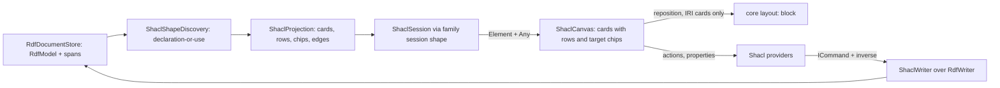

# Design Document

## Overview

The `w3c/shacl` reading joins `src/diagrams/rdf/` as a further definition over the family engine the rdf-diagram design built: no parser, no store, no new module folder — a projection over `RdfModel`, a thin writer composing the anchor's named splice operations, and the provider trio every module has. Three problems dominate this design, and each gets a concrete answer up front. **Targets aim at absent data** — so a target renders as a *chip*, a typed statement on the shape's card, never an edge and never a fabricated node; a chip is addressable through its card (its triple is fully named by shape IRI, target predicate and term — no blank nodes involved), so it can be shown in the grid and removed by menu without ever being a canvas element. **Property shapes are blank nodes** — so they render as *rows* of the referencing card, ordered by source span, with no element identity, no position and no stored layout; the identity boundary is satisfied because there is nothing to key. **Shapes are drawn, never executed** — the module ships no execution affordance at all, and the future execution spec attaches through two seams that already exist (a new provider registration, and an anchor item-10 header it claims then), so nothing here needs a hook. Agent 4's OWL class-expression problem is structurally similar but resolves differently: a restriction is an expression a reader nests, a property shape is a constraint a reader lists — rows, not trees, are the honest form here.

## Steering Document Alignment

### Technical Standards (tech.md)

- **Diagram storage** — the shapes file round-trips byte-identically through the family store; positions live in the `.adp` `layout:` block only.
- **Commands** — every gesture is an `ICommand` with a byte-restoring inverse via the databricks `Edits.Run` shape the anchor adopted; refusals answer before any splice.
- **gRPC call shapes** — no new services; elements ride `Element`/`Delta` with `Any` payloads.

### Project Structure (structure.md)

- All code inside the existing family module: `src/diagrams/rdf/backend/EtAlii.Adp.Diagram.Rdf/` gains `Shacl*` classes, `client/` gains the ShaclCanvas, `api/` gains `shacl.proto`, `examples/` gains a `shacl/` folder. Core untouched.

## Code Reuse Analysis

### Existing Components to Leverage

- **`RdfDocumentStore` / `RdfModel` / `SourceSpan`** — the projection consumes parsed triples with spans; row order, subtree removal and inline summaries all read spans, never text.
- **`RdfWriter`** — `AddTriple` carries targets, `rdf:type sh:NodeShape` and `sh:deactivated`; `RenameTerm` is the family rename verbatim; only two shacl-specific operations are added (below).
- **`RegistrationLayout` + core layout command** — consumed unchanged; only `res:{iri}` card ids ever reach it.
- **Central canvas library** — `BoxElement` cards (rows and chips as internal content, the mindmap/rdf card idiom), `StraightConnection` edges with labels, shared appearance classes, `CanvasScrollbars`, truncation banner precedent.
- **Provider trio pattern, problems pipeline, `ExampleRegistrationTests`/`ExampleReplicationTests`** — joined by existing.

### Integration Points

- **Definition** — `Diagram.Definitions` gains `w3c/shacl` (icon `mdi-check-decagram-outline`), `SharedExtension: true` over `.ttl`/`.nt` per the routing arrangement: never claims a bare body; Add suggests it off `sh:NodeShape` marker triples.
- **Context channel** — the family resolver learns the `shacl-edge:` id shape; shacl action/property/toolbox providers register beside the rdf ones, switching on the registration's origin.

## Architecture



## Components and Interfaces

### Backend: discovery and projection

- **`ShaclVocabulary`** — the closed SHACL Core term table (constraint parameters, target predicates, severities), sourced from the recommendation; feeds discovery, the row summaries and the unknown-term validation rule.
- **`ShaclShapeDiscovery`** — pure over `RdfModel`: a subject is a shape by declaration or by use (typed `sh:NodeShape`/`sh:PropertyShape`, object of `sh:node`/`sh:property`, subject of a target or constraint parameter). Produces the shape set with each shape's defining first span, for deterministic ordering.
- **`ShaclProjection`** — pure: model → drawn structure.
  - **Cards**: IRI-named node shapes; IRI-named property shapes referenced by no card; blank node shapes referenced via `sh:node` (anonymous cards, computed position only). Cards carry the deactivated/severity/closed flags.
  - **Rows**: each `sh:property` value renders one row on its referencing card — path printed as SHACL path syntax from the model (inverse/sequence/alternative/cardinality path forms), `sh:name` where present, a constraint summary assembled from `ShaclVocabulary` in a fixed parameter order, cardinality as `[min..max]` with `*` for absent max. Row order is source-span order of the `sh:property` triples. `sh:sparql` renders an opaque SPARQL row. A property shape referenced by several cards rows on each.
  - **Target chips**: one per target triple — kind (class, node, subjects-of, objects-of, implicit), term display, term IRI, and a `described_in_file` flag (true only when the term occurs as a subject elsewhere in the file). Chips are card content, never elements, never edges.
  - **Edges**: `sh:node` to the referenced shape's card; combinator operands (`and`/`or`/`xone`/`not`) to IRI-named operand cards with the operator as label, blank operands summarized inline in the referring row (one level deep; deeper nesting elides to `…` with the full structure readable in the grid); `sh:class` to a card only when exactly one drawn card claims that class as target, else it stays in the row summary.
  - **Budget**: cards are the counted elements against the **drawn-element budget**; rows and chips travel free with their card; truncation is first-N cards in discovery order with the banner payload.
- **`ShaclLayout`** — pure, deterministic: cards grid-placed in discovery order, height driven by row+chip count; no physics; `RegistrationLayout.Apply` overlays stored positions for `res:{iri}` cards only.
- **`ShaclSession` / factory** — the family session shape; `MoveElementToAsync` dispatches the core layout command for IRI cards and refuses `blank:{ordinal}` ids with the boundary sentence.

### Backend: the writer — two operations over the anchor's

- **`ShaclWriter`** composes `RdfWriter` for everything triple-shaped (targets, type triple on create, `sh:deactivated`, rename) and adds:
  - `AppendPropertyShapeBlock(document, model, shapeIri, path, options)` — splices one `sh:property [ sh:path … ; … ] ;` continuation into the IRI-named shape's block, indentation matched, prefixes reused, never invented. Keyed to the parent: the inverse is the whole-document snapshot restore, per the family command shape — the blank node itself is never addressed.
  - `RemoveShapeWithSubtrees(document, model, shapeIri)` — the shape's triples plus every blank-node subtree reachable only from it (reachability walked on the model, spans removed bottom-up, fragments before whole lines), one command, count computed first for the confirmation sentence.
- Mutation or removal of an *existing* blank-rooted property shape or constraint refuses in provider and writer both, naming the **blank-node identity boundary** and the text editor as the path.

### Backend: providers and validation

- **`ShaclContextActionProvider`** — on a card: add target (kind+term dialog), add property row (path required; optional datatype/min/max), deactivate/reactivate, rename (family), remove-with-count, remove-target entries listed per chip ("Remove target: class ex:Person" — addressed by shape IRI + predicate + term, no canvas selection of chips needed). Every gesture unavailable-with-reason on blank-rooted cards, under truncation, and on refused serializations. No validate-data action exists; the future execution spec registers its own provider and claims an item-10 header then — those two existing seams are the whole attachment surface.
- **`ShaclContextPropertyProvider`** — card grid: full IRI (read-only, naming rename), prefixed name, target rows (kind, term, and "not described in this file" where the flag says so — stated as a fact, not a finding), closedness, severity, `sh:name`/`sh:description`/`sh:message`, `sh:deactivated`; each property row's path and constraint values readable (blank-rooted ones read-only with the boundary as the stated reason); `sh:sparql` query text read-only.
- **`ShaclToolboxProvider`** — Node shape (placement id → prefix-validated name dialog → `rdf:type sh:NodeShape` triple) and Property row (drop on a card → the add-property action; refused on blank cards with the sentence).
- **`ShaclValidator`** — Requirement 7 over the model: property shape without exactly one `sh:path` (error); `minCount > maxCount` (warning); `sh:datatype` + `sh:class` jointly unsatisfiable (warning); unknown `sh:` term per `ShaclVocabulary` (warning); `sh:node`/`sh:property` naming an IRI the file does not describe (info, "described elsewhere or missing"); absent target terms explicitly not findings. Family-generic findings stay the anchor validator's.

### Client

- **`ShaclCanvas`** — `BoxElement` cards: title, target chips as a distinct band under the title (chip styling from shared appearance, `described_in_file` false rendered exactly like true — absence is normal, not an alarm), rows beneath (path left, cardinality right, summary muted; SPARQL rows badged), severity/deactivated badges, dimming for deactivated. Edges via `StraightConnection` with operator labels. Reposition drags allowed on IRI cards only (the `blank` payload flag gates the gesture client-side; the backend refusal stays the authority). Truncation banner per precedent.

## Data Models

`src/diagrams/rdf/api/shacl.proto`, packed as `Any` on the shared `Element`:

```proto
message ShaclShapePayload {
  string iri = 1;                 // empty for an anonymous card
  string display = 2;
  bool blank = 3;                 // identity-boundary marker
  bool deactivated = 4;
  string severity = 5;            // empty = default
  bool closed = 6;
  string name = 7;                // sh:name
  string description = 8;         // sh:description
  repeated ShaclTargetChip targets = 9;
  repeated ShaclPropertyRow rows = 10;
}
message ShaclTargetChip {
  ShaclTargetKind kind = 1;
  string term_display = 2;
  string term_iri = 3;
  bool described_in_file = 4;
}
enum ShaclTargetKind { SHACL_TARGET_KIND_UNSPECIFIED = 0; CLASS = 1; NODE = 2; SUBJECTS_OF = 3; OBJECTS_OF = 4; IMPLICIT_CLASS = 5; }
message ShaclPropertyRow {
  string path = 1;                // SHACL path syntax as printed
  string name = 2;                // sh:name
  string summary = 3;             // fixed-order constraint summary
  string cardinality = 4;         // "[min..max]"
  bool sparql = 5;
  bool blank = 6;
  string severity = 7;
}
message ShaclEdgePayload { string from_element_id = 1; string to_element_id = 2; string kind = 3; string label = 4; } // kind: node|class|and|or|xone|not
```

Element ids reuse the family vocabulary: `res:{iri}` for IRI cards, `blank:{ordinal}` for anonymous cards, `shacl-edge:{from}|{kind}|{to}` for edges.

## Error Handling

### Error Scenarios

1. **Target names absent data** — not an error anywhere: chip drawn, grid states the fact, validator silent (R1.3, R4.3, R7.5).
2. **Blank-rooted reposition or mutation** — refused with the boundary sentence naming the text editor; content draws and reads regardless (R3.2, R3.3, R5.7).
3. **User expects validation** — no affordance exists to misfire; the grid and problems panel speak only about the shapes file; the future-spec seam is stated in the action provider's remarks (R4).
4. **Property shape without `sh:path`** — validation error with line; the row still draws with its path cell empty-marked so the diagram and the finding point at the same thing (R7.1).
5. **Truncated file** — first-N cards, banner, info finding, edits withheld naming truncation (R8).
6. **Refused serialization / parse failure / unregistered reposition** — the family behaviours verbatim, nothing restated.

## Testing Strategy

### Unit Testing

- Discovery: the declaration-or-use table on fixtures covering every clause; deterministic ordering by first span.
- Projection: rows in span order; chip kinds including implicit class targets; `described_in_file` both ways; the `sh:class` single-claimant edge rule (zero, one, two claimants); combinator inline summaries at depth; budget counting cards only.
- Writer: `AppendPropertyShapeBlock` smallest-diff and byte-restoring inverse through the real command pipeline; `RemoveShapeWithSubtrees` reachability (shared blank subtree stays; exclusive subtree goes) and bottom-up span removal; every refusal sentence.
- Validator: each Requirement 7 rule, plus the explicit not-a-finding case for absent target terms.

### Integration Testing

- Open a registered shapes file over the family store: cards, rows, chips stream; reposition an IRI card into the `.adp` with the body byte-identical; undo byte-for-byte.
- One `.ttl` under `w3c/rdf` and `w3c/shacl` registrations at once: both readings live, an edit through either visible in both, one history.
- Add-target, add-property-row, deactivate: each lands as a minimal diff and undoes to bytes.

### End-to-End Testing

- `tests.md` entries: a vendored shapes file whose target class is absent from the file shows the chip and the grid fact with no dangling edge and no placeholder node; a blank-row mutation attempt surfaces the boundary sentence verbatim; the SPARQL row renders opaque with its query readable in the grid.
