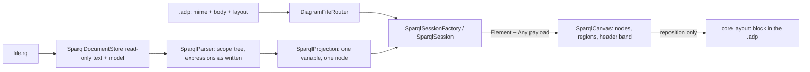

# Design Document

## Overview

One module, `src/diagrams/sparql/`, carrying the `w3c/sparql` type alone. Its center of gravity is the **variable-as-node projection**: a hand-rolled parser reads the full SPARQL 1.1 Query grammar into a scope tree of graph patterns, and the projection collapses every occurrence of a variable name into one node so that a node's degree on the canvas is its join count in the query. The module has **no writer for the `.rq` body** — the one mutating gesture is repositioning, which rides the core layout command into the `.adp` — so the entire splice half of the family's engine is absent by construction, not by restraint.

**What this design does not use, stated up front.** The approved `rdf-diagram` design builds a triplestore document store (a line CST with fragment spans), a parser that reports per-triple source spans precisely so splices can rewrite one fragment of a shared line, and a fragment-aware `RdfWriter` behind command inverses. None of that appears here: a query is not a serialization of a graph (no `RdfDocumentStore`, no `RdfModel`), spans exist in this parser only to report error lines and slice as-written expression text (never to write), and there is no splice because there is no write. This module consumes exactly what the requirements' boundary section claims: the central canvas library and family visual conventions, the core `layout:` block, and the vendoring discipline for its examples.

## Steering Document Alignment

### Technical Standards (tech.md)

- **Diagram storage** — the `.rq` round-trips byte-identically by never being written; authored positions go to the `.adp` per shared-machinery item 6.
- **Commands** — the single mutating gesture dispatches the existing core layout command with its byte-restoring inverse; the module defines no commands of its own.
- **gRPC call shapes** — no new services or streams; elements ride the existing `Element`/`Delta` with `Any` payloads.
- **Specifying a diagram type** — the five build steps order the tasks document.

### Project Structure (structure.md)

- `src/diagrams/sparql/backend/EtAlii.Adp.Diagram.Sparql/` (+ `.Tests`), `src/diagrams/sparql/client/`, `src/diagrams/sparql/api/sparql.proto`, `src/diagrams/sparql/examples/` — the layout every sibling module has; depends on core only, and deliberately not on `src/diagrams/rdf/`.

## Code Reuse Analysis

### Existing Components to Leverage

- **`DiagramDefinition`** — `w3c/sparql` with `Extension: ".rq"`, routing a bare `.rq` on sight; no shared-extension arrangement needed because nothing else claims the extension. Icon in the `mdi-` set suggesting a question over a graph (final pick at implementation).
- **The core `layout:` block** — `RegistrationLayout` and `SetRegistrationLayoutCommand`, consumed unchanged; element ids per the scheme below (space-free, satisfying the block's `<id>: <x> <y>` grammar).
- **Central canvas library and appearance** — `BoxElement` for term and variable nodes, `StraightConnection` for pattern edges, the shared `canvas.css`, `CanvasScrollbars`, selection/menu/keyboard plumbing; the truncation banner styled per the established precedent.
- **The problems pipeline, `ExampleRegistrationTests`, `ExampleReplicationTests`** — joined by existing.

### Integration Points

- **Routing** — `.rq` routes bare to `w3c/sparql`; the Add flow on an existing `.rq` creates only the registration. There is **no document factory**: creating a fresh query from inside ADP is not offered — queries are authored in text editors, per the requirements' read-only position — and the create-new path states that reason.
- **Context channel** — one resolver and one property provider, registered like every module's; the action provider offers no mutating actions and no toolbox provider is registered at all (part of the no-writer proof below).
- **History** — repositions ride the core layout command through `IHistoryStackStore`; nothing else enters history because nothing else mutates.

## Architecture



## Components and Interfaces

### Backend: the document and its parser

- **`SparqlDocumentStore`** — one entry per path: raw text, parsed `SparqlQueryModel` or error/line, `Changed` event, the load/forget/reload lifecycle. Deliberately **no save member of any kind**: the public surface ends at reading, which a reflection test pins (below). No line CST — with no splices to aim, plain text plus line-indexed positions for error reporting is the whole need.
- **`SparqlTokenizer` / `SparqlParser`** — hand-rolled recursive descent over the SPARQL 1.1 Query grammar. The scope is stated exactly, because a grammar this size is where a design either draws a line or quietly promises everything:
  - **Parsed structurally**: prologue (`BASE`, `PREFIX`); the four query forms with their clause shapes (`SELECT` projection with `DISTINCT`/`REDUCED` and expression aliases, `CONSTRUCT` template, `ASK`, `DESCRIBE` terms); the group-pattern tree — basic groups, `OPTIONAL`, `UNION` branches, `MINUS`, `GRAPH`, `SERVICE` (with `SILENT`), subqueries; triple patterns with predicate/object lists, blank-node property lists and collections (expanded to their pattern triples with anonymous variables); solution modifiers (`GROUP BY`, `HAVING`, `ORDER BY`, `LIMIT`, `OFFSET`); `VALUES` blocks.
  - **Recognized but kept as written**: expressions — `FILTER` bodies, `BIND` right-hand sides, `HAVING`/`ORDER BY` expressions, aggregate calls, and property paths. The tokenizer matches their brackets and string/IRI literals so it can slice the exact source text and find the variable references (`?name`/`$name` tokens) inside them; it does **not** build expression trees, because the requirements draw expressions as annotations showing the text as written. Property paths become edge labels verbatim.
  - **Refused by name**: a SPARQL Update document (leading `INSERT`/`DELETE`/`LOAD`/`CLEAR`/`WITH` after the prologue) parses far enough to be recognized, then yields the unavailable state naming SPARQL Update as out of scope. Any other failure raises `SparqlParseException` with line and reason — exactly one validation finding.
- **`SparqlQueryModel`** — prologue (prefix map with declaration lines, base), form descriptor, the **scope tree** (`GroupScope` nodes: kind, ordinal among siblings, child scopes, triple patterns, attached constraints), solution modifiers, and for each variable name a query-wide occurrence index (which patterns, which scopes, projected or not). Terms are a closed set: `VariableTerm(name)`, `AnonymousTerm(ordinal)`, `IriTerm(full, as-written)`, `LiteralTerm(lexical, datatype, language)`, `PathTerm(as-written)` in predicate position.

### Backend: projection — one variable, one node, through regions

- **`SparqlProjection`** — pure: model → nodes, edges, regions, annotations, header.
  - **Node identity**: one node per variable **name**, query-wide, subqueries excepted. One node per distinct concrete term form (IRI by full IRI, literal by lexical + datatype + language) — merging concrete terms asserts "same term", which is truthful, not a join claim. Anonymous variables (blank-node syntax) get one node per expansion ordinal.
  - **Placement rule, one sentence**: *every node lives at the shallowest scope that references it, and region edges reach out to it.* A variable used inside an `OPTIONAL` and outside sits outside; the region's pattern edges cross its border to reach the node — that crossing is the join being shown, not a rendering defect. A variable used only within one region sits inside it. `UNION` branches sharing a name place the node at the union's parent scope with each branch's edges reaching it (Requirement 4.5). `MINUS` follows the same textual-identity rule; the region label carries the exclusion semantics.
  - **Subqueries are the one hard boundary**: a subquery collapses to a single node stating its projection; its internal variables are not drawn; an outer variable whose name a subquery projects is connected to the subquery node by a labeled edge per projected name, so the join surface is visible without drawing the inside.
  - **Regions** nest as the scope tree nests; each region element carries its parent region id, and the projection guarantees a child region's elements are never claimed by two regions.
  - The local sanity bound (500 drawn elements) cuts in document order with the truncation fact riding the result.
- **`SparqlLayout`** — pure, deterministic, recursive over the scope tree bottom-up: each scope grid-places its own nodes and its child regions (each child sized by its computed content bounds) in document order of first appearance; the parent treats a placed region as one block; region bounds always contain their contents (Requirement 5.5). No physics. An authored position (below) overrides a node's computed place; an authored region position anchors the region's frame, its contents laid out relative to that anchor so containment survives authored moves.
- **Element ids** (Requirement 5.2), shared by projection, session, layout block and tests — all space-free:
  - `var:{name}` · `iri:{full-iri}` · `lit:{lexical-percent-encoded}@{lang-or-datatype-short}` · `anon:{ordinal}` (never accepted in the layout block)
  - regions: the dotted kind-and-ordinal path from the root, e.g. `region:group.0.optional.1`, `region:group.0.union.2.branch.0` — stable across reparses of an unchanged file because both kind and sibling ordinal come from source order.
  - `header:query` for the header band; annotations `note:{kind}.{scope-path}.{ordinal}`.
- **`SparqlSession` / `SparqlSessionFactory`** — the established session shape: render = projection + `RegistrationLayout.Apply`; `MoveElementToAsync` dispatches the core layout command for variable, concrete-term and region ids, and refuses with the reason for anonymous nodes (no stable identity), edges, annotations, the header band, and bare unregistered files (nowhere to store); `Changed` re-renders on external file edits.

### Backend: providers and validation

- **`SparqlContextSourceResolver` / `SparqlContextPropertyProvider`** — selection vocabulary is the element-id scheme; property rows per Requirement 6.2 (variable: name, projected, join count, defining expression; term: full IRI and prefixed form, or lexical/datatype/language; region: kind and constraint text; header selection: form and modifiers), every row read-only with the reason naming the text editor. **`SparqlContextActionProvider`** returns no mutating actions; **no toolbox provider exists in the module**.
- **`SparqlValidator`** — Requirement 7: unparseable-once with line; projected-but-never-used variable warned; unused prefix declaration as info with its line. No network, no execution — there is no code path that could contact a `SERVICE` endpoint because no HTTP client is referenced by the module at all.

### The no-writer guarantee, as tests rather than assertion

Three layers, because "there is no writer" erodes the first time someone adds a convenience method:

1. **Surface test (reflection)** — asserts the module assembly declares no type implementing the command interface, no member on `SparqlDocumentStore` whose name or signature writes (`Save*`, `Write*`, `Flush*`, a `Stream`/`TextWriter` parameter), and no reference to the file-write seams the other modules' writers use. A new convenience method fails this test by existing.
2. **Behavioural test (integration)** — opens a vendored example, byte-snapshots the `.rq`, exercises every offered surface: full render, every context action the provider yields (expected: none mutating), a reposition and its undo, an external-edit reload — then asserts the `.rq` bytes are identical and only the `.adp` changed.
3. **Registration test** — asserts the definition registers no toolbox entries and the action provider yields no action that carries a mutation marker, so the client can never offer a gesture the backend would have to refuse.

## Data Models

Wire payloads in `src/diagrams/sparql/api/sparql.proto` (packed as `Any` on the shared `Element`):

```proto
message SparqlVariablePayload {
  string name = 1;            // without the ? sigil; canvas renders ?name
  bool projected = 2;         // SELECT-listed or *-included
  int32 join_count = 3;       // pattern edges meeting this node
  string defining_expression = 4; // BIND/alias source text, empty otherwise
  bool anonymous = 5;         // blank-node-syntax variable; computed position only
}
message SparqlTermPayload { string display = 1; string full = 2; string annotation = 3; int32 kind = 4; } // kind: iri | literal
message SparqlEdgePayload { string from_element_id = 1; string to_element_id = 2; string label = 3; bool is_path = 4; }
message SparqlRegionPayload { string kind = 1; string label = 2; string parent_region_id = 3; }
message SparqlAnnotationPayload { string kind = 1; string text = 2; string attached_to = 3; } // filter | bind | values, text as written
message SparqlHeaderPayload { string form = 1; repeated string modifier_rows = 2; } // e.g. "ORDER BY DESC(?date)", "LIMIT 100"
message SparqlTruncationPayload { int32 shown = 1; int32 total = 2; }
```

### Client

- **`SparqlCanvas`** — composed from the central library: variable nodes as dashed-outline `BoxElement`s with a projection mark, IRI nodes solid with prefixed display, literal rectangles with lexical form and annotation, `StraightConnection` edges labeled with predicate or as-written path; regions drawn as labeled containment frames behind their contents (the library's boundary/group element where it offers one, a module-styled frame otherwise — resolved at implementation against what the library exports); `FILTER`/`BIND`/`VALUES` badges anchored to their targets; the header band pinned at the top; drag → core layout command for the ids the session accepts; payload decode type-checked before `fromBinary`.

## Error Handling

### Error Scenarios

1. **File does not parse** — diagram unavailable naming file, line and reason; one validation finding (R1.3, R7.1).
2. **SPARQL Update document** — unavailable naming SPARQL Update and the reason it is out of scope (R1.2).
3. **Reposition on a bare unregistered `.rq`** — refused naming the missing registration; the Add flow lifts it (R5.3).
4. **Reposition on an anonymous variable, an edge, an annotation or the header** — refused with each surface's own reason (R5.4).
5. **Degenerately large query** — truncated at the local bound with the showing-N-of-M banner; an info finding notes the truncation (R7.5).

## Testing Strategy

### Unit Testing

- **Parser**: a fixture corpus with at least one fixture per construct in the parsed-structurally list, each query form, expression slicing (asserting the as-written text and the extracted variable references), property paths as labels, blank-node syntax expansion, CRLF/LF and no-trailing-newline variants, and Update-document refusal. `*.rq -text` joins `.gitattributes` by extension with the reasoning recorded there, per the standing rule, because the CRLF/LF fixture pairs are byte-compared.
- **Projection**: one-node-per-variable across regions (inside/outside `OPTIONAL`, across `UNION` branches, under `MINUS`); the shallowest-scope placement rule; subquery collapse with projected-name edges; concrete-term merging; join counts; determinism (same model, same elements in the same order); the truncation cut.
- **Layout**: recursive containment (every region's bounds contain its contents, nested two deep), determinism, authored node and region-anchor overrides, anonymous nodes always computed.
- **No-writer surface test** and the validator's three findings, each asserting its sentence.

### Integration Testing

- The gRPC flow: open a registered `.rq`, stream nodes/regions/header, reposition a variable and a region into the `.adp` with the body byte-identical, undo restoring the `.adp` bytes; a bare `.rq` routing on sight and refusing repositions with the reason.
- The behavioural no-writer sweep (above) on a vendored example.
- Examples joining `ExampleRegistrationTests` and `ExampleReplicationTests` by existing; a module test walks the vendored folders asserting license text and provenance readme presence.

### End-to-End Testing

- `tests.md` entries: opening the W3C `OPTIONAL`+`UNION`+`FILTER` example and confirming the shared variable draws once with edges crossing region borders; the projection mark matching the `SELECT` list; reposition-reopen-undo leaving the `.rq` untouched in a visible diff.
