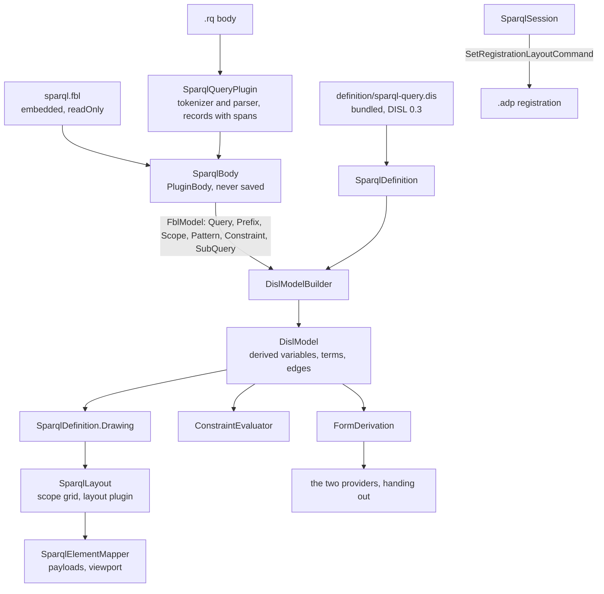

# Design Document

## Overview

The SPARQL query diagram is converted in **eight steps, each one pull request, each held to one frozen transcript**. The transcript is generated from today's hand-written code first (step 1). Every later step replaces one hand-written part by its derived or bound equivalent and must reproduce the transcript byte for byte. No step is allowed a difference: every open question stands at its default, and the defaults of Q2 to Q5 all keep today's behaviour.

This tool never writes its body, so there is no write side to convert. The work is reading plus derivation, and the design is written against the default of Q1: **the plugin delivers one stored record per entry, and the definition derives what is drawn**. That makes the library work (derived node types) the largest part of the specification.

The module ends as three classes that carry the conversion, and the host code Requirement 8.1 names:

- `SparqlDefinition`: the bundled DISL definition loaded once, and what is derived from it (rows, findings, refusals, the empty toolbox, the drawn elements), mapped to today's wire ids by its `x-sparql` block.
- `SparqlQueryPlugin`: the FBL persistence plugin `net.etalii.adp.w3c.sparqlQuery`. It wraps `SparqlTokenizer` and `SparqlParser`, delivers the stored records with their spans, and refuses every plan.
- `SparqlBody`: one `.rq` body opened through the module's binding, giving the plugin's reading and the DISL model built from it. It has no `Change` and no `Save`.

**One point of the approved requirements is proposed for a small amendment**, in *Amendment proposed* below. It concerns Requirement 9.2 and changes no behaviour.

## Steering Document Alignment

### Technical Standards (tech.md)

- *Specifying a diagram type*: the definition lives in etalii-adp/etalii.adp and is bundled by `bundle-disl.sh`, never edited here. The binding is the module's own file and the definition names it by URL.
- The reader stays code because the format is a grammar (finding B1), and it is reached only through the plugin contract, so every host that has the plugin reads a query the same way.
- The four gates, the transcript and "a test seen to fail first" are the checks of every step.

### Project Structure (structure.md)

- A diagram type adds declarations and no core code. What the libraries lack is added to `EtAlii.Adp.Specification.Disl` and to the client's notation compiler for every tool (*Library work*), named for what it does.
- The module gains `definition/` (bundled) and one embedded `sparql.fbl`. The test project gains `Parity/`.

## Code Reuse Analysis

### Existing Components to Leverage

Each was opened and the member named was checked.

- **`BundledDefinition.Load(assembly, logicalName)`, `WireIdMap.Of(specification, key)` and `WireIdMap.PropertyId`, `FormDerivation.Derive(specification, element, env, ids)`, `ToolboxDerivation.Derive`, `ConstraintEvaluator.Evaluate` with `DislConstraintOptions.ReaderFindings` and `DislReaderFinding.NotParsed`, `GestureConstraintEvaluator.Placement`, `DislModelBuilder.From(FblModel, DislSpecification)`, `DislEnv(ReadOnly: true)`** (`EtAlii.Adp.Specification.Disl`). `DotNetDefinition.cs` is the model for `SparqlDefinition`: a read-only tool whose rows all carry a reason.
- **`PluginBody.Open(bytes, binding, plugin, fileName)`, `IPersistencePlugin`, `PluginReadResult`, `PluginPlanResult.Refused`, `FblDocumentLoader.Load`, `FblBinding.ReadOnly`, `TemplateSettings.Text`, `RegistrationSettings.CreateOnFirstPlacement`** (`EtAlii.Adp.Specification.Fbl`). `AbmBody.cs` and `AbmMarkdownPlugin.cs` are the model for `SparqlBody` and `SparqlQueryPlugin`, less everything that changes a body. `PluginBody.Plan` refuses with the binding's `readOnly` sentence before the plugin is asked, and `PluginBody.Save` throws on a read-only body: both were read.
- **`DocumentLifecycle` of `EtAlii.Adp.Documents`** (the read-only one): the store keeps it unchanged.
- **`SetRegistrationLayoutCommand` and `RegistrationLayout.Read`** (core): a move and the reading of stored positions stay exactly as `SparqlSession` has them.
- **The CEL library** (`EtAlii.Adp.Specification.Cel`): `split`, `slice`, `join`, `lists.range`, `distinct`, `flatten`, `sort`, the `sortBy` macro and `cel.bind` are present (searched for each in `Library/` and `CelEnvironment.cs`). The definition's functions `mentions`, `shallowestScope` and `drawOrder` are written with them and need no new CEL function.
- **The timeline's and the hype cycle's `Parity/` folders** (`TimelineTranscript.cs`, `TranscriptText.cs`, `HandWrittenGhg.cs`, the `GhgDerived*.Tests.cs` files): the generator, the comparison and the derived-against-hand-written tests are copied in shape.
- **`parseDisl`, `compileNotation`** (`client/src/canvas/library/disl/`): the canvas definition is compiled as the converted modules compile theirs.

### Integration Points

- **etalii-adp/etalii.adp**: `definitions/diagrams/sparql-query.dis` and `.md` are rewritten there, and `specifications/fbl/w3c-sparql-query.fbl` is added as the example binding (step 2), through that repository's own pull request and checks. Step 4 cannot bundle before that pull request is merged.
- **`EtAlii.Adp.Specification.Fbl.Tests`**: `RealFiles/divergences.json` has no entry for this tool and gains none. A plugin-read binding has no rule to compare with a parser (the requirements' appendix), so the cross-check here is the plugin's reading against the definition's expectation, held by the transcript.
- **The other specifications of the series**: derived node types, derived relations with `key` and `owner`, and budgets are needed by several tools. The requirements name no specification that delivers them first. They are shared and delivered once: step 4 begins by searching the library for each, and builds only what is still missing.

## Architecture

### The steps

| Step | What changes | Held by | Depends on |
| --- | --- | --- | --- |
| 1 | `Parity/sparql.transcript.json`, its generator, the fixtures of Requirement 1.2 and the test that today's code reproduces it, seen to fail against a changed sentence. No product code changes. | Requirement 1 | Nothing |
| 2 | In etalii.adp: the definition at DISL 0.3 with `x-sparql`, `typeMap`, the id rules and `persistence.format: "fbl"`; the companion rewritten; the example binding. | Requirements 2.1 to 2.3, 3.1 (the example) | Nothing here |
| 3 | The parser carries a span and a line on every group, pattern, constraint and subquery, and the parse exception carries the column (findings B3, B4). Additions only: the transcript is unchanged. | Requirement 3.3 (the spans), 3.4 (the column) | Step 1 |
| 4 | Library work L1 to L7. The definition bundled, embedded and loaded with no error; `BundledDefinition.Tests`. Nothing derives from it yet. | Requirements 2.4, 2.5, 9 | Step 2 merged |
| 5 | **Derivation.** Rows, findings, refusals, the empty toolbox and the drawn elements are derived. The stored records are produced by `SparqlRecords.From(SparqlQueryModel, text)` from what `SparqlParser` returns, as the store calls it today. `SparqlProjection`, `SparqlValidator` and the providers' logic move to `Parity/HandWrittenSparql.cs` as the oracle. | Requirements 4, 5, 8.2 | Steps 3 and 4 |
| 6 | **Reading.** `sparql.fbl` embedded; `SparqlQueryPlugin` (its `Read` calls the same `SparqlRecords`); `SparqlBody`; the store's entry holds a body; the document factory hands out the binding's template. The no-writer guards are extended in this same step, because the plugin must not land without them. | Requirements 3, 6, 7 | Step 5 |
| 7 | The client compiles its canvas definition; today's stays in a test as the oracle; the client library items C1 to C4; the `tests.md` entry. | Requirement 10 | Step 4 |
| 8 | The companion's table of remaining classes and its gaps (a second pull request in etalii.adp), the documentation, the catalog row and the delivery report. | Requirements 8.3, 11, 12 | Steps 6 and 7 |

Steps 5 and 6 are separate on purpose. Step 5 changes what is derived and leaves the route from text to records alone; step 6 changes the route and leaves the derivations alone. A difference in the transcript can then be attributed to one of them.

### Modular Design Principles

- One concern per file: the definition's derivations, the plugin, the records, the body, the stand-in, the layout and the mapper are separate classes.
- The providers and the validator hold no logic: each finds the entry and calls `SparqlDefinition`.
- No module name enters a library (Requirement 9.4), and no library type is subclassed by the module.

## Components and Interfaces

### SparqlDefinition

- **Purpose:** the bundled definition and what is derived from it.
- **Interfaces:** `Specification`; `Rows(body, wireId)`; `Findings(body)`; `MoveRefusal(body, wireId)`; `ReparentRefusal`; `Toolbox` (empty); `Drawing(body)`; `ElementOf(model, wireId)`.
- **Dependencies:** `EtAlii.Adp.Specification.Disl`.
- **Reuses:** the shape of `DotNetDefinition`, with `DislEnv(ReadOnly: true)`.
- **Wire ids.** The model's ids are today's ids (`var:`, `anon:`, `iri:`, `lit:`, `sub:`, `region:`, `note:`, `edge:`), stated by the definition's id rules and derived `id` expressions over what the plugin delivers. They are therefore also the keys of the registrations' `layout:` blocks, and no id is computed in module code (Requirement 4.2, 7.1). The definition's `ids.pattern` is widened so that an edge id holding a property path written with spaces is an id (finding A10), which keeps today's key.
- **`Drawing(body)`** fills the existing records `SparqlNode`, `SparqlEdge`, `SparqlRegion` and `SparqlAnnotation` field for field from the model's drawn elements, in the kept order of the budget, with its `shown` and `total`. It holds no placement, no id, no order and no cut: those are the definition's. `SparqlLayout` and `SparqlElementMapper` keep their input type, so neither changes at step 5.
- **Findings.** The plugin's `std.unparseable` becomes a `DislReaderFinding.NotParsed` and is worded by `constraints.builtIn` (finding A6). The unused prefix is a rule scoped to the stored `Prefix` record, whose line the evaluator takes from the element (finding A7). The unbound projection is a diagram rule with `forEach` over the projection, `location` line 1 and no target, exactly as today (Q3), with today's condition of no pattern position and no defining expression, so the false finding of A9 is reproduced (Q4).

### SparqlQueryPlugin and SparqlRecords

- **Purpose:** the reader behind the binding (Requirement 3.2 to 3.4).
- **Interfaces:** `IPersistencePlugin`: `Id`, `Read`, `Plan`, `Template`, `Watch`.
- **`Read`** decodes the body, parses, and returns `SparqlRecords.From`: one `FblElement` per entry, in document order, each with `OwnSpan` and `Line`. A `SparqlParseException` or a tokenizer error is caught and returned as no elements, `Unreadable` true and one `Finding` of code `std.unparseable` with the parser's sentence and a `SourceLocation` of line and column. The three tiers of the grammar are the parser's and are not touched.
- **`Plan`** returns `PluginPlanResult.Refused` with the tool's sentence for every change, `Save` included. It is the second of the two stops of Requirement 6.1; the first is the binding's `readOnly`, which `PluginBody` checks before it asks.
- **`Template`** returns the binding's template text. It is never asked, because the binding has `template.text` (finding B8).
- **Why code:** FBL 11.5 and finding B1. The class is named in the companion beside that reason.

### SparqlBody

- **Purpose:** one `.rq` body, read through the binding.
- **Interfaces:** `Parse(text)`; `Reading` (the `FblModel`); `Disl` (the DISL model, cached with the bytes it was read from, as `AbmBody` caches); `IsUnreadable`; `Binding` (static, loaded once from the embedded resource).
- **Dependencies:** `EtAlii.Adp.Specification.Fbl`, `SparqlDefinition.Specification`.
- **No `Change`, no `Save`, no `Bytes` setter.** `SparqlDocumentEntry` becomes a body and the lifecycle's own sentence for a missing or unreadable file. A text that reads and does not parse is installed by the lifecycle as today and gives an unreadable body, so the diagram shows the frame only (Q2).

### SparqlChrome (the stand-in for finding A12)

- **Purpose:** the two things DISL calls chrome and the wire carries as elements: the header band (`header:query`) and the truncation banner (`truncation`).
- **Interfaces:** `Elements(drawing)`, `Rows(body, wireId)`, `MoveRefusal(wireId)`.
- **How it works:** the ids and the element type strings are read from `x-sparql.elements` and `x-sparql.types`. The header's rows are the diagram's own form rows (library item L7), and the banner's text is the budget notice's text with `shown` and `total`. The two move refusals ("The header band states...", "That banner reports...") are sentences of this class, because chrome has no gesture in DISL and so no place for a refusal.
- **Why code:** language gap, already ruled for the ids; the two sentences are added to the companion as an eighth gap (Requirement 11.1). The class is deleted when DISL lets a host name chrome on its wire.

### The providers, the validator, the session and the store

- **`SparqlContextPropertyProvider`:** `SparqlChrome.Rows` for the two chrome ids, otherwise `SparqlDefinition.Rows`. `SetAsync` refuses with the definition's `std.readOnly` sentence, which the definition words as today's row reason.
- **`SparqlContextActionProvider`:** hands out no group, since the definition declares no operation, and refuses with the binding's `readOnly` sentence, which is today's `NoActionsReason`.
- **No toolbox provider is registered** and the client registers no toolbox with the panel (Q3, finding A13). `SparqlDefinition.Toolbox` is derived, is empty, and is asserted empty by a test; it is handed to nobody.
- **`SparqlValidator`:** `SparqlDefinition.Findings(SparqlBody.Parse(text))` mapped to `DiagramProblem`.
- **`SparqlSession`:** keeps the viewport, the diff, the move through `SetRegistrationLayoutCommand`, and the two sentences for a move without a history and without a registration (finding B9). The refusal by kind becomes `SparqlChrome.MoveRefusal` or `SparqlDefinition.MoveRefusal`, which answers from the ephemeral id rule's `reason` for an anonymous variable and from the notation's `refusals.move` for an edge and an annotation.
- **`SparqlDocumentStore`, the reloader, the session factory, `SparqlSelection`, `SparqlContextSourceResolver`:** unchanged in shape; they read the entry's body.
- **`SparqlDocumentFactory`:** returns `SparqlBody.Binding.Template.Text` and holds no text.

### The client

- `SparqlCanvas.tsx` imports the bundled `.dis` with `?raw` and `compileNotation(parseDisl(text), SPARQL_BINDINGS)` replaces `SPARQL_DEFINITION`, which moves to the test as the oracle. `sparqlModel.ts`, `useSparqlStream.ts` and `sparql.css` stay: they are the wire and the theme.

## Library work (Requirement 9)

Each item is added with a test seen to fail first. Each was searched for in the library before it was listed.

| # | What | Evidence that it is missing | Needed for |
| --- | --- | --- | --- |
| L1 | Derived node types (DISL 4.11.2, 4.11.5): `from`, `key` with `group`, `id`, `attributes`, `parent` with `std.containment`, `sources`, `reason`; computed in the order of `metamodel.types`, before the derived relations; ordered by the first item of each group. | `DislModelBuilder.Complete` calls `DerivedIds` and `DerivedRelations` only; no loop over node types reads `Derived`. | Requirement 4.3, 9.1 |
| L2 | Derived relations with `key` and `owner`. | `DerivedRelations` answers a `key` with "groups its items by key, which this runtime does not compute yet"; searched for `owner` in the library: only the walker's context assignment. | Requirement 9.1; the edge owned by the scope that states it |
| L3 | `ephemeral` on an id rule, with its `reason`, and the refusal of a placement of an ephemeral element. | `DislIdRule` is `(Strategy, Expression)`; `"ephemeral"` occurs in `DislExpressionWalker.cs` alone. | Requirements 2.2, 5.4, 9.2 |
| L4 | A constraint's `location` and `subject`, carried on `DislFinding`. | `DislFinding` has `Line` only; both keys occur in the walker alone. | Requirements 5.3, 9.2 |
| L5 | `limits.budgets`: a `count` measure, `max`, `order`, `truncate`, the rule that a relation is kept only with both ends, and the CEL function `budget(id)` with `shown` and `total`. | `"budgets"` occurs in the walker alone; no `budget` function in `DislCelLibrary`. | Requirement 4.4 (the cut at 500 and its two numbers) |
| L6 | Notation `refusals` (DISL 6.9 *GestureRefusals*) evaluated per gesture and kind. | `GestureConstraintEvaluator` reads the gesture constraints of DISL 8.4 only. | Requirement 5.4 (edge, annotation, re-parenting) |
| L7 | The form rows of the diagram itself. | `FormDerivation.Derive` takes a `DislElement`; searched for an overload taking a `DislDiagram`: none. | Requirement 5.1 (the header's two rows) |
| C1 to C4 | In the client's `compileNotation`: the chrome header band (C1), a budget's notice (C2), a container drawn behind its contents with edges crossing its border (C3), a second label and a mark bound to an attribute (C4). | Searched `compileNotation.ts` for `header`, `notice` and `frame`: none; `chrome` occurs for rulers only. C3 and C4 are confirmed against the compiler at step 7 before anything is added. | Requirement 10.2 |

**Not built here:** a binding's `args` for a plugin (Requirement 9.3: no second tool needs it yet), a percent-encoding function (the plugin delivers the encoded key, gap 6), a folder body for plugin readers and graph functions in the CEL library (this tool reads one file and walks no graph).

## Data Models

### The plugin's records and the metamodel

| Record (binding type) | Becomes | Attributes the plugin delivers |
| --- | --- | --- |
| `Query` | diagram attributes (`typeMap` `as: "diagram"`) | `form`, `distinct`, `reduced`, `describeTargets`, `projection` (names), `aliases`, `datasetClauses`, `modifierRows` |
| `Prefix` | stored `Prefix`, never drawn | `prefix`, `iri`, `used` (decided on the source text, finding A7) |
| `Scope` | stored `Scope`, id derived `'region:' + self.path` | `kind`, `label`, `path`; its parent is the enclosing `Scope` |
| `Pattern` | stored `Pattern`, never drawn | per end: its kind, its key, its display, full and annotation forms; `predicate`, `isPath`, `repeat`, `predicateVariable` |
| `Constraint` | stored `Annotation`, id derived as in the requirements' appendix | `kind`, `text`, `definedVariable`, `referencedVariables`, `ordinal` |
| `SubQuery` | stored `SubQuery`, id derived | `projectionText`, `text`, `projectedNames`, `ordinal` |

Derived by the definition: `Variable` (one per name, `parent` the shallowest scope, lifted out of a union), `Iri`, `Literal` and `AnonymousVariable` (one per key, from the pattern ends and the `DESCRIBE` targets), the relation `TriplePattern` (one per `Pattern`, `owner` its scope) and the relation `ProjectedJoin` (one per projected name of a subquery). `Pattern` is a stored node and not a stored relation because `DislModelBuilder` resolves a stored relation's ends before any derived node exists.

Three points the requirements left to the design:

- **The binding's version.** The appendix writes `"fbl": "0.2"`; the three bindings bundled here say `0.1`, and `FblDocumentLoader` reads a newer minor version with a warning and no error. The binding is written at `0.2` as approved, and its test requires no load problem of severity error.
- **`plans`.** The plugin's declaration says `"plans": []`. If the DISL schema refuses an empty list at step 2, the key is omitted and the binding's `readOnly` alone says it; either way `Plan` refuses.
- **A variable's `definingExpression`** is a derived attribute: the projection's alias when there is one, otherwise the text of the last `BIND` that defines the name, in the order of `drawOrder`.
- **Order.** `drawOrder` is one function of the definition: `where` before the template, then reading order. It is the `sortBy` key of each `from` and the budget's `order` after the type rank (regions, nodes, edges, annotations). Variables sort by first scope path and then by name, by code point. The fixture of finding A11 runs the oracle under two cultures at step 1; if no two producible scope paths compare differently, A11 is struck as Requirement 11.4 says.

`repeat` (how many earlier patterns have the same ends and predicate) is delivered by the plugin and not counted in CEL, because counting it per item is quadratic in the number of patterns.

### The transcript

One JSON file, `Parity/sparql.transcript.json`, shaped as the timeline's: `module`, `generator`, `regenerate`, `documents`. Per document: `payloads` with positions, `rows` for every element and for an unknown id, `selection`, `findings`, and `gestures`: the scripted sequence of Requirement 1.1, each step with its answer, the registration's bytes after it, and `bodyUnchanged`, the comparison of the `.rq` bytes before and after (Requirement 1.4).

## Amendment proposed

Requirement 9.2 says the design lists what else of finding A5 the backend derivations need "from a load of the rewritten definition". The rewritten definition is written at step 2 and does not exist when this design is approved, so no load can be made now. The list above (L3 to L7) is a reading of the draft and of the requirements' appendix against the library.

The amendment, to be put to the user as a selection before the tasks card:

- **9.2 reads "the design lists them from a reading, and a load of the rewritten definition at the start of the library step confirms the list; the loader's output replaces it where they differ"** (recommended: it is what the causal loop design does, and it keeps the design ahead of the etalii.adp pull request).
- The requirement stands, and the definition is rewritten and loaded before this design is approved.
- Other.

This design is written against the first.

## What waits, and on what

- **The seven gaps of section C, and the eighth of `SparqlChrome`**, wait on etalii-adp/etalii.adp. Until then: a region's stored position moving its computed contents stays in `SparqlLayout` (gap 5), the sentence for a move without a registration stays in `SparqlSession` (gap 3), region and subquery ids stay stored names (gap 4, Q5), and an unreadable body's header reads the diagram's default form, which is `SELECT` (gap 7, finding B6, reproduced).
- **The three changes of Q3 and the four defects of Q4** are reproduced, each with its fixture, and raised afterwards one by one. Because moves stay core's command and positions are read by `RegistrationLayout.Read`, no `fbl.stale-view-data` and no `std.ephemeralViewData` can arise (Requirement 7.3).
- **A binding's `args`** waits on a second tool that needs it.

## Error Handling

### Error Scenarios

1. **The bundled definition or the embedded binding does not load.**
   - **Handling:** `SparqlDefinition` or `SparqlBody.Binding` throws on first use with the loader's problems; `BundledDefinition.Tests` and the binding test fail in the gate.
   - **User Impact:** none in a released build.

2. **A query that does not parse**, a SPARQL Update document included.
   - **Handling:** the plugin reports the body unreadable with one `std.unparseable`; the model is empty; only the frame is drawn.
   - **User Impact:** today's finding, "This is not a SPARQL query that can be read: " and the parser's sentence, at its line.

3. **A missing or unreadable file.**
   - **Handling:** the lifecycle's `Unavailable` entry, as today; a reload that cannot read keeps the last good body.
   - **User Impact:** unchanged.

4. **A change reaches the plugin or the body.**
   - **Handling:** `PluginBody.Plan` refuses with the binding's sentence; `SparqlQueryPlugin.Plan`, called directly, refuses with the same.
   - **User Impact:** "A query diagram offers no edits: it reads the .rq file, which is edited in a text editor."

5. **A derived type fails** (`std.derivedFailed`, `std.derivedId`, `std.containment`).
   - **Handling:** the library's findings are not shown to a user under Requirement 5.5; a test over the whole corpus requires that none occurs, so one is a red gate and never a silent drop.
   - **User Impact:** none.

6. **The transcript differs after a step.**
   - **Handling:** the step is not delivered. No difference is named by the requirements under the defaults.
   - **User Impact:** none.

## Testing Strategy

### Unit Testing

- Library: one test class per item L1 to L7, each seen to fail before its change, with the examples of DISL 4.11.2 and 3.2.1 as cases.
- `SparqlQueryPlugin`: the records and spans of each fixture; every span sliced from the bytes gives the entry's text; `Read` on every file of the corpus and on truncated prefixes of each never throws; every `ModelChange` kind is refused.
- `BundledDefinition.Tests`: the embedded bytes equal `definition/`, the recorded sha256 holds, the definition loads with no error.
- The binding: loads, is `readOnly`, claims `.rq` and `w3c/sparql`, and its template equals the factory's text; seen to fail with `readOnly` removed (Requirement 6.3).

### Integration Testing

- **The transcript test** is the main one, byte for byte at every step.
- **Derived against hand-written**, per kind (rows, findings, refusals, drawing, order and cut), each comparing `SparqlDefinition` with `HandWrittenSparql` over the corpus, so a difference names the document and the element.
- **One fixture per *read* finding** (Requirement 1.2): `values-bound-projection.rq`, `subquery-bound-projection.rq`, `literals-datatypes-end-alike.rq`, `path-with-spaces.rq`, `scope-paths-by-culture.rq`, `over-the-bound.rq`, `self-reference.rq`, and `second-optional-positioned.rq` with its registration.
- **No writer** (Requirement 6): `NoWriterSurface.Tests` is extended to every type of the assembly: no method returns `PluginPlanResult.Planned` or a list of splices, no method calls `Save` on a body (read from the method bodies' call targets), and no field or signature holds a stream or a writer. It is seen to fail against a plugin that plans one splice. `NoWriterSweep.Tests` adds the plugin's four operations to the surfaces it compares the `.rq` bytes across. The HTTP reference test stays.
- The existing store, session, reloader and layout tests stay and pass; the parser's tests stay with the parser; the projection's and the validator's move with their subjects to the oracle.

### End-to-End Testing

- The `tests.md` entry of Requirement 10.3, in a real browser, in both themes.
- A newly created worktree is built before the gates are trusted at steps 4, 6 and 7, because each changes what is embedded or imported.
- The largest `.rq` of the corpus and the query over the bound are timed before and after step 5 (the performance requirement).

## What remains in the module, and why

| Class | Stays because |
| --- | --- |
| `SparqlTokenizer`, `SparqlParser`, the `_Model` types, `SparqlVocabulary`, `SparqlParseException` | The format is a grammar (FBL 11.5, finding B1). |
| `SparqlQueryPlugin`, `SparqlRecords` | The plugin contract's reader. |
| `SparqlBody`, `SparqlDefinition` | The two classes of the conversion. |
| `SparqlLayout` | The definition's layout plugin; also language gap 5 (a container's stored position). |
| `SparqlChrome` | Language gap: chrome carried as wire elements (finding A12). |
| `SparqlElementMapper`, `SparqlSelection`, `SparqlContextSourceResolver` | Payloads, the viewport filter and selection are the host's wire. |
| `SparqlSession`, `SparqlSessionFactory`, `SparqlDocumentStore`, `SparqlDocumentReloader`, `SparqlDocumentFactory` | The shared read-only lifecycle, core's move command, language gap 3. |
| The two providers, `SparqlValidator` | Seams of the host, handing out. |
| `SparqlProjection` | Leaves the product code at step 5; kept in the test project as the oracle. |

## Requirement Coverage

| Requirement | Where |
| --- | --- |
| 1 | Step 1; *The transcript*; Testing Strategy (fixtures) |
| 2 | Steps 2 and 4; *SparqlDefinition*; *The plugin's records and the metamodel* |
| 3 | Steps 2, 3 and 6; *SparqlQueryPlugin and SparqlRecords*; *SparqlBody*; the document factory |
| 4 | Step 5; *Wire ids*; `Drawing`; *Data Models* (order, the budget) |
| 5 | Step 5; *Findings*; the providers, the validator and the session; *SparqlChrome* |
| 6 | Step 6; `Plan`; Error scenario 4; Testing Strategy (no writer) |
| 7 | Steps 5 and 6; *Wire ids*; `SparqlSession`; *What waits* |
| 8 | Steps 5 and 8; *What remains in the module* |
| 9 | Step 4; *Library work*; *Amendment proposed* |
| 10 | Step 7; *The client*; items C1 to C4 |
| 11 | Step 8; *What waits*; *SparqlChrome* (the eighth gap); the order fixture of A11 |
| 12 | Step 8; Testing Strategy (the fresh worktree) |
