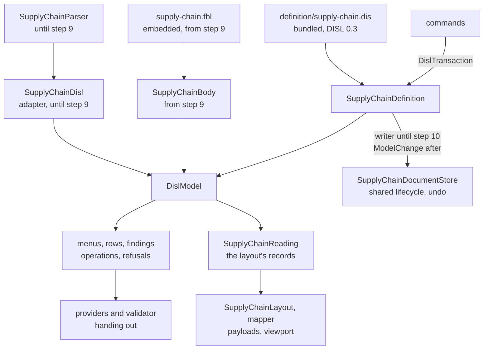

# Design Document

## Overview

The supply chain diagram is converted in **eleven steps, each one pull request, each held to one frozen transcript**. Eight are built now. Three wait for a change of FBL in etalii-adp/etalii.adp, because the default of Q3 is to report finding B1 and wait, and nothing is built on a workaround (*What waits, and on what*).

What is built now is everything the definition can carry without the binding: the transcript, the definition at DISL 0.3, the library work, and the palette, menus, rows, findings, operations and refusals derived from the bundled definition. Until the binding can read a `.supply` as the tool does, the DISL model is built from `SupplyChainParser` by a small adapter, exactly as the timeline's `TimelineDisl` builds its model from `TimelineParser`, and a derived transaction is applied through today's `SupplyChainWriter`. The transcript therefore stays byte-identical through all eight steps: no step built now changes a byte a user or a file sees.

The module ends in the shape the hype cycle graph has. Two classes carry the conversion:

- `SupplyChainDefinition`: the bundled definition loaded once, and what the providers derive from it, mapped to today's wire ids by its `x-supply-chain` block.
- `SupplyChainBody` (waits): one `.supply` body opened through the module's FBL binding, giving the binding's reading, the DISL model built from it, and `Change(ModelChange)`.

**Three points of the approved requirements are proposed for small amendments** in *Amendment proposed*. None changes what the tool does.

## Steering Document Alignment

### Technical Standards (tech.md)

- *Specifying a diagram type*: the definition lives in etalii-adp/etalii.adp and is bundled, never edited here. The binding is the module's own file, as the hype cycle's is, and the definition names it by URL.
- Splices, never reserialization: today's rule for the writer becomes FBL's, which is stricter (a value's span, not a line). Until then the writer stays and its rule holds.
- The four gates, the transcript and "a test seen to fail first" are the checks of every step.

### Project Structure (structure.md)

- A diagram type adds declarations and no core code. What the libraries lack is added to `EtAlii.Adp.Specification.Disl` for every tool, named for what it does.
- The module gains `definition/` (bundled) and, when the binding can be loaded, one embedded `.fbl`; the test project gains `Parity/`.

## Code Reuse Analysis

### Existing Components to Leverage

- **`BundledDefinition.Load(assembly, logicalName, plugins)`, `WireIdMap.Of`, `ToolboxDerivation.Derive`, `ContextMenuDerivation.Derive` with `DislMenuTarget.Element`, `.Canvas` and `.Connection`, `FormDerivation.Derive`, `ConstraintEvaluator.Evaluate` with `DislConstraintOptions(ReaderFindings, WrittenId)`, `GestureConstraintEvaluator`, `OperationInterpreter.Run`, `.Connect` and `.Drop`, `DeletionPolicy.Confirmation` and `.Changes`, `DislModelBuilder.From`** (`EtAlii.Adp.Specification.Disl`): each was opened and has the member named. `GhgDefinition.cs` is the model for `SupplyChainDefinition`.
- **`TimelineDisl.cs`**: the model for the adapter. It builds `FblElement` records by hand from the module's own reading and gives them to `DislModelBuilder.From(new FblModel(read, [], false), specification)`, with host attributes for what is written.
- **`DislPluginFunctions`**: the timeline registers `writtenEnd` through it (`TimelineTimes.Plugins()`); this module registers its two functions the same way.
- **The timeline's `Parity/` folder** (`TimelineTranscript.cs`, `TranscriptText.cs`): the generator, the masking of minted ids as `{minted-N}` and the comparison are copied in shape. The hype cycle's `Parity/` gives the derived-against-hand-written tests (`GhgDerivedMenus`, `GhgDerivedRows`, `GhgDerivedFindings`, `GhgDerivedOperations`, `GhgDerivedGestures`).
- **`RestoreDocumentCommand`** through `SupplyChainEdits.Run`: undo stays the host's, restoring text.
- **`parseDisl`, `compileNotation`, `NotationBindings`** (`client/src/canvas/library/disl/`): `classNames` returns `ClassDeclaration` whose `className` may be a `Binding`, so a class can follow a payload value; `customRoutes` and `extras` carry what the definition cannot state.
- **`bundle-disl.sh`**: bundles the one definition, its companion and `provenance.json`.

### Integration Points

- **etalii-adp/etalii.adp**: `definitions/diagrams/supply-chain.dis` and `.md` are rewritten there (step 2) through that repository's own pull request. Step 3 cannot bundle before it is merged.
- **Other specifications of the series.** `reachable` and `predecessors` (L1) are also needed by `azure-devops-pipeline-disl-fbl`, `databricks-disl-fbl`, `functional-decomposition-graph-disl-fbl` and `rdf-disl-fbl`; `formatNumber` (L2) by `sankey-disl-fbl`. The requirements name no first deliverer, so each is one piece of work delivered once, by whichever specification reaches its library step first; the others find it present and add nothing. The FBL construct for finding B1 is the timeline's gap too and is reported once, by `timeline-disl-fbl`.
- **`EtAlii.Adp.Specification.Fbl.Tests`**: `RealFiles/ModuleCrossCheck.Tests.cs` gains this tool when the binding exists (step 9), not before.

## Architecture

### The steps

| Step | What changes | Held by | Depends on |
| --- | --- | --- | --- |
| 1 | The transcript, its generator, the fixtures of Requirement 1.2 and the test that today's code reproduces it, seen to fail on a changed sentence. No product code changes. | 1 | Nothing |
| 2 | In etalii.adp: the definition at DISL 0.3 with `x-supply-chain`, `typeMap` and `persistence.format: "fbl"`; the companion rewritten. | 2.1 to 2.3 | That repository's pull request |
| 3 | Library work L1 to L3. The definition bundled, embedded and loaded with no error; `BundledDefinition.Tests`. Nothing derives from it yet. | 2.4, 2.5, 9.1, 9.2, 9.4 | Step 2 merged |
| 4 | `SupplyChainDisl` (the adapter) and `SupplyChainDefinition`. Toolbox, menus, rows, the deletion confirmation and every unavailable reason derived; the three providers hand out. Their logic moves to `Parity/HandWrittenSupplyChain.cs`. | 3.1, 3.2, 3.5, 3.6 | Step 3 |
| 5 | Findings derived by `ConstraintEvaluator`; `SupplyChainValidator` becomes a call to it, with the sort by line in `SupplyChainFindings`. | 3.3, 3.4 | Step 4 |
| 6 | Every command decides by the definition: operations through `OperationInterpreter`, refusals through the gesture constraints. The transaction is applied through `SupplyChainWriter` by `SupplyChainApply`, so the edit hunks stay byte-identical. | 5.5 to 5.7 (the decisions), 6 | Step 5 |
| 7 | The client compiles its canvas definition; today's stays in a test as the oracle; the `tests.md` entry. | 8 | Step 3 |
| 8 | The trace read from the definition where the corpus shows equal marks; the companion's table of classes; documentation and catalog for what is built. | 7.1, 7.3, 9.1, 10, 11 | Steps 6 and 7 |
| 9 (waits) | The binding embedded; `SupplyChainBody`; the model built from FBL's reading; `SupplyChainDisl` deleted; `SupplyChainParser` moves to the oracle. | 4, 9.3 | The FBL construct of gap 1 |
| 10 (waits) | Every command writes through `SupplyChainBody.Change`; `SupplyChainWriter` and `SupplyChainApply` leave. The transcript's edit hunks are regenerated once (Q1, Q6) and the diff reviewed. | 5, 7.2 | Step 9 |
| 11 (waits) | The binding offered to etalii.adp as the ninth example; the real-file check; the companion and the pages brought to the final state. | 4.1, 7.3, 10.3, 11 | Step 10 |

Derivation and reading never change in the same step. Steps 4 to 6 change what derives while the reader and the writer stay; steps 9 and 10 change the reader and then the writer while what derives stays. A difference in the transcript is therefore attributable to one of them.

### Modular Design Principles

- One concern per file: the definition's derivations, the adapter, the findings' order, the plugin functions, the mapper and the layout are separate classes.
- The providers hold no logic: each finds the entry and calls `SupplyChainDefinition`.
- No module name enters a library; no library type is subclassed by the module.

## Components and Interfaces

### SupplyChainDefinition

- **Purpose:** the bundled definition and what is derived from it.
- **Interfaces:** `Specification`; `Toolbox`; `Menus(entry, elementId)`; `Rows(entry, elementId)`; `ElementOf(diagram, wireId)`; `Findings(model)`; `Apply(document, transaction)`.
- **Reuses:** the shape of `GhgDefinition`.
- **Wire ids.** An element's wire id is its stored id, bare (finding A4). `ElementOf` finds the first holder in today's order, groups, then nodes, then flows, which is the order `SupplyChainLayout.Compute` takes ids in.
- **A menu target** is an element, the empty canvas, a placement or a connect gesture, parsed from the gesture id as today.
- **One type, seven tools (Q2).** Each stage tool `creates` the one node type with `initial` setting `stage`, a quantity of zero and the name. The draft names a new entry in a `create` hook; `HookRunner.Hooks` skips every hook that is not `on: change`, so the name moves to the tool's `initial`, which `OperationInterpreter.Drop` evaluates in the `create` context. The Stage row lists its `options` as the seven lower-case words, because `FormDerivation` would otherwise offer an enumeration's labels and today's choices are the words.

### SupplyChainDisl (the adapter, steps 4 to 8)

- **Purpose:** the DISL model of a `SupplyChainModel`, as `TimelineDisl` is of a timeline.
- **Interfaces:** `Of(model)` returns the diagram, cached per parsed model; `Build(model)` returns one an operation may change.
- **How.** Each group, node and flow becomes an `FblElement` of binding type `Group`, `Node` or `Flow`, with the line it starts on. The first holder of an id in today's order keeps it as its model id; a later holder and an entry without one get an ephemeral id. What is written travels as host attributes: `storedId`, and the keys `from`, `to`, `group` and `type` as text.
- **Deleted at step 9**, when the binding's reading gives the same elements.

### SupplyChainWritten (plugin functions)

- **Purpose:** what a rule must read that CEL cannot: the text a key is written with, and whether an earlier entry holds an element's id.
- **Interfaces:** `Plugins()` returns `written(element, key)` and `laterHolder(element)`, declared in the definition's `plugins` with a fallback each.
- **Why code.** A reference that names nothing is null in the model, so a sentence cannot quote what it named; and DISL takes "first" in reading order where the tool takes groups, nodes, flows (finding A8, held back by Q4). The class stands in for gap 3 and for a gap this design adds (*Gaps added*), and is named in the companion.

### SupplyChainFindings and SupplyChainReaderFindings

- **`SupplyChainFindings`** sorts the derived list by line, ties in the order they arose, and maps to `DiagramProblem`. It is the stand-in of Requirement 3.4 (gap 4). `ConstraintEvaluator.Ordered` was read: without `constraints.order` it keeps arising order, with it it sorts by code first; neither is one list by line.
- **`SupplyChainReaderFindings`** gives the reader's sentences as `DislReaderFinding.Unreadable(sentence, line)`, which the definition's `std.unreadableEntry` and `std.unparseable` settings turn into `supply-chain.unreadable` with severity `warning`. This is the hype cycle's pattern as it is built: `GhgParser.ReaderFindings` composes the sentences in module code and the definition gives the code. Through step 8 the sentences are `SupplyChainModel.Problems`; from step 9 they are composed from the binding's reading (*What waits*).

### The providers, the validator and the commands

- **The three providers** hand out `SupplyChainDefinition.Toolbox`, `.Menus` and `.Rows`.
- **`SupplyChainValidator`**: `SupplyChainDefinition.Findings` through `SupplyChainFindings`.
- **Commands** keep their records and handler signatures, so history and the wire are untouched. A handler body becomes: open the document, build the model, run the operation or the gesture, apply the transaction, store the text. `SupplyChainEdits.Run` keeps the one place a command refuses an unreadable document.
- **Removing a group** is the definition's deletion of a `Group`: `DeletionPolicy.Changes` unsets every reference attribute that names a removed element (`references: "unset"`, its default), which is the `group` key of each member (*Amendment proposed*, 1). **Removing a node** removes its flows by the same policy (`relations: "delete"`), and the confirmation with its count is `DeletionPolicy.Confirmation`.
- **Moving** stays a handler (`MoveSupplyChainEntryCommandHandler`). Finding A13 is confirmed as a language gap: the hook context holds `self`, `old`, `event`, `diagram` and `env` (`DislContexts`), no frame of another element, and the frames are the layout plugin's. The handler builds one transaction: the position, the `group` it joins, and the place of a group left empty.
- **Arrange diagram** stays a host action (`HostAction.Layout`), written as one edit.

### The client

- `SupplyChainCanvas.tsx` imports the bundled `.dis` with `?raw`; `compileNotation(parseDisl(text), SUPPLY_CHAIN_BINDINGS)` replaces `SUPPLY_CHAIN_DEFINITION`, which moves to a test as the oracle.
- **Seven element types become one.** Today's definition has an element type per stage; the compiled one has the node type once. The backend keeps sending the seven wire types, so the payloads of the transcript do not change, and the client's `diagramModelOf` gives each the compiled type. The stage's colour class is a `ClassDeclaration` whose `className` is bound to the payload's stage.
- **What stays in the module's client** (finding A10): the flow's path through its lanes (`customRoutes`), the goods moving along a band, the volume pill placed by the product label's width, and the steppers under a flow's label, through `extras`. Each is named in the companion.
- `AnchorSpec.sides` with left and right is read by `compileNotation` already (`anchors.mode === "sides"`, `left,right` gives `horizontal`).

## Library work (Requirement 9)

Each is added with a test seen to fail first. The list is a reading of the 0.1 draft and of the libraries, and is **confirmed by loading the rewritten definition at the start of step 3**: the loader names every function and construct it refuses, and that output replaces this list where they differ.

| # | What | Evidence |
| --- | --- | --- |
| L1 | `reachable(relType)` and `predecessors(relType)` on an element, as DISL 12.2, subtypes included. Declared in `DislCelLibrary.Methods`, implemented in `DislElement`. Shared with the series. | Searched `EtAlii.Adp.Specification.Disl` for `reachable`, `predecessors`, `successors`: none. `Methods` holds twelve names. |
| L2 | `formatNumber(n, pattern)`, DISL 12.4, if the rewritten definition still calls it from `formatAmount`. A fixture decides whether its pattern gives today's text; if not, the difference is a gap and the amount stays the payload's. Shared with the series. | Searched `.Cel` and `.Disl` for `formatNumber`: none. |
| L3 | A test that `self.view.selected` evaluates from a bound view. No new member is expected (*Amendment proposed*, 2). | `DislElement.View` exists, a `CelMap` a host binds; searched for `selected`: none. |
| L4 (waits) | What FBL gains for findings B1 and B2, in `EtAlii.Adp.Specification.Fbl`. | Searched the project for `"as"`: none. `YamlScalars.Typed` types every plain scalar by the core schema. |

**Checked and present, so not listed:** `lower`, `upper`, `trim`, `join`, `indexOf` (`CelStrings`), `lists.range`, `sortBy` (`CelLists`), `cel.bind` (`CelParser`), `math.round`, `math.abs`, `math.greatest`, `math.least` (`CelMath`), `max` and `clamp` (`DislCelLibrary`). **Constructs of finding A2 checked and present:** a menu for `diagram` (`ContextMenuDerivation`), a confirmation with `count` and `threshold` (`DeletionPolicy.Confirmation`), a tool's `initial` and a drop on the canvas (`OperationInterpreter.Drop`), a form item of kind `type` (`FormDerivation`, unused under Q2). Requirement 9.2's list is therefore expected to be empty and is confirmed by the load.

**In the FBL library, checked:** `map` leaves a wire value it does not list as written (`BodyReading.ReadSlots`), so `type: quarry` reads as `quarry`; a set over a wire value that already maps to the model value keeps it (`NewText.Wire`); an empty flow sequence is opened into a block sequence (`YamlFamily`). The specification is silent on the first and the third, which is gap 5 and the second half of gap 6, with no runtime work.

## Data Models

### The metamodel and the binding's types

| Binding type | Becomes | Notes |
| --- | --- | --- |
| `Document` | `diagram` | `version`. The three header sentences are reader findings. |
| `Group` | `Group` | `name`, `description`, `x`, `y`. No `children` (Q5). |
| `Node` | `Stage` | `stage` (an enumeration of seven, each with its colour), `name`, `description`, `group` (a reference to `Group`), `quantity`, `unit`, `step` (default 1), `x`, `y`. |
| `Flow` | relation `Flow` | `from` and `to` mapped to `source` and `target`; `product`, `description`, `volume`, `unit`, `step`. |
| `Unreadable` | `unreadable` | An entry that is not a mapping. |

Six findings are rules of the definition, each comparing what is written, as the validator does: `missingId`, `duplicateId` (by `laterHolder`), `selfFlow`, `danglingSource` and `danglingTarget` (by `written`), `unknownGroup` and `emptyGroup`. `std.duplicateId`, `std.references` and `std.endpoints` are switched off, as the timeline's definition switches them off, so that no finding appears that the tool does not give (Q4). The connect refusals are gesture rules with today's three sentences. What is not drawn stays the layout's own filter, which is unchanged.

### The transcript

One JSON file, `Parity/supply-chain.transcript.json`, shaped as the timeline's: `module`, `generator`, `regenerate`, `toolbox`, `documents`. Per document: `menus` (every element id, the canvas, a placement, a connect gesture, an unknown id), `rows`, `findings`, `payloads`, and `edits` (every command once, with each step's answer and its hunks). Minted ids are masked in order of minting. One section is added to what Requirement 1.1 lists, because step 8 needs it: `traces`, the payloads' marks with one node, one flow and one group selected.

## What waits, and on what

Steps 9 to 11 wait for **one thing: FBL's construct for a YAML scalar read as written** (gap 1, findings B1 and B2), reported by `timeline-disl-fbl` and ruled on by its Q3. The appendix's `"as": "text"` is not valid FBL 0.2 and the library has nothing like it, so the binding cannot be loaded and is not committed before then. When it lands:

- **Step 9.** L4 in the library. The binding of the appendix is embedded. `SupplyChainBody` follows `GhgBody` (`Parse`, `Text`, `Model`, `Disl`, `Change`, `Batch`, the cache of recent bodies). `SupplyChainReaderFindings` composes the sentences from the reading: an unknown key from `unknownKeys`, an entry that is not a mapping from the `Unreadable` rule's name, an unknown stage and a number that will not read from the slot's text, the header from the `Document` element. A body with `fbl.duplicate-key` is treated as unreadable, as today (Q4, finding B5). The sentence for a body that is not YAML loses YamlDotNet's message and is named in the transcript's diff (Requirement 4.6).
- **Step 10.** Commands write through `Change`. This is where Q1 is taken: a value's span, a key where `insert.keys` puts it, halves rounded away from zero, and a removal that takes the comment above. The fixtures of finding B13 show damage in the transcript of step 1; their tests are seen to fail against the writer there and pass here (Q6).
- **Step 11.** The ninth example, the real-file check, and the final companion.

If FBL's answer differs from the appendix's `as`, the binding changes and nothing else does.

## Amendment proposed

Each is to be put to the user as a selection before the tasks card. This design is written against the recommended option of each.

1. **Q5 says removing a group "clears the key by a hook".** The library clears it without one: `DeletionPolicy.Changes` unsets every reference attribute that names a removed element, and `HookRunner` runs only `change` hooks. Options: **read it as "by the reference's deletion policy" (recommended)**, which needs no library work and meets Requirement 5.5 as written; keep the hook and add `delete` hooks to `HookRunner` as library work; other.
2. **Finding A7 says "nothing in the library reads a selection".** `DislElement.View` is what `self.view` reads and a host binds it; only the two graph functions are missing. Options: **amend A7 to say so (recommended)**, leaving Requirement 9.1 met by L1 and the test of L3; leave A7 and add a second way to supply a selection; other.
3. **Finding B3 says a dangling flow is "reported by `std.references`".** It cannot give today's list: a flow from a missing node to itself is a self-flow only today and would be reported twice more, and a flow with an absent end is not reported today when some node has no id, because the validator's set of node ids then holds the empty text. Options: **report by rules over the written ends, as the timeline's definition does (recommended)**, which keeps Requirement 4.4; use `std.references` and name both differences in the transcript's diff; other.

## Gaps added by this design (Requirement 10.1)

- **DISL: a rule cannot read the text a reference or a relation end is written with** once it names nothing. The timeline's `writtenEnd` and this module's `written` both stand in for it.
- **DISL: a finding on the line of a key** rather than of its element, which the sentences for an unknown key and an unreadable number need.

## Error Handling

### Error Scenarios

1. **The bundled definition does not load.**
   - **Handling:** `SupplyChainDefinition` throws on first use with the loader's diagnostics; `BundledDefinition.Tests` fails in the gate.
   - **User Impact:** none in a released build.

2. **A body that is not YAML, or has a key twice in one mapping.**
   - **Handling:** it opens empty with one finding; `SupplyChainEdits.Run` refuses every command.
   - **User Impact:** today's sentence, ending in the reader's message until step 9.

3. **The definition refuses a gesture or an operation.**
   - **Handling:** the transaction carries the refusal; nothing is written. The transcript pins every sentence of Requirement 5.7.
   - **User Impact:** the sentence shown today; the document unchanged.

4. **A derived transaction that `SupplyChainApply` cannot write** (steps 6 to 9).
   - **Handling:** the command fails with the change it could not write; the parity test for operations fails first, in the gate.
   - **User Impact:** none in a released build.

5. **The transcript differs after a step.**
   - **Handling:** the step is not delivered. Through step 9 any difference is a regression except the one sentence of scenario 2; at step 10 only edit hunks may differ.
   - **User Impact:** none.

## Testing Strategy

### Unit Testing

- Library: one test class per item L1 to L3, each seen to fail first. L1 has a chain, a branch, a cycle (the element is in its own `reachable`), and a subtype of the relation.
- `SupplyChainWritten`, `SupplyChainFindings`, `SupplyChainReaderFindings`: each sentence and each order from a small document.
- `BundledDefinition.Tests`: the embedded bytes equal `definition/`, the recorded sha256 holds, the definition loads with no error.

### Integration Testing

- **The transcript test** is the main one, seen to fail at step 1 against a changed sentence.
- **Derived against hand-written**, per kind, as the hype cycle's `Parity/` has, so a difference names the document and the element.
- **One fixture per finding** of Requirement 1.2. Three carry cases this design found: sections in another order with an id held in two of them (A8), a flow from a missing node to itself, and a flow with an absent end beside a node with no id (B3).
- **The trace** (step 8): the definition's marks against `SupplyChainTrace.Through` over the corpus, for every element selected in turn. Where they differ, `SupplyChainTrace` stays and the difference is recorded for etalii.adp.
- **Client:** the compiled definition against the oracle, comparing drawn markup over the corpus.
- The store, session, layout and mapper tests stay and pass unchanged.

### End-to-End Testing

- The `tests.md` entry of Requirement 8.4, in a real browser, in both themes.
- A newly created worktree is built before the gates are trusted at steps 3 and 7, which change what is embedded or imported from `definition/`.

## What remains in the module, and why

| Class | Stays because |
| --- | --- |
| `SupplyChainLayout`, `ArrangeSupplyChainCommand`, `PlaceSupplyChainNodesCommand` | The definition names the layout as a plugin; what is not drawn is its filter (gap 3, Q4). |
| `SupplyChainElementMapper`, `SupplyChainGeometry`, the `_Model` records, `SupplyChainReading` | Payloads and the viewport filter are the host's wire; the records are the layout's input. |
| `SupplyChainSession`, the store, reloader, factories, `SupplyChainContextSourceResolver` | The shared document lifecycle. |
| `SupplyChainSelections` | The host's record of what each viewer selected, which it binds as `view`. |
| `SupplyChainTrace` | Only if step 8 shows the definition's marks differ. |
| `SupplyChainWritten` | Gap 3 and the first added gap. |
| `SupplyChainFindings` | Gap 4. |
| `SupplyChainReaderFindings` | Gap 9 and the second added gap. |
| `MoveSupplyChainEntryCommandHandler` | Gap 8 (finding A13). |
| `SupplyChainParser`, `SupplyChainWriter`, `SupplyChainDisl`, `SupplyChainApply` | Until steps 9 and 10 only: gap 1. Each is named in the companion with that reason while it stays. |

## Requirement Coverage

| Requirement | Where |
| --- | --- |
| 1 | Step 1; *The transcript*; Testing Strategy |
| 2 | Steps 2 and 3; *SupplyChainDefinition* |
| 3 | Steps 4 and 5; providers, validator, `SupplyChainFindings`; *The metamodel* |
| 4 | Step 9 (waits); *What waits*; *SupplyChainReaderFindings*; amendment 3. Criteria 4.2, 4.4 and 4.5 hold through step 8 because the parser still reads. |
| 5 | Step 6 for what an edit decides (5.5 to 5.7); step 10 (waits) for what it writes (5.1 to 5.4, 5.8, 5.9) |
| 6 | Steps 6 and 10: positions stay the body's `x` and `y`; no step adds a `layout:` block |
| 7 | Step 8 and step 11; *What remains in the module* |
| 8 | Step 7; *The client* |
| 9 | Step 3 (9.1, 9.2, 9.4); step 9 (9.3); *Library work* |
| 10 | Steps 2, 8 and 11; the companion; *Gaps added*; *Amendment proposed* |
| 11 | Steps 8 and 11; Testing Strategy (the fresh worktree) |
