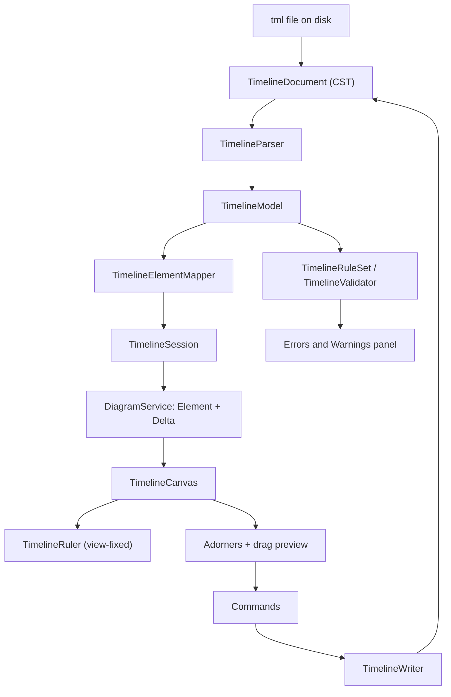

# Design Document

## Overview

The timeline module draws a `.tml` document as elements spanning **begin → end** along a horizontal time axis, each sitting on an integer **row**, with bezier connections between the mid-points of their left and right sides. It is a discovered `Diagram.Definitions` entry like every other type: core resolves each seam by `DiagramOrigin` and names nothing in this module.

Three decisions carry the design, and the rest follows from them:

1. **The module has its own coordinate space — seconds and rows — and it is not the canvas's.** x is *seconds since the Unix epoch*, y is *row × row height*. That space is independent of zoom, which is what lets the existing `MoveElementRequest.position` carry a drag without the backend ever learning what the user is looking at.
2. **The document is a concrete syntax tree**, spliced line by line, even though ADP owns the format — because a hand-authored file that reformats itself on save is a file nobody can review.
3. **Identity lives in the document**, because the schema is ours to define. This is the first authored-coordinate type that needs no identity sidecar, and it is worth noticing why.

Requirement 14's claim — that this type needs **no core change** — is tested by the design and holds. One finding is reported rather than acted on: four modules now carry near-identical line-splice machinery, and the reviewer's rule that generic code belongs in the shared projects points squarely at it.

## Steering Document Alignment

### Technical Standards (tech.md)

* **Diagram storage** — an established text *serialization* (YAML) under an extension ADP owns (`.tml`). No other tool's file is annotated, and nothing of ADP's is smuggled into anybody else's format.
* **Specifying a diagram type** — the four mandatory aspects map to Requirements 1–2 (file format), 4–8 (visualization), 9 (toolbox) and 11 (context actions and commands).
* **Commands** — every edit is an `ICommand` with an inverse, dispatched through the project's `IHistoryStack`. A drag and a resize each produce exactly one entry.
* **Toolbox** — described by the backend as data through `DescribeToolbox`; the client renders a palette it does not interpret.
* **No nested types** — records live one-per-file in the module's `_Model/` folder at namespace level.
* **Logging** — `private static readonly ILogger _logger = Log.ForContext<T>();` in any class that logs.

### Project Structure (structure.md)

The module follows the established three-folder layout, and adds nothing outside it:

| Folder | Contents |
| --- | --- |
| `src/diagrams/timeline/api/` | `timeline.proto` — the payload types carried in `Element.payload` |
| `src/diagrams/timeline/backend/EtAlii.Adp.Diagram.Timeline/` | parser, writer, scale, mapper, session, providers, commands |
| `src/diagrams/timeline/backend/EtAlii.Adp.Diagram.Timeline.Tests/` | the test project (xUnit v3, `OutputType` `Exe`) |
| `src/diagrams/timeline/client/` | canvas, ruler, adorners, model decoder, stream hook, registration |

Dependency direction is one-way: the module references core; core references nothing of the module. Registration is one `ServiceCollection.AddTimeline.cs` extension method and one line in `Program.cs`.

## Code Reuse Analysis

The reviewer's rule for this spec is that reused code is generic code, and generic code lives in the shared projects. Everything below is consumed from where it already lives; nothing is copied out of another diagram module.

### Existing Components to Leverage

- **`DiagramFileRouter` (`EtAlii.Adp.Backend/Hierarchy/`)**: routes a bare `.tml` body on sight, because the extension is distinctive. No `SharedExtension`, no Add-on-a-file path, no registration step.
- **`DiagramDefinition` / `DiagramOrigin` (`EtAlii.Adp.Diagram/_Model/`)**: the type declaration and the key every seam resolves by.
- **`MoveElementRequest.position` + `IDiagramSession.MoveElementToAsync`**: the positional-move contract, consumed exactly as it stands. The default implementation refuses; this module overrides it and refuses `MoveElementAsync` instead, since a timeline element is never re-parented.
- **`sideAnchorOf` / `horizontalBezierPath` (`src/client/src/canvas/connectors.ts`)**: the anchors and the curve, unchanged. This module contributes no connector geometry — Requirement 8.3 is satisfied by importing two functions.
- **`IContextActionProvider` / `IContextPropertyProvider` / `IDiagramToolboxProvider` / `IContextSourceResolver`**: the four context seams, implemented per this type.
- **`IDiagramValidator` + `DiagramValidationRequest`**: diagnostics reach the Errors and Warnings panel through the one seam every type uses.
- **`ICommand` / `ICommandHandler<T>` / `IHistoryStack` / `IHistoryStackStore`**: undo and redo, with handlers written to be re-runnable because undo and redo re-dispatch them.

### Integration Points

- **`DiagramService.Open` / `UpdateView`**: opening streams a baseline of `Element`s and `Delta`s; nothing about the viewport is sent back.
- **`ContextService`**: selection, actions and properties travel the existing chain. `ContextSelectionResolver` hands an element id to whichever resolver *accepts* it, so a third authored-coordinate type joins without contention.
- **The Errors and Warnings panel**: `DiagramProblem` with a `DiagramProblemLineLocation`, so a diagnostic points at the line that caused it.

## Architecture



### The module's coordinate space: seconds and rows

This is the decision the rest of the design leans on, and the one most worth arguing with.

Requirement 6.7 says a drag SHALL be dispatched through `MoveElementRequest.position`, which carries a `Point2D` of two doubles. Requirement 5 says zoom and pan are a client-side transform that never reaches the backend. Those two together forbid sending *pixels*: a pixel means nothing without the scale that produced it, and the backend does not have the scale.

So the module defines its own coordinate space, and `position` carries a point in **that** space:

| Axis | Unit | Conversion |
| --- | --- | --- |
| x | seconds since 1970-01-01T00:00:00, as a double | `TimelineScale.ToSeconds(DateTimeOffset)` / `ToTime(double)` |
| y | row index × `TimelineRows.Height` | `TimelineRows.ToY(int)` / `ToNearestRow(double)` |

The client's zoom is then a pure view transform layered on top — seconds to pixels — and it stays in the canvas component. The backend converts a received point straight back into a begin, an end and a row, and never learns what magnification the user is at.

Why seconds as a double rather than an integer tick count or an ISO string:

* **It fits the field that already exists.** `Point2D` is two doubles; no proto change, no new message.
* **Precision is not close to a problem.** Epoch seconds are about 1.8 billion; a double's 53-bit mantissa leaves sub-microsecond resolution, against a format whose finest unit is a second.
* **It is honest about what a drag knows.** A drag produces a position, not a date; turning it into a date is the mapper's job and happens in one place.

**The single most error-prone thing in the module is this conversion**, exactly as the axis flip is in `wardley-map`. It therefore lives in `TimelineScale` and `TimelineRows` as two function pairs with round-trip property tests, and **nothing else — not the parser, not a command, not the canvas — is permitted to convert**. A date-only value converts to midnight and converts back to a date-only value, which is what keeps Requirement 3.2 from being violated by a drag.

### Flow: dragging an element

1. Pointer down on an element; the canvas records the grab offset and enters a drag.
2. On each pointer move the canvas computes a **preview placement** — a candidate begin, end and row — and draws the element there. It also recomputes that element's connector paths from the preview box, so the curves move with it (Requirements 6.5, 8.6). Nothing is dispatched and nothing touches the backend.
3. The row under the pointer is resolved through `ToNearestRow`, so the preview snaps as the pointer crosses the midpoint between two rows and the user sees where it will land before releasing (Requirement 6.2).
4. On release the canvas calls `MoveElement` with `position` set to the placement in the module's coordinate space.
5. `TimelineSession.MoveElementToAsync` converts back, and dispatches **one** `SetTimelinePlacementCommand` carrying the new begin, end and row, whose inverse carries the old three (Requirement 6.4).
6. `Escape`, or a release outside the canvas, abandons the drag: the preview is dropped and nothing is dispatched (Requirement 6.6).

A horizontal drag shifts begin and end by the same delta, so the duration is preserved by construction — the command receives both values already shifted, and there is no arithmetic left to get wrong.

### Flow: resizing an edge

An adorner drag is the same loop with one endpoint pinned. The left adorner recomputes begin only, the right end only, and each is clamped so it stops at the other rather than crossing it (Requirement 7.4). The clamp lives in the canvas *and* in the command handler: the canvas clamp is what the user feels, the handler clamp is what makes the guarantee true regardless of which client sent the request.

That duplication is deliberate and is the answer to Requirement 3.4's claim that the invalid state is reachable only by hand-editing the file. A guard in the canvas alone would be a guard a second client could walk around.

### Why the document is a CST, even though ADP owns the format

`c4-diagrams`, `wardley-map` and `azure-pipeline-diagram` each keep the file as read and splice single lines, because each reads a format somebody else owns. This type owns its format, so the obvious alternative is a model-and-regenerate loop: parse to a model, serialise the model back.

The design rejects that, and the reason is not fidelity to another ecosystem:

* **A `.tml` is hand-authored.** Requirements 2.1 and 2.2 promise that opening a file changes nothing and that an edit touches only the lines it affects. A regenerator cannot keep either promise: it normalises quoting, key order, indentation and blank lines on the first save, and the diff swamps the change.
* **Comments are the author's, not ours.** A regenerated document loses them, and no schema decision can give them back.
* **Requirement 2.3's forward compatibility is free with a CST and expensive without one.** Unmodelled keys survive because they are simply lines nobody rewrote. A regenerator has to model everything in order to preserve anything.

So `TimelineDocument` holds the lines as read plus an index from element id to the line range that declares it, and an edit is a splice. The round-trip guarantee is structural rather than earned by care.

### Identity lives in the document, so there is no sidecar

`wardley-map` needs `WardleyIdentities` because the `.owm` format has no identifier and names change under it. `c4-diagrams` needs a layout sidecar for the same class of reason. Both accept a real cost: a key that is a heuristic, and an element that comes back as a new element when the heuristic misses.

This type pays none of it. Requirement 3.1 puts a stable `id` on every element and Requirement 3.8 on every connection, and because the schema is ADP's own, that is simply a key in the file. A rename rewrites the label line and nothing else; the id, the selection, the history entries and the pushed element ids are untouched.

**This is the clearest benefit of defining a format rather than adopting one**, and it is worth recording as such: the cost of Requirement 1.4's decision is that ADP invented a schema, and this is what was bought with it.

### The ruler is client-only, and the zoom never reaches the backend

`TimelineRuler` is a component inside `TimelineCanvas`, drawn from the viewport that component already has. It needs no core change, because view-fixed chrome is a rendering concern and core renders nothing.

Its one piece of real logic is choosing a label interval for the visible range (Requirement 5.4). That is a pure function — visible span in, a unit and a step out — over a fixed ladder (second, minute, 5/15/30 minutes, hour, day, week, month, quarter, year), picking the finest step whose labels still fit the available width. Labels are then placed on round boundaries of the chosen step, not at offsets from the viewport edge (Requirement 5.5), which is why panning slides labels rather than renumbering them.

Being a pure function is what makes Requirement 5.4 — the one the requirements themselves flag as most likely to be got wrong — testable without a browser.

### One placement command for both gestures

A drag changes begin, end and row. A left resize changes begin. A right resize changes end. A grid edit changes any one of them.

These are one command, `SetTimelinePlacementCommand(ElementId, Begin, End, Row)`, whose inverse is the same command carrying the previous values. The alternative — five commands differing only in which field they carry — multiplies the handler, the inverse and the tests by five to express nothing.

The cost is that the history entry cannot say "resized" versus "moved" from the command's type alone, so the command carries a short description the module sets at dispatch, and the history shows that. This is stated because it is a judgement a reviewer may make the other way; if distinct entries matter more than a single handler, the split is mechanical.

### The toolbox drop carries its position

Requirement 9.3 asks that a dropped element take its begin from the drop's time and its row from the drop's y. `wardley-map`'s design met the same requirement with a compromise — create at the viewport centre, let the user drag — because it read the action seam as carrying no parameters.

That is not the case on the commit leg: `IContextActionProvider.CommitAsync(target, actionId, value, text, cancellationToken)` carries both a `value` and a `text`. The drop therefore encodes its placement in `value` as seconds and row, the provider parses it, and the element is created where it was dropped, in one undoable command (Requirement 9.5).

The one thing to verify during implementation is that the client's drop handler populates `value` rather than sending an empty string. If it does not, that is a change in this module's own canvas, not in core — and it is worth reporting back to `wardley-map`, whose compromise may no longer be necessary.

### Finding: four modules now hold the same CST machinery

Reported rather than acted on, because Requirement 14 says this spec changes nothing in core and that a needed change is a finding.

`C4Document`, `WardleyDocument`, `PipelineDocument` and now `TimelineDocument` each hold "the file as read, as a list of lines, with a dominant line ending, spliceable by range". `PipelineDocument` learned two corrections the hard way — appending to a file with no trailing newline, and removing the last line — that the others have not necessarily learned.

Against the reviewer's rule that generic code belongs in a shared project, this is the strongest candidate in the tree. The recommendation is a `TextDocument` in `EtAlii.Adp.Diagram`, holding lines, endings and splices, with each module's document composing it and keeping its own index. That is a refactor of four modules, so it belongs in its own spec rather than being smuggled into this one; **this design proceeds with a module-local `TimelineDocument` and records the finding.**

### Modular Design Principles

* **Single file responsibility**: document, parser, writer, scale, rows, mapper, rule set — seven components, each testable from a string or two numbers.
* **Component isolation**: nothing in the parse/scale/rules layer needs gRPC, a filesystem or a browser.
* **No diagram-type knowledge in core**: core sees an `Element`, a `Delta` and a `Point2D`, and learns nothing about time or rows.

## Components and Interfaces

### `TimelineDocument` (module, new, `_Model`)
- **Purpose:** the file as read — lines, dominant ending, and splice operations by range.
- **Interfaces:** `Parse(string)`, `Insert(index, lines)`, `Remove(range)`, `Replace(range, lines)`, `ToString()`.
- **Reuses:** nothing; see the finding above.

### `TimelineParser` (module, new)
- **Purpose:** YAML in, `TimelineModel` out, with a line range recorded for every element and connection.
- **Interfaces:** `Parse(TimelineDocument)` returning a `TimelineModel`.
- **Dependencies:** YamlDotNet, **for reading only** — every write goes through `TimelineWriter`.
- **Notes:** node marks give the line number a diagnostic points at.

### `TimelineWriter` (module, new)
- **Purpose:** turn an edit into a splice of the lines it affects, and nothing else.
- **Interfaces:** `SetLabel`, `SetBegin`, `SetEnd`, `SetRow`, `InsertElement`, `RemoveElement`, `InsertConnection`, `RemoveConnection`, `SetConnectionLabel`.
- **Notes:** removing an element removes its connections in the same splice, so Requirement 2.5's count is known before the write.

### `TimelineScale` (module, new, static)
- **Purpose:** the only conversion between a time and an x. Pure.
- **Interfaces:** `ToSeconds(DateTimeOffset)`, `ToTime(double, TimelinePrecision)`.
- **Notes:** carries the precision so a date-only value round-trips as date-only (Requirement 3.2).

### `TimelineRows` (module, new, static)
- **Purpose:** the only conversion between a row and a y, and the nearest-row inverse. Pure.
- **Interfaces:** `ToY(int)`, `ToNearestRow(double)`, `Height`.

### `TimelineElementMapper` (module, new)
- **Purpose:** `TimelineModel` to core `Element`s and `Delta`s, and a received `Point2D` back to a placement.
- **Reuses:** `TimelineScale`, `TimelineRows` — and does no arithmetic of its own.

### `TimelineRuleSet` / `TimelineValidator` (module, new)
- **Purpose:** the rules of Requirement 12, as a pure function over a model; the validator is the join to the seam.
- **Interfaces:** `TimelineRuleSet.Judge(TimelineModel)`; `TimelineValidator.ValidateAsync(DiagramValidationRequest, CancellationToken)`.
- **Rules:** end before begin; a begin or end that will not parse; a connection naming an absent element; a mixed date/date-time pair; a duplicate id.

### `TimelineDocumentStore` / `ITimelineDocumentStore` (module, new)
- **Purpose:** one parsed document per path, invalidated on file change.
- **Interfaces:** `GetOrLoad(rootPath, bodyPath)`, `Forget(path)`, `Write(...)`.

### `TimelineSession` / `TimelineSessionFactory` (module, new)
- **Purpose:** the open diagram — baseline, deltas on change, and the two move legs.
- **Interfaces:** `MoveElementToAsync` (implemented), `MoveElementAsync` (refuses: a timeline element has no parent to move it under).

### `TimelineContextSourceResolver`, `TimelineContextActionProvider`, `TimelineContextPropertyProvider`, `TimelineToolboxProvider` (module, new)
- **Purpose:** selection, actions, properties and the palette, per Requirements 9–11.
- **Properties contributed:** Label, Begin, End, Row for an element; Label for a connection, with source and target read-only and a reason.
- **Toolbox:** *Period* and *Moment*, each naming the add action it drops into.

### `Commands/` (module, new)

`AddTimelineElementCommand`, `RemoveTimelineElementCommand`, `RenameTimelineElementCommand`, `SetTimelinePlacementCommand`, `ConnectTimelineElementsCommand`, `DisconnectTimelineElementsCommand`, `RelabelTimelineConnectionCommand` — each a record with a handler, each handler re-runnable because undo and redo re-dispatch it.

### Client (module, new)

`TimelineCanvas.tsx` (layout, drag, adorners, drag preview), `TimelineRuler.tsx` (view-fixed chrome and the label ladder), `timelineModel.ts` (payload decode — after the type check, never before), `useTimelineStream.ts`, `register.ts`, `timeline.css`.

## Data Models

### The `.tml` document

```yaml
timeline: 1
elements:
  - id: k7Qv2mXa
    label: Discovery
    begin: 2026-01-05
    end: 2026-02-13
    row: 0
  - id: b3Rt9wYz
    label: Go/no-go
    begin: 2026-02-16T14:00:00
    row: 1
connections:
  - id: c1Ld4pQn
    from: k7Qv2mXa
    to: b3Rt9wYz
    label: gates
```

`timeline: 1` is the schema marker Requirement 1.3 asks a new document to carry. An element with no `end` is a moment. Any other key, at any level, is preserved verbatim (Requirement 2.3).

### `timeline.proto` (module)

```proto
message TimelineElementPayload {
  string begin = 1;          // ISO 8601, as written in the document
  string end = 2;            // empty for a moment
  int32 row = 3;
  bool date_only = 4;        // so the client formats what the author wrote
}

message TimelineConnectionPayload {
  string from_element_id = 1;
  string to_element_id = 2;
  string label = 3;
}
```

### Backend records (`_Model`)

`TimelineModel(IReadOnlyList<TimelineElement> Elements, IReadOnlyList<TimelineConnection> Connections)`, `TimelineElement(string Id, string Label, TimelineInstant Begin, TimelineInstant? End, int Row, LineRange Range)`, `TimelineConnection(string Id, string From, string To, string Label, LineRange Range)`, `TimelineInstant(DateTimeOffset Value, TimelinePrecision Precision)`.

## Error Handling

### Error Scenarios

1. **The `.adp` names a body that is not there.**
   - **Handling:** open in the unavailable state, naming the path looked for.
   - **User Impact:** a tab that explains itself; no crash, no empty canvas.

2. **The document is not well-formed YAML, or fails the schema.**
   - **Handling:** unavailable state with the parser's message and line; the file is **not** rewritten while unparseable.
   - **User Impact:** the same message in the tab and in the problems panel, so the two never disagree.

3. **An element has end before begin, or a time that will not parse.**
   - **Handling:** a warning naming the element; the rest of the diagram still draws.
   - **User Impact:** the diagram is usable and the panel says which element to fix.

4. **A gesture or a grid edit would invert an element.**
   - **Handling:** refused at the boundary, in the canvas and again in the handler.
   - **User Impact:** the edge stops; the grid rejects with a reason.

5. **A connection gesture ends on nothing, on its own source, or off-canvas.**
   - **Handling:** cancelled with a reason; the document is untouched.
   - **User Impact:** no connection to nowhere, and an explanation.

## Testing Strategy

### Unit Testing

- **Round trip**: a corpus of documents — CRLF and LF, comments, blank lines, unmodelled keys, no trailing newline — each read and written back byte-identically, and each edited to prove only the affected lines changed.
- **Scale and rows**: round-trip property tests over both pairs; date-only values must come back date-only; `ToNearestRow` tested **at the midpoint between two rows**, where an off-by-one is the mistake to expect.
- **The ruler's ladder**: a pure function over span and width, asserted to stay legible across the whole zoom range rather than at one sample.
- **Rules**: one test per rule, each from a plain YAML string with no file and no canvas, plus one proving a healthy document produces nothing.
- **Commands**: each command applied and inverted, with the file byte-identical afterwards.

### Integration Testing

- Open a `.tml` with no `.adp` and confirm it routes on sight.
- Drag: `MoveElement` with a position, one history entry, the file changed only on the lines that moved, one undo restoring it.
- Resize at the boundary: refused, with the document untouched.
- A grid edit that would invert: refused with a reason — the second of the two paths Requirement 3.4 closes.
- Delete an element with connections: the count is reported before the write, and all of it is one undo.

### End-to-End Testing

- A drop from the toolbox lands at the dropped time and row, not at the viewport centre.
- Connections redraw during a drag, not only on release.
- The ruler stays at the bottom of the view while the diagram scrolls beneath it, and its labels slide with the content.

Anything only reproducible through a running app goes to `tests.md` as a step-by-step check, per the repository's rule on bugs found during implementation or verification.

## Deviations and notes

* **No core change is proposed.** Requirement 14's claim was tested against every seam and holds; the coordinate-space decision is what makes it hold, by keeping the zoom out of the backend.
* **One finding is reported**: four modules now carry the same CST machinery, and lifting it into `EtAlii.Adp.Diagram` is the shared-project move the reviewer's rule points at. It is a four-module refactor and belongs in its own spec.
* **One observation for `wardley-map`**: its toolbox-drop compromise was chosen on the belief that the action seam carries no parameters. The commit leg carries a `value`, so that compromise may be liftable.
* **One judgement flagged for a reviewer**: the single placement command. If the history must distinguish a move from a resize by type rather than by description, splitting it is mechanical.
