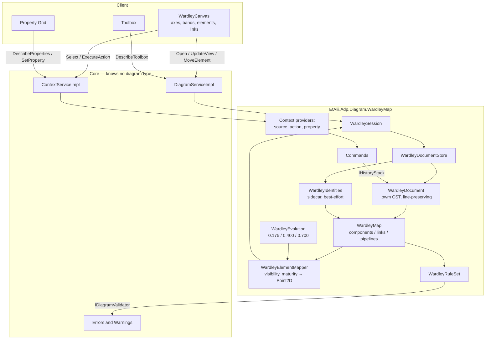
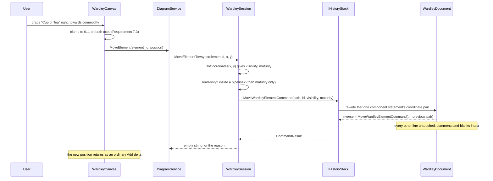

# Design Document

## Overview

The module lives at `diagrams/wardley-map/`, registers through the eight seams Requirement 12.3 names, and is closest in shape to C4: a text document ADP did not invent, a sidecar for what that document has no place for, and a validator with something to say. It differs from every shipped type in one way that removes a component rather than adding one:

**There is no layout.** The mindmap computes positions and never writes them; C4 computes them and writes the overrides; this module computes nothing. A component's coordinates come from the file and go back to the file. `WardleyLayout` does not exist, and its absence is the design — every other module's largest and least testable component is simply not here.

Six pieces do the work:

1. **`WardleyDocument`** — an `.owm` concrete syntax tree. Holds every line as read and rewrites the lines an edit touches (Requirement 3.1–3.3).
2. **`WardleyMap`** — components, links, pipelines and annotations in the DSL's own vocabulary (Requirements 5, 6).
3. **`WardleyIdentities`** — the sidecar that gives elements an identity the format does not provide (Requirement 4).
4. **`WardleyEvolution`** — the four stages and their three boundaries, in one place (Requirement 8.2).
5. **`WardleyElementMapper`** — model to core `Element`/`Delta`, including the axis flip (Requirement 10.2).
6. **`WardleyRuleSet`** — a pure function from model to `DiagramProblem`s (Requirement 14).

Around them sit the registrations, each one line in `AddWardleyMap`: a document factory, a session factory, a context source resolver, an action provider, a toolbox provider, a property provider, a validator, and the command handlers.

> ### One finding, reported and now resolved
>
> **Requirement 12.4 says this spec anticipates no core change. Designing Requirement 7.2 against the real contract showed that it does — and that the gap was not this type's.**
>
> A drag must reach the backend carrying coordinates. The only leg that carries a drag was `DiagramService.MoveElement`, whose request is `element_id` + `new_parent_id` + `index` — a re-parenting shape with no field for a position.
>
> C4 had already needed this and solved it by **encoding the coordinates into `new_parent_id` as `"x,y"` and splitting on the comma** (`C4Session.MoveElementAsync`, which also discarded `index` with `_ = index;`). It worked, but `diagrams.proto` documents that field as "the element it lands under", so its stated meaning and its use had parted company.
>
> For C4 that was a wart on a secondary interaction. For this type, dragging **is** the interaction — position is the map's meaning — so the finding was raised per Requirement 12.5 rather than worked around.
>
> **It was accepted and is being implemented in a parallel session**, and this design consumes it rather than proposing it. The shape that is landing is in [Core change: a positional move](#core-change-a-positional-move) below. It **removes** a special case rather than adding one: C4 drops its comma-splitting, and each gesture gets a method that refuses the other honestly. One consequence found during that work is worth recording — because the single field carried two meanings, a genuine re-parenting attempt used to come back reported as a malformed coordinate pair.
>
> The gap has a second, smaller instance this design does **not** ask to fix: a toolbox drop at a position (Requirement 13.4) goes through `ContextService.ExecuteAction`, whose request carries an action id and no parameters at all.

## Steering Document Alignment

### Technical Standards (tech.md)

* **Specifying a diagram type** — the four mandated aspects: file format (`WardleyDocument`, `WardleyIdentities`), visualization (`WardleyCanvas`, `WardleyEvolution`), toolbox (`WardleyToolboxProvider`), context actions and commands (`WardleyContextActionProvider`, `Commands/`).
* **Commands** — every document change is an `ICommand` with an inverse through `IHistoryStack`. Nothing writes `.owm` outside a command handler.
* **Context** — selectability is one `IContextSourceResolver`; what can be done is one `IContextActionProvider`; what is shown is one `IContextPropertyProvider`. No bespoke RPC.
* **gRPC call shapes** — the module adds no service. It rides `DiagramService.Open` + `UpdateView` and `ContextService`'s unary calls.
* **Diagram storage** — an established text format, with ADP's own data in a sidecar rather than smuggled into it.
* **Implementation order** — model → persistence → wire → UI → logic.
* **No nested types**; `_Model` for POCOs; one entity per file (command + handler excepted); Serilog through a `private static readonly ILogger` per class.

### Project Structure (structure.md)

```
src/diagrams/wardley-map/
├── api/                  wardley-map.proto  (the element payloads)
├── backend/
│   ├── EtAlii.Adp.Diagram.WardleyMap/
│   │   ├── Commands/     one file per command + handler pair
│   │   ├── _Model/       WardleyComponent, WardleyLink, WardleyPipeline, WardleyStatement, ...
│   │   └── *.cs          document, identities, parser, mapper, rules, session, providers
│   └── EtAlii.Adp.Diagram.WardleyMap.Tests/
│       └── Fixtures/     real .owm maps, for the round-trip corpus
└── client/               WardleyCanvas.tsx, wardleyModel.ts, useWardleyStream.ts, register.ts, wardley.css
```

The module references `EtAlii.Adp.Diagram` and `EtAlii.Adp.Backend`; neither references it. The scaffolding already has this tree — `Diagram.cs`, the two csproj files and the `api/` and `client/` readmes exist and are in `EtAlii.Adp.slnx`.

## Code Reuse Analysis

### Existing Components to Leverage

* **`IDiagramSessionFactory` / `IDiagramSession`** — the open/baseline/viewport/delta lifecycle, as `C4Session` implements it. This is the fourth implementation, not a new pattern.
* **`IDiagramDocumentFactory`** — writes the empty `.owm` for Add (Requirement 1.3). One line, resolved by origin.
* **`IContextSourceResolver`, `IContextActionProvider`, `IDiagramToolboxProvider`, `IDiagramValidator`** — four seams each already carrying two or three implementations.
* **`IContextPropertyProvider` + `ContextPropertyDefinition`** — merged with the property grid. `ReadOnlyReason` is what Requirement 15.5 needs, and `ContextPropertyResolver` refuses a write to a property its provider marked read-only, so the module's markings are enforced backend-side rather than being advisory.
* **`ICommandHandler` / `IHistoryStack` / `CommandResult.Inverse`** — undo comes free.
* **`DiagramProblem` / `DiagramProblemLineLocation` / `DiagramProblemElementLocation`** — Requirement 14.7 wants both location kinds and both exist.
* **`DiagramFileRouter` / `DiagramFilePair`** — `.owm` routing needs no new code: declaring `Extension = ".owm"` is the whole integration (Requirement 2.2), and `.owm` is distinctive, so `AmbiguousExtensions()` stays quiet.
* **`ShortGuid`** — the identity type, per tech.md's identity rule.
* **`C4Document`** — reused as **shape**, not as code: a line-indexed CST with `ReplaceLine` / `InsertLine` / `RemoveLines` / `ToText`, carrying `Newline` and `EndsWithNewline` so a round trip preserves both. `WardleyDocument` is the same discipline against a different grammar. This is the third instance and is deliberate.
* **`@client/canvas/connectors`** — evaluated rather than assumed, see [below](#connectors-what-fits-and-what-does-not).

### Integration Points

* **`Program.cs`** gains `builder.Services.AddWardleyMap();`.
* **`Diagram.cs`** gains `Extension: ".owm"` and a `DocumentExtension` constant, mirroring the mindmap's.
* **`docs/diagrams.md`** — the `wardley/map` row moves 📝 → 🛠️ → ✅ (already at 📝).
* **`diagrams.proto` / `IDiagramSession`** — one field and one method, accepted and landing in a parallel session; this module consumes them rather than adding them.

### Connectors: what fits, and what does not

`anchorsBetween` and `straightPath` were checked against this type rather than adopted because they exist.

* **Fits.** `anchorsBetween(source, destination)` takes two centre-positioned `ConnectorBox`es and returns the two edge points. A Wardley link joins two components, and a component is drawn as a small labelled dot — a box with a centre and a size. That the centres come from the *document* rather than from a layout changes nothing about the geometry: the function never asks where the numbers came from. `straightPath` is the right curve, since a Wardley link is a straight line by convention.
* **Also fits, unexpectedly.** An `evolve` movement indicator (Requirement 6.1) is a line from a component's current maturity to its target at the same visibility. That is two boxes and a straight path — the same call, styled dashed.
* **Does not fit.** `branchAnchorsBetween` and `horizontalBezierPath` are tree-shaped, for a parent and its child. A Wardley map has no tree; the pipeline containment in Requirement 5.4 is a bracket drawn under a parent, not a connector between two boxes. That is drawn by the module and reuses nothing.

So the module uses two of the four functions, and it is worth saying which two rather than saying "reuses connectors.ts".

## Architecture



Note what is missing between `MODEL` and `MAPPER`: every other diagram module has a layout box there.

The loop worth reading twice: a command edits `WardleyDocument` (lines), the map is re-derived, the mapper emits deltas. **The document is the single writer.** The sidecar is written on the same save, but nothing reads it to decide what a map *is* — only to decide what its elements are *called* internally.

### Flow: dragging a component



The user has asserted that a component is more evolved than they previously thought. That is a claim about the world, it is now in the file, it is in the git history, and it is one undo away.

### Core change: a positional move

This is landing in a parallel session rather than being proposed here. The shape this design is written against:

```proto
message MoveElementRequest {
  // ... existing fields 1-6 unchanged ...
  Point2D position = 7;   // where it lands, for a type whose positions are authored;
                          // unset means this is a re-parenting move (fields 5 and 6)
}
```

and on `IDiagramSession`, alongside the existing `MoveElementAsync`:

```csharp
Task<string> MoveElementToAsync(string elementId, double x, double y, CancellationToken cancellationToken);
```

with a **default implementation that refuses** — "This diagram cannot be arranged by dragging" — so a type that has thought about neither gesture says so rather than appearing to support both. `DiagramServiceImpl` routes on which gesture arrived: a position means "put it here", its absence means "put it under that".

Why this shape:

* **Backward compatible.** A new proto field, and `Point2D` already exists in `connection.proto` (`elements.proto` uses it), so this is the existing vocabulary rather than a new type. Existing clients and modules are untouched.
* **Type-agnostic.** Nothing in it names Wardley. Its two beneficiaries are this type and C4; `azure-pipeline-diagram` explicitly does **not** want it (its Requirement 7.4 forbids writing positions to the file), and the mindmap computes its layout, so neither is affected.
* **It removes a special case.** `C4Session` deletes its `newParentId.Split(',')` and its `_ = index;` and implements both methods, each refusing the other's gesture for its own reason.
* **It is small.** One field, one method, one implementation per module that wants it.

**What this module implements.** `WardleySession.MoveElementToAsync` converts the incoming canvas point back through `WardleyElementMapper.ToCoordinates`, clamps to `0..1` (Requirement 7.3), narrows to maturity alone for a pipeline child (Requirement 7.4), and dispatches `MoveWardleyElementCommand`. `WardleySession.MoveElementAsync` refuses, except for a pipeline child, where re-parenting is meaningful.

The toolbox-drop instance (Requirement 13.4) has no equally small fix, because `ExecuteActionRequest` carries no parameters at all and widening it touches every action. **This design therefore does not ask for it.** A dropped element is created at the centre of the visible viewport and immediately selected, so the user's next gesture — a drag — puts it where they meant. Requirement 13.4 asks the drop position not be discarded in favour of a *computed* one; a viewport-centre placement the user then adjusts is honest about knowing nothing, which a computed layout would not be.

### Why the document is a CST and not a model

An `.owm` file is hand-written, small, and read by four other tools. A model-and-regenerate loop discards statement order, blank lines, comment placement, indentation and the choice between the nested and legacy pipeline forms — all of which the file preserves and none of which ADP has any business changing.

`WardleyDocument` therefore holds the file as read, plus an index from element identity to the line that declares it. An edit is a rewrite of one line. Anything the module does not model is never rewritten, which satisfies Requirement 3.3 **by construction rather than by effort** — the forward-compatibility promise costs nothing to keep because unrecognised lines are simply lines.

This is the same decision `C4Document` implements and `azure-pipeline-diagram` adopts; the third instance is deliberate rather than accidental.

### Why identity lives in a sidecar, and what it is keyed by

The `.owm` format has no identifier of any kind (Requirement 4.1). The only stable handle a statement offers is its **name**, and names change.

`WardleyIdentities` is a `<name>.identities.json` beside the `.owm`, following `C4LayoutSidecar`'s precedent and its rule — an optimisation, never a dependency. It holds entries of `{ id, kind, key }`:

| Element | Key | Survives |
|---|---|---|
| Component, anchor, submap | its name | a move, an `evolve`, a decorator change |
| Link | source name + target name + kind | a move of either endpoint |
| Pipeline | its parent component's name | a child being added or removed |
| Note | its text | a move |
| Annotation | its number | a position being added |

A **rename** is where this earns its keep: the command rewrites the component statement, every statement referring to it by name, *and* the sidecar entry's key — one command, one inverse (Requirements 4.4, 9.6). Identity is unchanged throughout, so the selection, the undo entries and the pushed element ids all survive.

On load, entries are matched by key; a file element with no match gets a fresh `ShortGuid`, a sidecar entry with no match is discarded, and nothing fails (Requirement 4.5). A map opened and not edited writes nothing at all — assigned ids are held in memory and persisted on the first real save (Requirement 4.3).

The honest limit: a note's text is a poor key, so editing a note's text outside ADP loses its identity and it comes back as a new element. The alternative — writing an ADP id into the `.owm` as a comment — is forbidden by tech.md and by Requirement 3.7, and rightly: a fragile internal id is a smaller cost than annotating another ecosystem's file.

### The axis flip lives in exactly one place

The DSL writes `[visibility, maturity]`. Core's `Point2D` is `(x, y)`. Visibility is the **vertical** axis and maturity the **horizontal** one, so the mapping is `Point2D(x: maturity, y: 1 - visibility)` — a transposition *and* an inversion, since visibility runs from 1 at the top.

This is the single most error-prone line in the module. It lives in `WardleyElementMapper` as one function pair, `ToPoint` / `ToCoordinates`, with a round-trip property test. Nothing else in the module — not the parser, not a command, not the canvas — is permitted to do the conversion itself (Requirement 5.2).

### The evolution constants are sent as data, not compiled into both sides

`WardleyEvolution` pins `0.175`, `0.400` and `0.700` with the derivation from the reference renderer's `EvoOffsets` in a comment and a test (Requirement 8.2). The backend needs them for the property grid's stage row (Requirement 15.2); the client needs them to draw the bands (Requirement 8.2).

Rather than compile the same three numbers into a C# file and a TypeScript file, the baseline carries **one map-level element** of type `wardley/map+evolution-axis`, whose payload is the four stages with their boundaries and labels. The client draws the bands it is told about and holds no constants.

* **For it:** one source of truth, no drift, and it matches how the toolbox and the property grid already work — the backend describes, the client renders what it does not understand.
* **Against it:** one more element kind, for data that is unlikely ever to change.

The recommendation is to send it. The cost is about ten lines of proto and mapper; the alternative is a number that is right in two places until someone edits one of them. This is flagged rather than assumed because it is a judgement call a reviewer may reasonably make the other way, in which case the two copies must be pinned by a shared test fixture.

### Modular Design Principles

* **Single file responsibility**: parsing, identity, mapping, evolution staging and validation are five components, each testable from a string.
* **Component isolation**: the parser/writer needs no gRPC, no filesystem and no browser; the rule set is a pure function.
* **No diagram-type knowledge in core**: the one proposed core change is a field and a method, neither naming this type.

## Components and Interfaces

### `WardleyDocument` (module, new, `_Model`)

* **Purpose:** the `.owm` file as read, and surgical rewrites of it.
* **Interfaces:** `Parse(text)`, `ToText()`, `ReplaceLine(number, text)`, `InsertLine(number, text)`, `RemoveLines(from, to)`, `Newline`, `EndsWithNewline`, `Statements`.
* **Dependencies:** none. A string in, a string out.
* **Reuses:** `C4Document`'s shape and its line-numbering convention (1-based `uint`, matching `DiagramProblemLineLocation`).

### `WardleyParser` (module, new)

* **Purpose:** statements from lines — `component`, `anchor`, `submap`, `pipeline`, links, `evolve`, `inertia`, the five decorators, areas, `accelerator`, `note`, `annotation`, `title`, `size`, `style`. Three statement kinds, not five: `market` and `ecosystem` are decorators on a component (Requirement 6.3), which the task 2 corpus established against the real parser.
* **Interfaces:** `Parse(WardleyDocument) -> WardleyMap`.
* **Dependencies:** `WardleyDocument`.
* **Reuses:** `C4Parser`'s token/scope approach; the grammar is simpler — `.owm` is line-oriented with one nested form (`pipeline { }`), so no scope stack beyond depth one.

### `WardleyIdentities` (module, new)

* **Purpose:** the `<name>.identities.json` sidecar; assign, match, persist, degrade.
* **Interfaces:** `Read(bodyPath)`, `Write(bodyPath, entries)`, `PathFor(bodyPath)`, `Reconcile(map, entries)`.
* **Dependencies:** the backend's file-access layer.
* **Reuses:** `C4LayoutSidecar` — same `PathFor` construction, same never-throw reads, same "an unreadable sidecar means we re-derive" posture.

### `WardleyEvolution` (module, new, static)

* **Purpose:** the four stages, the three boundaries, and `StageOf(maturity)`.
* **Interfaces:** `Stages`, `StageOf(double)`, `CustomBuilt`/`Product`/`Commodity` constants.
* **Dependencies:** none.
* **Reuses:** nothing. Pinned by a test citing `EvoOffsets`.

### `WardleyElementMapper` (module, new)

* **Purpose:** `WardleyMap` to core `Element`s and `DiagramDelta`s; the axis flip; the evolution-axis element.
* **Interfaces:** `Baseline(map)`, `Diff(previous, current)`, `ToPoint(visibility, maturity)`, `ToCoordinates(point)`.
* **Dependencies:** `WardleyEvolution`.
* **Reuses:** `C4ElementMapper`'s structure; core `Element`, `Point2D`, `DiagramAddDelta`, `DiagramRemoveDelta`, `DiagramGroupDelta`, `DiagramUngroupDelta`.

### `WardleyRuleSet` / `WardleyValidator` (module, new)

* **Purpose:** the rules of Requirement 14, as a pure function; the `IDiagramValidator` that carries them to the panel.
* **Interfaces:** `Problems(WardleyMap) -> IReadOnlyList<DiagramProblem>`; `ValidateAsync(document, baseName, ct)`.
* **Dependencies:** `WardleyParser`.
* **Reuses:** `C4RuleSet` / `C4Validator` — the same split between a pure rule set and the thin seam implementation, so the rules are testable from a string.

### `WardleyDocumentStore` / `IWardleyDocumentStore` (module, new)

* **Purpose:** one loaded document per path, shared by every connection viewing it; the watcher reload of Requirement 10.7.
* **Interfaces:** `GetAsync(rootPath, bodyPath, ct)`, `Changed` event.
* **Reuses:** `C4DocumentStore` / `IC4DocumentStore`, registered with `TryAddSingleton` for the same reason: several sessions must share the instance that holds the document.

### `WardleySession` / `WardleySessionFactory` (module, new)

* **Purpose:** the per-connection view; baseline, viewport, deltas, moves.
* **Interfaces:** `Baseline()`, `UpdateView(viewport)`, `MoveElementAsync(...)`, `MoveElementToAsync(...)`, `Changed`.
* **Dependencies:** `IWardleyDocumentStore`, `WardleyElementMapper`, `IHistoryStackStore`.
* **Reuses:** `C4Session` / `C4SessionFactory`. `UpdateView` returns the whole map unfiltered (Requirement 10.5) — the shortest correct implementation of that method in the repository, and deliberately so.

### `WardleyContextSourceResolver`, `WardleyContextActionProvider`, `WardleyContextPropertyProvider`, `WardleyToolboxProvider` (module, new)

* **Purpose:** selectability, verbs, values and palette.
* **Reuses:** the C4 quartet, one for one. The property provider follows `C4ContextPropertyProvider`'s layout exactly — `public const string` ids prefixed `wardley.`, a `Describe` per element kind, `SetAsync` dispatching the same command the canvas uses (Requirement 15.7).

#### Read-only reasons: the house form, and why it is not a tooltip

The repository already has a form for these, in `MindmapContextPropertyProvider`'s two read-only rows: **cause, then remedy** — descriptive for the cause ("X is Y, so it is not Z"), imperative for the remedy, full sentences, no leading "This property is". The second row earns a second sentence by having somewhere to send the reader; the first stops because it has nowhere. This module follows it. Where the mindmap's cause slot names another tool and `ansible-structure-diagram`'s names a file, this type's values are **derived**, so the cause slot names the value they are derived from and the remedy points at it:

* Evolution stage — *"The evolution stage is derived from the component's maturity, so it is not set directly. Change Maturity instead."*
* Pipeline child visibility — *"A pipeline child takes its visibility from its parent, so it is not its own. Change it on `<parent name>`."*

Three properties of the mechanism decide how these are written, each verified against the code rather than assumed:

* **The reason is user-facing error text, not a hint.** `ContextPropertyResolver` refuses a write to a non-editable property with `ContextPropertyResult.Failure(match.ReadOnlyReason)` — the reason travels back verbatim as the failure the user reads. It is shown *and* thrown, so it must read as both.
* **A blank reason silently means editable.** Both `ContextPropertyDefinition.IsEditable` and the client's `PropertyRow` test `readOnlyReason.length === 0` — a length test, not a whitespace test. A reason of `" "` would render the row editable *and* let the write through. This is a test, not a comment (see Testing Strategy).
* **A long reason grows the row.** `.property-grid-readonly-reason` is a `display: block` span with no truncation and no ellipsis, so a reason wraps rather than clipping. Two sentences is the budget; a paragraph would look like one.

On **read-only mode** (Requirement 15.11): every property still carries a reason, because that is what makes the server-side refusal meaningful — a mode communicated only in the panel would leave a non-grid caller able to write. But every row then carries near-identical text, so the reason is kept short and uniform, and **de-duplicating identical reasons for display is the panel's judgement, not this provider's**. The provider's job is that each refusal can explain itself.

`SafelyDescribeAsync` in `ContextPropertyResolver` means a provider that throws in `DescribeAsync` costs only its own rows rather than blanking the panel, so this provider is written for its own correctness and not defensively on other providers' behalf.

### `Commands/` (module, new)

One file per command-and-handler pair, per tech.md's exception to one-entity-per-file. Covering Requirement 9.3:

| Command | Inverse restores |
|---|---|
| `AddWardleyElementCommand` | removal of the added element |
| `RemoveWardleyElementCommand` | the element and every statement that referenced it |
| `MoveWardleyElementCommand` | the previous coordinate pair |
| `RenameWardleyElementCommand` | the previous name, in every statement it appeared in |
| `SetWardleyLinkCommand` | the previous link, or its absence |
| `SetWardleyEvolveCommand` | the previous `evolve`, or its absence |
| `SetWardleyInertiaCommand` | the previous `inertia` state |
| `SetWardleyDecoratorCommand` | the previous build/buy/outsource, or none |
| `SetWardleyPipelineMembershipCommand` | the previous membership |

### Client (module, new)

* **`WardleyCanvas.tsx`** — one `<svg>`, owning its `viewBox`, pan and zoom. Draw order: bands, axes and labels first, then links and `evolve` indicators, then elements, then problem markers. This is Requirement 8.4 in three words — *the module draws first* — and needs nothing from core.
* **`wardleyModel.ts`** — `applyDelta`, mirroring `c4Model.ts`.
* **`useWardleyStream.ts`** — the `Open`/`UpdateView` hook, mirroring `useC4Stream.ts`.
* **`register.ts`** — one registration matching `wardley/map`, discovered by the shell's glob.
* **`wardley.css`** — per tech.md's no-inline-styles rule.

## Data Models

### `wardley-map.proto` (module)

```proto
// The element payloads. Packed into the core Any; core contract files are untouched.
message WardleyElement {
  string name = 1;
  WardleyElementKind kind = 2;
  double visibility = 3;          // the document's own axis, not the canvas's
  double maturity = 4;
  WardleyEvolveTarget evolve = 5; // unset when the component is not evolving
  bool inertia = 6;               // a boolean on the component, not a decorator
  // The five the DSL has - MARKET, ECOSYSTEM, BUILD, BUY, OUTSOURCE - as a set rather than a
  // single choice, because the real parser carries them as five independent booleans in one
  // `decorators` object and this module must not narrow what the file can say (Requirement 6.3).
  repeated WardleyDecorator decorators = 7;
  Point2D label_offset = 8;       // in pixels, the format's own convention
  string url = 9;
  string submap_target = 10;
  string evolution_stage = 11;    // resolved backend-side, so the grid needs no constants
}

message WardleyLinkElement {
  string source_id = 1;
  string target_id = 2;
  bool is_flow = 3;
  string context = 4;
}

// One per map, in the baseline: the axis the client draws but does not define.
message WardleyEvolutionAxis {
  repeated WardleyEvolutionStage stages = 1;
}
message WardleyEvolutionStage {
  string label = 1;   // "Genesis", "Custom Built", "Product (+rental)", "Commodity (+utility)"
  double start = 2;   // 0, 0.175, 0.400, 0.700
  double end = 3;
}
```

### Backend records (`_Model`)

`WardleyMap`, `WardleyComponent`, `WardleyLink`, `WardleyPipeline`, `WardleyNote`, `WardleyAnnotation`, `WardleyArea`, `WardleyStatement`, `WardleyElementKind`, `WardleyDecorator`, `WardleyIdentityEntry`. Records, no behaviour, one per file.

`WardleyAnnotation` carries `IReadOnlyList<WardleyCoordinate> Positions` rather than one position — the design decision Requirement 6.8 left open. One annotation pinned at several places is one element with several positions; the mapper emits one core `Element` at the first position and carries the rest in the payload, so nothing is lost on a round trip and the canvas can draw all of them.

## Error Handling

1. **The `.owm` will not parse.** Open in the unavailable state with the parser's message and line; **do not write the file** while it is unparseable (Requirement 3.4). *User impact:* the tab explains what is wrong and at which line; the file on disk is untouched.
2. **A link names a component that does not exist.** The map opens; the rule set reports it against the line; the canvas marks the elements (Requirements 3.5, 8.6, 14.2). *User impact:* the map is usable and the dangling link is visible where it is.
3. **The sidecar is missing, unreadable or stale.** Re-derive by key, discard what does not match, log once, continue (Requirement 4.5). *User impact:* none visible, unless an element's identity was lost, in which case its selection resets.
4. **A command's precondition fails** — element gone, name taken, read-only. `CommandResult` with a message; no throw (Requirement 9.4). *User impact:* the action reports why, and the document is unchanged.
5. **A drag lands outside `0..1`.** Clamped client-side and re-clamped in the handler (Requirement 7.3). *User impact:* the component stops at the edge.
6. **The file changes on disk while open.** Reload, diff, push deltas, and do not record it on the history (Requirement 10.7). *User impact:* the map updates; undo does not step back through someone else's `git pull`.
7. **A write fails midway.** Atomic temp-then-move means the `.owm` is never observed partial (Requirement 3.6). *User impact:* the save reports failure and the previous file stands.
8. **The validator throws or hangs.** Core records one problem naming the module and continues (`errors-and-warnings-panel` Requirements 3.4–3.5). *User impact:* other diagrams' problems still appear.

## Testing Strategy

### Unit Testing

* **`WardleyDocument`** — round-trip of a corpus of real maps, byte for byte, including CRLF and LF, with and without a trailing newline (Requirement 3.1). This is the headline test.
* **Surgical rewrite** — change one coordinate in a map with comments, blank lines and an unrecognised statement; assert exactly one line differs (Requirements 3.2, 3.3).
* **`WardleyParser`** — one test per statement kind, plus both pipeline forms and the "written back in the form it was read" property (Requirement 5.4).
* **`WardleyElementMapper`** — `ToPoint`/`ToCoordinates` round trip, and an explicit test that `[0.9, 0.1]` renders top-left, which is the transposition and the inversion in one assertion (Requirement 5.2).
* **`WardleyEvolution`** — the three boundaries against the `EvoOffsets` derivation; `StageOf` at each boundary exactly (Requirement 8.2).
* **`WardleyIdentities`** — assign, match, rename-preserves-id, stale-entry-discarded, unreadable-sidecar-degrades (Requirement 4).
* **`WardleyRuleSet`** — one test per rule in Requirement 14, each from a plain string.
* **`WardleyContextPropertyProvider`** — every contributed `ReadOnlyReason` is **non-blank**, asserted with `IsNullOrWhiteSpace` rather than a null check. Both `IsEditable` and the client's `PropertyRow` decide editability on `length === 0`, so a whitespace-only reason would make a derived value writable — a failure that looks like nothing on screen and silently accepts a write. Also: a derived property is contributed and refused rather than omitted, and `SetAsync` on it returns the reason rather than throwing.
* **Commands** — each handler's inverse restores prior state, including the multi-statement rename (Requirement 9.6).
* **Client** — `wardleyModel.applyDelta`, and `WardleyCanvas` rendering the bands from a supplied axis element rather than from constants.

### Integration Testing

* Add a Wardley map through the real create-file path; assert both files, the `.adp` first line, and that the `.owm` opens as an empty map (Requirement 1).
* Open an `.owm` with no `.adp` sibling through `DiagramFileRouter` (Requirement 2.5).
* Open through `DiagramService.Open`, assert the baseline, drag, assert the deltas and the rewritten file, undo, assert the file is byte-identical to before the drag (Requirements 7.2, 10).
* Select an element and assert the pushed selection and its actions; `DescribeProperties` and `SetProperty` against a real host (Requirements 11, 15).
* Two connections on one map: an edit on one arrives as deltas on the other (Requirement 10.6).
* Edit the `.owm` on disk while open; assert deltas and that undo does not revert it (Requirement 10.7).

### End-to-End Testing

Per tech.md's preference for local tests over hosted E2E, the end-to-end coverage is a manual pass recorded in `tests.md` per CLAUDE.md, covering what a unit test cannot express: that a map authored in onlinewardleymaps.com opens looking like the same map, that the four stage labels are legible at default zoom, and that dragging a component and reopening the file in another tool shows the moved component.

## Deviations and notes

* **Requirement 12.4 is contradicted by this design** and should be amended. It says no core change is anticipated; the positional-move gap meant one was, it was reported per Requirement 12.5, it was accepted, and it is being implemented. The amendment is small — 12.4 should name the `MoveElementRequest.position` field and `IDiagramSession.MoveElementToAsync` as the one core change this type consumes, and note that it was contributed rather than assumed. **This needs a decision from the approver**, since the requirements document is already approved.
* **Requirement 15's `Code style` non-functional clause is not achievable as written** and should also be amended. It says backend code "SHALL satisfy `src/.editorconfig` as `dotnet format style --verify-no-changes --severity info` checks it". Measured on an unmodified checkout, that gate reports **115 `IMPORTS` errors, 131 `IDE0130`, 19 `IDE0046`** and a handful of singletons — it does not pass today for anyone, which is why `quality-gates` exists. Two specifics matter to this module rather than being general untidiness:
    * The `IMPORTS` failures come from a self-contradicting `src/.editorconfig`, where the comment at line 107 says `dotnet_separate_import_directive_groups` is "Commented out" and line 110 sets it to `true`.
    * **`IDE0130` fires on exactly the folder convention this design follows.** `_Model/` and `Commands/` subfolders with a flat namespace are what `tech.md` and `structure.md` mandate, and the rule wants the namespace to track the folder. A new module obeying the steering documents therefore generates `IDE0130` diagnostics by construction, and cannot avoid them without disobeying them.
    * The workable wording is that the module introduces **no new** style-diagnostic categories beyond those the repository already reports, with the gate itself owned by `quality-gates` Requirement 5 — which is only at approved requirements, so which rules get fixed and which get downgraded with a note is still open. This design does not assume which way that goes.
* **`IDiagramSession.MoveElementAsync` is implemented as a refusal** ("Dragging a component changes where it sits on the map, not what contains it"), except for a pipeline child, where re-parenting is meaningful. That mirrors `C4Session`'s own refusal.
* **The evolution-axis-as-data decision** (above) is a recommendation, not a settled point, and is the one thing in this design most worth a reviewer disagreeing with.
* **`size` and `style`** (Requirement 5.6) are preserved and carried to the client, but only `size` affects rendering in the first implementation; `style` variants beyond the default are a follow-up, and the round-trip guarantee covers them regardless.
* **No layout, and no toolbox host yet.** The toolbox provider is implemented and unit-tested against its `Items` without a panel to show it, per Requirement 13.7.
