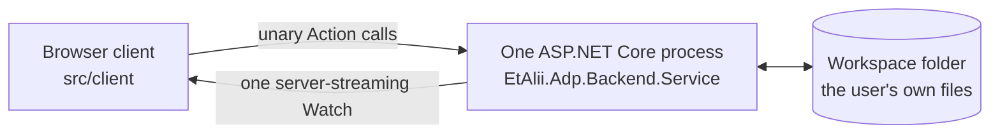

# The architecture

**What ADP is, how its parts talk, and where a diagram lives.** Written for a session that has just arrived and would otherwise re-derive this from the tree. Its companion is [solution-structure.md](solution-structure.md), which answers *where the code is* rather than *what the system is*.

## What ADP is

ADP — *A Different Perspective* — is a family of specialized, task-tuned tools: diagrams, designers and editors, hosted in several IDEs. This repository is the **standalone host**: it opens diagrams from a user's own workspace folder, draws them, and lets them be edited. The diagrams stay plain text files in that folder: diffable, version-controlled, owned by whatever tool already understood their format.

Its reason for existing, and what it is for, are in [`product.md`](../.spec-workflow/steering/product.md). This page does not repeat them.

## The three parts, and the single boundary

**What each part is built with.** The server side is .NET, on the SDK pinned by `src/global.json`. The client is React with TypeScript, built by Vite. Between them is gRPC, reaching the browser over grpc-web on ASP.NET Core's gRPC-Web middleware. Authentication sits on the gRPC calls themselves - `SessionInterceptor` in `EtAlii.Adp.Authentication` - rather than in a gateway in front of them.

**One process, not two.** ASP.NET Core serves the built client as static files *and* hosts the gRPC-Web endpoint. There is no separate frontend server in production: `EtAlii.Adp.Backend.Service` is the whole server side. In local development Vite runs as a dev server and ASP.NET Core proxies to it, purely so edits hot-reload — the browser still talks to the ASP.NET Core port, and in production Vite is not running at all.

**The boundary is the filesystem, and only one side crosses it.** The backend is the sole owner of reading and writing diagram files; the client never touches the filesystem and only speaks gRPC. Access is scoped to workspace folders the user explicitly opened, not the whole machine.

**`.proto` is the other boundary, and it is the stable one.** The contracts in `src/api` are what backend and frontend agree on; either side's implementation may change freely while the contract holds. Neither keeps its own copy of a contract.

**Today it runs standalone and locally** — a backend giving local file access, and a client in a browser or in a locally hosted window without the browser's chrome. Being hosted for remote use, and being partially embedded in VS Code, are both intended and neither is built; nothing here assumes they never arrive.

## The two call legs

A browser speaking grpc-web can open neither bidirectional nor client streaming, so everything two-way is expressed as **two correlated one-way legs**:

- **Client to backend — unary `Action` calls.** Reporting a selection, running an action, proposing a value, updating a viewport. `ContextService`'s `Select`, `ExecuteAction`, `ProposeInput`, `SubmitInteraction` and `CancelInteraction` are the worked examples.
- **Backend to client — one server-streaming `Watch`.** Everything the backend initiates rides the stream that connection already has open: `WorkspaceService.Watch`, whose message carries the context's messages, the hierarchy's changes and the deltas of every diagram open on the connection, each as a member of its own. **A feature that needs to push something new adds a member to that stream's message, never a second stream.** A diagram joins that stream through the unary `OpenDiagram` and leaves through `CloseDiagram`, under a stream id the client generates, rather than by opening a call of its own.
- **Why one, and not one per source.** Over cleartext HTTP/1.1 every live stream holds one of the browser's six connections per origin, shared by every tab of that browser profile. A tab once held three - `ContextService.Watch`, `HierarchyService.WatchHierarchy` and a `DiagramService.Open` - and a second tab exhausted the pool, after which nothing on that origin answered. Serving over TLS removes the cap, since HTTP/2 multiplexes everything onto one connection; one stream per tab is the robustness beside it (`two-tab-connection-wedge`). Those three RPCs are still declared, and the backend's integration tests drive the sources through them; the client opens none of them, and `oneStreamPerTab.test.tsx` fails if it starts to.
- **Correlated by a connection id**, carried on every call of both legs, which is what lets an `Action` on one HTTP request affect the stream opened by another. Today it is the `watch_id` the workspace, hierarchy, context and diagram calls share, a `ShortGuid` the client generates once per mounted shell.
- **One stream per connection, not one per consumer.** The client opens `Watch` once and fans the result out in-process, through a React context at the shell level. Several panels wanting the same push is not a reason for several streams.
- **Per-connection state dies with the stream**, keyed by that id and never shared with another connection — not even the same user on the same project. `IHierarchyModelStore`, `IContextSelectionStore`, `IContextInteractionStore` and `WorkspaceConnections` each hold theirs this way, and a diagram stream ends with the connection that carried it.
- **Reconnect by reopening `Watch` with the same id.** The stream's first message is always the current state, so a reconnected client is re-baselined without a protocol of its own.

**What rides the stream are deltas** — add, remove, update — so several open clients, and external edits the backend notices on disk, converge without anyone refreshing. **The client reconciles an incoming delta against its own not-yet-saved edits and does not silently discard them**, which is a client obligation and not something the protocol enforces.

**Large diagrams are handled by drawing less, not by storing less.** The client virtualizes to what is visible and tells the backend which part of the diagram it is looking at, so the backend can decide what is worth sending. That is why per-connection state includes a viewport: the backend remembers each connection's view.

## Where a diagram lives

A diagram is **a text file in the user's workspace**, in whatever format already owns it — never a database row. Beside it sits an `.adp` registration file, which is ADP's own.

**Authored layout goes in the registration, not the body.** When a format carries no layout of its own but authored positions make sense, the positions live in the `.adp`. The body belongs to the tool that owns its format, and positions ADP invented must not appear in its diffs. A format with native layout keeps using it; a type whose layout is computed and never authored stores nothing.

## How a diagram type plugs in

A diagram type is a folder holding up to five parts — `backend`, `api`, `client`, `examples` and, for a type whose palette, menus and property rows are derived from a DISL definition, `definition` — and is **discovered at runtime**: no core file names it, and deleting the folder removes the type.

**The dependency runs one way.** A module may depend on the core abstractions; core code must never depend on a particular diagram type, and the canvas, the storage layer and the sync machinery must not know any one type's schema. That is what lets a type be added without a core file changing. One module is worth reading in full rather than many; [creating-a-diagram-module.md](creating-a-diagram-module.md) walks one from end to end, and [creating-an-editor-module.md](creating-an-editor-module.md) does the same for the editor family.

## What the canvas is

**SVG, drawn by the shared canvas library in `src/client/src/canvas`.** Its library entry point is `src/client/src/canvas/library/DiagramCanvas.tsx`; a module's own canvas composes it rather than drawing its own surface.

There is **no Konva and no PixiJS** — neither appears in `src/client/package.json`, and no WebGL renderer was ever adopted. This sentence exists because the opposite was written down and believed, and because it is the kind of claim no guard on this page can catch.

## The subsystems, named not described

One line each, with the project that owns it. Their internals are deliberately out of scope here.

| Concern | Project |
| --- | --- |
| Open documents and their contents | `EtAlii.Adp.Documents` |
| Selection, actions, properties, prompts | `EtAlii.Adp.Context` |
| Commands and undo/redo | `EtAlii.Adp.History` |
| Errors and warnings | `EtAlii.Adp.Problems` |
| Known projects and workspace roots | `EtAlii.Adp.Projects` |
| A connection's lifetime and its state | `EtAlii.Adp.Sessions` |
| The workspace tree and file watching | `EtAlii.Adp.Hierarchy` |
| Diagram-type abstractions | `EtAlii.Adp.Diagram` |
| Editor-family abstractions | `EtAlii.Adp.Editor` |
| Reading and writing bodies through FBL bindings | `EtAlii.Adp.Specification.Fbl` |
| Evaluating CEL expressions, for FBL and DISL alike | `EtAlii.Adp.Specification.Cel` |
| Loading DISL specifications and the bundled definitions, building a diagram's model from a reading, and deriving its toolbox, context menus, property rows, findings and gesture refusals, and running its operations, hooks, deletion policy and retyping | `EtAlii.Adp.Specification.Disl` |

For how a subsystem behaves rather than which project holds it, read [`tech.md`](../.spec-workflow/steering/tech.md).

## What this page is not

**Descriptive, not normative.** It says what the system *is*; it does not tell anyone what to do. The rules live in [`CLAUDE.md`](../CLAUDE.md) and the steering documents, and when this page and a rule disagree, the rule wins and this page is stale.

**Refresh rule:** [`CLAUDE.md`, *The architecture pages*](../CLAUDE.md#the-architecture-pages) - update the page in the same change that makes one of its sentences false, as [*Documentation refresh*](../CLAUDE.md#documentation-refresh) asks of every delivered document.

**Not covered here, deliberately** (a later pass, each its own specification): per-module internals, the wire contracts and generated code, the client component tree below the canvas library, deployment and hosting, the editor family's internals, per-diagram-type behaviour, and runtime sequence diagrams.

**Its guard is `ArchitecturePages.Tests`** (`src/backend/EtAlii.Adp.Repository.Tests/ArchitecturePages.Tests.cs`), listed in [guards.md](guards.md). It checks that every path and project name here exists, that stated counts recompute, and that the page stays within its size limit.

**It cannot check whether a description is still accurate.** The Konva claim above would have passed every check the guard makes — `src/client/package.json` exists and the sentence states no count. **A wrong description on this page fails silently, and only a reader who knows better will catch it.**
